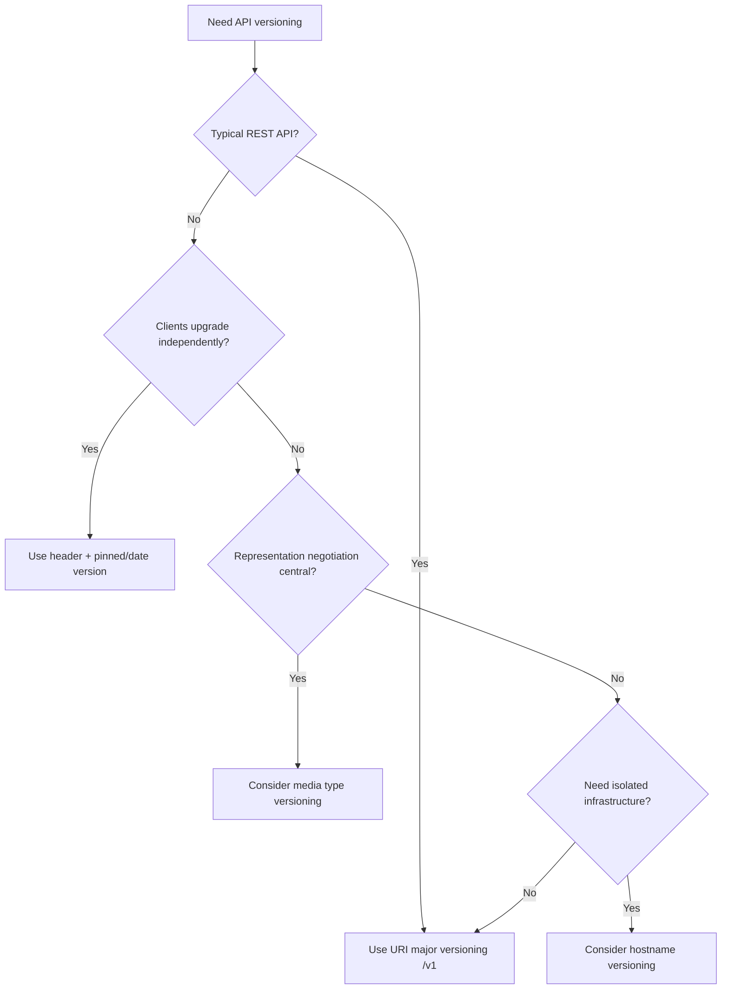
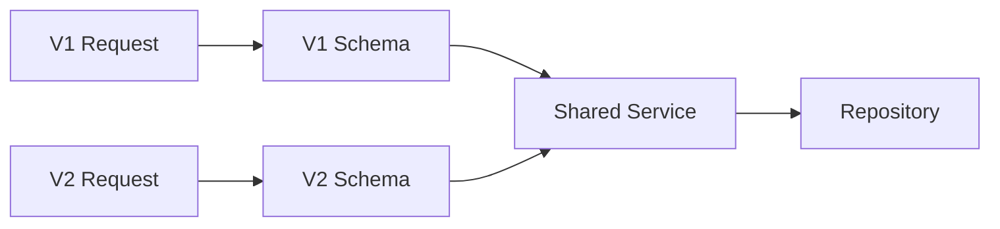
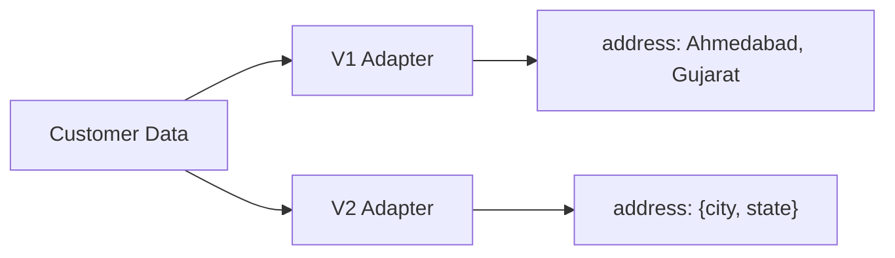
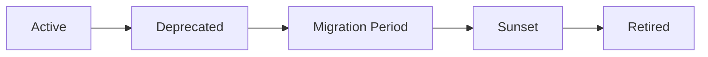

# API Versioning Strategies

> API versioning lets an API evolve without unexpectedly breaking existing clients.

## In Short

- Version an API when its **external contract changes incompatibly**.
- For most REST APIs, a simple major version in the URI is the practical default: `/api/v1/orders`.
- Add backward-compatible changes to the current version; create `v2` only for breaking changes.
- Large developer platforms may use a **date-based version in a header** so each customer can upgrade independently.
- Keep version-specific code near the API boundary—routers, request/response schemas, and adapters—while sharing domain services and repositories.
- Deprecate old versions gradually, monitor usage, publish a migration path, and retire them predictably.

```mermaid
flowchart LR
    C[Client] --> V1[/api/v1]
    C --> V2[/api/v2]
    V1 --> A1[V1 Schema / Adapter]
    V2 --> A2[V2 Schema / Adapter]
    A1 --> S[Shared Domain Service]
    A2 --> S
    S --> DB[(Database)]
```

---

# 1. What API Versioning Means

An API contract is more than its URL. It includes:

- Request and response fields
- Field types and validation
- HTTP methods and status codes
- Authentication behavior
- Error formats
- Pagination rules
- Default behavior
- Webhook payloads
- Business semantics

Suppose `v1` returns:

```json
{
  "id": 101,
  "name": "Aarav",
  "address": "Ahmedabad, Gujarat"
}
```

Later, the API wants a structured address:

```json
{
  "id": 101,
  "name": "Aarav",
  "address": {
    "city": "Ahmedabad",
    "state": "Gujarat"
  }
}
```

Changing `address` from a `string` to an `object` can break existing clients. That is the kind of change that normally requires a new major API version.

---

# 2. When Should the Version Change?

## Breaking Changes

A new major version is usually needed when an existing client can no longer safely use the contract.

| Change | Breaking? |
|---|---|
| Remove or rename a field | Yes |
| Change `string` to `object` | Yes |
| Add a required request field | Yes |
| Make an optional field required | Yes |
| Change HTTP method | Yes |
| Change authentication requirements | Yes |
| Add stricter validation that rejects old requests | Usually |
| Change existing field meaning/default behavior | Usually |
| Remove an enum value | Yes |

## Usually Backward-Compatible Changes

| Change | Usually Compatible? |
|---|---|
| Add a new endpoint | Yes |
| Add an optional request field | Yes |
| Add a response field | Yes |
| Add an optional filter/header | Yes |
| Improve performance | Yes |
| Internal refactoring | Yes |

An additive change can still expose weak client implementations. For example, a client that rejects unknown JSON fields or handles enum values with an exhaustive switch may fail when the server adds something new.

A good compatibility check covers three levels:

1. **Wire compatibility** — can the old client still serialize/deserialize the message?
2. **Behavior compatibility** — does the API still behave as the client expects?
3. **Source compatibility** — for generated/typed SDKs, will existing client code still compile?

---

# 3. Where Can the Version Be Supplied?

Version **placement** and version **naming** are separate decisions.

## 3.1 URI Path Versioning

```http
GET /api/v1/orders/5001
GET /api/v2/orders/5001
```

**Best fit:** most public, partner, mobile, and business REST APIs.

**Why it is common:**

- Easy to understand
- Visible in logs and documentation
- Simple gateway routing
- Easy to test with browser, Postman, and `curl`
- Cache-friendly because versions have different URLs

For most normal backend systems, this is the best default.

---

## 3.2 Query Parameter Versioning

```http
GET /api/orders/5001?api-version=2
```

Useful when version selection is treated as request configuration.

**Trade-off:** simple to add, but easier for clients to omit and less visible than path versioning.

---

## 3.3 Header Versioning

```http
GET /api/orders/5001
X-API-Version: 2026-03-10
```

**Best fit:** large platforms where different customers upgrade at different times.

Advantages:

- Resource URL stays unchanged
- Supports per-account or per-request version pinning
- Works well with SDK-driven APIs

Trade-offs:

- Version is not visible in the URL
- Gateways, caches, logs, and metrics must explicitly account for the header

Real-world examples include GitHub's `X-GitHub-Api-Version` and Stripe's `Stripe-Version`.

---

## 3.4 Media Type Versioning

```http
Accept: application/vnd.example.v2+json
```

This uses HTTP content negotiation to select a representation.

**Best fit:** APIs where media types and representation negotiation are central.

For a typical JSON REST API, it is usually more complexity than needed.

---

## 3.5 Hostname Versioning

```text
https://v1.api.example.com/orders
https://v2.api.example.com/orders
```

Use this when versions need **strong infrastructure isolation**, not merely because a response schema changed.

It adds DNS, TLS, deployment, authentication, and operational complexity.

---

# 4. How Should Versions Be Named?

## Major Versions

```text
v1
v2
v3
```

This is the simplest model for normal REST APIs.

```text
/api/v1/orders
/api/v2/orders
```

Create a new major version only for incompatible contract changes.

Google's API guidance uses major versions in REST URI paths.

## Semantic Versions

```text
2.4.1
```

Semantic Versioning is useful for:

- SDKs
- Client libraries
- Packages
- Deployable services

Avoid exposing every minor and patch release in REST URLs:

```text
Avoid: /api/v2.4.1/orders

Prefer:
API: /api/v2/orders
SDK: example-sdk==2.4.1
```

## Calendar Versions

```text
2026-03-10
2026-07-29.dahlia
```

Useful for platforms releasing contract updates frequently and allowing customers to upgrade independently.

As of August 2026:

- GitHub documents `2026-03-10` as a supported REST API version.
- Stripe documents `2026-07-29.dahlia` as its current API version.

---

# 5. Practical Selection Guide



A practical default policy is:

```text
1. Start with /api/v1.
2. Add backward-compatible features to v1.
3. Create /api/v2 only for unavoidable breaking changes.
4. Run v1 and v2 together during migration.
5. Keep core business logic shared.
6. Deprecate v1 with a published migration period.
7. Retire v1 after usage has moved away.
```

---

# 6. Version Routing Architecture

The API version should mainly adapt the **external contract**.

```text
api/
├── v1/
│   ├── routes.py
│   └── schemas.py
├── v2/
│   ├── routes.py
│   └── schemas.py
├── services/
│   └── customer_service.py
└── repositories/
    └── customer_repository.py
```

### Version-specific

- Routers
- Request schemas
- Response schemas
- Contract adapters

### Usually shared

- Domain services
- Repositories
- Database models
- Core business rules



This avoids duplicating the whole application for every API version.

---

# 7. Practical FastAPI Example

Here `v1` returns an address string while `v2` returns a structured address. Both versions use the same service data.

```python
from fastapi import APIRouter, FastAPI
from pydantic import BaseModel

app = FastAPI()

CUSTOMERS = {
    1: {
        "id": 1,
        "name": "Aarav",
        "city": "Ahmedabad",
        "state": "Gujarat",
    }
}


def get_customer(customer_id: int) -> dict:
    return CUSTOMERS[customer_id]


# ---------- V1 contract ----------

class CustomerV1(BaseModel):
    id: int
    name: str
    address: str


v1 = APIRouter(prefix="/api/v1")


@v1.get("/customers/{customer_id}", response_model=CustomerV1)
def read_customer_v1(customer_id: int):
    customer = get_customer(customer_id)

    return CustomerV1(
        id=customer["id"],
        name=customer["name"],
        address=f'{customer["city"]}, {customer["state"]}',
    )


# ---------- V2 contract ----------

class AddressV2(BaseModel):
    city: str
    state: str


class CustomerV2(BaseModel):
    id: int
    full_name: str
    address: AddressV2


v2 = APIRouter(prefix="/api/v2")


@v2.get("/customers/{customer_id}", response_model=CustomerV2)
def read_customer_v2(customer_id: int):
    customer = get_customer(customer_id)

    return CustomerV2(
        id=customer["id"],
        full_name=customer["name"],
        address=AddressV2(
            city=customer["city"],
            state=customer["state"],
        ),
    )


app.include_router(v1)
app.include_router(v2)
```

The important design point is that only the external schemas and adapters change.



---

# 8. Deprecation and Sunset

Creating `v2` is only half the work. The old version also needs a controlled retirement process.



## Recommended Lifecycle

1. Release the new version.
2. Publish breaking changes and migration instructions.
3. Keep both versions working during the migration window.
4. Mark the old version as deprecated.
5. Monitor requests by API version and client.
6. Contact remaining consumers.
7. Retire the old version after the announced sunset.

Current HTTP standards provide useful lifecycle headers.

```http
Deprecation: @1814313600
Sunset: Thu, 30 Sep 2027 23:59:59 GMT
Link: <https://developer.example.com/migrations/v1-to-v2>; rel="deprecation"
```

Important:

- `Deprecation` is standardized by **RFC 9745** and carries a date value.
- `Sunset` is defined by **RFC 8594** and indicates when a resource is expected to become unavailable.
- The sunset date must not be earlier than the deprecation date.

After retirement, an explicitly requested old version can return:

```http
HTTP/1.1 410 Gone
Content-Type: application/problem+json
```

```json
{
  "title": "API version retired",
  "status": 410,
  "detail": "API version v1 is no longer supported."
}
```

---

# 9. Webhooks, Testing, and Monitoring

## Webhooks Are Separate Contracts

Changing the REST API version does not automatically make webhook payload changes safe.

A webhook endpoint should normally have its own pinned payload/API version.

```json
{
  "id": "evt_123",
  "type": "invoice.paid",
  "api_version": "2026-03-10",
  "data": {
    "object": {}
  }
}
```

Stripe, for example, supports storing an API version on webhook endpoints.

## Contract Testing

Test every supported version independently:

```text
tests/
├── contract/
│   ├── v1/
│   └── v2/
└── integration/
```

Verify:

- Required fields
- Data types
- Status codes
- Error shape
- Authentication behavior
- Pagination behavior
- Version-specific responses

Automated OpenAPI/schema diff checks can also catch accidental breaking changes before deployment.

## Monitoring

Add the resolved API version to:

- Structured logs
- Metrics
- Distributed traces
- Error reports
- Audit events

Example:

```json
{
  "method": "GET",
  "path": "/api/v1/customers/1",
  "api_version": "v1",
  "client_id": "mobile-app",
  "status_code": 200
}
```

Without version-level usage data, retiring an old contract becomes guesswork.

---

# 10. Best Practices to Remember

- Use `/api/v1` as the default approach for most REST APIs.
- Version only **breaking external contract changes**.
- Keep backward-compatible additions inside the current major version.
- Do not expose minor/patch versions in ordinary REST paths.
- Keep API schemas separate from database/domain models.
- Share services and repositories across API versions where behavior is unchanged.
- Require or clearly define version selection for production integrations.
- Keep the number of simultaneously supported versions small.
- Version webhook contracts explicitly.
- Publish a compatibility and deprecation policy.
- Monitor version usage before retirement.
- Use contract tests and schema diff checks in CI/CD.

## Interview-Ready Summary

A strong practical approach is to put the major API version in the URI, such as `/api/v1/orders`, and introduce `/api/v2` only when the external contract changes incompatibly. Keep routers and schemas version-specific but reuse the same domain services and repositories. During migration, run both versions in parallel, monitor usage, publish a migration guide, and communicate deprecation and sunset dates before retiring the old version. For very large developer platforms where customers upgrade independently, a pinned date-based version in a request header can be a better model.

---

# References

- GitHub REST API Versions — https://docs.github.com/en/rest/about-the-rest-api/api-versions
- Stripe API Versioning — https://docs.stripe.com/api/versioning
- Google AIP-185: API Versioning — https://google.aip.dev/185
- RFC 9745: Deprecation HTTP Response Header Field — https://www.rfc-editor.org/rfc/rfc9745.html
- RFC 8594: Sunset HTTP Header Field — https://www.rfc-editor.org/rfc/rfc8594.html
