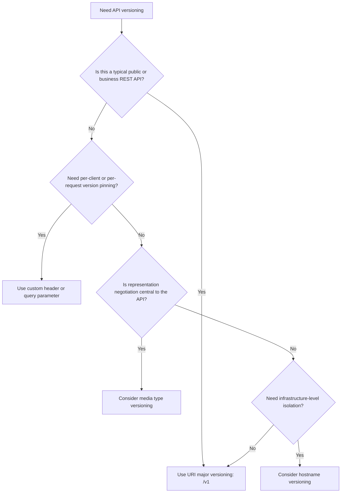
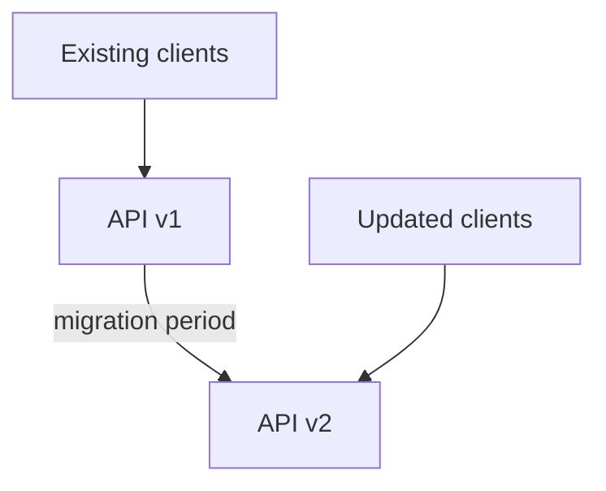
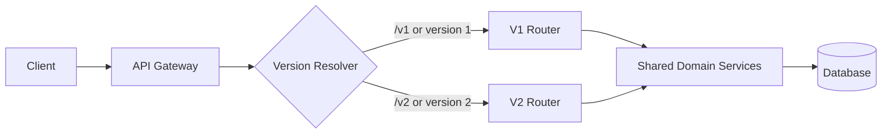
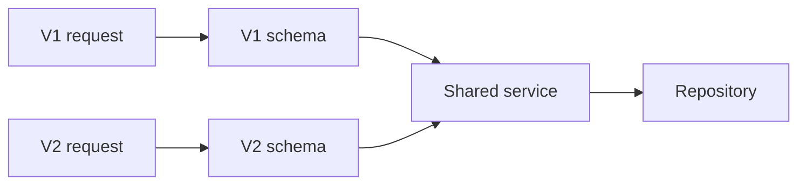
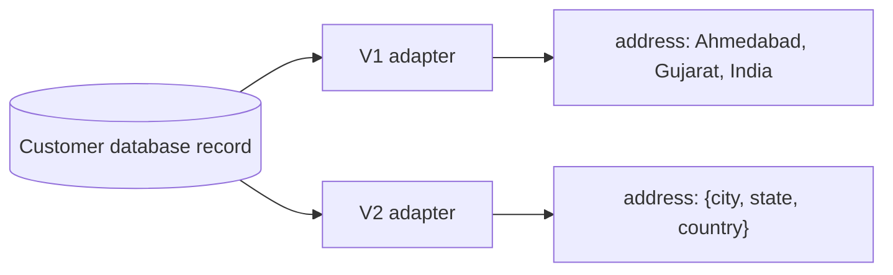
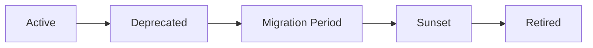
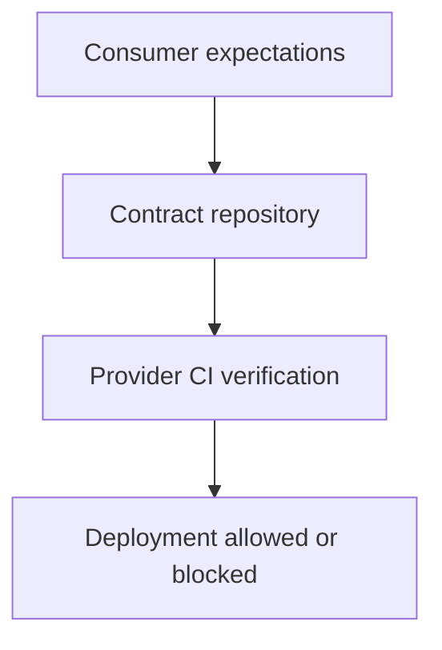
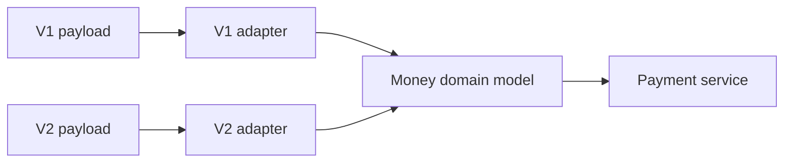

# API Versioning Strategies

> Understand how REST APIs evolve without unexpectedly breaking existing clients.

## In short

- Versioning answers two independent questions: where the version is supplied (URI path, query parameter, header, media type, hostname) and how it is named (`v1`, semantic version, calendar date, stability channel).
- URI path versioning such as `/api/v1/customers/101` is visible in logs, caches, and documentation, and is the practical default for most public and business APIs.
- A header or query parameter suits platforms that pin a contract per client, media type versioning suits hypermedia APIs, and a separate hostname suits infrastructure-level isolation.
- Breaking changes are removals, renames, type changes, newly required fields, and stricter validation; new endpoints and optional fields are backward compatible.
- Expose major versions only, so `/api/v2` rather than `/api/v2.4.1`, and keep semantic versions for SDK packages instead of endpoint URLs.
- Tolerant clients ignore unknown response fields and unexpected enum values; servers keep old fields during migration and never reuse a removed field name.
- Retire predictably: run both versions in parallel, send `Deprecation` and `Sunset` headers with a migration link, monitor usage per version, then return `410 Gone`.



**Interview answer:** Put the major version in the URI path, `/api/v1/orders`, and create `v2` only when a change breaks the contract; everything backward compatible is added to the version already in use. Both versions run in parallel behind shared domain services, so only routers and schemas are duplicated, and the old version is deprecated with `Deprecation` and `Sunset` headers before it is retired. For a large platform whose customers upgrade independently, pin a calendar version through a header such as `X-API-Version: 2026-03-10` instead.

**Gotcha:** Assuming additive changes are always safe — a new response field or a new enum value still breaks clients that reject unknown fields or switch exhaustively over enum values.

---

# 1. What Is API Versioning?

API versioning is the process of maintaining multiple forms of an API contract so that the API can evolve without immediately breaking existing consumers.

An API contract includes more than endpoint URLs. It also includes:

- Request fields and their validation rules
- Response fields and data types
- HTTP methods and status codes
- Authentication and authorization behavior
- Default values
- Error response formats
- Pagination behavior
- Webhook payloads
- Business behavior and semantics

For example, suppose version 1 returns a customer's address as a string:

```json
{
  "id": 101,
  "name": "Aarav",
  "address": "Ahmedabad, Gujarat"
}
```

A redesigned response may return a structured address:

```json
{
  "id": 101,
  "name": "Aarav",
  "address": {
    "city": "Ahmedabad",
    "state": "Gujarat",
    "country": "India"
  }
}
```

A client expecting `address` to be a string may fail when it becomes an object. The redesigned contract should therefore normally be introduced through a new major API version.

---

# 2. Why API Versioning Is Needed

Once an API is used by mobile applications, external customers, partner systems, or independent internal teams, the API provider cannot control when every consumer upgrades.

Without versioning, a breaking server change can cause:

- Deserialization failures
- Mobile application crashes
- Failed partner integrations
- Incorrect business calculations
- Broken webhook processing
- Unexpected authorization failures
- Production incidents across multiple services

API versioning creates a controlled migration period:



The main objective is not to preserve old code forever. It is to give clients a predictable and well-communicated path to migrate.

---

# 3. When Should an API Version Change?

A new version is mainly required when the API introduces a **breaking contract change**.

## Changes That Usually Require a New Major Version

- Removing an endpoint
- Removing or renaming a request field
- Removing or renaming a response field
- Changing a field's data type
- Making an optional field required
- Adding a new required request field
- Changing the meaning of an existing field
- Changing a default value in a way that affects behavior
- Changing authentication requirements
- Changing an endpoint's HTTP method
- Changing error response structure
- Changing pagination semantics
- Removing an enum value
- Introducing stricter validation that rejects previously valid requests

Example:

```text
Before: status accepts "active", "inactive", and "pending"
After:  status accepts only "active" and "inactive"
```

Removing `pending` is a breaking change for clients that send or process it.

## Changes That Are Usually Backward Compatible

- Adding a new endpoint
- Adding an optional request field
- Adding a response field
- Adding an optional header
- Fixing internal implementation details
- Improving performance
- Adding an optional filter
- Adding a new capability without changing existing behavior

However, even additive changes can break poorly implemented clients.

For example, adding a response field is normally safe, but it can break clients that reject unknown fields. Adding an enum value may break a client with a non-exhaustive switch statement.

Therefore, compatibility must be considered at three levels:

1. **Source compatibility** – Will client code still compile?
2. **Wire compatibility** – Can old clients still serialize and deserialize messages?
3. **Semantic compatibility** – Does the API still behave as clients reasonably expect?

---

# 4. Two Independent Versioning Decisions

API versioning discussions often mix two separate questions.

## Decision 1: Where Is the Version Specified?

Examples:

```text
/api/v1/users
/api/users?version=1
X-API-Version: 1
Accept: application/vnd.example.v1+json
```

## Decision 2: How Is the Version Named?

Examples:

```text
v1
v2
2026-03-10
2026-07-29.dahlia
v1beta
v1alpha
```

A date-based version can still be supplied through a header, and a major version number can still be placed in a URI.

For example:

```http
GET /users/101 HTTP/1.1
Host: api.example.com
X-API-Version: 2026-03-10
```

Here:

- **Placement strategy:** custom header
- **Naming strategy:** calendar-based version

---

# 5. API Version Placement Strategies

# 5.1 URI Path Versioning

The version is included in the endpoint path.

```http
GET /api/v1/customers/101
GET /api/v2/customers/101
```

## Advantages

- Easy to understand and use
- Visible in browser history, logs, metrics, and documentation
- Simple routing through API gateways and reverse proxies
- Easy to test with `curl`, Postman, and browsers
- Cache-friendly because each version has a different URI
- Works well for public APIs and ordinary application APIs

## Disadvantages

- The version becomes part of the resource URI
- HATEOAS links must include the correct version
- Moving clients to another version requires URL changes
- Supporting many active versions can create duplicated routing and code

## Suitable For

- Public REST APIs
- Partner APIs
- Mobile backends
- APIs with a small number of major versions
- Teams that value simplicity and discoverability

## Example

```http
GET /api/v1/orders/5001
```

```json
{
  "id": 5001,
  "total": 1200
}
```

```http
GET /api/v2/orders/5001
```

```json
{
  "id": 5001,
  "amount": {
    "value": 1200,
    "currency": "INR"
  }
}
```

URI path versioning is the most practical default for many business APIs.

---

# 5.2 Query Parameter Versioning

The version is passed as a query parameter.

```http
GET /api/customers/101?version=1
GET /api/customers/101?version=2
```

It can also use a date, as in `GET /api/customers/101?api-version=2026-03-10`.

## Advantages

- Keeps the base resource path unchanged
- Easy to test manually
- Can be added without restructuring all paths
- Supported by many API management platforms

## Disadvantages

- Easy for a client to omit
- Version parameters may be mixed with business filters
- API gateway and cache configuration needs care
- Less visually clear than path versioning
- Generated links must preserve the query parameter

## Suitable For

- Platform-managed APIs
- APIs where query-based routing is already established
- APIs that treat version as request configuration

## Example

```http
GET /api/reports/42?api-version=2026-01-01
```

Avoid ambiguous parameter names such as `?v=2`. Prefer an explicit name such as `?api-version=2`.

---

# 5.3 Custom Header Versioning

The version is sent through a request header.

```http
GET /api/customers/101 HTTP/1.1
Host: api.example.com
X-API-Version: 2
```

A date-based value uses the same header, as in `X-API-Version: 2026-03-10`.

GitHub uses this general approach with a date-based `X-GitHub-Api-Version` header. Stripe allows clients to override the API version through the `Stripe-Version` header.

## Advantages

- Keeps resource URLs clean
- Version selection is separate from resource identity
- Supports account-level or request-level version pinning
- Useful when different customers upgrade at different times
- Works well for large platform APIs and SDK-based integrations

## Disadvantages

- The version is not visible in the URL
- Harder to test directly in a browser
- Clients must remember to send the header
- API gateway, CDN, and cache configuration must vary by header
- Observability systems must explicitly capture the header
- Generated links do not automatically communicate the version

## Suitable For

- Developer platforms
- Payment APIs
- APIs accessed mainly through SDKs
- APIs requiring per-client version pinning
- APIs using calendar-based releases

## Example

```bash
curl "https://api.example.com/customers/101" \
  -H "Authorization: Bearer <token>" \
  -H "X-API-Version: 2026-03-10"
```

The server should define what happens when the header is:

- Missing
- Invalid
- Unsupported
- Deprecated
- Retired

Silent fallback to a different version can be dangerous. A strict error is generally safer for unsupported explicit versions.

---

# 5.4 Media Type Versioning

The version is included in the `Accept` header through a vendor-specific media type.

```http
GET /api/customers/101 HTTP/1.1
Accept: application/vnd.example.v1+json
```

Version 2: `Accept: application/vnd.example.v2+json`

The server returns the selected representation: `Content-Type: application/vnd.example.v2+json`

## Advantages

- Aligns version selection with HTTP content negotiation
- Keeps the resource URI unchanged
- Can represent different forms of the same resource
- Fits APIs that make strong use of HATEOAS and media types

## Disadvantages

- More difficult for many developers to understand
- Harder to test in a browser
- Requires careful `Accept` and `Content-Type` handling
- API tools and documentation may need additional configuration
- Cache layers must correctly use the `Vary: Accept` response header
- Often feels overly complex for ordinary JSON APIs

## Suitable For

- APIs deeply aligned with HTTP content negotiation
- Hypermedia APIs
- APIs where multiple representations are a core requirement

## Example

```http
GET /api/products/10 HTTP/1.1
Accept: application/vnd.shop.product-v2+json
```

```http
HTTP/1.1 200 OK
Content-Type: application/vnd.shop.product-v2+json
Vary: Accept
```

```json
{
  "id": 10,
  "name": "Mechanical Keyboard",
  "price": {
    "amount": 4999,
    "currency": "INR"
  }
}
```

---

# 5.5 Hostname Versioning

Each version is exposed through a different hostname, such as `https://v1.api.example.com/customers/101` and `https://v2.api.example.com/customers/101`.

## Advantages

- Strong isolation between versions
- Different infrastructure can serve each version
- Useful for major platform rewrites or regional deployments

## Disadvantages

- Requires additional DNS, TLS, gateway, and deployment management
- More operationally expensive
- Authentication, cookies, CORS, and SDK configuration become more complex
- Often unnecessary for ordinary API evolution

## Suitable For

- Large infrastructure migrations
- Independently deployed API generations
- Strict isolation requirements

This strategy should normally be chosen for operational isolation, not merely because a response field changed.

---

# 6. API Version Naming Strategies

# 6.1 Major Version Numbers

Versions use simple major numbers such as `v1`, `v2`, and `v3`.

## Characteristics

- A new major version represents breaking changes
- Backward-compatible improvements are added to the current major version
- Clients do not select minor or patch versions

Google's API guidance uses major versions such as `v1`, rather than exposing versions such as `v1.1` or `v1.4.2` for normal API consumers.

## Advantages

- Easy to understand
- Stable URLs and documentation
- Avoids excessive version fragmentation
- Encourages backward-compatible evolution

## Recommended Usage

```text
/api/v1/orders
/api/v2/orders
```

Use this approach for most business REST APIs.

---

# 6.2 Semantic Versioning

Semantic Versioning uses: `MAJOR.MINOR.PATCH`

Example: `2.4.1`

Typical meaning:

- `MAJOR` – breaking change
- `MINOR` – backward-compatible feature
- `PATCH` – backward-compatible fix

Semantic Versioning is very useful for:

- SDKs
- Client libraries
- Packages
- Deployable services
- OpenAPI artifacts

It is usually unnecessary to expose every minor and patch version in REST endpoint URLs.

Avoid: `/api/v2.4.1/orders`

This creates too many externally visible versions and makes routing, documentation, and support more difficult.

A better model is:

```text
Public API: /api/v2/orders
SDK package: example-sdk==2.4.1
```

---

# 6.3 Calendar-Based Versioning

The version is based on a release date.

```text
2026-03-10
2026-07-29
```

Some providers combine a date with a release name: `2026-07-29.dahlia`

## Advantages

- Clearly communicates when the contract was introduced
- Avoids debates about whether a change deserves `v2` or `v3`
- Works well for frequent platform releases
- Helps customers understand version age and support windows
- Supports per-request or per-account version pinning

## Disadvantages

- Does not directly communicate the size of a change
- Clients must track many possible release dates
- Requires excellent changelogs and migration documentation
- More complex than major versions for smaller APIs

## Suitable For

- Large developer platforms
- Payment and infrastructure APIs
- APIs with frequent contract releases
- APIs that support customer-specific upgrade timing

GitHub's REST API uses date-based versions and sends them through a request header. Stripe also uses dated API releases and supports version selection through a header or account configuration.

---

# 6.4 Stability Channels

Versions indicate stability levels:

```text
v1alpha
v1beta
v1
```

A common flow is: `v1alpha ──► v1beta ──► v1`

## Channel Meanings

### Alpha

- Experimental
- May change without strong compatibility guarantees
- Not recommended for critical production workloads

### Beta

- More stable than alpha
- Suitable for controlled production testing
- May still introduce breaking changes with notice

### Stable

- Production-ready
- Strong backward-compatibility expectations
- Breaking changes require a new major version or migration process

Google's current guidance recommends channel-based versioning for alpha, beta, and stable API surfaces.

Do not confuse a stability channel with a normal major version. `v1beta` indicates maturity, while `v2` indicates a new incompatible stable contract.

---

# 7. Strategy Comparison

| Strategy | Example | Visibility | Client Simplicity | Cache Friendliness | Best Fit |
|---|---|---:|---:|---:|---|
| URI path | `/api/v2/orders` | High | High | High | Most public and business APIs |
| Query parameter | `/orders?api-version=2` | Medium | High | Generally good | Platform-managed APIs |
| Custom header | `X-API-Version: 2` | Low | Medium | Requires configuration | SDK and platform APIs |
| Media type | `Accept: application/vnd.example.v2+json` | Low | Low | Requires `Vary` handling | Hypermedia/content negotiation |
| Hostname | `v2.api.example.com` | High | Medium | High | Strong infrastructure isolation |

## Practical Selection Guide

Use URI major versioning for a typical public or business REST API. Choose a custom header or a query parameter when clients need per-request or per-account version pinning, media type versioning when representation negotiation is central to the API, and hostname versioning only when infrastructure-level isolation is required.

A practical default is a URI path plus a major version number, `/api/v1/resources`. A practical platform pattern is a calendar-based version carried in a header, `X-API-Version: 2026-03-10`.

---

# 8. Backward-Compatible and Breaking Changes

## Compatibility Matrix

| Change | Usually Compatible? | Notes |
|---|---:|---|
| Add an endpoint | Yes | Existing consumers are unaffected |
| Add an optional request field | Yes | Its omitted behavior must preserve old behavior |
| Add a response field | Usually | Clients should tolerate unknown fields |
| Add an enum value | Risky | Exhaustive client logic may fail |
| Remove a response field | No | Existing consumers may depend on it |
| Rename a field | No | Equivalent to removing and adding |
| Change `string` to `object` | No | Breaks deserialization and client code |
| Add a required request field | No | Old clients will not send it |
| Make validation stricter | Often no | Previously accepted requests may fail |
| Change a default value | Often no | Behavior changes without client action |
| Improve performance | Yes | Contract remains unchanged |
| Fix a security vulnerability | Depends | Emergency changes may override normal policy |

## Tolerant Client Principle

Clients should generally:

- Ignore unknown response fields
- Avoid relying on JSON field order
- Handle documented enum expansion
- Avoid parsing undocumented text formats
- Handle optional fields safely

Servers should generally:

- Ignore unknown request fields only when explicitly safe
- Avoid changing default behavior
- Never reuse a removed field for a different meaning
- Keep old response fields during migration
- Add new fields before removing old ones

---

# 9. Recommended Versioning Approach

For most REST APIs, use the following policy:

```text
1. Start with /api/v1.
2. Add backward-compatible features to v1.
3. Create /api/v2 only for unavoidable breaking changes.
4. Run v1 and v2 in parallel during migration.
5. Publish migration documentation and a sunset date.
6. Monitor remaining v1 usage.
7. Retire v1 only after the communicated support period.
```

## Why Major-Only URI Versioning Works Well

It is:

- Easy for developers to discover
- Easy to route through gateways
- Easy to observe in logs and metrics
- Easy to document in OpenAPI
- Easy to support in browser and mobile clients
- Sufficient for most API evolution

## When Header-Based Calendar Versioning Is Better

Choose header-based date versions when:

- Thousands of integrations upgrade independently
- Every customer needs a pinned contract
- An SDK automatically selects the version
- API releases happen frequently
- Account-level version settings are required
- Webhooks must remain pinned to the contract active during endpoint creation

---

# 10. Version Routing Architecture

A gateway can route requests to different version handlers.



The version layer should mainly adapt the external contract. Core business logic should be shared where behavior remains the same.

```text
api/
├── v1/
│   ├── routes.py
│   └── schemas.py
├── v2/
│   ├── routes.py
│   └── schemas.py
├── services/
│   └── customer_service.py
└── repositories/
    └── customer_repository.py
```

Avoid copying the entire application for every version.

A better design is:



Only version the layers that are actually different.

---

# 11. Practical FastAPI Example

The following example exposes two URI-based API versions while sharing the same service.

```python
from typing import Annotated

from fastapi import APIRouter, FastAPI, HTTPException, Path
from pydantic import BaseModel

app = FastAPI(title="Customer API")

# -----------------------------
# Shared domain/service layer
# -----------------------------

CUSTOMERS = {
    1: {
        "id": 1,
        "name": "Aarav",
        "city": "Ahmedabad",
        "state": "Gujarat",
        "country": "India",
    }
}

def get_customer(customer_id: int) -> dict:
    customer = CUSTOMERS.get(customer_id)

    if customer is None:
        raise HTTPException(status_code=404, detail="Customer not found")

    return customer

# -----------------------------
# Version 1 contract
# -----------------------------

class CustomerV1(BaseModel):
    id: int
    name: str
    address: str

v1_router = APIRouter(prefix="/api/v1", tags=["Customers V1"])

@v1_router.get("/customers/{customer_id}", response_model=CustomerV1)
def read_customer_v1(
    customer_id: Annotated[int, Path(gt=0)],
) -> CustomerV1:
    customer = get_customer(customer_id)

    return CustomerV1(
        id=customer["id"],
        name=customer["name"],
        address=(
            f'{customer["city"]}, '
            f'{customer["state"]}, '
            f'{customer["country"]}'
        ),
    )

# -----------------------------
# Version 2 contract
# -----------------------------

class AddressV2(BaseModel):
    city: str
    state: str
    country: str

class CustomerV2(BaseModel):
    id: int
    full_name: str
    address: AddressV2

v2_router = APIRouter(prefix="/api/v2", tags=["Customers V2"])

@v2_router.get("/customers/{customer_id}", response_model=CustomerV2)
def read_customer_v2(
    customer_id: Annotated[int, Path(gt=0)],
) -> CustomerV2:
    customer = get_customer(customer_id)

    return CustomerV2(
        id=customer["id"],
        full_name=customer["name"],
        address=AddressV2(
            city=customer["city"],
            state=customer["state"],
            country=customer["country"],
        ),
    )

app.include_router(v1_router)
app.include_router(v2_router)
```

## Important Design Point

The database model and service are shared. Only the external schemas and route adapters differ.



This prevents duplicated business logic and makes old versions easier to maintain.

---

# 12. Deprecation and Sunset Strategy

Versioning is incomplete without a retirement process.

## Deprecation Lifecycle



## Recommended Process

### Step 1: Announce the New Version

Provide:

- Release notes
- Breaking-change list
- Migration guide
- Updated OpenAPI specification
- Updated SDKs
- Test or sandbox environment

### Step 2: Mark the Old Version as Deprecated

A deprecated version still works, but clients are told not to build new integrations on it.

Useful response headers include:

```http
Deprecation: true
Sunset: Wed, 30 Sep 2027 23:59:59 GMT
Link: <https://developer.example.com/migrations/v1-to-v2>; rel="deprecation"
```

The `Sunset` header communicates when the version is expected to become unavailable.

### Step 3: Monitor Version Usage

Track:

- Requests per version
- Active consumers per version
- Error rate per version
- Traffic from unknown clients
- Deprecated fields still in use
- Webhook endpoints using old payload versions

Example metric labels:

```text
api_requests_total{
  api_version="v1",
  client_id="partner-42",
  status="200"
}
```

### Step 4: Contact Remaining Consumers

Do not rely only on documentation. Notify affected consumers through:

- Dashboard notifications
- Email
- Developer portal alerts
- Account manager communication
- SDK warnings
- Response headers

### Step 5: Retire Predictably

After the sunset date, an explicitly requested retired version can return:

```http
HTTP/1.1 410 Gone
Content-Type: application/problem+json
```

```json
{
  "type": "https://developer.example.com/errors/api-version-retired",
  "title": "API version retired",
  "status": 410,
  "detail": "API version v1 was retired on 2027-09-30.",
  "migration_guide": "https://developer.example.com/migrations/v1-to-v2"
}
```

A `410 Gone` response clearly indicates that the version existed previously but is no longer available.

---

# 13. Versioning Webhooks and SDKs

API request versioning does not automatically solve webhook and SDK compatibility.

## Webhook Versioning

Webhook consumers depend on payload shape just like normal API clients.

Bad approach:

> Change every existing webhook payload immediately when v2 launches.

Better approaches:

- Store a version on each webhook endpoint
- Let consumers select a webhook version
- Keep the webhook payload version fixed until the consumer upgrades
- Include the event schema version in event metadata
- Provide replay testing before migration

Example:

```json
{
  "id": "evt_123",
  "type": "invoice.paid",
  "api_version": "2026-03-10",
  "created_at": "2026-07-30T10:00:00Z",
  "data": {
    "object": {}
  }
}
```

## SDK Versioning

The API version and SDK package version are related but not identical.

```text
API contract version: 2026-03-10
Python SDK version:   8.2.1
```

A strongly typed SDK may pin a specific API version so that:

- Generated models match API responses
- TypeScript, Java, Go, or C# types remain accurate
- Developers do not accidentally use an incompatible server contract

Document clearly:

- Which API version each SDK release supports
- Whether users can override the API version
- Whether overriding it can make generated types inaccurate
- How webhook versions relate to SDK versions

---

# 14. Documentation, Testing, and Monitoring

## Documentation

Each supported version should have:

- Its own OpenAPI document or clearly filtered specification
- Version-specific request and response examples
- A breaking-change changelog
- A migration guide
- Deprecation and sunset dates
- Supported SDK versions
- Clear default-version behavior

Example OpenAPI server configuration:

```yaml
openapi: 3.1.0
info:
  title: Orders API
  version: "2.0"
servers:
  - url: https://api.example.com/api/v2
paths:
  /orders:
    get:
      summary: List orders
      responses:
        "200":
          description: Orders returned successfully
```

Remember that `info.version` describes the API document. It does not automatically configure runtime version routing.

## Contract Testing

Test each supported contract independently:

```text
tests/
├── contract/
│   ├── v1/
│   │   └── test_customers.py
│   └── v2/
│       └── test_customers.py
└── integration/
    └── test_customer_service.py
```

Tests should verify:

- Required fields
- Field data types
- Status codes
- Error format
- Authentication behavior
- Pagination behavior
- Unknown-field handling
- Deprecated endpoint behavior
- Webhook payload versions

## Consumer-Driven Contract Testing

For important partner or microservice integrations, consumer-driven contract tests can verify that a provider change does not break known client expectations.

Typical flow:



## Monitoring

Add the resolved API version to:

- Structured logs
- Traces
- Metrics
- Audit events
- Error reports

Example log:

```json
{
  "request_id": "req_abc123",
  "method": "GET",
  "path": "/api/v1/customers/1",
  "api_version": "v1",
  "client_id": "mobile-app",
  "status_code": 200,
  "duration_ms": 32
}
```

This data is essential before retiring a version.

---

# 15. Practical Migration Example

Suppose version 1 uses: `POST /api/v1/payments`

```json
{
  "amount": 5000,
  "currency": "INR"
}
```

Version 2 introduces multi-component amounts and requires an idempotency key:

```http
POST /api/v2/payments
Idempotency-Key: 4ba91c1f-6c91-47ac-9953-4bb092e4d88e
```

```json
{
  "amount": {
    "value": 5000,
    "currency": "INR"
  }
}
```

## Migration Plan

```text
Phase 1
- Release v2.
- Continue supporting v1.
- Publish the migration guide.

Phase 2
- Update official SDKs.
- Add v1 deprecation headers.
- Ask selected consumers to test v2.

Phase 3
- Measure remaining v1 usage.
- Contact active v1 consumers.
- Stop accepting new v1 integrations.

Phase 4
- Reach the announced sunset date.
- Return 410 Gone for v1.
- Keep migration documentation available.
```

## Adapter-Based Implementation

```python
from dataclasses import dataclass

@dataclass(frozen=True)
class Money:
    value: int
    currency: str

def parse_v1_payment(payload: dict) -> Money:
    return Money(
        value=payload["amount"],
        currency=payload["currency"],
    )

def parse_v2_payment(payload: dict) -> Money:
    amount = payload["amount"]

    return Money(
        value=amount["value"],
        currency=amount["currency"],
    )
```

Both contracts are converted into the same internal domain model:



This is cleaner than maintaining separate payment business logic for every version.

---

# 16. Best Practices

## Version Only When Necessary

Do not create a new major version for every new optional field or endpoint.

```text
Good:
v1 receives backward-compatible additions.

Avoid:
v1, v1.1, v1.2, v1.3 exposed as separate REST routes.
```

## Prefer Explicit Versions

For production integrations, require clients to select or pin a version.

A moving default can cause unversioned clients to change behavior without a deployment.

## Keep the Number of Active Versions Small

Supporting many versions increases:

- Testing cost
- Security patching effort
- Documentation complexity
- On-call complexity
- Infrastructure cost
- Developer confusion

A common target is the current version plus one previous major version, depending on contractual support requirements.

## Separate External Contracts from Internal Models

Do not use database models directly as API response contracts.

```text
Database model ≠ Domain model ≠ API schema
```

Separate schemas allow the database and API to evolve independently.

## Share Business Logic

Keep version-specific code near the API boundary:

```text
Versioned:
- Routers
- Request schemas
- Response schemas
- Contract adapters

Usually shared:
- Domain services
- Repositories
- Database models
- Core business rules
```

## Make Additive Changes Safe

When adding an optional request field, preserve the old behavior when the field is absent.

```python
# Existing clients omit delivery_mode.
delivery_mode = request.delivery_mode or "standard"
```

Do not introduce a default that silently changes existing behavior.

## Do Not Reuse Removed Fields

If `customer_type` is removed, do not later reuse the same field name for a different meaning. Old clients or cached messages may still send it.

## Publish a Compatibility Policy

State clearly:

- What counts as a breaking change
- How long versions are supported
- How deprecation is announced
- Which emergency changes may occur
- What happens when a version is omitted
- What response is returned for retired versions

## Treat Security Separately

Critical security, privacy, availability, or legal issues may require changes outside the normal version schedule. The policy should reserve this ability while promising clear communication whenever practical.

## Version Webhook Contracts

An API may be backward compatible while its webhook payload breaks consumers. Treat webhook schemas as independent public contracts.

## Automate Contract Validation

Use:

- OpenAPI diff tools
- Schema compatibility checks
- Consumer-driven contract tests
- API linting
- Version-specific integration tests
- Changelog generation in CI/CD

A deployment should be blocked when an accidental breaking change is detected in an existing version.

---

# 17. Official References

- [Google AIP-185: API Versioning](https://google.aip.dev/185)
- [Google AIP-180: Backwards Compatibility](https://google.aip.dev/180)
- [Microsoft: Web API Design Best Practices](https://learn.microsoft.com/en-us/azure/architecture/best-practices/api-design)
- [GitHub REST API Versions](https://docs.github.com/en/rest/about-the-rest-api/api-versions)
- [Stripe API Versioning](https://docs.stripe.com/api/versioning)
- [RFC 8594: The Sunset HTTP Header Field](https://www.rfc-editor.org/rfc/rfc8594)
