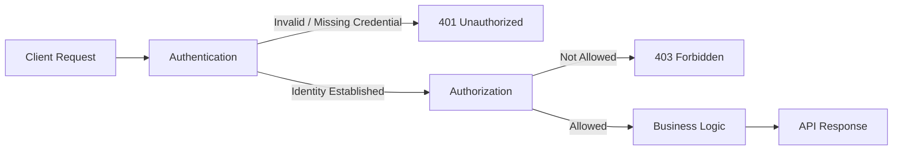
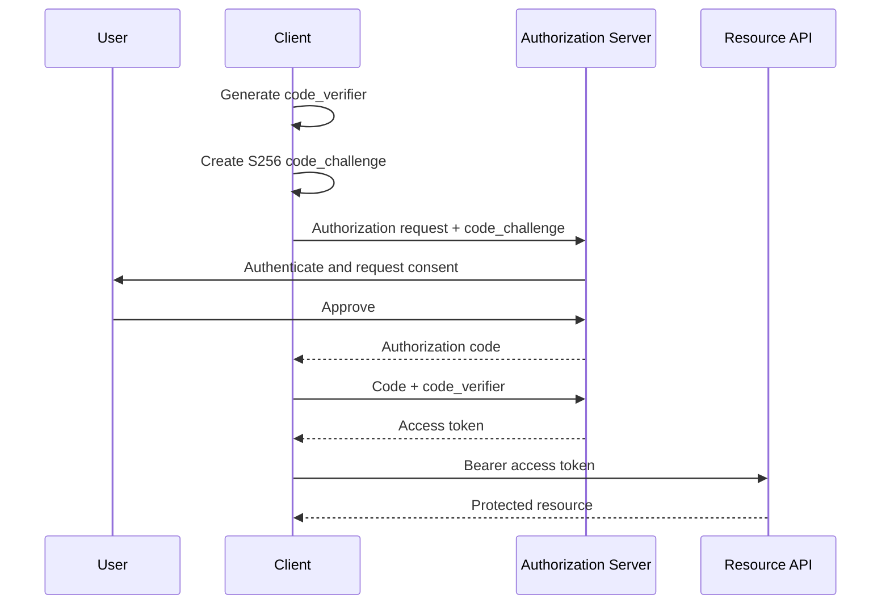
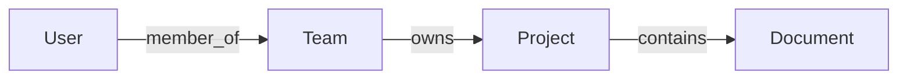
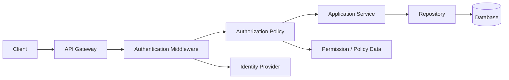
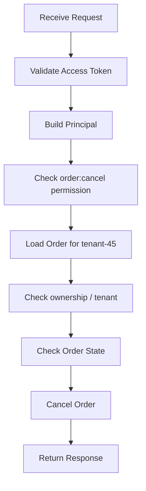

# Authentication and Authorization in REST APIs

> A practical mental model for securing production APIs.

> **Standards note — August 2026:** OAuth 2.0 remains the published authorization framework. OAuth 2.1 is still an active IETF Internet-Draft (`draft-ietf-oauth-v2-1-15`, March 2026), so production systems should follow OAuth 2.0 together with the published OAuth 2.0 Security Best Current Practice (RFC 9700). In practice, this means using Authorization Code with PKCE for interactive clients, avoiding the password grant, and not using the implicit grant for new applications.

## In short

- **Authentication (AuthN)** verifies **who or what is calling**.
- **Authorization (AuthZ)** decides **what that authenticated identity may do**.
- `401 Unauthorized` normally means authentication credentials are missing, invalid, expired, or unacceptable.
- `403 Forbidden` means the server understands the request but refuses the operation.
- **OAuth 2.x** is an authorization framework for delegated or service access.
- **OpenID Connect (OIDC)** adds user authentication and identity information on top of OAuth 2.0.
- **JWT** is a token format, not an authentication protocol.
- **API keys** normally identify applications or integrations, not human users.
- A valid token or scope is **not enough** by itself; the API must still enforce tenant, ownership, role, and business rules.



---

# Index

1. [The Big Picture](#1-the-big-picture)
2. [Authentication — AuthN](#2-authentication--authn)
3. [Authorization — AuthZ](#3-authorization--authz)
4. [AuthN vs AuthZ](#4-authn-vs-authz)
5. [OAuth 2.x and OpenID Connect](#5-oauth-2x-and-openid-connect)
6. [JWT and Opaque Access Tokens](#6-jwt-and-opaque-access-tokens)
7. [API Keys](#7-api-keys)
8. [Authorization Models](#8-authorization-models)
9. [Secure API Architecture](#9-secure-api-architecture)
10. [Practical Example](#10-practical-example)
11. [Production Best Practices](#11-production-best-practices)

---

# 1. The Big Picture

API security usually answers two separate questions:

```text
1. Who or what is making this request?  → Authentication
2. May it perform this action?          → Authorization
```

Authentication establishes a **principal** such as:

```json
{
  "subject": "user-123",
  "tenant_id": "tenant-45",
  "authentication_method": "password+mfa"
}
```

Authorization then evaluates that principal against the requested action and resource.

```text
Credential
   ↓
Authentication
   ↓
Principal / Identity
   ↓
Authorization Policy
   ↓
Allow or Deny
```

A successful login does **not** mean the user can access every API operation.

---

# 2. Authentication — AuthN

**Authentication** verifies the identity of a user, service, application, or device.

It answers:

> **Who are you?**

Common authentication methods include:

- Password + MFA
- Passkeys / WebAuthn
- Session cookies
- OAuth access tokens
- Client certificates
- Workload identity
- API keys for application identification

## 2.1 User authentication

Example login request:

```http
POST /auth/login HTTP/1.1
Content-Type: application/json

{
  "email": "alice@example.com",
  "password": "user-password"
}
```

After successful verification, the system may create a server-side session or issue tokens.

For passwords, use a modern password-hashing algorithm such as **Argon2id** or another framework-recommended secure password hasher. Never store passwords in plain text or reversible encryption.

## 2.2 Service authentication

A background worker normally authenticates as a **service**, not as a human user.

Common approaches:

```text
Service → OAuth Client Credentials → Access Token → Internal API
```

Other options include mutual TLS, signed client assertions, or cloud workload identity.

---

# 3. Authorization — AuthZ

**Authorization** determines whether an authenticated principal may perform a specific action.

It answers:

> **What are you allowed to do?**

Authorization can depend on:

- Role
- Permission
- OAuth scope
- Tenant
- Resource ownership
- Relationship
- Subscription plan
- Resource state
- Business rule
- Time, network, or device context

## 3.1 Permission check

```python
if "invoice:delete" not in current_user.permissions:
    raise ForbiddenError()
```

This is useful, but it is usually not sufficient.

## 3.2 Resource-level authorization

Suppose the API receives:

```http
GET /invoices/INV-500
```

A user may have `invoice:read`, but the API must still verify that the invoice belongs to the correct tenant.

```python
invoice = invoice_repository.get("INV-500")

if invoice.tenant_id != current_user.tenant_id:
    raise ForbiddenError()
```

This is commonly called **object-level** or **resource-level authorization**.

A useful mental model is:

```text
Allow =
    valid_identity
    AND required_permission_or_scope
    AND tenant_match
    AND resource_access
    AND business_rule
```

---

# 4. AuthN vs AuthZ

| Area | Authentication — AuthN | Authorization — AuthZ |
|---|---|---|
| Main question | Who are you? | What may you do? |
| Input | Credentials | Principal + resource + context |
| Output | Authenticated identity | Allow or deny |
| Examples | Password, passkey, session, token | Role, permission, scope, ownership |
| Usually happens | First | After AuthN |
| Typical REST failure | `401` | `403` |
| Example | Alice is `user-123` | Alice may update her own profile |

## 4.1 `401` vs `403`

```text
401 → Authentication problem
403 → Authorization problem
```

Typical examples:

```http
HTTP/1.1 401 Unauthorized
WWW-Authenticate: Bearer
```

Use `401` when the credential is missing, invalid, expired, or unacceptable.

```http
HTTP/1.1 403 Forbidden
```

Use `403` when the server refuses the operation even though it can process the identity or request context.

For sensitive resources, some APIs deliberately return `404 Not Found` instead of revealing that a protected object exists. The authorization check must still happen internally.

---

# 5. OAuth 2.x and OpenID Connect

## 5.1 What OAuth solves

OAuth allows a client application to obtain **limited access** to an API without receiving the user's password.

Example:

```text
User
  ↓ authenticates with
Authorization Server
  ↓ issues scoped access token
Client Application
  ↓ sends access token
Resource API
```

OAuth defines four important roles:

| Role | Meaning |
|---|---|
| Resource Owner | Entity able to grant access, commonly the user |
| Client | Application requesting access |
| Authorization Server | Issues tokens |
| Resource Server | Protected API accepting access tokens |

## 5.2 Access tokens and scopes

An access token is sent to the API:

```http
GET /v1/orders HTTP/1.1
Authorization: Bearer ACCESS_TOKEN
```

A scope describes a coarse capability:

```text
orders:read
orders:write
profile:read
```

A scope is **not complete authorization**.

`orders:read` does not automatically mean:

```text
read every order in every tenant
```

The API must still check the current user, tenant, ownership, and resource state.

## 5.3 Authorization Code with PKCE

For modern interactive applications, use **Authorization Code with PKCE**.

Typical clients:

- Web applications
- Single-page applications
- Mobile applications
- Desktop applications

PKCE protects the authorization code using a one-time verifier.



Important points:

- Prefer the `S256` PKCE method.
- Redirect URIs must be strictly registered and matched.
- Public clients must use PKCE under current OAuth security guidance.
- Authorization servers should support PKCE.
- Do not use the Resource Owner Password Credentials grant.
- Do not use the implicit grant for new applications.

## 5.4 Client Credentials

Use **Client Credentials** when a backend service acts on its own behalf.

```text
Invoice Worker
    ↓ authenticates as itself
Authorization Server
    ↓
Service Access Token
    ↓
Payments API
```

Typical uses:

- Scheduled jobs
- Internal services
- Backend integrations
- Machine-to-machine APIs

The token represents the **client/service**, not a human user.

## 5.5 OpenID Connect — OIDC

OAuth answers:

> May this client access this protected resource?

OIDC adds authentication and identity information:

> Who authenticated?

OIDC commonly introduces an **ID token**.

| Token | Intended consumer | Purpose |
|---|---|---|
| Access token | Resource API | Authorize API access |
| ID token | OIDC client | Communicate authentication result |
| Refresh token | Authorization server | Obtain new access tokens |

Keep the distinction simple:

```text
ID token     → Client
Access token → API
Refresh token → Authorization Server
```

An ID token should not be used as a replacement for an API access token unless an API explicitly defines such a contract.

---

# 6. JWT and Opaque Access Tokens

A **JWT — JSON Web Token** is a token format.

A signed JWT normally has three Base64URL-encoded parts:

```text
HEADER.PAYLOAD.SIGNATURE
```

Example payload:

```json
{
  "iss": "https://identity.example.com",
  "sub": "user-123",
  "aud": "orders-api",
  "scope": "orders:read orders:write",
  "tenant_id": "tenant-45",
  "exp": 1785410900
}
```

The payload is encoded, not encrypted. Do not place passwords, API secrets, private keys, or unnecessary sensitive data inside a signed JWT.

## 6.1 JWT validation

Do not trust a JWT simply because it can be decoded.

The API should validate:

- Signature
- Allowed algorithm
- Trusted signing key
- `iss` — expected issuer
- `aud` — this API
- `exp` — not expired
- `nbf` when used
- Token type / intended use
- Required scopes or claims

Different JWT types should use different validation rules so an ID token cannot accidentally be accepted as an access token.

## 6.2 JWT vs opaque access token

OAuth does not require access tokens to be JWTs.

| Area | JWT Access Token | Opaque Access Token |
|---|---|---|
| Validation | Usually local signature validation | Usually introspection/shared state |
| Claims visible | Usually yes | No meaningful client-readable data |
| API dependency | Low | May call authorization server |
| Immediate revocation | Harder | Easier |
| Claim freshness | Snapshot at issue time | Can be current |
| Good fit | Distributed APIs | Centralized control |

Short-lived JWT access tokens are common because they reduce the impact of stale authorization data and token theft.

---

# 7. API Keys

An API key is usually a long random secret representing an **application, integration, or project**.

```http
GET /v1/weather?city=Ahmedabad HTTP/1.1
X-API-Key: ak_live_abc123_SECRET
```

Good use cases:

- Developer APIs
- Simple backend integrations
- Usage tracking
- Rate limiting
- Quota enforcement
- Billing attribution

API keys are usually **not suitable for human login**.

## 7.1 Secure API-key handling

- Generate high-entropy random keys.
- Show the full secret only when created.
- Store a hash or keyed hash of the secret where practical.
- Send keys in headers, not URLs.
- Give each integration its own key.
- Support scopes, expiration, rotation, and revocation.
- Track last-used time.
- Apply rate limits and monitoring.
- Never embed privileged server keys in frontend JavaScript or mobile binaries.

---

# 8. Authorization Models

## 8.1 RBAC — Role-Based Access Control

Permissions are grouped into roles.

```text
Admin
├── users:read
├── users:write
└── users:delete

Support
├── users:read
└── tickets:write
```

Use RBAC when job roles are stable and easy to understand.

## 8.2 ABAC — Attribute-Based Access Control

ABAC evaluates attributes of the user, resource, action, and environment.

```text
Allow invoice approval when:

user.department == "finance"
AND invoice.amount <= user.approval_limit
AND invoice.tenant_id == user.tenant_id
```

Use ABAC for fine-grained enterprise and multi-tenant rules.

## 8.3 ReBAC — Relationship-Based Access Control

ReBAC uses relationships between entities.



A user may access a document because they belong to the team that owns its project.

Use ReBAC for collaboration, sharing, and graph-like permissions.

---

# 9. Secure API Architecture

A clean architecture separates identity verification from business authorization.



## 9.1 Authentication middleware

Typical responsibilities:

- Extract credential
- Validate token or session
- Build the principal
- Reject invalid authentication
- Attach identity to request context

Avoid placing endpoint-specific business authorization inside authentication middleware.

## 9.2 Authorization layer

Typical responsibilities:

- Permission and scope checks
- Tenant isolation
- Ownership checks
- Relationship checks
- Business rules

## 9.3 Service and repository boundaries

Important authorization should also be enforced close to the business operation.

```python
def cancel_order(order_id: str, actor: Principal) -> Order:
    order = order_repository.get_for_tenant(
        order_id=order_id,
        tenant_id=actor.tenant_id,
    )

    authorization.require(
        actor=actor,
        action="order:cancel",
        resource=order,
    )

    if order.status not in {"pending", "confirmed"}:
        raise InvalidStateError("Order cannot be cancelled")

    return order.cancel()
```

The frontend may hide buttons for usability, but the backend must enforce the rule.

---

# 10. Practical Example

Consider a multi-tenant order API.

Alice belongs to tenant `tenant-45` and wants to cancel order `ORD-100`.

```http
POST /orders/ORD-100/cancel HTTP/1.1
Authorization: Bearer ACCESS_TOKEN
```

The API should evaluate the request in stages:



Possible outcomes:

```text
Missing / invalid token
→ 401 Unauthorized

Valid token but missing order:cancel permission
→ 403 Forbidden

Valid permission but order belongs to another tenant
→ 403 or policy-driven 404

Correct tenant but order already shipped
→ Business-rule error such as 409 Conflict

All checks pass
→ Cancel order
```

This example shows why authentication and authorization must remain separate: a valid token establishes identity, but the API still needs permission, tenant, resource, and state checks.

---

# 11. Production Best Practices

## 11.1 Authentication and credentials

- Use HTTPS everywhere.
- Never log passwords, access tokens, refresh tokens, or complete API keys.
- Store server secrets in a secrets manager.
- Use MFA or step-up authentication for sensitive operations.
- Separate development, staging, and production credentials.

## 11.2 OAuth and tokens

- Use Authorization Code with PKCE for interactive clients.
- Use `S256` for PKCE.
- Use Client Credentials only for service-to-service access.
- Keep access tokens short-lived.
- Restrict token audience and scopes.
- Rotate refresh tokens where appropriate.
- Never send refresh tokens to resource APIs.
- Use OIDC when the application needs user authentication.

## 11.3 JWT

- Pin allowed algorithms.
- Verify the signature before trusting claims.
- Validate `iss`, `aud`, `exp`, and token type.
- Obtain verification keys only from trusted configuration or issuer metadata.
- Keep claims small and non-sensitive.
- Do not assume token claims remain current indefinitely.

## 11.4 Authorization

- Deny by default.
- Check authorization on every protected operation.
- Enforce tenant boundaries in API and data-access layers.
- Check object-level access, not only roles.
- Re-check authorization for destructive or high-risk actions.
- Keep important rules in backend services.
- Audit sensitive allow/deny decisions.

## 11.5 Logging

Useful security logs include:

```json
{
  "event": "authorization_denied",
  "request_id": "req-123",
  "subject": "user-123",
  "tenant_id": "tenant-45",
  "action": "invoice:delete",
  "resource_id": "INV-500",
  "reason": "missing_permission"
}
```

Log enough context for debugging and audits, but never log the credential itself.

---

# Final Mental Model

```text
Authentication
    ↓
Who is calling?

Authorization
    ↓
May this identity perform this action on this resource?

OAuth
    ↓
Framework for obtaining delegated or service access

OIDC
    ↓
Authentication / identity layer on OAuth 2.0

JWT
    ↓
Token format

API Key
    ↓
Application / integration credential
```

The most important production rule is:

> **A valid credential proves identity or token validity; it does not automatically prove permission to access a specific resource.**
