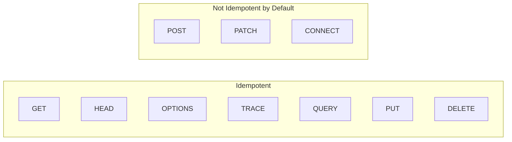
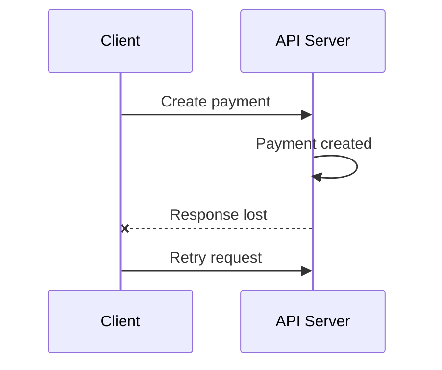
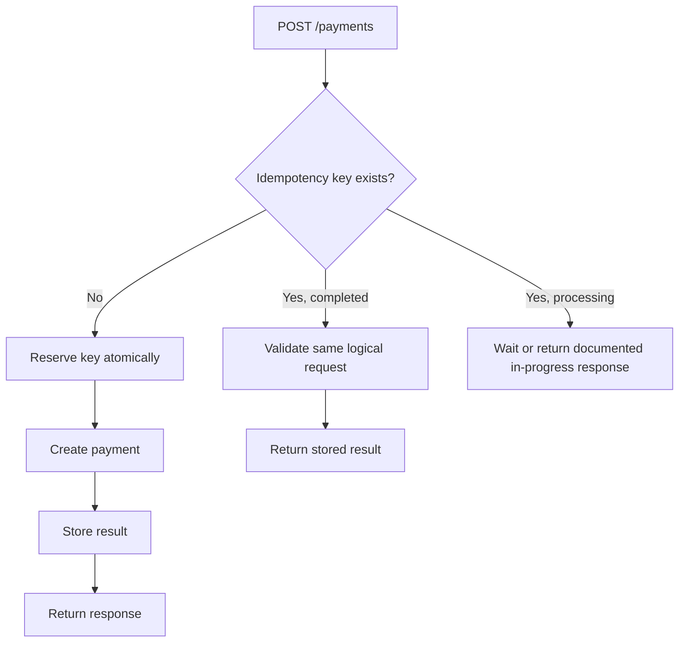
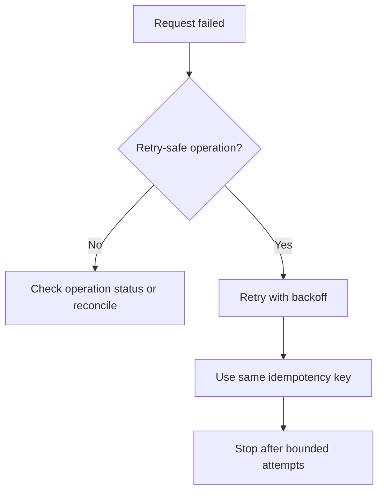

# Idempotency: Which HTTP Methods Are Idempotent?

> Idempotency means repeating the same request has the same **intended effect on server state** as sending it once.

It is an important concept in REST APIs because network failures, timeouts, retries, background jobs, and duplicate message delivery are common in real systems.

---

## In Short

| HTTP Method | Safe? | Idempotent? | Common Use |
|---|---:|---:|---|
| `GET` | Yes | Yes | Read resource |
| `HEAD` | Yes | Yes | Read headers/metadata |
| `OPTIONS` | Yes | Yes | Discover supported communication options |
| `TRACE` | Yes | Yes | Diagnostic request |
| `QUERY` | Yes | Yes | Safe query with request content |
| `PUT` | No | Yes | Create/replace resource at known URI |
| `DELETE` | No | Yes | Remove resource |
| `POST` | No | No | Create/process an operation |
| `PATCH` | No | No | Partially modify resource |
| `CONNECT` | No | No | Establish tunnel |

The methods developers usually work with are:

```text
GET     -> Safe + Idempotent
POST    -> Not idempotent by default
PUT     -> Idempotent
PATCH   -> Not idempotent by default
DELETE  -> Idempotent
```

`QUERY` is a newer standardized HTTP method defined by **RFC 10008 (June 2026)**. It is explicitly safe and idempotent, but adoption across frameworks, gateways, browsers, and API tooling may still vary.



---

# 1. What Is Idempotency?

An HTTP operation is **idempotent** when sending the same request multiple times has the same intended effect as sending it once.

```text
Same request once       -> Final state X
Same request 10 times   -> Final state X
```

A simple mathematical representation is:

```text
f(f(x)) = f(x)
```

A simple example:

```http
PUT /users/42/status
Content-Type: application/json

{
  "status": "active"
}
```

The first request changes:

```text
inactive -> active
```

Repeating the same request gives:

```text
active -> active
active -> active
active -> active
```

The intended final state remains `active`, so the operation is idempotent.

---

# 2. Why Idempotency Matters

Consider a payment request:



The server successfully created the payment, but the response was lost.

The client now does not know whether the payment succeeded.

If it retries an unprotected `POST`, the application could create another payment.

This problem appears frequently in:

- Payments
- Order creation
- Bookings
- Inventory adjustments
- Webhooks
- Background jobs
- Message consumers
- Mobile applications with unstable networks

Idempotency lets these systems handle retries without unintentionally repeating the business action.

---

# 3. Safe vs Idempotent

These two concepts are related but different.

## 3.1 Safe

A **safe method** means the client is not asking the server to change the target resource's state.

Examples:

```text
GET
HEAD
OPTIONS
TRACE
QUERY
```

Logging, metrics, caching, tracing, and similar internal activities can still happen. They do not change the method's defined semantics because they were not the state change requested by the client.

### Important Rule

> Safe methods are idempotent, but an idempotent method is not necessarily safe.

For example:

```text
GET     -> Safe + Idempotent
DELETE  -> Not Safe + Idempotent
```

`DELETE` changes server state, so it is not safe. But deleting the same resource repeatedly still requests the same final state: the resource should be absent.

---

# 4. Understanding the Main HTTP Methods

## 4.1 GET

`GET` retrieves a resource.

```http
GET /users/42
```

Repeating the request does not ask the server to modify that user.

Therefore:

```text
GET -> Safe + Idempotent
```

The response itself does **not** need to remain identical.

For example:

```http
GET /stock-prices/ABC
```

may return different prices over time because the underlying resource changed independently.

Idempotency is about the **effect caused by the request**, not whether every response byte is identical.

---

## 4.2 PUT

`PUT` is used to create or replace resource state at a known URI.

```http
PUT /users/42

{
  "name": "Aarav",
  "status": "active"
}
```

Sending this request repeatedly keeps requesting the same target state.

```text
Request 1 -> User 42 = X
Request 2 -> User 42 = X
Request 3 -> User 42 = X
```

Therefore:

```text
PUT -> Idempotent, but not safe
```

A useful way to remember `PUT` is:

> Make the resource at this URI match the supplied representation.

For partial modifications, `PATCH` is normally more appropriate.

---

## 4.3 DELETE

Consider:

```http
DELETE /users/42
```

The responses may be:

```text
First request  -> 204 No Content
Second request -> 404 Not Found
Third request  -> 404 Not Found
```

The responses differ, but the intended final state remains:

```text
User 42 does not exist
```

Therefore:

```text
DELETE -> Idempotent, but not safe
```

This is one of the most important details to remember:

> Idempotency does not mean identical responses. It means the intended effect remains the same.

---

## 4.4 POST

`POST` performs resource-specific processing and is commonly used for creation.

```http
POST /orders

{
  "product_id": 1001,
  "quantity": 2
}
```

Repeating it could produce:

```text
Request 1 -> Order 501
Request 2 -> Order 502
Request 3 -> Order 503
```

Therefore:

```text
POST -> Not idempotent by default
```

However, a **specific POST endpoint can be designed to behave idempotently**.

That distinction is important:

```text
HTTP POST semantics      -> Not idempotent
Specific POST endpoint   -> Can add duplicate protection
```

---

## 4.5 PATCH

`PATCH` performs partial modifications.

Consider:

```http
PATCH /inventory/1001

{
  "increment_by": 5
}
```

Repeating it gives:

```text
10 -> 15
15 -> 20
20 -> 25
```

That is clearly not idempotent.

But this operation may behave idempotently:

```http
PATCH /orders/501
Content-Type: application/merge-patch+json

{
  "status": "cancelled"
}
```

Repeated execution can keep the state at `cancelled`.

Therefore:

> A particular PATCH operation can behave idempotently, but HTTP does not guarantee that PATCH is idempotent.

---

## 4.6 QUERY

`QUERY` was standardized in **RFC 10008 in June 2026**.

It allows a client to send query information in request content while explicitly keeping the request safe and idempotent.

```http
QUERY /products/search
Content-Type: application/json

{
  "category": "laptops",
  "min_price": 50000,
  "max_price": 150000
}
```

Its purpose sits between common `GET` and query-style `POST` APIs:

| Property | `GET` | `QUERY` | `POST` |
|---|---:|---:|---:|
| Safe | Yes | Yes | No by default |
| Idempotent | Yes | Yes | No by default |
| Query content | No general semantics | Yes | Yes |
| Intended state change | No | No | Possible |

For most existing REST APIs, `GET` remains the normal choice for queries. `QUERY` is especially useful when query input is too complex or large for a practical URI and explicit safe semantics are valuable.

---

# 5. Method Idempotency vs Endpoint Idempotency

There are two different levels to understand.

## Method-Level Property

HTTP defines:

```text
PUT     -> Idempotent
DELETE  -> Idempotent

POST    -> Not idempotent by default
PATCH   -> Not idempotent by default
```

## Endpoint-Level Behavior

An application can add stronger behavior.

For example:

```http
POST /users/42/activate
```

If the implementation simply ensures:

```text
status = active
```

then repeated requests may produce the same business state.

However, generic clients cannot automatically assume every `POST` endpoint behaves this way unless the API contract explicitly documents it.

---

# 6. Making POST Retry-Safe

For operations such as payments, orders, or bookings, APIs commonly use an **idempotency key**.

> `Idempotency-Key` is widely used by APIs, but as of August 2026 it is not an RFC-standardized HTTP field. Implementations should follow the specific API provider's contract.

## Payment Example

```http
POST /payments
Idempotency-Key: payment-abc-123
Content-Type: application/json

{
  "order_id": "ORD-9001",
  "amount": 2499,
  "currency": "INR"
}
```

The server conceptually stores:

```text
Key                payment-abc-123
Request            order ORD-9001, ₹2499
Status             COMPLETED
Payment            pay_501
Original response  201 Created
```

When the same logical request is retried, the server returns the previously known result instead of creating another payment.



### Same Key, Different Request

A key should not represent two different logical operations.

```text
payment-123 + ₹2,499 -> Accepted
payment-123 + ₹9,999 -> Reject
```

A common implementation stores a normalized request fingerprint or hash so incompatible key reuse can be detected.

---

# 7. Concurrency and Atomic Reservation

Idempotency protection must also work when duplicate requests arrive **at the same time**.

This implementation is unsafe:

```text
Request A -> Check key -> Not found
Request B -> Check key -> Not found

Request A -> Create payment
Request B -> Create payment
```

Both requests passed the check before either stored the key.

Use an atomic database operation instead.

```sql
CREATE TABLE idempotency_records (
    tenant_id UUID NOT NULL,
    idempotency_key VARCHAR(255) NOT NULL,
    request_fingerprint VARCHAR(128) NOT NULL,
    status VARCHAR(20) NOT NULL,
    response_status INTEGER,
    response_body JSONB,

    UNIQUE (tenant_id, idempotency_key)
);
```

The uniqueness constraint ensures only one request can successfully reserve the same scoped key.

A common scope is:

```text
tenant/user
+ endpoint
+ idempotency key
```

The exact scope should be defined by the API contract.

---

# 8. Idempotency Does Not Solve Everything

Idempotency is one reliability mechanism, not a complete transaction strategy.

## 8.1 Idempotency vs Atomicity

Idempotency answers:

> What happens when the same logical request runs again?

Atomicity answers:

> Do all parts of the operation succeed together?

Example:

```text
Database update  -> Success
Publish event    -> Failure
```

The request may be idempotent while the workflow is still partially completed.

Patterns such as transactions, transactional outbox, sagas, and reconciliation address these broader problems.

## 8.2 Idempotency vs Concurrency Control

```text
Idempotency         -> Protect duplicate logical requests
Concurrency control -> Protect conflicting logical requests
```

Optimistic concurrency mechanisms include:

```text
ETag
If-Match
Version numbers
Compare-and-set
```

## 8.3 Idempotency vs Exactly-Once Delivery

A message or webhook may still arrive multiple times.

```text
Delivery count       -> Multiple
Business action      -> Once
```

Applications usually achieve this through:

```text
Stable event ID
+ unique constraint
+ idempotent consumer
```

---

# 9. Retry Strategy

An idempotent operation may be retried safely from a method-semantics perspective, but retries should still be controlled.



For retry-safe operations:

- Use exponential backoff.
- Add jitter.
- Respect `Retry-After` when applicable.
- Reuse the **same idempotency key** for retries of the same logical operation.
- Generate a **new key** for a new logical operation.
- Keep retry attempts bounded.

---

# 10. Practical Design Rules

For normal API development, remember these rules:

## HTTP Semantics

- Use `GET` only for read operations.
- Use `PUT` when replacing or setting state at a known URI.
- Use `PATCH` for partial modifications.
- Use `POST` for creation or resource-specific processing.
- Treat `POST` and `PATCH` as non-idempotent unless the API explicitly provides stronger guarantees.

## Duplicate Protection

For payments, orders, bookings, inventory adjustments, jobs, and webhooks:

```text
Stable operation identifier
        +
Atomic uniqueness constraint
        +
Idempotent processing
        +
Controlled retry strategy
```

## Server Implementation

- Reserve duplicate-protection records atomically.
- Scope keys to the correct caller/resource context.
- Detect reuse of one key for a different logical request.
- Protect concurrent duplicate requests.
- Deduplicate important external side effects.
- Define how long duplicate-protection records remain valid.

---

# Final Takeaway

Idempotency is about the **intended effect of repeating the same request**.

```text
GET      -> Idempotent
HEAD     -> Idempotent
OPTIONS  -> Idempotent
TRACE    -> Idempotent
QUERY    -> Idempotent

PUT      -> Idempotent
DELETE   -> Idempotent

POST     -> Not idempotent by default
PATCH    -> Not idempotent by default
CONNECT  -> Not idempotent
```

The most important practical idea is:

> **HTTP method semantics tell you whether retries are inherently safe from duplicate intended effects. Application-level mechanisms such as idempotency keys and unique operation IDs protect non-idempotent business operations when retries are unavoidable.**

For production APIs, combine:

```text
Correct HTTP semantics
        +
Idempotency/operation key
        +
Atomic database constraint
        +
Retry and reconciliation strategy
```

---

# References

1. **RFC 9110 — HTTP Semantics**
2. **RFC 5789 — PATCH Method for HTTP**
3. **RFC 10008 — The HTTP QUERY Method**
4. **IANA HTTP Method Registry**
5. **IETF HTTPAPI Idempotency-Key Internet-Draft — expired April 2026; not an RFC**
