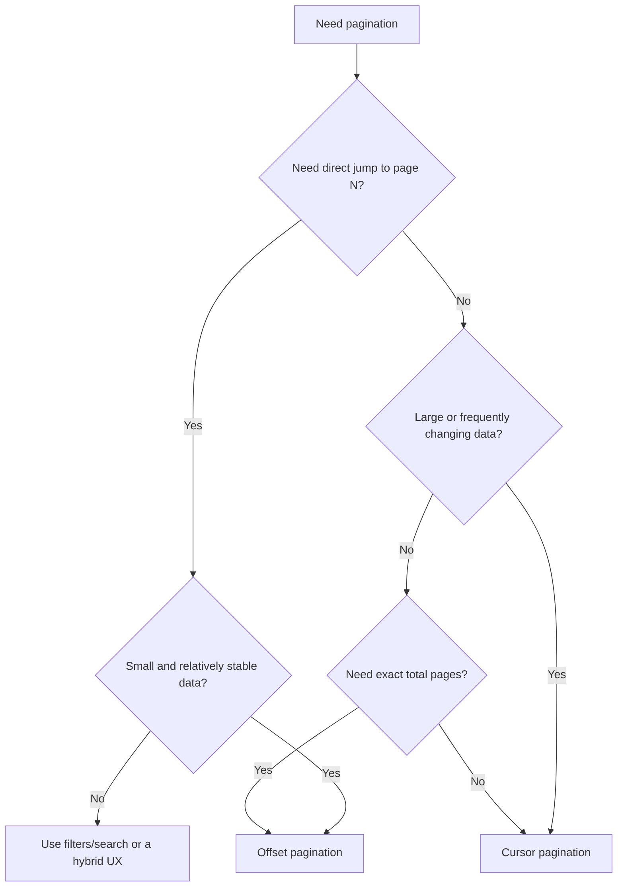
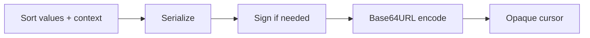

# Pagination: Offset-Based vs Cursor-Based

> Pagination returns a large collection in smaller chunks. The main design choice is whether the client identifies the next chunk by a **position** (offset) or by a **continuation point** (cursor).

## In short

- **Offset pagination** uses `page/page_size` or `offset/limit`: “skip N rows, return the next N.”
- **Cursor pagination** uses an opaque token: “continue after this ordered position.”
- Large offsets become increasingly expensive because the database still has to process the skipped rows.
- Offset pages can shift when rows are inserted or deleted between requests, causing duplicates or missed records.
- Cursor pagination is usually implemented with **keyset pagination**, using the last row’s sort values in the next query.
- Cursor pagination requires a **unique, deterministic order**, commonly `(created_at, id)`.
- Use **offset** for small/stable admin tables with numbered pages and direct page jumps.
- Use **cursor** for large or frequently changing feeds, logs, notifications, transactions, and “Load more” experiences.



**Interview takeaway:** Prefer cursor pagination for large, dynamic collections because it avoids deep-offset work and gives more stable sequential traversal. Prefer offset pagination when numbered pages, direct jumps, and exact totals are genuine product requirements.

---

# 1. Why Pagination Matters

Returning thousands of rows in one API response increases:

- Database work
- Response time
- Memory usage
- Network payload size
- Frontend rendering cost
- Timeout risk

Instead of:

```http
GET /api/orders
```

return a bounded page:

```http
GET /api/orders?limit=20
```

A production API should also enforce a maximum page size, for example:

```text
default limit = 20
maximum limit = 100
```

---

# 2. Offset-Based Pagination

## 2.1 How it works

Offset pagination identifies a page by position.

```http
GET /api/orders?page=3&page_size=20
```

The server converts the page number to an offset:

```text
offset = (page - 1) × page_size
       = (3 - 1) × 20
       = 40
```

Typical SQL:

```sql
SELECT id, total, created_at
FROM orders
ORDER BY created_at DESC, id DESC
LIMIT 20
OFFSET 40;
```

The client is effectively saying:

> Skip the first 40 matching rows and return the next 20.

## 2.2 Typical response

```json
{
  "data": [],
  "pagination": {
    "page": 3,
    "page_size": 20,
    "total_items": 248,
    "total_pages": 13,
    "has_next": true,
    "has_previous": true
  }
}
```

This fits a UI such as:

```text
Previous   1   2   [3]   4   5   ...   13   Next
```

## 2.3 Why deep offsets become slow

Consider:

```sql
SELECT id, total, created_at
FROM orders
ORDER BY created_at DESC, id DESC
LIMIT 20
OFFSET 500000;
```

The database cannot simply treat row `500001` as a permanent address. The rows skipped by `OFFSET` still have to be computed, so deeper pages can require more work.

That makes offset pagination easy to implement, but less suitable for very deep traversal over large datasets.

## 2.4 Data can shift between requests

Assume newest-first ordering.

First request:

```text
[E, D, C]
```

Before page 2 is requested, a new row `F` is inserted:

```text
[F, E, D, C, B, A]
```

The next request still uses `OFFSET 3`:

```text
[C, B, A]
```

`C` is now returned twice.

Deletes can create the opposite problem: an offset can move forward and cause a row to be skipped.

## 2.5 Where offset works well

Use offset pagination when:

- The dataset is small or moderate.
- The UI needs numbered pages.
- Users need to jump directly to page N.
- Exact totals are required.
- Records do not change heavily during browsing.
- The endpoint is mainly an admin table or report.

Typical examples:

```text
Admin users
Employee directory
Configuration records
Small product catalog
Back-office reports
```

---

# 3. Cursor-Based Pagination

## 3.1 How it works

Cursor pagination identifies a continuation point rather than a numeric position.

First request:

```http
GET /api/orders?limit=20
```

Response:

```json
{
  "data": [],
  "pagination": {
    "next_cursor": "eyJ2IjoxLCJjcmVhdGVkX2F0IjoiLi4uIiwiaWQiOiIuLi4ifQ",
    "has_more": true
  }
}
```

Next request:

```http
GET /api/orders?limit=20&after=eyJ2IjoxLCJjcmVhdGVkX2F0IjoiLi4uIiwiaWQiOiIuLi4ifQ
```

The client should treat the cursor as opaque and send it back unchanged.

## 3.2 Cursor vs keyset pagination

These terms are closely related but not identical:

- **Cursor pagination** is the API contract exposed to the client.
- **Keyset pagination** is the database query technique commonly used to implement that contract.

For this order:

```sql
ORDER BY created_at DESC, id DESC
```

a PostgreSQL-style next-page query can be:

```sql
SELECT id, total, created_at
FROM orders
WHERE (created_at, id) < (:cursor_created_at, :cursor_id)
ORDER BY created_at DESC, id DESC
LIMIT 20;
```

Instead of skipping 500,000 rows, the database can seek from the previous page boundary when a suitable index exists.

## 3.3 Why the tie-breaker matters

This is unsafe:

```sql
ORDER BY created_at DESC
```

Many rows can have the same timestamp, so their relative order is not guaranteed.

Prefer:

```sql
ORDER BY created_at DESC, id DESC
```

The cursor must contain **every field needed to reproduce that order**:

```json
{
  "created_at": "2026-08-20T09:30:00Z",
  "id": "ord_104"
}
```

The general rule is:

> The complete sort key must define a unique and deterministic order.

Common keys:

```text
(created_at, id)
(updated_at, id)
(score, id)
(event_sequence, id)
```

## 3.4 Matching index

For:

```sql
ORDER BY created_at DESC, id DESC
```

use an index such as:

```sql
CREATE INDEX idx_orders_created_id
ON orders (created_at DESC, id DESC);
```

If every query is tenant-scoped:

```sql
WHERE tenant_id = :tenant_id
ORDER BY created_at DESC, id DESC
```

a more useful index is often:

```sql
CREATE INDEX idx_orders_tenant_created_id
ON orders (tenant_id, created_at DESC, id DESC);
```

The correct index depends on the real filter and sort pattern.

## 3.5 Where cursor works well

Use cursor pagination when:

- The dataset is large.
- Rows are inserted or deleted frequently.
- Users move sequentially through results.
- The UI uses “Load more” or infinite scroll.
- Deep-page performance matters.
- Duplicate/missing rows from shifting offsets are undesirable.

Typical examples:

```text
Notifications
Chat history
Audit logs
Payment transactions
Order history
Activity feeds
Application events
```

---

# 4. Offset vs Cursor

| Area | Offset | Cursor |
|---|---|---|
| Client parameters | `page`, `page_size`, `offset`, `limit` | `after`, `before`, `cursor`, `limit` |
| Mental model | Skip N rows | Continue from a position |
| Implementation | Simpler | More involved |
| Deep traversal | Can degrade | Usually efficient with correct index |
| Inserts/deletes | Pages may shift | More stable for sequential traversal |
| Direct page jump | Easy | Not natural |
| Numbered pages | Strong fit | Weak fit |
| Infinite scroll | Acceptable | Strong fit |
| Exact total pages | Natural | Usually avoided |
| Database pattern | `LIMIT/OFFSET` | Range/keyset predicate |
| Ordering | Must be deterministic | Must be deterministic and cursor-compatible |
| Best fit | Admin tables | Feeds, logs, histories |

---

# 5. Designing a Reliable Cursor

A production cursor should usually be:

- Opaque to clients
- URL-safe
- Versioned
- Bound to the sort order
- Bound to important filters when needed
- Tamper-resistant when clients must not alter its contents

Example internal payload:

```json
{
  "v": 1,
  "created_at": "2026-08-20T09:30:00Z",
  "id": "ord_104",
  "sort": "-created_at,-id",
  "filter_hash": "f3a8d..."
}
```

Typical flow:



### Important security point

Base64 is only encoding. It does **not** prevent a client from decoding or modifying a cursor.

When cursor tampering matters, use:

- HMAC signing
- Authenticated encryption
- A server-side cursor identifier

### Do not depend on the cursor row still existing

Better cursor:

```json
{
  "created_at": "...",
  "id": "..."
}
```

Less robust design:

```json
{
  "row_id": "..."
}
```

if the server must first fetch that row before it can continue. A deleted boundary row would then break pagination unnecessarily.

---

# 6. REST API Design

## 6.1 Use `limit + 1` for `has_more`

For a public limit of 20, query 21 rows internally:

```sql
LIMIT 21
```

Then:

- `<= 20` rows → `has_more = false`
- `21` rows → `has_more = true`
- Return only the first 20
- Build the next cursor from row 20

This often avoids an extra `COUNT(*)` query.

## 6.2 Do not calculate exact totals automatically

An offset API often exposes:

```json
{
  "total_items": 248,
  "total_pages": 13
}
```

For a large cursor-based feed, this is usually enough:

```json
{
  "has_more": true
}
```

Exact counts can be expensive on large tables, joins, or complex filters. Return them only when the product actually needs them.

## 6.3 Preserve filters, authorization, and sorting

These requests belong to the same pagination sequence:

```http
GET /orders?status=paid&limit=20
GET /orders?status=paid&limit=20&after=...
```

Do not silently change:

- Tenant scope
- Authorization scope
- Filters
- Search query
- Sort fields
- Sort direction

A cursor should be rejected if it is incompatible with the current query.

## 6.4 Define cursor errors

Useful API error codes include:

```text
INVALID_CURSOR
EXPIRED_CURSOR
CURSOR_FILTER_MISMATCH
UNSUPPORTED_CURSOR_VERSION
```

Example:

```json
{
  "error": {
    "code": "INVALID_CURSOR",
    "message": "The pagination cursor is invalid."
  }
}
```

---

# 7. FastAPI + SQLAlchemy Example

The following example uses one endpoint and the common `(created_at, id)` keyset.

```python
from typing import Annotated

from fastapi import Depends, HTTPException, Query
from sqlalchemy import or_, select
from sqlalchemy.ext.asyncio import AsyncSession


@router.get("/orders")
async def list_orders(
    limit: Annotated[int, Query(ge=1, le=100)] = 20,
    after: str | None = None,
    session: AsyncSession = Depends(get_session),
) -> dict:
    query = select(Order)

    if after:
        try:
            cursor = decode_cursor(after)
        except InvalidCursorError as exc:
            raise HTTPException(
                status_code=400,
                detail={
                    "code": "INVALID_CURSOR",
                    "message": "Invalid pagination cursor",
                },
            ) from exc

        query = query.where(
            or_(
                Order.created_at < cursor["created_at"],
                (
                    (Order.created_at == cursor["created_at"])
                    & (Order.id < cursor["id"])
                ),
            )
        )

    query = (
        query
        .order_by(Order.created_at.desc(), Order.id.desc())
        .limit(limit + 1)
    )

    rows = list((await session.scalars(query)).all())

    has_more = len(rows) > limit
    page_rows = rows[:limit]

    next_cursor = None
    if has_more and page_rows:
        last = page_rows[-1]
        next_cursor = encode_cursor(
            created_at=last.created_at,
            order_id=str(last.id),
        )

    return {
        "data": [
            OrderResponse.model_validate(order)
            for order in page_rows
        ],
        "pagination": {
            "next_cursor": next_cursor,
            "has_more": has_more,
        },
    }
```

Recommended index for this query:

```sql
CREATE INDEX idx_orders_created_id
ON orders (created_at DESC, id DESC);
```

In production, `encode_cursor()` should produce an opaque, validated token and should be signed when modification by clients is a concern.

---

# 8. Consistency Expectations

Cursor pagination is **more stable than offset pagination**, but it does not automatically create a frozen snapshot.

During a long traversal:

- New rows can appear before the cursor.
- Existing rows can be deleted.
- A row can move if its sort field changes.
- Updated data can appear differently on a later request.

For a feed, that is usually acceptable.

For a financial report, export, or other operation that needs a stable dataset, use an explicit boundary or snapshot strategy.

Example:

```http
GET /transactions?created_before=2026-08-20T09:00:00Z&limit=100
```

Every following request preserves the same `created_before` cutoff.

---

# 9. Practical Selection

## Choose offset when

```text
Small/stable dataset
+ numbered pages
+ direct jump to page N
+ exact totals
= OFFSET
```

## Choose cursor when

```text
Large/dynamic dataset
+ sequential traversal
+ load more / infinite scroll
+ deep-page performance
= CURSOR
```

A real system can use both:

```text
Admin users table  -> offset
Public activity feed -> cursor
Reporting/export     -> dedicated snapshot/export flow
```

---

# 10. Current Real-World API Patterns

Different APIs expose pagination differently even when the underlying idea is similar.

- **GitHub REST API** commonly exposes paginated results through page links in the HTTP `Link` header and supports `per_page` on many endpoints.
- **Stripe API v1 list endpoints** use cursor-like object IDs with `starting_after`, `ending_before`, `limit`, and `has_more`.
- **Stripe API v2** uses page tokens/URLs rather than the older v1 list contract.
- **Relay's GraphQL Cursor Connections specification** standardizes forward pagination with `first`/`after`, backward pagination with `last`/`before`, opaque cursors, and `PageInfo`.

The important interview concept is not memorizing parameter names. It is understanding the trade-off between **positional pagination** and **continuation-based pagination**, and designing the database ordering and index correctly.

---

# 11. References

- [PostgreSQL Documentation — LIMIT and OFFSET](https://www.postgresql.org/docs/current/queries-limit.html)
- [GitHub Docs — Using pagination in the REST API](https://docs.github.com/en/rest/using-the-rest-api/using-pagination-in-the-rest-api)
- [Stripe API Reference — Pagination](https://docs.stripe.com/api/pagination)
- [Stripe API v2 Overview](https://docs.stripe.com/api-v2-overview)
- [GraphQL Cursor Connections Specification](https://relay.dev/graphql/connections.htm)
