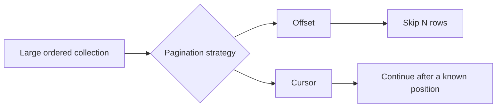
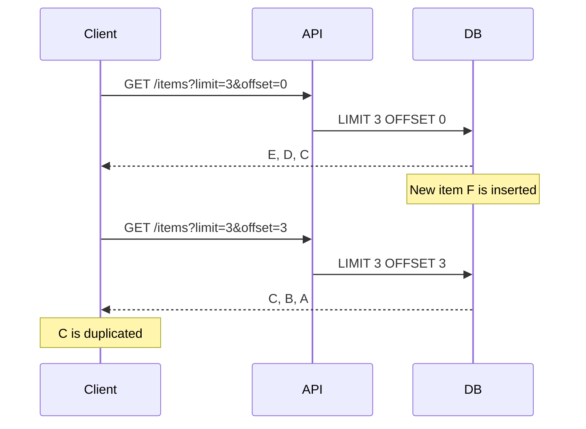
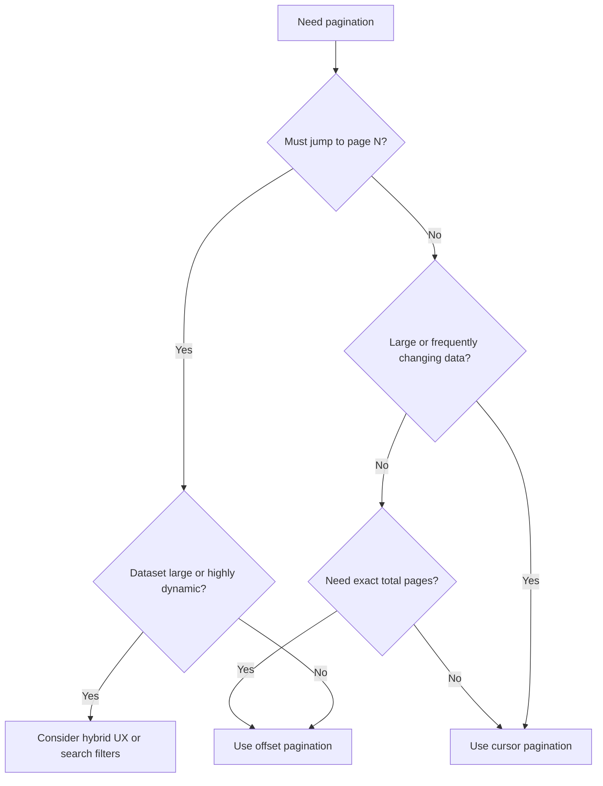

# Pagination: Offset-Based vs Cursor-Based

> **Topic:** API Design & REST  
> **Level:** Intermediate developer  
> **Goal:** Understand how offset and cursor pagination work, where each approach fits, and how to design a reliable paginated REST API.

---

## Table of Contents

1. [Why APIs Need Pagination](#1-why-apis-need-pagination)
2. [Quick Mental Model](#2-quick-mental-model)
3. [Offset-Based Pagination](#3-offset-based-pagination)
   - [How It Works](#31-how-it-works)
   - [Request and Response](#32-request-and-response)
   - [Database Query](#33-database-query)
   - [Advantages](#34-advantages)
   - [Limitations](#35-limitations)
4. [Cursor-Based Pagination](#4-cursor-based-pagination)
   - [How It Works](#41-how-it-works)
   - [Request and Response](#42-request-and-response)
   - [Keyset Query](#43-keyset-query)
   - [Advantages](#44-advantages)
   - [Limitations](#45-limitations)
5. [Offset vs Cursor Comparison](#5-offset-vs-cursor-comparison)
6. [Stable Ordering and Tie-Breakers](#6-stable-ordering-and-tie-breakers)
7. [Designing a Cursor](#7-designing-a-cursor)
8. [REST API Response Design](#8-rest-api-response-design)
9. [FastAPI and SQLAlchemy Examples](#9-fastapi-and-sqlalchemy-examples)
10. [Choosing the Right Strategy](#10-choosing-the-right-strategy)
11. [Production Best Practices](#11-production-best-practices)
12. [Migration from Offset to Cursor](#12-migration-from-offset-to-cursor)
13. [Key Interview Takeaways](#13-key-interview-takeaways)
14. [References](#14-references)

---

# 1. Why APIs Need Pagination

An API should not return thousands or millions of records in one response.

Without pagination, a large collection can cause:

- High database load
- Slow API response times
- Large network payloads
- Increased memory usage
- Poor frontend performance
- Request timeouts

Pagination divides a large result set into smaller, manageable chunks.

```text
Without pagination

Client ───── GET /orders ─────> API ─────> Database
Client <──── 500,000 orders ─── API <───── Database
                    Slow and expensive
```

```text
With pagination

Client ─── GET /orders?limit=20 ───> API
Client <────── 20 orders + next ──── API
```

The two most common approaches are:

1. **Offset-based pagination**
2. **Cursor-based pagination**

---

# 2. Quick Mental Model

## Offset-Based

> “Skip the first 100 records and return the next 20.”

```http
GET /api/orders?limit=20&offset=100
```

## Cursor-Based

> “Return the next 20 records after the last record I received.”

```http
GET /api/orders?limit=20&after=eyJjcmVhdGVkX2F0IjoiLi4uIiwiaWQiOiIuLi4ifQ
```



---

# 3. Offset-Based Pagination

## 3.1 How It Works

Offset pagination uses two values:

- `limit`: Maximum number of records to return
- `offset`: Number of records to skip

For example:

```http
GET /api/products?limit=20&offset=40
```

This means:

1. Skip the first 40 matching products.
2. Return the next 20 products.

Some APIs expose the same concept using page numbers:

```http
GET /api/products?page=3&page_size=20
```

The server calculates the offset:

```text
offset = (page - 1) × page_size
offset = (3 - 1) × 20
offset = 40
```

---

## 3.2 Request and Response

### Request

```http
GET /api/products?page=3&page_size=20
```

### Response

```json
{
  "data": [
    {
      "id": 41,
      "name": "Mechanical Keyboard"
    }
  ],
  "pagination": {
    "page": 3,
    "page_size": 20,
    "total_items": 248,
    "total_pages": 13,
    "has_next": true,
    "has_previous": true
  }
}
```

This response is useful for interfaces that show numbered pages:

```text
Previous  1  2  [3]  4  5  ...  13  Next
```

---

## 3.3 Database Query

A typical SQL query is:

```sql
SELECT id, name, created_at
FROM products
ORDER BY created_at DESC, id DESC
LIMIT 20
OFFSET 40;
```

The database skips 40 rows and returns the next 20.

### Important performance behavior

A large offset does not normally allow the database to “teleport” directly to the requested row. The skipped rows may still need to be located or computed.

```sql
SELECT *
FROM orders
ORDER BY created_at DESC
LIMIT 20
OFFSET 500000;
```

This can become expensive because the database processes a large number of rows before returning only 20.

---

## 3.4 Advantages

### Simple to understand

Page numbers and offsets are familiar to developers and users.

### Supports direct page navigation

A client can jump directly to page 10:

```http
GET /api/products?page=10&page_size=20
```

### Easy total-page calculation

When a total count is available:

```text
total_pages = ceil(total_items / page_size)
```

### Suitable for small or moderately sized datasets

It works well when:

- The dataset is not extremely large.
- Users need numbered pages.
- Records do not change frequently.
- Deep-page performance is not important.
- The API is mainly used for admin tables or reports.

---

## 3.5 Limitations

### 1. Deep pages can become slow

The cost generally increases as the offset grows.

```text
OFFSET 0        → small amount of skipped work
OFFSET 10,000   → more skipped work
OFFSET 500,000  → potentially expensive
```

### 2. Inserts can create duplicate results

Assume records are sorted newest first.

#### First request

```text
Page 1: [E, D, C]
```

Before the next request, a new record `F` is inserted:

```text
Current data: [F, E, D, C, B, A]
```

#### Second request using `OFFSET 3`

```text
Page 2: [C, B, A]
```

Record `C` appears on both pages.



### 3. Deletes can cause missing results

Initial data:

```text
[E, D, C, B, A]
```

Page 1 returns:

```text
[E, D]
```

If `E` is deleted before page 2, `OFFSET 2` now starts after `C`:

```text
Current data: [D, C, B, A]
Page 2: [B, A]
```

Record `C` is missed.

### 4. Exact totals can be expensive

A response with `total_items` often requires an additional count:

```sql
SELECT COUNT(*)
FROM products
WHERE status = 'active';
```

For large tables, complex joins, or selective filters, exact counts may add significant cost.

### 5. Results require deterministic ordering

Without a stable `ORDER BY`, different requests may return inconsistent subsets.

Avoid:

```sql
SELECT *
FROM products
LIMIT 20
OFFSET 20;
```

Prefer:

```sql
SELECT *
FROM products
ORDER BY created_at DESC, id DESC
LIMIT 20
OFFSET 20;
```

---

# 4. Cursor-Based Pagination

## 4.1 How It Works

Cursor pagination uses a token that represents a position in an ordered result set.

The client does not say:

> “Skip 100 records.”

It says:

> “Continue after this position.”

### First request

```http
GET /api/orders?limit=20
```

### Next request

```http
GET /api/orders?limit=20&after=eyJjcmVhdGVkX2F0IjoiMjAyNi0wNy0zMFQxMDowMDowMFoiLCJpZCI6IjkwMDEifQ
```

The cursor is usually opaque to the client. The client stores it and sends it back without interpreting it.


---

## 4.2 Request and Response

### First request

```http
GET /api/orders?limit=2
```

### Response

```json
{
  "data": [
    {
      "id": "ord_105",
      "created_at": "2026-07-30T10:15:00Z"
    },
    {
      "id": "ord_104",
      "created_at": "2026-07-30T10:10:00Z"
    }
  ],
  "pagination": {
    "next_cursor": "eyJjcmVhdGVkX2F0IjoiMjAyNi0wNy0zMFQxMDoxMDowMFoiLCJpZCI6Im9yZF8xMDQifQ",
    "previous_cursor": null,
    "has_more": true
  }
}
```

### Next request

```http
GET /api/orders?limit=2&after=eyJjcmVhdGVkX2F0IjoiMjAyNi0wNy0zMFQxMDoxMDowMFoiLCJpZCI6Im9yZF8xMDQifQ
```

The API decodes the cursor and continues after:

```text
created_at = 2026-07-30T10:10:00Z
id         = ord_104
```

---

## 4.3 Keyset Query

Cursor-based APIs commonly use **keyset pagination** in the database.

Assume the collection is ordered by:

```sql
ORDER BY created_at DESC, id DESC
```

The next-page query can be:

```sql
SELECT id, customer_id, total, created_at
FROM orders
WHERE (created_at, id) < (
    TIMESTAMP '2026-07-30 10:10:00+00',
    'ord_104'
)
ORDER BY created_at DESC, id DESC
LIMIT 20;
```

The database searches for records below the previous page’s final sort key instead of skipping every earlier row.

An equivalent expanded condition is:

```sql
WHERE created_at < :cursor_created_at
   OR (
       created_at = :cursor_created_at
       AND id < :cursor_id
   )
```

### Cursor pagination vs keyset pagination

These terms are related but not identical:

- **Cursor pagination** is the API contract.
- **Keyset pagination** is a common database query strategy used to implement it.
- A cursor may contain one or more keyset values.
- The cursor should normally be encoded or signed so clients treat it as an opaque token.

---

## 4.4 Advantages

### 1. Better deep-pagination performance

With a suitable index, the database can seek from the cursor position instead of scanning and discarding a large offset.

Recommended index:

```sql
CREATE INDEX idx_orders_created_id
ON orders (created_at DESC, id DESC);
```

The index should match the filter and sort pattern used by the query.

### 2. More stable during inserts

Suppose page 1 returns:

```text
[E, D, C]
```

The cursor represents `C`.

A new record `F` is inserted:

```text
[F, E, D, C, B, A]
```

The next query asks for records after `C`, so it returns:

```text
[B, A]
```

The newly inserted record does not shift the continuation point.

### 3. Good for infinite scrolling

Cursor pagination works naturally for:

- Social feeds
- Activity streams
- Audit logs
- Notifications
- Chat messages
- Transaction histories
- Large order lists
- Mobile applications

### 4. Avoids exposing row positions

An opaque cursor prevents clients from depending on an implementation detail such as a numeric database offset.

### 5. Scales well for sequential traversal

It is especially effective when users normally move forward or backward one page at a time.

---

## 4.5 Limitations

### 1. Direct page jumping is difficult

A cursor does not naturally support:

```text
Go directly to page 57
```

The client needs a cursor for the required position.

### 2. Total page counts are not natural

Cursor pagination usually returns:

```json
{
  "has_more": true
}
```

rather than:

```json
{
  "total_pages": 357
}
```

The API can still calculate a total count, but doing so removes some of the performance benefit.

### 3. Implementation is more complex

The server must correctly handle:

- Cursor encoding and decoding
- Stable ordering
- Tie-breaker fields
- Sort direction
- Filter consistency
- Invalid or expired cursors
- Forward and backward navigation

### 4. Cursors can become invalid

A cursor may become unusable when:

- Its format changes.
- The referenced data is deleted.
- The cursor expires.
- The client changes filters or sorting.
- The server ties the cursor to a snapshot that no longer exists.

The API should define how invalid cursors are reported.

Example:

```http
HTTP/1.1 400 Bad Request
```

```json
{
  "error": {
    "code": "INVALID_CURSOR",
    "message": "The pagination cursor is invalid or no longer supported."
  }
}
```

### 5. Changing sort order changes cursor meaning

A cursor created for:

```http
GET /orders?status=paid&sort=-created_at
```

should not silently be reused for:

```http
GET /orders?status=failed&sort=amount
```

The cursor should either include the relevant query context or be validated against it.

---

# 5. Offset vs Cursor Comparison

| Area | Offset-Based | Cursor-Based |
|---|---|---|
| Common parameters | `page`, `page_size`, `offset`, `limit` | `after`, `before`, `cursor`, `limit` |
| Mental model | Skip N records | Continue after a known position |
| Implementation complexity | Low | Medium |
| Deep-page performance | Can degrade | Usually consistent with proper indexes |
| Concurrent inserts/deletes | May create duplicates or gaps | More stable |
| Direct page jump | Easy | Difficult |
| Numbered page UI | Natural fit | Poor fit |
| Infinite scroll | Acceptable | Strong fit |
| Exact total pages | Easy to expose | Usually avoided |
| Large dynamic datasets | Less suitable | Strong fit |
| Database pattern | `LIMIT ... OFFSET ...` | Keyset/range predicate |
| Sorting requirement | Deterministic order required | Deterministic and cursor-compatible order required |
| Client state | Page or offset | Opaque continuation token |
| Typical use case | Admin table | Feed, timeline, event stream |

---

# 6. Stable Ordering and Tie-Breakers

Stable ordering is essential for both strategies and critical for cursor pagination.

## Problem with a non-unique sort field

Suppose several orders have the same timestamp:

```text
created_at = 2026-07-30T10:00:00Z
```

Sorting only by `created_at` does not define their exact order:

```sql
ORDER BY created_at DESC
```

The database may return tied records in different orders across requests.

## Add a unique tie-breaker

Use:

```sql
ORDER BY created_at DESC, id DESC
```

The cursor must include both fields:

```json
{
  "created_at": "2026-07-30T10:00:00Z",
  "id": "ord_104"
}
```

The next-page predicate must also compare both fields:

```sql
WHERE (created_at, id) < (:created_at, :id)
```

## Recommended rule

> The complete sort key should produce a unique and deterministic order.

Common combinations include:

```text
(created_at, id)
(updated_at, id)
(score, id)
(event_sequence, id)
```

Using only `id` is also possible when the identifier has the required ordering semantics.

---

# 7. Designing a Cursor

A cursor should usually be:

- Opaque to clients
- URL-safe
- Tamper-resistant
- Versioned
- Bound to the selected ordering
- Optionally bound to filters, tenant, or user
- Small enough for a query parameter

## Example cursor payload

```json
{
  "v": 1,
  "created_at": "2026-07-30T10:10:00Z",
  "id": "ord_104",
  "sort": "-created_at,-id",
  "filter_hash": "f3a8d..."
}
```

The payload can be:

1. Serialized as JSON.
2. Signed using an HMAC.
3. Encoded using URL-safe Base64.

```text
Cursor payload
      │
      ▼
JSON serialization
      │
      ▼
HMAC signature
      │
      ▼
Base64URL encoding
      │
      ▼
Opaque cursor string
```

## Why signing matters

Base64 is encoding, not encryption or authentication.

A client can decode and modify an unsigned Base64 cursor. Signing lets the server detect tampering.

## Cursor versioning

Include a version:

```json
{
  "v": 1
}
```

This allows the server to change the internal cursor format later while supporting older cursors for a defined period.

## Cursor expiration

Expiration is useful when:

- A cursor represents a database snapshot.
- Query semantics can change.
- The data is security-sensitive.
- Long-lived cursors would be costly to support.

Example payload field:

```json
{
  "expires_at": "2026-07-30T11:00:00Z"
}
```

Do not add expiration without a real requirement. Stateless keyset cursors can often remain valid for longer.

---

# 8. REST API Response Design

A pagination contract should be consistent across endpoints.

## 8.1 Offset response

```json
{
  "data": [],
  "pagination": {
    "page": 2,
    "page_size": 25,
    "total_items": 842,
    "total_pages": 34,
    "has_next": true,
    "has_previous": true
  },
  "links": {
    "self": "/api/customers?page=2&page_size=25",
    "next": "/api/customers?page=3&page_size=25",
    "previous": "/api/customers?page=1&page_size=25"
  }
}
```

## 8.2 Cursor response

```json
{
  "data": [],
  "pagination": {
    "next_cursor": "next-token",
    "previous_cursor": "previous-token",
    "has_more": true
  },
  "links": {
    "self": "/api/customers?limit=25&after=current-token",
    "next": "/api/customers?limit=25&after=next-token",
    "previous": "/api/customers?limit=25&before=previous-token"
  }
}
```

## 8.3 Prefer `limit + 1` to detect another page

To determine `has_more`, request one extra record internally:

```sql
LIMIT 21
```

For a public page size of 20:

- If 21 rows are returned, another page exists.
- Return the first 20 rows.
- Build the next cursor from the twentieth row.

This avoids running a separate count query.

## 8.4 Validate the page size

Set sensible limits:

```text
Default limit: 20
Minimum limit: 1
Maximum limit: 100
```

Example validation error:

```json
{
  "error": {
    "code": "INVALID_PAGE_SIZE",
    "message": "limit must be between 1 and 100"
  }
}
```

## 8.5 Preserve filters and sorting

Every page must use the same:

- Tenant scope
- Authorization scope
- Search filters
- Sort fields
- Sort direction

Example:

```http
GET /orders?status=paid&limit=20
GET /orders?status=paid&limit=20&after=...
```

Do not generate a next link that loses `status=paid`.

## 8.6 Decide whether totals are necessary

Avoid returning an exact total by default merely because the frontend might display it.

Alternatives:

```json
{
  "has_more": true
}
```

```json
{
  "estimated_total": 100000
}
```

```json
{
  "total": null,
  "total_is_exact": false
}
```

Use exact totals for business requirements such as reports, exports, or small administrative datasets—not automatically for every large feed.

---

# 9. FastAPI and SQLAlchemy Examples

The examples below use SQLAlchemy-style queries. Adjust model and session details to match your project.

## 9.1 Offset-Based Endpoint

```python
from typing import Annotated

from fastapi import APIRouter, Depends, Query
from sqlalchemy import func, select
from sqlalchemy.ext.asyncio import AsyncSession

router = APIRouter()


@router.get("/orders")
async def list_orders(
    page: Annotated[int, Query(ge=1)] = 1,
    page_size: Annotated[int, Query(ge=1, le=100)] = 20,
    session: AsyncSession = Depends(get_session),
) -> dict:
    offset = (page - 1) * page_size

    data_query = (
        select(Order)
        .order_by(Order.created_at.desc(), Order.id.desc())
        .offset(offset)
        .limit(page_size)
    )

    count_query = select(func.count()).select_from(Order)

    orders = list((await session.scalars(data_query)).all())
    total_items = int(await session.scalar(count_query) or 0)
    total_pages = (total_items + page_size - 1) // page_size

    return {
        "data": [OrderResponse.model_validate(order) for order in orders],
        "pagination": {
            "page": page,
            "page_size": page_size,
            "total_items": total_items,
            "total_pages": total_pages,
            "has_next": page < total_pages,
            "has_previous": page > 1,
        },
    }
```

### Query shape

```sql
SELECT *
FROM orders
ORDER BY created_at DESC, id DESC
LIMIT :page_size
OFFSET :offset;
```

This implementation is straightforward, but the count query and large offsets can become costly.

---

## 9.2 Cursor Encoding Helpers

This simplified example creates a URL-safe cursor. In production, sign the payload or use authenticated encryption.

```python
import base64
import json
from datetime import datetime
from typing import Any


class InvalidCursorError(ValueError):
    pass


def encode_cursor(*, created_at: datetime, order_id: str) -> str:
    payload = {
        "v": 1,
        "created_at": created_at.isoformat(),
        "id": order_id,
    }
    raw = json.dumps(payload, separators=(",", ":")).encode("utf-8")
    return base64.urlsafe_b64encode(raw).decode("ascii").rstrip("=")


def decode_cursor(cursor: str) -> dict[str, Any]:
    try:
        padding = "=" * (-len(cursor) % 4)
        raw = base64.urlsafe_b64decode(cursor + padding)
        payload = json.loads(raw.decode("utf-8"))

        if payload.get("v") != 1:
            raise InvalidCursorError("Unsupported cursor version")

        return {
            "created_at": datetime.fromisoformat(payload["created_at"]),
            "id": str(payload["id"]),
        }
    except (KeyError, TypeError, ValueError, json.JSONDecodeError) as exc:
        raise InvalidCursorError("Invalid cursor") from exc
```

---

## 9.3 Cursor-Based Endpoint

```python
from typing import Annotated

from fastapi import APIRouter, Depends, HTTPException, Query
from sqlalchemy import or_, select
from sqlalchemy.ext.asyncio import AsyncSession

router = APIRouter()


@router.get("/orders/cursor")
async def list_orders_cursor(
    limit: Annotated[int, Query(ge=1, le=100)] = 20,
    after: str | None = None,
    session: AsyncSession = Depends(get_session),
) -> dict:
    query = select(Order)

    if after:
        try:
            cursor = decode_cursor(after)
        except InvalidCursorError as exc:
            raise HTTPException(
                status_code=400,
                detail={
                    "code": "INVALID_CURSOR",
                    "message": str(exc),
                },
            ) from exc

        query = query.where(
            or_(
                Order.created_at < cursor["created_at"],
                (
                    (Order.created_at == cursor["created_at"])
                    & (Order.id < cursor["id"])
                ),
            )
        )

    query = (
        query
        .order_by(Order.created_at.desc(), Order.id.desc())
        .limit(limit + 1)
    )

    rows = list((await session.scalars(query)).all())

    has_more = len(rows) > limit
    page_rows = rows[:limit]

    next_cursor = None
    if has_more and page_rows:
        last_order = page_rows[-1]
        next_cursor = encode_cursor(
            created_at=last_order.created_at,
            order_id=str(last_order.id),
        )

    return {
        "data": [
            OrderResponse.model_validate(order)
            for order in page_rows
        ],
        "pagination": {
            "next_cursor": next_cursor,
            "has_more": has_more,
        },
    }
```

## 9.4 Recommended index

```sql
CREATE INDEX idx_orders_created_at_id
ON orders (created_at DESC, id DESC);
```

If the query always filters by tenant, a more useful index may be:

```sql
CREATE INDEX idx_orders_tenant_created_id
ON orders (tenant_id, created_at DESC, id DESC);
```

The correct index depends on the actual filtering and ordering pattern.

---

# 10. Choosing the Right Strategy

## Choose offset-based pagination when

- The dataset is small or moderate.
- The UI requires numbered pages.
- Users must jump directly to an arbitrary page.
- The data changes infrequently.
- Simplicity is more important than deep-page performance.
- The endpoint is an internal admin or reporting table.
- An exact total count is a firm requirement.

### Typical examples

```text
Employee directory
Admin user table
Configuration records
Small product catalog
Back-office report
```

## Choose cursor-based pagination when

- The dataset is large.
- Records are added or removed frequently.
- Users normally move sequentially.
- The UI uses infinite scroll or “Load more.”
- Deep-page performance matters.
- Duplicate or missing records during traversal would be problematic.
- The endpoint returns an event stream or timeline.

### Typical examples

```text
Social feed
Notifications
Chat history
Audit logs
Payment transactions
Order history
Application events
```

## Practical decision flow



---

# 11. Production Best Practices

## 11.1 Always define deterministic ordering

Bad:

```sql
ORDER BY created_at DESC
```

Better:

```sql
ORDER BY created_at DESC, id DESC
```

## 11.2 Match indexes to query patterns

For:

```sql
WHERE tenant_id = :tenant_id
ORDER BY created_at DESC, id DESC
```

Consider:

```sql
CREATE INDEX idx_events_tenant_created_id
ON events (tenant_id, created_at DESC, id DESC);
```

## 11.3 Treat cursors as opaque

Clients should not construct, edit, or interpret cursor values.

The API documentation should say:

> Pass the returned cursor unchanged in the next request.

## 11.4 Sign cursors when tampering matters

Do not assume Base64 makes cursor data secure.

Use:

- HMAC signing
- Authenticated encryption
- A server-side cursor identifier

## 11.5 Bind cursors to query context

A cursor may include or validate:

- Sort fields
- Sort direction
- Filter hash
- Tenant ID
- API version
- Cursor format version

This prevents a cursor from being reused with incompatible query parameters.

## 11.6 Enforce maximum page sizes

A client should not be able to request:

```http
GET /orders?limit=1000000
```

A typical maximum is between 50 and 200, depending on item size and endpoint cost.

## 11.7 Avoid exact totals for every request

Use `has_more` when the product experience does not require a count.

Exact counts are often a separate concern from retrieving the next page.

## 11.8 Keep authorization consistent across pages

Every paginated query must apply the same authorization filters.

```sql
WHERE tenant_id = :current_tenant
  AND created_at < :cursor_created_at
```

Never trust tenant or user identifiers inside an unsigned cursor.

## 11.9 Handle deleted cursor records correctly

A cursor should contain sortable values, not merely require the referenced row to still exist.

More robust:

```json
{
  "created_at": "...",
  "id": "..."
}
```

Less robust:

```json
{
  "row_id": "..."
}
```

when the implementation first fetches that row and fails if it has been deleted.

## 11.10 Define consistency expectations

Cursor pagination improves continuity, but it does not automatically provide a frozen snapshot.

During a long traversal:

- Existing records may be updated.
- Records may move because their sort field changes.
- Records may be deleted.
- New records may appear before the cursor.

For a stable export or financial report, use snapshot-based processing, a fixed cutoff time, or a dedicated export job.

Example cutoff:

```http
GET /transactions?created_before=2026-07-30T10:00:00Z&limit=100
```

All following requests preserve the same cutoff.

## 11.11 Document ordering explicitly

Example API documentation:

```text
Orders are returned by created_at descending and then id descending.
The next_cursor value must be passed unchanged to retrieve the next page.
```

## 11.12 Return clear cursor errors

Recommended error categories:

```text
INVALID_CURSOR
EXPIRED_CURSOR
CURSOR_FILTER_MISMATCH
UNSUPPORTED_CURSOR_VERSION
```

---

# 12. Migration from Offset to Cursor

Changing an existing pagination contract can break clients.

## Safe migration approach

### Step 1: Add cursor pagination without removing offset

```http
GET /v1/orders?page=2&page_size=20
GET /v1/orders?after=...&limit=20
```

### Step 2: Use a separate endpoint or API version when necessary

```http
GET /v1/orders?page=2
GET /v2/orders?after=...
```

### Step 3: Return deprecation information

Document:

- Deprecation date
- Replacement parameters
- Response-format changes
- Whether exact totals remain available

### Step 4: Update clients gradually

Migrate:

1. Internal services
2. First-party frontend
3. Mobile clients
4. External consumers

### Step 5: Measure before removing offset

Monitor:

- Offset depth
- Query duration
- Error rate
- Client version usage
- Cursor validation failures

## Hybrid approach

Some products use both strategies:

- Offset pagination for small admin screens
- Cursor pagination for public feeds
- Search filters for finding distant records
- A separate count endpoint for reporting

Pagination does not need to be identical across every endpoint when the usage patterns are different. The API should, however, remain internally consistent within each endpoint family.

---

# 13. Key Interview Takeaways

## Core distinction

```text
Offset:
“Skip N rows.”

Cursor:
“Continue after this ordered position.”
```

## Important technical points

1. Offset pagination is simple and supports direct page navigation.
2. Large offsets can be inefficient because skipped rows still require work.
3. Inserts and deletes can shift offsets, causing duplicates or missing records.
4. Cursor pagination is usually better for large, frequently changing datasets.
5. Cursor pagination commonly uses keyset predicates in the database.
6. A cursor is an API token; keyset pagination is the underlying query technique.
7. Stable ordering requires a unique tie-breaker such as `(created_at, id)`.
8. A matching composite index is essential for efficient cursor queries.
9. Cursor pagination does not naturally provide page numbers or exact totals.
10. Opaque cursors should be validated and, when appropriate, signed.
11. `limit + 1` is a practical way to calculate `has_more`.
12. Pagination does not automatically provide snapshot consistency.

## One-line selection rule

> Use **offset pagination** for simple, numbered, relatively stable lists; use **cursor pagination** for large, dynamic, sequentially consumed collections.

---

# 14. References

The following primary documentation was reviewed for the behavior and design guidance in this document:

- [PostgreSQL Documentation — LIMIT and OFFSET](https://www.postgresql.org/docs/current/queries-limit.html)
- [GitHub Docs — Using pagination in the REST API](https://docs.github.com/en/rest/using-the-rest-api/using-pagination-in-the-rest-api)
- [Stripe API Reference — Pagination](https://docs.stripe.com/api/pagination)
- [GraphQL Cursor Connections Specification](https://relay.dev/graphql/connections.htm)

---

## Final Summary

```text
                    OFFSET-BASED
Client ── page/offset ──> API ── LIMIT + OFFSET ──> Database
             │
             ├── Easy numbered pages
             ├── Easy direct jumps
             └── Slower and less stable at deep offsets


                    CURSOR-BASED
Client ─── cursor ──────> API ── range/keyset query ──> Database
             │
             ├── Efficient sequential traversal
             ├── Stable during common insert patterns
             └── No natural arbitrary page jump
```
