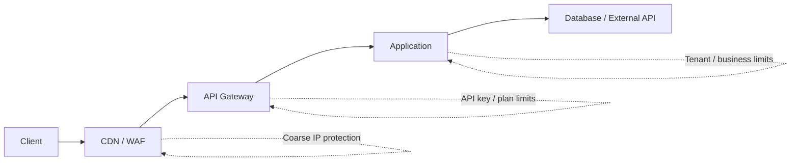
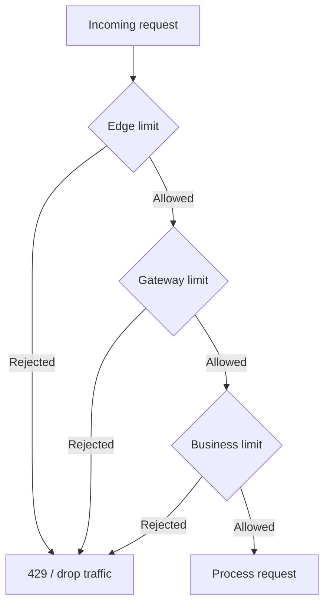
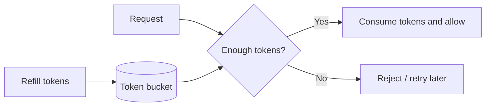
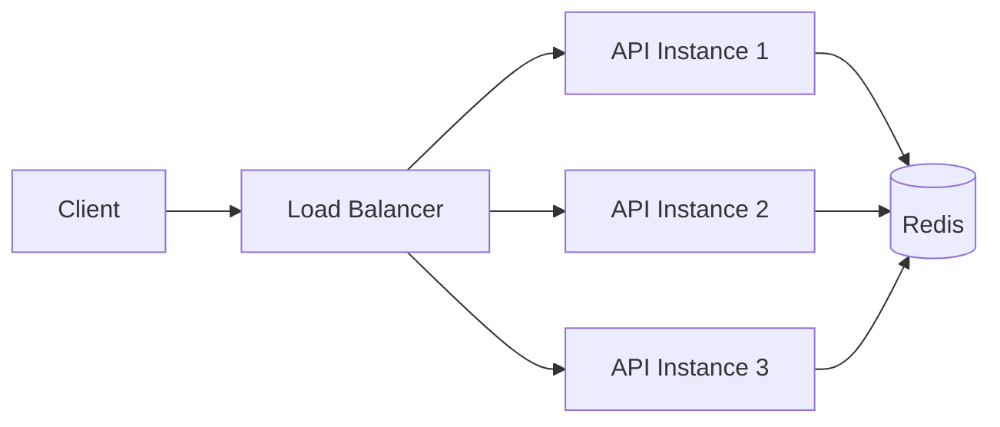

# Rate Limiting in API Design & REST

> **Interview preparation guide for intermediate backend developers**  
> **Updated:** August 2026

---

## In short

- **Rate limiting** controls how much API capacity a client can consume in a period.
- Decide the **identity/scope first**: IP, user, API key, tenant, route, or a composite key.
- Enforce limits in layers: **CDN/WAF → API gateway → application → downstream dependency**.
- **Fixed window** is simplest, **sliding window** is smoother, and **token bucket** is a strong general-purpose choice because it supports controlled bursts.
- For expensive long-running work, add a **concurrency limit**; requests-per-minute alone is not enough.
- In multi-instance systems, store limiter state in a shared system such as **Redis** and update it **atomically**.
- A client that exceeds its allocation normally receives **`429 Too Many Requests`** with `Retry-After`.
- Use **`503 Service Unavailable`** for general service saturation rather than a client-specific quota violation.
- Clients should respect `Retry-After`, use exponential backoff with jitter, and use an **idempotency key** before retrying non-idempotent operations.



---

## 1. What Is Rate Limiting?

**Rate limiting controls how frequently, or how much, a client may use an API.**

Example policy:

```text
100 requests per minute per authenticated user
```

If the client stays within the limit, requests are processed normally. When the allocation is exhausted, additional requests are temporarily rejected.

Rate limiting is commonly used to:

- protect CPU, memory, workers, database connections, and network capacity;
- prevent accidental retry loops or traffic spikes;
- share capacity fairly between customers;
- protect expensive endpoints such as reports, search, file processing, and AI inference;
- enforce API plans and quotas;
- avoid exceeding third-party API limits.

### Rate Limit vs Related Controls

| Control | What it limits | Example |
|---|---|---|
| Rate limit | Requests or units over time | `100 requests/minute` |
| Quota | Usage over a longer period | `1,000,000 requests/month` |
| Concurrency limit | Work executing at the same time | `5 active exports/tenant` |
| Load shedding | Work accepted when the service is overloaded | Reject during system saturation |

A mature API often uses more than one of these controls together.

---

## 2. Choose the Identity and Scope First

The algorithm can only limit what its **key** represents.

### Common Keys

| Identity | Typical use |
|---|---|
| IP address | Public or unauthenticated endpoints |
| User ID | Authenticated application traffic |
| API key / OAuth client | Public APIs and machine-to-machine access |
| Tenant / organisation | Multi-tenant SaaS |
| Route + method | Expensive operations |
| Composite key | `tenant + user + method + route` |

Example:

```text
rl:tenant:42:user:8842:POST:/reports
```

### Practical Rules

- Prefer a verified **user ID, tenant ID, or API key** after authentication.
- Use IP-based limits mainly for unauthenticated traffic and edge protection.
- Do not blindly trust `X-Forwarded-For`; trust proxy headers only when your infrastructure sanitizes them.
- Normalize routes before building keys.

Use:

```text
GET:/users/{user_id}
```

instead of creating separate limiter keys for:

```text
GET:/users/101
GET:/users/102
GET:/users/103
```

This keeps Redis key cardinality under control.

---

## 3. Where Should Rate Limiting Be Enforced?

Reject traffic as early as practical, but keep business-specific rules close to the application.

### Edge / CDN / WAF

Useful for:

- abusive IP traffic;
- bots;
- broad unauthenticated limits;
- volumetric protection.

### API Gateway

Useful for:

- API-key limits;
- customer plan limits;
- route-level policies;
- shared rules across multiple services.

### Application Layer

Useful for:

- tenant-specific limits;
- role or subscription rules;
- weighted operations;
- business actions such as report generation.

### Downstream Protection

A service may also rate-limit its own calls to:

- payment providers;
- email/SMS vendors;
- AI providers;
- partner APIs.



---

## 4. Core Rate-Limiting Algorithms

### 4.1 Fixed Window Counter

Split time into fixed windows and count requests inside each window.

```text
12:00:00 - 12:00:59 -> Window 1
12:01:00 - 12:01:59 -> Window 2
```

**Advantages:** simple, fast, low memory.

**Main limitation:** a boundary burst can occur. A client may send 100 requests at `12:00:59` and another 100 just after `12:01:00`.

Use it when simplicity matters more than perfectly smooth traffic.

### 4.2 Sliding Window Log

Store the timestamp of every accepted request and count only timestamps inside the current rolling window.

**Advantages:** precise rolling-window behavior.

**Trade-off:** more memory and cleanup work because every request creates an entry.

Useful for strict, lower-volume limits.

### 4.3 Sliding Window Counter

Approximate a rolling window by combining the previous fixed-window count with the current one.

```text
estimated usage =
previous count × remaining fraction
+ current count
```

It is smoother than a fixed window and much cheaper than storing every timestamp.

### 4.4 Token Bucket

A bucket holds tokens.

- tokens refill at a fixed rate;
- each request consumes one or more tokens;
- requests are allowed while enough tokens remain;
- the bucket has a maximum capacity.



Example:

```text
Refill rate:  2 tokens/second
Capacity:     10 tokens
Normal cost:  1 token/request
```

An idle client can accumulate up to 10 tokens and make a short burst, while the long-term average remains controlled.

Token bucket is especially useful when:

- small bursts are acceptable;
- requests have different costs;
- you want a stable long-term rate.

### 4.5 Leaky Bucket

Incoming work enters a bounded queue and leaves at a steady rate.

```text
Bursty traffic -> bounded queue -> constant drain rate -> backend
```

It is useful when the goal is **traffic shaping**, especially for background jobs or a fragile downstream system.

### 4.6 Concurrency Limiter

A concurrency limiter controls active work rather than requests over time.

```text
Maximum active report jobs per tenant: 2
```

This matters for long-running operations such as:

- report generation;
- AI inference;
- file conversion;
- database-heavy exports.

A client can remain below `100 requests/minute` and still consume every worker if each request runs for several minutes.

### Algorithm Comparison

| Algorithm | Memory | Burst behavior | Typical use |
|---|---:|---|---|
| Fixed window | Low | Boundary burst possible | Simple APIs |
| Sliding log | High | Very accurate | Strict low-volume limits |
| Sliding counter | Low | Smooth approximation | General API limiting |
| Token bucket | Low | Controlled bursts | Public APIs, weighted cost |
| Leaky bucket | Queue-dependent | Smooth output | Traffic shaping |
| Concurrency limiter | Low | Limits active work | Long-running operations |

For normal backend development, **token bucket or sliding-window counter** are strong defaults, while a **concurrency limiter** is often added for expensive operations.

---

## 5. HTTP Response Design

### 5.1 `429 Too Many Requests`

Use `429` when a particular client has exceeded its assigned rate or quota.

A practical response:

```http
HTTP/1.1 429 Too Many Requests
Content-Type: application/problem+json
Retry-After: 20
RateLimit-Policy: "user-minute";q=100;w=60
RateLimit: "user-minute";r=0;t=20

{
  "type": "https://api.example.com/problems/rate-limit-exceeded",
  "title": "Rate limit exceeded",
  "status": 429,
  "detail": "Too many requests were sent for this user."
}
```

`Retry-After` may contain either:

```text
Retry-After: 20
```

or an HTTP date.

Delta seconds are usually easier for API clients.

### 5.2 `429` vs `503`

```text
Client exceeded its allocation -> 429 Too Many Requests
Service itself is overloaded   -> 503 Service Unavailable
```

Both may include `Retry-After`.

### 5.3 RateLimit Headers — Current Status

As of **August 2026**, the active IETF work is:

```text
draft-ietf-httpapi-ratelimit-headers-11
```

It defines:

```http
RateLimit-Policy: "basic";q=100;w=60
RateLimit: "basic";r=60;t=58
```

Important parameters:

```text
q = quota allocated by the policy
w = policy window in seconds
r = currently available quota
t = effective window in seconds
```

The draft is still **work in progress**, so treat its exact syntax as version-sensitive.

Many existing APIs still expose legacy conventions such as:

```http
X-RateLimit-Limit: 100
X-RateLimit-Remaining: 60
X-RateLimit-Reset: 1750000000
```

Follow the contract documented by the API you integrate with.

---

## 6. Distributed Rate Limiting with Redis

A process-local counter is incorrect when traffic is spread across multiple API instances.

```text
Instance A sees 70 requests
Instance B sees 65 requests

Configured limit = 100
Real combined usage = 135
```

Use shared state:



### Atomicity

This is unsafe:

```text
GET count
if count < limit:
    INCREMENT count
```

Two workers can read the same value and both allow the request.

Use an atomic operation such as:

- `INCR` when a single command is enough;
- a short Redis Lua script for check-and-update logic;
- Redis Functions when you want server-managed programmable logic on Redis 7+.

Redis executes Lua scripts atomically, which makes them useful for limiter state transitions.

### TTL

Window-based keys should expire automatically:

```text
rl:user:42:window:12345 -> TTL 60 seconds
```

Without TTLs, stale limiter keys accumulate indefinitely.

### Redis Cluster Note

When one atomic script needs to touch multiple keys in Redis Cluster, those keys must be designed so they can be handled on the same cluster slot. Redis hash tags are commonly used when co-location is required.

### Redis Failure Strategy

Choose the behavior explicitly:

```text
Fail open   -> allow traffic if Redis is unavailable
Fail closed -> reject traffic if Redis is unavailable
Hybrid      -> fall back to a conservative local limiter
```

Use fail-open when availability is the priority. Use fail-closed for very expensive, billing-critical, or security-sensitive operations.

---

## 7. Practical Example: FastAPI + Redis

The following example uses a **fixed-window counter** because it makes the distributed and atomicity concepts easy to see.

Policy:

```text
100 requests/minute per authenticated user
```

### Redis Lua Script

```lua
local current = redis.call("INCR", KEYS[1])

if current == 1 then
    redis.call("EXPIRE", KEYS[1], ARGV[1])
end

local ttl = redis.call("TTL", KEYS[1])
return {current, ttl}
```

The increment and initial expiry happen inside one atomic Redis script.

### FastAPI Dependency

```python
import time

from fastapi import FastAPI, HTTPException, Request, Response
from redis.asyncio import Redis

app = FastAPI()
redis = Redis.from_url("redis://localhost:6379/0", decode_responses=True)

LIMIT = 100
WINDOW = 60

SCRIPT = """
local current = redis.call("INCR", KEYS[1])

if current == 1 then
    redis.call("EXPIRE", KEYS[1], ARGV[1])
end

local ttl = redis.call("TTL", KEYS[1])
return {current, ttl}
"""


async def rate_limit(request: Request, response: Response) -> None:
    user_id = request.state.user_id
    now = int(time.time())

    window_id = now // WINDOW
    reset_in = WINDOW - (now % WINDOW)

    key = f"rl:user:{user_id}:{window_id}"

    current, ttl = await redis.eval(
        SCRIPT,
        1,
        key,
        reset_in,
    )

    current = int(current)
    ttl = max(int(ttl), 0)
    remaining = max(LIMIT - current, 0)

    policy = '"user-minute";q=100;w=60'
    state = f'"user-minute";r={remaining};t={ttl}'

    response.headers["RateLimit-Policy"] = policy
    response.headers["RateLimit"] = state

    if current > LIMIT:
        raise HTTPException(
            status_code=429,
            detail="Rate limit exceeded",
            headers={
                "Retry-After": str(ttl),
                "RateLimit-Policy": policy,
                "RateLimit": f'"user-minute";r=0;t={ttl}',
            },
        )


@app.get("/orders")
async def list_orders(
    request: Request,
    response: Response,
):
    await rate_limit(request, response)
    return {"orders": []}
```

In a real application, resolve the identity from verified authentication data and add route-specific policies, trusted proxy handling, metrics, tests, and an explicit Redis failure strategy.

---

## 8. Client Retry Behaviour

A client should never retry `429` responses in a tight loop.

### Respect `Retry-After`

```python
if response.status_code == 429:
    delay = int(response.headers.get("Retry-After", "1"))
    time.sleep(delay)
```

### Backoff with Jitter

If no explicit retry delay is available:

```python
import random

base_delay = min(2 ** attempt, 30)
delay = random.uniform(0, base_delay)
```

Jitter spreads retries across time and reduces the **thundering herd** problem.

### Non-Idempotent Requests

Before retrying operations such as order or payment creation, use an idempotency key:

```http
Idempotency-Key: 8cc74e62-7f9d-4fd1-9c2c-0f018d4302c1
```

Rate limiting controls **how often** work is attempted; idempotency prevents a retry from creating the same business operation twice.

---

## 9. Production Design Principles

### Use Multi-Level Limits

A single request may need to satisfy several policies:

```text
Per user:   10 requests/second
Per tenant: 1,000 requests/minute
Per route:  20 report generations/hour
Global:     system safety limit
```

### Use Weighted Cost for Expensive APIs

Not every request needs to cost one unit.

```text
GET /products          -> 1 unit
GET /analytics/report  -> 5 units
POST /ai/generate      -> 20 units
```

Token bucket fits weighted requests naturally.

### Monitor the Limiter

Useful metrics include:

```text
rate_limit_allowed_total
rate_limit_rejected_total
rate_limit_store_errors_total
rate_limit_check_duration_seconds
```

Use low-cardinality labels such as policy name, route template, plan, and decision. Avoid raw user IDs or API keys in metric labels.

### Protect Authentication Endpoints in Multiple Dimensions

For login and password-reset traffic, combine limits such as:

```text
Per trusted client IP
Per account identifier
Per device/risk signal
Global suspicious-traffic protection
```

Do not rely on only one dimension, and avoid responses that reveal whether an account exists.

### Keep the Limiter Cheap

A limiter runs on the hot path, so prefer:

- small and bounded Redis keys;
- automatic expiry;
- one network round trip where possible;
- atomic updates;
- short Lua scripts or functions;
- a documented failure strategy.

---

## 10. Recommended Mental Model

When designing rate limiting, answer these questions in order:

```text
1. WHAT resource am I protecting?
2. WHO should share the limit?
3. WHAT consumes one quota unit?
4. HOW much burst traffic is acceptable?
5. WHICH algorithm fits that behavior?
6. WHERE should the limit be enforced?
7. HOW is state shared across instances?
8. WHAT does the 429 response tell the client?
9. HOW will clients retry safely?
10. HOW will I observe failures and rejections?
```

For a typical production REST API:

```text
CDN/WAF
   ↓
API gateway
   ↓
Application limiter
   ↓
Redis-backed atomic state
   ↓
Database / downstream service
```

A practical default is:

- edge IP protection;
- API-key/user/tenant limits at the gateway or application;
- a distributed **token bucket or sliding-window counter**;
- **concurrency limiting** for expensive long-running work;
- `429 + Retry-After` for client-specific violations;
- safe retries with jitter and idempotency.

---

## Standards Reference

- **RFC 6585** — defines `429 Too Many Requests`.
- **RFC 9110** — defines HTTP semantics including `Retry-After`.
- **RFC 9457** — defines Problem Details and `application/problem+json`.
- **draft-ietf-httpapi-ratelimit-headers-11** — active May 2026 Internet-Draft defining `RateLimit-Policy` and `RateLimit`; still a work in progress as of August 2026.

---

### Final Takeaway

Rate limiting is best understood as **capacity allocation**, not only abuse prevention.

A solid design combines:

```text
correct identity
+ suitable algorithm
+ shared atomic state
+ layered enforcement
+ clear 429 responses
+ safe client retries
+ observability
```

That combination keeps the API fair, predictable, and stable as traffic grows.
