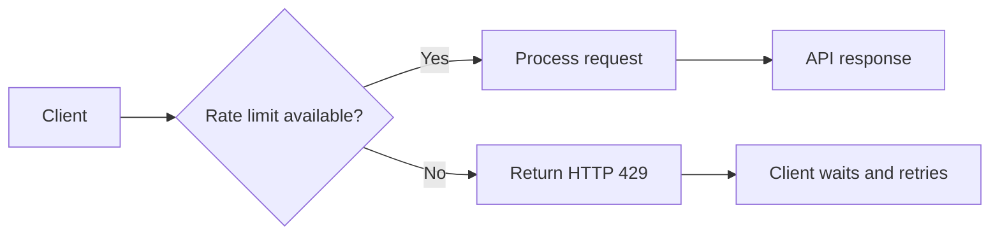
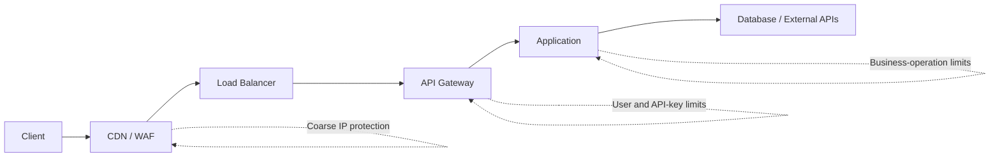
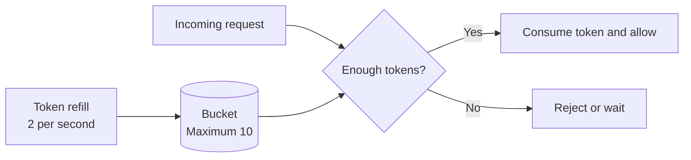
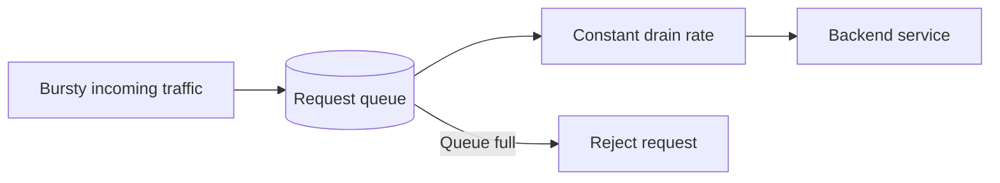
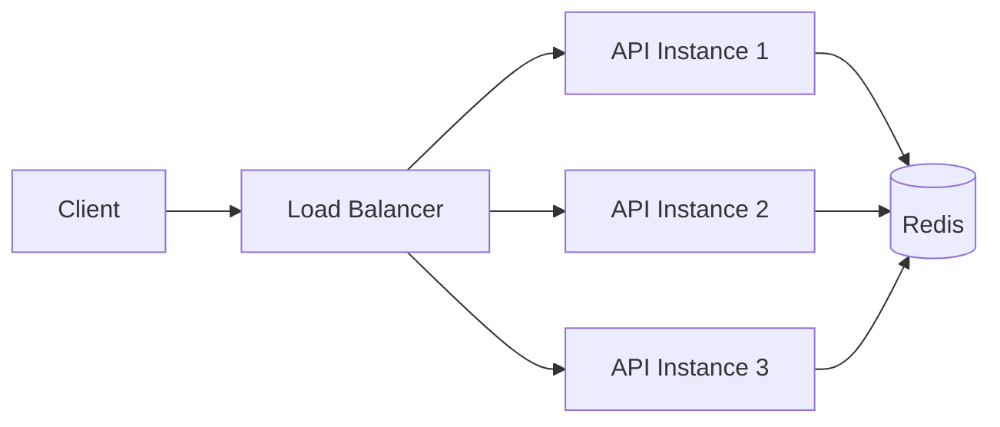
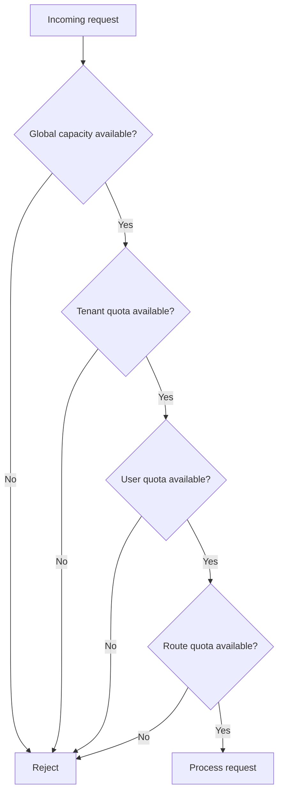
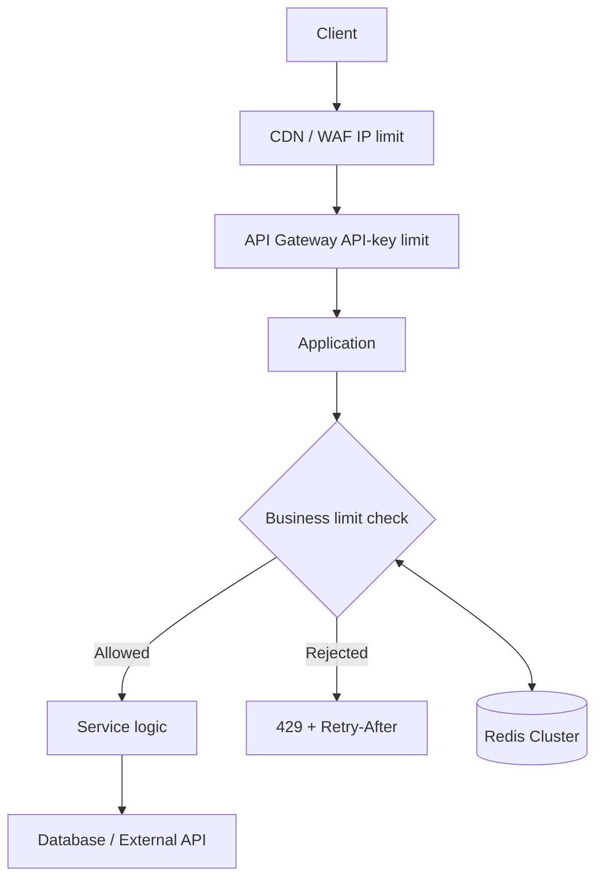

# Rate Limiting in API Design & REST

> **Interview preparation guide for intermediate backend developers**  
> **Updated:** July 2026

---

## Table of Contents

1. [What Is Rate Limiting?](#1-what-is-rate-limiting)
2. [Why APIs Need Rate Limiting](#2-why-apis-need-rate-limiting)
3. [Rate Limiting vs Related Concepts](#3-rate-limiting-vs-related-concepts)
4. [Where Rate Limiting Fits in an API](#4-where-rate-limiting-fits-in-an-api)
5. [Choosing the Rate-Limit Identity and Scope](#5-choosing-the-rate-limit-identity-and-scope)
6. [Core Rate-Limiting Algorithms](#6-core-rate-limiting-algorithms)
7. [Algorithm Comparison](#7-algorithm-comparison)
8. [HTTP and REST Response Design](#8-http-and-rest-response-design)
9. [Client-Side Retry Behaviour](#9-client-side-retry-behaviour)
10. [Distributed Rate Limiting with Redis](#10-distributed-rate-limiting-with-redis)
11. [Practical FastAPI and Redis Example](#11-practical-fastapi-and-redis-example)
12. [Weighted and Multi-Level Limits](#12-weighted-and-multi-level-limits)
13. [Rate Limiting in Microservices](#13-rate-limiting-in-microservices)
14. [Observability and Monitoring](#14-observability-and-monitoring)
15. [Security and Reliability Considerations](#15-security-and-reliability-considerations)
16. [Recommended Production Design](#16-recommended-production-design)
17. [Practical Scenarios](#17-practical-scenarios)
18. [Interview-Focused Summary](#18-interview-focused-summary)
19. [Standards Reference](#19-standards-reference)

---

## 1. What Is Rate Limiting?

**Rate limiting controls how many requests a client can make to an API during a defined period.**

For example:

```text
Maximum 100 requests per minute per authenticated user
```

When the client remains within the limit, the API processes the requests normally. When the client exceeds the limit, the API temporarily rejects additional requests.



Rate limiting is not only about blocking abusive users. It is a normal API design mechanism used to:

- protect infrastructure;
- share capacity fairly;
- control operational cost;
- prevent accidental traffic spikes;
- enforce plan-based API quotas;
- keep downstream services stable.

### Simple Example

Assume the policy is:

```text
5 requests per 10 seconds per user
```

```text
Request 1  -> Allowed
Request 2  -> Allowed
Request 3  -> Allowed
Request 4  -> Allowed
Request 5  -> Allowed
Request 6  -> Rejected with 429 Too Many Requests
```

After sufficient capacity becomes available again, the user can continue making requests.

---

## 2. Why APIs Need Rate Limiting

### 2.1 Protect Server Resources

Every request may consume:

- CPU;
- memory;
- database connections;
- network bandwidth;
- thread or worker capacity;
- third-party API quota;
- LLM tokens or other paid resources.

Without rate limiting, one client can consume a large portion of the available capacity.

### 2.2 Prevent Accidental Overload

A client bug can create an infinite loop:

```python
while True:
    requests.get("https://api.example.com/orders")
```

The client may not be malicious, but the effect on the API can be similar to an attack.

### 2.3 Provide Fair Usage

Suppose an API can safely process 10,000 requests per minute. Without per-client limits, one customer may consume most of that capacity and increase latency for everyone else.

### 2.4 Enforce Commercial Plans

```text
Free plan       -> 100 requests/hour
Standard plan   -> 1,000 requests/hour
Enterprise plan -> 10,000 requests/hour
```

This is commonly called a **quota**, although quota and rate are not exactly the same concept.

### 2.5 Protect Expensive Endpoints

Not every request has the same cost.

```text
GET /users/123          -> inexpensive
POST /reports/generate  -> expensive
POST /ai/analyse        -> very expensive
```

A good API can apply stricter or weighted limits to expensive operations.

---

## 3. Rate Limiting vs Related Concepts

### 3.1 Rate Limiting vs Throttling

These terms are often used interchangeably, but a useful distinction is:

- **Rate limiting** defines the allowed rate.
- **Throttling** is the action taken when traffic approaches or exceeds that rate.

Throttling may reject requests, delay them, reduce concurrency, or degrade optional functionality.

### 3.2 Rate Limit vs Quota

A **rate limit** normally controls short-term request frequency.

```text
10 requests per second
```

A **quota** normally controls total usage over a longer period.

```text
100,000 requests per month
```

Production systems often enforce both:

```text
Burst protection: 20 requests/second
Daily quota:       50,000 requests/day
```

### 3.3 Rate Limiting vs Concurrency Limiting

Rate limiting controls requests over time.

```text
100 requests per minute
```

Concurrency limiting controls how many requests may be executing simultaneously.

```text
Maximum 10 active report-generation requests
```

Concurrency limits are important for long-running operations because a client may stay under its request-per-minute limit while still occupying all workers.

### 3.4 Rate Limiting vs Load Shedding

- **Rate limiting** usually applies a policy to a known client or traffic partition.
- **Load shedding** rejects work because the system itself is overloaded.

An overloaded service may return `503 Service Unavailable`, while a client that exceeds its assigned limit normally receives `429 Too Many Requests`.

### 3.5 Rate Limiting vs Authentication and Authorization

Rate limiting is not access control.

```text
Authentication: Who are you?
Authorization:  Are you allowed to perform this operation?
Rate limiting:  How frequently may you perform it?
```

A request may be authenticated and authorized but still be rate-limited.

---

## 4. Where Rate Limiting Fits in an API

Rate limiting should usually happen as early as possible so rejected requests do not consume expensive backend resources.



### Common Enforcement Layers

### Edge, CDN, or WAF

Best for:

- obvious abusive IP traffic;
- bot protection;
- volumetric protection;
- broad per-IP limits.

### API Gateway or Reverse Proxy

Best for:

- API-key limits;
- route-based limits;
- customer-plan limits;
- centralized policies across services.

### Application Layer

Best for:

- business-specific limits;
- per-tenant rules;
- operation cost awareness;
- role-based policies;
- limits based on database or billing state.

### Recommended Layered Approach

```text
Edge limit        -> Protect the public entry point
Gateway limit     -> Enforce general API policies
Application limit -> Enforce business-specific policies
Downstream limit  -> Protect expensive dependencies
```

One limiter is rarely sufficient for a large production system.

---

## 5. Choosing the Rate-Limit Identity and Scope

Before choosing an algorithm, decide **who or what is being limited**.

### 5.1 Common Identity Keys

#### IP Address

```text
rate-limit:ip:203.0.113.10
```

Useful for unauthenticated endpoints, but imperfect because:

- many users can share one NAT address;
- mobile IPs change frequently;
- attackers can rotate IPs;
- proxy configuration may expose the wrong address.

Never blindly trust `X-Forwarded-For`. Trust it only when it is inserted or sanitized by infrastructure you control.

#### Authenticated User ID

```text
rate-limit:user:8842
```

Usually better than IP-based limiting after authentication.

#### API Key or OAuth Client

```text
rate-limit:api-key:key_abc123
```

Common for public developer APIs and machine-to-machine access.

#### Tenant or Organisation

```text
rate-limit:tenant:acme-corp
```

Important in multi-tenant SaaS because many users may share one customer-level subscription.

#### Endpoint or Operation

```text
rate-limit:user:8842:POST:/reports
```

Useful when endpoints have different operational costs.

#### Composite Key

A practical key may combine multiple dimensions:

```text
tenant + user + route + HTTP method
```

Example:

```text
rl:tenant:42:user:8842:POST:/reports/generate
```

### 5.2 Avoid High-Cardinality Abuse

A malicious client could generate unlimited fake identifiers and force the rate-limit store to create many keys.

Mitigations include:

- rate-limit unauthenticated traffic by trusted client IP;
- validate API keys before creating user-specific counters;
- set TTLs on all temporary keys;
- normalize route templates rather than storing raw URLs.

Use:

```text
GET:/users/{user_id}
```

Instead of:

```text
GET:/users/123
GET:/users/456
GET:/users/789
```

---

## 6. Core Rate-Limiting Algorithms

### 6.1 Fixed Window Counter

The fixed-window algorithm divides time into fixed periods and counts requests inside each period.

Example policy:

```text
100 requests per minute
```

```text
12:00:00 - 12:00:59 -> Window 1
12:01:00 - 12:01:59 -> Window 2
```

#### How It Works

1. Build a key from the client identity and current window.
2. Increment the counter.
3. Allow the request if the counter is within the limit.
4. Reject it if the counter exceeds the limit.

```text
Key: rl:user:42:2026-07-30T12:00
Value: 76
```

#### Pseudocode

```python
def allow_request(client_id, now, limit, window_seconds):
    window_id = now // window_seconds
    key = f"rate:{client_id}:{window_id}"

    count = increment(key)
    set_expiry_if_new(key, window_seconds)

    return count <= limit
```

#### Advantage

Simple, fast, and memory-efficient.

#### Main Problem: Boundary Burst

A client can send 100 requests near the end of one window and another 100 immediately after the next window begins.

```text
12:00:59.500 -> 100 requests
12:01:00.100 -> 100 requests
```

The API receives 200 requests in less than one second even though the configured limit is 100 per minute.


Use fixed windows when simplicity is more important than precise smoothing.

---

### 6.2 Sliding Window Log

The sliding-window log stores the timestamp of every accepted request.

For a 60-second window, when a request arrives at `12:01:30`, the limiter counts requests after `12:00:30`.

#### How It Works

1. Remove timestamps older than the active window.
2. Count the remaining timestamps.
3. Reject if the count has reached the limit.
4. Otherwise, add the current timestamp.

```text
Window: last 60 seconds
Stored timestamps:
12:00:45
12:01:02
12:01:18
12:01:29
```

#### Pseudocode

```python
def allow_request(client_id, now, limit, window_seconds):
    remove_timestamps_before(client_id, now - window_seconds)

    if count_timestamps(client_id) >= limit:
        return False

    add_timestamp(client_id, now)
    return True
```

#### Advantages

- precise;
- no fixed-window boundary spike;
- easy to reason about.

#### Disadvantages

- stores one record per request;
- more memory usage;
- cleanup and counting are more expensive;
- very high traffic can produce large sorted sets.

Use it when limits are relatively small and accuracy is more important than storage cost.

---

### 6.3 Sliding Window Counter

The sliding-window counter approximates a true sliding window by combining the previous fixed window with the current window.

Assume:

```text
Limit: 100 requests/minute
Previous window count: 80
Current window count: 30
Current window is 25% complete
```

Estimated usage:

```text
Previous contribution = 80 × 75% = 60
Current contribution  = 30
Estimated total       = 90
```

#### Formula

```text
estimated_count =
    previous_count × remaining_fraction_of_previous_window
    + current_count
```

#### Advantages

- smoother than fixed window;
- uses much less memory than a sliding log;
- practical for high-volume APIs.

#### Disadvantages

- approximate rather than exact;
- slightly more complex than a fixed counter.

This is a strong general-purpose choice when exact per-request timestamps are unnecessary.

---

### 6.4 Token Bucket

The token-bucket algorithm maintains a bucket containing tokens.

- Tokens are added at a fixed refill rate.
- Each request consumes one or more tokens.
- A request is allowed only when enough tokens are available.
- The bucket has a maximum capacity.

Example:

```text
Bucket capacity: 10 tokens
Refill rate:     2 tokens/second
Request cost:    1 token
```



#### Why It Handles Bursts Well

If a client has been idle, tokens accumulate up to the bucket capacity. The client may then make a short burst without violating the long-term average rate.

```text
Long-term rate: 2 requests/second
Allowed burst:  up to 10 requests
```

#### Refill Calculation

```text
elapsed_time = now - last_refill_time
new_tokens = elapsed_time × refill_rate
available_tokens = min(capacity, old_tokens + new_tokens)
```

#### Pseudocode

```python
def allow_request(bucket, now, cost=1):
    elapsed = now - bucket.last_refill
    refilled = elapsed * bucket.refill_rate

    bucket.tokens = min(
        bucket.capacity,
        bucket.tokens + refilled,
    )
    bucket.last_refill = now

    if bucket.tokens < cost:
        return False

    bucket.tokens -= cost
    return True
```

#### Advantages

- supports controlled bursts;
- enforces a stable average rate;
- supports weighted requests;
- widely useful for APIs.

#### Disadvantages

- requires atomic token calculations;
- clock handling matters;
- configuration requires both refill rate and capacity.

For many real-world REST APIs, token bucket is the most flexible default.

---

### 6.5 Leaky Bucket

The leaky-bucket model places incoming requests into a queue and processes them at a constant rate.



#### Behaviour

```text
Incoming rate: variable
Processing rate: fixed
Queue capacity: limited
```

#### Advantages

- smooth output traffic;
- protects downstream systems from bursts;
- useful for jobs and asynchronous processing.

#### Disadvantages

- adds queueing latency;
- requests may wait even when they could otherwise run;
- requires a maximum queue size and timeout policy.

#### Token Bucket vs Leaky Bucket

```text
Token bucket -> Allows controlled bursts
Leaky bucket -> Smooths traffic to a steady output rate
```

---

### 6.6 Concurrency Limiter

A concurrency limiter tracks currently active operations rather than requests over a time window.

```text
Maximum active exports per tenant: 5
```

#### Flow

1. Request begins.
2. Atomically acquire a permit.
3. Reject or wait if no permit is available.
4. Release the permit in a `finally` block when processing finishes.

```python
acquired = acquire_permit(tenant_id)
if not acquired:
    raise TooManyRequests()

try:
    return generate_export()
finally:
    release_permit(tenant_id)
```

Concurrency limiting is especially useful for:

- report generation;
- file processing;
- AI inference;
- database-heavy searches;
- third-party calls with connection limits.

---

## 7. Algorithm Comparison

| Algorithm | Accuracy | Memory | Burst Handling | Complexity | Best Use |
|---|---:|---:|---:|---:|---|
| Fixed window | Medium | Low | Weak at boundaries | Low | Simple quotas |
| Sliding log | High | High | Good | Medium | Strict low-volume limits |
| Sliding counter | Medium-High | Low | Good | Medium | General API limits |
| Token bucket | High | Low | Excellent and configurable | Medium | Most public APIs |
| Leaky bucket | High | Queue-dependent | Smooths bursts | Medium-High | Downstream traffic shaping |
| Concurrency limiter | Not time-based | Low | Controls active work | Medium | Long-running operations |

### Practical Selection Guide

```text
Need the simplest counter?
    -> Fixed window

Need exact rolling-window enforcement?
    -> Sliding window log

Need a memory-efficient rolling approximation?
    -> Sliding window counter

Need controlled bursts with a stable average rate?
    -> Token bucket

Need constant downstream traffic?
    -> Leaky bucket

Need to protect long-running workers?
    -> Concurrency limiter
```

A mature API may use more than one algorithm at the same time.

---

## 8. HTTP and REST Response Design

### 8.1 Use HTTP 429 for Client Rate-Limit Violations

When a client has sent too many requests in a given period, return:

```http
HTTP/1.1 429 Too Many Requests
```

A useful response should explain what happened and provide retry guidance.

#### Recommended Response

```http
HTTP/1.1 429 Too Many Requests
Content-Type: application/problem+json
Retry-After: 30
Cache-Control: no-store

{
  "type": "https://api.example.com/problems/rate-limit-exceeded",
  "title": "Rate limit exceeded",
  "status": 429,
  "detail": "Too many requests were sent for this API key.",
  "instance": "/orders",
  "retry_after_seconds": 30
}
```

`application/problem+json` follows the standard HTTP Problem Details structure and gives clients a predictable error shape.

### 8.2 Retry-After Header

`Retry-After` tells the client how long it should wait before making a follow-up request.

It can contain delta seconds:

```http
Retry-After: 30
```

Or an HTTP date:

```http
Retry-After: Thu, 30 Jul 2026 12:30:00 GMT
```

Delta seconds are usually easier for API clients.

### 8.3 Current RateLimit Header Standardisation

As of July 2026, the active IETF Internet-Draft proposes two response fields:

```http
RateLimit-Policy: "basic";q=100;w=60
RateLimit: "basic";r=60;t=58
```

Meaning:

```text
Policy name:       basic
Quota (q):         100 units
Window (w):        60 seconds
Remaining (r):     60 units
Effective time (t): 58 seconds
```

The draft is still a work in progress, so production APIs must treat its exact syntax as version-sensitive.

#### Widely Deployed Legacy Convention

Many APIs still use non-standard or earlier-draft headers:

```http
X-RateLimit-Limit: 100
X-RateLimit-Remaining: 60
X-RateLimit-Reset: 1753878600
```

Some use names without the `X-` prefix:

```http
RateLimit-Limit: 100
RateLimit-Remaining: 60
RateLimit-Reset: 30
```

These formats remain common, but clients should follow the exact contract documented by the API provider.

### 8.4 429 vs 503

Use `429 Too Many Requests` when the rejection is associated with the client's rate or quota.

Use `503 Service Unavailable` when the service is temporarily unable to handle traffic because of general overload, maintenance, or dependency failure.

```text
One client exceeded its allocation -> 429
The entire service is overloaded    -> 503
```

Both responses may include `Retry-After`.

### 8.5 Do Rejected Requests Count?

This is an API policy decision and should be documented.

Common approaches:

- rejected requests do not consume additional quota;
- every attempt consumes quota to discourage aggressive retries;
- only requests that reach application processing consume quota;
- request cost depends on the operation outcome.

For public APIs, predictable and documented behaviour is more important than any single choice.

---

## 9. Client-Side Retry Behaviour

A good client should not immediately retry a `429` response in a tight loop.

### 9.1 Respect Retry-After

```python
response = call_api()

if response.status_code == 429:
    delay = int(response.headers.get("Retry-After", "1"))
    time.sleep(delay)
```

### 9.2 Use Exponential Backoff with Jitter

When `Retry-After` is absent, use exponential backoff.

```text
Attempt 1 -> wait about 1 second
Attempt 2 -> wait about 2 seconds
Attempt 3 -> wait about 4 seconds
Attempt 4 -> wait about 8 seconds
```

Add random jitter so many clients do not retry simultaneously.

```python
import random

base_delay = min(2 ** attempt, 30)
delay = random.uniform(0, base_delay)
```

### 9.3 Why Jitter Matters

Without jitter:

```text
1,000 clients fail at 12:00:00
All retry at 12:00:01
All fail again
All retry at 12:00:03
```

This creates a **thundering herd**.

With jitter, retry attempts are spread across time.

### 9.4 Retry Only Safe Operations Automatically

Automatic retries are simplest for idempotent operations such as `GET` and `PUT`.

For non-idempotent operations such as payment or order creation, use an idempotency key before retrying:

```http
Idempotency-Key: 8cc74e62-7f9d-4fd1-9c2c-0f018d4302c1
```

Rate limiting and idempotency solve different problems but are often needed together.

---

## 10. Distributed Rate Limiting with Redis

A limiter stored only in application memory works correctly only for a single process.

```text
Application Instance A -> Local counter = 70
Application Instance B -> Local counter = 65
```

Each instance believes the client is under a limit of 100, but the combined request count is 135.

### Central Store Design



Redis is commonly used because it provides:

- fast in-memory operations;
- atomic increments;
- key expiration;
- sorted sets;
- Lua scripting;
- shared state across API instances.

### 10.1 Atomicity Is Essential

This sequence is unsafe when separate operations can interleave:

```text
GET current count
IF count < limit
    INCREMENT count
```

Two workers may read the same value and both allow the request.

Prefer:

- atomic `INCR` operations;
- Redis transactions where suitable;
- a Lua script that checks and updates in one atomic execution.

### 10.2 Key Expiration

Every window-based key should expire automatically.

```text
rl:user:42:window:29384012 -> TTL 60 seconds
```

Without expiry, Redis accumulates stale counters indefinitely.

### 10.3 Fail-Open vs Fail-Closed

What happens if Redis is unavailable?

#### Fail Open

Allow the request.

```text
Advantage: API remains available
Risk:      limits are temporarily unenforced
```

Suitable when availability is more important than strict quota enforcement.

#### Fail Closed

Reject the request.

```text
Advantage: protected resource remains safe
Risk:      Redis failure blocks legitimate users
```

Suitable for highly expensive, security-sensitive, or billing-critical operations.

#### Hybrid Approach

Use a small local emergency limiter when the central store fails.

```text
Normal state  -> Distributed Redis limiter
Redis failure -> Conservative in-process fallback
```

---

## 11. Practical FastAPI and Redis Example

The following example demonstrates a fixed-window limiter. It is intentionally compact so the core design is easy to understand.

### 11.1 Redis Lua Script

The script increments the counter and sets the expiry atomically.

```lua
local current = redis.call("INCR", KEYS[1])

if current == 1 then
    redis.call("EXPIRE", KEYS[1], ARGV[1])
end

local ttl = redis.call("TTL", KEYS[1])
return {current, ttl}
```

### 11.2 FastAPI Middleware-Style Dependency

```python
from __future__ import annotations

import time
from dataclasses import dataclass

from fastapi import Depends, FastAPI, HTTPException, Request, Response
from redis.asyncio import Redis

app = FastAPI()
redis = Redis.from_url("redis://localhost:6379/0", decode_responses=True)

RATE_LIMIT_SCRIPT = """
local current = redis.call("INCR", KEYS[1])

if current == 1 then
    redis.call("EXPIRE", KEYS[1], ARGV[1])
end

local ttl = redis.call("TTL", KEYS[1])
return {current, ttl}
"""


@dataclass(frozen=True)
class RateLimitPolicy:
    limit: int
    window_seconds: int


DEFAULT_POLICY = RateLimitPolicy(limit=100, window_seconds=60)


def resolve_client_key(request: Request) -> str:
    """Prefer a verified user or API-key identity in production."""
    user_id = getattr(request.state, "user_id", None)
    if user_id:
        return f"user:{user_id}"

    client_host = request.client.host if request.client else "unknown"
    return f"ip:{client_host}"


async def enforce_rate_limit(
    request: Request,
    response: Response,
) -> None:
    policy = DEFAULT_POLICY
    client_key = resolve_client_key(request)

    now_epoch = int(time.time())
    window_id = now_epoch // policy.window_seconds
    seconds_until_reset = policy.window_seconds - (
        now_epoch % policy.window_seconds
    )
    redis_key = f"rl:{client_key}:{window_id}"

    current, ttl = await redis.eval(
        RATE_LIMIT_SCRIPT,
        1,
        redis_key,
        seconds_until_reset,
    )

    current = int(current)
    ttl = max(int(ttl), 0)
    remaining = max(policy.limit - current, 0)
    reset_at_epoch = now_epoch + ttl

    # Widely supported conventional headers.
    response.headers["X-RateLimit-Limit"] = str(policy.limit)
    response.headers["X-RateLimit-Remaining"] = str(remaining)
    response.headers["X-RateLimit-Reset"] = str(reset_at_epoch)

    if current > policy.limit:
        raise HTTPException(
            status_code=429,
            detail="Rate limit exceeded",
            headers={
                "Retry-After": str(ttl),
                "X-RateLimit-Limit": str(policy.limit),
                "X-RateLimit-Remaining": "0",
                "X-RateLimit-Reset": str(reset_at_epoch),
            },
        )


@app.get("/orders")
async def list_orders(
    _: None = Depends(enforce_rate_limit),
) -> dict[str, list[dict[str, str]]]:
    return {"orders": []}
```

#### Important Production Improvements

The example should be extended with:

- authenticated user, tenant, or API-key identities;
- route-specific policies;
- trusted proxy handling;
- fail-open or fail-closed behaviour;
- metrics and structured logs;
- a token-bucket or sliding-window algorithm when burst precision matters;
- standardized error responses;
- automated tests for boundary and concurrency conditions.

### 11.3 Test Cases to Verify

```text
1. Requests below the limit are accepted.
2. The request exactly at the limit is accepted.
3. The next request returns 429.
4. Retry-After is non-negative and reasonable.
5. Keys expire after the window.
6. Concurrent requests cannot exceed the limit through a race condition.
7. Different users have independent counters.
8. Different routes use the intended policies.
9. Redis failure follows the configured fail strategy.
10. Proxy headers cannot be spoofed by external clients.
```

---

## 12. Weighted and Multi-Level Limits

### 12.1 Weighted Requests

Not all requests should necessarily cost one unit.

```text
GET /products             -> 1 unit
GET /analytics/report     -> 5 units
POST /ai/generate         -> 20 units
```

A token bucket supports this naturally because each request can consume a different number of tokens.

```python
cost_by_operation = {
    "list_products": 1,
    "analytics_report": 5,
    "ai_generate": 20,
}
```

Weighted limits are useful when resource cost varies significantly, but API documentation must clearly explain the quota-unit model.

### 12.2 Multi-Level Limits

A request may need to satisfy several policies.

```text
Per user:   10 requests/second
Per tenant: 1,000 requests/minute
Per route:  100 report generations/hour
Global:     20,000 requests/second
```



All required checks should be atomic enough to avoid partial consumption. A Lua script can evaluate multiple Redis keys and update them together.

### 12.3 Burst and Sustained Limits Together

A robust public API may combine:

```text
20 requests/second
500 requests/minute
20,000 requests/day
```

The short window limits bursts, while the longer windows enforce sustained usage and billing plans.

---

## 13. Rate Limiting in Microservices

### 13.1 Gateway-Only Limiting Is Not Always Enough

The gateway can protect external traffic, but internal service-to-service calls may multiply.

```text
1 client request
    -> Order service
        -> 5 inventory calls
        -> 3 pricing calls
        -> 2 notification calls
```

One external request can produce many internal requests.

### 13.2 Apply Limits Near the Protected Resource

```text
Public API gateway -> client fairness
Order service      -> business operation limit
AI service         -> inference/concurrency limit
Third-party adapter-> vendor quota protection
```

### 13.3 Avoid Double-Counting Retries

Service meshes, HTTP clients, and gateways may retry requests automatically. Those retries can unexpectedly consume quotas.

Document whether quota is counted:

- at the gateway;
- at the application;
- per attempt;
- per logical idempotency key;
- only after admission to the protected operation.

### 13.4 Local vs Global Limits

#### Global Limit

All instances share one counter.

```text
Total maximum across the cluster: 1,000 requests/second
```

Accurate but requires coordination.

#### Local Limit

Each of ten instances permits 100 requests/second.

```text
Approximate total: 10 × 100 = 1,000 requests/second
```

This avoids central coordination but becomes inaccurate when load is uneven or the number of instances changes.

A hybrid design can allocate local capacity from a global budget.

---

## 14. Observability and Monitoring

A limiter that silently rejects requests is difficult to operate.

### 14.1 Useful Metrics

```text
rate_limit_requests_total
rate_limit_allowed_total
rate_limit_rejected_total
rate_limit_store_errors_total
rate_limit_check_duration_seconds
rate_limit_remaining_ratio
rate_limit_fallback_total
```

Recommended dimensions:

- policy name;
- route template;
- client plan;
- service;
- decision: allowed or rejected.

Avoid placing raw user IDs, API keys, or IP addresses in metric labels because they create high cardinality and may expose sensitive data.

### 14.2 Logs

A structured rejection log may contain:

```json
{
  "event": "rate_limit_rejected",
  "policy": "report-generation",
  "tenant_id": "tenant-42",
  "route": "POST /reports",
  "limit": 20,
  "retry_after_seconds": 17,
  "request_id": "req-9ad31"
}
```

Mask or hash sensitive identifiers according to security requirements.

### 14.3 Alerts

Alert on patterns such as:

- sudden increase in rejected requests;
- Redis errors or latency;
- one route consuming most quota;
- unusual IP distribution;
- global capacity near exhaustion;
- fallback mode active for an extended period.

A high rejection rate may indicate abuse, but it may also indicate an incorrectly configured client or an API limit that no longer matches normal usage.

---

## 15. Security and Reliability Considerations

### 15.1 Rate Limiting Is Not Complete DDoS Protection

Application-level rate limiting begins after network traffic has already reached part of your infrastructure.

Use layered protection:

```text
DDoS protection -> CDN/WAF -> load balancer -> API gateway -> application limiter
```

### 15.2 Do Not Expose Internal Capacity Carelessly

Very detailed limit information can help clients behave well, but it can also reveal system characteristics.

Expose enough information for safe client behaviour without publishing unnecessary internal topology or exact infrastructure capacity.

### 15.3 Keep the Limiter Fast

A rate limiter runs on every protected request. Its latency directly affects API latency.

Good properties include:

- constant-time or logarithmic operations;
- one network round trip where possible;
- bounded key size;
- automatic expiry;
- atomic updates;
- graceful store-failure behaviour.

### 15.4 Prevent Clock Problems

Distributed instances may have slightly different clocks.

Recommendations:

- synchronize infrastructure clocks;
- prefer server-side timestamps for critical Redis logic;
- use monotonic clocks for elapsed-time calculations within one process;
- avoid trusting client timestamps.

### 15.5 Protect Login and Password-Reset Endpoints

Authentication endpoints need multiple dimensions:

```text
Per IP
Per account/email
Per device or risk signal
Global suspicious-traffic limit
```

A per-IP limit alone can be bypassed by distributed attackers. A per-account limit alone can let an attacker lock out a victim. Balanced controls and progressive delays are safer.

### 15.6 Avoid User Enumeration

Rate-limit responses on login or reset endpoints should not reveal whether a username or email exists.

Prefer a consistent message:

```text
Too many attempts. Try again later.
```

### 15.7 Bound Queues

A leaky-bucket or waiting limiter must have:

- maximum queue length;
- maximum waiting time;
- cancellation handling;
- overload rejection.

An unlimited queue converts overload into memory exhaustion and extreme latency.

---

## 16. Recommended Production Design

For a typical multi-instance REST API, a practical design is:



### Suggested Policies

```text
Unauthenticated endpoints -> trusted-IP fixed or token bucket
Authenticated API         -> user/API-key token bucket
Multi-tenant SaaS         -> tenant + user limits
Expensive async work      -> request rate + concurrency limit
Third-party integrations  -> outbound token bucket
Billing plans             -> short-term rate + long-term quota
```

### Decision Sequence

1. Identify the resource being protected.
2. Choose the rate-limit identity.
3. Define quota units and request costs.
4. Select short-term and long-term windows.
5. Decide whether bursts are allowed.
6. Choose the algorithm.
7. Choose enforcement layers.
8. Define the `429` response contract.
9. Decide fail-open or fail-closed behaviour.
10. Add metrics, logs, tests, and operational dashboards.

---

## 17. Practical Scenarios

### 17.1 Public Product API

Requirement:

```text
Free users: 60 requests/minute
Allow small bursts
```

Recommended design:

```text
Identity: API key
Algorithm: Token bucket
Refill: 1 token/second
Capacity: 10 tokens
Long-term quota: 60/minute or separate hourly quota
Response: 429 + Retry-After
```

### 17.2 Report Generation

Requirement:

```text
Reports are CPU-heavy and take 20 seconds.
```

Recommended design:

```text
Per-tenant request limit: 20/hour
Per-tenant concurrency: 2 active reports
Global concurrency: 50 active reports
Execution: asynchronous job queue
```

A request-per-minute limit alone does not protect worker concurrency.

### 17.3 Search Endpoint

Requirement:

```text
Search creates expensive database queries.
```

Recommended design:

```text
Per-user token bucket
Higher cost for broad searches
Maximum query complexity
Database statement timeout
Caching for repeated queries
```

Rate limiting should complement query validation and database protection.

### 17.4 Login Endpoint

Recommended layered design:

```text
5 attempts/minute per account
20 attempts/minute per IP
Progressive delay after repeated failures
Risk-based challenge for suspicious patterns
Generic error messages
```

### 17.5 Outbound Vendor API

Your service may need to protect itself from exceeding a vendor's quota.

```text
Vendor limit: 100 requests/second across all workers
```

Use a distributed outbound token bucket before making the vendor call. Add retries with jitter and respect the vendor's `Retry-After` response.

---

## 18. Interview-Focused Summary

### Core Explanation

Rate limiting controls how frequently a client may access an API. It protects availability, provides fair usage, controls cost, and enforces quotas. The limit can be based on IP address, user, API key, tenant, endpoint, or a combination of these values.

### Most Important Algorithms

```text
Fixed window:
Simple counter per fixed interval, but allows bursts at window boundaries.

Sliding log:
Stores request timestamps and is precise, but uses more memory.

Sliding counter:
Approximates a rolling window with low memory usage.

Token bucket:
Refills tokens at a steady rate and allows controlled bursts.

Leaky bucket:
Queues traffic and releases it at a constant rate.

Concurrency limiter:
Restricts active operations rather than requests per time window.
```

### HTTP Behaviour

```text
Client exceeded assigned rate -> 429 Too Many Requests
General service overload       -> 503 Service Unavailable
Retry guidance                 -> Retry-After
Machine-readable error         -> application/problem+json
```

### Distributed-System Principle

In a multi-instance API, local counters are not globally accurate. Use a shared or coordinated store such as Redis, and ensure each check-and-update operation is atomic.

### Strong Practical Answer

> For a public REST API, I would normally use a token bucket or sliding-window counter, identify authenticated clients by API key or user ID, and keep state in Redis for consistency across instances. I would return `429 Too Many Requests` with `Retry-After`, document the quota policy, and make clients use backoff with jitter. For expensive long-running operations, I would add a concurrency limit because a request-rate limit alone does not protect workers.

---

## 19. Standards Reference

The following standards and active work are directly relevant:

- **RFC 6585 — Additional HTTP Status Codes:** defines `429 Too Many Requests`.
- **RFC 9110 — HTTP Semantics:** defines `Retry-After` and general HTTP semantics.
- **RFC 9457 — Problem Details for HTTP APIs:** defines `application/problem+json` for machine-readable API errors.
- **IETF draft-ietf-httpapi-ratelimit-headers-11 — RateLimit header fields for HTTP:** active May 2026 draft proposing `RateLimit-Policy` and `RateLimit`; it remains a work in progress and may change.

---

### Final Takeaway

Rate limiting is an API capacity-allocation mechanism, not merely an abuse blocker. A good design clearly defines:

```text
WHO is limited
WHAT consumes quota
HOW the limit is calculated
WHERE it is enforced
WHEN capacity becomes available again
HOW clients should respond
```

For most production REST APIs, combine edge protection, a distributed token-bucket or sliding-window limiter, clear `429` responses, safe retry guidance, and separate concurrency controls for expensive work.
