# REST Principles, HTTP Methods & Status Codes

> Practical understanding for backend development and technical interviews
>
> **Standards baseline:** HTTP semantics from RFC 9110, HTTP caching from RFC 9111, Problem Details from RFC 9457, and the current IANA registries.

## In short

- A URI names the resource, the method states the intent, the status code states the outcome, and the body carries a representation.
- `GET`, `HEAD`, `OPTIONS`, `TRACE` and `QUERY` are safe; those plus `PUT` and `DELETE` are idempotent; `POST` and `PATCH` are neither by default.
- `POST` creates when the server picks the URI, `PUT` replaces the whole representation at a URI the client already knows, `PATCH` changes selected fields.
- Success codes: `200` returned content, `201` created plus a `Location` header, `202` accepted but not finished, `204` succeeded with nothing to send.
- Client errors: `401` unauthenticated vs `403` authenticated but refused, `404` missing or hidden, `405` wrong method, `409` state conflict, `412` failed `If-Match`, `422` semantically invalid, `429` rate limited.
- Server errors: `500` unexpected, `502` invalid upstream response, `503` temporarily unavailable, `504` upstream timeout — and never leak stack traces in any of them.
- Return failures as RFC 9457 Problem Details with a stable machine-readable code, and use `ETag` with `If-Match` for cache validation and optimistic concurrency.

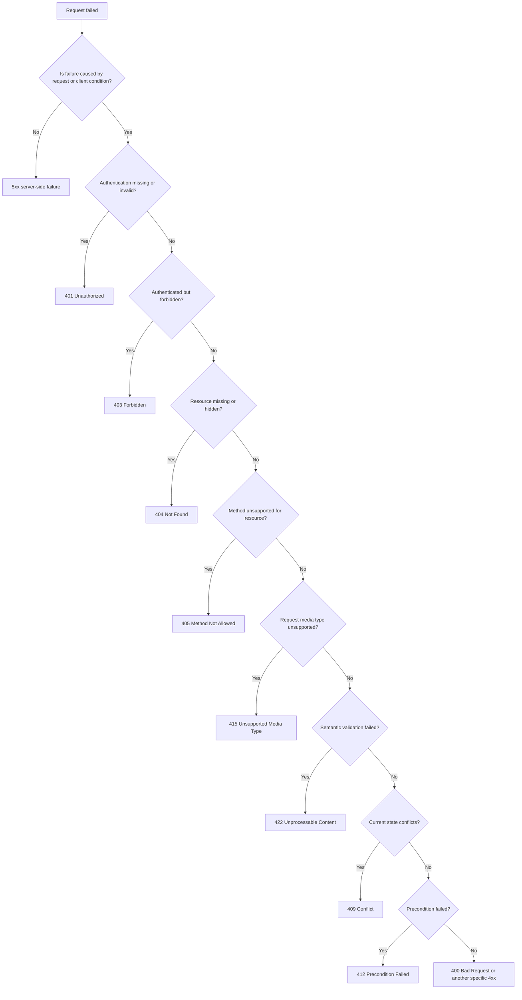

**Interview answer:** Choose the method by its contract — safe and idempotent for reads, `PUT` for a full replacement at a known URI, `PATCH` for a partial change, `POST` for creation or any unsafe processing — then choose the most specific status code that describes the outcome to the client rather than to your code. Creation is `201` with a `Location` header, accepted-but-unfinished work is `202`, and a successful call with nothing to return is `204`. On failure, separate authentication (`401`) from authorization (`403`), malformed syntax (`400`) from failed validation (`422`), and state conflicts (`409`) from failed preconditions (`412`).

**Gotcha:** Returning `200 OK` with `"success": false` in the body — every cache, gateway, retry layer and monitor between you and the client reads the status code, not your JSON.

---

# 1. REST and HTTP: The Big Picture

## 1.1 What Is REST?

**REST** stands for **Representational State Transfer**. It is an **architectural style** for designing distributed systems — not a programming language, a framework, a data format, a network protocol, or a strict API specification.

REST defines a set of architectural constraints that help systems remain scalable, loosely coupled, cache-friendly, and independently evolvable.

HTTP is commonly used to implement REST APIs because HTTP already provides resource identifiers through URIs, standard request methods and response status codes, headers and metadata, caching rules, content negotiation, authentication mechanisms, and intermediary support such as proxies and gateways.

A system can use HTTP without being RESTful. Similarly, merely returning JSON over HTTP does not automatically make an API RESTful.

---

## 1.2 Simple Mental Model

A REST API exposes **resources**. A client sends an HTTP request asking the server to operate on a resource.

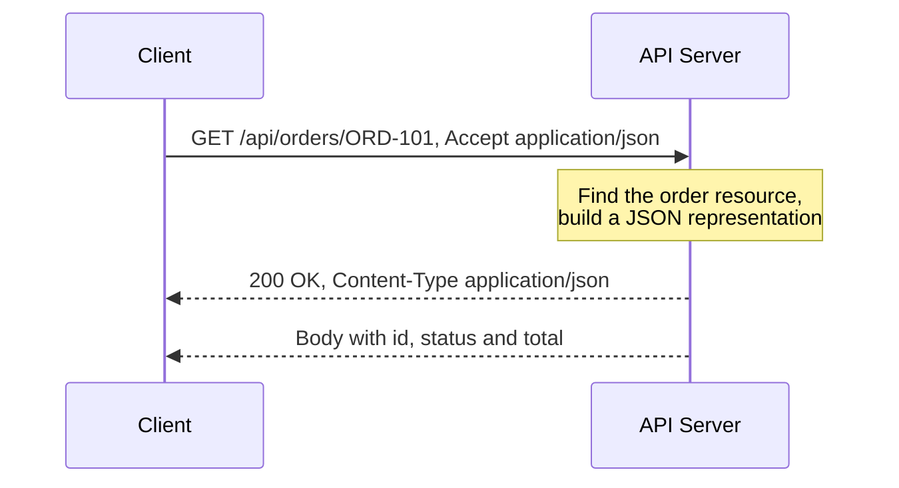

The URL identifies the resource.  
The HTTP method communicates the intended operation.  
The status code communicates the outcome.  
The response body contains a representation of the resource or an error.

---

## 1.3 REST vs REST API

| Term | Meaning |
|---|---|
| REST | Architectural style defined by constraints |
| REST API | An API designed using REST ideas |
| HTTP API | Any API using HTTP; it may or may not follow REST |
| JSON API | An API that exchanges JSON; JSON alone does not imply REST |
| RESTful API | An API that follows REST constraints to a meaningful degree |

---

# 2. Resources and Representations

## 2.1 What Is a Resource?

A **resource** is a conceptual entity that can be identified and interacted with: a user, an order, a product, a payment, a report, a collection of invoices, or the current status of a deployment. The identifier `/orders/ORD-101` names the resource "order ORD-101".

A resource is not the same as a database row. It is an API-level concept. `/account-summary` may combine the user table, the subscription table, a billing service, a payment provider and usage aggregation, and is still one API resource even though it is not one database record.

---

## 2.2 What Is a Representation?

A **representation** is the data format used to describe the current or intended state of a resource, and the same resource may have several. `GET /reports/2026-summary` with `Accept: application/json` returns `{"year": 2026, "revenue": 12500000}`, while the same URI with `Accept: application/pdf` returns a rendered document. The resource is the same, but its representation is different.

Common representation formats include JSON, XML, HTML, CSV, PDF, images and binary files. For most application APIs, JSON is the normal default.

---

## 2.3 Resource State vs Application State

These two ideas are commonly confused. **Resource state** is state stored or managed by the server, such as `{"order_id": "ORD-101", "status": "shipped"}`. **Application state** is the client’s current workflow or navigation position: `Cart page -> Address page -> Payment page -> Confirmation page`.

REST allows the server to store resource state.  
The stateless constraint means the server should not depend on hidden conversational state from earlier requests to understand the current request.

---

# 3. REST Architectural Constraints

REST is defined by a coordinated set of constraints.

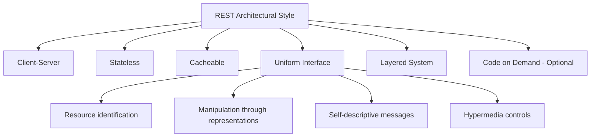

---

## 3.1 Client-Server

The client owns the user interface, user interaction, client-side state, calling the API and displaying representations. The server owns business rules, resource management, persistence, authorization, validation and response generation.

### Benefit

The frontend and backend can evolve independently as long as the API contract remains compatible, and many clients can share one API.

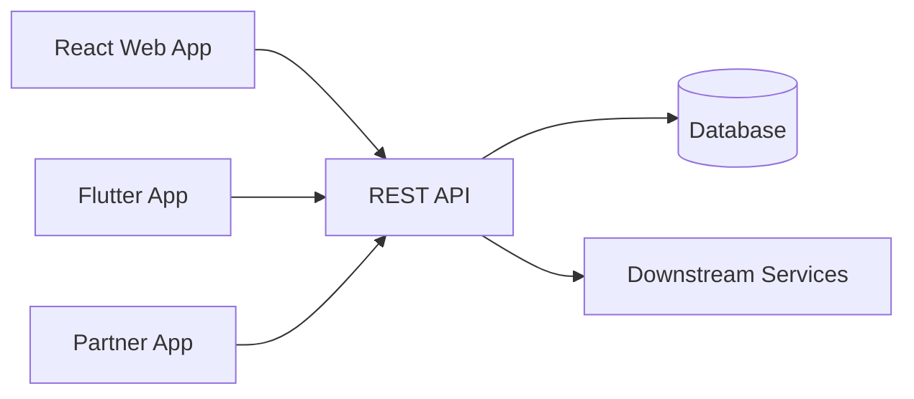

---

## 3.2 Stateless

Every request should contain enough information for the server to understand and process it.

```http
GET /orders/ORD-101 HTTP/1.1
Host: api.example.com
Authorization: Bearer <access-token>
Accept: application/json
```

The server should not require one request to say "remember that I selected customer C-10" so that a later request can mean "now return their orders". `GET /customers/C-10/orders` carries its own context.

### Stateless does not mean “the server stores no state”

The server can store users, orders, permissions, tokens, database records, cache entries and audit logs. Statelessness means each request is independently understandable.

### Benefit

Any available application instance can handle the request, which improves horizontal scalability and failover.

---

## 3.3 Cacheable

Responses should clearly communicate whether and how they may be cached.

```http
HTTP/1.1 200 OK
Cache-Control: public, max-age=300
ETag: "product-42-v8"
Content-Type: application/json
```

Caching can reduce latency, network traffic, database load, application-server load and infrastructure cost. It must be applied carefully to personalized or sensitive data.

---

## 3.4 Uniform Interface

A consistent interface reduces coupling between clients and servers.

The uniform interface includes four important ideas.

### 3.4.1 Resource identification

Resources are identified using URIs such as `/users/42`, `/orders/ORD-101` and `/products/P-500/reviews`.

### 3.4.2 Manipulation through representations

A client sends a representation describing a desired resource state or change.

```http
PATCH /users/42
Content-Type: application/merge-patch+json

{
  "display_name": "Aarav"
}
```

### 3.4.3 Self-descriptive messages

The request and response should carry enough metadata to explain how they must be processed, through headers such as `Content-Type`, `Accept`, `Authorization` and `Cache-Control`.

### 3.4.4 Hypermedia as the Engine of Application State

A response can include links or controls that tell the client which transitions are available.

```json
{
  "id": "ORD-101",
  "status": "pending_payment",
  "_links": {
    "self": { "href": "/orders/ORD-101" },
    "payment": { "href": "/orders/ORD-101/payments", "method": "POST" },
    "cancel": { "href": "/orders/ORD-101/cancellations", "method": "POST" }
  }
}
```

Many real-world APIs use resource-oriented HTTP design without fully implementing hypermedia. They are commonly called REST APIs, although they do not apply the complete REST style.

---

## 3.5 Layered System

A client does not need to know whether it is communicating directly with the origin server or through intermediaries.

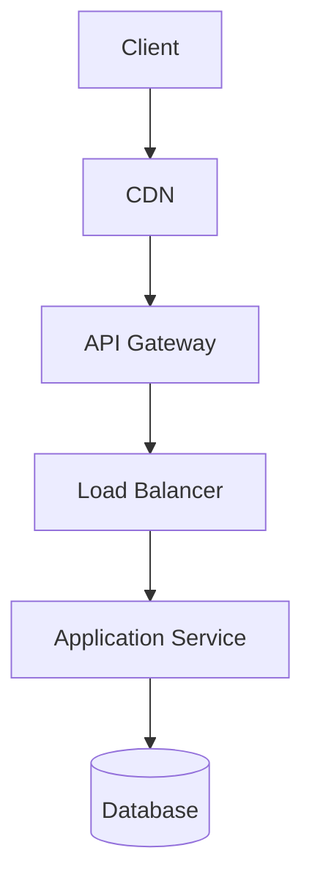

Layers can provide TLS termination, authentication, rate limiting, caching, logging, routing, load balancing and web application firewall rules.

---

## 3.6 Code on Demand — Optional

A server may send executable code to a client.

The most common example is a web server sending JavaScript to a browser.

This is the only optional REST constraint and is normally not central to backend JSON API design.

---

# 4. Designing Resource-Oriented URLs

## 4.1 Prefer Nouns Over Verbs

The HTTP method already represents the general operation, so prefer `GET /users`, `POST /users`, `GET /users/42`, `PATCH /users/42` and `DELETE /users/42` over generic CRUD action names such as `GET /getUsers`, `POST /createUser`, `POST /updateUser` and `POST /deleteUser`.

The noun-based form is more predictable and better aligned with HTTP semantics.

---

## 4.2 Use Collections and Individual Resources

`/users` is a collection, `/users/42` is one user, `/users/42/orders` is that user's order collection and `/users/42/orders/901` is one order under that user.

| Operation | Method and URI |
|---|---|
| List users | `GET /users` |
| Create user | `POST /users` |
| Read user | `GET /users/{user_id}` |
| Replace user | `PUT /users/{user_id}` |
| Partially update user | `PATCH /users/{user_id}` |
| Delete user | `DELETE /users/{user_id}` |

---

## 4.3 Use Stable Identifiers

Prefer identifiers that do not change when mutable attributes change. `/users/8f52c18d`, `/products/P-1048` and `/orders/ORD-2026-00081` are stable; `/users/aarav-shah` and `/products/blue-running-shoe-size-10` break the moment the name or attribute changes.

A human-readable slug is acceptable when it is designed as a stable identifier.

---

## 4.4 Keep Nesting Shallow

`/customers/C-10/orders` and `/orders/O-90/items` are reasonable. `/companies/1/departments/2/teams/3/users/4/tasks/5/comments` is not — a deeply nested resource can usually be addressed directly as `/comments/{comment_id}`.

A practical guideline is to nest only when the parent relationship is important to identity, authorization, or filtering.

---

## 4.5 Use Query Parameters for Collection Controls

```http
GET /orders?status=paid&sort=-created_at&limit=20&cursor=abc123
```

Use query parameters for filtering, sorting, pagination, field selection, search and optional expansions.

```text
GET /users?role=admin
GET /orders?sort=-created_at
GET /products?limit=25&cursor=next-token
GET /customers/C-10?include=addresses,subscriptions
```

---

## 4.6 Model Business Actions as Resources

Not every operation is simple CRUD. Endpoints such as `POST /payments/PAY-10/refunds`, `POST /invoices/INV-90/reminders` and `POST /deployments/DEP-7/retries` model an action as the creation of a related resource or event.

```http
POST /orders/ORD-101/cancellations
Content-Type: application/json

{
  "reason": "customer_request"
}
```

```http
HTTP/1.1 201 Created
Location: /orders/ORD-101/cancellations/CAN-88
```

A command-style endpoint such as `POST /orders/ORD-101/cancel` can still be understandable, but a resource-oriented design is often easier to extend, audit, and make idempotent.

---

## 4.7 Naming Conventions

Choose one convention and apply it consistently — `/orders/{order_id}/line-items` or `/orders/{order_id}/line_items`, not both. For URLs, lowercase kebab-case such as `/payment-methods` and `/audit-events` is the readable default.

Other practical rules: avoid file extensions such as `/users.json`, avoid implementation names such as `/postgres/users`, do not expose internal table names, keep sensitive information out of URLs, be consistent about trailing slashes, and keep identifiers URL-safe.

---

# 5. HTTP Request and Response Structure

## 5.1 Request Structure

```http
PATCH /users/42 HTTP/1.1
Host: api.example.com
Authorization: Bearer eyJ...
Content-Type: application/merge-patch+json
Accept: application/json
If-Match: "user-42-v7"

{
  "display_name": "Aarav Shah"
}
```

A request contains the method, target URI and HTTP version, then headers, a blank line, and optional content.

---

## 5.2 Response Structure

```http
HTTP/1.1 200 OK
Content-Type: application/json
ETag: "user-42-v8"
Cache-Control: private, max-age=60

{
  "id": "42",
  "display_name": "Aarav Shah"
}
```

A response contains the HTTP version, status code and reason phrase, then headers, a blank line, and optional content.

The numeric status code carries the protocol semantics. Clients should not depend on the human-readable reason phrase.

---

## 5.3 Important Headers

| Header | Purpose |
|---|---|
| `Authorization` | Sends authentication credentials |
| `Content-Type` | Describes the request or response content |
| `Accept` | Requests an acceptable response media type |
| `Location` | Identifies a created resource or redirect target |
| `Cache-Control` | Controls caching |
| `ETag` | Identifies a particular representation version |
| `If-Match` | Applies an operation only when an ETag matches |
| `If-None-Match` | Commonly used for cache validation |
| `Last-Modified` | Timestamp validator for a representation |
| `Retry-After` | Suggests when the client should retry |
| `Allow` | Lists methods supported by a resource |
| `WWW-Authenticate` | Describes authentication required for a `401` |
| `Idempotency-Key` | Application convention for deduplicating unsafe requests |
| `Vary` | Identifies request fields that affect cached response selection |

`Idempotency-Key` is widely used by payment and creation APIs, but it is not one of the core HTTP method semantics defined by RFC 9110.

---

# 6. HTTP Method Properties

Three properties are especially important:

1. Safety
2. Idempotency
3. Cacheability

---

## 6.1 Safe Methods

A method is **safe** when the client is not requesting a change to the target resource’s state: `GET`, `HEAD`, `OPTIONS`, `TRACE` and `QUERY`. Operational side effects such as access logs, metrics, cache population and bandwidth billing are allowed, because they do not change the intended semantics of the target resource. A business mutation is not allowed, so `GET /orders/ORD-101/cancel` is wrong — crawlers, browser prefetching, retries and caches all issue safe requests automatically.

---

## 6.2 Idempotent Methods

A method is **idempotent** when N identical requests leave the same intended target state as one request. `GET`, `HEAD`, `PUT`, `DELETE`, `OPTIONS`, `TRACE` and `QUERY` are idempotent; `POST` is not, and `PATCH` is not by default, although a particular patch can be designed to be. Idempotency constrains the resulting state, not the responses: a repeated `DELETE /users/42` may answer `204 No Content` and then `404 Not Found` and still be idempotent, because user `42` does not exist either way.

The full method-by-method properties table, `Idempotency-Key` design and retry-safety patterns are in [Idempotency (HTTP)](idempotency-http-methods.md).

---

## 6.3 Cacheable Methods

`GET` and `HEAD` are the main cache-oriented methods.

Other responses may be cacheable when their specifications and response metadata allow it, but real-world cache support varies. `POST` responses are rarely cached in practice; `PUT`, `PATCH` and `DELETE` responses are normally not cached at all; `QUERY` is defined as cacheable under QUERY-aware cache rules.

---

# 7. Core HTTP Methods

## 7.1 GET — Retrieve a Representation

Use `GET` to retrieve the current representation of a resource.

```http
GET /products/P-100 HTTP/1.1
Accept: application/json
```

```http
HTTP/1.1 200 OK
Content-Type: application/json
ETag: "product-P-100-v4"

{
  "id": "P-100",
  "name": "Mechanical Keyboard",
  "price": 7999
}
```

Common responses:

| Situation | Status |
|---|---|
| Resource returned | `200 OK` |
| Range returned | `206 Partial Content` |
| Cached representation is still valid | `304 Not Modified` |
| Resource does not exist | `404 Not Found` |
| Authentication required | `401 Unauthorized` |
| Access denied | `403 Forbidden` |

The semantics of content in a `GET` request are not generally defined. Use query parameters for normal filtering, or a method with defined request-content semantics.

---

## 7.2 HEAD — Retrieve Headers Without Response Content

`HEAD` is similar to `GET`, but the server does not send response content. `HEAD /files/report.pdf` answers:

```http
HTTP/1.1 200 OK
Content-Type: application/pdf
Content-Length: 845210
ETag: "report-v3"
Last-Modified: Wed, 29 Jul 2026 08:30:00 GMT
```

It is useful for checking whether a resource exists, reading metadata and content length, and inspecting validators such as `ETag` to revalidate cached information.

The server should provide headers that correspond to a `GET` response, except where calculating a header would require generating the full content.

---

## 7.3 POST — Create or Process

`POST` asks the target resource to process the enclosed representation according to that resource’s own semantics.

Common uses are creating a new resource under a collection, submitting a command, starting an asynchronous job, creating a subordinate resource, processing a complex operation and triggering a domain workflow.

### Create a resource

```http
POST /orders
Content-Type: application/json

{
  "customer_id": "C-10",
  "items": [
    {
      "product_id": "P-100",
      "quantity": 2
    }
  ]
}
```

```http
HTTP/1.1 201 Created
Location: /orders/ORD-901
Content-Type: application/json

{
  "id": "ORD-901",
  "status": "pending"
}
```

### Start asynchronous work

```http
POST /reports
Content-Type: application/json

{
  "type": "annual-sales",
  "year": 2026
}
```

```http
HTTP/1.1 202 Accepted
Location: /report-jobs/JOB-77

{
  "job_id": "JOB-77",
  "status": "queued"
}
```

### Idempotency key for retry safety

```http
POST /payments
Idempotency-Key: 9fb40a71-3f9d-4cb6-9120-f8e824...

{
  "order_id": "ORD-901",
  "amount": 15998
}
```

The server stores the key and returns the original result when the same logical request is retried.

---

## 7.4 PUT — Create or Completely Replace a Resource

`PUT` requests that the state of the target resource be created or replaced by the supplied representation.

```http
PUT /users/42
Content-Type: application/json

{
  "id": "42",
  "name": "Aarav Shah",
  "email": "aarav@example.com",
  "active": true
}
```

The client normally knows the target URI.

Possible responses:

| Situation | Status |
|---|---|
| New resource created | `201 Created` |
| Existing resource replaced and body returned | `200 OK` |
| Existing resource replaced without response body | `204 No Content` |

### Important semantic

With replacement-style `PUT`, omitted fields may be reset or removed according to the API contract. If the existing state is `{"name": "Aarav", "email": "aarav@example.com", "active": true}` and the request body is only `{"name": "Aarav Shah"}`, the resulting state may become `{"name": "Aarav Shah", "email": null, "active": false}`.

Do not use `PUT` as a partial-update method unless the API contract explicitly defines different semantics.

---

## 7.5 PATCH — Partially Modify a Resource

`PATCH` applies a set of partial modifications.

```http
PATCH /users/42
Content-Type: application/merge-patch+json

{
  "display_name": "Aarav Shah"
}
```

```http
HTTP/1.1 200 OK
Content-Type: application/json

{
  "id": "42",
  "display_name": "Aarav Shah",
  "active": true
}
```

Possible responses:

- `200 OK` when returning the updated representation
- `204 No Content` when no response representation is returned
- `409 Conflict` when the change conflicts with current resource state
- `412 Precondition Failed` when an `If-Match` condition fails
- `415 Unsupported Media Type` when the patch format is unsupported
- `422 Unprocessable Content` when the patch is syntactically valid but semantically invalid

### PATCH formats

Two known approaches are:

#### JSON Merge Patch style

```json
{
  "name": "New Name",
  "phone": null
}
```

#### JSON Patch style

```json
[
  {
    "op": "replace",
    "path": "/name",
    "value": "New Name"
  },
  {
    "op": "remove",
    "path": "/phone"
  }
]
```

`PATCH` is not idempotent by definition, but a given patch can be. Setting `{"status": "active"}` is idempotent; an increment such as `{"operation": "increment", "path": "/login_count", "value": 1}` is not.

---

## 7.6 DELETE — Remove a Resource

`DELETE /users/42` has three normal outcomes: `204 No Content` when nothing needs to be returned, `200 OK` with a body such as `{"deleted": true, "id": "42"}`, or `202 Accepted` with `Location: /deletion-jobs/JOB-9` when removal is queued for asynchronous processing.

`DELETE` is idempotent by intended effect even when repeated responses differ.

A database soft-delete implementation does not change the HTTP method semantics. The API resource is considered unavailable or inactive according to the API contract.

---

## 7.7 OPTIONS — Discover Communication Options

`OPTIONS` asks what communication options are available for a target resource or server.

```http
OPTIONS /users/42
```

```http
HTTP/1.1 204 No Content
Allow: GET, HEAD, PUT, PATCH, DELETE, OPTIONS
Accept-Patch: application/merge-patch+json
```

Browsers also use `OPTIONS` for CORS preflight requests.

```http
OPTIONS /users/42
Origin: https://app.example.com
Access-Control-Request-Method: PATCH
Access-Control-Request-Headers: authorization, content-type
```

CORS is a browser security mechanism. It is separate from REST itself.

---

## 7.8 TRACE and CONNECT — Diagnostics and Tunnels

`TRACE` asks the server to reflect the received request back for diagnostics; it is usually disabled in production because reflected request data can expose sensitive information and widen the attack surface. `CONNECT` creates a tunnel to a target, commonly through an HTTP proxy carrying HTTPS traffic.

Both are protocol plumbing rather than application endpoints, and neither belongs in a REST resource design.

---

## 7.9 QUERY — Safe, Idempotent Server-Side Query

`QUERY` was standardized in RFC 10008 in 2026 and is now present in the IANA HTTP Method Registry. It fills the gap between `GET`, which is safe and idempotent but normally carries query input in the URI, and `POST`, which supports request content but is neither safe nor idempotent by default.

Example:

```http
QUERY /products/search HTTP/1.1
Content-Type: application/json
Accept: application/json

{
  "categories": ["laptops", "monitors"],
  "price": {
    "min": 50000,
    "max": 150000
  },
  "features": {
    "ports": ["usb-c", "hdmi"]
  }
}
```

It is safe and idempotent, expects request content, can be cached under QUERY-aware cache rules, and is useful for large or structured read-only queries.

### Practical adoption note

Although it is now standardized, frameworks, browsers, API gateways, security tools, SDK generators and observability products may not all support `QUERY` immediately. For broad compatibility, many production APIs will continue using `GET /products?category=laptops` or `POST /product-searches`.

When adopting `QUERY`, verify the complete request path: `Client -> CDN -> WAF -> Gateway -> Framework -> Router -> Monitoring`

---

# 8. Choosing PUT vs PATCH vs POST

## 8.1 Decision Table

| Requirement | Recommended method |
|---|---|
| Create resource and server chooses URI | `POST` to collection |
| Create or replace resource at known URI | `PUT` |
| Replace full representation | `PUT` |
| Change selected fields | `PATCH` |
| Run domain command | Usually `POST` |
| Submit unsafe processing | `POST` |
| Submit a safe, complex body-based query | `QUERY`, where supported |
| Simple read-only query | `GET` |

---

## 8.2 Example: User Resource

Create with a server-generated ID is `POST /users`. Replace a known user is `PUT /users/42`. Update only the email is `PATCH /users/42`. Activation through a domain operation is either the resource-oriented `POST /users/42/activations` or the command form `POST /users/42/activate`.

The resource-oriented form is useful when activation has its own identifier, timestamp, actor, status, audit record and reversal workflow.

---

## 8.3 Retry Behavior

```text
GET     -> normally safe to retry
HEAD    -> normally safe to retry
PUT     -> normally safe to retry
DELETE  -> normally safe to retry
QUERY   -> normally safe to retry
POST    -> retry only with application protection
PATCH   -> retry only when operation semantics are known
```

Use timeouts, bounded retries, exponential backoff, and jitter. Do not blindly retry every failure.

---

# 9. HTTP Status Code Classes

The first digit indicates the broad outcome class.

| Range | Class | Meaning |
|---:|---|---|
| `1xx` | Informational | Request received; processing continues |
| `2xx` | Successful | Request successfully received, understood, and accepted |
| `3xx` | Redirection | Additional action is needed |
| `4xx` | Client error | Request cannot be fulfilled because of client-side conditions |
| `5xx` | Server error | Server failed to fulfill an apparently valid request |

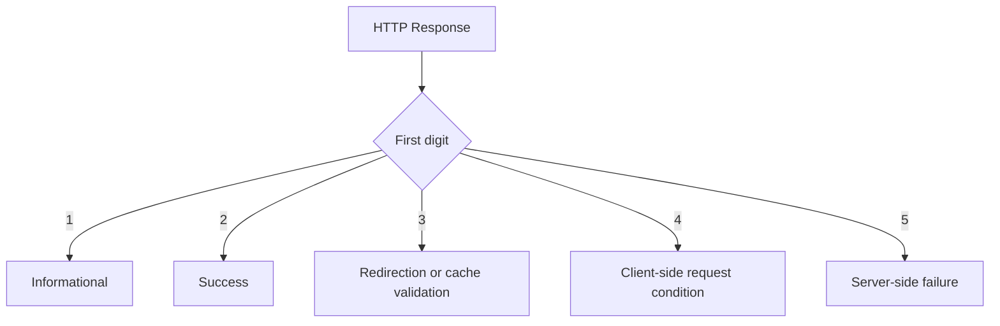

Do not return `200 OK` for every response while placing the real outcome only inside JSON. Avoid a `200 OK` carrying `{"success": false, "error": "user not found"}`, and prefer:

```http
HTTP/1.1 404 Not Found
Content-Type: application/problem+json

{
  "type": "https://api.example.com/problems/user-not-found",
  "title": "User not found",
  "status": 404
}
```

HTTP clients, gateways, caches, monitors, SDKs, and retry systems depend on the real status code.

---

# 10. Success Status Codes — 2xx

## 10.1 200 OK

Use when the operation succeeded and the response includes a representation or result — a successful `GET` or query, a `PATCH` returning the updated resource, a `DELETE` returning a result, or a `POST` returning processed output without creating a new resource.

```http
HTTP/1.1 200 OK

{
  "id": "42",
  "name": "Aarav"
}
```

---

## 10.2 201 Created

Use when the request creates a new resource — for successful creation, not for every successful `POST`. Include a `Location` header with the new resource URI, and optionally the new representation.

```http
HTTP/1.1 201 Created
Location: /users/42
Content-Type: application/json

{
  "id": "42",
  "name": "Aarav"
}
```

---

## 10.3 202 Accepted

Use when the request has been accepted but processing is not complete.

```http
HTTP/1.1 202 Accepted
Location: /video-transcoding-jobs/JOB-18
Retry-After: 10

{
  "id": "JOB-18",
  "status": "queued"
}
```

`202` does not guarantee that processing will eventually succeed, so always provide a way to observe the operation — here `GET /video-transcoding-jobs/JOB-18` returning `{"id": "JOB-18", "status": "processing", "progress": 65}`.

---

## 10.4 204 No Content

Use when the request succeeded and no response content is needed: a successful deletion, an update where the client does not need the updated representation, or a command with no response representation. A `204` response does not contain a message body.

---

## 10.5 206 Partial Content

Use for a successful range request — video streaming, large file downloads, download resumption and partial binary retrieval.

```http
GET /videos/V-90
Range: bytes=0-999999
```

```http
HTTP/1.1 206 Partial Content
Content-Range: bytes 0-999999/5000000
```

Do not use `206` as the normal status for paginated JSON collections. A paginated collection is usually returned with `200 OK`.

---

# 11. Redirection Status Codes — 3xx

The two legacy redirects are rarely a deliberate API design choice, because user agents historically change the method while following them:

| Code | Name | When to use |
|---:|---|---|
| `301` | Moved Permanently | Resource has a new permanent URI, sent in `Location`; clients and caches may remember it. Prefer `308` when the method must be preserved |
| `302` | Found | Resource is temporarily at another URI; prefer `307` when the method must be preserved |

The four that matter for API design have prose below.

---

## 11.1 303 See Other

Use when the client should retrieve another resource using `GET`.

The common pattern is after creating or submitting an operation: `POST /report-runs` answers `303 See Other` with `Location: /report-runs/R-10/result`, and the client follows with a `GET` on that URI.

---

## 11.2 304 Not Modified

Used for conditional cache validation. A `GET /products/P-100` carrying `If-None-Match: "product-v4"` gets back:

```http
HTTP/1.1 304 Not Modified
ETag: "product-v4"
```

The client reuses its cached representation. `304` is not a normal success response with JSON content and does not contain a response body representing the resource.

---

## 11.3 307 Temporary Redirect

Temporary redirect that preserves the original method and content. A `POST /payments` answered with `307` and `Location: https://payments-region-b.example.com/payments` makes the client repeat the `POST`, not switch to `GET`.

---

## 11.4 308 Permanent Redirect

Permanent redirect that preserves the original method and content.

| Need | Status |
|---|---|
| Temporary; method may historically change | `302` |
| Temporary; preserve method | `307` |
| Permanent; method may historically change | `301` |
| Permanent; preserve method | `308` |
| Redirect to a GET result | `303` |

---

# 12. Client Error Status Codes — 4xx

A `4xx` response means the request cannot be fulfilled because of the request or the client’s current conditions.

It does not mean that the backend code cannot throw an exception. The distinction is based on what the response means to the client.

---

## 12.1 400 Bad Request

Use when the server cannot process the request because it is malformed or violates basic request structure: invalid JSON, missing framing information, invalid query-parameter or date syntax, or mutually incompatible parameters. A truncated body such as `{"email": "aarav@example.com",` is a `400 Bad Request` — the server never got as far as validating it.

---

## 12.2 401 Unauthorized

Despite the name, `401` means the request lacks valid authentication credentials: the token is missing, invalid or expired, or the credentials cannot be verified. Include a challenge describing how to authenticate:

```http
HTTP/1.1 401 Unauthorized
WWW-Authenticate: Bearer realm="api"
```

The mental model:

```text
401 -> Who are you? Authentication is missing or invalid.
403 -> I know who you are, but you are not allowed.
```

---

## 12.3 403 Forbidden

The server understood the request but refuses to authorize it: the user lacks a required role, a tenant is reaching into another tenant’s data, account policy blocks the action, or the resource owner denied access.

Some APIs return `404` instead of `403` when revealing the resource’s existence would leak sensitive information. This should be an intentional security policy.

---

## 12.4 404 Not Found

The target resource does not exist, is not visible to the client, or the server does not wish to reveal whether it exists — `GET /users/999999` answers `404 Not Found`.

A collection with no matching elements normally returns an empty collection, not `404`:

```http
HTTP/1.1 200 OK

{
  "items": [],
  "next_cursor": null
}
```

---

## 12.5 405 Method Not Allowed

The resource exists, but the method is not supported for it. Always list what is supported:

```http
HTTP/1.1 405 Method Not Allowed
Allow: GET, HEAD, OPTIONS
```

Compare:

```text
404 -> target resource not found
405 -> target exists, but method is not allowed
501 -> server does not implement the method capability
```

---

## 12.6 409 Conflict

The request conflicts with the current state of the resource: a duplicate unique identifier, an invalid state transition, a dependency that blocks deletion, a concurrent update, or a username that already exists. `POST /users` with an email that is already taken is a `409 Conflict`, and so is asking to cancel an order whose current status is already `shipped`.

---

## 12.7 412 Precondition Failed

A request condition supplied by the client evaluated to false — a `PATCH /users/42` carrying `If-Match: "user-v7"` when the current ETag is `"user-v8"`. This is central to optimistic concurrency control.

---

## 12.8 422 Unprocessable Content

The server understands the media type and syntax, but cannot process the request instructions: a validation failure, a semantically invalid field combination, an invalid domain value, or valid patch syntax describing an impossible operation.

```http
POST /employees
Content-Type: application/json

{
  "name": "Aarav",
  "joining_date": "2026-09-01",
  "termination_date": "2026-08-01"
}
```

Every field parses, so the request is not malformed; it is `422 Unprocessable Content` because a termination date cannot precede the joining date.

### 400 vs 422

A useful API convention:

```text
400 -> malformed request or invalid request syntax/structure
422 -> syntax is valid, but data fails semantic validation
```

Both are valid choices for many validation cases when consistently documented. Framework defaults also influence this decision.

---

## 12.9 429 Too Many Requests

The client has exceeded a rate limit. Send `Retry-After` whenever the reset time is known, and expect clients to apply bounded backoff on top of it.

```http
HTTP/1.1 429 Too Many Requests
Retry-After: 60
Content-Type: application/problem+json

{
  "type": "https://api.example.com/problems/rate-limit-exceeded",
  "title": "Rate limit exceeded",
  "status": 429,
  "detail": "Try again after 60 seconds."
}
```

---

## 12.10 Other 4xx Codes at a Glance

| Code | Name | When to use |
|---:|---|---|
| `402` | Payment Required | Reserved for future use; some APIs use it by convention for billing failures |
| `406` | Not Acceptable | No representation matches the client’s `Accept` header; the mirror image of `415` |
| `407` | Proxy Authentication Required | Authentication with an HTTP proxy |
| `408` | Request Timeout | Server gave up waiting for a complete request; distinct from a client-side timeout waiting for a response |
| `410` | Gone | Existed before and was intentionally, likely permanently, removed; use `404` when permanence is unknown or should not be revealed |
| `411` | Length Required | Server requires `Content-Length` |
| `413` | Content Too Large | Request content exceeds what the server will process; older systems show the former phrase "Payload Too Large" |
| `414` | URI Too Long | URI exceeds acceptable length |
| `415` | Unsupported Media Type | The request’s `Content-Type` cannot be consumed, for example XML sent to a JSON-only API. `415` is about what the client sends, `406` about what it will accept |
| `416` | Range Not Satisfiable | Requested range cannot be served |
| `421` | Misdirected Request | Request reached a server unable to produce a response for that target |
| `425` | Too Early | Server refuses a request that may be replayed |
| `426` | Upgrade Required | Client must switch protocols |
| `428` | Precondition Required | Server insists the request be conditional, for example an `If-Match` on `PATCH`, so that lost updates are impossible |
| `431` | Request Header Fields Too Large | Oversized cookies, very large tokens, too many forwarded headers, or header abuse |
| `451` | Unavailable For Legal Reasons | Access denied for legal reasons |

`418` is registered as unused in the current IANA registry. It should not be selected for normal API error semantics.

---

# 13. Server Error Status Codes — 5xx

A `5xx` response means the server failed to fulfill an apparently valid request.

Do not expose stack traces, SQL queries, credentials, internal file paths, infrastructure secrets or unfiltered exception messages.

Return a safe error identifier that can be correlated with server logs.

---

## 13.1 500 Internal Server Error

Use for an unexpected server-side failure when no more specific `5xx` code applies.

```http
HTTP/1.1 500 Internal Server Error
Content-Type: application/problem+json
X-Request-ID: req-8f2d1

{
  "type": "about:blank",
  "title": "Internal Server Error",
  "status": 500,
  "detail": "An unexpected error occurred.",
  "instance": "urn:request:req-8f2d1"
}
```

---

## 13.2 502 Bad Gateway

A gateway or proxy received an invalid response from an upstream server.

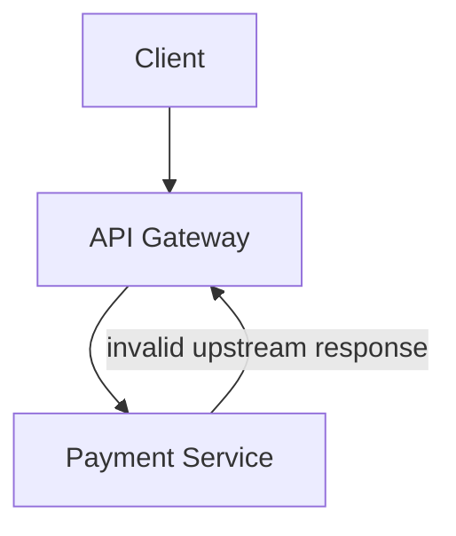

---

## 13.3 503 Service Unavailable

The service is temporarily unable to handle the request — maintenance, overload, a dependency outage, an open circuit breaker, or no healthy instances. Use `Retry-After` when the server can estimate a retry time:

```http
HTTP/1.1 503 Service Unavailable
Retry-After: 120
```

---

## 13.4 504 Gateway Timeout

A gateway or proxy did not receive a timely response from an upstream service.

```text
Client -> API Gateway -> Inventory Service
                         ^
                         |
                   timed out
```

Compare:

```text
502 -> upstream produced an invalid response
503 -> service is temporarily unavailable
504 -> upstream did not respond in time
```

---

## 13.5 Other 5xx Codes at a Glance

| Code | Name | When to use |
|---:|---|---|
| `501` | Not Implemented | Server does not support the functionality needed, typically an unrecognized method. Do not use it merely because a planned feature is unbuilt; for a known resource with a disallowed method, `405` is more appropriate |
| `505` | HTTP Version Not Supported | HTTP version unsupported |
| `507` | Insufficient Storage | Server cannot store the required representation; often WebDAV-related |
| `508` | Loop Detected | Infinite processing loop detected |
| `511` | Network Authentication Required | Client must authenticate to gain network access |

---

# 14. Status-Code Selection Guide

The matching decision flow for failures is the diagram in the "In short" summary at the top of this note.

## 14.1 Success Decision Flow

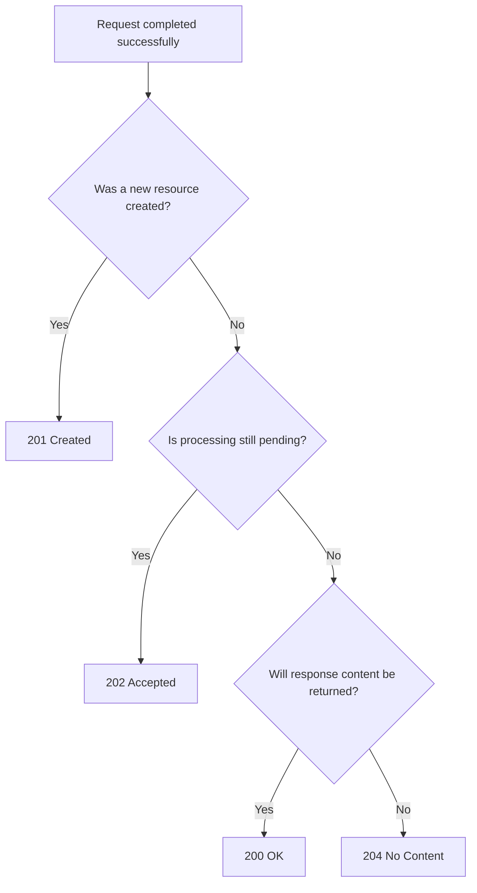

---

## 14.2 Common Operation Mapping

| Operation | Typical success | Common failures |
|---|---|---|
| List resources | `200` | `400`, `401`, `403` |
| Read resource | `200` | `401`, `403`, `404` |
| Create resource | `201` | `400`, `409`, `415`, `422` |
| Start async job | `202` | `400`, `409`, `422`, `429` |
| Replace resource | `200`, `201`, `204` | `404`, `409`, `412`, `415`, `422` |
| Partially update | `200`, `204` | `404`, `409`, `412`, `415`, `422` |
| Delete resource | `200`, `202`, `204` | `404`, `409`, `412` |
| Conditional GET | `200`, `304` | `401`, `403`, `404` |
| Rate-limited request | — | `429` |
| Upstream timeout | — | `504` |

These are common mappings, not automatic rules. The correct status depends on the precise semantics of the resource and operation.

---

# 15. REST Error Response Design

## 15.1 Use a Consistent Machine-Readable Shape

RFC 9457 defines **Problem Details for HTTP APIs**, carried under the media type `application/problem+json`.

```http
HTTP/1.1 422 Unprocessable Content
Content-Type: application/problem+json

{
  "type": "https://api.example.com/problems/validation-error",
  "title": "Request validation failed",
  "status": 422,
  "detail": "One or more fields are invalid.",
  "instance": "urn:request:req-71f8",
  "errors": [
    {
      "field": "email",
      "code": "invalid_format",
      "message": "Enter a valid email address."
    },
    {
      "field": "age",
      "code": "minimum_value",
      "message": "Age must be at least 18."
    }
  ]
}
```

Core fields:

| Field | Meaning |
|---|---|
| `type` | Identifier for the problem type |
| `title` | Short human-readable summary |
| `status` | HTTP status code |
| `detail` | Explanation for this occurrence |
| `instance` | Identifier for this specific occurrence |

Custom extension fields such as `errors`, `error_code`, or `trace_id` may be added.

---

## 15.2 Stable Error Codes

Human-readable text can change. Client logic should use stable machine-readable identifiers.

```json
{
  "type": "https://api.example.com/problems/email-already-exists",
  "title": "Email already exists",
  "status": 409,
  "error_code": "USER_EMAIL_ALREADY_EXISTS"
}
```

Clients should never parse `"A user with this email already exists."` to determine behavior.

---

## 15.3 Correlation IDs

Include a request or correlation identifier — a response header such as `X-Request-ID: req-71f8` alongside `"instance": "urn:request:req-71f8"` in the problem body.

Log the same identifier across: `API Gateway -> Application -> Queue -> Worker -> Database calls`

This supports debugging without revealing internal implementation details to the client.

---

# 16. Caching and Conditional Requests

## 16.1 Cache-Control

`Cache-Control: public, max-age=300` means shared caches may store the response and it stays fresh for 300 seconds.

Common directives:

| Directive | Meaning |
|---|---|
| `public` | Shared caches may store the response |
| `private` | Intended for a private cache, such as a browser |
| `no-store` | Do not store the response |
| `no-cache` | Stored response must be validated before reuse |
| `max-age=N` | Fresh for N seconds |
| `s-maxage=N` | Shared-cache freshness lifetime |
| `must-revalidate` | Do not reuse stale response without validation |
| `immutable` | Representation is not expected to change while fresh |

`no-cache` does not mean “never store.” It means the cached response must be revalidated before reuse. For sensitive responses the common choice is `Cache-Control: no-store`.

---

## 16.2 ETag Validation

Initial request: `GET /products/P-100`

Response:

```http
HTTP/1.1 200 OK
ETag: "product-P-100-v4"
Cache-Control: private, max-age=0, must-revalidate

{
  "id": "P-100",
  "price": 7999
}
```

Later request:

```http
GET /products/P-100
If-None-Match: "product-P-100-v4"
```

If unchanged:

```http
HTTP/1.1 304 Not Modified
ETag: "product-P-100-v4"
```

If changed:

```http
HTTP/1.1 200 OK
ETag: "product-P-100-v5"

{
  "id": "P-100",
  "price": 7499
}
```

---

## 16.3 Last-Modified Validation

The server sends `Last-Modified: Wed, 29 Jul 2026 08:30:00 GMT` and the client echoes it back as `If-Modified-Since: Wed, 29 Jul 2026 08:30:00 GMT`.

`ETag` is often more precise because timestamps may not represent every relevant change and can have limited resolution.

---

## 16.4 Vary

When the representation depends on request headers, inform caches.

`Vary: Accept-Encoding, Accept-Language` tells caches that different variants may exist for compression and for language.

Avoid unnecessarily large `Vary` sets because they reduce cache efficiency.

---

# 17. Optimistic Concurrency with ETag

## 17.1 Lost Update Problem

Two clients read the same version:

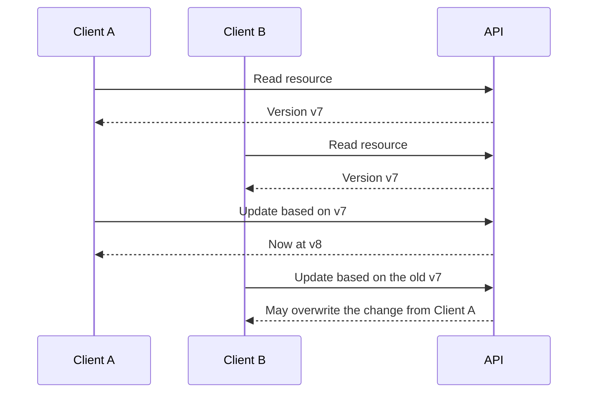

---

## 17.2 Conditional Update

A read of `GET /documents/D-10` returns `200 OK` with `ETag: "document-D-10-v7"`. The client sends that validator back on the write:

```http
PATCH /documents/D-10
If-Match: "document-D-10-v7"
Content-Type: application/merge-patch+json

{
  "title": "Updated title"
}
```

If the current version is still `v7`, the response is `200 OK` with a new `ETag: "document-D-10-v8"`. If another client already changed it, the response is `412 Precondition Failed`.

Flow:

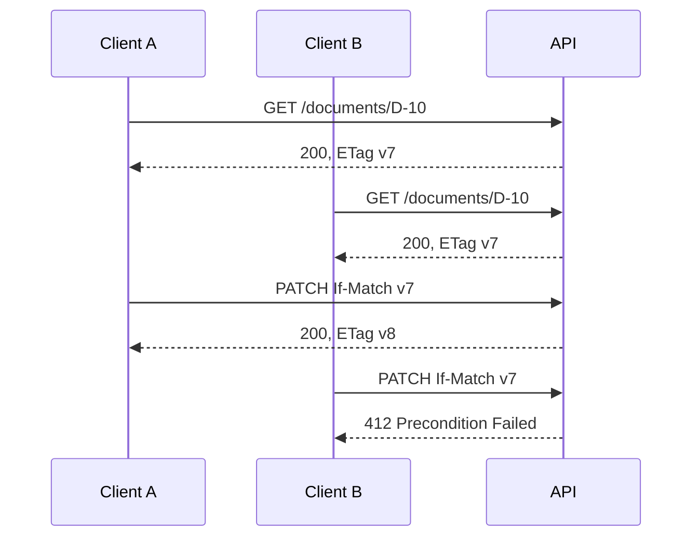

For resources where lost updates are unacceptable, the API may return `428 Precondition Required` when `If-Match` is missing.

---

# 18. Pagination, Filtering, Sorting and Search

## 18.1 Offset Pagination

`GET /orders?limit=20&offset=40` is simple and supports jumping to a page, but large offsets become slow and concurrent inserts cause duplicated or skipped items across pages.

---

## 18.2 Cursor Pagination

`GET /orders?limit=20&cursor=eyJjcmVhdGVkX2F0...` returns an opaque `next_cursor` alongside the items. It is the better default for large or frequently changing datasets, infinite scrolling and stable forward traversal. Either way, a paginated collection is a `200 OK`, not a `206`.

Cursor encoding, keyset queries, total counts, bidirectional paging and the failure modes of each approach: [Pagination](pagination-offset-cursor.md).

---

## 18.3 Filtering

A filter such as `GET /orders?status=paid&customer_id=C-10` needs a documented contract: which filters are supported, which operators exist, whether matching is case-sensitive, the date/time format and timezone behavior, and what an empty value means.

---

## 18.4 Sorting

In `GET /orders?sort=-created_at,total` the usual convention is that `created_at` sorts ascending and `-created_at` descending.

Always define a deterministic tie-breaker such as `ORDER BY created_at DESC, id DESC`, otherwise pagination is not stable.

---

## 18.5 Search

Simple search is `GET /products?q=mechanical+keyboard`. Structured complex search is `POST /product-searches`, or `QUERY /products` where the infrastructure supports it.

Avoid very large or sensitive query expressions in URLs because URLs are commonly logged, cached, stored in history, and included in monitoring systems.

---

## 18.6 Field Selection and Expansion

`GET /users/42?fields=id,name,email` narrows the representation; `GET /orders/ORD-101?include=items,payments` widens it.

Use expansion carefully, because uncontrolled expansion produces very large responses, N+1 database queries, expensive joins, circular relationships and unpredictable latency.

---

# 19. Authentication and Authorization Semantics

The only part of this that is HTTP semantics is the status split: an unverifiable identity is `401 Unauthorized` with a `WWW-Authenticate` header, while a verified identity that is not permitted to act is `403 Forbidden`. Where revealing existence would itself leak information — a request for another tenant’s `GET /tenants/T-2/invoices/INV-90` — returning `404 Not Found` is a legitimate authorization policy, not a substitute for the permission check.

Never trust a tenant or user ID taken from the URL; always verify it against the authenticated principal.

Token formats, OAuth flows, scopes, session design and JWT handling: [AuthN vs AuthZ](authn-authz-oauth-jwt.md).

---

# 20. API Versioning and Compatibility

REST does not mandate a versioning strategy. The three common carriers are the URI (`/api/v1/users` — visible and easy to route, but baked into every link), the media type (`Accept: application/vnd.example.user-v2+json` — tied to the representation, harder on tooling) and a dedicated header (`API-Version: 2026-07-01` — keeps URIs stable, less visible in logs).

Most changes do not need a new version at all: adding optional fields, endpoints and tolerated enum values is compatible, whereas removing or renaming fields, changing a type or meaning, making an optional field required, or changing status-code, authentication or pagination guarantees is breaking. Clients should ignore unknown response fields unless the contract says otherwise.

Deprecation windows, sunset headers, and choosing between the strategies: [API Versioning](api-versioning.md).

---

# 21. End-to-End REST API Example

Consider an order API.

## 21.1 Create an Order

```http
POST /orders HTTP/1.1
Content-Type: application/json
Accept: application/json
Idempotency-Key: 512d0cb6-d12d-4d40-bf21-20b...

{
  "customer_id": "C-10",
  "items": [
    {
      "product_id": "P-100",
      "quantity": 2
    }
  ]
}
```

```http
HTTP/1.1 201 Created
Location: /orders/ORD-901
ETag: "order-ORD-901-v1"
Content-Type: application/json

{
  "id": "ORD-901",
  "customer_id": "C-10",
  "status": "pending_payment",
  "total": 15998
}
```

---

## 21.2 Retrieve the Order

```http
GET /orders/ORD-901
Accept: application/json
```

```http
HTTP/1.1 200 OK
ETag: "order-ORD-901-v1"
Cache-Control: private, max-age=0, must-revalidate
Content-Type: application/json

{
  "id": "ORD-901",
  "status": "pending_payment",
  "total": 15998
}
```

---

## 21.3 Update Delivery Instructions

```http
PATCH /orders/ORD-901
If-Match: "order-ORD-901-v1"
Content-Type: application/merge-patch+json

{
  "delivery_instructions": "Call before delivery"
}
```

```http
HTTP/1.1 200 OK
ETag: "order-ORD-901-v2"
Content-Type: application/json

{
  "id": "ORD-901",
  "status": "pending_payment",
  "delivery_instructions": "Call before delivery",
  "total": 15998
}
```

---

## 21.4 Create a Payment

```http
POST /orders/ORD-901/payments
Idempotency-Key: e1473f8e-e453-4e2a-a18d-09f...
Content-Type: application/json

{
  "payment_method_id": "PM-44"
}
```

Asynchronous processing:

```http
HTTP/1.1 202 Accepted
Location: /payment-jobs/JOB-77
Retry-After: 2
Content-Type: application/json

{
  "job_id": "JOB-77",
  "status": "processing"
}
```

---

## 21.5 Check Payment Job

```http
GET /payment-jobs/JOB-77
```

```http
HTTP/1.1 200 OK

{
  "job_id": "JOB-77",
  "status": "completed",
  "payment_id": "PAY-300"
}
```

---

## 21.6 Cancel the Order

```http
POST /orders/ORD-901/cancellations
Content-Type: application/json

{
  "reason": "customer_request"
}
```

If cancellation is no longer permitted:

```http
HTTP/1.1 409 Conflict
Content-Type: application/problem+json

{
  "type": "https://api.example.com/problems/order-not-cancellable",
  "title": "Order cannot be cancelled",
  "status": 409,
  "detail": "The order has already been handed to the delivery partner.",
  "instance": "urn:request:req-a910"
}
```

This response communicates both:

- Generic HTTP meaning: conflict with current state
- Domain meaning: order has progressed too far

---

# 22. Practical FastAPI Example

The following example demonstrates common method and status-code choices.

```python
from __future__ import annotations

from typing import Annotated
from uuid import UUID, uuid4

from fastapi import FastAPI, Header, HTTPException, Response, status
from pydantic import BaseModel, EmailStr

app = FastAPI()

class UserCreate(BaseModel):
    name: str
    email: EmailStr

class UserPatch(BaseModel):
    name: str | None = None
    email: EmailStr | None = None

class User(BaseModel):
    id: UUID
    name: str
    email: EmailStr
    version: int

users: dict[UUID, User] = {}

def make_etag(user: User) -> str:
    return f'"user-{user.id}-v{user.version}"'

@app.post(
    "/users",
    response_model=User,
    status_code=status.HTTP_201_CREATED,
)
def create_user(payload: UserCreate, response: Response) -> User:
    if any(user.email == payload.email for user in users.values()):
        raise HTTPException(
            status_code=status.HTTP_409_CONFLICT,
            detail="A user with this email already exists.",
        )

    user = User(
        id=uuid4(),
        name=payload.name,
        email=payload.email,
        version=1,
    )
    users[user.id] = user

    response.headers["Location"] = f"/users/{user.id}"
    response.headers["ETag"] = make_etag(user)
    return user

@app.get("/users/{user_id}", response_model=User)
def get_user(user_id: UUID, response: Response) -> User:
    user = users.get(user_id)
    if user is None:
        raise HTTPException(
            status_code=status.HTTP_404_NOT_FOUND,
            detail="User not found.",
        )

    response.headers["ETag"] = make_etag(user)
    return user

@app.patch("/users/{user_id}", response_model=User)
def update_user(
    user_id: UUID,
    payload: UserPatch,
    response: Response,
    if_match: Annotated[str | None, Header()] = None,
) -> User:
    user = users.get(user_id)
    if user is None:
        raise HTTPException(
            status_code=status.HTTP_404_NOT_FOUND,
            detail="User not found.",
        )

    current_etag = make_etag(user)

    if if_match is None:
        raise HTTPException(
            status_code=status.HTTP_428_PRECONDITION_REQUIRED,
            detail="Send the current ETag in the If-Match header.",
        )

    if if_match != current_etag:
        raise HTTPException(
            status_code=status.HTTP_412_PRECONDITION_FAILED,
            detail="The user was modified by another request.",
        )

    changes = payload.model_dump(exclude_unset=True)
    updated = user.model_copy(
        update={
            **changes,
            "version": user.version + 1,
        }
    )
    users[user_id] = updated

    response.headers["ETag"] = make_etag(updated)
    return updated

@app.delete(
    "/users/{user_id}",
    status_code=status.HTTP_204_NO_CONTENT,
)
def delete_user(user_id: UUID) -> Response:
    if user_id not in users:
        raise HTTPException(
            status_code=status.HTTP_404_NOT_FOUND,
            detail="User not found.",
        )

    del users[user_id]
    return Response(status_code=status.HTTP_204_NO_CONTENT)
```

### Flow represented by the example

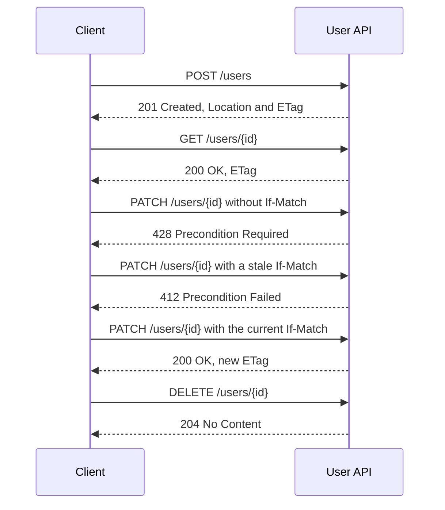

In a production system, replace the in-memory dictionary with a transactional persistence layer and ensure that the version check and update happen atomically.

---

# 23. REST Maturity and Hypermedia

The Richardson Maturity Model is often used to discuss increasingly REST-oriented API design.

```text
Level 0: One URI, usually one method
Level 1: Multiple resource URIs
Level 2: Resource URIs + correct HTTP methods/status codes
Level 3: Hypermedia controls
```

Reading a user progresses like this. Level 0 posts `{"operation": "getUser", "userId": 42}` to a single `/api` endpoint. Level 1 gives the user its own URI but still uses `POST /users/42`. Level 2 uses `GET /users/42` and answers `200 OK`. Level 3 adds hypermedia controls to that representation:

```json
{
  "id": "42",
  "status": "active",
  "_links": {
    "self": { "href": "/users/42" },
    "orders": { "href": "/users/42/orders" },
    "deactivation": { "href": "/users/42/deactivations", "method": "POST" }
  }
}
```

The maturity model is a learning tool, not the formal definition of REST. REST itself comes from the architectural constraints described by Roy Fielding.

---

# 24. Practical Design Checklist

## Resource design

- Model domain concepts as resources
- Use nouns for resource paths
- Keep URLs stable
- Keep nesting shallow
- Use query parameters for collection controls
- Model meaningful business operations explicitly

## Method semantics

- Use `GET` only for safe retrieval
- Use `POST` for creation or unsafe processing
- Use `PUT` for replacement at a known URI
- Use `PATCH` for partial modification
- Treat `DELETE` as idempotent by intended effect
- Consider retry behavior before selecting a method
- Use `QUERY` only after verifying infrastructure support

## Status codes

- Return `201` for resource creation
- Return `202` for accepted asynchronous processing
- Return `204` only when no response content is needed
- Distinguish `401` from `403`
- Use `404` for missing or intentionally hidden resources
- Use `409` for current-state conflicts
- Use `412` for failed request preconditions
- Use `415` for unsupported request media type
- Use `422` for semantically invalid content
- Use `429` for rate limiting
- Use precise `5xx` codes for gateway and availability failures

## Representations and errors

- Set the correct `Content-Type`
- Support `Accept` where multiple representations exist
- Use a consistent error format
- Prefer RFC 9457 Problem Details
- Use stable machine-readable error identifiers
- Include correlation identifiers
- Do not expose internal exception details

## Reliability and performance

- Define timeout and retry behavior
- Retry unsafe methods only with protection
- Use idempotency keys for duplicate-sensitive POST operations
- Use ETags for cache validation and concurrency
- Add explicit cache directives
- Provide polling or callback semantics for asynchronous operations
- Enforce authorization at the resource level

---

# 25. References

The guide uses the following authoritative sources:

1. [Roy Fielding — Representational State Transfer architectural style](https://ics.uci.edu/~fielding/pubs/dissertation/rest_arch_style.htm)
2. [RFC 9110 — HTTP Semantics](https://www.rfc-editor.org/rfc/rfc9110.html)
3. [RFC 9111 — HTTP Caching](https://www.rfc-editor.org/rfc/rfc9111.html)
4. [RFC 5789 — PATCH Method for HTTP](https://www.rfc-editor.org/rfc/rfc5789.html)
5. [RFC 6585 — Additional HTTP Status Codes](https://www.rfc-editor.org/rfc/rfc6585.html)
6. [RFC 9457 — Problem Details for HTTP APIs](https://www.rfc-editor.org/rfc/rfc9457.html)
7. [RFC 10008 — The HTTP QUERY Method](https://www.rfc-editor.org/rfc/rfc10008.html)
8. [IANA HTTP Method Registry](https://www.iana.org/assignments/http-methods/)
9. [IANA HTTP Status Code Registry](https://www.iana.org/assignments/http-status-codes/)

> **Current standards note:** The IANA HTTP Method Registry listed `QUERY` as a safe and idempotent method after RFC 10008 was published in 2026. The IANA status-code registry also currently contains temporary code `104 Upload Resumption Supported`; it is an experimental temporary registration rather than a normal application API status choice.

---
