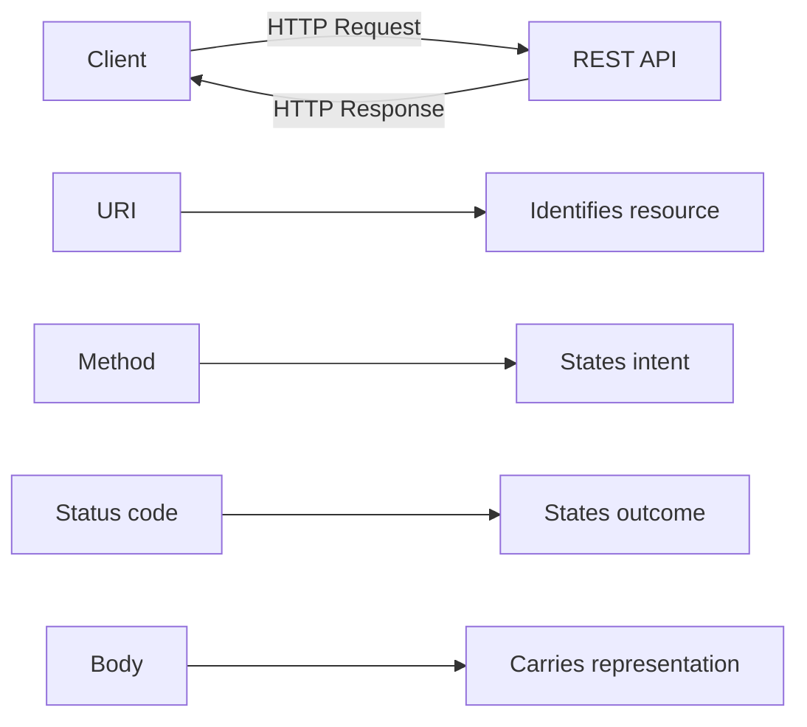
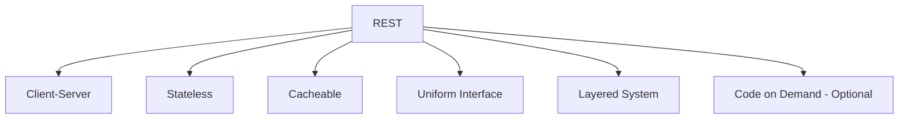
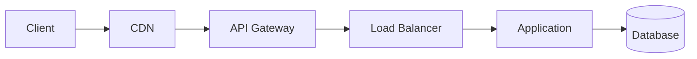
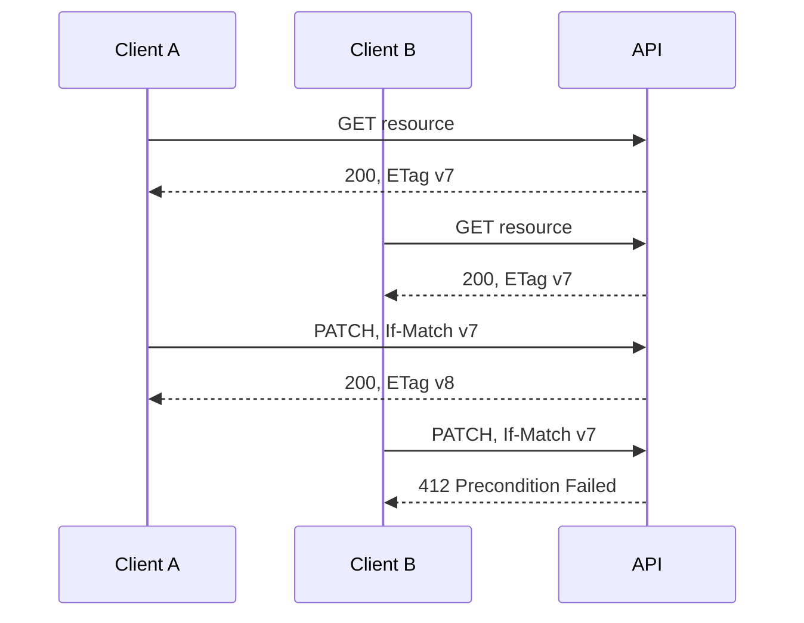

# REST Principles, HTTP Methods & Status Codes

> Practical REST and HTTP knowledge for backend development and technical interviews.

> **Standards baseline:** RFC 9110 (HTTP Semantics), RFC 9111 (HTTP Caching), RFC 9457 (Problem Details), RFC 5789 (`PATCH`), RFC 10008 (`QUERY`), and the IANA HTTP registries.

## Index

1. REST and HTTP fundamentals
2. Resources and REST constraints
3. Resource-oriented URL design
4. HTTP request and response structure
5. Safe, idempotent, and cacheable methods
6. Core HTTP methods
7. Choosing `POST` vs `PUT` vs `PATCH`
8. HTTP status codes
9. Error response design
10. Caching and optimistic concurrency
11. Practical order API example
12. Interview-ready summary
13. References

---

# 1. REST and HTTP Fundamentals

## 1.1 What Is REST?

**REST (Representational State Transfer)** is an architectural style for distributed systems.

REST is **not**:

- a programming language
- a framework
- JSON
- HTTP itself
- a strict API specification

HTTP is commonly used to build REST APIs because it already provides:

- URIs for identifying resources
- methods such as `GET`, `POST`, `PUT`, and `DELETE`
- status codes
- headers
- caching
- content negotiation
- authentication metadata
- proxy and gateway support

A JSON API is not automatically RESTful.

## 1.2 Simple Mental Model

A REST API works around **resources**.



Example:

```http
GET /orders/ORD-101 HTTP/1.1
Accept: application/json
```

```http
HTTP/1.1 200 OK
Content-Type: application/json

{
  "id": "ORD-101",
  "status": "paid",
  "total": 15998
}
```

Think of it as:

```text
URI         -> What resource?
Method      -> What should happen?
Status code -> What happened?
Body        -> What data is being represented?
```

---

# 2. Resources and REST Constraints

## 2.1 Resource vs Representation

A **resource** is a domain concept exposed by the API.

Examples:

```text
/users/42
/orders/ORD-101
/products/P-100
/orders/ORD-101/payments
```

A resource is not necessarily one database row.

For example:

```text
/account-summary
```

may combine data from users, subscriptions, payments, and usage tables.

A **representation** is the format used to describe a resource.

The same resource may be represented as:

- JSON
- XML
- HTML
- CSV
- PDF
- image or binary data

## 2.2 Main REST Constraints



### Client-Server

The client and server have separate responsibilities.

```text
Frontend -> presentation and user interaction
Backend  -> business logic, persistence, validation, authorization
```

This separation allows both sides to evolve independently.

### Stateless

Every request should contain enough information to process it.

```http
GET /customers/C-10/orders
Authorization: Bearer <token>
```

The server should not require hidden conversational state such as:

```text
Request 1: Remember customer C-10
Request 2: Now return their orders
```

Stateless **does not mean the server stores no state**.

The server can still store users, orders, sessions, tokens, caches, and database records.

### Cacheable

Responses should explicitly describe caching behavior.

```http
Cache-Control: public, max-age=300
ETag: "product-42-v8"
```

### Uniform Interface

REST encourages predictable interaction through:

- stable resource identifiers
- standard HTTP methods
- representations
- self-descriptive messages
- optional hypermedia links

### Layered System

The client does not need to know whether the request passes through several infrastructure layers.



---

# 3. Resource-Oriented URL Design

## 3.1 Prefer Nouns Over CRUD Verbs

Prefer:

```text
GET    /users
POST   /users
GET    /users/42
PATCH  /users/42
DELETE /users/42
```

Avoid:

```text
/getUsers
/createUser
/updateUser
/deleteUser
```

The HTTP method already expresses the general action.

## 3.2 Collections and Individual Resources

| Requirement | Endpoint |
|---|---|
| List users | `GET /users` |
| Create user | `POST /users` |
| Read user | `GET /users/{id}` |
| Replace user | `PUT /users/{id}` |
| Partially update user | `PATCH /users/{id}` |
| Delete user | `DELETE /users/{id}` |

## 3.3 Keep Nesting Shallow

Good:

```text
/customers/C-10/orders
/orders/O-90/items
```

Avoid deeply nested paths such as:

```text
/companies/1/departments/2/teams/3/users/4/tasks/5/comments/6
```

When a resource has its own stable ID, direct addressing is usually simpler:

```text
/comments/6
```

## 3.4 Query Parameters for Collection Controls

Use query parameters for:

- filtering
- sorting
- pagination
- search
- field selection
- optional expansion

```http
GET /orders?status=paid&sort=-created_at&limit=20&cursor=abc123
```

## 3.5 Business Actions

Not every operation is simple CRUD.

Instead of forcing everything into `PATCH`, a meaningful domain event can be modeled as a subordinate resource:

```http
POST /orders/ORD-101/cancellations
```

```http
POST /payments/PAY-10/refunds
```

This is especially useful when the action has its own:

- ID
- status
- timestamp
- actor
- audit history

---

# 4. HTTP Request and Response Structure

## 4.1 Request

```http
PATCH /users/42 HTTP/1.1
Authorization: Bearer <token>
Content-Type: application/merge-patch+json
Accept: application/json
If-Match: "user-42-v7"

{
  "display_name": "Aarav Shah"
}
```

Important parts:

```text
Method
Target URI
Headers
Optional body
```

## 4.2 Response

```http
HTTP/1.1 200 OK
Content-Type: application/json
ETag: "user-42-v8"

{
  "id": "42",
  "display_name": "Aarav Shah"
}
```

The **numeric status code** carries the HTTP semantics. Client logic should not depend on the human-readable reason phrase.

## 4.3 Common Headers

| Header | Purpose |
|---|---|
| `Authorization` | Authentication credentials |
| `Content-Type` | Format of request or response content |
| `Accept` | Desired response media type |
| `Location` | URI of created resource or redirect target |
| `Cache-Control` | Caching policy |
| `ETag` | Representation/version validator |
| `If-Match` | Apply operation only if ETag matches |
| `If-None-Match` | Commonly used for cache validation |
| `Retry-After` | Suggested retry time |
| `Allow` | Supported methods |
| `WWW-Authenticate` | Authentication challenge for `401` |
| `Idempotency-Key` | Application-level duplicate protection |

---

# 5. Safe, Idempotent, and Cacheable Methods

These properties are frequently discussed in interviews.

## 5.1 Safe

A method is **safe** when the client does not request a business-state change.

For the common application methods:

```text
GET      Safe
HEAD     Safe
OPTIONS  Safe
TRACE    Safe
QUERY    Safe
```

Logging, metrics, and cache population can still happen internally.

Never perform a destructive action through `GET`.

Bad:

```http
GET /orders/ORD-101/cancel
```

Automated crawlers, prefetching, and retries may issue safe methods without expecting mutations.

## 5.2 Idempotent

A method is **idempotent** when repeating the same request has the same intended final effect as sending it once.

For common methods:

| Method | Idempotent? |
|---|---|
| `GET` | Yes |
| `HEAD` | Yes |
| `PUT` | Yes |
| `DELETE` | Yes |
| `OPTIONS` | Yes |
| `TRACE` | Yes |
| `QUERY` | Yes |
| `POST` | No, by default |
| `PATCH` | No, by definition/default |

Example:

```http
DELETE /users/42
```

First request may return `204`.

Second request may return `404`.

It is still idempotent because the intended final state is the same: user `42` does not exist.

## 5.3 Cacheability

In normal application development:

```text
GET  -> primary cacheable method
HEAD -> cache-oriented metadata method
```

`POST` can be cacheable under HTTP rules when explicit semantics and metadata permit it, but most real-world caches mainly support `GET` and `HEAD`.

`QUERY`, standardized in **RFC 10008 (June 2026)**, is explicitly cacheable. Its cache key must account for request content and relevant metadata.

---

# 6. Core HTTP Methods

## 6.1 GET — Retrieve

Use `GET` to retrieve a representation.

```http
GET /products/P-100
```

Typical responses:

```text
200 -> representation returned
304 -> cached representation still valid
404 -> resource not found
401 -> authentication missing/invalid
403 -> access denied
```

`GET` should not perform business mutations.

## 6.2 HEAD — Headers Without Response Content

`HEAD` is similar to `GET`, but the response contains no representation body.

Useful for:

- checking whether a resource exists
- reading content length
- checking `ETag`
- reading `Last-Modified`

```http
HEAD /files/report.pdf
```

## 6.3 POST — Create or Process

Use `POST` when the target resource should process the request according to its own semantics.

Common uses:

- server-generated resource creation
- payment execution
- submitting commands
- creating subordinate resources
- starting asynchronous jobs

Create:

```http
POST /orders
```

```http
HTTP/1.1 201 Created
Location: /orders/ORD-901
```

Async processing:

```http
POST /reports
```

```http
HTTP/1.1 202 Accepted
Location: /report-jobs/JOB-77
```

`POST` is not idempotent by default. Duplicate-sensitive operations commonly use an application-level idempotency key.

```http
POST /payments
Idempotency-Key: 9fb40a71-...
```

## 6.4 PUT — Full Replacement at a Known URI

Use `PUT` when the client knows the target URI and wants to create or completely replace that resource.

```http
PUT /users/42
Content-Type: application/json

{
  "id": "42",
  "name": "Aarav Shah",
  "email": "aarav@example.com",
  "active": true
}
```

Typical success responses:

```text
201 -> resource created
200 -> replaced and representation returned
204 -> replaced, nothing returned
```

Important:

> With replacement-style `PUT`, omitted fields may be removed or reset according to the API contract.

## 6.5 PATCH — Partial Modification

Use `PATCH` when only part of a resource should change.

```http
PATCH /users/42
Content-Type: application/merge-patch+json

{
  "display_name": "Aarav Shah"
}
```

Typical responses:

```text
200 -> updated representation returned
204 -> update succeeded, no body
409 -> conflicts with current resource state
412 -> If-Match precondition failed
415 -> patch media type unsupported
422 -> syntactically valid but semantically invalid
```

A particular PATCH operation can behave idempotently, but `PATCH` is not defined as an idempotent method.

## 6.6 DELETE — Remove

```http
DELETE /users/42
```

Common success responses:

```text
204 -> deleted, no response body
200 -> deleted and result returned
202 -> deletion accepted for asynchronous processing
```

A soft delete in the database does not change the HTTP semantics.

## 6.7 OPTIONS — Communication Options

`OPTIONS` can describe supported communication options.

```http
OPTIONS /users/42
```

```http
HTTP/1.1 204 No Content
Allow: GET, HEAD, PUT, PATCH, DELETE, OPTIONS
```

Browsers also use `OPTIONS` for CORS preflight requests.

CORS is a browser security mechanism, not a REST principle.

## 6.8 TRACE and CONNECT

These are protocol-level methods rather than normal REST application endpoints.

- `TRACE` is for diagnostics and is commonly disabled in production.
- `CONNECT` creates a tunnel, commonly through a proxy.

## 6.9 QUERY — Safe Body-Based Query

`QUERY` was standardized in **RFC 10008 in June 2026**.

It provides a standard method for read-only queries that need request content.

```http
QUERY /products/search
Content-Type: application/json
Accept: application/json

{
  "categories": ["laptops", "monitors"],
  "price": {
    "min": 50000,
    "max": 150000
  }
}
```

Properties:

```text
Safe        -> Yes
Idempotent  -> Yes
Body input  -> Expected
Cacheable   -> Yes
```

### Practical adoption

Because `QUERY` is new, verify support across the complete request path:

```text
Client
  -> CDN
  -> WAF
  -> API Gateway
  -> Framework
  -> Router
  -> Monitoring
```

For broad compatibility, many APIs will still use:

```text
GET /products?category=laptops
```

or, for complex searches:

```text
POST /product-searches
```

---

# 7. Choosing POST vs PUT vs PATCH

## 7.1 Decision Table

| Requirement | Method |
|---|---|
| Read resource | `GET` |
| Simple read-only query | `GET` |
| Safe complex body-based query | `QUERY`, where supported |
| Create resource and server chooses URI | `POST` |
| Run domain command | Usually `POST` |
| Create or replace resource at known URI | `PUT` |
| Replace complete representation | `PUT` |
| Modify selected fields | `PATCH` |
| Remove resource | `DELETE` |

## 7.2 Easy Interview Rule

```text
POST  -> "Process this / create under this collection"
PUT   -> "Make this known URI look exactly like this"
PATCH -> "Change only these parts"
```

## 7.3 Retry Thinking

```text
GET     -> normally retryable
HEAD    -> normally retryable
PUT     -> normally retryable
DELETE  -> normally retryable
QUERY   -> normally retryable
POST    -> protect before retrying
PATCH   -> retry only when operation semantics are known
```

Production clients should still use:

- timeouts
- bounded retries
- exponential backoff
- jitter

---

# 8. HTTP Status Codes

## 8.1 Status Code Classes

| Class | Meaning |
|---|---|
| `1xx` | Informational |
| `2xx` | Successful |
| `3xx` | Redirection |
| `4xx` | Client/request condition |
| `5xx` | Server-side failure |

Do not return `200 OK` for an actual failure such as:

```json
{
  "success": false,
  "error": "User not found"
}
```

Use the real protocol status:

```http
HTTP/1.1 404 Not Found
```

## 8.2 Important Success Codes

| Code | Meaning | Typical use |
|---:|---|---|
| `200` | OK | Success with response content |
| `201` | Created | New resource created |
| `202` | Accepted | Accepted, processing not complete |
| `204` | No Content | Success with no response body |
| `206` | Partial Content | Byte/range response |

A paginated JSON collection normally returns `200`, not `206`.

## 8.3 Important Redirect Codes

| Code | Meaning |
|---:|---|
| `301` | Permanent redirect; method handling has historical compatibility behavior |
| `302` | Temporary redirect; method handling has historical compatibility behavior |
| `303` | Follow another URI using `GET` |
| `304` | Cached representation is still valid |
| `307` | Temporary redirect preserving method |
| `308` | Permanent redirect preserving method |

For APIs, use `307`/`308` when preserving the original method matters.

## 8.4 Important Client Errors

### `400 Bad Request`

Malformed or structurally invalid request.

Examples:

- invalid JSON
- invalid date syntax
- incompatible query parameters

### `401 Unauthorized`

Authentication is missing or invalid.

```http
HTTP/1.1 401 Unauthorized
WWW-Authenticate: Bearer
```

Mental model:

```text
401 -> Who are you?
403 -> I know who you are, but you cannot do this.
```

### `403 Forbidden`

Identity is known, but authorization fails.

An API may intentionally return `404` instead when revealing the resource's existence would leak information.

### `404 Not Found`

The resource does not exist or is intentionally hidden.

An empty collection normally returns:

```http
HTTP/1.1 200 OK

{
  "items": []
}
```

not `404`.

### `405 Method Not Allowed`

The resource exists, but that method is not supported.

```http
HTTP/1.1 405 Method Not Allowed
Allow: GET, HEAD, OPTIONS
```

### `409 Conflict`

The request conflicts with current resource state.

Examples:

- duplicate unique email
- invalid state transition
- deleting a resource with blocking dependencies

### `412 Precondition Failed`

A client-supplied precondition failed.

Typical example:

```http
If-Match: "user-v7"
```

but the current resource is already `v8`.

### `415 Unsupported Media Type`

The server cannot process the request's `Content-Type`.

Example:

```text
Client sends XML
API accepts only JSON
```

### `422 Unprocessable Content`

The request syntax and media type are valid, but the instructions fail semantic/domain validation.

Example:

```json
{
  "joining_date": "2026-09-01",
  "termination_date": "2026-08-01"
}
```

A useful API convention is:

```text
400 -> malformed syntax/structure
422 -> syntactically valid but semantically invalid
```

### `429 Too Many Requests`

Rate limit exceeded.

```http
HTTP/1.1 429 Too Many Requests
Retry-After: 60
```

## 8.5 Important Server Errors

| Code | Meaning |
|---:|---|
| `500` | Unexpected server failure |
| `502` | Invalid response from upstream |
| `503` | Temporarily unavailable |
| `504` | Upstream timed out |

Easy distinction:

```text
502 -> upstream answered badly
503 -> service is unavailable
504 -> upstream did not answer in time
```

Never expose:

- stack traces
- SQL queries
- secrets
- filesystem paths
- raw internal exceptions

---

# 9. Error Response Design

RFC 9457 defines **Problem Details for HTTP APIs**.

Use:

```http
Content-Type: application/problem+json
```

Example:

```json
{
  "type": "https://api.example.com/problems/email-already-exists",
  "title": "Email already exists",
  "status": 409,
  "detail": "A user with this email already exists.",
  "instance": "urn:request:req-71f8",
  "error_code": "USER_EMAIL_ALREADY_EXISTS"
}
```

Important fields:

| Field | Purpose |
|---|---|
| `type` | Stable problem-type identifier |
| `title` | Short human-readable summary |
| `status` | HTTP status |
| `detail` | Information about this occurrence |
| `instance` | Identifier for this specific occurrence |

Custom extension fields are allowed.

Client behavior should rely on stable machine-readable values such as:

```text
USER_EMAIL_ALREADY_EXISTS
```

rather than parsing English error messages.

---

# 10. Caching and Optimistic Concurrency

## 10.1 Cache-Control

Common directives:

| Directive | Meaning |
|---|---|
| `public` | Shared caches may store |
| `private` | Intended for private/client cache |
| `no-store` | Do not store |
| `no-cache` | May store, but validate before reuse |
| `max-age=N` | Fresh for N seconds |
| `s-maxage=N` | Shared-cache freshness |
| `must-revalidate` | Validate stale response before reuse |

Important interview point:

> `no-cache` does **not** mean "never cache". `no-store` is the directive that tells caches not to store the response.

## 10.2 ETag for Cache Validation

First response:

```http
HTTP/1.1 200 OK
ETag: "product-v4"
```

Later:

```http
GET /products/P-100
If-None-Match: "product-v4"
```

If unchanged:

```http
HTTP/1.1 304 Not Modified
ETag: "product-v4"
```

The client reuses its cached body.

## 10.3 ETag for Optimistic Concurrency

Two clients can read the same version and then attempt conflicting updates.



This prevents Client B from silently overwriting Client A's change.

An API can return `428 Precondition Required` when a write must include a condition such as `If-Match`.

---

# 11. Practical Order API Example

One small order flow connects the main concepts.

## 11.1 Create Order

```http
POST /orders
Idempotency-Key: 512d0cb6-...
Content-Type: application/json

{
  "customer_id": "C-10",
  "items": [
    {
      "product_id": "P-100",
      "quantity": 2
    }
  ]
}
```

```http
HTTP/1.1 201 Created
Location: /orders/ORD-901
ETag: "order-v1"
```

Why:

```text
POST -> server chooses new order URI
201  -> a resource was created
Location -> points to created resource
Idempotency-Key -> protects duplicate-sensitive creation
```

## 11.2 Read Order

```http
GET /orders/ORD-901
```

```http
HTTP/1.1 200 OK
ETag: "order-v1"
```

## 11.3 Update Delivery Instructions

```http
PATCH /orders/ORD-901
If-Match: "order-v1"
Content-Type: application/merge-patch+json

{
  "delivery_instructions": "Call before delivery"
}
```

```http
HTTP/1.1 200 OK
ETag: "order-v2"
```

Why:

```text
PATCH    -> partial update
If-Match -> protects against lost updates
ETag     -> changes after successful modification
```

## 11.4 Cancel Order

```http
POST /orders/ORD-901/cancellations

{
  "reason": "customer_request"
}
```

If the order is already shipped:

```http
HTTP/1.1 409 Conflict
Content-Type: application/problem+json

{
  "type": "https://api.example.com/problems/order-not-cancellable",
  "title": "Order cannot be cancelled",
  "status": 409,
  "detail": "The order has already been shipped."
}
```

Why `409`?

The request is valid, but it conflicts with the order's **current state**.

---

# 12. Interview-Ready Summary

```text
REST:
Resource-oriented architectural style commonly implemented over HTTP.

URI:
Identifies the resource.

HTTP method:
Expresses the requested operation.

Status code:
Expresses the outcome.

GET:
Read-only retrieval.

POST:
Create under a collection or perform unsafe processing.

PUT:
Create/replace the complete resource at a known URI.

PATCH:
Modify selected parts of a resource.

DELETE:
Remove a resource; idempotent by intended effect.

QUERY:
New standardized safe, idempotent body-based query method.
Know it, but verify infrastructure support before production adoption.

201:
Created.

202:
Accepted but processing is not finished.

204:
Success with no response body.

401:
Authentication missing or invalid.

403:
Authenticated but not permitted.

404:
Missing or intentionally hidden resource.

409:
Conflict with current resource state.

412:
Client precondition such as If-Match failed.

422:
Valid syntax, invalid domain/semantic content.

429:
Rate limited.

502:
Bad upstream response.

503:
Temporarily unavailable.

504:
Upstream timeout.

ETag + If-None-Match:
Cache validation.

ETag + If-Match:
Optimistic concurrency / lost-update prevention.

RFC 9457 Problem Details:
Standard machine-readable HTTP API error format.
```

---

# 13. References

1. Roy Fielding — REST architectural style  
   https://ics.uci.edu/~fielding/pubs/dissertation/rest_arch_style.htm

2. RFC 9110 — HTTP Semantics  
   https://www.rfc-editor.org/rfc/rfc9110.html

3. RFC 9111 — HTTP Caching  
   https://www.rfc-editor.org/rfc/rfc9111.html

4. RFC 5789 — PATCH Method for HTTP  
   https://www.rfc-editor.org/rfc/rfc5789.html

5. RFC 9457 — Problem Details for HTTP APIs  
   https://www.rfc-editor.org/rfc/rfc9457.html

6. RFC 10008 — The HTTP QUERY Method  
   https://www.rfc-editor.org/rfc/rfc10008.html

7. IANA HTTP Method Registry  
   https://www.iana.org/assignments/http-methods/

8. IANA HTTP Status Code Registry  
   https://www.iana.org/assignments/http-status-codes/

---

> **Current standards note — August 2026:** RFC 10008 standardized the `QUERY` method in June 2026. The IANA HTTP Method Registry lists `QUERY` as both safe and idempotent. Because the method is new, real-world client, framework, proxy, WAF, CDN, gateway, SDK, and observability support should be verified before relying on it in production.
