# REST Principles, HTTP Methods & Status Codes

> **Topic:** API Design & REST  
> **Level:** Intermediate developer  
> **Purpose:** Practical understanding for backend development and technical interviews  
> **Standards baseline:** HTTP semantics from RFC 9110, HTTP caching from RFC 9111, Problem Details from RFC 9457, and the current IANA registries.

---

# 1. REST and HTTP: The Big Picture

## 1.1 What Is REST?

**REST** stands for **Representational State Transfer**.

REST is an **architectural style** for designing distributed systems. It is not:

- A programming language
- A framework
- A data format
- A network protocol
- A strict API specification

REST defines a set of architectural constraints that help systems remain scalable, loosely coupled, cache-friendly, and independently evolvable.

HTTP is commonly used to implement REST APIs because HTTP already provides:

- Resource identifiers through URIs
- Standard request methods
- Standard response status codes
- Headers and metadata
- Caching rules
- Content negotiation
- Authentication mechanisms
- Intermediary support such as proxies and gateways

A system can use HTTP without being RESTful. Similarly, merely returning JSON over HTTP does not automatically make an API RESTful.

---

## 1.2 Simple Mental Model

A REST API exposes **resources**. A client sends an HTTP request asking the server to operate on a resource.

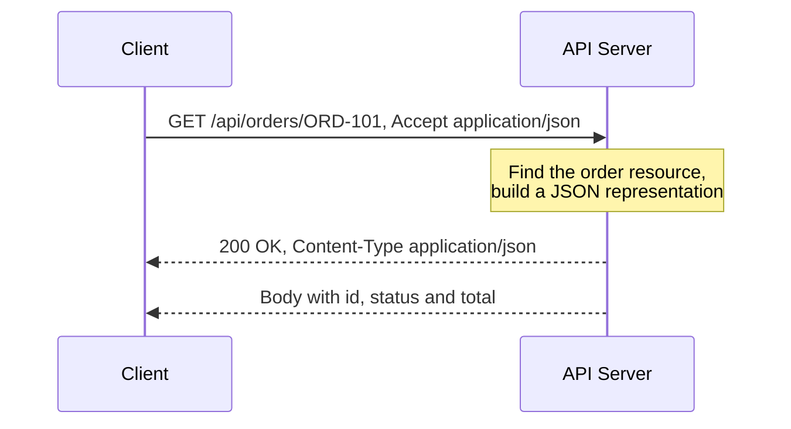

The URL identifies the resource.  
The HTTP method communicates the intended operation.  
The status code communicates the outcome.  
The response body contains a representation of the resource or an error.

---

## 1.3 REST vs REST API

| Term | Meaning |
|---|---|
| REST | Architectural style defined by constraints |
| REST API | An API designed using REST ideas |
| HTTP API | Any API using HTTP; it may or may not follow REST |
| JSON API | An API that exchanges JSON; JSON alone does not imply REST |
| RESTful API | An API that follows REST constraints to a meaningful degree |

---

# 2. Resources and Representations

## 2.1 What Is a Resource?

A **resource** is a conceptual entity that can be identified and interacted with.

Examples:

- A user
- An order
- A product
- A payment
- A report
- A collection of invoices
- The current status of a deployment

```text
Resource identifier: /orders/ORD-101
Resource:             Order ORD-101
```

A resource is not the same as a database row. It is an API-level concept.

For example, `/account-summary` may combine data from:

- User table
- Subscription table
- Billing service
- Payment provider
- Usage aggregation

It is still one API resource even though it is not one database record.

---

## 2.2 What Is a Representation?

A **representation** is the data format used to describe the current or intended state of a resource.

The same resource may have multiple representations:

```http
GET /reports/2026-summary
Accept: application/json
```

```json
{
  "year": 2026,
  "revenue": 12500000
}
```

Or:

```http
GET /reports/2026-summary
Accept: application/pdf
```

The resource is the same, but its representation is different.

Common representation formats include:

- JSON
- XML
- HTML
- CSV
- PDF
- Images
- Binary files

For most application APIs, JSON is the normal default.

---

## 2.3 Resource State vs Application State

These two ideas are commonly confused.

### Resource state

State stored or managed by the server:

```json
{
  "order_id": "ORD-101",
  "status": "shipped"
}
```

### Application state

The client’s current workflow or navigation state:

```text
Cart page -> Address page -> Payment page -> Confirmation page
```

REST allows the server to store resource state.  
The stateless constraint means the server should not depend on hidden conversational state from earlier requests to understand the current request.

---

# 3. REST Architectural Constraints

REST is defined by a coordinated set of constraints.

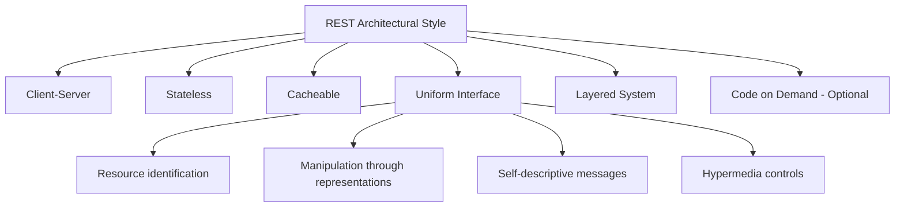

---

## 3.1 Client-Server

The client and server have separate responsibilities.

```text
Client responsibilities
- User interface
- User interaction
- Client-side state
- Calling the API
- Displaying representations

Server responsibilities
- Business rules
- Resource management
- Persistence
- Authorization
- Validation
- Response generation
```

### Benefit

The frontend and backend can evolve independently as long as the API contract remains compatible.

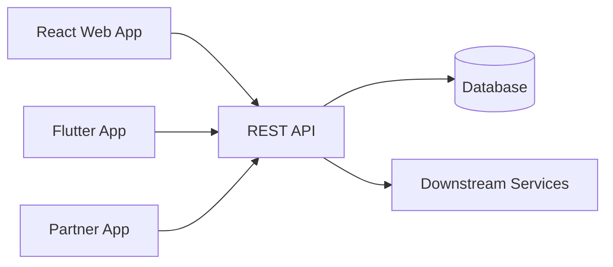

---

## 3.2 Stateless

Every request should contain enough information for the server to understand and process it.

```http
GET /orders/ORD-101 HTTP/1.1
Host: api.example.com
Authorization: Bearer <access-token>
Accept: application/json
```

The server should not require:

```text
Request 1: "Remember that I selected customer C-10."
Request 2: "Now return their orders."
```

Instead:

```http
GET /customers/C-10/orders
```

### Stateless does not mean “the server stores no state”

The server can store:

- Users
- Orders
- Permissions
- Tokens
- Database records
- Cache entries
- Audit logs

Statelessness means each request is independently understandable.

### Benefit

Any available application instance can handle the request:

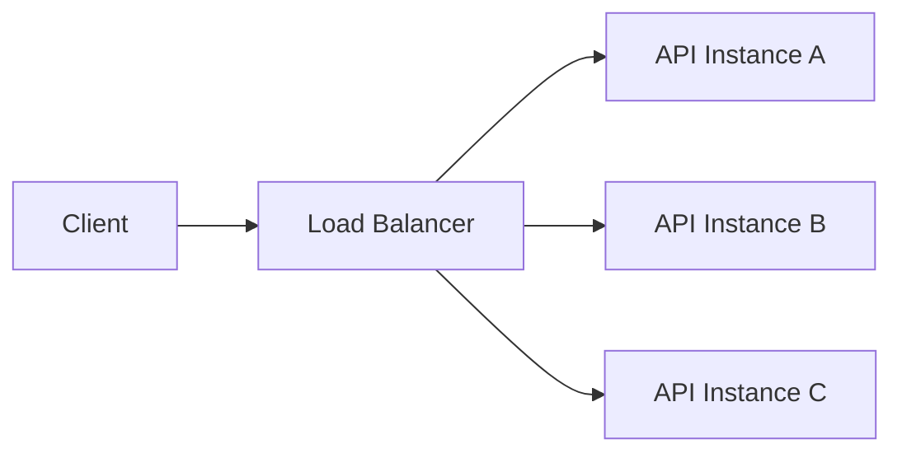

This improves horizontal scalability and failover.

---

## 3.3 Cacheable

Responses should clearly communicate whether and how they may be cached.

```http
HTTP/1.1 200 OK
Cache-Control: public, max-age=300
ETag: "product-42-v8"
Content-Type: application/json
```

Caching can reduce:

- Latency
- Network traffic
- Database load
- Application server load
- Infrastructure cost

Caching must be applied carefully to personalized or sensitive data.

---

## 3.4 Uniform Interface

A consistent interface reduces coupling between clients and servers.

The uniform interface includes four important ideas.

### 3.4.1 Resource identification

Resources are identified using URIs.

```text
/users/42
/orders/ORD-101
/products/P-500/reviews
```

### 3.4.2 Manipulation through representations

A client sends a representation describing a desired resource state or change.

```http
PATCH /users/42
Content-Type: application/merge-patch+json

{
  "display_name": "Aarav"
}
```

### 3.4.3 Self-descriptive messages

The request and response should carry enough metadata to explain how they must be processed.

```http
Content-Type: application/json
Accept: application/json
Authorization: Bearer ...
Cache-Control: no-store
```

### 3.4.4 Hypermedia as the Engine of Application State

A response can include links or controls that tell the client which transitions are available.

```json
{
  "id": "ORD-101",
  "status": "pending_payment",
  "_links": {
    "self": {
      "href": "/orders/ORD-101"
    },
    "payment": {
      "href": "/orders/ORD-101/payments",
      "method": "POST"
    },
    "cancel": {
      "href": "/orders/ORD-101/cancellations",
      "method": "POST"
    }
  }
}
```

Many real-world APIs use resource-oriented HTTP design without fully implementing hypermedia. They are commonly called REST APIs, although they do not apply the complete REST style.

---

## 3.5 Layered System

A client does not need to know whether it is communicating directly with the origin server or through intermediaries.

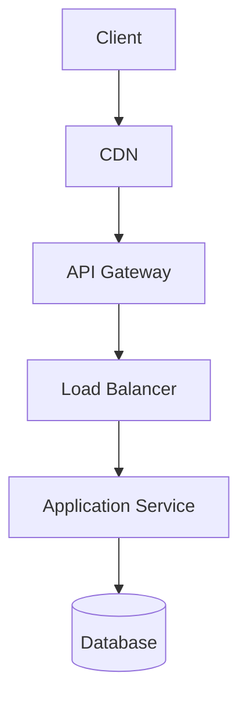

Layers can provide:

- TLS termination
- Authentication
- Rate limiting
- Caching
- Logging
- Routing
- Load balancing
- Web application firewall rules

---

## 3.6 Code on Demand — Optional

A server may send executable code to a client.

The most common example is a web server sending JavaScript to a browser.

This is the only optional REST constraint and is normally not central to backend JSON API design.

---

# 4. Designing Resource-Oriented URLs

## 4.1 Prefer Nouns Over Verbs

The HTTP method already represents the general operation.

### Prefer

```http
GET    /users
POST   /users
GET    /users/42
PATCH  /users/42
DELETE /users/42
```

### Avoid generic CRUD action names

```http
GET  /getUsers
POST /createUser
POST /updateUser
POST /deleteUser
```

The noun-based form is more predictable and better aligned with HTTP semantics.

---

## 4.2 Use Collections and Individual Resources

```text
/users                 -> collection
/users/42              -> one user
/users/42/orders       -> user's order collection
/users/42/orders/901   -> one order under that user
```

Typical mapping:

| Operation | Method and URI |
|---|---|
| List users | `GET /users` |
| Create user | `POST /users` |
| Read user | `GET /users/{user_id}` |
| Replace user | `PUT /users/{user_id}` |
| Partially update user | `PATCH /users/{user_id}` |
| Delete user | `DELETE /users/{user_id}` |

---

## 4.3 Use Stable Identifiers

Prefer identifiers that do not change when mutable attributes change.

### Better

```text
/users/8f52c18d
/products/P-1048
/orders/ORD-2026-00081
```

### Fragile

```text
/users/aarav-shah
/products/blue-running-shoe-size-10
```

A human-readable slug is acceptable when it is designed as a stable identifier.

---

## 4.4 Keep Nesting Shallow

### Reasonable

```text
/customers/C-10/orders
/orders/O-90/items
```

### Too deeply nested

```text
/companies/1/departments/2/teams/3/users/4/tasks/5/comments
```

A deeply nested resource can often be addressed directly:

```text
/comments/{comment_id}
```

A practical guideline is to nest only when the parent relationship is important to identity, authorization, or filtering.

---

## 4.5 Use Query Parameters for Collection Controls

```http
GET /orders?status=paid&sort=-created_at&limit=20&cursor=abc123
```

Use query parameters for:

- Filtering
- Sorting
- Pagination
- Field selection
- Search
- Optional expansions

```text
GET /users?role=admin
GET /orders?sort=-created_at
GET /products?limit=25&cursor=next-token
GET /customers/C-10?include=addresses,subscriptions
```

---

## 4.6 Model Business Actions as Resources

Not every operation is simple CRUD.

Examples:

```http
POST /orders/ORD-101/cancellations
POST /payments/PAY-10/refunds
POST /invoices/INV-90/reminders
POST /deployments/DEP-7/retries
```

This models an action as the creation of a related resource or event.

Example:

```http
POST /orders/ORD-101/cancellations
Content-Type: application/json

{
  "reason": "customer_request"
}
```

```http
HTTP/1.1 201 Created
Location: /orders/ORD-101/cancellations/CAN-88
```

A command-style endpoint such as `POST /orders/ORD-101/cancel` can still be understandable, but a resource-oriented design is often easier to extend, audit, and make idempotent.

---

## 4.7 Naming Conventions

Choose one convention and apply it consistently.

Common choices:

```text
/orders/{order_id}/line-items
/orders/{order_id}/line_items
```

For URLs, lowercase kebab-case is readable:

```text
/payment-methods
/audit-events
```

Other practical rules:

- Avoid file extensions such as `/users.json`
- Avoid implementation names such as `/postgres/users`
- Avoid exposing internal table names
- Avoid putting sensitive information in URLs
- Avoid trailing-slash inconsistency
- Keep identifiers URL-safe

---

# 5. HTTP Request and Response Structure

## 5.1 Request Structure

```http
PATCH /users/42 HTTP/1.1
Host: api.example.com
Authorization: Bearer eyJ...
Content-Type: application/merge-patch+json
Accept: application/json
If-Match: "user-42-v7"

{
  "display_name": "Aarav Shah"
}
```

A request contains:

```text
Method + target URI + HTTP version
Headers
Blank line
Optional content/body
```

---

## 5.2 Response Structure

```http
HTTP/1.1 200 OK
Content-Type: application/json
ETag: "user-42-v8"
Cache-Control: private, max-age=60

{
  "id": "42",
  "display_name": "Aarav Shah"
}
```

A response contains:

```text
HTTP version + status code + reason phrase
Headers
Blank line
Optional content/body
```

The numeric status code carries the protocol semantics. Clients should not depend on the human-readable reason phrase.

---

## 5.3 Important Headers

| Header | Purpose |
|---|---|
| `Authorization` | Sends authentication credentials |
| `Content-Type` | Describes the request or response content |
| `Accept` | Requests an acceptable response media type |
| `Location` | Identifies a created resource or redirect target |
| `Cache-Control` | Controls caching |
| `ETag` | Identifies a particular representation version |
| `If-Match` | Applies an operation only when an ETag matches |
| `If-None-Match` | Commonly used for cache validation |
| `Last-Modified` | Timestamp validator for a representation |
| `Retry-After` | Suggests when the client should retry |
| `Allow` | Lists methods supported by a resource |
| `WWW-Authenticate` | Describes authentication required for a `401` |
| `Idempotency-Key` | Application convention for deduplicating unsafe requests |
| `Vary` | Identifies request fields that affect cached response selection |

`Idempotency-Key` is widely used by payment and creation APIs, but it is not one of the core HTTP method semantics defined by RFC 9110.

---

# 6. HTTP Method Properties

Three properties are especially important:

1. Safety
2. Idempotency
3. Cacheability

---

## 6.1 Safe Methods

A method is **safe** when the client is not requesting a change to the target resource’s state.

Common safe methods:

- `GET`
- `HEAD`
- `OPTIONS`
- `TRACE`
- `QUERY`

A safe request may still cause operational side effects such as:

- Access logs
- Metrics
- Cache population
- Billing for bandwidth
- Security auditing

Those side effects do not change the intended semantics of the target resource.

A `GET` endpoint should not perform a business mutation:

```http
GET /orders/ORD-101/cancel
```

Web crawlers, browser prefetching, retries, and caches may issue safe requests automatically.

---

## 6.2 Idempotent Methods

A method is **idempotent** when multiple identical requests have the same intended effect as one request.

```text
One request       -> target state X
Repeated request  -> target state X
```

Common idempotent methods:

- `GET`
- `HEAD`
- `PUT`
- `DELETE`
- `OPTIONS`
- `TRACE`
- `QUERY`

`POST` is not idempotent by default.  
`PATCH` is not idempotent by default, although a particular patch operation can be designed to be idempotent.

### Idempotency does not require identical responses

```http
DELETE /users/42
```

First response:

```http
HTTP/1.1 204 No Content
```

Repeated response:

```http
HTTP/1.1 404 Not Found
```

The responses differ, but the intended final state is still the same: user `42` does not exist.

---

## 6.3 Cacheable Methods

`GET` and `HEAD` are the main cache-oriented methods.

Other responses may be cacheable when their specifications and response metadata allow it, but real-world cache support varies.

A practical view:

| Method | Safe | Idempotent | Typical API use | Common cache behavior |
|---|---:|---:|---|---|
| `GET` | Yes | Yes | Read resource | Commonly cacheable |
| `HEAD` | Yes | Yes | Read metadata | Cache semantics similar to GET |
| `POST` | No | No | Create/process command | Rarely cached in practice |
| `PUT` | No | Yes | Full replacement | Normally not cached |
| `PATCH` | No | No | Partial modification | Normally not cached |
| `DELETE` | No | Yes | Remove resource | Not cached |
| `OPTIONS` | Yes | Yes | Discover communication options | Not cached |
| `TRACE` | Yes | Yes | Diagnostics | Not cached |
| `CONNECT` | No | No | Create a tunnel | Not applicable |
| `QUERY` | Yes | Yes | Safe query with request content | Defined as cacheable |

---

# 7. Core HTTP Methods

## 7.1 GET — Retrieve a Representation

Use `GET` to retrieve the current representation of a resource.

```http
GET /products/P-100 HTTP/1.1
Accept: application/json
```

```http
HTTP/1.1 200 OK
Content-Type: application/json
ETag: "product-P-100-v4"

{
  "id": "P-100",
  "name": "Mechanical Keyboard",
  "price": 7999
}
```

Common responses:

| Situation | Status |
|---|---|
| Resource returned | `200 OK` |
| Range returned | `206 Partial Content` |
| Cached representation is still valid | `304 Not Modified` |
| Resource does not exist | `404 Not Found` |
| Authentication required | `401 Unauthorized` |
| Access denied | `403 Forbidden` |

### GET request content

The semantics of content in a `GET` request are not generally defined. Use query parameters for normal filtering or use a method with defined request-content semantics.

---

## 7.2 HEAD — Retrieve Headers Without Response Content

`HEAD` is similar to `GET`, but the server does not send response content.

```http
HEAD /files/report.pdf
```

```http
HTTP/1.1 200 OK
Content-Type: application/pdf
Content-Length: 845210
ETag: "report-v3"
Last-Modified: Wed, 29 Jul 2026 08:30:00 GMT
```

Useful for:

- Checking whether a resource exists
- Reading metadata
- Checking content length
- Checking validators such as `ETag`
- Validating cached information

The server should provide headers that correspond to a `GET` response, except where calculating a header would require generating the full content.

---

## 7.3 POST — Create or Process

`POST` asks the target resource to process the enclosed representation according to that resource’s own semantics.

Common uses:

- Create a new resource under a collection
- Submit a command
- Start an asynchronous job
- Create a subordinate resource
- Process a complex operation
- Trigger a domain workflow

### Create a resource

```http
POST /orders
Content-Type: application/json

{
  "customer_id": "C-10",
  "items": [
    {
      "product_id": "P-100",
      "quantity": 2
    }
  ]
}
```

```http
HTTP/1.1 201 Created
Location: /orders/ORD-901
Content-Type: application/json

{
  "id": "ORD-901",
  "status": "pending"
}
```

### Start asynchronous work

```http
POST /reports
Content-Type: application/json

{
  "type": "annual-sales",
  "year": 2026
}
```

```http
HTTP/1.1 202 Accepted
Location: /report-jobs/JOB-77

{
  "job_id": "JOB-77",
  "status": "queued"
}
```

### Idempotency key for retry safety

```http
POST /payments
Idempotency-Key: 9fb40a71-3f9d-4cb6-9120-f8e824...

{
  "order_id": "ORD-901",
  "amount": 15998
}
```

The server stores the key and returns the original result when the same logical request is retried.

---

## 7.4 PUT — Create or Completely Replace a Resource

`PUT` requests that the state of the target resource be created or replaced by the supplied representation.

```http
PUT /users/42
Content-Type: application/json

{
  "id": "42",
  "name": "Aarav Shah",
  "email": "aarav@example.com",
  "active": true
}
```

The client normally knows the target URI.

Possible responses:

| Situation | Status |
|---|---|
| New resource created | `201 Created` |
| Existing resource replaced and body returned | `200 OK` |
| Existing resource replaced without response body | `204 No Content` |

### Important semantic

With replacement-style `PUT`, omitted fields may be reset or removed according to the API contract.

Existing state:

```json
{
  "name": "Aarav",
  "email": "aarav@example.com",
  "active": true
}
```

Request:

```json
{
  "name": "Aarav Shah"
}
```

Possible resulting state:

```json
{
  "name": "Aarav Shah",
  "email": null,
  "active": false
}
```

Do not use `PUT` as a partial-update method unless the API contract explicitly defines different semantics.

---

## 7.5 PATCH — Partially Modify a Resource

`PATCH` applies a set of partial modifications.

```http
PATCH /users/42
Content-Type: application/merge-patch+json

{
  "display_name": "Aarav Shah"
}
```

```http
HTTP/1.1 200 OK
Content-Type: application/json

{
  "id": "42",
  "display_name": "Aarav Shah",
  "active": true
}
```

Possible responses:

- `200 OK` when returning the updated representation
- `204 No Content` when no response representation is returned
- `409 Conflict` when the change conflicts with current resource state
- `412 Precondition Failed` when an `If-Match` condition fails
- `415 Unsupported Media Type` when the patch format is unsupported
- `422 Unprocessable Content` when the patch is syntactically valid but semantically invalid

### PATCH formats

Two known approaches are:

#### JSON Merge Patch style

```json
{
  "name": "New Name",
  "phone": null
}
```

#### JSON Patch style

```json
[
  {
    "op": "replace",
    "path": "/name",
    "value": "New Name"
  },
  {
    "op": "remove",
    "path": "/phone"
  }
]
```

`PATCH` is not idempotent by definition.

This patch may be idempotent:

```json
{
  "status": "active"
}
```

This operation is not idempotent:

```json
{
  "operation": "increment",
  "path": "/login_count",
  "value": 1
}
```

---

## 7.6 DELETE — Remove a Resource

```http
DELETE /users/42
```

Possible responses:

### Deletion completed, no content

```http
HTTP/1.1 204 No Content
```

### Deletion completed, response included

```http
HTTP/1.1 200 OK
Content-Type: application/json

{
  "deleted": true,
  "id": "42"
}
```

### Deletion accepted for asynchronous processing

```http
HTTP/1.1 202 Accepted
Location: /deletion-jobs/JOB-9
```

`DELETE` is idempotent by intended effect even when repeated responses differ.

A database soft-delete implementation does not change the HTTP method semantics. The API resource is considered unavailable or inactive according to the API contract.

---

## 7.7 OPTIONS — Discover Communication Options

`OPTIONS` asks what communication options are available for a target resource or server.

```http
OPTIONS /users/42
```

```http
HTTP/1.1 204 No Content
Allow: GET, HEAD, PUT, PATCH, DELETE, OPTIONS
Accept-Patch: application/merge-patch+json
```

Browsers also use `OPTIONS` for CORS preflight requests.

```http
OPTIONS /users/42
Origin: https://app.example.com
Access-Control-Request-Method: PATCH
Access-Control-Request-Headers: authorization, content-type
```

CORS is a browser security mechanism. It is separate from REST itself.

---

## 7.8 TRACE — Diagnostic Loopback

`TRACE` asks the server to reflect the received request for diagnostics.

It is usually disabled in production because reflected request data may expose sensitive information or increase attack surface.

It is not normally used as an application REST endpoint.

---

## 7.9 CONNECT — Establish a Tunnel

`CONNECT` creates a tunnel to a target, commonly through an HTTP proxy for HTTPS traffic.

```text
Client -> Proxy -> CONNECT target.example:443 -> Encrypted tunnel
```

It is part of HTTP but is not a normal CRUD or REST application method.

---

## 7.10 QUERY — Safe, Idempotent Server-Side Query

`QUERY` was standardized in RFC 10008 in 2026 and is now present in the IANA HTTP Method Registry.

It fills a gap between:

- `GET`, which is safe and idempotent but normally carries query input in the URI
- `POST`, which supports request content but is not safe or idempotent by default

Example:

```http
QUERY /products/search HTTP/1.1
Content-Type: application/json
Accept: application/json

{
  "categories": ["laptops", "monitors"],
  "price": {
    "min": 50000,
    "max": 150000
  },
  "features": {
    "ports": ["usb-c", "hdmi"]
  }
}
```

Properties:

- Safe
- Idempotent
- Request content is expected
- Response can be cached using QUERY-aware cache rules
- Useful for large or structured read-only queries

### Practical adoption note

Although it is now standardized, frameworks, browsers, API gateways, security tools, SDK generators, and observability products may not all support `QUERY` immediately.

For broad compatibility, many production APIs will continue using:

```http
GET /products?category=laptops
```

or:

```http
POST /product-searches
```

When adopting `QUERY`, verify the complete request path:

```text
Client -> CDN -> WAF -> Gateway -> Framework -> Router -> Monitoring
```

---

# 8. Choosing PUT vs PATCH vs POST

## 8.1 Decision Table

| Requirement | Recommended method |
|---|---|
| Create resource and server chooses URI | `POST` to collection |
| Create or replace resource at known URI | `PUT` |
| Replace full representation | `PUT` |
| Change selected fields | `PATCH` |
| Run domain command | Usually `POST` |
| Submit unsafe processing | `POST` |
| Submit a safe, complex body-based query | `QUERY`, where supported |
| Simple read-only query | `GET` |

---

## 8.2 Example: User Resource

### Create with server-generated ID

```http
POST /users
```

### Replace known user

```http
PUT /users/42
```

### Update only email

```http
PATCH /users/42
```

### Activate through a domain operation

Possible resource-oriented form:

```http
POST /users/42/activations
```

Possible command form:

```http
POST /users/42/activate
```

The resource-oriented form is useful when activation has its own:

- Identifier
- Timestamp
- Actor
- Status
- Audit record
- Reversal workflow

---

## 8.3 Retry Behavior

```text
GET     -> normally safe to retry
HEAD    -> normally safe to retry
PUT     -> normally safe to retry
DELETE  -> normally safe to retry
QUERY   -> normally safe to retry
POST    -> retry only with application protection
PATCH   -> retry only when operation semantics are known
```

Use timeouts, bounded retries, exponential backoff, and jitter. Do not blindly retry every failure.

---

# 9. HTTP Status Code Classes

The first digit indicates the broad outcome class.

| Range | Class | Meaning |
|---:|---|---|
| `1xx` | Informational | Request received; processing continues |
| `2xx` | Successful | Request successfully received, understood, and accepted |
| `3xx` | Redirection | Additional action is needed |
| `4xx` | Client error | Request cannot be fulfilled because of client-side conditions |
| `5xx` | Server error | Server failed to fulfill an apparently valid request |

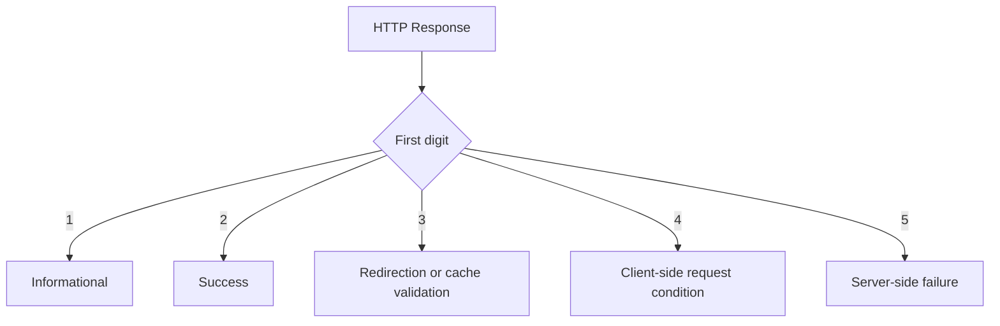

Do not return `200 OK` for every response while placing the real outcome only inside JSON.

### Avoid

```http
HTTP/1.1 200 OK

{
  "success": false,
  "error": "user not found"
}
```

### Prefer

```http
HTTP/1.1 404 Not Found
Content-Type: application/problem+json

{
  "type": "https://api.example.com/problems/user-not-found",
  "title": "User not found",
  "status": 404
}
```

HTTP clients, gateways, caches, monitors, SDKs, and retry systems depend on the real status code.

---

# 10. Success Status Codes — 2xx

## 10.1 200 OK

Use when the operation succeeded and the response includes a representation or result.

```http
GET /users/42
```

```http
HTTP/1.1 200 OK

{
  "id": "42",
  "name": "Aarav"
}
```

Common uses:

- Successful `GET`
- Successful query
- `PATCH` returning the updated resource
- `DELETE` returning a result
- `POST` returning processed output without creating a new resource

---

## 10.2 201 Created

Use when the request creates a new resource.

```http
POST /users
```

```http
HTTP/1.1 201 Created
Location: /users/42
Content-Type: application/json

{
  "id": "42",
  "name": "Aarav"
}
```

Good practice:

- Include a `Location` header with the new resource URI
- Optionally include the new resource representation
- Use for successful creation, not every successful POST

---

## 10.3 202 Accepted

Use when the request has been accepted but processing is not complete.

```http
POST /video-transcoding-jobs
```

```http
HTTP/1.1 202 Accepted
Location: /video-transcoding-jobs/JOB-18
Retry-After: 10

{
  "id": "JOB-18",
  "status": "queued"
}
```

`202` does not guarantee that processing will eventually succeed.

Provide a way to observe the operation:

```http
GET /video-transcoding-jobs/JOB-18
```

```json
{
  "id": "JOB-18",
  "status": "processing",
  "progress": 65
}
```

---

## 10.4 204 No Content

Use when the request succeeded and no response content is needed.

Common uses:

- Successful deletion
- Successful update where the client does not need the updated representation
- Successful command with no response representation

```http
DELETE /users/42
```

```http
HTTP/1.1 204 No Content
```

A `204` response does not contain a message body.

---

## 10.5 206 Partial Content

Use for a successful range request.

```http
GET /videos/V-90
Range: bytes=0-999999
```

```http
HTTP/1.1 206 Partial Content
Content-Range: bytes 0-999999/5000000
```

Used for:

- Video streaming
- Large file downloads
- Download resumption
- Partial binary retrieval

Do not use `206` as the normal status for paginated JSON collections. A paginated collection is usually returned with `200 OK`.

---

# 11. Redirection Status Codes — 3xx

## 11.1 301 Moved Permanently

The resource has a new permanent URI.

```http
HTTP/1.1 301 Moved Permanently
Location: /v2/customers/42
```

Clients and caches may remember the redirect.

---

## 11.2 302 Found

The resource is temporarily available at another URI.

Historically, user agents sometimes change a `POST` to `GET` while following `302`.

For API behavior where the method must be preserved, use `307`.

---

## 11.3 303 See Other

Use when the client should retrieve another resource using `GET`.

Common pattern after creating or submitting an operation:

```http
POST /report-runs
```

```http
HTTP/1.1 303 See Other
Location: /report-runs/R-10/result
```

The client follows with:

```http
GET /report-runs/R-10/result
```

---

## 11.4 304 Not Modified

Used for conditional cache validation.

```http
GET /products/P-100
If-None-Match: "product-v4"
```

```http
HTTP/1.1 304 Not Modified
ETag: "product-v4"
```

The client reuses its cached representation.

`304` is not a normal success response with JSON content and does not contain a response body representing the resource.

---

## 11.5 307 Temporary Redirect

Temporary redirect that preserves the original method and content.

```http
POST /payments
```

```http
HTTP/1.1 307 Temporary Redirect
Location: https://payments-region-b.example.com/payments
```

The client repeats `POST`, not `GET`.

---

## 11.6 308 Permanent Redirect

Permanent redirect that preserves the original method and content.

| Need | Status |
|---|---|
| Temporary; method may historically change | `302` |
| Temporary; preserve method | `307` |
| Permanent; method may historically change | `301` |
| Permanent; preserve method | `308` |
| Redirect to a GET result | `303` |

---

# 12. Client Error Status Codes — 4xx

A `4xx` response means the request cannot be fulfilled because of the request or the client’s current conditions.

It does not mean that the backend code cannot throw an exception. The distinction is based on what the response means to the client.

---

## 12.1 400 Bad Request

Use when the server cannot process the request because it is malformed or violates basic request structure.

Examples:

- Invalid JSON
- Missing required framing information
- Invalid query parameter syntax
- Mutually incompatible parameters
- Invalid date syntax

```http
POST /users
Content-Type: application/json

{
  "email": "aarav@example.com",
```

```http
HTTP/1.1 400 Bad Request
```

---

## 12.2 401 Unauthorized

Despite the name, `401` means the request lacks valid authentication credentials.

Use when:

- Token is missing
- Token is invalid
- Token is expired
- Credentials cannot be verified

```http
HTTP/1.1 401 Unauthorized
WWW-Authenticate: Bearer realm="api"
```

### Mental model

```text
401 -> Who are you? Authentication is missing or invalid.
403 -> I know who you are, but you are not allowed.
```

---

## 12.3 403 Forbidden

The server understood the request but refuses to authorize it.

Examples:

- User lacks required role
- Tenant cannot access another tenant’s data
- Account policy blocks the action
- Resource owner denied access

```http
HTTP/1.1 403 Forbidden
```

Some APIs return `404` instead of `403` when revealing the resource’s existence would leak sensitive information. This should be an intentional security policy.

---

## 12.4 404 Not Found

The target resource does not exist, is not visible to the client, or the server does not wish to reveal whether it exists.

```http
GET /users/999999
```

```http
HTTP/1.1 404 Not Found
```

A collection with no matching elements normally returns an empty collection, not `404`.

```http
GET /users?role=unknown-role
```

```http
HTTP/1.1 200 OK

{
  "items": [],
  "next_cursor": null
}
```

---

## 12.5 405 Method Not Allowed

The resource exists, but the method is not supported for it.

```http
DELETE /system-health
```

```http
HTTP/1.1 405 Method Not Allowed
Allow: GET, HEAD, OPTIONS
```

Compare:

```text
404 -> target resource not found
405 -> target exists, but method is not allowed
501 -> server does not implement the method capability
```

---

## 12.6 406 Not Acceptable

The server cannot produce a representation matching the client’s `Accept` header.

```http
GET /reports/R-1
Accept: application/x-custom-format
```

```http
HTTP/1.1 406 Not Acceptable
```

---

## 12.7 408 Request Timeout

The server did not receive a complete request within the time it was prepared to wait.

This is different from a client-side timeout where the client gives up before receiving a response.

Retries may be appropriate depending on the method and request semantics.

---

## 12.8 409 Conflict

The request conflicts with the current state of the resource.

Examples:

- Duplicate unique identifier
- Invalid state transition
- Resource dependency prevents deletion
- Concurrent update conflict
- Username already exists

```http
POST /users

{
  "email": "existing@example.com"
}
```

```http
HTTP/1.1 409 Conflict
```

Another example:

```text
Current order status: shipped
Requested transition: cancel
Result: 409 Conflict
```

---

## 12.9 410 Gone

The resource previously existed but has been intentionally and likely permanently removed.

```http
GET /public-links/expired-link
```

```http
HTTP/1.1 410 Gone
```

Use `404` when the server does not know or does not want to communicate permanence.

---

## 12.10 412 Precondition Failed

A request condition supplied by the client evaluated to false.

```http
PATCH /users/42
If-Match: "user-v7"
```

Current ETag:

```text
"user-v8"
```

Response:

```http
HTTP/1.1 412 Precondition Failed
```

This is central to optimistic concurrency control.

---

## 12.11 413 Content Too Large

The request content is larger than the server is willing or able to process.

```http
POST /attachments
Content-Length: 500000000
```

```http
HTTP/1.1 413 Content Too Large
```

The modern RFC 9110 reason phrase is **Content Too Large**. Older systems may display **Payload Too Large**.

---

## 12.12 415 Unsupported Media Type

The request’s `Content-Type` is unsupported.

```http
POST /users
Content-Type: application/xml
```

If the API only accepts JSON:

```http
HTTP/1.1 415 Unsupported Media Type
```

Compare:

```text
Content-Type -> format being sent by the client
Accept       -> formats the client wants to receive

415 -> cannot consume this request format
406 -> cannot produce an acceptable response format
```

---

## 12.13 422 Unprocessable Content

The server understands the media type and syntax, but cannot process the request instructions.

Examples:

- Validation failure
- Semantically invalid field combination
- Invalid domain value
- Valid patch syntax with an impossible operation

```http
POST /employees
Content-Type: application/json

{
  "name": "Aarav",
  "joining_date": "2026-09-01",
  "termination_date": "2026-08-01"
}
```

```http
HTTP/1.1 422 Unprocessable Content
```

### 400 vs 422

A useful API convention:

```text
400 -> malformed request or invalid request syntax/structure
422 -> syntax is valid, but data fails semantic validation
```

Both are valid choices for many validation cases when consistently documented. Framework defaults also influence this decision.

---

## 12.14 428 Precondition Required

The server requires the request to be conditional.

```http
PATCH /documents/D-9
```

```http
HTTP/1.1 428 Precondition Required
```

The server may require:

```http
If-Match: "document-v12"
```

This prevents lost updates.

---

## 12.15 429 Too Many Requests

The client has exceeded a rate limit.

```http
HTTP/1.1 429 Too Many Requests
Retry-After: 60
Content-Type: application/problem+json
```

```json
{
  "type": "https://api.example.com/problems/rate-limit-exceeded",
  "title": "Rate limit exceeded",
  "status": 429,
  "detail": "Try again after 60 seconds."
}
```

The client should apply bounded backoff and honor `Retry-After` when provided.

---

## 12.16 431 Request Header Fields Too Large

Use when request headers are too large.

Possible causes:

- Oversized cookies
- Extremely large authentication tokens
- Too many forwarded headers
- Header abuse

---

## 12.17 Other Notable 4xx Codes

| Code | Meaning | Typical use |
|---:|---|---|
| `402` | Payment Required | Reserved for future use; some APIs use it by convention |
| `407` | Proxy Authentication Required | Authentication with an HTTP proxy |
| `411` | Length Required | Server requires `Content-Length` |
| `414` | URI Too Long | URI exceeds acceptable length |
| `416` | Range Not Satisfiable | Requested range cannot be served |
| `421` | Misdirected Request | Request reached a server unable to produce a response for that target |
| `425` | Too Early | Server refuses a request that may be replayed |
| `426` | Upgrade Required | Client must switch protocols |
| `451` | Unavailable For Legal Reasons | Access denied for legal reasons |

`418` is registered as unused in the current IANA registry. It should not be selected for normal API error semantics.

---

# 13. Server Error Status Codes — 5xx

A `5xx` response means the server failed to fulfill an apparently valid request.

Do not expose:

- Stack traces
- SQL queries
- Credentials
- Internal file paths
- Infrastructure secrets
- Unfiltered exception messages

Return a safe error identifier that can be correlated with server logs.

---

## 13.1 500 Internal Server Error

Use for an unexpected server-side failure when no more specific `5xx` code applies.

```http
HTTP/1.1 500 Internal Server Error
Content-Type: application/problem+json
X-Request-ID: req-8f2d1
```

```json
{
  "type": "about:blank",
  "title": "Internal Server Error",
  "status": 500,
  "detail": "An unexpected error occurred.",
  "instance": "urn:request:req-8f2d1"
}
```

---

## 13.2 501 Not Implemented

The server does not support the functionality needed to fulfill the request.

It may be used when the server does not recognize or implement a method.

Do not use `501` simply because a planned application feature has not yet been developed. For a known resource with a disallowed method, `405` is usually more appropriate.

---

## 13.3 502 Bad Gateway

A gateway or proxy received an invalid response from an upstream server.

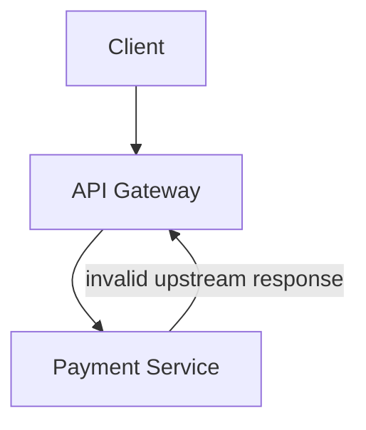

Response:

```http
HTTP/1.1 502 Bad Gateway
```

---

## 13.4 503 Service Unavailable

The service is temporarily unable to handle the request.

Possible reasons:

- Maintenance
- Overload
- Dependency outage
- Circuit breaker open
- No healthy instances

```http
HTTP/1.1 503 Service Unavailable
Retry-After: 120
```

Use `Retry-After` when the server can estimate a retry time.

---

## 13.5 504 Gateway Timeout

A gateway or proxy did not receive a timely response from an upstream service.

```text
Client -> API Gateway -> Inventory Service
                         ^
                         |
                   timed out
```

Compare:

```text
502 -> upstream produced an invalid response
503 -> service is temporarily unavailable
504 -> upstream did not respond in time
```

---

## 13.6 Other Notable 5xx Codes

| Code | Meaning | Typical use |
|---:|---|---|
| `505` | HTTP Version Not Supported | HTTP version unsupported |
| `507` | Insufficient Storage | Server cannot store required representation; often WebDAV-related |
| `508` | Loop Detected | Infinite processing loop detected |
| `511` | Network Authentication Required | Client must authenticate to gain network access |

---

# 14. Status-Code Selection Guide

## 14.1 Success Decision Flow

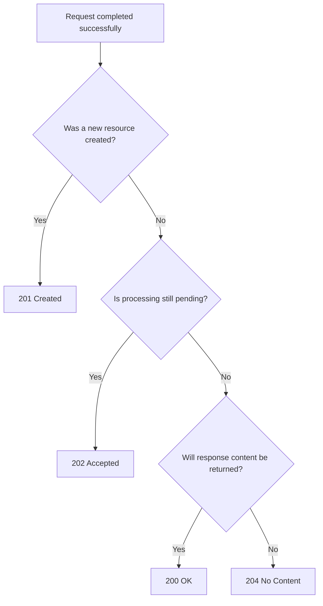

---

## 14.2 Error Decision Flow

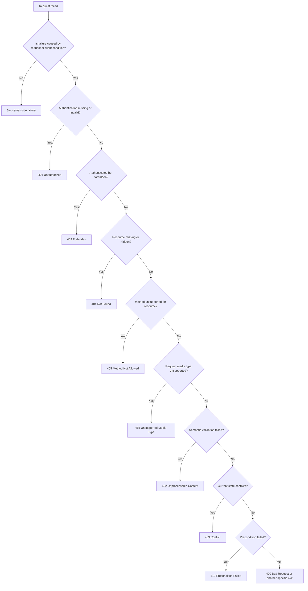

---

## 14.3 Common Operation Mapping

| Operation | Typical success | Common failures |
|---|---|---|
| List resources | `200` | `400`, `401`, `403` |
| Read resource | `200` | `401`, `403`, `404` |
| Create resource | `201` | `400`, `409`, `415`, `422` |
| Start async job | `202` | `400`, `409`, `422`, `429` |
| Replace resource | `200`, `201`, `204` | `404`, `409`, `412`, `415`, `422` |
| Partially update | `200`, `204` | `404`, `409`, `412`, `415`, `422` |
| Delete resource | `200`, `202`, `204` | `404`, `409`, `412` |
| Conditional GET | `200`, `304` | `401`, `403`, `404` |
| Rate-limited request | — | `429` |
| Upstream timeout | — | `504` |

These are common mappings, not automatic rules. The correct status depends on the precise semantics of the resource and operation.

---

# 15. REST Error Response Design

## 15.1 Use a Consistent Machine-Readable Shape

RFC 9457 defines **Problem Details for HTTP APIs**.

Media type:

```http
Content-Type: application/problem+json
```

Example:

```http
HTTP/1.1 422 Unprocessable Content
Content-Type: application/problem+json
```

```json
{
  "type": "https://api.example.com/problems/validation-error",
  "title": "Request validation failed",
  "status": 422,
  "detail": "One or more fields are invalid.",
  "instance": "urn:request:req-71f8",
  "errors": [
    {
      "field": "email",
      "code": "invalid_format",
      "message": "Enter a valid email address."
    },
    {
      "field": "age",
      "code": "minimum_value",
      "message": "Age must be at least 18."
    }
  ]
}
```

Core fields:

| Field | Meaning |
|---|---|
| `type` | Identifier for the problem type |
| `title` | Short human-readable summary |
| `status` | HTTP status code |
| `detail` | Explanation for this occurrence |
| `instance` | Identifier for this specific occurrence |

Custom extension fields such as `errors`, `error_code`, or `trace_id` may be added.

---

## 15.2 Stable Error Codes

Human-readable text can change. Client logic should use stable machine-readable identifiers.

```json
{
  "type": "https://api.example.com/problems/email-already-exists",
  "title": "Email already exists",
  "status": 409,
  "error_code": "USER_EMAIL_ALREADY_EXISTS"
}
```

Clients should not parse:

```text
"A user with this email already exists."
```

to determine behavior.

---

## 15.3 Correlation IDs

Include a request or correlation identifier.

```http
X-Request-ID: req-71f8
```

```json
{
  "instance": "urn:request:req-71f8"
}
```

Log the same identifier across:

```text
API Gateway -> Application -> Queue -> Worker -> Database calls
```

This supports debugging without revealing internal implementation details to the client.

---

# 16. Caching and Conditional Requests

## 16.1 Cache-Control

Example:

```http
Cache-Control: public, max-age=300
```

Meaning:

```text
public       -> shared caches may store it
max-age=300  -> fresh for 300 seconds
```

Common directives:

| Directive | Meaning |
|---|---|
| `public` | Shared caches may store the response |
| `private` | Intended for a private cache, such as a browser |
| `no-store` | Do not store the response |
| `no-cache` | Stored response must be validated before reuse |
| `max-age=N` | Fresh for N seconds |
| `s-maxage=N` | Shared-cache freshness lifetime |
| `must-revalidate` | Do not reuse stale response without validation |
| `immutable` | Representation is not expected to change while fresh |

`no-cache` does not mean “never store.” It means the cached response must be revalidated before reuse.

For sensitive responses, a common choice is:

```http
Cache-Control: no-store
```

---

## 16.2 ETag Validation

Initial request:

```http
GET /products/P-100
```

Response:

```http
HTTP/1.1 200 OK
ETag: "product-P-100-v4"
Cache-Control: private, max-age=0, must-revalidate

{
  "id": "P-100",
  "price": 7999
}
```

Later request:

```http
GET /products/P-100
If-None-Match: "product-P-100-v4"
```

If unchanged:

```http
HTTP/1.1 304 Not Modified
ETag: "product-P-100-v4"
```

If changed:

```http
HTTP/1.1 200 OK
ETag: "product-P-100-v5"

{
  "id": "P-100",
  "price": 7499
}
```

---

## 16.3 Last-Modified Validation

```http
Last-Modified: Wed, 29 Jul 2026 08:30:00 GMT
```

Client:

```http
If-Modified-Since: Wed, 29 Jul 2026 08:30:00 GMT
```

`ETag` is often more precise because timestamps may not represent every relevant change and can have limited resolution.

---

## 16.4 Vary

When the representation depends on request headers, inform caches.

```http
Vary: Accept-Encoding, Accept-Language
```

This means different variants may exist for:

- Compression
- Language

Avoid unnecessarily large `Vary` sets because they reduce cache efficiency.

---

# 17. Optimistic Concurrency with ETag

## 17.1 Lost Update Problem

Two clients read the same version:

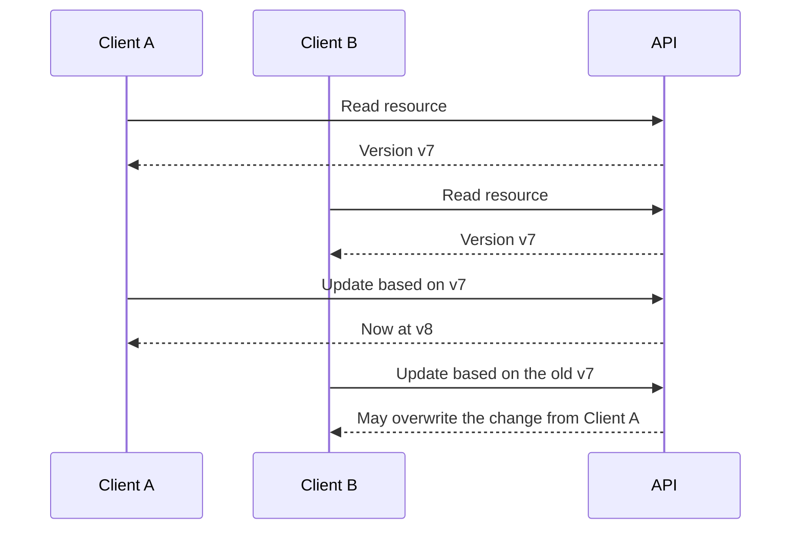

---

## 17.2 Conditional Update

Read:

```http
GET /documents/D-10
```

```http
HTTP/1.1 200 OK
ETag: "document-D-10-v7"
```

Update:

```http
PATCH /documents/D-10
If-Match: "document-D-10-v7"
Content-Type: application/merge-patch+json

{
  "title": "Updated title"
}
```

If current version is still `v7`:

```http
HTTP/1.1 200 OK
ETag: "document-D-10-v8"
```

If another client already changed it:

```http
HTTP/1.1 412 Precondition Failed
```

Flow:

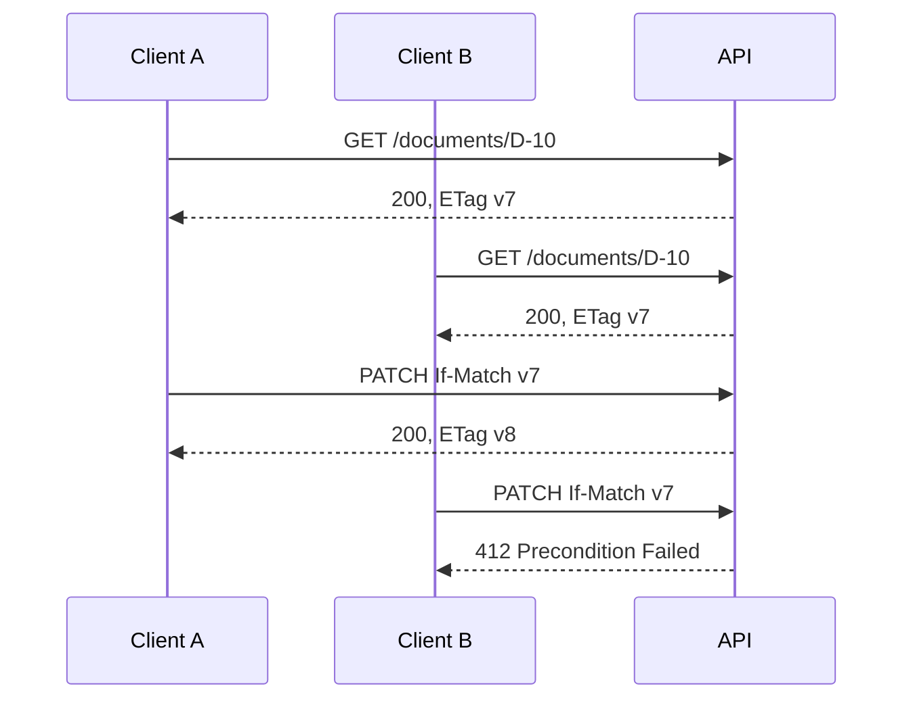

For resources where lost updates are unacceptable, the API may return `428 Precondition Required` when `If-Match` is missing.

---

# 18. Pagination, Filtering, Sorting and Search

## 18.1 Offset Pagination

```http
GET /orders?limit=20&offset=40
```

Simple, but large offsets may become slow and concurrent inserts can cause duplicate or skipped items.

---

## 18.2 Cursor Pagination

```http
GET /orders?limit=20&cursor=eyJjcmVhdGVkX2F0...
```

Response:

```json
{
  "items": [
    {
      "id": "ORD-101"
    },
    {
      "id": "ORD-100"
    }
  ],
  "next_cursor": "eyJjcmVhdGVkX2F0...",
  "has_more": true
}
```

Cursor pagination is often better for:

- Large datasets
- Frequently changing data
- Infinite scrolling
- Stable forward traversal

The cursor should usually be opaque to clients.

---

## 18.3 Filtering

```http
GET /orders?status=paid&customer_id=C-10
```

Define:

- Supported filters
- Operators
- Case sensitivity
- Date/time format
- Timezone behavior
- Empty-value behavior

---

## 18.4 Sorting

```http
GET /orders?sort=-created_at,total
```

Possible convention:

```text
created_at   -> ascending
-created_at  -> descending
```

Always define a deterministic tie-breaker for stable pagination.

Example:

```text
ORDER BY created_at DESC, id DESC
```

---

## 18.5 Search

Simple search:

```http
GET /products?q=mechanical+keyboard
```

Structured complex search:

```http
POST /product-searches
```

Or, with compatible infrastructure:

```http
QUERY /products
```

Avoid very large or sensitive query expressions in URLs because URLs are commonly logged, cached, stored in history, and included in monitoring systems.

---

## 18.6 Field Selection and Expansion

```http
GET /users/42?fields=id,name,email
```

```http
GET /orders/ORD-101?include=items,payments
```

Use expansion carefully because uncontrolled expansion can produce:

- Very large responses
- N+1 database queries
- Expensive joins
- Circular relationships
- Unpredictable latency

---

# 19. Authentication and Authorization Semantics

## 19.1 Authentication Flow

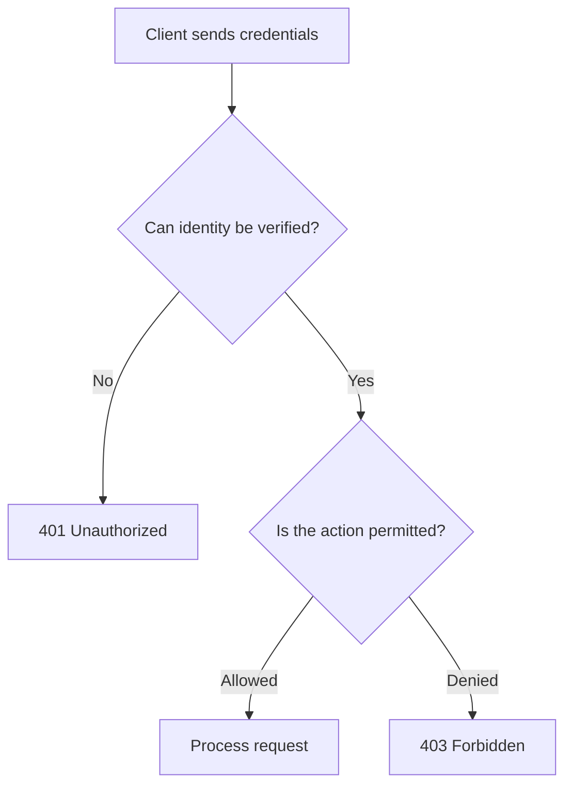

---

## 19.2 Bearer Token Example

```http
GET /me
Authorization: Bearer eyJhbGciOi...
```

Invalid or expired token:

```http
HTTP/1.1 401 Unauthorized
WWW-Authenticate: Bearer
```

Valid token without permission:

```http
HTTP/1.1 403 Forbidden
```

---

## 19.3 Multi-Tenant Resource Protection

Request:

```http
GET /tenants/T-2/invoices/INV-90
```

Authenticated user belongs to tenant `T-1`.

Possible response:

```http
HTTP/1.1 404 Not Found
```

Returning `404` may prevent disclosing that another tenant’s invoice exists. This is an authorization policy, not a replacement for actual permission checks.

Never depend only on a tenant ID supplied in the URL. Verify it against the authenticated principal and server-side authorization rules.

---

# 20. API Versioning and Compatibility

REST does not require one specific versioning strategy.

Common approaches:

## 20.1 URI Versioning

```text
/api/v1/users
/api/v2/users
```

Advantages:

- Visible
- Easy to route
- Easy to test and document

Trade-off:

- Version becomes part of every URI

---

## 20.2 Media-Type Versioning

```http
Accept: application/vnd.example.user-v2+json
```

Advantages:

- Version tied to representation

Trade-off:

- More complex for developers, tools, and documentation

---

## 20.3 Header Versioning

```http
API-Version: 2026-07-01
```

Advantages:

- Keeps resource URI stable

Trade-off:

- Less visible in links, logs, and browser navigation

---

## 20.4 Prefer Compatible Evolution

Not every change requires a new major version.

Often compatible:

- Adding optional response fields
- Adding new endpoints
- Adding optional request fields
- Adding new enum values when clients are designed to tolerate them

Usually breaking:

- Removing fields
- Renaming fields
- Changing field meaning
- Changing type
- Making an optional field required
- Changing status-code semantics
- Changing authentication requirements
- Changing pagination guarantees

Clients should ignore unknown response fields unless the contract explicitly says otherwise.

---

# 21. End-to-End REST API Example

Consider an order API.

## 21.1 Create an Order

```http
POST /orders HTTP/1.1
Content-Type: application/json
Accept: application/json
Idempotency-Key: 512d0cb6-d12d-4d40-bf21-20b...

{
  "customer_id": "C-10",
  "items": [
    {
      "product_id": "P-100",
      "quantity": 2
    }
  ]
}
```

```http
HTTP/1.1 201 Created
Location: /orders/ORD-901
ETag: "order-ORD-901-v1"
Content-Type: application/json

{
  "id": "ORD-901",
  "customer_id": "C-10",
  "status": "pending_payment",
  "total": 15998
}
```

---

## 21.2 Retrieve the Order

```http
GET /orders/ORD-901
Accept: application/json
```

```http
HTTP/1.1 200 OK
ETag: "order-ORD-901-v1"
Cache-Control: private, max-age=0, must-revalidate
Content-Type: application/json

{
  "id": "ORD-901",
  "status": "pending_payment",
  "total": 15998
}
```

---

## 21.3 Update Delivery Instructions

```http
PATCH /orders/ORD-901
If-Match: "order-ORD-901-v1"
Content-Type: application/merge-patch+json

{
  "delivery_instructions": "Call before delivery"
}
```

```http
HTTP/1.1 200 OK
ETag: "order-ORD-901-v2"
Content-Type: application/json

{
  "id": "ORD-901",
  "status": "pending_payment",
  "delivery_instructions": "Call before delivery",
  "total": 15998
}
```

---

## 21.4 Create a Payment

```http
POST /orders/ORD-901/payments
Idempotency-Key: e1473f8e-e453-4e2a-a18d-09f...
Content-Type: application/json

{
  "payment_method_id": "PM-44"
}
```

Asynchronous processing:

```http
HTTP/1.1 202 Accepted
Location: /payment-jobs/JOB-77
Retry-After: 2
Content-Type: application/json

{
  "job_id": "JOB-77",
  "status": "processing"
}
```

---

## 21.5 Check Payment Job

```http
GET /payment-jobs/JOB-77
```

```http
HTTP/1.1 200 OK

{
  "job_id": "JOB-77",
  "status": "completed",
  "payment_id": "PAY-300"
}
```

---

## 21.6 Cancel the Order

```http
POST /orders/ORD-901/cancellations
Content-Type: application/json

{
  "reason": "customer_request"
}
```

If cancellation is no longer permitted:

```http
HTTP/1.1 409 Conflict
Content-Type: application/problem+json

{
  "type": "https://api.example.com/problems/order-not-cancellable",
  "title": "Order cannot be cancelled",
  "status": 409,
  "detail": "The order has already been handed to the delivery partner.",
  "instance": "urn:request:req-a910"
}
```

This response communicates both:

- Generic HTTP meaning: conflict with current state
- Domain meaning: order has progressed too far

---

# 22. Practical FastAPI Example

The following example demonstrates common method and status-code choices.

```python
from __future__ import annotations

from typing import Annotated
from uuid import UUID, uuid4

from fastapi import FastAPI, Header, HTTPException, Response, status
from pydantic import BaseModel, EmailStr

app = FastAPI()


class UserCreate(BaseModel):
    name: str
    email: EmailStr


class UserPatch(BaseModel):
    name: str | None = None
    email: EmailStr | None = None


class User(BaseModel):
    id: UUID
    name: str
    email: EmailStr
    version: int


users: dict[UUID, User] = {}


def make_etag(user: User) -> str:
    return f'"user-{user.id}-v{user.version}"'


@app.post(
    "/users",
    response_model=User,
    status_code=status.HTTP_201_CREATED,
)
def create_user(payload: UserCreate, response: Response) -> User:
    if any(user.email == payload.email for user in users.values()):
        raise HTTPException(
            status_code=status.HTTP_409_CONFLICT,
            detail="A user with this email already exists.",
        )

    user = User(
        id=uuid4(),
        name=payload.name,
        email=payload.email,
        version=1,
    )
    users[user.id] = user

    response.headers["Location"] = f"/users/{user.id}"
    response.headers["ETag"] = make_etag(user)
    return user


@app.get("/users/{user_id}", response_model=User)
def get_user(user_id: UUID, response: Response) -> User:
    user = users.get(user_id)
    if user is None:
        raise HTTPException(
            status_code=status.HTTP_404_NOT_FOUND,
            detail="User not found.",
        )

    response.headers["ETag"] = make_etag(user)
    return user


@app.patch("/users/{user_id}", response_model=User)
def update_user(
    user_id: UUID,
    payload: UserPatch,
    response: Response,
    if_match: Annotated[str | None, Header()] = None,
) -> User:
    user = users.get(user_id)
    if user is None:
        raise HTTPException(
            status_code=status.HTTP_404_NOT_FOUND,
            detail="User not found.",
        )

    current_etag = make_etag(user)

    if if_match is None:
        raise HTTPException(
            status_code=status.HTTP_428_PRECONDITION_REQUIRED,
            detail="Send the current ETag in the If-Match header.",
        )

    if if_match != current_etag:
        raise HTTPException(
            status_code=status.HTTP_412_PRECONDITION_FAILED,
            detail="The user was modified by another request.",
        )

    changes = payload.model_dump(exclude_unset=True)
    updated = user.model_copy(
        update={
            **changes,
            "version": user.version + 1,
        }
    )
    users[user_id] = updated

    response.headers["ETag"] = make_etag(updated)
    return updated


@app.delete(
    "/users/{user_id}",
    status_code=status.HTTP_204_NO_CONTENT,
)
def delete_user(user_id: UUID) -> Response:
    if user_id not in users:
        raise HTTPException(
            status_code=status.HTTP_404_NOT_FOUND,
            detail="User not found.",
        )

    del users[user_id]
    return Response(status_code=status.HTTP_204_NO_CONTENT)
```

### Flow represented by the example

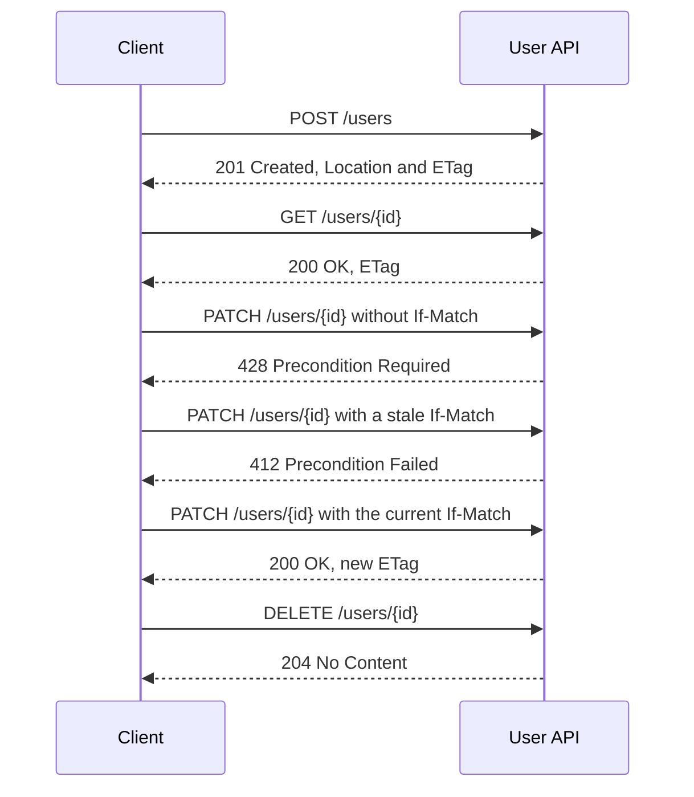

In a production system, replace the in-memory dictionary with a transactional persistence layer and ensure that the version check and update happen atomically.

---

# 23. REST Maturity and Hypermedia

The Richardson Maturity Model is often used to discuss increasingly REST-oriented API design.

```text
Level 0: One URI, usually one method
Level 1: Multiple resource URIs
Level 2: Resource URIs + correct HTTP methods/status codes
Level 3: Hypermedia controls
```

Example progression:

### Level 0

```http
POST /api
{
  "operation": "getUser",
  "userId": 42
}
```

### Level 1

```http
POST /users/42
```

### Level 2

```http
GET /users/42
```

```http
HTTP/1.1 200 OK
```

### Level 3

```json
{
  "id": "42",
  "status": "active",
  "_links": {
    "self": {
      "href": "/users/42"
    },
    "orders": {
      "href": "/users/42/orders"
    },
    "deactivation": {
      "href": "/users/42/deactivations",
      "method": "POST"
    }
  }
}
```

The maturity model is a learning tool, not the formal definition of REST. REST itself comes from the architectural constraints described by Roy Fielding.

---

# 24. Practical Design Checklist

## Resource design

- Model domain concepts as resources
- Use nouns for resource paths
- Keep URLs stable
- Keep nesting shallow
- Use query parameters for collection controls
- Model meaningful business operations explicitly

## Method semantics

- Use `GET` only for safe retrieval
- Use `POST` for creation or unsafe processing
- Use `PUT` for replacement at a known URI
- Use `PATCH` for partial modification
- Treat `DELETE` as idempotent by intended effect
- Consider retry behavior before selecting a method
- Use `QUERY` only after verifying infrastructure support

## Status codes

- Return `201` for resource creation
- Return `202` for accepted asynchronous processing
- Return `204` only when no response content is needed
- Distinguish `401` from `403`
- Use `404` for missing or intentionally hidden resources
- Use `409` for current-state conflicts
- Use `412` for failed request preconditions
- Use `415` for unsupported request media type
- Use `422` for semantically invalid content
- Use `429` for rate limiting
- Use precise `5xx` codes for gateway and availability failures

## Representations and errors

- Set the correct `Content-Type`
- Support `Accept` where multiple representations exist
- Use a consistent error format
- Prefer RFC 9457 Problem Details
- Use stable machine-readable error identifiers
- Include correlation identifiers
- Do not expose internal exception details

## Reliability and performance

- Define timeout and retry behavior
- Retry unsafe methods only with protection
- Use idempotency keys for duplicate-sensitive POST operations
- Use ETags for cache validation and concurrency
- Add explicit cache directives
- Provide polling or callback semantics for asynchronous operations
- Enforce authorization at the resource level

---

# 25. Quick Revision Summary

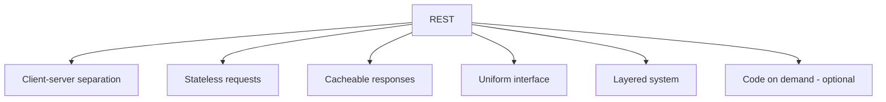

```text
Core resource methods
GET     -> retrieve
POST    -> create or process
PUT     -> create/replace at known URI
PATCH   -> partially modify
DELETE  -> remove
HEAD    -> GET-like metadata without content
OPTIONS -> communication options
QUERY   -> safe body-based query, where supported
```

```text
Method properties
Safe:
GET, HEAD, OPTIONS, TRACE, QUERY

Idempotent:
GET, HEAD, PUT, DELETE, OPTIONS, TRACE, QUERY

Not idempotent by default:
POST, PATCH
```

```text
Most-used success codes
200 -> successful response with content
201 -> resource created
202 -> accepted for later processing
204 -> successful, no content
206 -> partial range response
```

```text
Most-used client error codes
400 -> malformed or generally invalid request
401 -> authentication missing or invalid
403 -> authenticated but forbidden
404 -> resource missing or hidden
405 -> method not allowed
409 -> current-state conflict
412 -> precondition failed
413 -> request content too large
415 -> unsupported request media type
422 -> semantically invalid content
428 -> conditional request required
429 -> rate limit exceeded
```

```text
Most-used server error codes
500 -> unexpected internal failure
502 -> invalid upstream response
503 -> temporarily unavailable
504 -> upstream timeout
```

```text
Important comparisons
401 vs 403 -> authentication vs authorization
400 vs 422 -> malformed request vs semantic validation
404 vs 410 -> missing/unknown vs intentionally gone
405 vs 501 -> method disallowed here vs method not implemented
409 vs 412 -> domain/state conflict vs explicit condition failed
415 vs 406 -> cannot consume request vs cannot produce response
301/302 vs 307/308 -> method may change vs method preserved
200 vs 201 vs 202 vs 204 -> returned vs created vs queued vs no content
```

A well-designed REST API makes the meaning of every interaction visible through:

```text
Resource URI + HTTP method + headers + status code + representation
```

---

# 26. References

The guide uses the following authoritative sources:

1. [Roy Fielding — Representational State Transfer architectural style](https://ics.uci.edu/~fielding/pubs/dissertation/rest_arch_style.htm)
2. [RFC 9110 — HTTP Semantics](https://www.rfc-editor.org/rfc/rfc9110.html)
3. [RFC 9111 — HTTP Caching](https://www.rfc-editor.org/rfc/rfc9111.html)
4. [RFC 5789 — PATCH Method for HTTP](https://www.rfc-editor.org/rfc/rfc5789.html)
5. [RFC 6585 — Additional HTTP Status Codes](https://www.rfc-editor.org/rfc/rfc6585.html)
6. [RFC 9457 — Problem Details for HTTP APIs](https://www.rfc-editor.org/rfc/rfc9457.html)
7. [RFC 10008 — The HTTP QUERY Method](https://www.rfc-editor.org/rfc/rfc10008.html)
8. [IANA HTTP Method Registry](https://www.iana.org/assignments/http-methods/)
9. [IANA HTTP Status Code Registry](https://www.iana.org/assignments/http-status-codes/)

> **Current standards note:** The IANA HTTP Method Registry listed `QUERY` as a safe and idempotent method after RFC 10008 was published in 2026. The IANA status-code registry also currently contains temporary code `104 Upload Resumption Supported`; it is an experimental temporary registration rather than a normal application API status choice.

---
