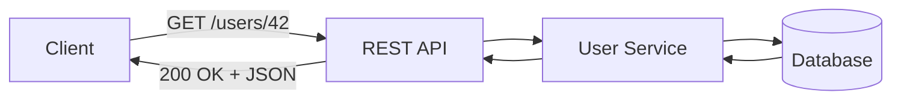
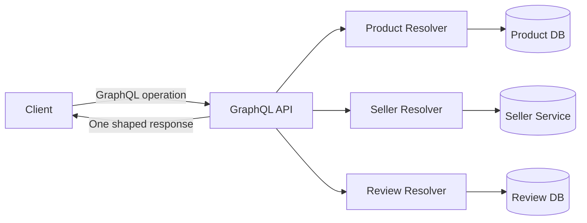
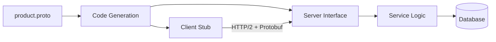
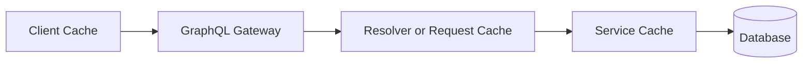
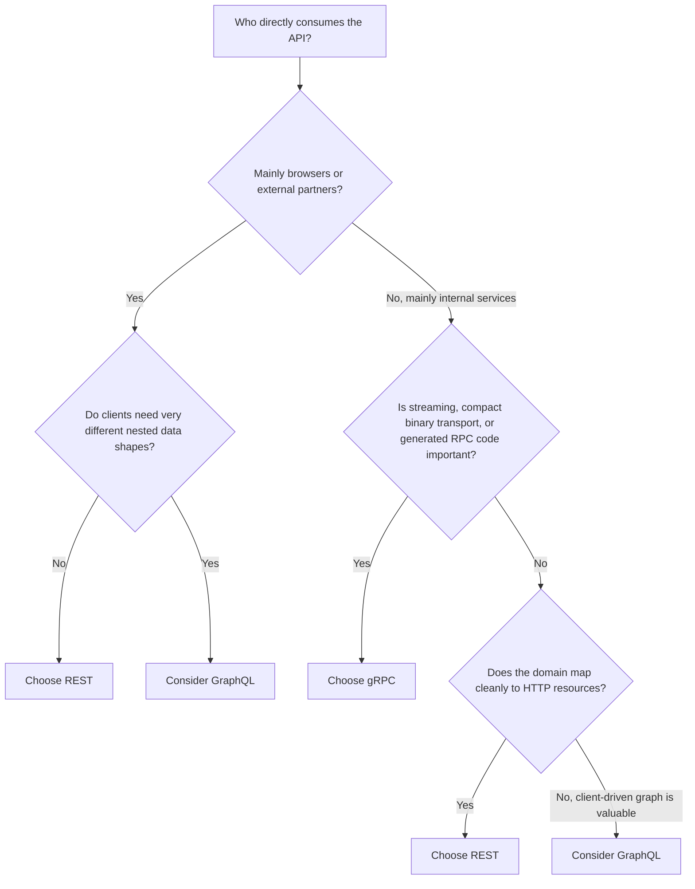
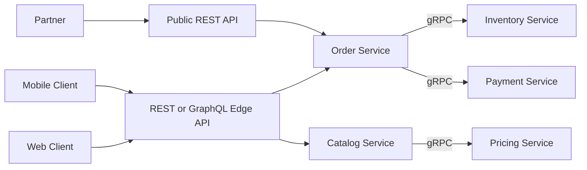

# REST vs GraphQL vs gRPC: Trade-offs and Selection Guide

> **Topic:** API Design & REST  
> **Audience:** Developers with 3+ years of experience  
> **Last reviewed:** July 2026  
> **Goal:** Understand how REST, GraphQL, and gRPC differ, where each fits, and how to choose between them in production systems.

---

## Index

1. [The Most Important Distinction](#1-the-most-important-distinction)
2. [High-Level Comparison](#2-high-level-comparison)
3. [REST](#3-rest)
   - [How REST Works](#31-how-rest-works)
   - [REST Example](#32-rest-example)
   - [Strengths](#33-rest-strengths)
   - [Trade-offs](#34-rest-trade-offs)
4. [GraphQL](#4-graphql)
   - [How GraphQL Works](#41-how-graphql-works)
   - [GraphQL Example](#42-graphql-example)
   - [Strengths](#43-graphql-strengths)
   - [Trade-offs](#44-graphql-trade-offs)
5. [gRPC](#5-grpc)
   - [How gRPC Works](#51-how-grpc-works)
   - [gRPC Example](#52-grpc-example)
   - [RPC Communication Types](#53-grpc-communication-types)
   - [Strengths](#54-grpc-strengths)
   - [Trade-offs](#55-grpc-trade-offs)
6. [Same Requirement Implemented Three Ways](#6-same-requirement-implemented-three-ways)
7. [Detailed Trade-off Comparison](#7-detailed-trade-off-comparison)
8. [Performance: What Actually Matters](#8-performance-what-actually-matters)
9. [Caching](#9-caching)
10. [API Evolution and Versioning](#10-api-evolution-and-versioning)
11. [Security and Authorization](#11-security-and-authorization)
12. [Error Handling](#12-error-handling)
13. [Observability and Debugging](#13-observability-and-debugging)
14. [When to Choose Each Approach](#14-when-to-choose-each-approach)
15. [Decision Tree](#15-decision-tree)
16. [Hybrid Architecture](#16-hybrid-architecture)
17. [Production Best Practices](#17-production-best-practices)
18. [Interview-Ready Summary](#18-interview-ready-summary)
19. [Official References](#19-official-references)

---

# 1. The Most Important Distinction

REST, GraphQL, and gRPC solve similar communication problems, but they are not exactly the same kind of technology.

| Technology | What it is | Main mental model |
|---|---|---|
| **REST** | An architectural style, commonly implemented over HTTP | Resources and representations |
| **GraphQL** | A query language, type system, and runtime for APIs | Clients request a graph-shaped selection of fields |
| **gRPC** | A high-performance Remote Procedure Call framework | Clients invoke strongly typed remote methods |

A useful way to remember them is:

```text
REST     → "Which resource do I want?"
GraphQL  → "Which exact fields do I want?"
gRPC     → "Which remote method do I want to call?"
```

This distinction is important because comparing them only by speed misses the larger architectural trade-offs.

---

# 2. High-Level Comparison

| Area | REST | GraphQL | gRPC |
|---|---|---|---|
| API style | Resource-oriented | Query-oriented | Procedure-oriented |
| Typical transport | HTTP | Usually HTTP | HTTP/2 for native gRPC |
| Common payload | JSON | JSON response | Protocol Buffers binary |
| Contract | OpenAPI is commonly used | GraphQL schema | `.proto` service definition |
| Client flexibility | Server defines response shape | Client selects response fields | Method contract defines request and response |
| Browser support | Excellent | Excellent | Native browser support is less direct |
| Human readability | High | High | Low on the wire |
| Code generation | Optional | Optional but common | Core part of normal usage |
| Streaming | Usually SSE, WebSocket, or chunked HTTP | Subscriptions or incremental delivery mechanisms | Native unary and streaming RPC types |
| HTTP caching | Natural and mature | Possible, but less automatic | Usually application or infrastructure managed |
| Public API suitability | Excellent | Good for suitable client-driven domains | Usually weaker |
| Internal microservices | Good | Sometimes useful | Excellent |
| Learning and operational complexity | Low to medium | Medium to high | Medium |
| Best default choice | General HTTP APIs | Complex client data requirements | Internal, strongly typed, low-latency communication |

> **Practical default:** Start with REST for a normal public or business API. Choose GraphQL when clients genuinely need flexible graph-shaped data. Choose gRPC when internal service-to-service communication benefits from strict contracts, code generation, streaming, or compact binary messages.

---

# 3. REST

## 3.1 How REST Works

REST models the system as **resources**. Each resource is identified by a URI, and standard HTTP methods express the intended operation.



Typical resource operations:

```http
GET    /users/42
POST   /users
PUT    /users/42
PATCH  /users/42
DELETE /users/42
```

REST benefits from existing HTTP semantics:

- Methods such as `GET`, `POST`, `PUT`, `PATCH`, and `DELETE`
- Status codes such as `200`, `201`, `204`, `400`, `404`, and `409`
- Headers for caching, authentication, content negotiation, and conditional requests
- Standard infrastructure such as browsers, proxies, CDNs, API gateways, and monitoring tools

Strict REST includes architectural constraints such as stateless communication, a uniform interface, cacheability, layered systems, and client-server separation.

In everyday development, the term **REST API** is often also used for pragmatic resource-oriented HTTP/JSON APIs, even when they do not implement every REST constraint, such as hypermedia controls.

---

## 3.2 REST Example

Assume a product page needs product information, seller information, and reviews.

### Request 1: Product

```http
GET /api/products/101
Accept: application/json
```

```json
{
  "id": 101,
  "name": "Mechanical Keyboard",
  "price": 7999,
  "seller_id": 8,
  "description": "Wireless mechanical keyboard",
  "created_at": "2026-07-01T10:00:00Z"
}
```

### Request 2: Seller

```http
GET /api/sellers/8
```

### Request 3: Reviews

```http
GET /api/products/101/reviews?limit=5
```

The API is predictable, but the client may need several requests unless the server provides a purpose-built endpoint or supports field expansion.

For example:

```http
GET /api/products/101?include=seller,reviews
```

---

## 3.3 REST Strengths

### Simple and widely understood

REST maps naturally to HTTP and is familiar to frontend, backend, mobile, QA, DevOps, and integration teams.

### Strong web ecosystem compatibility

REST works naturally with:

- Browsers
- Reverse proxies
- CDNs
- API gateways
- Load balancers
- HTTP monitoring tools
- Standard authentication mechanisms
- OpenAPI-based documentation and client generation

### Straightforward caching

A resource response can use standard HTTP caching:

```http
Cache-Control: public, max-age=300
ETag: "product-101-v7"
```

The client can later make a conditional request:

```http
If-None-Match: "product-101-v7"
```

The server may return:

```http
304 Not Modified
```

### Clear operational visibility

Routes such as these are easy to identify in logs and metrics:

```text
GET /products/{id}
POST /orders
PATCH /users/{id}
```

### Good public API experience

External consumers can test REST APIs using a browser, `curl`, Postman, or standard HTTP libraries without requiring generated code.

---

## 3.4 REST Trade-offs

### Over-fetching

The server may return fields the client does not need.

```json
{
  "id": 101,
  "name": "Mechanical Keyboard",
  "price": 7999,
  "description": "...",
  "inventory": 83,
  "created_at": "...",
  "updated_at": "...",
  "internal_category_code": "KB-MECH"
}
```

A mobile list may only need:

```json
{
  "id": 101,
  "name": "Mechanical Keyboard",
  "price": 7999
}
```

### Under-fetching and multiple round trips

A screen may require calls to product, seller, inventory, and review endpoints.

### Endpoint growth

Different clients may need different views:

```text
/products/{id}
/products/{id}/details
/mobile/products/{id}
/admin/products/{id}
/products/{id}?include=seller,reviews
```

This can lead to many specialized endpoints if the resource model is not designed carefully.

### Contract strictness is optional

REST does not automatically enforce a machine-readable schema. OpenAPI can provide a strong contract, but the team must maintain it correctly.

---

# 4. GraphQL

## 4.1 How GraphQL Works

GraphQL exposes a **typed schema**. The client sends an operation containing the exact fields it needs.



A GraphQL schema describes available object types and operations.

```graphql
type Product {
  id: ID!
  name: String!
  price: Int!
  seller: Seller!
  reviews(limit: Int = 5): [Review!]!
}

type Seller {
  id: ID!
  name: String!
}

type Review {
  id: ID!
  rating: Int!
  comment: String
}

type Query {
  product(id: ID!): Product
}
```

The main operation types are:

- **Query** — reads data
- **Mutation** — changes data
- **Subscription** — receives event-driven updates

---

## 4.2 GraphQL Example

```graphql
query ProductPage($id: ID!) {
  product(id: $id) {
    id
    name
    price
    seller {
      name
    }
    reviews(limit: 5) {
      rating
      comment
    }
  }
}
```

Variables:

```json
{
  "id": "101"
}
```

Response:

```json
{
  "data": {
    "product": {
      "id": "101",
      "name": "Mechanical Keyboard",
      "price": 7999,
      "seller": {
        "name": "Tech Store"
      },
      "reviews": [
        {
          "rating": 5,
          "comment": "Excellent keyboard"
        }
      ]
    }
  }
}
```

The client receives one response shaped like its query.

---

## 4.3 GraphQL Strengths

### Clients request only required fields

This is useful when web, mobile, tablet, partner, and admin clients need different representations of the same domain data.

### Strong typed schema

The schema supports:

- Validation before execution
- Introspection
- IDE autocomplete
- Documentation
- Type-safe client generation
- Controlled schema evolution

### Efficient aggregation for UI screens

A GraphQL layer can combine data from several services:

```text
Product Service
Inventory Service
Seller Service
Review Service
        │
        ▼
    GraphQL API
        │
        ▼
 Web / Mobile / Admin
```

### Fewer endpoint-specific response models

Instead of creating many endpoints for different screens, clients can select the fields required for each use case.

### Good developer experience

Tools can inspect the schema and provide field documentation, validation, autocomplete, and generated types.

---

## 4.4 GraphQL Trade-offs

### Server execution is more complex

A simple-looking query can trigger many backend operations.

```graphql
query {
  products {
    seller {
      address {
        country {
          taxRules {
            rate
          }
        }
      }
    }
  }
}
```

The server must control:

- Query depth
- Query complexity or cost
- Pagination limits
- Timeouts
- Resolver execution
- Backend fan-out
- Authorization

### N+1 query problem

Consider:

```graphql
query {
  products {
    id
    seller {
      name
    }
  }
}
```

A poor implementation may execute:

```text
1 query to load 100 products
100 additional queries to load each seller
--------------------------------------------
101 database queries
```

A batching mechanism such as DataLoader can reduce this to:

```text
1 query to load products
1 batched query to load sellers
--------------------------------
2 database queries
```

### HTTP caching is less natural

Many GraphQL APIs use one HTTP endpoint:

```http
POST /graphql
```

Standard caches cannot identify resource semantics as directly as they can with:

```http
GET /products/101
```

GraphQL clients often use normalized client-side caching, persisted operations, or application-aware edge caching instead.

### Authorization can become field-level

Checking only the top-level operation is not enough.

```graphql
query {
  employee(id: "42") {
    name
    salary
  }
}
```

The user may be allowed to view `name` but not `salary`. Authorization must be applied at the correct business or field boundary.

### Monitoring requires operation awareness

A dashboard that only shows:

```text
POST /graphql
```

is not very useful. Metrics should include:

- Operation name
- Operation type
- Resolver timings
- Query complexity
- Error path
- Backend dependency timings

### File transfer is not its core strength

Large file uploads and downloads are usually better handled through dedicated HTTP endpoints or object-storage signed URLs, while GraphQL manages metadata and workflow state.

---

# 5. gRPC

## 5.1 How gRPC Works

gRPC uses a contract, normally defined using Protocol Buffers. The contract describes services, methods, and message types.

The Protocol Buffer compiler generates client and server code for supported languages.



The calling code appears similar to a local method call:

```python
response = product_client.GetProduct(
    GetProductRequest(product_id=101)
)
```

However, it is still a network call and must be treated as one:

- It can time out
- It can fail
- It can be retried incorrectly
- It can return partial or unavailable results
- It needs authentication and observability

---

## 5.2 gRPC Example

```protobuf
syntax = "proto3";

package catalog.v1;

service ProductService {
  rpc GetProduct(GetProductRequest) returns (GetProductResponse);
}

message GetProductRequest {
  int64 product_id = 1;
}

message GetProductResponse {
  Product product = 1;
}

message Product {
  int64 id = 1;
  string name = 2;
  int64 price_in_minor_units = 3;
  Seller seller = 4;
  repeated Review reviews = 5;
}

message Seller {
  int64 id = 1;
  string name = 2;
}

message Review {
  int64 id = 1;
  int32 rating = 2;
  string comment = 3;
}
```

Python-like client usage:

```python
request = GetProductRequest(product_id=101)

response = stub.GetProduct(
    request,
    timeout=0.5,
)

print(response.product.name)
```

The generated code provides strongly typed request and response objects.

---

## 5.3 gRPC Communication Types

gRPC supports four RPC patterns.

### Unary RPC

One request and one response.

```text
Client ───── Request ─────> Server
Client <──── Response ───── Server
```

```protobuf
rpc GetProduct(GetProductRequest) returns (GetProductResponse);
```

### Server-streaming RPC

One request and a stream of responses.

```text
Client ───── Request ─────> Server
Client <──── Event 1 ────── Server
Client <──── Event 2 ────── Server
Client <──── Event 3 ────── Server
```

```protobuf
rpc WatchInventory(WatchInventoryRequest)
    returns (stream InventoryUpdate);
```

### Client-streaming RPC

A stream of requests and one response.

```text
Client ───── Chunk 1 ─────> Server
Client ───── Chunk 2 ─────> Server
Client ───── Chunk 3 ─────> Server
Client <──── Summary ────── Server
```

```protobuf
rpc UploadReadings(stream SensorReading)
    returns (UploadSummary);
```

### Bidirectional-streaming RPC

Both sides send streams independently.

```text
Client ───── Message A ───> Server
Client <──── Message B ──── Server
Client ───── Message C ───> Server
Client <──── Message D ──── Server
```

```protobuf
rpc Chat(stream ChatMessage)
    returns (stream ChatMessage);
```

---

## 5.4 gRPC Strengths

### Compact binary serialization

Protocol Buffers usually produce smaller payloads than verbose JSON for structured data.

### Strong contracts and generated code

The `.proto` file acts as an interface definition. Code generation reduces manual serialization code and catches many contract mismatches during development.

### Excellent service-to-service communication

gRPC is well suited for:

- Microservice calls
- Internal platform APIs
- Polyglot systems
- Low-latency communication
- High request volume
- Streaming data
- Long-lived connections

### Streaming is built into the API model

Streaming is not an additional convention layered on top of the basic API design. It is represented directly in the service definition.

### Explicit deadlines and cancellation

A client can define how long it is willing to wait.

```python
response = stub.GetProduct(request, timeout=0.5)
```

This is especially important in microservice call chains.

```text
API Gateway
    │ 1000 ms total budget
    ▼
Order Service
    │ 300 ms budget
    ├────────> Inventory Service
    │ 200 ms budget
    └────────> Payment Service
```

Without deadlines, slow downstream calls can consume threads, connections, memory, and the caller's entire latency budget.

---

## 5.5 gRPC Trade-offs

### Native browser usage is less direct

Browsers do not generally consume native gRPC in the same simple way they consume JSON over HTTP. Browser-facing systems commonly use:

- gRPC-Web
- A compatible proxy
- An API gateway
- HTTP/JSON transcoding
- A REST or GraphQL edge layer

### Payloads are not easily human-readable

A JSON response is easy to inspect:

```json
{"id": 101, "name": "Keyboard"}
```

A binary Protocol Buffer message normally requires the schema and tooling to decode.

### Generated-code workflow

Consumers generally need the contract and generated client code. This is excellent for controlled internal systems but may add friction for external API consumers.

### Tighter schema discipline

Protobuf evolution requires rules such as:

- Never change an existing field number
- Never reuse a deleted field number
- Reserve deleted field numbers and names
- Prefer additive changes
- Coordinate semantic changes carefully

### Infrastructure awareness

Proxies, load balancers, gateways, health checks, observability systems, and service meshes must be configured correctly for gRPC and HTTP/2 behavior.

### RPC can hide network boundaries

Generated stubs make remote calls look like normal methods. Developers must still design for latency, retries, deadlines, cancellation, and partial failure.

---

# 6. Same Requirement Implemented Three Ways

## Requirement

Fetch the following product-page data:

- Product ID, name, and price
- Seller name
- Five recent reviews

---

## REST

```http
GET /products/101
GET /sellers/8
GET /products/101/reviews?limit=5
```

Or a purpose-built expanded resource:

```http
GET /products/101?include=seller,reviews&review_limit=5
```

### Control

The server controls the supported resource representations.

---

## GraphQL

```graphql
query ProductPage {
  product(id: "101") {
    id
    name
    price
    seller {
      name
    }
    reviews(limit: 5) {
      rating
      comment
    }
  }
}
```

### Control

The schema defines what is possible, while the client selects the required fields.

---

## gRPC

```protobuf
rpc GetProductPage(GetProductPageRequest)
    returns (GetProductPageResponse);
```

```python
response = stub.GetProductPage(
    GetProductPageRequest(
        product_id=101,
        review_limit=5,
    ),
    timeout=0.5,
)
```

### Control

The service method defines the exact request and response contract.

---

# 7. Detailed Trade-off Comparison

| Concern | REST | GraphQL | gRPC |
|---|---|---|---|
| Basic abstraction | Resources | Fields in a typed graph | Remote service methods |
| URL model | Multiple resource URLs | Commonly one GraphQL endpoint | Service and method names |
| Response shape | Server-defined | Client-selected | Contract-defined |
| Typical encoding | JSON | JSON | Protocol Buffers |
| Schema | Optional; OpenAPI commonly used | Required GraphQL schema | Required `.proto` contract in normal usage |
| Type safety | Depends on tooling | Strong schema; generated client types possible | Strong generated request/response types |
| Over-fetching | Possible | Reduced through field selection | Avoided through purpose-built messages |
| Under-fetching | May require multiple calls | Often reduced | Usually solved through method design |
| HTTP caching | Excellent | Less direct | Not resource-cache oriented |
| Browser support | Native | Native over HTTP | Usually needs gRPC-Web or a gateway |
| Streaming | Separate HTTP mechanisms | Subscriptions or incremental mechanisms | First-class RPC streaming |
| Debugging by eye | Easy | Easy for operations and JSON | Requires tooling |
| Public API | Excellent | Good for selected use cases | Less convenient |
| Internal microservices | Good | Domain-dependent | Excellent |
| Mobile bandwidth | Good with careful design | Good field selection | Efficient binary messages |
| API discoverability | Documentation/OpenAPI | Introspection and schema tooling | Service descriptors and generated docs/tooling |
| Error model | HTTP status + body | Operation result may contain data and errors | gRPC status + structured details |
| Versioning style | URL, header, media type, or additive evolution | Schema evolution and deprecation | Package/service versions plus wire-compatible evolution |
| Operational complexity | Low to medium | Medium to high | Medium |
| Risk area | Endpoint sprawl | Query and resolver complexity | Contract and infrastructure discipline |

---

# 8. Performance: What Actually Matters

It is common to hear:

```text
gRPC is fastest.
GraphQL avoids extra requests.
REST is slow.
```

These statements are too simplistic.

Overall latency is closer to:

```text
Total latency =
    network latency
  + connection overhead
  + gateway processing
  + authentication
  + application processing
  + database queries
  + downstream calls
  + serialization
  + payload transfer
```

Serialization may be only one part of the total.

---

## REST Performance Profile

REST can be highly efficient when:

- Responses are cacheable
- Endpoints match common client use cases
- Payloads are paginated
- Compression is enabled
- HTTP connections are reused
- Database access is optimized
- CDN caching is available

A cached REST response served from an edge location may outperform an uncached GraphQL operation or gRPC call that reaches several backend services.

---

## GraphQL Performance Profile

GraphQL can reduce client round trips and unnecessary fields, but server work can increase because a single request may fan out to many resolvers.

```text
One client request
      │
      ├── Product DB
      ├── Seller Service
      ├── Inventory Service
      └── Review Service
```

Therefore:

```text
Fewer HTTP requests ≠ automatically less backend work
```

Use:

- Batching
- Request-scoped caching
- Pagination
- Query-cost limits
- DataLoader-style patterns
- Resolver timing metrics
- Persisted operations for controlled clients

---

## gRPC Performance Profile

gRPC can perform well because of:

- Compact Protocol Buffer encoding
- HTTP/2 multiplexing
- Connection reuse
- Generated serialization code
- Streaming support
- Smaller message overhead in many workloads

However, poor service boundaries can still create a slow system:

```text
Service A → Service B → Service C → Service D → Database
```

A chain of fast individual RPCs may still have high total latency and a larger failure surface.

> **Main lesson:** Choose an API style based on communication patterns and operational needs. Validate performance with realistic load tests rather than assumptions.

---

# 9. Caching

## REST Caching

REST aligns naturally with HTTP resource caching.

```http
GET /products/101
Cache-Control: public, max-age=300
ETag: "v7"
```

Suitable for:

- Product catalog data
- Public content
- Configuration
- Static metadata
- Versioned resources

---

## GraphQL Caching

GraphQL commonly uses several cache layers:



Common approaches:

- Normalized client cache using entity IDs
- Request-scoped resolver caching
- DataLoader batching and caching
- Persisted operations
- CDN caching for known persisted GET operations
- Backend cache per service or entity

The main challenge is that arbitrary queries do not map as naturally to one URL per resource.

---

## gRPC Caching

gRPC does not naturally expose HTTP resource caching semantics.

Caching is usually implemented using:

- Application-level caches
- Redis or in-memory caches
- Service mesh or gateway features
- Read-through service logic
- Request coalescing
- Materialized views

Avoid hiding incorrect caching behind RPC methods. Cache keys must include every input that affects the response.

---

# 10. API Evolution and Versioning

## REST Evolution

Common strategies:

```text
/api/v1/products/101
/api/v2/products/101
```

Or versioning through headers or media types.

Good REST evolution prefers additive, backward-compatible changes:

```json
{
  "id": 101,
  "name": "Keyboard",
  "currency": "INR"
}
```

Adding `currency` is usually safer than renaming or removing `name`.

OpenAPI can define and communicate the HTTP API contract. As of July 2026, the OpenAPI Initiative lists OpenAPI Specification 3.2.0 as a published version.

---

## GraphQL Evolution

GraphQL usually evolves one schema rather than versioning the whole API.

A field may be deprecated:

```graphql
type Product {
  id: ID!
  oldPrice: Int @deprecated(reason: "Use price")
  price: Money!
}
```

Typical process:

```text
Add new field
    ↓
Migrate clients
    ↓
Monitor old-field usage
    ↓
Deprecate old field
    ↓
Remove it only after consumers are ready
```

Be careful when changing nullability:

```graphql
name: String
```

to:

```graphql
name: String!
```

or the reverse. Nullability is part of the contract and can affect generated clients and runtime behavior.

---

## gRPC Evolution

Protocol Buffers support compatible evolution when rules are followed.

Safe additive example:

```protobuf
message Product {
  int64 id = 1;
  string name = 2;
  string currency = 3;
}
```

When deleting a field:

```protobuf
message Product {
  int64 id = 1;
  string name = 2;

  reserved 3;
  reserved "currency";
}
```

Never reuse field number `3` for a different meaning.

For major API generations, packages can make the version explicit:

```protobuf
package catalog.v1;
```

Later:

```protobuf
package catalog.v2;
```

---

# 11. Security and Authorization

## REST

Authorization is often attached to routes and resources.

```text
GET /users/{id}
PATCH /users/{id}
DELETE /users/{id}
```

Checks may include:

- Is the requester authenticated?
- Does the requester own the resource?
- Does the requester have the required role or permission?
- Is the operation allowed for the resource's current state?

Do not rely only on route-level roles. Object-level authorization is still required.

---

## GraphQL

GraphQL needs authorization at the business-data boundary.

```graphql
query {
  account(id: "42") {
    profile {
      name
    }
    paymentMethods {
      lastFourDigits
    }
  }
}
```

Possible permissions differ by field.

A secure design applies authorization through:

- Domain services
- Resolver policies
- Field-level checks where required
- Tenant filters
- Object ownership checks
- Query-cost and depth limits
- Pagination limits
- Introspection policy appropriate to the environment

Do not assume that hiding a field from the frontend prevents a client from requesting it.

---

## gRPC

gRPC authentication and authorization commonly use:

- TLS
- Mutual TLS for trusted service identities
- Tokens or credentials carried through metadata
- Interceptors for cross-cutting checks
- Service-to-service identity
- Method-level authorization
- Resource-level authorization inside business logic

Example conceptual metadata:

```text
authorization: Bearer <token>
x-request-id: 9b7...
```

Internal traffic should not be considered trusted merely because it is inside a private network.

---

# 12. Error Handling

## REST

REST normally combines an HTTP status code with a structured body.

```http
HTTP/1.1 404 Not Found
Content-Type: application/problem+json
```

```json
{
  "type": "https://example.com/problems/product-not-found",
  "title": "Product not found",
  "status": 404,
  "detail": "Product 101 does not exist",
  "instance": "/products/101"
}
```

Useful status examples:

| Status | Meaning |
|---|---|
| `400` | Invalid request |
| `401` | Authentication required or invalid |
| `403` | Authenticated but not permitted |
| `404` | Resource not found |
| `409` | State or uniqueness conflict |
| `422` | Semantically invalid input |
| `429` | Rate limit exceeded |
| `500` | Unexpected server failure |
| `503` | Service temporarily unavailable |

---

## GraphQL

GraphQL responses may contain:

- `data`
- `errors`
- Both partial `data` and `errors`

```json
{
  "data": {
    "product": {
      "name": "Keyboard",
      "seller": null
    }
  },
  "errors": [
    {
      "message": "Seller service unavailable",
      "path": ["product", "seller"],
      "extensions": {
        "code": "SELLER_UNAVAILABLE"
      }
    }
  ]
}
```

Clients must not treat every successful HTTP response as a fully successful operation. They should inspect the GraphQL result.

Avoid exposing stack traces, SQL details, internal hostnames, or sensitive resolver errors.

---

## gRPC

gRPC uses status codes such as:

```text
OK
INVALID_ARGUMENT
NOT_FOUND
ALREADY_EXISTS
PERMISSION_DENIED
UNAUTHENTICATED
RESOURCE_EXHAUSTED
FAILED_PRECONDITION
UNAVAILABLE
DEADLINE_EXCEEDED
INTERNAL
```

Example mapping:

| Domain condition | gRPC status |
|---|---|
| Product does not exist | `NOT_FOUND` |
| Invalid product ID | `INVALID_ARGUMENT` |
| Duplicate code | `ALREADY_EXISTS` |
| User lacks access | `PERMISSION_DENIED` |
| Dependency temporarily unavailable | `UNAVAILABLE` |
| Time budget exhausted | `DEADLINE_EXCEEDED` |

Do not return `INTERNAL` for every failure. Accurate status codes improve retries, alerts, dashboards, and client behavior.

---

# 13. Observability and Debugging

## REST

Useful metric dimensions:

```text
method=GET
route=/products/{id}
status=200
duration_ms=42
```

Do not use raw IDs as metric labels because that creates high-cardinality metrics.

---

## GraphQL

Useful dimensions:

```text
operation_name=ProductPage
operation_type=query
complexity=37
duration_ms=86
error_path=product.seller
```

Also monitor:

- Resolver duration
- Resolver call count
- Backend fan-out
- N+1 patterns
- Query depth
- Persisted operation ID
- Error codes

Require meaningful operation names in production clients:

```graphql
query ProductPage {
  ...
}
```

Avoid anonymous operations for important production traffic.

---

## gRPC

Useful dimensions:

```text
service=catalog.v1.ProductService
method=GetProduct
grpc_status=OK
duration_ms=18
deadline_ms=500
```

Also trace:

- Client and server spans
- Retries
- Deadline propagation
- Message size
- Stream lifetime
- Cancellation
- Downstream method calls

Use correlation or trace identifiers across API gateways, services, message brokers, and databases.

---

# 14. When to Choose Each Approach

## Choose REST When

- You need a public or partner-facing API
- Browser compatibility matters
- Standard HTTP caching provides real value
- The domain maps cleanly to resources
- Consumers prefer simple HTTP and JSON
- CRUD-style operations are common
- Your team needs low operational complexity
- OpenAPI documentation and gateway support are important

Typical examples:

```text
Payment API
User management API
Order management API
Public product catalog
Partner integration API
File upload and download API
```

---

## Choose GraphQL When

- Several clients require different data shapes
- UI screens aggregate many related entities
- Clients frequently suffer from over-fetching or under-fetching
- The product changes faster than endpoint-specific APIs can comfortably support
- A typed, discoverable schema improves client productivity
- The team can operate resolver performance, query limits, and field-level authorization

Typical examples:

```text
E-commerce storefront
Social application
Analytics dashboard
Content platform
Multi-platform consumer product
Backend for frontend
```

Avoid choosing GraphQL only because it is popular. A simple CRUD service may become unnecessarily complex.

---

## Choose gRPC When

- Communication is primarily internal
- Services are owned by controlled engineering teams
- Strong contracts and generated clients are valuable
- Multiple programming languages must communicate safely
- Low overhead matters at high volume
- Streaming is a core requirement
- Deadlines and cancellation must be standardized
- Browser clients are not the primary direct consumers

Typical examples:

```text
Internal microservices
Real-time telemetry
Machine-learning inference service
Media processing pipeline
Trading or pricing service
Device communication
High-throughput platform service
```

Avoid exposing native gRPC directly as the only interface for broad third-party consumers unless those consumers are prepared for its tooling and contract workflow.

---

# 15. Decision Tree



A compact decision checklist:

```text
Need easy public consumption?              → REST
Need strong HTTP caching?                  → REST
Need client-selected nested fields?        → GraphQL
Need one UI API over multiple services?    → GraphQL
Need native streaming RPC?                 → gRPC
Need generated cross-language contracts?   → gRPC
Need internal high-volume communication?   → gRPC
Unsure and requirements are ordinary?      → REST
```

---

# 16. Hybrid Architecture

Real systems often use more than one API style.



A common architecture is:

```text
External consumers  → REST
Frontend applications → GraphQL BFF
Internal services   → gRPC
```

This is not a rule, but it reflects the strengths of each approach.

### Example

An e-commerce platform may use:

- REST for payment-provider webhooks
- REST for public partner APIs
- GraphQL for storefront and mobile screens
- gRPC between order, inventory, pricing, and fraud services
- Object storage signed URLs for large media uploads

The correct design is often **REST and GraphQL and gRPC**, each at an appropriate boundary.

---

# 17. Production Best Practices

## REST Best Practices

- Model stable business resources rather than database tables
- Use HTTP methods and status codes consistently
- Make retryable operations idempotent where appropriate
- Paginate collection endpoints
- Support filtering and sorting intentionally
- Use `ETag`, `Cache-Control`, and conditional requests where useful
- Publish and validate an OpenAPI contract
- Use structured error responses
- Apply object-level authorization
- Avoid exposing internal database IDs or fields without considering the contract

---

## GraphQL Best Practices

- Design the schema around the domain, not database tables
- Require pagination for large lists
- Use batching to prevent N+1 queries
- Enforce query-depth, complexity, and size limits
- Apply authorization at the correct field or domain-service level
- Use operation names
- Monitor resolver and downstream timings
- Deprecate fields before removal
- Use persisted operations for controlled production clients where beneficial
- Keep large binary transfer outside GraphQL
- Avoid creating a giant schema without ownership boundaries

---

## gRPC Best Practices

- Always set and propagate deadlines
- Implement cancellation correctly
- Retry only transient and safe operations
- Do not blindly retry non-idempotent methods
- Keep RPC methods reasonably coarse-grained
- Use TLS or mTLS as appropriate
- Use interceptors for consistent authentication, tracing, and metrics
- Preserve Protobuf field numbers
- Reserve deleted field numbers and names
- Use package versions for major contract generations
- Configure health checking and graceful shutdown
- Test proxies, gateways, load balancers, and service meshes with realistic streams
- Treat every RPC as a network call, not a local method

---

## Cross-Cutting Best Practices

Regardless of API style:

```text
Validate input
Authenticate the caller
Authorize the operation
Apply tenant boundaries
Use timeouts or deadlines
Control retries
Rate-limit abusive traffic
Paginate unbounded collections
Avoid leaking sensitive errors
Trace downstream calls
Document compatibility guarantees
Load-test realistic workflows
```

The protocol does not fix poor domain boundaries, slow database queries, missing indexes, unsafe retries, or weak authorization.

---

# 18. Interview-Ready Summary

## REST

REST is a resource-oriented architectural style that usually uses standard HTTP methods, status codes, headers, and JSON representations. It is the strongest general-purpose default for public APIs, resource-based business services, standard caching, and broad client compatibility.

## GraphQL

GraphQL lets clients request exact fields from a typed schema. It is effective for applications with multiple clients and complex nested data requirements, but it shifts complexity to schema governance, resolver performance, query-cost control, caching strategy, and field-level authorization.

## gRPC

gRPC is a contract-first RPC framework commonly using Protocol Buffers and HTTP/2. It is especially effective for internal service-to-service communication, compact messages, generated clients, deadlines, and streaming, but it is less convenient for direct browser and broad third-party consumption.

## Final Selection Principle

```text
REST:
Optimize for simplicity, HTTP compatibility, caching, and public consumption.

GraphQL:
Optimize for client data flexibility and graph-shaped aggregation.

gRPC:
Optimize for internal contracts, streaming, and efficient service communication.
```

Do not select only by payload speed. Select based on:

- Consumer type
- Data access pattern
- Caching requirements
- Streaming requirements
- Contract ownership
- Browser compatibility
- Operational maturity
- Debugging and observability needs
- Compatibility and versioning strategy

---

# 19. Official References

The following official and standards-based sources were reviewed for this guide:

1. [Roy Fielding — REST Architectural Style](https://roy.gbiv.com/pubs/dissertation/rest_arch_style.htm)
2. [RFC 9110 — HTTP Semantics](https://www.rfc-editor.org/rfc/rfc9110.html)
3. [HTTP Working Group Specifications](https://httpwg.org/specs/)
4. [GraphQL Documentation](https://graphql.org/learn/)
5. [GraphQL Queries](https://graphql.org/learn/queries/)
6. [GraphQL Mutations](https://graphql.org/learn/mutations/)
7. [GraphQL Subscriptions](https://graphql.org/learn/subscriptions/)
8. [GraphQL Schema and Types](https://graphql.org/learn/schema/)
9. [GraphQL over HTTP Working Draft](https://graphql.github.io/graphql-over-http/draft/)
10. [gRPC Introduction](https://grpc.io/docs/what-is-grpc/introduction/)
11. [gRPC Core Concepts](https://grpc.io/docs/what-is-grpc/core-concepts/)
12. [gRPC Performance Best Practices](https://grpc.io/docs/guides/performance/)
13. [Protocol Buffers Language Guide](https://protobuf.dev/programming-guides/proto3/)
14. [Protocol Buffers Best Practices](https://protobuf.dev/best-practices/dos-donts/)
15. [OpenAPI Specification](https://spec.openapis.org/oas/)

---

> **Key takeaway:** REST, GraphQL, and gRPC are not universal replacements for one another. The best architecture uses the simplest approach that correctly matches the consumer, data shape, network pattern, and operational constraints.
