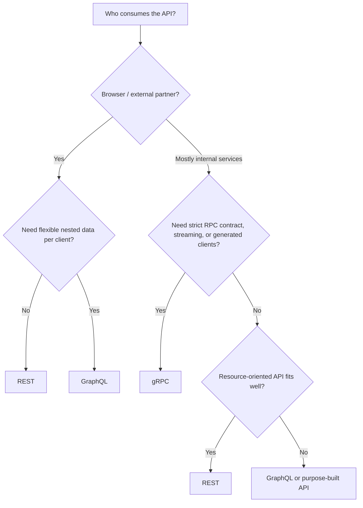
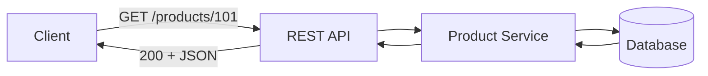
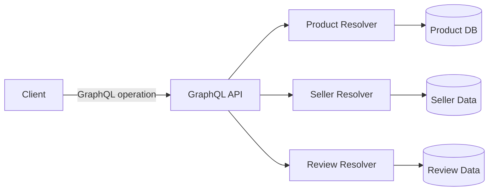
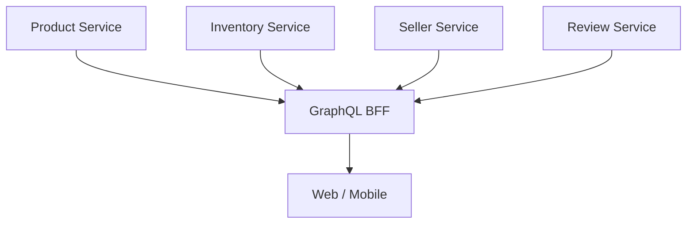
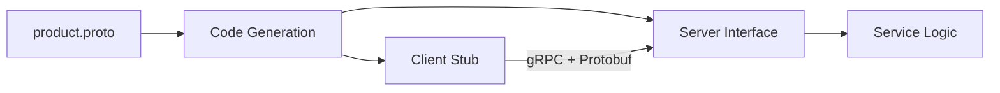
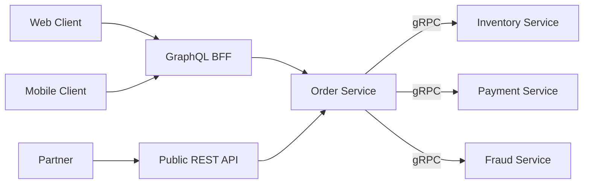

# REST vs GraphQL vs gRPC

> A practical guide to understanding the differences, trade-offs, and common production use cases of REST, GraphQL, and gRPC.

## In Short

- **REST** is usually the best default for public, partner-facing, and normal CRUD-style HTTP APIs.
- **GraphQL** is useful when different frontend clients need different combinations of related data from the same domain.
- **gRPC** is a strong fit for internal service-to-service communication where strict contracts, generated clients, deadlines, or streaming matter.
- These technologies are often used **together**, not as mutually exclusive choices.
- Do not choose only by payload size or benchmark speed. Database work, network hops, caching, downstream calls, and service boundaries usually matter more.



> **Interview takeaway:** Start with REST unless the requirements clearly point toward GraphQL or gRPC.

---

# Index

1. [Core Difference](#1-core-difference)
2. [REST](#2-rest)
3. [GraphQL](#3-graphql)
4. [gRPC](#4-grpc)
5. [Same Requirement in All Three](#5-same-requirement-in-all-three)
6. [Comparison](#6-comparison)
7. [Performance and Caching](#7-performance-and-caching)
8. [API Evolution and Errors](#8-api-evolution-and-errors)
9. [How to Choose](#9-how-to-choose)
10. [Hybrid Architecture and Best Practices](#10-hybrid-architecture-and-best-practices)

---

# 1. Core Difference

REST, GraphQL, and gRPC solve similar communication problems, but their mental models are different.

| Technology | What it is | Think of it as |
|---|---|---|
| **REST** | Architectural style, commonly implemented with HTTP | Resources |
| **GraphQL** | Query language, type system, and execution model | Client-selected fields |
| **gRPC** | Remote Procedure Call framework | Remote methods |

A simple way to remember them:

```text
REST     → Which resource do I want?
GraphQL  → Which fields do I want?
gRPC     → Which remote method do I want to call?
```

This difference affects API design, caching, observability, client flexibility, and service contracts.

---

# 2. REST

## 2.1 How REST Works

REST usually represents business concepts as resources and uses HTTP methods to act on them.

```http
GET    /products/101
POST   /products
PATCH  /products/101
DELETE /products/101
```



REST fits naturally with HTTP features such as:

- HTTP methods
- Status codes
- Headers
- Authentication
- Conditional requests
- Browser and CDN caching
- API gateways
- OpenAPI documentation

## 2.2 Example

```http
GET /api/products/101
```

```json
{
  "id": 101,
  "name": "Mechanical Keyboard",
  "price": 7999,
  "seller_id": 8
}
```

If the UI also needs the seller and reviews, it may call:

```http
GET /api/sellers/8
GET /api/products/101/reviews?limit=5
```

A REST API can also provide expansion when that is a common use case:

```http
GET /api/products/101?include=seller,reviews
```

## 2.3 Strengths

- Easy to understand and debug
- Excellent browser and HTTP ecosystem support
- Natural fit for public and partner APIs
- Mature HTTP caching
- Works well with API gateways and proxies
- Easy to test with `curl`, Postman, or normal HTTP libraries
- OpenAPI can provide a strong machine-readable contract

## 2.4 Trade-offs

### Over-fetching

The server may return more fields than the client needs.

### Under-fetching

A screen may need several related resources, causing multiple requests.

### Endpoint growth

If every client needs a different representation, many specialized endpoints can appear.

### Contract discipline is optional

REST itself does not require OpenAPI or another schema, so teams must maintain the contract intentionally.

---

# 3. GraphQL

## 3.1 How GraphQL Works

GraphQL exposes a typed schema. The client asks for exactly the fields it needs.

```graphql
type Product {
  id: ID!
  name: String!
  price: Int!
  seller: Seller!
  reviews(limit: Int = 5): [Review!]!
}

type Query {
  product(id: ID!): Product
}
```

Client query:

```graphql
query ProductPage($id: ID!) {
  product(id: $id) {
    id
    name
    price
    seller {
      name
    }
    reviews(limit: 5) {
      rating
      comment
    }
  }
}
```



GraphQL defines three operation types:

- **Query** — read data
- **Mutation** — change data
- **Subscription** — receive a stream of execution results from events

GraphQL itself is **transport-agnostic**. HTTP is the most common transport in web systems.

## 3.2 Strengths

### Client-selected response shape

Web, mobile, and admin clients can request different fields without requiring a separate endpoint for each screen.

### Strong typed schema

The schema supports:

- Validation
- Introspection
- Documentation
- IDE autocomplete
- Client type generation
- Controlled evolution

### Good BFF / aggregation layer

GraphQL can combine several backend services behind one UI-facing API.



## 3.3 Important Trade-offs

### N+1 queries

A query for 100 products and each product's seller can accidentally become:

```text
1 query  → products
100 queries → sellers
----------------------
101 queries
```

Batching can reduce it to:

```text
1 query → products
1 query → sellers for all required IDs
---------------------------------------
2 queries
```

DataLoader-style batching is a common solution.

### Query cost is controlled by the client

A small-looking request can trigger deep backend work.

Use:

- Pagination
- Query depth limits
- Complexity / cost limits
- Timeouts
- Batching
- Resolver metrics

### Authorization may be field-sensitive

A user may be allowed to request:

```graphql
employee {
  name
}
```

but not:

```graphql
employee {
  salary
}
```

Authorization must be enforced in resolvers or domain services, not only at the top-level endpoint.

### HTTP caching is less automatic

REST resources naturally map to URLs such as:

```text
GET /products/101
```

GraphQL commonly uses a shared endpoint, so resource-oriented HTTP caching is less direct.

However, GraphQL over HTTP can use **GET for query operations**, and controlled clients can use **persisted operations**, which makes CDN or edge caching more practical.

> As of August 2026, the separate GraphQL-over-HTTP specification is still a working draft. The core GraphQL specification does not require HTTP.

---

# 4. gRPC

## 4.1 How gRPC Works

gRPC models communication as strongly typed remote methods.

Services are normally defined with Protocol Buffers:

```protobuf
syntax = "proto3";

package catalog.v1;

service ProductService {
  rpc GetProduct(GetProductRequest) returns (GetProductResponse);
}

message GetProductRequest {
  int64 product_id = 1;
}

message GetProductResponse {
  int64 id = 1;
  string name = 2;
  int64 price = 3;
}
```

Generated client code lets the caller use a method-like API:

```python
response = stub.GetProduct(
    GetProductRequest(product_id=101),
    timeout=0.5,
)
```



The method looks local, but it is still a **network call**. It can fail, time out, retry incorrectly, or be cancelled.

## 4.2 Four RPC Types

### Unary

```text
Client ---- request ----> Server
Client <--- response ---- Server
```

### Server streaming

```text
Client ---- request ----> Server
Client <--- item 1 ------ Server
Client <--- item 2 ------ Server
Client <--- item 3 ------ Server
```

### Client streaming

```text
Client ---- item 1 -----> Server
Client ---- item 2 -----> Server
Client ---- item 3 -----> Server
Client <--- summary ----- Server
```

### Bidirectional streaming

Both client and server can send streams independently.

## 4.3 Strengths

- Strong service contracts
- Generated cross-language clients
- Compact Protocol Buffer messages
- Built-in streaming model
- Standard deadline and cancellation support
- Good fit for high-volume internal service communication
- Useful for polyglot microservices

## 4.4 Trade-offs

### Browser access is less direct

Browsers commonly use **gRPC-Web**, a proxy/gateway, or an HTTP/JSON edge API instead of native backend gRPC directly.

### Binary payloads are harder to inspect manually

JSON is easier to read in logs and browser tools. Protobuf normally needs the schema and suitable tooling.

### Strong schema discipline is required

Field numbers are part of the wire format.

```protobuf
message Product {
  int64 id = 1;
  string name = 2;

  reserved 3;
  reserved "currency";
}
```

Never reuse a deleted field number for a different meaning.

### Infrastructure must understand gRPC

Gateways, load balancers, proxies, observability tools, and service meshes must be configured for the protocol correctly.

### Deadlines are essential

gRPC does not automatically choose the correct deadline for your application.

```text
API Gateway
   |
   | 1000 ms total request budget
   v
Order Service
   |---- 300 ms ----> Inventory Service
   |
   |---- 200 ms ----> Payment Service
```

Without deadlines, slow dependencies can consume the caller's entire latency budget.

---

# 5. Same Requirement in All Three

## Requirement

Fetch:

- Product ID
- Product name
- Price
- Seller name
- Five recent reviews

## REST

```http
GET /products/101
GET /sellers/8
GET /products/101/reviews?limit=5
```

Or:

```http
GET /products/101?include=seller,reviews
```

**Control:** The server defines the supported representations.

## GraphQL

```graphql
query ProductPage {
  product(id: "101") {
    id
    name
    price
    seller {
      name
    }
    reviews(limit: 5) {
      rating
      comment
    }
  }
}
```

**Control:** The schema defines what is possible; the client chooses fields.

## gRPC

```protobuf
rpc GetProductPage(GetProductPageRequest)
    returns (GetProductPageResponse);
```

```python
response = stub.GetProductPage(
    GetProductPageRequest(
        product_id=101,
        review_limit=5,
    ),
    timeout=0.5,
)
```

**Control:** The RPC method defines the request and response contract.

---

# 6. Comparison

| Area | REST | GraphQL | gRPC |
|---|---|---|---|
| Main model | Resources | Client-selected graph | Remote methods |
| Common transport | HTTP | Commonly HTTP | HTTP/2-based transport |
| Common payload | JSON | Usually JSON | Protocol Buffers |
| Contract | OpenAPI commonly used | GraphQL schema | `.proto` |
| Response shape | Server-defined | Client-selected | Method-defined |
| Browser support | Excellent | Excellent over HTTP | Usually gRPC-Web / gateway |
| Human-readable wire format | Usually yes | Usually yes | Usually no |
| HTTP caching | Natural | Less direct | Not resource-oriented |
| Streaming | SSE / WebSocket / HTTP streaming | Subscriptions / incremental mechanisms | First-class RPC streaming |
| Code generation | Optional | Optional/common | Normal workflow |
| Public API | Excellent | Good when suitable | Usually less convenient |
| Internal microservices | Good | Domain-dependent | Excellent |
| Main risk | Endpoint sprawl | Resolver/query complexity | Network calls hidden behind RPC-style APIs |

---

# 7. Performance and Caching

## 7.1 Performance

Avoid this oversimplification:

```text
gRPC is always fastest.
GraphQL is always fewer requests.
REST is slow.
```

Real latency includes:

```text
network
+ gateway
+ authentication
+ application logic
+ database queries
+ downstream calls
+ serialization
+ payload transfer
```

### REST

Can be extremely fast when responses are cacheable and endpoints match client use cases.

### GraphQL

Can reduce frontend round trips, but one GraphQL request may fan out into many database or service calls.

```text
1 client request != 1 backend operation
```

### gRPC

Can reduce serialization and transport overhead, but a long synchronous call chain is still slow:

```text
A → B → C → D → Database
```

> Measure realistic workflows with load tests instead of choosing from micro-benchmarks.

## 7.2 Caching

### REST

HTTP caching is a major advantage.

```http
Cache-Control: public, max-age=300
ETag: "product-101-v7"
```

Later:

```http
If-None-Match: "product-101-v7"
```

If unchanged, the server can return:

```http
304 Not Modified
```

### GraphQL

Common caching layers include:

- Normalized client cache
- Request-scoped resolver cache
- DataLoader cache
- Backend service cache
- Persisted-operation cache
- Edge/CDN caching for suitable GET operations

### gRPC

Caching is usually application-managed:

- Redis
- In-memory cache
- Read-through cache
- Gateway/service-mesh features
- Materialized views

---

# 8. API Evolution and Errors

## 8.1 REST

Prefer backward-compatible additions.

Safer:

```json
{
  "id": 101,
  "name": "Keyboard",
  "currency": "INR"
}
```

Riskier:

```text
Rename name → product_name
Remove an existing field
Change the meaning of a field
```

REST APIs commonly use URL, header, or media-type versioning when a breaking generation is necessary.

## 8.2 GraphQL

GraphQL usually evolves one schema using additive changes and deprecation.

```graphql
type Product {
  id: ID!
  oldPrice: Int @deprecated(reason: "Use price")
  price: Int!
}
```

Typical migration:

```text
Add new field
   ↓
Move clients
   ↓
Monitor old field usage
   ↓
Deprecate
   ↓
Remove only when safe
```

Nullability is also part of the contract, so changing:

```graphql
String
```

to:

```graphql
String!
```

can be breaking.

GraphQL execution can return **partial data and errors together**, so clients should inspect the GraphQL response rather than assuming a successful HTTP exchange means every field succeeded.

## 8.3 gRPC / Protobuf

Prefer additive fields:

```protobuf
message Product {
  int64 id = 1;
  string name = 2;
  string currency = 3;
}
```

When removing a field, reserve its number and preferably its name.

For major API generations:

```protobuf
package catalog.v1;
```

can later become:

```protobuf
package catalog.v2;
```

gRPC also has meaningful status codes such as:

```text
INVALID_ARGUMENT
NOT_FOUND
ALREADY_EXISTS
UNAUTHENTICATED
PERMISSION_DENIED
RESOURCE_EXHAUSTED
UNAVAILABLE
DEADLINE_EXCEEDED
INTERNAL
```

Use specific statuses instead of returning `INTERNAL` for every failure.

---

# 9. How to Choose

## Choose REST When

Use REST when:

- Building a public or partner API
- Browser compatibility matters
- The domain maps well to resources
- CRUD operations are common
- HTTP caching is valuable
- Simple integration is important
- Low operational complexity is preferred

Typical examples:

```text
User API
Order API
Payment API
Partner API
Public catalog
File upload/download API
```

## Choose GraphQL When

Use GraphQL when:

- Web and mobile need different data shapes
- Screens combine many related entities
- Over-fetching / under-fetching is a recurring problem
- A BFF layer is useful
- A typed discoverable schema helps frontend teams
- The team can manage resolver performance and query limits

Typical examples:

```text
E-commerce storefront
Social application
Content platform
Complex dashboard
Multi-platform consumer product
```

Do not choose GraphQL only because it provides one endpoint.

## Choose gRPC When

Use gRPC when:

- Communication is mainly internal
- Several languages communicate between services
- Generated clients are valuable
- Streaming is important
- High request volume makes compact messages useful
- Deadlines and cancellation should be standardized
- Services are controlled by engineering teams

Typical examples:

```text
Internal microservices
Telemetry
ML inference service
Media processing
Pricing service
High-throughput platform service
```

## Quick Decision Table

| Requirement | Usually prefer |
|---|---|
| Public API | REST |
| Simple CRUD | REST |
| CDN / HTTP caching | REST |
| Client-selected nested fields | GraphQL |
| UI aggregation / BFF | GraphQL |
| Internal RPC | gRPC |
| Native streaming RPC | gRPC |
| Generated cross-language clients | gRPC |
| Unsure | REST |

---

# 10. Hybrid Architecture and Best Practices

## 10.1 Hybrid Architecture

Real systems often combine all three.



Example e-commerce setup:

- **REST** for partner APIs and payment webhooks
- **GraphQL** for web/mobile product screens
- **gRPC** between order, inventory, payment, and fraud services
- **Signed object-storage URLs** for large file uploads

The best architecture may be:

```text
REST + GraphQL + gRPC
```

with each technology used at the boundary where it fits best.

## 10.2 Production Best Practices

### REST

- Model business resources, not database tables
- Use HTTP methods and status codes consistently
- Paginate collections
- Use idempotency where retries can occur
- Publish an OpenAPI contract
- Use `Cache-Control` and `ETag` when useful
- Apply resource/object-level authorization

### GraphQL

- Design schema around the domain
- Paginate large lists
- Batch related data access
- Limit query depth and complexity
- Apply field/domain-level authorization
- Use named operations
- Monitor resolver and downstream timings
- Deprecate before removal
- Keep large binary transfer outside GraphQL

### gRPC

- Set and propagate deadlines
- Support cancellation
- Retry only safe transient failures
- Avoid very fine-grained RPC chatter
- Use TLS or mTLS where appropriate
- Preserve Protobuf field numbers
- Reserve removed fields
- Add tracing, metrics, health checks, and graceful shutdown
- Treat every RPC as a remote network call

### For All Three

```text
Validate input
Authenticate
Authorize
Enforce tenant boundaries
Use timeouts/deadlines
Control retries
Rate-limit abusive traffic
Paginate unbounded results
Avoid leaking sensitive errors
Trace downstream calls
Document compatibility guarantees
Load-test realistic workflows
```

> **Final interview takeaway:** REST is the safest general default, GraphQL is strongest when client data-shape flexibility is the real problem, and gRPC is strongest for controlled internal RPC communication. Architecture quality depends more on correct boundaries, caching, database design, authorization, deadlines, and observability than on the API style alone.
