# Webhooks — API Design & REST

> A practical, interview-focused guide for developers with 3+ years of experience.
>
> **Last reviewed:** July 2026

---

# 1. What Is a Webhook?

A **webhook** is an HTTP callback used by one system to notify another system when an event occurs.

Instead of repeatedly asking a service whether something has changed, the receiving application exposes an HTTP endpoint. The provider sends an HTTP request to that endpoint when a subscribed event occurs.

### Simple example

A payment platform sends the following event to an e-commerce application:

```http
POST /webhooks/payments HTTP/1.1
Host: shop.example.com
Content-Type: application/json
X-Webhook-Signature: sha256=...

{
  "id": "evt_01JY2N7Q5J",
  "type": "payment.succeeded",
  "created_at": "2026-07-30T10:30:00Z",
  "data": {
    "payment_id": "pay_98765",
    "order_id": "order_12345",
    "amount": 4999,
    "currency": "INR"
  }
}
```

The shop receives the event and updates the order from `payment_pending` to `paid`.

## 1.1 Main participants

| Participant | Responsibility |
|---|---|
| **Webhook provider** | Detects an event and sends the HTTP request |
| **Webhook endpoint** | Public URL that receives the event |
| **Webhook consumer** | Verifies, stores, and processes the event |
| **Event** | A fact describing something that has already happened |

## 1.2 Webhooks are usually event notifications

A webhook event should normally describe a completed fact:

```text
payment.succeeded
invoice.created
order.shipped
user.deleted
pull_request.merged
```

Event names written in the past tense are often easier to understand because they represent something that has already happened.

---

# 2. Why Webhooks Are Used

Webhooks provide **near-real-time communication** between independently deployed systems.

## 2.1 Benefits

### Reduced polling

Without webhooks, a client may repeatedly call an API:

```text
GET /payments/pay_98765
GET /payments/pay_98765
GET /payments/pay_98765
...
```

Most calls return the same result and consume unnecessary network, application, and database resources.

With a webhook, the payment service pushes an event only when the state changes.

### Loose coupling

The provider does not need to understand the consumer's internal implementation. It only needs:

- The endpoint URL
- The subscribed event types
- The agreed payload and security contract

### Better user experience

Applications can react quickly to asynchronous events such as:

- Payment completion
- File processing completion
- Shipment updates
- Identity verification results
- CI/CD build completion

## 2.2 Important limitation

A webhook is not a guaranteed synchronous command. Delivery may be delayed, duplicated, retried, or received out of order.

Therefore, the consuming system must be designed for **at-least-once delivery**, even when the provider does not formally guarantee it.

---

# 3. How a Webhook Works

## 3.1 Basic flow

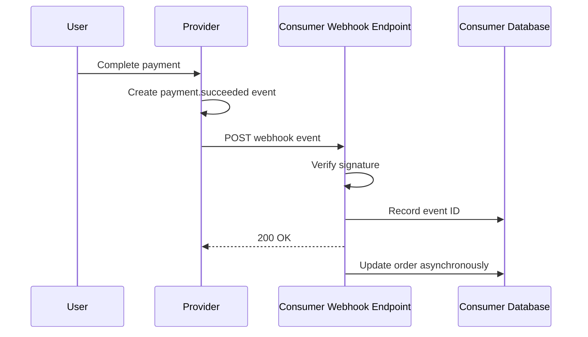

## 3.2 Typical lifecycle

1. The consumer registers a webhook URL with the provider.
2. The consumer selects the required event types.
3. An event occurs in the provider's system.
4. The provider creates an event with a unique ID.
5. The provider signs the request payload.
6. The provider sends an HTTP `POST` request.
7. The consumer verifies authenticity and validates the payload.
8. The consumer stores the event or places it on a queue.
9. The consumer quickly returns a successful `2xx` response.
10. A worker performs the business operation.
11. If delivery fails, the provider may retry.

## 3.3 Push notification, not source of truth

A robust consumer often treats the webhook as a notification that something changed, not necessarily as the only source of truth.

For sensitive workflows, the consumer can use the event's resource ID to fetch the current resource from the provider:

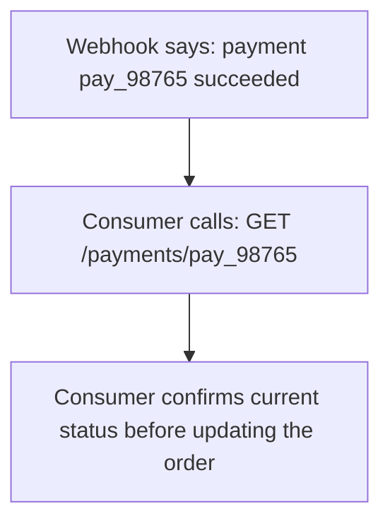

This is useful when:

- Events can arrive out of order
- Payloads contain limited data
- The resource may have changed again
- Financial or compliance accuracy is important

---

# 4. Webhooks vs APIs, Polling, WebSockets, and Message Brokers

## 4.1 Webhooks vs regular REST APIs

| REST API call | Webhook delivery |
|---|---|
| Consumer initiates the request | Provider initiates the request |
| Usually request-response driven | Event driven |
| Consumer decides when to call | Provider sends when an event occurs |
| Often used to read or modify resources | Usually used to notify state changes |
| Response commonly contains business data | Response usually only acknowledges receipt |

A webhook still uses HTTP, but the direction of communication is reversed.

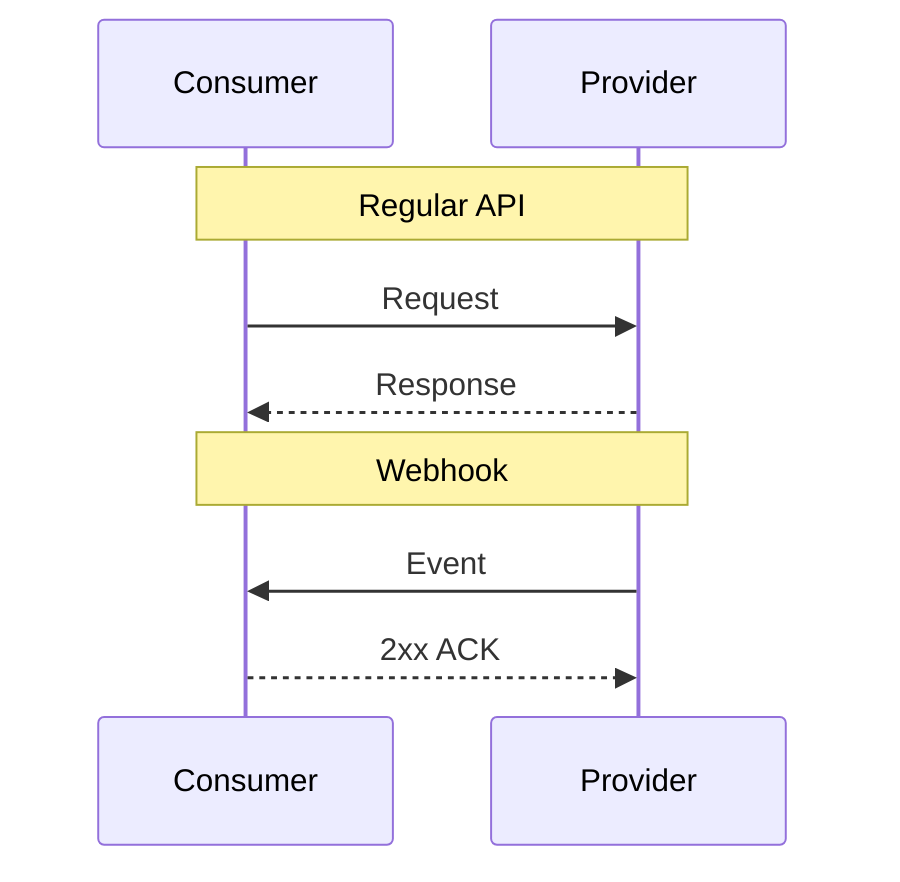

## 4.2 Webhooks vs polling

| Webhooks | Polling |
|---|---|
| Provider pushes changes | Consumer repeatedly checks |
| Near-real-time updates | Delay depends on polling interval |
| Lower unnecessary traffic | Many calls may return no change |
| Requires a reachable endpoint | Works even without a public callback URL |
| Delivery handling is more complex | Client-side logic is often simpler |

Use polling when:

- The provider does not support webhooks
- The consumer cannot expose a reachable endpoint
- Updates are infrequent and delay is acceptable
- Periodic reconciliation is required

Many reliable integrations use **webhooks for fast updates** and **polling for reconciliation**.

## 4.3 Webhooks vs WebSockets

| Webhooks | WebSockets |
|---|---|
| Server-to-server HTTP callback | Long-lived bidirectional connection |
| Best for business events | Best for live interactive communication |
| No permanent connection required | Connection must remain open |
| Delivery may be retried | Reconnect and missed-message handling are required |
| Common for payments and SaaS integrations | Common for chat, collaboration, and live dashboards |

## 4.4 Webhooks vs message brokers

| Webhooks | Message broker |
|---|---|
| HTTP-based integration across organizations | Messaging infrastructure inside or across controlled systems |
| Easy for external consumers | Better control over delivery, routing, and backpressure |
| Consumer needs an HTTP endpoint | Consumer connects to broker |
| Provider implements retries | Broker manages queues and acknowledgements |
| Limited flow control | Stronger buffering and consumer-group features |

A common architecture receives an external webhook and immediately places it on an internal queue.

---

# 5. Webhook HTTP Contract

A webhook is an API contract and should be documented as carefully as any REST endpoint.

## 5.1 HTTP method

Webhook providers normally use `POST` because an event payload is being submitted to the receiver for processing.

```http
POST /webhooks/payments
```

## 5.2 Endpoint naming

Prefer provider- or domain-specific endpoints:

```text
POST /webhooks/stripe
POST /webhooks/github
POST /webhooks/payments
POST /webhooks/shipping
```

Separate endpoints are useful when providers use different:

- Signing algorithms
- Secrets
- Payload formats
- Retry rules
- IP ranges
- Operational ownership

Avoid exposing business commands as webhook paths:

```text
POST /mark-order-paid       # Avoid
POST /webhooks/payments     # Better
```

The webhook endpoint receives an event. The consumer decides which internal operation should follow.

## 5.3 Request headers

Common webhook headers include:

| Header purpose | Example |
|---|---|
| Event type | `X-Webhook-Event: payment.succeeded` |
| Event or delivery ID | `X-Webhook-ID: evt_123` |
| Signature | `X-Webhook-Signature: sha256=...` |
| Timestamp | `X-Webhook-Timestamp: 1785407400` |
| API version | `X-Webhook-Version: 2026-07-01` |
| Content type | `Content-Type: application/json` |

Provider-specific names differ. For example, GitHub uses headers such as `X-GitHub-Event`, `X-GitHub-Delivery`, and `X-Hub-Signature-256`.

## 5.4 Response status codes

| Status | Meaning to provider |
|---|---|
| `200 OK` | Event accepted or already processed |
| `202 Accepted` | Event accepted for asynchronous processing |
| `204 No Content` | Event accepted; no response body |
| `400 Bad Request` | Invalid payload or malformed request |
| `401 Unauthorized` | Missing or invalid authentication information |
| `403 Forbidden` | Authenticated sender is not allowed |
| `409 Conflict` | Usually avoid for duplicate events; acknowledge duplicates with `2xx` |
| `429 Too Many Requests` | Receiver is overloaded; provider may retry |
| `500–599` | Temporary server failure; provider may retry |

### Practical rule

Return a `2xx` response after the request is safely verified and durably recorded or queued.

Do not wait for slow business logic such as:

- Sending email
- Updating multiple services
- Generating reports
- Calling third-party APIs
- Running large database operations

## 5.5 Response body

Providers usually care about the status code, not a large response body.

```json
{
  "received": true
}
```

A minimal response is easier to maintain.

---

# 6. Designing Webhook Events and Payloads

## 6.1 Recommended event envelope

```json
{
  "id": "evt_01JY2N7Q5J",
  "type": "invoice.paid",
  "source": "billing-service",
  "spec_version": "1.0",
  "api_version": "2026-07-01",
  "created_at": "2026-07-30T10:30:00Z",
  "data": {
    "invoice_id": "inv_123",
    "customer_id": "cus_456",
    "amount_paid": 4999,
    "currency": "INR"
  }
}
```

### Important fields

| Field | Purpose |
|---|---|
| `id` | Unique identifier used for deduplication |
| `type` | Identifies the business event |
| `source` | Identifies the producing system |
| `created_at` | Time the event was created |
| `api_version` | Defines payload structure |
| `data` | Event-specific information |

CloudEvents provides a standard event envelope that can improve interoperability between event producers and consumers. A team does not have to adopt the complete specification, but fields such as `id`, `source`, `type`, `time`, and `specversion` are useful design references.

## 6.2 Event naming

Use clear, stable names:

```text
order.created
order.cancelled
order.shipped
payment.authorized
payment.succeeded
payment.failed
subscription.renewed
```

Avoid vague names:

```text
order.updated
status.changed
data.modified
```

Sometimes a broad event is necessary, but a specific event normally creates a cleaner consumer contract.

## 6.3 Snapshot events vs thin events

### Snapshot event

Contains most of the resource state:

```json
{
  "type": "customer.updated",
  "data": {
    "id": "cus_123",
    "name": "Aarav Shah",
    "email": "aarav@example.com",
    "status": "active",
    "updated_at": "2026-07-30T10:30:00Z"
  }
}
```

**Advantages**

- Consumer may not need another API call
- Easier offline processing
- Event preserves the historical snapshot

**Trade-offs**

- Larger payloads
- Sensitive fields may be exposed unnecessarily
- Schema evolution is harder
- Snapshot may already be stale when processed

### Thin event

Contains identifiers and minimal metadata:

```json
{
  "type": "customer.updated",
  "data": {
    "customer_id": "cus_123"
  }
}
```

**Advantages**

- Smaller and safer payload
- Consumer retrieves the latest representation
- Less coupling to provider schema

**Trade-offs**

- Requires an additional API call
- Provider must remain available
- Historical state may be lost

## 6.4 Payload compatibility

Webhook payload changes should be backward compatible whenever possible.

Usually safe:

- Adding optional fields
- Adding new event types
- Adding new enum values when consumers handle unknown values

Usually breaking:

- Removing fields
- Renaming fields
- Changing a field's type
- Changing field meaning
- Moving fields to a different structure

Consumers should ignore unknown fields unless strict validation is a deliberate requirement.

## 6.5 Versioning strategies

### Version in endpoint path

```text
POST /webhooks/v1/payments
POST /webhooks/v2/payments
```

### Version in header

```http
X-Webhook-Version: 2026-07-01
```

### Version in event envelope

```json
{
  "api_version": "2026-07-01"
}
```

Date-based versions are useful because they communicate when a contract became active. The provider should document support periods and migration steps.

---

# 7. Delivery Semantics and Reliability

Webhook delivery is distributed communication. Network failures can happen at any point.

## 7.1 The acknowledgement ambiguity

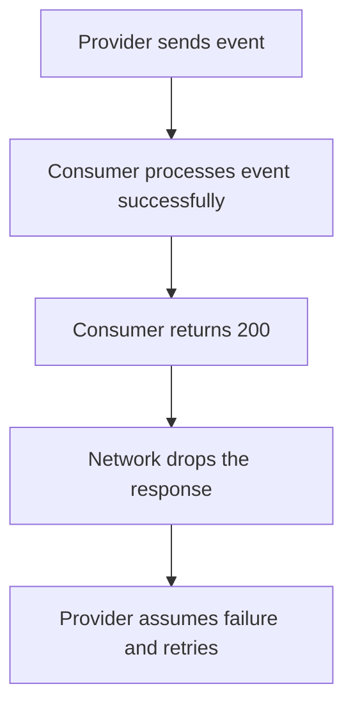

The provider cannot know whether the consumer completed processing. This is why duplicate delivery is unavoidable in many webhook systems.

## 7.2 Delivery guarantees

### At-most-once

The provider sends once and does not retry.

- No duplicate delivery
- Events may be lost
- Rarely sufficient for important integrations

### At-least-once

The provider retries until it receives success or reaches a retry limit.

- Lower chance of lost events
- Duplicate events are possible
- Most common model for webhooks

### Exactly-once effect

True exactly-once network delivery is generally not practical. Instead, systems create an exactly-once **business effect** through:

- Unique event IDs
- Durable event storage
- Database uniqueness constraints
- Idempotent processing
- Transactions

## 7.3 Idempotent event processing

Processing the same event multiple times must not create multiple business effects.

### Unsafe example

```python
account.balance += event["data"]["amount"]
```

If the event is delivered twice, the amount is credited twice.

### Safer approach

```text
1. Insert event ID into webhook_events
2. Unique constraint rejects duplicate event ID
3. Apply business change in the same transaction
4. Mark event as processed
```

Example table:

```sql
CREATE TABLE webhook_events (
    provider       VARCHAR(50) NOT NULL,
    event_id       VARCHAR(255) NOT NULL,
    event_type     VARCHAR(255) NOT NULL,
    status         VARCHAR(30) NOT NULL,
    payload        JSONB NOT NULL,
    received_at    TIMESTAMPTZ NOT NULL DEFAULT NOW(),
    processed_at   TIMESTAMPTZ,
    error_message  TEXT,
    PRIMARY KEY (provider, event_id)
);
```

The composite primary key prevents the same provider event from being recorded twice.

## 7.4 Retry strategy

A provider should retry temporary failures using exponential backoff:

| Attempt | Delay before delivery |
|---|---|
| 1 | Immediately |
| 2 | After 30 seconds |
| 3 | After 2 minutes |
| 4 | After 10 minutes |
| 5 | After 1 hour |
| Later attempts | Delay keeps growing up to a maximum |

Add **jitter** so many failing deliveries do not retry at exactly the same time.

```text
retry_delay = min(max_delay, base_delay × 2^attempt) + random_jitter
```

Retry likely temporary failures:

- Connection timeout
- DNS failure
- `408 Request Timeout`
- `429 Too Many Requests`
- `500–599` responses

Normally do not repeatedly retry permanent failures without a clear policy:

- Invalid callback URL
- `400 Bad Request`
- Removed subscription
- Permanently invalid credentials

Provider behavior differs. Consumers must read the provider's delivery documentation.

## 7.5 Event ordering

Never assume events arrive in creation order unless the provider explicitly guarantees ordering.

Example:

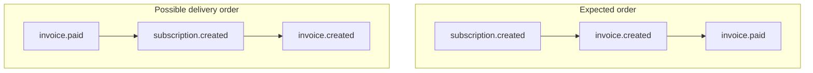

Ways to handle this:

- Fetch the current resource state from the provider
- Include resource version numbers
- Include sequence numbers per aggregate
- Compare event timestamps carefully
- Make state transitions tolerant of missing earlier events
- Reconcile periodically

A timestamp alone does not fully solve ordering because clocks, retries, and concurrent updates complicate processing.

## 7.6 Dead-letter handling

Events that fail repeatedly should be moved to a dead-letter queue or failed-event store.

Store:

- Event ID
- Event type
- Payload
- Attempt count
- Last error
- First and last attempt timestamps
- Endpoint or consumer identity

Operations teams should be able to inspect and replay failed events safely.

## 7.7 Reconciliation

Webhooks should not be the only consistency mechanism for critical workflows.

A scheduled reconciliation process can compare local state with provider state:

```text
Webhook path: fast, near-real-time update
Reconciliation job: slower safety net
```

Example:

- Every hour, fetch payments updated since the previous cursor
- Compare them with local orders
- Repair missing or inconsistent records

---

# 8. Webhook Security

A webhook endpoint is publicly reachable and must be treated as an external attack surface.

## 8.1 Use HTTPS

Production webhook endpoints should use HTTPS with a valid TLS certificate.

HTTPS protects the request from being read or modified in transit. It does not by itself prove that the request came from the expected provider, so request signing is still required.

## 8.2 HMAC signature verification

A common approach uses a shared secret and HMAC-SHA256.

### Provider

```text
signed_payload = timestamp + "." + raw_request_body
signature = HMAC_SHA256(secret, signed_payload)
```

### Consumer

1. Read the raw request body.
2. Read the timestamp and signature headers.
3. Recompute the HMAC using the shared secret.
4. Compare signatures with a constant-time comparison.
5. Reject old timestamps.
6. Process the event only after successful verification.

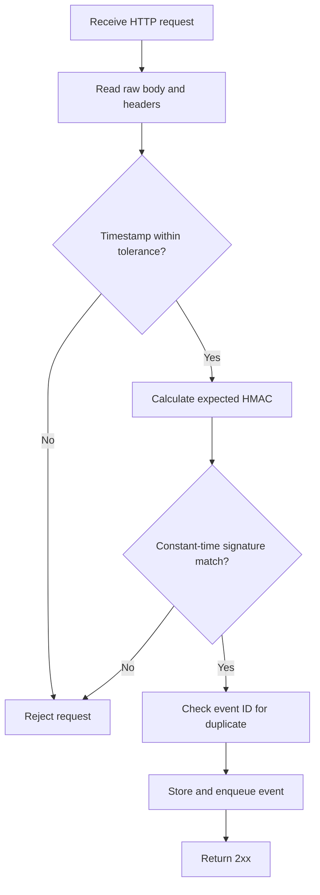

### Why raw body matters

Signature verification is performed over the exact bytes sent by the provider. Parsing and re-serializing JSON can change:

- Whitespace
- Key order
- Escaping
- Number representation

The signature must be verified before modifying the body.

## 8.3 Prevent replay attacks

An attacker may capture a valid request and send it again.

Use both:

- A signed timestamp with a limited tolerance, such as five minutes
- A unique event or delivery ID stored by the consumer

The timestamp blocks old requests. The event ID blocks repeated processing within and beyond the timestamp window.

## 8.4 Constant-time comparison

Do not compare signatures with a normal string equality operation in custom cryptographic code.

Python provides:

```python
hmac.compare_digest(expected_signature, received_signature)
```

This reduces timing information that could help an attacker guess a valid signature.

## 8.5 Secret management and rotation

Store secrets in:

- Environment variables supplied by a secret manager
- AWS Secrets Manager
- HashiCorp Vault
- Google Secret Manager
- Azure Key Vault
- Kubernetes Secrets with appropriate encryption and access controls

Do not store signing secrets in source code or logs.

During rotation, temporarily support both the current and previous secret:

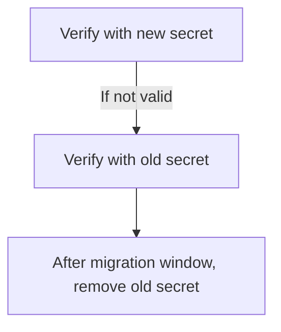

## 8.6 IP allow lists

IP allow-listing can be an additional layer when the provider publishes stable delivery ranges.

It should not replace signature verification because:

- IP ranges may change
- Proxies can affect source addresses
- Configuration errors may block valid deliveries
- A compromised permitted system could still send malicious traffic

## 8.7 Mutual TLS and asymmetric signatures

Higher-security integrations may use:

- Mutual TLS, where both sides present certificates
- JWS or public-key signatures, where the provider signs with a private key and consumers verify with a public key

These approaches reduce shared-secret distribution but add certificate and key-rotation complexity.

## 8.8 Additional protections

- Apply a request body size limit
- Enforce `Content-Type: application/json`
- Validate required fields
- Rate-limit abusive traffic carefully
- Use a dedicated endpoint without browser sessions
- Do not require CSRF tokens for machine-to-machine webhook routes
- Redact personal and secret data from logs
- Subscribe only to required events

---

# 9. Production-Ready Receiver Architecture

## 9.1 Recommended architecture

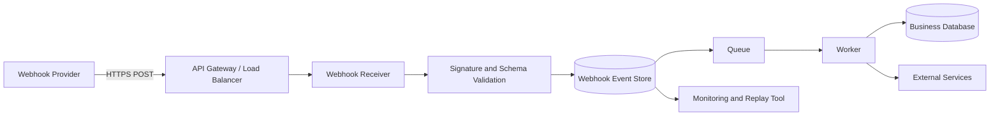

## 9.2 Receiver responsibilities

The HTTP receiver should do only the minimum synchronous work:

1. Read the raw request body.
2. Verify signature and timestamp.
3. Validate basic event metadata.
4. Deduplicate by event ID.
5. Durably store or enqueue the event.
6. Return `2xx` quickly.

## 9.3 Worker responsibilities

The asynchronous worker should:

- Parse and validate the full event schema
- Run business logic
- Call internal or external services
- Retry recoverable processing failures
- Record processing status
- Send failed events to a dead-letter queue

## 9.4 Durable store before acknowledgement

Do not acknowledge an important event before it is safely stored.

Unsafe:

```text
Receive → Return 200 → Process in application memory
```

If the process crashes after returning `200`, the event may be lost.

Safer:

```text
Receive → Verify → Store/Queue durably → Return 200 → Process
```

## 9.5 Database transaction boundary

When possible, perform deduplication and the local state change in one transaction:

```text
BEGIN
  INSERT webhook event ID
  UPDATE business resource
  MARK event processed
COMMIT
```

If the transaction fails, none of the changes are committed and the event can be retried.

For cross-service operations, use patterns such as:

- Transactional outbox
- Saga
- Retryable commands
- Idempotency keys

---

# 10. FastAPI Webhook Receiver Example

The following example demonstrates generic HMAC verification. Provider-specific SDKs should be used when available because they encode the provider's exact signature format.

## 10.1 Signature verification utility

```python
import hashlib
import hmac
import time


class InvalidWebhookSignature(Exception):
    """Raised when a webhook request cannot be authenticated."""


def verify_webhook_signature(
    *,
    raw_body: bytes,
    timestamp: str,
    received_signature: str,
    secret: str,
    tolerance_seconds: int = 300,
) -> None:
    try:
        request_timestamp = int(timestamp)
    except (TypeError, ValueError) as exc:
        raise InvalidWebhookSignature("Invalid timestamp") from exc

    current_timestamp = int(time.time())
    if abs(current_timestamp - request_timestamp) > tolerance_seconds:
        raise InvalidWebhookSignature("Webhook timestamp is too old")

    signed_payload = timestamp.encode("utf-8") + b"." + raw_body
    expected_signature = hmac.new(
        secret.encode("utf-8"),
        signed_payload,
        hashlib.sha256,
    ).hexdigest()

    normalized_signature = received_signature.removeprefix("sha256=")

    if not hmac.compare_digest(expected_signature, normalized_signature):
        raise InvalidWebhookSignature("Signature does not match")
```

## 10.2 FastAPI endpoint

```python
import json
import os
from typing import Any

from fastapi import FastAPI, Header, HTTPException, Request, status
from pydantic import BaseModel, ConfigDict, ValidationError

app = FastAPI()
WEBHOOK_SECRET = os.environ["PAYMENT_WEBHOOK_SECRET"]


class WebhookEvent(BaseModel):
    model_config = ConfigDict(extra="allow")

    id: str
    type: str
    created_at: str
    data: dict[str, Any]


async def event_already_recorded(event_id: str) -> bool:
    # Replace with a database query.
    return False


async def store_and_enqueue_event(event: WebhookEvent, raw_payload: dict) -> None:
    """
    Production implementation should atomically:
    1. insert the event using a unique event_id constraint;
    2. enqueue an internal processing job or write to an outbox.
    """
    pass


@app.post("/webhooks/payments", status_code=status.HTTP_202_ACCEPTED)
async def receive_payment_webhook(
    request: Request,
    x_webhook_timestamp: str = Header(alias="X-Webhook-Timestamp"),
    x_webhook_signature: str = Header(alias="X-Webhook-Signature"),
) -> dict[str, bool]:
    raw_body = await request.body()

    try:
        verify_webhook_signature(
            raw_body=raw_body,
            timestamp=x_webhook_timestamp,
            received_signature=x_webhook_signature,
            secret=WEBHOOK_SECRET,
        )
    except InvalidWebhookSignature as exc:
        raise HTTPException(
            status_code=status.HTTP_401_UNAUTHORIZED,
            detail=str(exc),
        ) from exc

    try:
        raw_payload = json.loads(raw_body)
        event = WebhookEvent.model_validate(raw_payload)
    except (json.JSONDecodeError, ValidationError) as exc:
        raise HTTPException(
            status_code=status.HTTP_400_BAD_REQUEST,
            detail="Invalid webhook payload",
        ) from exc

    if await event_already_recorded(event.id):
        # A duplicate is considered successfully handled.
        return {"received": True}

    await store_and_enqueue_event(event, raw_payload)
    return {"received": True}
```

## 10.3 Event dispatcher

```python
from collections.abc import Awaitable, Callable

EventHandler = Callable[[WebhookEvent], Awaitable[None]]


async def handle_payment_succeeded(event: WebhookEvent) -> None:
    payment_id = event.data["payment_id"]
    order_id = event.data["order_id"]

    # Use an idempotent database operation.
    # Example: update only when the order is not already paid.
    await mark_order_as_paid(order_id=order_id, payment_id=payment_id)


async def handle_payment_failed(event: WebhookEvent) -> None:
    await mark_payment_as_failed(
        order_id=event.data["order_id"],
        payment_id=event.data["payment_id"],
    )


HANDLERS: dict[str, EventHandler] = {
    "payment.succeeded": handle_payment_succeeded,
    "payment.failed": handle_payment_failed,
}


async def process_event(event: WebhookEvent) -> None:
    handler = HANDLERS.get(event.type)

    if handler is None:
        # Unknown events should normally be recorded and ignored safely.
        return

    await handler(event)
```

## 10.4 Why not use only an in-process background task?

FastAPI background tasks can be useful for lightweight work, but they run in the application process. A process restart can interrupt the task.

For important webhook workloads, prefer a durable queue such as:

- RabbitMQ
- Amazon SQS
- Kafka
- Redis Streams
- A database-backed job queue

Celery, Dramatiq, RQ, Taskiq, or a custom worker can consume the queued event.

---

# 11. Webhook Sender Design

When your own API provides webhooks, the sender needs reliable delivery infrastructure.

## 11.1 Subscription model

A webhook subscription commonly contains:

```json
{
  "id": "whsub_123",
  "url": "https://customer.example.com/webhooks/orders",
  "enabled_events": [
    "order.created",
    "order.shipped"
  ],
  "status": "active",
  "secret": "stored-encrypted",
  "api_version": "2026-07-01"
}
```

Store secrets encrypted and show them only when initially created or rotated.

## 11.2 Do not send directly inside the business request

Unsafe design:

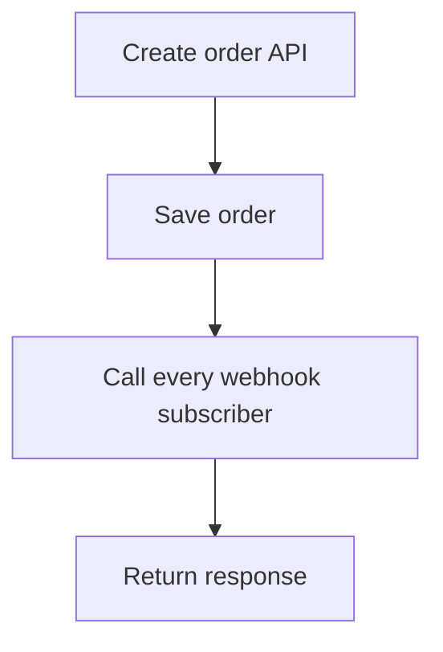

One slow or unavailable subscriber increases your API latency and failure rate.

Use an outbox or event bus:

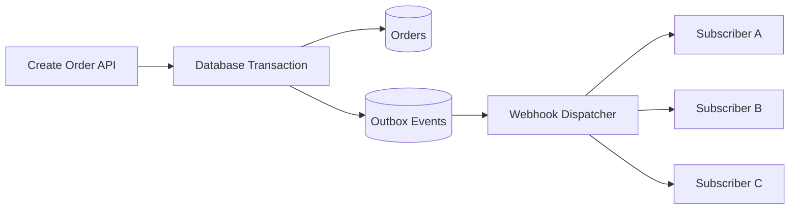

## 11.3 Transactional outbox pattern

Write the business change and event record in the same database transaction:

```sql
BEGIN;

INSERT INTO orders (...);

INSERT INTO outbox_events (
    event_id,
    event_type,
    payload,
    status
) VALUES (
    'evt_123',
    'order.created',
    '{"order_id":"order_123"}',
    'pending'
);

COMMIT;
```

A dispatcher later reads pending outbox events and delivers them. This prevents a failure where the order is committed but the event is never created.

## 11.4 Delivery record

Track delivery separately for each subscription:

```text
webhook_events
  event_id
  event_type
  payload

webhook_deliveries
  delivery_id
  event_id
  subscription_id
  attempt_number
  response_status
  response_body_preview
  next_attempt_at
  delivered_at
```

One event may be delivered to many subscribers, each with its own retry state.

## 11.5 Sender-side SSRF protection

A webhook provider makes server-side requests to customer-provided URLs. This creates a Server-Side Request Forgery risk.

Protect the sender by:

- Allowing only `https://` URLs in production
- Resolving DNS and blocking private, loopback, and link-local IP ranges
- Rechecking the resolved destination after redirects
- Limiting or disabling redirects
- Blocking cloud metadata endpoints
- Applying connection and response timeouts
- Limiting response size
- Isolating delivery workers from internal networks

This concern is especially important when customers can freely configure callback URLs.

## 11.6 Endpoint verification

Some providers verify ownership before activating a subscription.

### Challenge-response example

```http
POST /webhooks/orders
Content-Type: application/json

{
  "type": "webhook.verification",
  "challenge": "random-value-123"
}
```

The receiver returns:

```json
{
  "challenge": "random-value-123"
}
```

Alternative methods include sending a signed test event or requiring an API-based confirmation.

---

# 12. Testing and Local Development

## 12.1 Test cases

A webhook receiver should be tested for:

| Scenario | Expected result |
|---|---|
| Valid event and signature | Event stored and `2xx` returned |
| Invalid signature | Request rejected |
| Missing signature | Request rejected |
| Old timestamp | Replay rejected |
| Malformed JSON | `400` returned |
| Unknown event type | Safely ignored or stored |
| Duplicate event ID | No duplicate business effect; `2xx` returned |
| Dependency unavailable | Event remains retryable |
| Events out of order | Final state remains correct |
| Worker crashes | Event can be retried |
| Large payload | Rejected according to size limit |

## 12.2 Local endpoint exposure

A provider on the internet cannot call `localhost` directly. During development, use:

- The provider's official CLI forwarding tool
- A secure tunnelling service
- A temporary development environment

Never expose an unsecured development server with production secrets.

## 12.3 Store sample payloads

Maintain sanitized event fixtures:

```text
tests/fixtures/webhooks/
├── payment_succeeded.json
├── payment_failed.json
├── invoice_paid.json
└── subscription_cancelled.json
```

Fixtures improve:

- Unit tests
- Schema migration testing
- Replay testing
- Debugging
- Consumer contract testing

## 12.4 Contract testing

Provider and consumer teams should test:

- Required fields
- Optional fields
- Enum expansion
- Event version compatibility
- Signature generation and verification
- Unknown field handling
- Deprecation behavior

## 12.5 Replay tools

A useful internal replay tool should:

- Require authorization
- Preserve the original event ID
- Clearly mark manual replays
- Prevent accidental mass replay
- Record who replayed the event and why
- Avoid bypassing normal idempotency checks

---

# 13. Observability and Operations

## 13.1 Structured logging

Log operational metadata:

```json
{
  "message": "webhook_received",
  "provider": "payment-service",
  "event_id": "evt_123",
  "event_type": "payment.succeeded",
  "delivery_id": "del_456",
  "signature_valid": true,
  "duplicate": false,
  "processing_status": "queued",
  "request_id": "req_789"
}
```

Avoid logging:

- Signing secrets
- Full authorization headers
- Complete payment details
- Personal data not needed for debugging
- Entire payloads without redaction and retention controls

## 13.2 Metrics

Track at minimum:

- Received events per provider and type
- Successful acknowledgements
- Invalid signatures
- Duplicate events
- Queue depth
- Processing latency
- Processing failures
- Retry count
- Dead-letter queue size
- Oldest unprocessed event age

## 13.3 Useful latency measures

| Measure | Formula |
|---|---|
| Delivery latency | `received_at - event_created_at` |
| Queue latency | `processing_started_at - received_at` |
| Processing time | `processing_finished_at - processing_started_at` |
| End-to-end time | `processing_finished_at - event_created_at` |

These measurements help locate whether delays originate in the provider, receiver, queue, or worker.

## 13.4 Alerts

Alert on conditions such as:

- Sudden increase in signature failures
- No events received during an expected active period
- Queue depth above threshold
- Oldest event age above threshold
- Dead-letter queue growth
- Repeated failures for one event type
- Provider retry rate increase

## 13.5 Correlation IDs

Preserve identifiers across the entire flow:

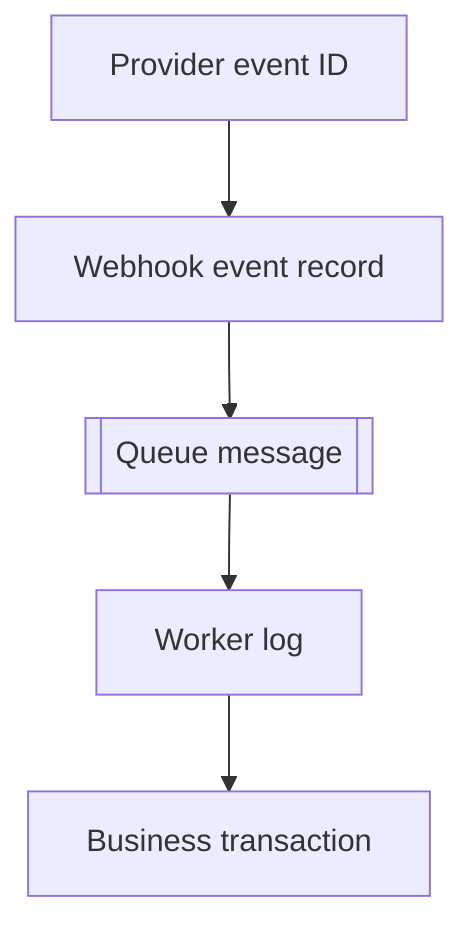

This makes distributed debugging significantly easier.

---

# 14. Common Practical Use Cases

## 14.1 Payment processing

```text
payment.succeeded
payment.failed
refund.created
chargeback.opened
```

Webhook processing should be idempotent because duplicate financial events can cause serious errors.

## 14.2 E-commerce and shipping

```text
order.created
order.cancelled
shipment.dispatched
shipment.delivered
```

Shipping events may arrive late or out of order, so the consumer should use provider state or sequence information when available.

## 14.3 Source control and CI/CD

```text
push.created
pull_request.opened
pull_request.merged
build.completed
release.published
```

A Git platform can trigger code analysis, deployment, notifications, or audit workflows.

## 14.4 Document and AI processing

```text
document.uploaded
document.ocr_completed
model.job_completed
report.generated
```

The initial API request creates an asynchronous job. The webhook reports completion without requiring constant polling.

## 14.5 Identity and compliance

```text
verification.completed
verification.failed
risk.review_required
```

The receiver should retrieve current provider state before making high-impact decisions when the webhook is only a notification.

## 14.6 Communication platforms

```text
message.received
message.delivered
message.read
message.failed
```

High-volume messaging integrations require efficient queueing, partitioning, and idempotent processing.

---

# 15. Webhook Design Checklist

## 15.1 Consumer checklist

- [ ] Use a dedicated HTTPS endpoint
- [ ] Verify the signature against the raw body
- [ ] Validate a signed timestamp
- [ ] Use constant-time signature comparison
- [ ] Deduplicate using a durable unique event ID
- [ ] Store or enqueue before returning success
- [ ] Return `2xx` quickly
- [ ] Process business logic asynchronously
- [ ] Handle unknown event types safely
- [ ] Do not depend on event order
- [ ] Make business operations idempotent
- [ ] Add retry and dead-letter handling
- [ ] Redact sensitive logs
- [ ] Monitor queue age and failures
- [ ] Run periodic reconciliation for critical data

## 15.2 Provider checklist

- [ ] Generate a globally unique event ID
- [ ] Use clear, stable event names
- [ ] Sign every request
- [ ] Include a signed timestamp
- [ ] Support secret rotation
- [ ] Retry temporary failures with exponential backoff and jitter
- [ ] Document retry duration and timeout behavior
- [ ] Provide delivery history and manual replay
- [ ] Version payload contracts
- [ ] Preserve backward compatibility
- [ ] Protect the sender from SSRF
- [ ] Apply connection and response timeouts
- [ ] Let consumers subscribe only to required events
- [ ] Document ordering and duplication behavior

---

# 16. Key Takeaways

1. A webhook is an event-driven HTTP callback initiated by the provider.
2. Webhooks reduce polling and enable near-real-time integrations.
3. Delivery can be duplicated, delayed, retried, or out of order.
4. Use unique event IDs and idempotent handlers to create exactly-once business effects.
5. Verify signatures using the exact raw request body.
6. Use signed timestamps and event IDs to protect against replay attacks.
7. Durably store or enqueue the event before returning `2xx`.
8. Keep the HTTP handler fast and move business logic to workers.
9. For critical workflows, combine webhooks with reconciliation.
10. A provider must design delivery history, retries, versioning, secret rotation, and SSRF protection as first-class features.

---

# 17. References

- IETF, **RFC 9110 — HTTP Semantics**: https://www.rfc-editor.org/rfc/rfc9110.html
- GitHub Docs, **About webhooks**: https://docs.github.com/en/webhooks/about-webhooks
- GitHub Docs, **Best practices for using webhooks**: https://docs.github.com/en/webhooks/using-webhooks/best-practices-for-using-webhooks
- Stripe Docs, **Receive events in your webhook endpoint**: https://docs.stripe.com/webhooks
- Stripe Docs, **Process undelivered webhook events**: https://docs.stripe.com/webhooks/process-undelivered-events
- CloudEvents, **Specification and ecosystem**: https://cloudevents.io/

