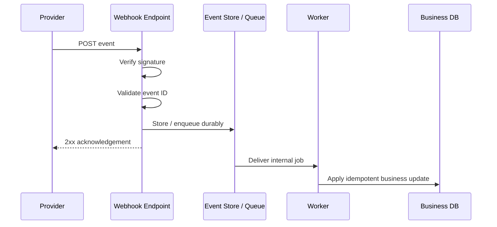
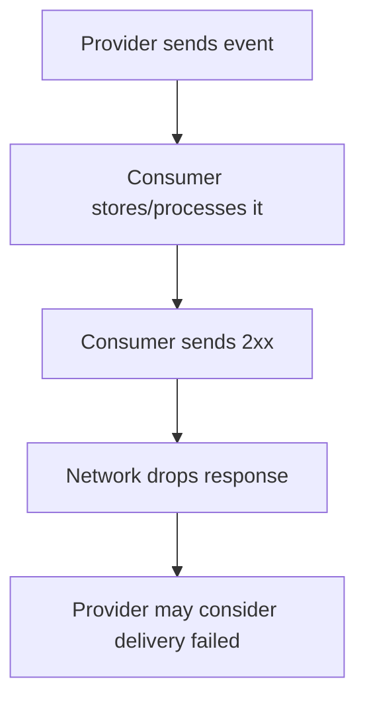
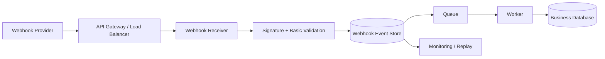
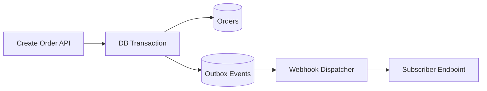

# Webhooks — API Design & REST

> A practical, interview-focused guide for developers with 3+ years of experience.

## In short

A **webhook** is an HTTP callback where one system pushes an event to another system when something happens. Instead of continuously polling an API, the consumer exposes an endpoint such as `POST /webhooks/payments`, and the provider sends events to it.

The important production idea is simple:

**Receive → verify → deduplicate → durably store/enqueue → return `2xx` → process asynchronously**

Webhook delivery is distributed communication, so duplicates, delays, retries, failures, and out-of-order events must be expected. Retry behavior itself is **provider-specific**: some providers retry automatically, while others require manual or application-driven redelivery.

---

# Index

1. What a Webhook Is
2. How Webhooks Work
3. Webhooks vs Polling, WebSockets, and Brokers
4. Webhook HTTP Contract
5. Reliability: Idempotency, Retries, and Ordering
6. Webhook Security
7. Production Receiver Architecture
8. FastAPI Payment Webhook Example
9. Designing Webhooks as a Provider
10. Testing and Observability

---

# 1. What a Webhook Is

A webhook is an **event-driven HTTP notification**.

For example, a payment service may send:

```text
payment.succeeded
payment.failed
refund.created
```

The event describes something that already happened. The consumer decides what business action should follow.

## 1.1 Main participants

| Participant | Responsibility |
|---|---|
| **Provider** | Detects an event and sends the webhook |
| **Webhook endpoint** | Public HTTP endpoint that receives it |
| **Consumer** | Verifies, stores, and processes the event |
| **Event** | The fact that describes what happened |

## 1.2 Why webhooks are useful

Without a webhook, an application may repeatedly poll:

```text
GET /payments/pay_98765
GET /payments/pay_98765
GET /payments/pay_98765
```

Most requests may return the same result.

With a webhook, the provider pushes the update only when the state changes.

Typical use cases include:

- Payment completion
- Shipment status changes
- Git push or pull-request events
- File/OCR/AI job completion
- Identity verification results
- Message delivery/read receipts

---

# 2. How Webhooks Work

A normal production flow looks like this:



## 2.1 Typical lifecycle

1. Consumer registers a webhook URL.
2. Consumer subscribes to required event types.
3. An event occurs in the provider system.
4. Provider creates an event with a unique ID.
5. Provider signs the request according to its webhook protocol.
6. Provider sends an HTTP `POST` request.
7. Consumer verifies authenticity and basic metadata.
8. Consumer deduplicates and durably stores or enqueues the event.
9. Consumer quickly returns a successful `2xx` response.
10. A worker performs the business operation.

## 2.2 Notification vs source of truth

For important workflows, especially payments and compliance, treat the webhook as a **notification that something changed**.

If required, fetch the latest resource from the provider API before making a high-impact decision:

```text
Webhook: payment pay_98765 changed
              ↓
GET /payments/pay_98765
              ↓
Confirm current provider state
              ↓
Update local order
```

This is useful when events can arrive late or out of order.

---

# 3. Webhooks vs Polling, WebSockets, and Brokers

## 3.1 Webhooks vs polling

| Webhooks | Polling |
|---|---|
| Provider pushes changes | Consumer repeatedly checks |
| Near-real-time | Delay depends on polling interval |
| Less unnecessary traffic | Can create many no-change requests |
| Requires a reachable callback endpoint | Works without a public callback |
| Must handle duplicate/out-of-order delivery | Usually simpler request logic |

A common production pattern is:

**Webhooks for fast updates + scheduled polling/reconciliation as a safety net.**

## 3.2 Webhooks vs WebSockets

| Webhooks | WebSockets |
|---|---|
| HTTP callback | Long-lived bidirectional connection |
| Strong fit for server-to-server events | Strong fit for live interactive applications |
| No permanent connection | Connection must stay open |
| Common for payments/SaaS integrations | Common for chat/live dashboards |

## 3.3 Webhooks vs message brokers

| Webhooks | Message broker |
|---|---|
| Easy external HTTP integration | Strong internal messaging infrastructure |
| Provider calls consumer endpoint | Consumer reads from broker |
| Provider defines delivery behavior | Broker controls queueing/acknowledgement |
| Limited backpressure control | Better buffering and consumer scaling |

A common architecture is to receive an **external webhook** and immediately put it onto an **internal queue**.

---

# 4. Webhook HTTP Contract

A webhook is still an API contract and should be documented carefully.

## 4.1 Endpoint

Use `POST` and prefer provider/domain-specific paths:

```text
POST /webhooks/stripe
POST /webhooks/github
POST /webhooks/payments
```

Separate endpoints are useful when providers use different secrets, payloads, signature formats, or operational rules.

## 4.2 Common headers

Header names vary by provider, but common purposes are:

| Purpose | Example |
|---|---|
| Event type | `X-Webhook-Event: payment.succeeded` |
| Event/delivery ID | `X-Webhook-ID: evt_123` |
| Signature | `X-Webhook-Signature: sha256=...` |
| Timestamp | `X-Webhook-Timestamp: 1785407400` |
| Version | `X-Webhook-Version: 2026-08-01` |

Do not assume every provider uses all of these headers. Follow the provider's documented signing contract exactly.

## 4.3 Response status

The receiver should return `2xx` only after the event has been safely accepted.

| Status | Typical meaning |
|---|---|
| `200 OK` | Accepted / already handled |
| `202 Accepted` | Accepted for async processing |
| `204 No Content` | Accepted, no response body |
| `400 Bad Request` | Invalid payload |
| `401/403` | Authentication/authorization failed |
| `429` | Receiver overloaded; provider behavior varies |
| `5xx` | Temporary receiver failure; provider may retry |

The exact retry response rules are provider-specific.

## 4.4 Event payload design

A useful generic envelope is:

```json
{
  "id": "evt_01JY2N7Q5J",
  "type": "payment.succeeded",
  "source": "payment-service",
  "created_at": "2026-08-20T06:30:00Z",
  "api_version": "2026-08-01",
  "data": {
    "payment_id": "pay_98765",
    "order_id": "order_12345",
    "amount": 4999,
    "currency": "INR"
  }
}
```

The most important fields are a **unique event ID**, a stable **event type**, creation time, schema/API version, and event-specific data.

CloudEvents is a standard option for event envelopes. Its core required attributes are `id`, `source`, `specversion`, and `type`.

### Snapshot vs thin events

A **snapshot event** contains much of the resource state. A **thin event** mainly contains identifiers and requires the consumer to fetch the latest resource.

Thin events reduce payload coupling; snapshot events reduce follow-up API calls. Choose based on consistency, availability, and data sensitivity requirements.

---

# 5. Reliability: Idempotency, Retries, and Ordering

Webhook delivery happens over a network, so the consumer must assume uncertainty.

## 5.1 Acknowledgement ambiguity



The provider might not know that the consumer already accepted the event. This is why duplicate delivery is possible.

## 5.2 Idempotent processing

Processing the same event twice must not create two business effects.

Unsafe:

```python
account.balance += event["data"]["amount"]
```

If the event is delivered twice, the balance may be credited twice.

Safer design:

```text
1. Insert provider + event_id
2. Unique constraint rejects duplicates
3. Apply business update transactionally
4. Mark event processed
```

Example table:

```sql
CREATE TABLE webhook_events (
    provider      VARCHAR(50)  NOT NULL,
    event_id      VARCHAR(255) NOT NULL,
    event_type    VARCHAR(255) NOT NULL,
    status        VARCHAR(30)  NOT NULL,
    payload       JSONB        NOT NULL,
    received_at   TIMESTAMPTZ  NOT NULL DEFAULT NOW(),
    processed_at  TIMESTAMPTZ,
    PRIMARY KEY (provider, event_id)
);
```

The database uniqueness constraint is more reliable than a check-then-insert pattern in application memory.

## 5.3 Delivery semantics

For important webhook integrations, design the consumer as if delivery can be **at least once**: duplicates may happen even if the provider usually delivers once.

True exactly-once network delivery is generally not something a webhook receiver can rely on. What we normally build is an **exactly-once business effect** using deduplication, transactions, and idempotent operations.

## 5.4 Retries are provider-specific

Do not assume every provider automatically retries failed webhooks.

Examples from current official documentation:

- Stripe automatically retries live-mode webhook delivery for up to three days with exponential backoff.
- GitHub does not automatically redeliver failed webhook deliveries; failed deliveries can be redelivered manually or through application logic.

As a consumer, document the retry rules for every provider you integrate with.

## 5.5 Event ordering

Never depend on event arrival order unless the provider explicitly guarantees it.

Example:

```text
Generated: subscription.created → invoice.created → invoice.paid
Received:  invoice.paid → subscription.created → invoice.created
```

Ways to handle this:

- Fetch the latest provider resource
- Store resource/version numbers when available
- Use provider sequence information when available
- Make state transitions tolerant of missing earlier events
- Run reconciliation jobs

## 5.6 Dead-letter handling and reconciliation

Events that repeatedly fail during **internal processing** should go to a dead-letter queue or failed-event store with the event ID, payload, attempts, timestamps, and last error.

For critical data:

```text
Webhook = fast update path
Reconciliation = consistency safety net
```

A reconciliation job periodically compares local state with provider state and repairs missed or inconsistent records.

---

# 6. Webhook Security

A webhook endpoint is publicly reachable and should be treated as an external attack surface.

## 6.1 HTTPS

Use HTTPS in production. TLS protects data in transit, but HTTPS alone does not prove that the sender is your expected provider.

## 6.2 Verify the signature over the raw body

Many providers sign the request body with HMAC or another signature scheme.

The key rule is:

**Verify the exact bytes received before JSON parsing or re-serialization.**

Changing whitespace, key order, encoding, or escaping can make a valid signature fail.

When implementing HMAC manually, use a constant-time comparison such as Python's:

```python
hmac.compare_digest(expected_signature, received_signature)
```

Prefer the provider's official SDK when one is available because signature formats differ between providers.

## 6.3 Replay protection

If the provider signs a timestamp as part of its protocol, verify that it falls within a short tolerance and reject stale requests.

Also store the provider's event/delivery ID so the same event cannot create the business effect again.

Not every provider includes a signed timestamp, so replay protection must match the provider's actual protocol rather than assuming a universal header format.

## 6.4 Secret management

Keep webhook secrets in a secret manager or secure runtime configuration, not in source code or logs.

During rotation, a receiver may temporarily support both the new and old secret if the provider's rotation process requires an overlap window.

## 6.5 Additional protections

- Limit request body size
- Validate `Content-Type`
- Validate required metadata and schema
- Rate-limit abusive traffic carefully
- Redact secrets and unnecessary PII from logs
- Subscribe only to required event types
- Do not require browser CSRF tokens on dedicated machine-to-machine webhook routes
- Use IP allow lists only as an additional layer, not as a replacement for signature verification

---

# 7. Production Receiver Architecture

A reliable receiver should keep the synchronous path small.



## 7.1 Receiver responsibilities

The HTTP receiver should mainly:

1. Read the raw body.
2. Verify the provider signature.
3. Validate required event metadata.
4. Deduplicate by provider event ID.
5. Durably store or enqueue the event.
6. Return `2xx` quickly.

## 7.2 Worker responsibilities

The worker should:

- Perform full schema validation
- Execute business logic
- Call downstream services
- Retry recoverable processing failures
- Record processing status
- Move permanent failures to a dead-letter store

## 7.3 Store before acknowledgement

Unsafe:

```text
Receive → return 200 → keep work only in application memory
```

If the process crashes after `200`, the provider believes delivery succeeded and the event may be lost.

Safer:

```text
Receive → verify → durably store/enqueue → return 2xx → process
```

For local database changes, deduplication and the business update should be in the same transaction when practical.

---

# 8. FastAPI Payment Webhook Example

This example uses a **generic custom HMAC contract**:

```text
signature = HMAC_SHA256(secret, timestamp + "." + raw_body)
```

Real providers may use a different format. Use the provider SDK when available.

```python
import hashlib
import hmac
import json
import os
import time

from fastapi import FastAPI, Header, HTTPException, Request, status

app = FastAPI()
WEBHOOK_SECRET = os.environ["PAYMENT_WEBHOOK_SECRET"]


def verify_signature(
    raw_body: bytes,
    timestamp: str,
    received_signature: str,
    tolerance_seconds: int = 300,
) -> None:
    try:
        request_time = int(timestamp)
    except ValueError as exc:
        raise HTTPException(status_code=401, detail="Invalid timestamp") from exc

    if abs(int(time.time()) - request_time) > tolerance_seconds:
        raise HTTPException(status_code=401, detail="Stale webhook")

    signed_payload = timestamp.encode() + b"." + raw_body
    expected = hmac.new(
        WEBHOOK_SECRET.encode(),
        signed_payload,
        hashlib.sha256,
    ).hexdigest()

    received = received_signature.removeprefix("sha256=")

    if not hmac.compare_digest(expected, received):
        raise HTTPException(status_code=401, detail="Invalid signature")


async def store_event_if_new(event: dict) -> bool:
    """
    Insert using a UNIQUE(provider, event_id) constraint.
    Return False when the event already exists.
    """
    return True


async def enqueue_event(event_id: str) -> None:
    """Push the event ID to a durable queue/outbox."""
    pass


@app.post("/webhooks/payments", status_code=status.HTTP_202_ACCEPTED)
async def payment_webhook(
    request: Request,
    x_webhook_timestamp: str = Header(alias="X-Webhook-Timestamp"),
    x_webhook_signature: str = Header(alias="X-Webhook-Signature"),
):
    raw_body = await request.body()

    verify_signature(
        raw_body,
        x_webhook_timestamp,
        x_webhook_signature,
    )

    try:
        event = json.loads(raw_body)
    except json.JSONDecodeError as exc:
        raise HTTPException(status_code=400, detail="Invalid JSON") from exc

    if not await store_event_if_new(event):
        return {"received": True}  # duplicate already handled

    await enqueue_event(event["id"])
    return {"received": True}
```

The important part is not the framework syntax. The important design is that signature verification happens on the **raw body**, duplicate detection is **durable**, and expensive business logic is moved out of the request path.

For important workloads, do not rely only on an in-process FastAPI `BackgroundTasks` job. Use a durable queue/job system such as SQS, RabbitMQ, Kafka, Redis Streams, or a database-backed queue with a worker framework such as Celery, Taskiq, Dramatiq, or RQ.

---

# 9. Designing Webhooks as a Provider

If your own API sends webhooks, you are responsible for reliable delivery.

## 9.1 Use a transactional outbox

Do not call customer webhook URLs inside the main business request.

Instead:



Write the business change and event record in the same database transaction. A separate dispatcher sends the webhook later.

This avoids the failure case where the order is committed but the event is never created.

## 9.2 Track deliveries separately

One event may be sent to several subscriptions, so keep event data separate from per-endpoint delivery state:

```text
webhook_events
  event_id
  event_type
  payload

webhook_deliveries
  delivery_id
  event_id
  subscription_id
  attempt_number
  response_status
  next_attempt_at
  delivered_at
```

## 9.3 Protect the sender from SSRF

Because customers can provide callback URLs, webhook delivery infrastructure can become an SSRF path.

Important protections include:

- Require `https://` in production
- Block private, loopback, link-local, and cloud metadata destinations
- Revalidate destinations after redirects/DNS resolution
- Limit or disable redirects
- Apply connection/read timeouts
- Limit response size
- Isolate delivery workers from sensitive internal networks

---

# 10. Testing and Observability

## 10.1 Important tests

Test at least:

- Valid signature and event
- Invalid/missing signature
- Stale signed timestamp when the provider uses one
- Malformed payload
- Duplicate event ID
- Unknown event type
- Out-of-order events
- Worker crash and retry
- Downstream dependency failure
- Oversized payload

## 10.2 Logging

Log operational metadata such as:

```json
{
  "message": "webhook_received",
  "provider": "payment-service",
  "event_id": "evt_123",
  "event_type": "payment.succeeded",
  "duplicate": false,
  "processing_status": "queued"
}
```

Avoid logging signing secrets, full authorization headers, or unnecessary personal/payment data.

## 10.3 Metrics worth monitoring

- Events received by provider/type
- Invalid signatures
- Duplicate count
- Queue depth
- Oldest unprocessed event age
- Processing latency
- Retry count
- Processing failures
- Dead-letter queue size

A rising queue age is often more useful than queue length alone because it directly shows how stale processing has become.

---

# Key Takeaway

A production webhook is not just a `POST` endpoint. It is a small distributed system boundary.

The reliable pattern is:

```text
Provider
   ↓
HTTPS webhook
   ↓
Verify exact request
   ↓
Deduplicate event ID
   ↓
Durably store / enqueue
   ↓
Return 2xx quickly
   ↓
Worker processes idempotently
   ↓
Retry / DLQ / reconciliation
```

If you remember only four ideas, remember these:

1. **Verify authenticity before processing.**
2. **Assume duplicate and out-of-order delivery.**
3. **Acknowledge only after durable acceptance, then process asynchronously.**
4. **Treat retry, ordering, and signature details as provider-specific contracts.**

---

# References

- IETF RFC 9110 — HTTP Semantics: https://www.rfc-editor.org/rfc/rfc9110.html
- Stripe Docs — Receive events in your webhook endpoint: https://docs.stripe.com/webhooks
- Stripe Docs — Resolve webhook signature verification errors: https://docs.stripe.com/webhooks/signature
- GitHub Docs — Handling webhook deliveries: https://docs.github.com/en/webhooks/using-webhooks/handling-webhook-deliveries
- GitHub Docs — Validating webhook deliveries: https://docs.github.com/en/webhooks/using-webhooks/validating-webhook-deliveries
- GitHub Docs — Handling failed webhook deliveries: https://docs.github.com/en/webhooks/using-webhooks/handling-failed-webhook-deliveries
- CloudEvents Specification: https://github.com/cloudevents/spec
- FastAPI Docs — Background Tasks: https://fastapi.tiangolo.com/tutorial/background-tasks/
