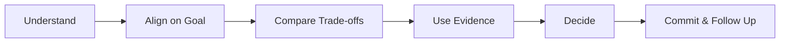
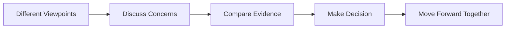
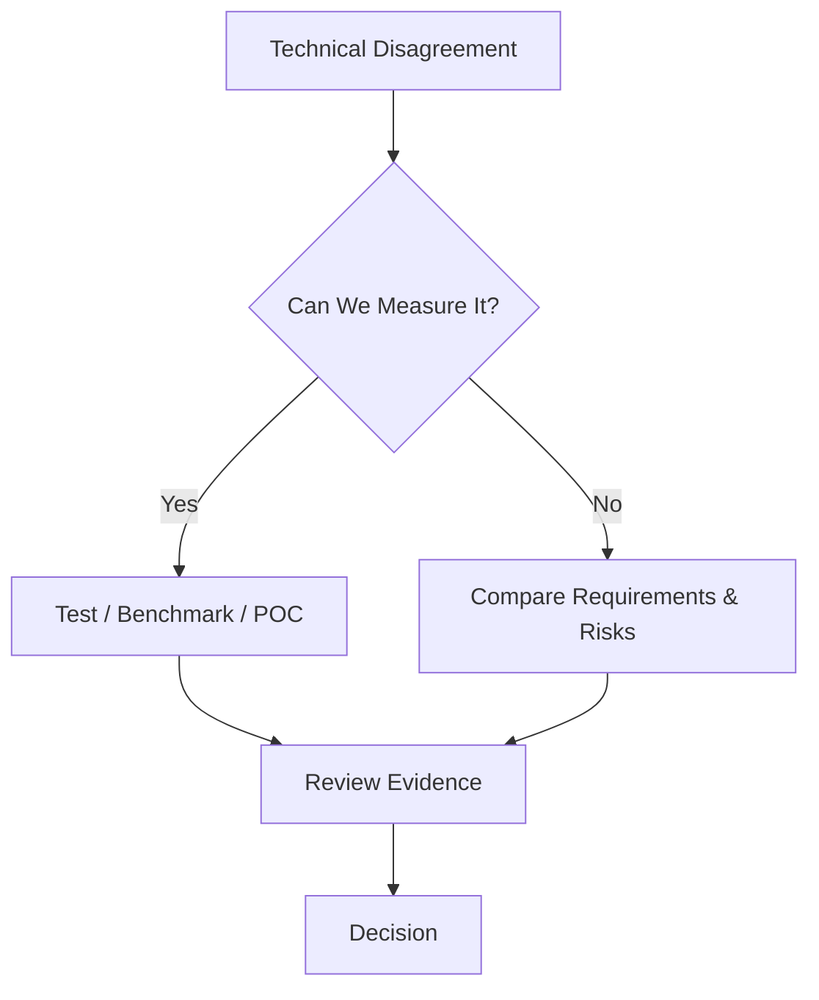
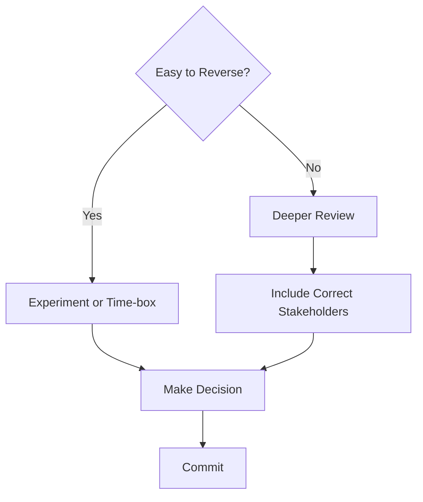
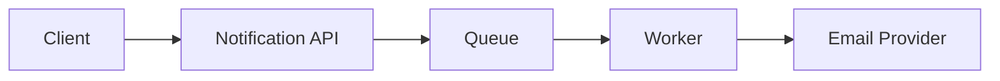

# Conflict & Disagreement

> Understand how to handle workplace disagreements professionally and explain those experiences clearly in behavioral interviews.

## In Short

- Workplace conflict is usually a **difference in approach, priority, ownership, timeline, or risk tolerance**, not a personal fight.
- First understand **what the other person is optimizing for** before defending your solution.
- Make disagreements specific and measurable instead of opinion-based.
- Use **logs, metrics, requirements, benchmarks, incidents, or a small proof of concept** as evidence.
- Agree on who owns the final decision when consensus is not possible.
- Challenge respectfully before the decision; once the decision is made, **commit and support execution**.
- In an interview story, focus mainly on **what you personally did and why**.



---

# Index

1. Understanding Workplace Conflict
2. What Good Conflict Handling Shows
3. Practical Conflict-Resolution Framework
4. Making a Decision When People Disagree
5. Structuring a Conflict Story
6. Practical Developer Example
7. Quick Revision

---

# 1. Understanding Workplace Conflict

Conflict in software teams does not necessarily mean shouting, blaming, or having a bad relationship.

Most professional disagreements happen because two people are optimizing for different things.

For example:

- one engineer wants a **simple synchronous API**,
- another prefers **asynchronous processing for reliability**,
- product wants to **release quickly**,
- engineering wants more time for **testing and stability**,
- one developer prefers a quick fix,
- another wants to remove the underlying technical debt.

Both sides can have reasonable arguments.

The goal is therefore not to eliminate disagreement. Healthy technical disagreement can actually improve a decision.



## Common Areas of Conflict

### Technical Approach

Different architecture, database, API, caching, queue, library, or implementation choices.

### Priority

Product, engineering, QA, security, and operations may consider different work more important.

### Timeline

A stakeholder may want delivery earlier than engineering believes is safe.

### Ownership

Responsibility for a task, defect, service, or decision may be unclear.

### Risk

Two engineers may agree on the goal but have different tolerance for reliability, security, scalability, or operational risk.

---

# 2. What Good Conflict Handling Shows

In behavioral interviews, the disagreement itself is usually less important than **how you behaved during it**.

Strong conflict handling demonstrates four important qualities.

| Quality | What It Means |
|---|---|
| **Professionalism** | You stayed respectful and discussed the problem rather than attacking the person. |
| **Communication** | You listened, asked questions, and explained your concerns clearly. |
| **Judgment** | You compared trade-offs and used evidence rather than opinion or seniority. |
| **Ownership** | You helped reach a decision and supported the team afterward. |

For an experienced developer, a good conflict story should show that you can say:

> “I disagree with this approach because I see a specific risk. Here is the evidence, and here is another option we can evaluate.”

That sounds much stronger than:

> “I knew the other developer's approach was wrong.”

---

# 3. Practical Conflict-Resolution Framework

A simple framework is:

**Understand → Align → Evaluate → Decide → Commit**

## 3.1 Understand the Other Position

Before defending your solution, understand why the other person prefers theirs.

Useful questions include:

- “What risk are you trying to avoid?”
- “Which requirement is most important here?”
- “What concern do you have with this approach?”
- “Are we making different assumptions?”

Often the disagreement becomes much clearer once both sides explain their assumptions.

## 3.2 Align on the Shared Goal

Bring the discussion back to the outcome everyone wants.

For example:

> “We both want the payment flow to remain reliable. The disagreement is whether asynchronous processing is necessary for this release.”

Now the conversation is about solving a reliability problem rather than proving who is correct.

## 3.3 Make the Concern Specific

Avoid vague statements such as:

> “I don't like this design.”

Instead say:

> “The retry flow does not use an idempotency key, so a timeout followed by a retry could create a duplicate payment.”

Specific concerns can be tested and discussed.

Opinions are much harder to resolve.

## 3.4 Compare Trade-offs

For engineering disagreements, compare the options using criteria that matter to the system.

| Criterion | What to Consider |
|---|---|
| Reliability | What happens when dependencies fail? |
| Complexity | How much additional code or infrastructure is required? |
| Delivery | Can we implement it safely within the timeline? |
| Scalability | Will it support expected traffic growth? |
| Maintainability | Can the team easily operate it later? |
| Security | Does it introduce security or compliance risk? |
| User impact | What will users experience? |
| Reversibility | How expensive will it be to change later? |

This moves the conversation from:

**“My solution vs your solution”**

to:

**“Which solution fits our requirements better?”**

## 3.5 Use Evidence

For developers, useful evidence usually includes:

- application logs,
- monitoring metrics,
- production incidents,
- load-test results,
- benchmarks,
- failing tests,
- official documentation,
- security requirements,
- expected traffic,
- or a small proof of concept.

A small experiment is often more useful than another long discussion.



## 3.6 Communicate Professionally

Keep language neutral.

Instead of:

> “This architecture makes no sense.”

Prefer:

> “I see a reliability concern with this architecture. Can we walk through the failure scenario?”

You can also acknowledge part of another person's argument without accepting the whole solution.

> “I agree that Kafka would add unnecessary complexity at our current scale. I still think we need asynchronous processing, so a simpler managed queue may be enough.”

That keeps the conversation collaborative.

---

# 4. Making a Decision When People Disagree

Teams cannot debate forever.

At some point, someone needs to own the decision.

Depending on the organization, that may be:

- the service owner,
- tech lead,
- architect,
- product owner,
- engineering manager,
- or another accountable decision-maker.

The important part is that **decision ownership is clear**.

## Reversible Decisions

If a decision is cheap to change, avoid over-analyzing it.

Examples:

- retry intervals,
- caching configuration,
- logging libraries,
- internal implementation choices,
- feature-flagged behavior.

Use:

- a proof of concept,
- an experiment,
- a feature flag,
- or a time-boxed implementation.

## Hard-to-Reverse Decisions

Spend more time on decisions with major migration cost, security impact, or long-term consequences.

Examples:

- choosing the primary database,
- authentication architecture,
- storing sensitive data,
- core event schemas,
- major service boundaries.



## Disagree, Then Commit

You should raise meaningful concerns before a decision is finalized.

Once the responsible owner makes the decision:

1. clarify the chosen approach,
2. document important reasoning when necessary,
3. support implementation,
4. monitor the result,
5. reopen the decision only when meaningful new evidence appears.

This is an important sign of professional maturity.

Serious **security, legal, ethical, or safety risks** are different; those may require formal escalation rather than simply accepting the decision.

---

# 5. Structuring a Conflict Story

A conflict story works well with **STAR + Learning**.

```text
Situation → Task → Action → Result → Learning
```

## Situation

Briefly explain:

- what you were working on,
- who was involved,
- what the disagreement was,
- and why it mattered.

Keep this part short.

## Task

Explain what **you were responsible for**.

For example:

> “I owned the backend notification service and was responsible for improving its reliability before release.”

## Action

This should be the largest part of the story.

Explain what **you personally did**:

- listened to the other viewpoint,
- identified the actual disagreement,
- gathered evidence,
- compared trade-offs,
- proposed alternatives,
- created a proof of concept,
- involved the appropriate decision-maker,
- and supported the final decision.

Use **“I”** when explaining your contribution.

## Result

Explain what changed.

Useful results may include:

- successful delivery,
- improved reliability,
- reduced defects,
- avoided rework,
- better performance,
- clearer ownership,
- or stronger team alignment.

Use numbers only when you genuinely have them.

## Learning

End with one short professional takeaway.

For example:

> “I learned that agreeing on decision criteria before debating implementations makes technical discussions much more productive.”

---

# 6. Practical Developer Example

## Scenario

Your team is building a notification service.

A senior engineer wants the API to call the external email provider directly because it keeps the architecture simple.

You believe email should be processed asynchronously through a queue because the provider occasionally becomes slow.

## Situation

During testing, the external provider sometimes responded slowly, causing API requests to wait and occasionally time out.

## Task

You were responsible for improving the notification flow without delaying the upcoming release.

## Action

Instead of immediately arguing for a queue, you first understood the senior engineer's concern.

Their main concern was valid: introducing asynchronous processing would add operational complexity.

You then reviewed:

- API latency,
- timeout logs,
- retry behavior,
- expected notification volume,
- and provider failure scenarios.

The evidence showed that external provider latency was directly affecting API response time.

You proposed a scoped solution:



The public API would remain unchanged.

It would place the email job onto a queue and return quickly, while a worker handled delivery and retries.

You created a small proof of concept to demonstrate the behavior.

After reviewing the trade-offs, the team selected this approach because it improved reliability without unnecessarily expanding the release scope.

## Result

The API was no longer directly blocked by email-provider latency, failed deliveries could be retried separately, and the team kept the release scope manageable.

## Learning

The important part of the story is not:

> “I proved the senior engineer wrong.”

It is:

> “We had different concerns, I used evidence to clarify the trade-offs, and we reached a practical solution that supported the project.”

---

# 7. Quick Revision

Remember this sequence:

```text
Listen
  ↓
Understand the concern
  ↓
Align on the shared goal
  ↓
Make the disagreement specific
  ↓
Compare trade-offs
  ↓
Use evidence
  ↓
Make a decision
  ↓
Commit and follow up
```

For behavioral interviews, the strongest conflict stories show that:

- conflict does not automatically mean a bad relationship,
- you challenge **ideas rather than people**,
- you listen before defending your position,
- you make technical risks specific,
- evidence is stronger than authority or confidence,
- you understand trade-offs rather than looking for a perfect solution,
- decision ownership becomes clear when consensus is impossible,
- you support the final decision after raising your concerns,
- and you learn something from the experience.

A simple principle to remember is:

> **Respect the person, challenge the idea, use evidence, make the decision, and move forward together.**
