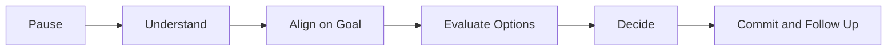
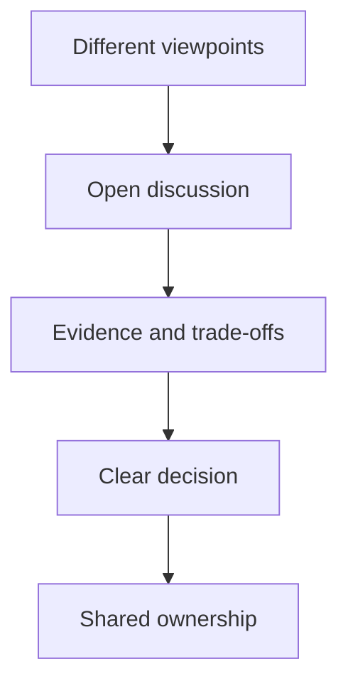
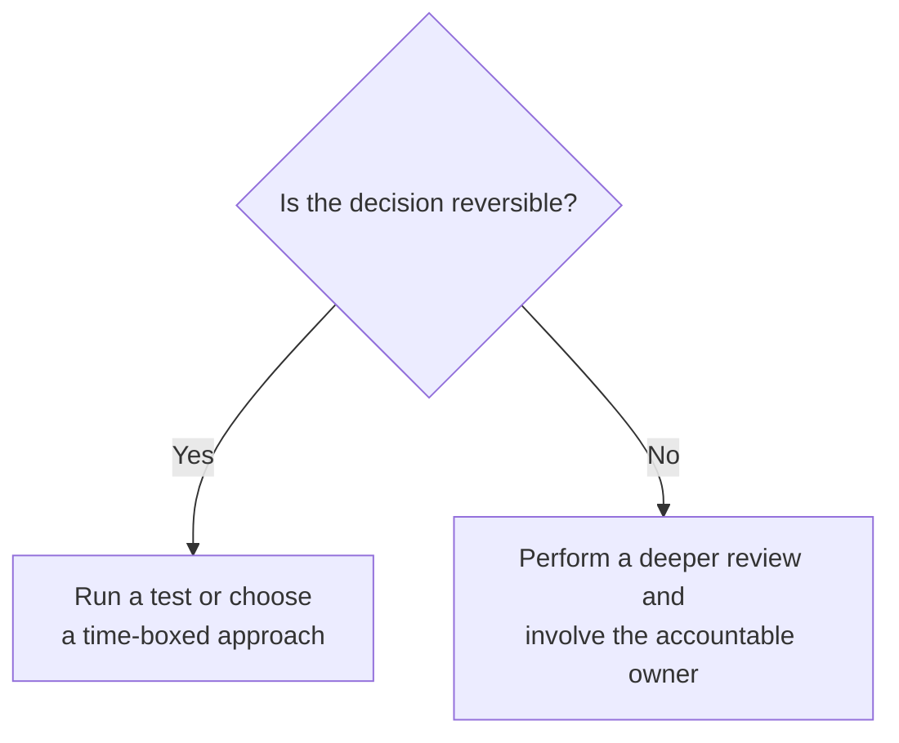

# Conflict & Disagreement

> Explain how to handle workplace conflict professionally and present those experiences clearly in behavioral interviews.

## In short

- Workplace conflict is usually a difference in technical approach, priority, ownership, timeline, or risk tolerance — not a personal fight.
- Work the sequence: pause, understand the other position, align on the shared goal, compare options against stated criteria, decide, then commit.
- Make the disagreement specific. “I do not like this solution” cannot be evaluated; “this retries the payment without an idempotency key, so a timeout can double-charge” can.
- Bring evidence — logs, metrics, incident history, a benchmark, a small proof of concept. Seniority is not evidence, and neither is confidence.
- Match the ceremony to reversibility: reversible decisions get a time-boxed experiment, hard-to-reverse ones get a deeper review with the accountable owner.
- Challenge before the decision, support it afterward. Reopening a settled decision without new evidence is its own delivery risk.
- Use **“I”** for your own contribution so the interviewer can tell what you actually did.



**Interview answer:** Open with what each side was optimizing for, so the disagreement sounds reasonable rather than petty. Spend the middle on how you understood their concern and what evidence you brought — that is the part being evaluated. Close with how the decision was made, that you supported it, and what you changed in how you approach disagreements.

**Gotcha:** Telling the story as a complaint. If the message is “they were difficult and eventually accepted that I was right,” the interviewer hears an ego risk, however correct you were.

---

# 1. Understanding Conflict and Disagreement

Conflict does not always mean shouting, blaming, or having a damaged relationship.

In a professional environment, conflict often appears as a difference in technical approach, project priority, ownership, timeline, quality expectations, communication style, product requirements, or risk tolerance.

For example, one developer may prefer releasing a small change quickly, while another may want to redesign the entire module before release. Both people may have reasonable intentions, but they are optimizing for different outcomes.

A healthy disagreement can improve a decision when the team discusses it respectfully and uses evidence.



The objective is not to avoid every disagreement. The objective is to prevent disagreement from becoming personal, unproductive, or harmful to delivery.

---

# 2. Why Interviewers Ask About Conflict

Interviewers use conflict-related discussions to understand how you behave when collaboration becomes difficult.

They are usually evaluating whether you can:

- remain calm under pressure,
- listen to another person,
- separate the problem from the person,
- explain your position clearly,
- use evidence instead of ego,
- accept feedback,
- compromise when appropriate,
- escalate responsibly,
- and support the final decision.

For an experienced developer, interviewers also expect signs of maturity. They want to know that you can challenge an idea without damaging trust.

A strong response communicates:

> “I can disagree openly, discuss trade-offs objectively, and continue working constructively after a decision is made.”

---

# 3. Common Types of Workplace Conflict

**Technical approach.** Two engineers prefer different implementations — one wants a synchronous API call, another recommends an asynchronous queue, and the two approaches carry different complexity, latency, and reliability trade-offs. The discussion should focus on system requirements, not personal preference.

**Priority.** Engineering, product, quality assurance, and operations may prioritize different work. Product wants a feature released immediately, engineering wants to resolve performance problems first, QA wants additional regression testing, and operations is concerned about deployment risk. The conflict usually comes from different responsibilities rather than bad intentions.

**Ownership.** Two people may believe the other person is responsible for a task, defect, or decision. This often happens when ownership is not documented, responsibilities overlap, handoffs are incomplete, or assumptions are not communicated. The best response is to clarify ownership and define the next action rather than arguing about blame.

**Timeline.** A stakeholder expects delivery earlier than the engineering estimate. A mature developer explains what work is required, what assumptions affect the estimate, which scope can be reduced, what risks come with acceleration, and what decision is needed.

**Interpersonal.** People may have different communication styles: one person communicates very directly while another prefers more context, or one raises concerns publicly while another prefers private discussion. Not every interpersonal difficulty is intentional, and a direct conversation can often resolve the issue before it becomes larger.

---

# 4. A Practical Conflict-Resolution Framework

**Pause.** Do not react emotionally. Review the facts, identify what is actually being disputed, and avoid assuming negative intent. A short pause prevents a technical disagreement from becoming personal.

**Understand.** Ask questions before defending your own position: “Can you walk me through the main concern?”, “Which requirement do you think this approach does not cover?”, “What risk are you trying to avoid?”, “Which assumption are we making differently?” This shows that you are trying to solve the problem, not simply win the discussion.

**Align on the shared goal.** Many disagreements become easier when everyone agrees on the outcome — releasing safely, improving reliability, reducing latency, meeting a compliance requirement, simplifying maintenance, or delivering within a deadline.

> “We both want the payment flow to remain reliable. The disagreement is whether we should add a queue now or keep the current flow for this release.”

This separates the shared objective from the implementation debate.

**Evaluate options** using clear criteria.

| Criterion | Questions to Consider |
|---|---|
| User impact | Which option provides a better user experience? |
| Reliability | What happens when a dependency fails? |
| Complexity | How much new code and infrastructure are required? |
| Delivery time | Can the option be delivered safely within the timeline? |
| Scalability | Will the solution handle expected growth? |
| Maintainability | Can the team support it easily? |
| Security | Does it introduce security or compliance risk? |
| Reversibility | Can the decision be changed later without major cost? |

Evidence may include logs, metrics, production incidents, benchmarks, a small proof of concept, documentation, or feedback from domain experts.

**Decide.** A decision may be made through team consensus, an owner responsible for the component, an architecture review, a product decision, or a manager’s judgment. The decision process should be clear — endless debate is also a delivery risk.

**Commit and follow up.** After a decision is made, support the implementation, document the reasoning, monitor the result, and avoid repeatedly reopening the discussion without new evidence. Professional disagreement means you can challenge a decision before it is made and still support the team after it is made.

---

# 5. How to Structure a Conflict Story

STAR carries the story: set the context, state what you were responsible for, spend most of the answer on what you personally did, then give the outcome. How much time each part deserves and what makes each one strong is covered in [The STAR Method](star-method.md). A conflict story adds a sixth beat — a short **Learning** point after the Result — because a disagreement that changed nothing about how you work is a weaker story.

What each part carries in a conflict story:

| Part | What to include |
|---|---|
| Situation | The project, the people or teams involved, the business impact, and the disagreement itself. Keep it brief. |
| Task | Why your involvement mattered: you owned the backend service, you were responsible for release readiness, you had to align engineering and product, or you needed to resolve a design decision. |
| Action | Listening to the other viewpoint, asking questions, reviewing data, comparing trade-offs, proposing a compromise, creating a proof of concept, involving the right decision-maker, documenting the decision, following up after implementation. Use **“I”** when describing your contribution, while still acknowledging the team. |
| Result | Successful delivery, reduced defects, improved latency, avoided rework, better team alignment, a reusable decision process, or a stronger working relationship. Use numbers when available, but do not invent metrics. |
| Learning | What changed in your approach afterward. |

> “I learned to align on decision criteria before discussing solutions. It keeps technical discussions focused and reduces unproductive debate.”

---

# 6. Technical Disagreement Example

## Scenario

A team was building a notification service. A senior engineer recommended sending emails directly from the API request. You believed a queue was necessary for reliability.

## Situation

The notification endpoint depended directly on an external email provider. During provider latency, requests were becoming slow and occasionally timing out.

## Task

You were responsible for improving reliability without delaying the upcoming release.

## Action

You first discussed the senior engineer’s concern. The main concern was that introducing a queue would increase operational complexity.

Instead of arguing only from preference, you collected:

- API latency data,
- timeout logs,
- retry behavior,
- expected notification volume,
- and the impact of provider failures.

You then proposed two options:

1. introduce a queue immediately for all notifications, or
2. use a queue only for email delivery while keeping the public API unchanged.

You created a small proof of concept showing that the API could return quickly while a worker handled delivery and retries. The team selected the second option because it improved reliability without expanding the release scope too much.

## Result

The API was no longer blocked by the email provider. Failed deliveries could be retried safely, and the release remained on schedule.

## Learning

The strongest part of this story is not that one person was right. The strongest part is that the disagreement was resolved using evidence, trade-offs, and a scoped implementation.

---

# 7. Priority and Delivery Conflict Example

## Scenario

The product manager wanted to release a feature before an important customer demonstration. Engineering believed the feature needed more testing.

## Situation

The feature worked in normal cases, but integration testing had identified failures when an external service was unavailable.

## Task

You needed to communicate the risk and help the team find a practical release plan.

## Action

You avoided saying only, “The feature is not ready.”

Instead, you explained:

- the failing scenario,
- the probability and impact,
- the time required for a complete fix,
- and the available alternatives.

You proposed releasing the basic feature behind a feature flag for the demonstration while keeping it disabled for general users. The team also added monitoring and scheduled the reliability fix before full rollout.

## Result

The demonstration was completed successfully without exposing all users to an unstable flow. Product achieved the immediate business goal, and engineering preserved release safety.

## Learning

Good conflict handling often means finding a third option rather than choosing between two extreme positions.

---

# 8. Conflict with a Manager or Senior Engineer

Disagreeing with a manager or senior engineer can be uncomfortable, but silence is not always professional. If a decision creates meaningful risk, an experienced developer should raise the concern respectfully.

**Focus on the decision, not the person.** Avoid language that attacks competence. Instead of “This design is wrong,” say:

> “I am concerned that this design may create duplicate payments during retries. Can we review how idempotency will be handled?”

The second statement identifies a concrete risk and invites discussion.

**Choose the right setting.** A public discussion may be suitable for a technical design review, but a sensitive interpersonal concern is usually better handled privately. Use private communication when feedback may embarrass someone, when emotions are already high, when the issue concerns communication style, or when the discussion needs more context.

**Bring evidence.** Seniority does not make a person automatically correct, but neither does confidence. Useful evidence includes a failing test, a production log, a security requirement, a benchmark, a customer impact, or official documentation.

**Accept the final decision.** After presenting your concern clearly, the owner may still choose another approach. At that point, document the decision when appropriate, clarify the risk owner, support execution, and monitor the agreed indicators. An exception is when the decision creates serious security, legal, ethical, or safety concerns — those cases may require formal escalation.

---

# 9. When Consensus Is Not Possible

Not every disagreement ends with everyone agreeing, and teams still need a decision. A practical decision model turns on reversibility.



## Reversible Decisions

For decisions that are easy to change, run an experiment, use a feature flag, create a proof of concept, time-box the approach, or compare metrics after release.

Examples: choosing a logging library, changing an internal API format, testing a caching strategy, or adjusting a retry interval.

## Hard-to-Reverse Decisions

For decisions with a high migration cost or serious risk, review requirements carefully, include security or architecture stakeholders, document alternatives, and make decision ownership explicit.

Examples: selecting a core database, changing an authentication model, storing sensitive customer data, or adopting a long-term event schema.

---

# 10. Communication Patterns That Work

**Use neutral language.** Prefer “I see a different trade-off,” “I may be missing some context,” “Let us compare the failure cases,” “What would make this option safer?”, and “Can we agree on the decision criteria?” Avoid “You never understand,” “That makes no sense,” “I already told you,” “This is obviously wrong,” and “Everyone agrees with me.”

**Acknowledge valid points.** You do not need to accept the entire argument to recognize a valid concern.

> “I agree that adding Kafka would be too heavy for the current volume. I still think we need asynchronous processing, so a managed queue may be a better middle ground.”

This creates progress without pretending that all views are identical.

**Be specific.** Vague disagreement creates confusion. Instead of “I do not like this solution,” say:

> “The solution retries the payment request, but it does not use an idempotency key. A timeout could therefore create a duplicate charge.”

Specific concerns are easier to evaluate and resolve.

**Avoid message-only escalation.** Long text threads can increase misunderstanding. When a discussion becomes repetitive, schedule a short call, draw the flow, review data together, and capture the final decision afterward. For technical discussions, a simple diagram often resolves confusion faster than many messages.

---

# 11. What Strong Conflict Handling Looks Like

A mature conflict story normally includes the following qualities.

| Quality | What it looks like |
|---|---|
| Professional behavior | You remained respectful, did not blame or insult anyone, addressed the issue directly, and avoided unnecessary escalation. |
| Collaborative thinking | You listened before responding, understood the other person’s goal, looked for shared outcomes, and considered compromise. |
| Sound decision-making | You used facts and evidence, explained trade-offs, involved the correct owner, and avoided endless debate. |
| Ownership | You helped move the situation toward resolution, supported the final decision, followed up on the result, and learned from the experience. |

A conflict story becomes weak when the main message is:

> “The other person was difficult, and eventually they accepted that I was right.”

A stronger message is:

> “We had different concerns, I created clarity around the trade-offs, and we reached a decision that supported the project.”

---

# 12. Preparing Your Own Conflict Story

Create a small story bank before an interview. Choose experiences from areas such as technical architecture, code review, project estimation, production incidents, release readiness, product scope, quality versus speed, ownership boundaries, or communication problems.

Use the following template.

```markdown
## Story Title

### Situation
What project were you working on?
What was the disagreement?
Why did it matter?

### Task
What were you responsible for?

### Action
How did you understand the other viewpoint?
What evidence did you use?
How did you communicate?
What options or compromises did you propose?
Who made the final decision?

### Result
What changed?
What business, technical, or team outcome followed?

### Learning
What would you repeat or improve next time?
```

## Story Selection Checklist

Use a story where the conflict was real but professional, you played an active role, your actions are easy to explain, the result was meaningful, and you can discuss the other person respectfully. Avoid choosing a story involving confidential details that cannot be explained safely.

---

# 13. Quick Revision Summary

Handling conflict is a sequence: stay calm, understand the other viewpoint, align on the shared goal, make the disagreement specific, compare options using evidence, agree on who owns the decision, commit after the decision, then follow up and learn.

For behavioral interviews, remember:

- Conflict is not automatically negative.
- Respect matters as much as the final technical decision.
- Strong developers challenge ideas, not people.
- Evidence is more persuasive than authority or confidence.
- A practical compromise can be better than winning the argument.
- After the decision, the team should move forward together.
- The best stories show communication, judgment, ownership, and learning.

Handling conflict well does not mean avoiding difficult conversations. It means being able to say:

> “I disagree, here is the risk I see, here is the evidence, and here is a constructive way forward.”

That combination of honesty, respect, and ownership is what makes conflict management a valuable professional skill.
