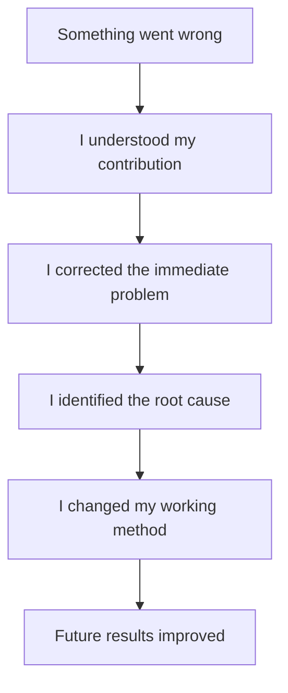
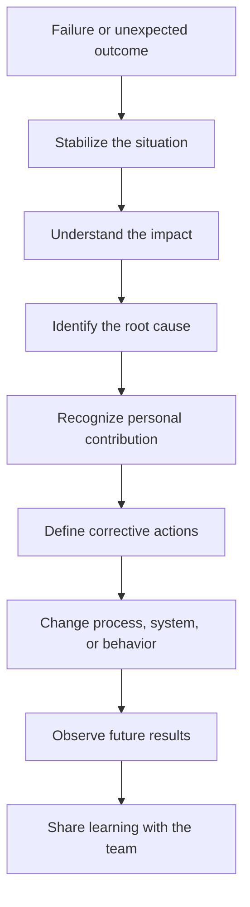

# Failure & Learning

> Understand how to discuss failures professionally, show ownership, and demonstrate meaningful learning during interviews.

## In short

- The question is not whether you failed. It is whether you can name your own part, correct it, and change something afterward.
- Pick a real, specific, resolved failure in which you personally made a decision — not a disguised strength like “I work too hard.”
- Own the part that was under your control. External factors can be stated, but they cannot be the explanation.
- Separate the immediate correction (roll back, fix the data, tell stakeholders) from the long-term improvement (tests, checklists, monitoring, idempotency). A mature answer has both.
- Learning must be concrete: “I added integration tests for duplicate imports and required production-like data before release,” not “I learned to test more carefully.”
- Weight the answer toward recovery and improvement — roughly a third on the learning — rather than on describing the problem.
- Avoid failures that raise a real hiring concern: dishonesty, unaddressed security negligence, blaming colleagues, or anything still unresolved.



**Interview answer:** State the failure plainly in one or two sentences — no cushioning. Say which decision or assumption of yours contributed, then what you did to contain it and what the impact was. Spend the rest of the answer on the root cause and the specific change you made afterward, and close with the evidence that the change worked.

**Gotcha:** A story where the failure turns out to be someone else's fault. Even when other people genuinely contributed, an answer that spends its time on requirements, QA, or the client reads as an inability to see your own part.

---

# 1. What “Failure & Learning” Means

Failure and learning questions are not mainly about proving that you made a mistake.

They are used to understand:

- How you react when something goes wrong
- Whether you take responsibility
- How you analyze problems
- Whether you improve your process
- Whether the same failure is likely to happen again

A strong answer does not make you look perfect. It makes you look **self-aware, dependable, and capable of growth**.

The most important part is not the failure itself. The most important part is the change that happened afterward.

---

# 2. Why Interviewers Ask About Failure

Interviewers know that every experienced developer has faced incidents, wrong estimates, design mistakes, communication gaps, or production issues. They are checking whether you respond with maturity, which means they are evaluating:

- **Accountability.** Do you accept your part in the outcome, or do you blame another developer, the client, the manager, or the requirement?
- **Self-awareness.** Can you clearly explain what you misunderstood, overlooked, or handled poorly?
- **Problem-solving.** Did you only fix the visible issue, or did you understand the deeper cause?
- **Adaptability.** Did you change your process after the failure?
- **Emotional maturity.** Can you talk about a difficult experience calmly and professionally?
- **Trustworthiness.** Would the interviewer feel safe assigning you responsibility in a real project?

---

# 3. What Makes a Strong Failure Story

A strong failure story contains five important elements.

## 3.1 A real professional situation

The example should feel genuine and specific.

Good examples include:

- A production deployment that caused an issue
- A feature that was delivered late
- A requirement that was misunderstood
- An API design that did not scale
- A database migration that required rollback
- A task where risks were not communicated early
- A technical decision that created unnecessary complexity

Avoid examples that sound fake, such as:

> “My biggest failure is that I work too hard.”

That type of answer avoids the question and does not show learning.

## 3.2 Clear personal responsibility

You do not need to take responsibility for everything. You should clearly explain the part that was under your control.

> “The requirement changed during development, but I also failed to confirm the final acceptance criteria before implementation.”

This is better than:

> “The requirement was unclear, so the client caused the problem.”

## 3.3 Meaningful impact

Explain why the failure mattered. The impact may include customer inconvenience, delayed delivery, rework, additional support effort, downtime, incorrect data, team confusion, reduced confidence, or technical debt.

The impact does not need to be catastrophic. It only needs to be meaningful.

## 3.4 Corrective action

Show how you handled the immediate situation: rolled back a deployment, fixed corrupted data, informed stakeholders, re-prioritized tasks, added missing tests, paired with another engineer, created a recovery plan, or documented the issue.

## 3.5 Long-term learning

This is the strongest part of the answer. Describe what changed after the incident — added deployment checklists, improved estimation practices, introduced peer review, added monitoring and alerts, started validating assumptions earlier, broke large tasks into milestones, added integration tests, used feature flags for risky releases, or improved communication with product and QA.

---

# 4. Choosing the Right Example

Not every failure is suitable for an interview. Choose an example that allows you to show growth.

## 4.1 Good characteristics

A useful example should be:

- Recent enough to explain clearly
- Important enough to show responsibility
- Safe to discuss without exposing confidential information
- Connected to your own decisions or actions
- Resolved or improved
- Supported by a clear lesson

## 4.2 Avoid examples that create unnecessary concern

Be careful with examples involving dishonesty, security negligence without proper recovery, repeated irresponsible behavior, serious policy violations, blaming colleagues, a failure that is still unresolved, or a weakness that is essential to the role and has not improved.

For example, for a backend engineering role, saying that you regularly ignore testing and still do not believe in it would create concern. However, explaining that you once relied too heavily on manual testing, experienced a regression, and then introduced automated tests can become a strong learning story.

---

# 5. Structuring the Story

STAR gives the shape — context, your responsibility, what you did, what happened — and [The STAR Method](star-method.md) covers how much time each part deserves. Failure stories need one part that STAR does not have: **Learning**, the change you made afterward. Without it, the story is only a confession.

The example below runs a single failure through all five beats.

| Part | What it carries | Example |
|---|---|---|
| Situation | The project, your role, the goal, the relevant constraint | “I was working on a payment reconciliation service that imported transaction files from an external provider.” |
| Task | What you were responsible for | “I was responsible for implementing the import flow and ensuring duplicate transactions were not created.” |
| Action | What you did before and after the problem, including the decision that contributed to the failure | “I added validation based on the file name and upload date. I assumed the provider would never send the same file with a different name.” |
| Result | What happened, with measurable impact where possible | “A repeated file was uploaded with a new name, which created duplicate reconciliation records and required manual correction.” |
| Learning | How your behavior and process changed | “I replaced file-name validation with transaction-level idempotency, added a checksum, introduced integration tests, and documented the provider assumptions. Since then, duplicate imports have been prevented automatically.” |

---

# 6. The Learning Loop

A failure becomes valuable only when it creates a better system or better behavior.

## 6.1 Practical learning model



## 6.2 Immediate correction vs long-term improvement

These two should be separated. A mature answer includes both.

| Immediate correction | Long-term improvement |
|---|---|
| Roll back the release | Add automated rollback support |
| Fix incorrect records | Add data validation and constraints |
| Inform the customer | Improve incident communication |
| Patch the API | Add contract and integration tests |
| Complete the delayed task | Improve estimation and milestone tracking |

---

# 7. Practical Software Engineering Example

## 7.1 Scenario

A backend engineer releases an API optimization that unexpectedly increases database load.

## 7.2 Complete answer structure

### Situation

I was working on an endpoint that returned policy and payment information. The endpoint had become slow because it was making several database queries for each record.

### Task

I was responsible for improving the response time before an upcoming client demonstration.

### Action

I changed the query logic and added eager loading. I tested it with a small local dataset and saw a significant improvement. However, I did not test the query with production-like data volume or review the generated SQL carefully.

After deployment, the query created a very large join and increased database CPU usage. We noticed higher latency on other endpoints.

I informed the team, reverted the change, and restored the previous version. I then reproduced the issue with production-like data and reviewed the execution plan.

### Result

The service returned to normal after the rollback. The release was delayed by one day, and we had to spend additional time validating the corrected approach.

### Learning

I learned that query optimization should not be judged only by local response time. It must also be evaluated using realistic data volume, execution plans, memory usage, and database impact.

After that incident, I introduced a simple performance checklist for high-risk query changes:

- Test with production-like data
- Review the generated SQL
- Use `EXPLAIN ANALYZE`
- Compare query count and execution time
- Add monitoring before and after deployment
- Release risky changes behind a feature flag

The corrected version reduced the endpoint response time without increasing database load.

## 7.3 Why this story works

This example shows technical responsibility, honest acknowledgment of an incomplete test approach, fast recovery, root-cause analysis, process improvement, and better engineering judgment. It does not depend on blaming the database, QA team, or deadline.

---

# 8. Alternative Example: Missed Delivery

Failure stories do not always need to involve production incidents. A missed delivery can also be a strong example when explained correctly.

**The situation:** you estimated that a feature would take five days, but it required nine days.

**A weak explanation** sounds defensive:

> “The requirement kept changing, and another developer did not finish their part.”

**A strong explanation** keeps the external factors but leads with your own decisions:

> “I initially estimated the task based only on implementation effort. I did not include the time required for external API testing, QA feedback, and migration validation. When I realized the timeline was at risk, I informed the project manager, divided the feature into critical and optional parts, and delivered the critical flow first.
>
> The experience changed how I estimate work. I now break features into smaller tasks, identify external dependencies, include testing and review effort, and communicate uncertainty instead of presenting an early estimate as a fixed commitment.”

That version demonstrates better planning, early communication, scope prioritization, improved estimation, and professional ownership.

---

# 9. How to Show Ownership Without Self-Blame

Ownership does not mean saying “everything was my fault.” It means clearly identifying what you could control. A balanced answer accounts for four things: the external factors, your own decisions, your response once the problem appeared, and the improvement you made afterward.

> “The requirements were still evolving, but I should have identified the ambiguity earlier and requested written acceptance criteria before development.”

This answer recognizes the external situation while still showing ownership.

## 9.1 Useful ownership language

Use phrases such as:

- “I assumed…”
- “I did not validate…”
- “I underestimated…”
- “I should have communicated earlier…”
- “My approach did not account for…”
- “I focused too much on…”
- “I realized that…”
- “I changed my process by…”

Avoid phrases such as:

- “It was not my fault.”
- “QA should have caught it.”
- “The manager forced us.”
- “The client kept changing everything.”
- “Another developer broke it.”
- “There was nothing I could do.”

Even when other people contributed, focus mainly on your own decisions and response.

---

# 10. Turning Learning Into Evidence

Saying “I learned to communicate better” is too general. A strong answer shows evidence.

A weak learning statement:

> “I learned to test more carefully.”

A strong learning statement:

> “I added integration tests for duplicate imports, introduced idempotency keys, and required production-like test data before releasing changes to the import pipeline.”

The second statement is stronger because the learning produced visible action.

## 10.1 Evidence categories

| Category | Examples |
|---|---|
| Process | Checklist created, review process added, estimation method changed, acceptance criteria documented, risk review introduced |
| Technical | Tests added, monitoring added, validation improved, feature flags introduced, database constraints added, retry logic corrected, idempotency implemented |
| Communication | Earlier escalation, clearer status updates, written decisions, better stakeholder alignment, explicit risk communication |
| Outcome | Fewer incidents, faster recovery, more accurate estimates, reduced duplicate work, better deployment confidence, improved team adoption |

---

# 11. Communicating the Story Naturally

A failure answer should sound reflective, not memorized.

**Balance the parts.** Spend approximately 20% on context, 20% on the mistake, 25% on recovery, and 35% on learning and improvement. Do not spend most of the answer describing the problem.

**Keep the story focused.** A clear answer normally contains one project, one failure, one main responsibility, one recovery path, and one lasting improvement. Too many details can hide the main lesson.

**Be specific but professional.** Instead of “The deployment went badly,” say:

> “The deployment introduced duplicate event processing because the consumer retry flow was not idempotent.”

Instead of “I improved communication,” say:

> “I started sharing delivery risks as soon as a dependency threatened the timeline rather than waiting until the deadline was close.”

**End with confidence.** The ending should show how the experience improved your judgment.

> “That experience made me more careful about validating assumptions in distributed workflows. Since then, I treat idempotency and retry behavior as design requirements rather than implementation details.”

---

# 12. Quick Preparation Framework

Before an interview, prepare two failure stories.

**Story A — a technical failure:** a production issue, performance problem, incorrect data handling, weak design decision, missed edge case, or deployment rollback.

**Story B — an execution or collaboration failure:** a missed estimate, delayed communication, requirement misunderstanding, poor prioritization, incomplete stakeholder alignment, or taking on too much work.

## 12.1 Preparation template

```markdown
### Situation
What project was involved?

### Responsibility
What was I expected to deliver?

### Failure
What went wrong?

### My Contribution
Which decision, assumption, or behavior was under my control?

### Immediate Response
How did I stabilize or correct the situation?

### Root Cause
Why did the failure happen?

### Change
What process, behavior, or technical system did I improve?

### Evidence
What improved afterward?
```

## 12.2 Final quality check

Before using the story, confirm that it answers these questions:

- Is the failure real and specific?
- Is my responsibility clear?
- Have I avoided blaming others?
- Did I explain the impact?
- Did I show corrective action?
- Is the learning concrete?
- Did my behavior or system change?
- Can I explain the story in two to three minutes?

---

# 13. Final Takeaway

A strong failure story is not a confession. It is evidence of professional growth.

The interviewer should finish your answer with three impressions:

1. You are honest enough to recognize failure.
2. You are responsible enough to correct it.
3. You are thoughtful enough to learn from it.

That combination makes failure a positive part of your professional story.
