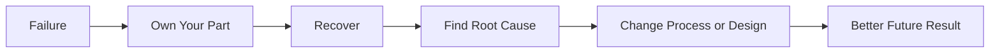
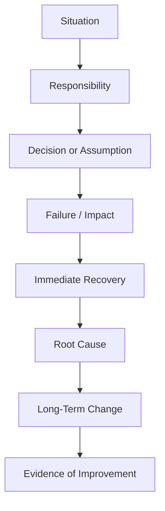

# Failure & Learning

> Learn how to discuss a professional failure with ownership, explain how you recovered, and show what permanently changed afterward.

## In Short

- Choose a **real, specific, resolved** professional failure.
- Clearly explain **your contribution** instead of blaming requirements, QA, clients, or teammates.
- Separate the **immediate fix** from the **long-term improvement**.
- Spend more time explaining what changed afterward than defending what happened.
- Make the learning concrete: tests added, monitoring introduced, estimation changed, assumptions validated, or communication improved.
- End with evidence that the same type of problem became less likely to happen again.



---

# 1. What Failure & Learning Means

Behavioral failure questions are not mainly about whether you have made mistakes. Every experienced developer eventually deals with incorrect assumptions, production issues, missed estimates, design problems, or communication gaps.

The interviewer is trying to understand how you behave **after something goes wrong**.

They are mainly evaluating:

- **Accountability** — Can you recognize your contribution?
- **Self-awareness** — Do you understand what you should have done differently?
- **Problem-solving** — Can you stabilize the situation and find the real cause?
- **Adaptability** — Did you change your approach afterward?
- **Professional maturity** — Can you discuss failure calmly without becoming defensive?

A strong story does not make you look perfect. It shows that you can be trusted with responsibility.

---

# 2. What Makes a Strong Failure Story

A useful failure story normally contains five parts.

## 2.1 Real Situation

Choose something specific enough that you can explain the decision, impact, recovery, and learning clearly.

Good engineering examples include:

- Production incidents
- Performance problems
- Incorrect data handling
- Missed delivery estimates
- Requirement misunderstandings
- Database migrations that required rollback
- Technical designs that did not behave as expected

The failure does not need to be catastrophic. It only needs to have had a meaningful consequence.

## 2.2 Personal Ownership

Identify the part that was under your control.

Instead of:

> “The requirements were unclear.”

A stronger explanation is:

> “The requirements were still changing, but I should have confirmed the final acceptance criteria before implementation.”

Ownership does not mean accepting responsibility for everything. It means recognizing what **you could have handled differently**.

## 2.3 Impact

Briefly explain why the failure mattered.

For example:

- Delivery was delayed
- Users experienced incorrect behavior
- Data required manual correction
- Database load increased
- The team spent additional time on recovery
- Stakeholders lost confidence in the release

Keep this part factual and concise.

## 2.4 Immediate Recovery

Explain what you did once the problem became clear.

For example:

- Rolled back the deployment
- Restored affected data
- Informed stakeholders
- Reproduced the issue
- Prioritized a safe fix
- Added temporary monitoring

This demonstrates that you can remain effective when something has already gone wrong.

## 2.5 Long-Term Learning

This is the most important part.

Do not stop at:

> “I learned to test more carefully.”

Show what actually changed:

> “I introduced production-like performance testing, started reviewing query execution plans, and added deployment monitoring for high-risk database changes.”

The interviewer should be able to see that the failure changed your engineering behavior.

---

# 3. Structure: STAR + Learning

The standard **STAR** structure — Situation, Task, Action, Result — is a useful way to organize behavioral interview answers. For failure stories, add one more part: **Learning**.

| Part | What to Explain |
|---|---|
| **Situation** | What project or problem were you working on? |
| **Task** | What were you responsible for? |
| **Action** | What decision did you make, and what did you do after the problem appeared? |
| **Result** | What impact did the failure have? |
| **Learning** | What permanently changed afterward? |



For this type of story, **Learning should receive significant attention**. The incident explains what happened; the learning explains why you became a better engineer because of it.

---

# 4. Immediate Fix vs Long-Term Improvement

These are different and both matter.

| Immediate Recovery | Long-Term Improvement |
|---|---|
| Roll back a release | Add safer deployment or feature-flag strategy |
| Correct invalid records | Add validation or database constraints |
| Patch an API | Add contract/integration tests |
| Reduce database load | Add performance testing and monitoring |
| Inform stakeholders about delay | Improve estimation and early risk communication |

An immediate fix proves you can recover.

A long-term improvement proves you learned.

---

# 5. Practical Software Engineering Example

## Scenario

You optimized a backend API, but the change increased database load in production.

### Situation

I was working on an API that returned policy and payment information. Its response time had become slow because the endpoint was performing several database operations for each record.

### Task

I was responsible for improving the endpoint performance before an upcoming release.

### Action

I changed the query logic and introduced eager loading. Local testing showed a significant response-time improvement, so I was confident in the change.

My mistake was that I tested using a relatively small dataset and did not review how the generated SQL would behave with production-scale data.

After deployment, the query produced a large join that increased database CPU usage and affected other endpoints.

I informed the team and reverted the change. Once the service was stable, I reproduced the issue using production-like data and reviewed the query with `EXPLAIN ANALYZE`.

### Result

The rollback restored normal database performance. The optimized release was delayed by one day while we validated a safer implementation.

### Learning

The main lesson was that improving API response time locally does not automatically mean the database query is efficient at scale.

After that incident, I started using a simple checklist for high-risk database changes:

- Test with production-like data volume
- Review generated SQL
- Use `EXPLAIN ANALYZE`
- Compare query count and execution time
- Monitor database CPU and latency after deployment
- Use feature flags where a risky change can be isolated

The corrected implementation improved the endpoint response time without increasing database load.

### Why This Example Works

The story demonstrates:

- Clear personal responsibility
- A technically realistic failure
- Fast recovery
- Root-cause analysis
- A permanent change in engineering practice
- Evidence that the improved approach worked

The failure is useful because the answer ends with **better engineering judgment**, not with the incident itself.

---

# 6. Showing Ownership Naturally

Useful ownership language sounds simple and specific:

- “I assumed…”
- “I underestimated…”
- “I did not validate…”
- “My approach did not account for…”
- “I should have communicated that risk earlier…”
- “After investigating it, I realized…”
- “I changed my approach by…”

For example:

> “The timeline was aggressive, but my estimate also focused too heavily on implementation and did not include enough time for integration testing.”

This acknowledges the surrounding conditions while keeping responsibility clear.

---

# 7. Preparing Your Story

Before an interview, prepare the story as short notes rather than memorizing a full script.

```text
Situation:
What was happening?

Responsibility:
What was I responsible for?

Failure:
What went wrong?

My Contribution:
Which assumption, decision, or action was under my control?

Immediate Response:
How did I stabilize or correct the problem?

Root Cause:
Why did it happen?

Change:
What did I permanently change afterward?

Evidence:
How do I know the new approach worked?
```

A good spoken version should usually be focused enough to explain naturally in around **two to three minutes** without unnecessary project history.

---

# 8. Final Takeaway

A strong failure story follows a simple pattern:

**Something went wrong → I understood my contribution → I fixed the immediate problem → I found the root cause → I changed how I work.**

The interviewer should finish the story thinking:

1. You are honest enough to acknowledge a failure.
2. You are dependable enough to take responsibility and recover.
3. You are thoughtful enough to prevent the same class of problem from repeating.

That is what turns a failure story into evidence of professional growth.
