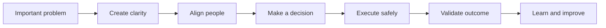
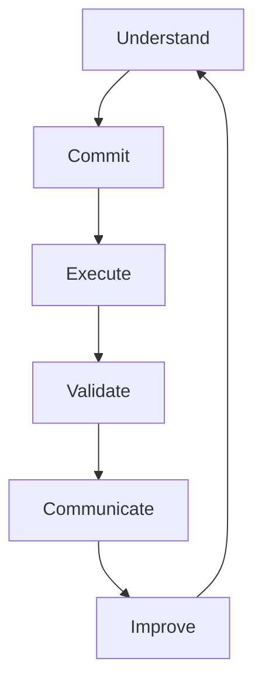
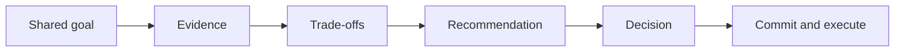
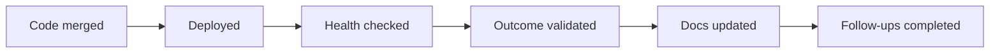
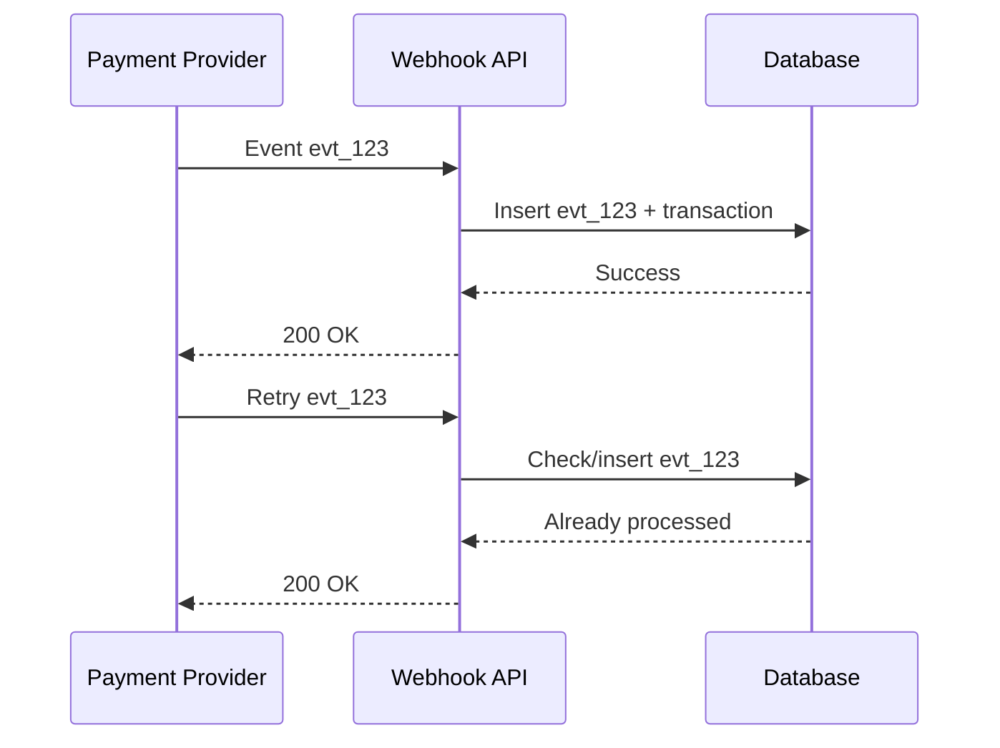
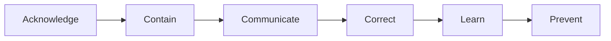

# Leadership & Ownership

> Understand how to demonstrate leadership and ownership through real engineering situations.

## In short

- **Leadership** means creating direction, alignment, and progress. It does not require a manager title.
- **Ownership** means staying responsible for the outcome, not stopping when your assigned coding task is finished.
- Strong engineers create clarity, make decisions, coordinate people, manage risk, validate production results, and improve what happens next.
- Ownership does **not** mean doing everything yourself. You can delegate execution while still owning coordination, risk, and the final outcome.
- In interviews, evidence matters more than claims. Explain the problem, what **you** drove, why you made the decision, how you worked with others, and what changed.
- Use **I** for your contribution and **we** for the team result.
- Quantify impact when real numbers exist. Otherwise, use honest observable outcomes.

---

## 1. Leadership and Ownership

### 1.1 Leadership

Engineering leadership is the ability to help people move toward a shared technical or business goal.

A developer demonstrates leadership when they:

- Turn an unclear problem into a workable plan.
- Guide an important technical decision.
- Coordinate developers, QA, DevOps, product, security, or another team.
- Raise risks early instead of waiting for failure.
- Help teammates become more effective.
- Keep discussion focused on the outcome rather than personal preference.
- Bring structure during incidents or difficult delivery situations.

A formal title is not required. A backend engineer can lead an API redesign, a migration, an incident response, or a cross-team integration.

### 1.2 Ownership

Ownership means behaving as though the final result is your responsibility.

A task-focused engineer may think:

> “My endpoint is complete.”

An ownership-focused engineer continues:

> “Does the full flow work correctly? Is it tested, safely deployable, observable, and actually solving the user or business problem?”

This is close to how current engineering organizations describe ownership: responsibility extends beyond a narrow task, with attention to long-term outcomes and impact outside one team.

### 1.3 Leadership vs Ownership

| Area | Leadership | Ownership |
|---|---|---|
| Main focus | Helping people move forward | Ensuring the result is achieved |
| Core behavior | Direction, influence, coordination | Responsibility, follow-through |
| Typical scope | Team, project, technical decision | Feature, service, incident, outcome |
| Example | Aligning teams on an API contract | Ensuring the API works safely in production |
| Strong signal | Other people become more effective | Important work does not fall through gaps |

They often appear together. If a payment workflow fails repeatedly, ownership means driving the issue to a stable production result; leadership means aligning the people and decisions required to get there.

---

## 2. The Ownership Loop

Ownership should cover the complete engineering lifecycle.

### Understand

Clarify the real problem before building.

Ask about:

- User or business outcome.
- Edge cases and failure scenarios.
- Dependencies.
- Security and compliance constraints.
- Scale and performance expectations.
- Acceptance criteria.

### Commit

Set realistic expectations.

Define:

- Scope.
- Responsibilities.
- Dependencies.
- Major risks.
- Delivery assumptions.

### Execute

Build the solution while actively managing blockers and dependent work.

Ownership here means you do not silently wait for another team, hide uncertainty, or let a known risk reach the deadline unnoticed.

### Validate

Do not treat “code merged” as completion.

Check:

- Automated and integration tests.
- Deployment health.
- Logs, metrics, and alerts.
- Data correctness.
- User or stakeholder acceptance.

### Communicate

Keep the right people informed about:

- Current state.
- Impact.
- Risks.
- Decisions.
- Changes in scope or timeline.
- Next action.

### Improve

After delivery or an incident, capture what should change.

Examples:

- Add missing monitoring.
- Improve test coverage around the failure mode.
- Document a design decision.
- Automate a manual safeguard.
- Improve the release or review process.

---

## 3. Leadership Without Authority

Experienced developers frequently lead people who do not report to them.

The most reliable way to influence is:

### Start with the shared goal

Avoid:

> “My design is better.”

Prefer:

> “We need retries without creating duplicate payments.”

This moves the discussion from personal preference to the required outcome.

### Use evidence

Useful evidence includes:

- Production metrics.
- Incident history.
- Load tests.
- Proof-of-concept results.
- Cost estimates.
- Operational effort.
- Security requirements.
- User feedback.

### Show trade-offs honestly

A mature recommendation includes disadvantages.

For example:

> “This design adds a database table and a little operational complexity, but it gives us reliable deduplication and auditability. For a payment workflow, that reliability is worth the extra complexity.”

### Make ownership clear

Good teams avoid decision ambiguity by identifying who is responsible for driving a decision or outcome. A DRI-style model is useful: gather input broadly, but keep one person clearly accountable for moving the decision forward.

### Change direction when evidence changes

Leadership is not defending your first idea at all costs.

If security, production data, cost, or another constraint changes the situation, update the recommendation and explain why.

---

## 4. Core Behaviors That Show Seniority

### 4.1 Create Clarity

Real requirements are often incomplete.

Suppose product says:

> “Add recurring payments.”

A strong engineer helps clarify:

- Who creates and cancels the mandate?
- Which payment methods are supported?
- What happens after a failed charge?
- Are retries allowed?
- Can the amount change?
- How are provider webhooks handled?
- How is duplicate processing prevented?
- What must be stored for audit and reconciliation?

The leadership behavior is not merely asking questions. It is organizing ambiguity into decisions the team can act on.

### 4.2 Make Decisions With Trade-offs

Engineering decisions rarely have one perfect answer.

Common trade-offs include:

- Speed vs maintainability.
- Reliability vs complexity.
- Cost vs control.
- Scope vs delivery date.
- Immediate fix vs long-term redesign.
- Build vs buy.
- Consistency vs availability.

A strong engineer gathers the important input, recommends an option, explains why, identifies its risks, and knows when the decision should be revisited.

### 4.3 Manage Risk Early

Typical risks include:

- Data loss.
- Duplicate processing.
- Breaking API changes.
- Unsafe database migrations.
- Missing rollback plans.
- Security gaps.
- External dependency failures.
- Performance degradation.
- Missing observability.

Example: before adding a non-null column to a large production table, you may choose to add it as nullable, backfill in batches, add the constraint later, test with production-like volume, and monitor locks and latency.

That is ownership because the engineer is thinking beyond “the migration works on my machine.”

### 4.4 Delegate Without Losing Accountability

Owning a project does not mean personally executing every task.

For a service migration, you might:

- Ask one engineer to update the data model.
- Ask another to prepare migration scripts.
- Coordinate QA validation.
- Work with DevOps on rollout.
- Review monitoring and rollback readiness.
- Own the final go-live decision.

Delegation distributes execution. Ownership keeps the outcome connected.

### 4.5 Follow Through

Strong ownership continues after implementation.

A reliable engineer closes important gaps instead of assuming somebody else will eventually pick them up.

---

## 5. Leadership Across Normal Development

| Stage | What leadership and ownership look like |
|---|---|
| Requirements | Clarify the business problem, edge cases, success criteria, dependencies, and assumptions. |
| Design | Compare options, explain trade-offs, identify failure modes, involve the right reviewers, and record important decisions. |
| Development | Maintain quality, coordinate dependent changes, communicate blockers early, and keep implementation aligned with the intended outcome. |
| Testing | Cover negative paths, integrations, retries, recovery behavior, and data correctness; give QA the technical context they need. |
| Deployment | Review configuration and migrations, define rollback, confirm observability, and communicate release status. |
| Post-release | Check production behavior, validate the business result, close remaining gaps, and capture learning. |

For an experienced developer, the important shift is from **task execution** to **outcome ownership**.

---

## 6. One Practical Example: Duplicate Payment Webhooks

A payment provider retries webhook delivery when it does not receive a successful response. Your service processes the same event twice and creates duplicate transaction records.

### Situation

Duplicate transactions are creating reconciliation problems for finance and reducing confidence in the payment flow.

### Your responsibility

You are asked to fix the issue, but strong ownership goes beyond patching the duplicate record.

### Leadership and ownership in action

1. Trace the duplicate records to repeated provider event delivery.
2. Confirm the provider's retry behavior and identify where idempotency is missing.
3. Propose storing the provider event ID with a database uniqueness guarantee.
4. Make processing transactional so partial updates do not leave inconsistent state.
5. Align the design with payment, database, QA, and operations stakeholders.
6. Add tests for repeated, delayed, and out-of-order events.
7. Add metrics or alerts for duplicate attempts and processing failures.
8. Deploy safely and verify reconciliation after release.
9. Document the pattern so other payment integrations can reuse it.

### Why this is a strong leadership story

It demonstrates:

- **Initiative:** you investigated the system rather than treating each duplicate as an isolated bug.
- **Judgment:** you selected an idempotency approach with a database-level safeguard.
- **Influence:** you aligned multiple stakeholders around the change.
- **Risk management:** you considered retries, partial failure, testing, and observability.
- **Ownership:** you followed the issue through production validation.
- **Reuse:** the solution can become a standard for future integrations.

### Result

Use your real evidence.

For example:

> “Duplicate transaction creation stopped after the change, reconciliation became simpler, and the same idempotency pattern was reused in later payment integrations.”

If you have verified metrics, include them. If not, do not invent numbers.

---

## 7. Presenting Leadership in an Interview

Use STAR for structure, but put most of the detail into **Action** and **Result**.

### Situation

Give only the context needed to understand the stakes.

> “Our payment service was creating duplicate transactions when the provider retried webhook delivery, which affected finance reconciliation.”

### Task

Explain your responsibility.

> “I owned identifying the root cause and making webhook processing reliable before the next release.”

### Action

This is where leadership becomes visible.

Explain:

- What **you** investigated.
- The options you considered.
- Why you chose the final approach.
- Who you aligned with.
- What risk you identified.
- How you kept delivery moving.
- How you validated the change.

### Result

Finish with measurable or observable impact.

Useful evidence includes:

- Lower error or incident rate.
- Faster manual operations.
- Safer deployments.
- Reduced support escalation.
- A reusable pattern adopted by other teams.
- Better monitoring or test coverage.
- Improved delivery confidence.

Then add one specific learning:

> “I learned to treat idempotency as part of the integration contract rather than as an after-release safeguard, so I now review retry behavior during API design.”

### Language to use

Use **I** for your contribution:

> “I proposed the design, coordinated the review, and created the rollout plan.”

Use **we** for the shared outcome:

> “We deployed it safely and adopted the same pattern in two related integrations.”

This sounds collaborative without hiding your personal contribution.

---

## 8. Ownership When Things Go Wrong

Leadership is often easiest to see during failure.

A strong engineer:

- Acknowledges their role accurately.
- Stabilizes the system before debating blame.
- Communicates impact and current actions.
- Finds contributing technical and process causes.
- Fixes the immediate problem.
- Adds practical prevention.
- Shares learning with the team.

Modern SRE practice emphasizes **blameless postmortems**: understand why the system allowed the failure, improve detection and response, and create follow-up actions rather than searching for a person to blame.

Ownership does not mean accepting responsibility for everything. It means being accountable for your decisions, communication, and follow-through.

---

## 9. Final Interview Checklist

Before using a leadership or ownership story, make sure you can clearly show:

### Context
- The problem and why it mattered.
- The relevant technical or business risk.

### Personal contribution
- What **you** were responsible for.
- What you personally decided, proposed, or coordinated.

### Leadership
- How you created clarity.
- How you influenced or aligned people.
- How you helped the team make progress.

### Ownership
- How you managed dependencies and risk.
- How you followed the work through deployment or resolution.
- How you validated the final outcome.

### Technical judgment
- The options or trade-offs you considered.
- Why the chosen approach fit the situation.

### Result
- A real metric or observable improvement.
- The effect on users, the system, the business, or the team.

### Learning
- One specific thing you changed afterward.

---

## Key takeaway

For an experienced developer, leadership is not about sounding like a manager.

It is about showing that you can:

> **understand an important problem, create clarity, align people, make a sound technical decision, manage risk, deliver the result, and improve the system afterward.**

That is what turns a coding story into a leadership and ownership story.

---

### Current references

Reviewed against current public engineering guidance in August 2026:

- [Amazon Leadership Principles — Ownership](https://amazon.jobs/content/en/our-workplace/leadership-principles)
- [GitLab Handbook — Making Decisions](https://handbook.gitlab.com/handbook/leadership/making-decisions/)
- [GitLab Handbook — Effective Delegation](https://handbook.gitlab.com/handbook/leadership/effective-delegation/)
- [Google SRE Workbook — Postmortem Culture](https://sre.google/workbook/postmortem-culture/)
