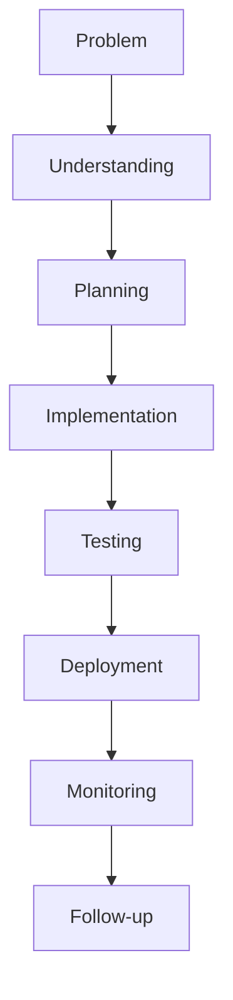
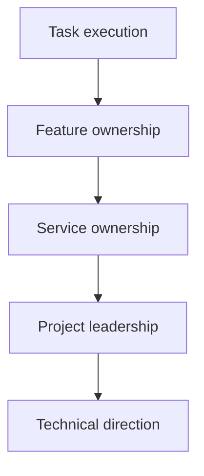
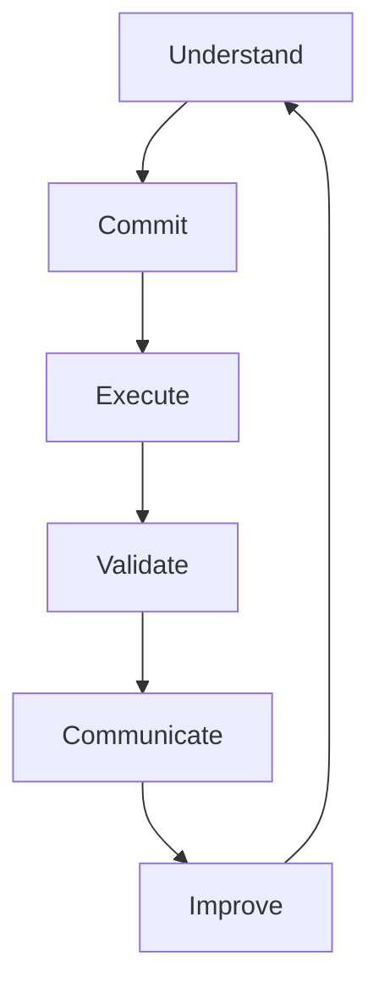
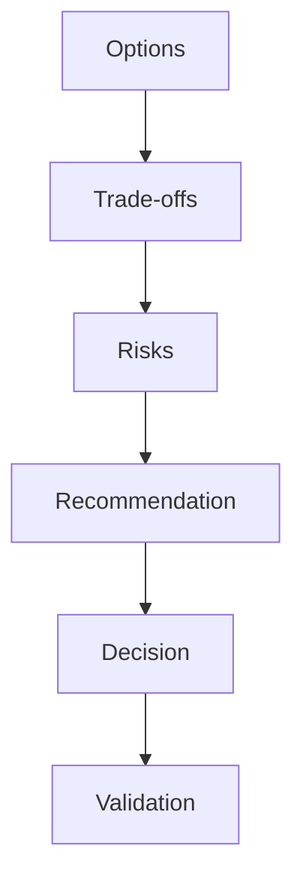
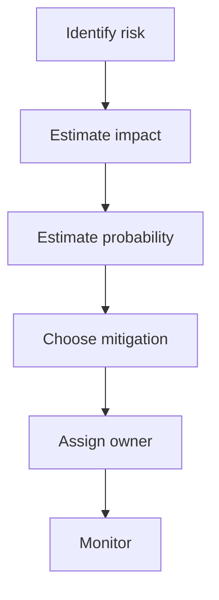
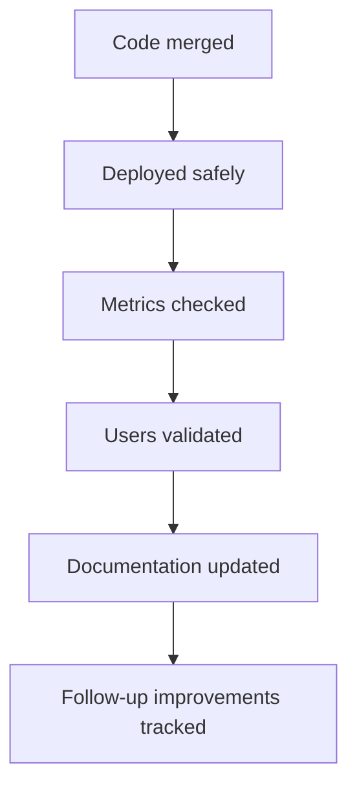
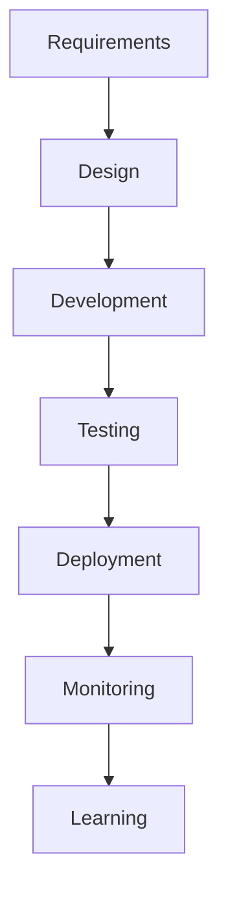
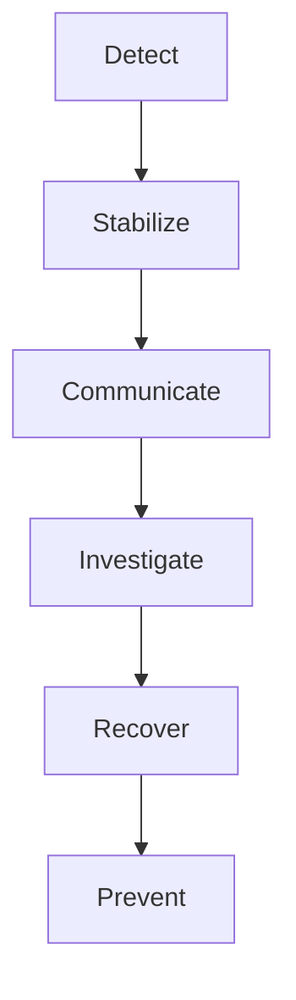
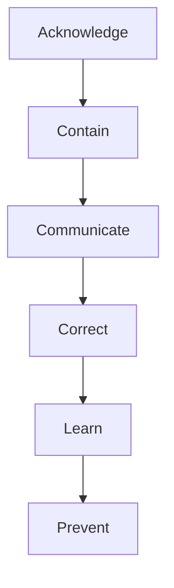
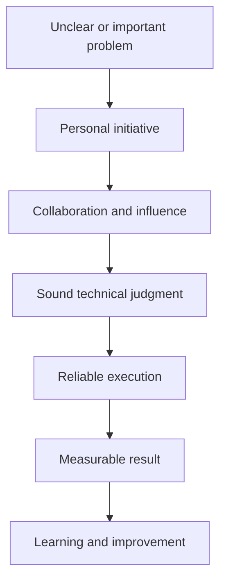

# Leadership & Ownership

> **Category:** Behavioral Interview Preparation  
> **Audience:** Developers with 3+ years of experience  
> **Goal:** Understand how to demonstrate leadership and ownership through real engineering situations.

---

# 1. Understanding Leadership and Ownership

Leadership and ownership are closely related, but they are not the same.

A strong engineer demonstrates both:

- **Leadership** by helping people move toward a shared goal.
- **Ownership** by taking responsibility for outcomes, not only assigned tasks.

These qualities are important because software development rarely succeeds through coding alone. Engineers must coordinate with product managers, QA engineers, DevOps teams, designers, security teams, and business stakeholders.

---

## 1.1 What Is Leadership?

Leadership is the ability to create direction, alignment, and progress.

A developer shows leadership when they:

- Identify an important problem.
- Bring clarity to an unclear situation.
- Help the team make a decision.
- Guide other developers.
- Resolve blockers.
- Communicate risks early.
- Improve how the team works.
- Keep people focused on the final outcome.

Leadership does **not** require a formal title.

A backend developer can show leadership by proposing a safer API design, coordinating a production fix, mentoring a teammate, or helping the team break a large requirement into deliverable phases.

### Simple Definition

```text
Leadership = Direction + Influence + Support + Results
```

---

## 1.2 What Is Ownership?

Ownership means behaving as though the result is your responsibility.

An engineer with ownership does not stop at:

> “My code is complete.”

They continue asking:

- Is the requirement actually solved?
- Has the code been tested properly?
- Is deployment safe?
- Are logs and alerts available?
- Does another team need support?
- Is the user-facing issue resolved?
- Is documentation updated?
- What can prevent this problem from happening again?

### Simple Definition

```text
Ownership = Responsibility from Problem Discovery to Final Outcome
```

Ownership covers the complete journey:



---

## 1.3 Leadership vs Ownership

| Area | Leadership | Ownership |
|---|---|---|
| Main focus | Helping people move forward | Ensuring the outcome is achieved |
| Scope | Team, project, or organization | Problem, service, feature, or result |
| Key behavior | Influence and guidance | Responsibility and follow-through |
| Example | Aligning teams on an API contract | Ensuring the API works correctly in production |
| Common signal | Others become more effective | Nothing important is left unfinished |

A strong engineer may demonstrate both at the same time.

### Example

Suppose a payment API is repeatedly failing.

- **Ownership:** You investigate logs, identify the root cause, deploy a fix, and add monitoring.
- **Leadership:** You coordinate backend, QA, DevOps, and product teams, explain the risk, and guide everyone toward a safe resolution.

---

# 2. Why These Skills Matter for Developers

As developers gain experience, expectations move beyond individual coding tasks.

A junior engineer is often evaluated on:

```text
Can this person implement the assigned task?
```

A mid-level or senior engineer is increasingly evaluated on:

```text
Can this person identify what needs to happen,
coordinate with others,
make good decisions,
and deliver a reliable outcome?
```

Leadership and ownership are important because experienced developers are expected to:

- Work with incomplete requirements.
- Handle production issues.
- Make technical trade-offs.
- Reduce delivery risks.
- Mentor less-experienced engineers.
- Communicate with non-technical stakeholders.
- Improve system reliability.
- Take responsibility beyond one ticket.
- Protect long-term maintainability.
- Help the whole team succeed.

### Growth in Responsibility



You do not need to be at the final stage to demonstrate leadership. Interviewers mainly want evidence that your responsibility has grown beyond simply completing assigned code.

---

# 3. Leadership Without a Manager Title

Many developers believe leadership means managing people. In engineering, leadership is often informal.

You can lead through:

- Technical knowledge.
- Clear communication.
- Strong preparation.
- Consistent delivery.
- Good judgment.
- Mentoring.
- Documentation.
- Calm incident handling.
- Building trust.
- Making other engineers more effective.

## Common Forms of Engineering Leadership

### Technical Leadership

You guide technical decisions such as architecture, API contracts, database design, performance, security, or deployment strategy.

### Delivery Leadership

You help organize work, identify dependencies, remove blockers, and keep the project moving.

### Incident Leadership

You bring structure during a production issue, assign investigation areas, communicate updates, and drive the issue toward resolution.

### Team Leadership

You mentor engineers, improve code reviews, share knowledge, and create a healthy working environment.

### Process Leadership

You improve testing, release practices, documentation, monitoring, or development workflows.

### Example

A developer notices that production bugs frequently occur because database migrations are reviewed too late.

They:

1. Gather examples of recent failures.
2. Propose a migration review checklist.
3. Add migration validation to CI.
4. Document rollback expectations.
5. Help the team adopt the process.

The developer did not need management authority. They identified a repeated problem and led an improvement.

---

# 4. The Ownership Mindset

Ownership starts with the way an engineer thinks.

A task-based mindset asks:

> What exactly was assigned to me?

An ownership mindset asks:

> What outcome are we trying to achieve, and what is required to achieve it safely?

## Task-Based Thinking vs Ownership Thinking

| Task-Based Thinking | Ownership Thinking |
|---|---|
| “I completed the endpoint.” | “The complete user flow works correctly.” |
| “QA found the issue.” | “I should help identify why our tests missed it.” |
| “Deployment belongs to DevOps.” | “I should ensure the release plan is safe.” |
| “The requirement was unclear.” | “I should clarify the requirement before building.” |
| “Another team owns that service.” | “I should coordinate with them because it affects delivery.” |
| “The ticket is closed.” | “The result is stable in production.” |

## The Ownership Loop



### Understand

Clarify the real business problem, technical constraints, users, and risks.

### Commit

Define what you will deliver and make realistic expectations clear.

### Execute

Implement the solution while coordinating dependencies and raising blockers early.

### Validate

Confirm correctness through testing, monitoring, stakeholder review, and production verification.

### Communicate

Provide clear updates about progress, decisions, risks, and changes.

### Improve

Capture lessons, prevent recurrence, and improve the system or process.

---

# 5. Core Behaviors Interviewers Look For

Interviewers are usually looking for evidence, not leadership vocabulary.

Saying “I am a strong leader” is weak.

Showing that you identified a problem, aligned people, made a decision, handled risk, and delivered measurable results is much stronger.

---

## 5.1 Taking Initiative

Initiative means acting on an important problem before someone gives detailed instructions.

### Good Examples

- Identifying a recurring production issue.
- Proposing automation for a repetitive manual process.
- Starting a technical design before implementation becomes urgent.
- Raising a security concern before release.
- Improving an unclear onboarding process.
- Adding monitoring for a critical service.
- Creating documentation for a poorly understood module.

### Important Distinction

Initiative does not mean changing everything independently.

Good initiative includes:

```text
Observe → Validate → Propose → Align → Act
```

Poor initiative often looks like:

```text
Assume → Change → Surprise Everyone
```

### Practical Example

A reconciliation process takes two hours every morning and frequently produces mismatches.

An ownership-oriented engineer:

1. Studies the workflow.
2. Confirms the main pain points with operations.
3. Identifies manual comparison steps.
4. Proposes an automated reconciliation job.
5. Delivers the solution in phases.
6. Adds mismatch reporting and audit logs.
7. Measures the reduction in manual work.

---

## 5.2 Driving Clarity

Engineering projects often begin with incomplete or conflicting requirements.

A leader does not wait passively for perfect clarity. They help create it.

### Ways to Drive Clarity

- Convert broad requirements into specific use cases.
- Identify unknowns and assumptions.
- Define acceptance criteria.
- Document decisions.
- Create sequence diagrams.
- Clarify ownership boundaries.
- Separate must-have requirements from future improvements.
- Confirm error-handling behavior.
- Define success metrics.

### Example

Requirement:

> “Add recurring payments.”

This is too broad.

A developer showing leadership may clarify:

- Who creates the mandate?
- Which payment methods are supported?
- What happens when payment fails?
- How many retries are allowed?
- Can the amount change?
- How is cancellation handled?
- Are webhook events idempotent?
- What information must be stored for audit?
- How will finance reconcile transactions?

The leadership behavior is not merely asking questions. It is structuring ambiguity so the team can make decisions.

---

## 5.3 Making Decisions

Leadership requires making reasonable decisions with incomplete information.

A strong decision process considers:

- Business impact.
- User impact.
- Delivery timeline.
- Technical complexity.
- Security.
- Reliability.
- Cost.
- Reversibility.
- Long-term maintenance.

## Simple Decision Framework



### Example

A team must decide whether to build a notification service internally or use a managed provider.

A strong engineer compares:

| Factor | Build Internally | Managed Provider |
|---|---|---|
| Initial delivery | Slower | Faster |
| Control | High | Moderate |
| Operational burden | High | Lower |
| Cost at small scale | Usually higher | Usually lower |
| Customization | High | Provider-dependent |
| Reliability responsibility | Internal team | Shared with provider |

The engineer does not present options without direction. They provide a recommendation based on current needs and clearly explain when the decision should be revisited.

---

## 5.4 Supporting the Team

Leadership is not only about making decisions. It also involves helping others succeed.

### Practical Behaviors

- Mentoring less-experienced developers.
- Giving useful code-review feedback.
- Explaining design decisions.
- Pairing on difficult issues.
- Sharing debugging techniques.
- Creating reusable templates.
- Helping another team understand an integration.
- Giving credit to contributors.
- Creating psychological safety during incidents.

### Good Leadership Language

Instead of:

> “This implementation is wrong.”

Use:

> “This approach can create duplicate processing when retries occur. Let us add an idempotency check or unique constraint.”

The second response focuses on the technical risk and provides direction without attacking the person.

---

## 5.5 Managing Risk

Ownership includes recognizing and reducing risk before it becomes a serious issue.

### Common Engineering Risks

- Data loss.
- Security vulnerabilities.
- Breaking API changes.
- Failed database migrations.
- Duplicate processing.
- Performance degradation.
- Missing observability.
- Unclear rollback plans.
- External dependency failure.
- Incorrect business calculations.

## Risk Management Flow



### Example

Before releasing a database migration on a large table, an engineer identifies that adding a non-null column may lock the table.

They propose:

1. Add the column as nullable.
2. Backfill data in batches.
3. Add the constraint later.
4. Test on production-like data.
5. Define rollback steps.
6. Monitor database locks and latency.

This demonstrates both technical depth and ownership.

---

## 5.6 Following Through

Many people start important work. Ownership is visible in how they finish it.

Follow-through includes:

- Closing open dependencies.
- Confirming deployment success.
- Monitoring after release.
- Updating stakeholders.
- Completing documentation.
- Removing temporary workarounds.
- Creating follow-up tasks.
- Validating business outcomes.
- Checking that preventive actions were completed.

### Weak Completion

```text
Code merged → Done
```

### Strong Completion



---

# 6. Leadership Across the Software Development Lifecycle

Leadership and ownership can appear at every stage of development.

## 6.1 Requirement Stage

Show ownership by:

- Understanding the actual business problem.
- Asking about edge cases.
- Identifying missing requirements.
- Confirming success criteria.
- Clarifying stakeholders and dependencies.

## 6.2 Design Stage

Show leadership by:

- Comparing design options.
- Explaining trade-offs.
- Identifying failure scenarios.
- Involving the right reviewers.
- Documenting important decisions.
- Avoiding unnecessary complexity.

## 6.3 Development Stage

Show ownership by:

- Maintaining code quality.
- Communicating blockers early.
- Writing meaningful tests.
- Reviewing related modules.
- Coordinating dependent changes.
- Keeping scope aligned with business needs.

## 6.4 Testing Stage

Show leadership by:

- Helping define test scenarios.
- Covering negative and failure cases.
- Testing integrations.
- Validating data correctness.
- Ensuring retry and recovery behavior.
- Supporting QA with technical context.

## 6.5 Deployment Stage

Show ownership by:

- Preparing a release plan.
- Reviewing migrations.
- Confirming configuration.
- Planning rollback.
- Monitoring health checks and logs.
- Communicating release status.

## 6.6 Post-Release Stage

Show leadership by:

- Reviewing metrics.
- Investigating unexpected behavior.
- Collecting stakeholder feedback.
- Fixing remaining gaps.
- Sharing lessons.
- Improving future releases.

### Complete Lifecycle View



True ownership exists across this entire flow.

---

# 7. How to Structure a Leadership Story

Behavioral interviews require clear stories. The STAR method is useful, but leadership stories need additional emphasis on judgment, influence, and outcome.

## STAR Structure

```text
S → Situation
T → Task
A → Action
R → Result
```

## 7.1 Situation

Explain the context briefly.

Include:

- The project or system.
- Why the situation mattered.
- The main challenge.
- Relevant scale or risk.

### Example

> Our payment service had repeated duplicate transaction issues whenever the provider retried webhook delivery. This affected reconciliation and created manual work for the finance team.

## 7.2 Task

Explain your responsibility and the expected outcome.

### Example

> I was responsible for identifying the root cause and making webhook processing reliable without delaying the scheduled release.

## 7.3 Action

This is the most important part.

Describe:

- What you personally did.
- How you investigated.
- How you made decisions.
- How you influenced others.
- Which trade-offs you considered.
- How you handled risk.
- How you kept stakeholders informed.

### Example

> I traced duplicate records to non-idempotent webhook handling. I proposed storing each provider event ID with a unique database constraint, processing the event inside a transaction, and returning success for already-processed events. I reviewed the design with the payment and database teams, added retry-focused tests, created monitoring for duplicate events, and documented the recovery flow for support engineers.

## 7.4 Result

Explain the outcome.

Use measurable evidence where possible:

- Failure rate reduced.
- Deployment completed.
- Processing time improved.
- Manual effort reduced.
- Incidents prevented.
- Customer complaints reduced.
- Team adoption increased.
- Delivery completed earlier.
- Cost reduced.

### Example

> Duplicate transaction creation stopped after release, reconciliation time dropped from around 90 minutes to 15 minutes, and the same idempotency pattern was adopted for two additional payment integrations.

## Leadership Story Formula

```text
Important Problem
       +
Personal Responsibility
       +
Judgment and Influence
       +
Concrete Action
       +
Measurable Outcome
       +
Learning
```

---

# 8. Practical Engineering Scenarios

The following scenarios show how leadership and ownership appear in normal development work.

---

## 8.1 Production Incident

### Situation

A deployment causes API latency to increase significantly.

### Ownership Behaviors

- Acknowledge the issue quickly.
- Gather logs and metrics.
- Stop further rollout.
- Compare behavior before and after deployment.
- Roll back when appropriate.
- Communicate status clearly.
- Identify the root cause.
- Add preventive controls.

### Leadership Behaviors

- Organize investigation areas.
- Keep discussion focused.
- Avoid blame.
- Make the rollback decision.
- Update product and support teams.
- Run a post-incident review.

### Incident Leadership Flow



---

## 8.2 Unclear Product Requirement

### Situation

A product manager asks for a “user activity dashboard,” but the required metrics and users are unclear.

### Leadership Actions

- Identify the dashboard's primary audience.
- Ask which decisions the dashboard should support.
- Define the minimum metrics.
- Create a simple mock data model.
- Clarify refresh frequency.
- Confirm privacy and access requirements.
- Agree on a phased delivery.

### Ownership Result

The engineer helps convert a vague request into a buildable and measurable solution.

---

## 8.3 Cross-Team Dependency

### Situation

Your feature depends on another team's authentication service.

### Weak Behavior

> “The other team has not completed their API, so my task is blocked.”

### Ownership Behavior

- Contact the owning team early.
- Confirm their delivery plan.
- Agree on the API contract.
- Create mocks or a temporary adapter.
- Track risks.
- Inform stakeholders before the deadline is affected.
- Test the integration together.

### Leadership Result

The dependency is actively managed rather than passively reported.

---

## 8.4 Technical Debt

### Situation

A legacy module slows every feature and causes frequent defects.

### Ownership Actions

1. Collect evidence of the impact.
2. Separate urgent defects from structural problems.
3. Propose incremental refactoring.
4. Define safety tests.
5. Align the work with upcoming features.
6. Measure improvements.
7. Avoid a risky full rewrite unless justified.

### Leadership Principle

Good leaders do not only complain about technical debt. They explain its business impact and propose a realistic improvement path.

---

## 8.5 Mentoring a Developer

### Situation

A new developer struggles with asynchronous processing and repeatedly introduces retry-related bugs.

### Leadership Actions

- Explain the concepts using real examples.
- Pair on one implementation.
- Provide a review checklist.
- Ask the developer to explain the final design.
- Give them ownership of a small follow-up improvement.
- Recognize progress.

### Good Outcome

Leadership increases the capability of the team rather than creating permanent dependency on one expert.

---

## 8.6 Missed Deadline

### Situation

A feature is likely to miss its committed delivery date.

### Ownership Actions

- Identify the delay early.
- Explain the cause without making excuses.
- Reassess scope.
- Present recovery options.
- Clarify trade-offs.
- Agree on a revised plan.
- Prevent similar estimation problems.

### Example Options

```text
Option A: Keep full scope, move the date.
Option B: Release core functionality, defer enhancements.
Option C: Add support, but accept coordination overhead.
```

Leadership means helping stakeholders make an informed decision, not hiding the delay until the deadline.

---

# 9. Handling Failure With Ownership

Strong ownership is especially visible when something goes wrong.

Interviewers do not expect a perfect career. They want evidence that you respond to mistakes responsibly.

## Weak Response to Failure

- Blaming requirements.
- Blaming QA.
- Blaming another team.
- Minimizing impact.
- Hiding the mistake.
- Discussing only the fix.
- Claiming the problem was unavoidable.

## Strong Response to Failure



### Example

Suppose you approve a database query that later creates production load.

A strong ownership explanation would include:

- You recognized your role in the decision.
- You helped reduce the impact.
- You communicated clearly.
- You identified why testing missed the issue.
- You added query analysis or load testing.
- You improved the review process.
- You changed your future decision-making approach.

### Ownership Language

Use language such as:

> I approved the design, so I took responsibility for coordinating the fix.

> I underestimated the production data volume and adjusted our validation process afterward.

> Although several factors contributed, I focused on what I could change in our design and review process.

Ownership does not mean accepting blame for everything. It means taking responsibility for your decisions, actions, communication, and follow-up.

---

# 10. Influencing Without Authority

Developers often need to influence people who do not report to them.

Examples include:

- Convincing a team to adopt a safer design.
- Asking product to reduce scope.
- Coordinating with DevOps on deployment.
- Getting security approval.
- Aligning multiple service owners.
- Encouraging better testing practices.

## Influence Model

```text
Trust
  +
Evidence
  +
Clear Reasoning
  +
Respect for Constraints
  +
Shared Goal
  =
Influence
```

## Practical Techniques

### Start With the Shared Goal

Instead of:

> “My architecture is better.”

Say:

> “We need to support retries without creating duplicate payments.”

This keeps the discussion focused on the outcome.

### Use Evidence

Use:

- Production metrics.
- Incident history.
- Performance tests.
- Proof of concept results.
- Cost estimates.
- User feedback.
- Operational impact.

### Present Trade-offs Honestly

Do not hide disadvantages in your preferred option.

A credible recommendation may sound like:

> This approach adds one new database table and some operational complexity, but it provides reliable deduplication and auditability. For a payment workflow, I believe the reliability benefit is worth that cost.

### Listen and Adapt

Influence is not forcing agreement. New information may justify changing your recommendation.

A leader can say:

> Based on the security team's constraint, I changed my proposal to use short-lived tokens instead of the original session model.

Changing direction based on better evidence is a sign of judgment, not weakness.

---

# 11. Balancing Ownership and Collaboration

Ownership does not mean doing everything alone.

Unhealthy ownership can create:

- Bottlenecks.
- Micromanagement.
- Burnout.
- Poor knowledge sharing.
- Dependency on one person.
- Reduced team trust.

## Healthy Ownership

```text
Own the Outcome
      ≠
Do Every Task Yourself
```

A good owner:

- Defines responsibilities.
- Delegates appropriately.
- Tracks critical dependencies.
- Provides context.
- Supports team members.
- Makes decisions when needed.
- Ensures integration between contributions.
- Remains accountable for the final result.

### Example

You lead a service migration.

You may:

- Ask one developer to update the data model.
- Ask another to create migration scripts.
- Coordinate QA testing.
- Work with DevOps on deployment.
- Review observability.
- Track readiness.
- Own the final go-live decision.

You are still demonstrating ownership even though multiple people perform the work.

---

# 12. Measuring Impact

Strong behavioral stories include evidence of impact.

## Types of Impact

### Technical Impact

- Reduced response time.
- Improved availability.
- Lower error rate.
- Fewer duplicate records.
- Improved test coverage.
- Faster deployments.
- Reduced infrastructure cost.
- Better observability.

### Delivery Impact

- Project delivered on time.
- Blocker resolved.
- Scope clarified.
- Dependency handled.
- Release risk reduced.
- Team productivity improved.

### Business Impact

- Reduced operational effort.
- Increased conversion.
- Fewer support tickets.
- Lower financial risk.
- Improved customer satisfaction.
- Faster onboarding.
- Better compliance.

### Team Impact

- Developers became more independent.
- Review quality improved.
- Knowledge was shared.
- Onboarding time reduced.
- A reusable standard was adopted.
- Collaboration improved.

## Before-and-After Format

```text
Before:
- Manual reconciliation took 2 hours daily.
- Duplicate records required finance correction.

Action:
- Added idempotent processing and automated mismatch reports.

After:
- Reconciliation reduced to 20 minutes.
- Duplicate transaction incidents stopped.
```

When exact metrics are unavailable, use honest evidence:

- “Reduced from several weekly incidents to rare exceptions.”
- “Removed a recurring manual step.”
- “Used by three teams.”
- “Became the default approach for new services.”
- “Improved release confidence.”
- “Reduced support escalation.”

Do not invent numbers.

---

# 13. Best Practices

## 13.1 Select Stories With Real Stakes

Choose situations involving:

- Production impact.
- Team coordination.
- Difficult trade-offs.
- Unclear requirements.
- Technical risk.
- Delivery pressure.
- Conflict or disagreement.
- Failure and learning.
- Process improvement.
- Mentoring.

A routine task with no challenge usually produces a weak leadership story.

---

## 13.2 Make Your Personal Contribution Clear

Use **I** for your actions and **we** for the team result.

Good example:

> I proposed the migration plan, coordinated the technical review, and created the rollback checklist. We completed the migration without downtime.

This shows contribution without taking credit for the entire team's work.

---

## 13.3 Explain Your Reasoning

Interviewers need to understand why you made a decision.

Do not only say:

> I selected Redis.

Explain:

> I selected Redis because we needed low-latency counters with automatic expiration. I also documented that the counter could be temporarily inconsistent during failover, which was acceptable for our rate-limiting use case.

Reasoning demonstrates maturity.

---

## 13.4 Show Collaboration

Leadership stories should include people, not only technology.

Mention how you worked with:

- Product.
- QA.
- DevOps.
- Security.
- Data teams.
- Operations.
- Support.
- Other developers.
- Business stakeholders.

---

## 13.5 Include Trade-offs

Strong leaders rarely receive perfect options.

Useful trade-offs include:

- Speed vs maintainability.
- Cost vs control.
- Reliability vs complexity.
- Scope vs delivery date.
- Consistency vs availability.
- Build vs buy.
- Immediate fix vs long-term redesign.
- Automation vs operational simplicity.

---

## 13.6 Communicate Problems Early

Ownership means avoiding surprises.

A strong engineer communicates:

- What changed.
- Why it matters.
- What is currently known.
- What remains unknown.
- Which options exist.
- What recommendation they have.
- When the next update will occur.

### Status Update Structure

```text
Current State
    +
Impact
    +
Action in Progress
    +
Risk
    +
Next Decision
```

---

## 13.7 Close With Learning

A leadership story becomes stronger when it shows growth.

Useful learning may include:

- Involve stakeholders earlier.
- Validate assumptions with production-like data.
- Define ownership before implementation.
- Communicate risk earlier.
- Prefer incremental migration.
- Add observability before launch.
- Record decisions.
- Create reusable safeguards.

Keep the learning specific.

Weak:

> I learned communication is important.

Strong:

> I learned that cross-team dependencies need a named owner and a written delivery contract. In later projects, I added dependency reviews during planning instead of waiting until integration testing.

---

# 14. Final Interview Checklist

Before using a leadership or ownership story, confirm that it includes the following:

## Context

- Is the situation easy to understand?
- Is the importance or risk clear?
- Is unnecessary background removed?

## Responsibility

- Is your role clearly explained?
- Did you take responsibility beyond a narrow task?
- Is your personal contribution visible?

## Leadership

- Did you create clarity?
- Did you influence or coordinate people?
- Did you make or support an important decision?
- Did you help the team move forward?

## Ownership

- Did you follow the issue through implementation, validation, and completion?
- Did you communicate risks early?
- Did you handle dependencies?
- Did you verify the final outcome?

## Technical Judgment

- Did you explain trade-offs?
- Did you consider failure scenarios?
- Did you manage technical or delivery risk?
- Was your approach appropriate for the situation?

## Result

- Is the result measurable or observable?
- Did users, the business, the system, or the team benefit?
- Did you explain what improved?

## Learning

- Did you identify a meaningful lesson?
- Did you apply the lesson later?
- Did the system or process improve?

---

# 15. Quick Summary

Leadership is not limited to managers. Developers demonstrate leadership whenever they create clarity, guide decisions, support others, resolve blockers, manage risk, or help a team deliver an important outcome.

Ownership means taking responsibility beyond completing assigned code. It includes understanding the real problem, coordinating dependencies, validating the solution, monitoring production behavior, communicating clearly, and improving the system after delivery.

The strongest leadership and ownership stories usually show this pattern:



For an experienced developer, the key message is:

> Do not present yourself only as someone who writes code. Present yourself as someone who helps the team understand problems, make good decisions, deliver reliable systems, and achieve meaningful outcomes.
