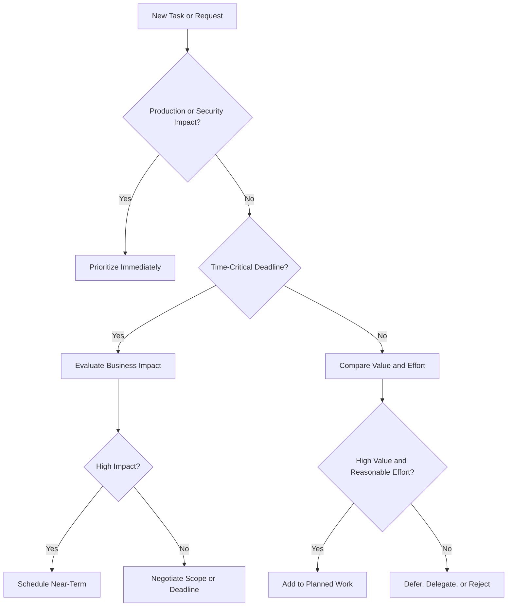
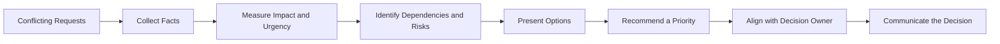

# Prioritization & Trade-offs

> **Category:** Behavioral Interview Preparation  
> **Level:** Intermediate Developer (3+ Years Experience)

---

## Index

1. [What Prioritization Means](#1-what-prioritization-means)
2. [Why Prioritization Matters](#2-why-prioritization-matters)
3. [What Trade-offs Mean](#3-what-trade-offs-mean)
4. [A Practical Prioritization Framework](#4-a-practical-prioritization-framework)
5. [Common Prioritization Models](#5-common-prioritization-models)
6. [How to Evaluate Trade-offs](#6-how-to-evaluate-trade-offs)
7. [Prioritization in Software Development](#7-prioritization-in-software-development)
8. [Handling Conflicting Priorities](#8-handling-conflicting-priorities)
9. [Communicating Priority Decisions](#9-communicating-priority-decisions)
10. [Behavioral Interview Story Structure](#10-behavioral-interview-story-structure)
11. [Detailed Practical Example](#11-detailed-practical-example)
12. [Strong Decision-Making Principles](#12-strong-decision-making-principles)
13. [Summary](#13-summary)

---

# 1. What Prioritization Means

Prioritization is the process of deciding:

- What should be done first
- What can wait
- What should be reduced in scope
- What should not be done
- Where limited time, people, and budget should be used

In software development, there are almost always more tasks than the team can complete immediately.

A developer may need to choose between:

- Fixing a production bug
- Completing a planned feature
- Improving test coverage
- Reducing technical debt
- Supporting another team
- Investigating a performance issue

Good prioritization is not about working faster on everything. It is about focusing effort on the work that creates the most value or reduces the most important risk.

```text
Many possible tasks
        |
        v
Evaluate value, urgency, risk, and effort
        |
        v
Select the most important work
        |
        v
Delay, delegate, reduce, or reject lower-priority work
```

---

# 2. Why Prioritization Matters

Prioritization helps teams use limited resources effectively.

## 2.1 Business Impact

The most technically interesting task may not always be the most valuable task.

For example:

- A small payment bug may affect customer revenue.
- A large refactoring task may improve code quality but have no immediate user impact.
- A minor-looking compliance issue may block an important release.

A strong developer connects technical work with business outcomes.

## 2.2 Risk Management

Some tasks must be prioritized because delaying them creates significant risk.

Examples include:

- Security vulnerabilities
- Data corruption
- Payment failures
- Regulatory or compliance issues
- Production outages
- Expiring certificates
- Critical dependency vulnerabilities

## 2.3 Team Alignment

Clear priorities prevent different people from working toward conflicting goals.

Without alignment:

- Developers may start unrelated tasks.
- Product managers may expect features that engineering has delayed.
- Support teams may not know when customer issues will be resolved.
- Stakeholders may assume everything is equally urgent.

## 2.4 Delivery Predictability

Prioritization allows teams to create realistic commitments.

It is better to deliver three important items reliably than to start ten items and finish none.

---

# 3. What Trade-offs Mean

A trade-off occurs when improving one thing requires sacrificing or reducing another.

In software development, it is rarely possible to maximize every desirable quality at the same time.

Common trade-offs include:

| Decision Area | Option A | Option B |
|---|---|---|
| Delivery | Faster release | More complete release |
| Architecture | Simple solution | Highly scalable solution |
| Quality | More testing | Shorter delivery time |
| Cost | Managed service | Self-hosted system |
| Performance | Faster response | Lower infrastructure cost |
| Scope | More features | Better stability |
| Consistency | Strong consistency | Higher availability |
| Security | Strict controls | Easier user experience |
| Maintainability | Clean abstraction | Quick implementation |

A trade-off does not automatically mean compromising quality. It means making a conscious decision based on context.

## 3.1 Healthy Trade-off

A healthy trade-off is:

- Intentional
- Based on evidence
- Clearly communicated
- Reversible where possible
- Documented when important
- Reviewed after conditions change

## 3.2 Poor Trade-off

A poor trade-off is:

- Made without understanding the impact
- Hidden from stakeholders
- Based only on convenience
- Treated as permanent without review
- Missing a mitigation plan

---

# 4. A Practical Prioritization Framework

A useful approach is to evaluate every important task using five dimensions:

1. **Impact**
2. **Urgency**
3. **Risk**
4. **Effort**
5. **Dependencies**



## 4.1 Impact

Ask:

- How many users are affected?
- Does this affect revenue?
- Does it block a release?
- Does it improve a critical customer journey?
- Does it reduce operational cost?
- Does it support an important company goal?

Example:

A bug affecting 40% of payment attempts has much greater impact than a visual issue on an internal admin page.

## 4.2 Urgency

Urgency describes how quickly action is required.

Ask:

- Is there a fixed deadline?
- Is a customer blocked now?
- Will the impact become worse over time?
- Is a release or dependency waiting for this?
- Is there a regulatory date?

Urgency and importance are not always the same.

A task can be:

- Urgent and important
- Important but not urgent
- Urgent but low-impact
- Neither urgent nor important

## 4.3 Risk

Risk includes:

- Security risk
- Financial risk
- Compliance risk
- Operational risk
- Data integrity risk
- Reputational risk
- Delivery risk

A low-effort task that removes a high risk is often worth prioritizing.

## 4.4 Effort

Effort includes more than coding time.

Consider:

- Development time
- Testing effort
- Review time
- Deployment complexity
- Cross-team coordination
- Migration effort
- Monitoring requirements
- Rollback complexity

## 4.5 Dependencies

Some tasks unlock or block other work.

For example:

```text
Database schema
      |
      v
Backend API
      |
      v
Frontend integration
      |
      v
End-to-end testing
      |
      v
Release
```

The schema work may not provide direct user value, but it becomes a priority because several other tasks depend on it.

---

# 5. Common Prioritization Models

No single model works for every situation. A good developer uses the simplest model that helps the team make a clear decision.

## 5.1 Impact vs Effort Matrix

This is one of the simplest and most useful models.

```text
                         EFFORT
                  Low                  High
            +----------------+----------------+
High Impact | Quick Wins     | Major Projects |
            +----------------+----------------+
Low Impact  | Fill-ins       | Avoid / Defer  |
            +----------------+----------------+
```

### Quick Wins

High impact and low effort.

Examples:

- Adding a missing database index
- Fixing a common validation bug
- Enabling an existing monitoring alert
- Correcting a broken API timeout setting

These tasks should usually be prioritized.

### Major Projects

High impact and high effort.

Examples:

- Replacing a legacy payment system
- Migrating to a new authentication platform
- Redesigning a large data pipeline

These require planning, milestones, and stakeholder alignment.

### Fill-ins

Low impact and low effort.

These can be completed when there is available capacity, but they should not displace high-impact work.

### Avoid or Defer

Low impact and high effort.

These tasks should be challenged, reduced in scope, or removed.

---

## 5.2 Eisenhower Matrix

The Eisenhower Matrix separates importance from urgency.

| | Urgent | Not Urgent |
|---|---|---|
| Important | Do now | Schedule |
| Not Important | Delegate or limit | Remove or defer |

Software examples:

- **Do now:** Production payment failure
- **Schedule:** Database scalability improvement before expected growth
- **Delegate or limit:** Repeated manual report request
- **Remove or defer:** Cosmetic internal change with no measurable value

---

## 5.3 RICE Scoring

RICE is useful for product and feature prioritization.

```text
RICE Score = (Reach × Impact × Confidence) / Effort
```

Where:

- **Reach:** Number of users or events affected
- **Impact:** Expected value per user
- **Confidence:** Confidence in estimates
- **Effort:** Time or person-months required

Example:

| Factor | Value |
|---|---:|
| Reach | 5,000 users |
| Impact | 2 |
| Confidence | 80% |
| Effort | 4 person-weeks |

The exact score is less important than using consistent assumptions to compare options.

## 5.4 MoSCoW Method

MoSCoW is useful for scope prioritization.

- **Must Have:** Required for the release to succeed
- **Should Have:** Important but not release-blocking
- **Could Have:** Valuable when capacity allows
- **Won't Have Now:** Explicitly excluded from the current scope

Example for a payment release:

| Category | Item |
|---|---|
| Must Have | Payment authorization and failure handling |
| Should Have | Refund dashboard |
| Could Have | Custom receipt template |
| Won't Have Now | Multi-currency settlement |

The important part of MoSCoW is not only identifying what will be built. It also clearly states what will not be built now.

---

# 6. How to Evaluate Trade-offs

A good trade-off decision should answer four questions:

1. What are the available options?
2. What do we gain from each option?
3. What do we give up?
4. How will we reduce the downside?

## 6.1 Trade-off Evaluation Table

| Option | Benefits | Costs or Risks | Best When |
|---|---|---|---|
| Quick patch | Fast recovery | May add technical debt | Production is blocked |
| Full redesign | Better long-term structure | High delivery time | Existing design cannot scale |
| Managed service | Fast setup, less maintenance | Higher vendor cost | Team has limited operations capacity |
| Self-hosted service | More control | More maintenance | Control and customization are critical |
| Synchronous processing | Immediate result | Slower request and lower resilience | Work is small and user needs result now |
| Asynchronous processing | Better scalability | Eventual completion and more complexity | Work is slow or retryable |

## 6.2 Reversibility

Prefer reversible decisions when uncertainty is high.

```text
Low uncertainty + High confidence
            |
            v
Long-term architectural decision

High uncertainty + Low confidence
            |
            v
Small, reversible experiment
```

Examples of reversible decisions:

- Feature flags
- Gradual rollout
- Canary deployment
- Temporary adapter layer
- Short proof of concept
- Limited customer pilot

Examples of difficult-to-reverse decisions:

- Public API contracts
- Database partitioning strategy
- Core data model
- Vendor lock-in
- Breaking authentication changes

The harder a decision is to reverse, the more evidence and review it should receive.

## 6.3 Cost of Delay

Cost of delay is the loss created by postponing a task.

Examples:

- A payment bug loses revenue every day.
- A security issue increases exposure over time.
- A delayed integration blocks a partner launch.
- A performance issue increases infrastructure cost.
- A compliance change may result in penalties after a deadline.

A task with a high cost of delay may deserve priority even when its implementation effort is large.

---

# 7. Prioritization in Software Development

## 7.1 Production Incident vs Planned Feature

A production incident usually takes priority when it affects:

- Availability
- Data correctness
- Security
- Payments
- Critical customer workflows
- A significant percentage of users

However, not every production bug should automatically interrupt all planned work.

The team should evaluate severity.

| Severity | Example | Typical Response |
|---|---|---|
| Critical | System unavailable or data loss | Immediate response |
| High | Major workflow blocked | Urgent response |
| Medium | Workaround exists | Schedule soon |
| Low | Cosmetic or minor inconvenience | Add to backlog |

## 7.2 Feature Work vs Technical Debt

Technical debt should not be treated as an unrelated engineering preference.

It should be connected to measurable impact.

Examples:

- Slow release process
- Frequent defects
- Difficult onboarding
- High infrastructure cost
- Security exposure
- Long development lead time
- Repeated production incidents

A strong explanation is:

> “We prioritized this refactoring because the existing module caused repeated payment defects and increased every change from one day to almost one week.”

A weak explanation is:

> “The code was not clean, so we wanted to rewrite it.”

## 7.3 Speed vs Quality

Speed and quality are not always opposites.

The better trade-off is often to reduce scope while protecting critical quality.

```text
Fixed Deadline
      |
      v
Reduce optional scope
      |
      v
Keep security, correctness, tests, and rollback
      |
      v
Deliver smaller reliable release
```

For example, instead of skipping tests to release five features, deliver the two highest-value features with proper validation and monitoring.

## 7.4 Build vs Buy

When deciding whether to build a system internally or use an external service, consider:

| Factor | Build | Buy |
|---|---|---|
| Initial delivery | Slower | Faster |
| Customization | High | Limited |
| Maintenance | Internal responsibility | Vendor responsibility |
| Control | High | Lower |
| Cost model | Engineering and infrastructure | Subscription or usage-based |
| Vendor dependency | Low | Higher |
| Compliance | Fully controlled | Depends on vendor support |

The best choice depends on whether the capability creates strategic advantage.

A company may build its core pricing engine but buy email delivery, monitoring, or identity verification.

## 7.5 Performance vs Maintainability

Highly optimized code may be more difficult to understand and maintain.

A practical approach is:

1. Start with the simplest correct solution.
2. Measure actual performance.
3. Identify the bottleneck.
4. Optimize only the critical path.
5. Keep tests and documentation around complex optimizations.

---

# 8. Handling Conflicting Priorities

Conflicting priorities commonly occur when:

- Product wants a new feature.
- Support wants an urgent customer fix.
- Security wants a vulnerability resolved.
- Engineering wants to reduce technical debt.
- Management wants a deadline maintained.

A developer should not silently choose one stakeholder over another.

## 8.1 Conflict Resolution Process



## 8.2 Step 1: Clarify the Requests

Understand:

- The desired outcome
- The deadline
- The affected users
- The consequence of delay
- The expected effort
- The dependency on other work

## 8.3 Step 2: Use Shared Criteria

Avoid prioritizing based on who speaks the loudest.

Use criteria such as:

- Customer impact
- Revenue
- Risk
- Compliance
- Delivery deadline
- Cost of delay
- Strategic alignment
- Engineering effort

## 8.4 Step 3: Present Options

A useful communication format is:

> “We can deliver the reporting feature this sprint, but the performance work will move to next sprint. Alternatively, we can deliver a smaller reporting scope and complete the highest-risk performance fix now.”

This makes the trade-off visible.

## 8.5 Step 4: Escalate the Decision When Necessary

A developer should provide technical context and a recommendation.

The final decision may belong to:

- Product manager
- Engineering manager
- Technical lead
- Security owner
- Incident commander
- Business stakeholder

Escalation is appropriate when:

- Priorities affect different departments
- Business impact is unclear
- A deadline conflicts with security or reliability
- The decision requires budget or staffing
- The risk exceeds the developer’s authority

Escalation should include evidence and options, not only the problem.

---

# 9. Communicating Priority Decisions

Prioritization is incomplete until the decision is communicated.

A clear priority update includes:

1. The selected priority
2. The reason
3. The work being delayed
4. The expected impact
5. The next review point

## 9.1 Example Communication

> “We are prioritizing the checkout failure because it affects approximately 18% of payment attempts and directly impacts revenue. The admin export enhancement will move to the next sprint. We expect to deploy the fix today and will review the export timeline during sprint planning.”

## 9.2 Use Evidence

Useful evidence includes:

- Number of affected users
- Error rate
- Revenue impact
- Support ticket volume
- Delivery deadline
- Security severity
- Estimated effort
- Dependency count
- System metrics

## 9.3 Avoid Overpromising

Do not present every request as a top priority.

When everything is called urgent, nothing is truly prioritized.

A strong response may be:

> “This is important, but it is not more urgent than the current production issue. I can start it after the incident is stable, or we can reduce the current sprint scope if it must be delivered earlier.”

## 9.4 Document Important Decisions

For important trade-offs, record:

- Context
- Options considered
- Decision
- Reason
- Risks accepted
- Mitigation
- Review date

Architecture Decision Records, issue comments, sprint notes, and incident documents are useful places for this information.

---

# 10. Behavioral Interview Story Structure

In behavioral interviews, prioritization stories should show your decision-making process, not only the final result.

The STAR structure works well.

## 10.1 Situation

Describe the context.

Include:

- Project or system
- Competing priorities
- Time or resource constraints
- Business impact

## 10.2 Task

Explain your responsibility.

Examples:

- Decide what the team should handle first
- Recommend a priority to stakeholders
- Protect a release deadline
- Balance a customer issue with planned work
- Reduce scope without reducing critical quality

## 10.3 Action

This is the most important section.

Explain how you:

- Collected facts
- Measured impact
- Compared urgency and risk
- Estimated effort
- Identified dependencies
- Presented alternatives
- Aligned stakeholders
- Communicated the trade-off
- Added mitigation or follow-up work

## 10.4 Result

Use measurable outcomes where possible.

Examples:

- Reduced error rate
- Avoided revenue loss
- Delivered on time
- Prevented a production incident
- Reduced scope while protecting quality
- Improved stakeholder alignment
- Completed deferred work in a later sprint

## 10.5 Reflection

A strong senior-level answer often includes learning.

Examples:

- Introduced a severity matrix
- Added monitoring
- Improved sprint intake
- Created clearer ownership
- Added a technical-debt allocation
- Documented decision criteria

```text
Situation
   |
   v
Competing priorities and constraints
   |
   v
Task
   |
   v
Your responsibility
   |
   v
Action
   |
   v
Evidence-based prioritization and communication
   |
   v
Result
   |
   v
Measurable impact and learning
```

---

# 11. Detailed Practical Example

## 11.1 Scenario

A team is preparing to release a customer reporting feature.

Two days before release:

- Payment failure rates increase from 1% to 8%.
- The reporting feature is promised to an important customer.
- The team has only three developers.
- A database migration for the reporting feature is already prepared.
- Customer support starts receiving payment complaints.

## 11.2 Priority Evaluation

| Factor | Payment Issue | Reporting Feature |
|---|---|---|
| User impact | High | Medium |
| Revenue impact | High | Indirect |
| Urgency | Immediate | Deadline in two days |
| Risk | Financial and reputational | Relationship risk |
| Effort | Unknown initially | Two days remaining |
| Workaround | No reliable workaround | Manual report possible |

The payment issue should become the first priority because it affects current transactions and revenue.

## 11.3 Trade-off Options

### Option A: Continue the Feature Release

**Benefit:** Customer commitment is maintained.

**Risk:** Payment failures continue, causing financial loss and more support cases.

### Option B: Stop All Feature Work

**Benefit:** Maximum focus on the incident.

**Risk:** Reporting delivery is delayed with no alternative.

### Option C: Split the Response

- Two developers investigate and fix the payment issue.
- One developer prepares a temporary manual reporting process.
- The full reporting release is delayed until payment stability is confirmed.

This option protects the most critical business flow while reducing the effect of the feature delay.

## 11.4 Actions

A strong developer could:

1. Confirm the payment error rate using monitoring data.
2. Estimate the affected transaction volume.
3. Inform product, support, and engineering leadership.
4. Recommend incident priority.
5. Assign clear owners.
6. Pause risky deployments.
7. Offer a temporary reporting workaround.
8. Deploy the payment fix through a controlled rollout.
9. Monitor recovery.
10. Reschedule the reporting release with a clear date.

## 11.5 Result

A strong result might be:

- Payment failure rate returned from 8% to below 1%.
- The issue was resolved before peak traffic.
- The customer received a manual report on the promised date.
- The full reporting feature was released three days later.
- The team added an alert for payment failure rate changes.

The important lesson is that the team did not simply abandon one priority. It made the highest-risk work primary and reduced the impact of delaying the secondary work.

---

# 12. Strong Decision-Making Principles

## 12.1 Prioritize Outcomes, Not Activity

Completing many tasks does not always create value.

Focus on:

- Customer impact
- Business results
- Risk reduction
- System reliability
- Team effectiveness

## 12.2 Make Trade-offs Explicit

Every priority decision means something else receives less attention.

Clearly state:

- What is being prioritized
- What is being delayed
- Why the decision is reasonable
- When the decision will be reviewed

## 12.3 Protect Non-Negotiable Quality

Some standards should not be casually traded away:

- Security
- Data integrity
- Regulatory compliance
- Payment correctness
- Safe deployment
- Rollback capability
- Critical test coverage

When deadlines are fixed, reduce scope before removing essential controls.

## 12.4 Use Data, but Do Not Wait for Perfect Data

Decisions often need to be made with incomplete information.

Use the best available evidence:

- Logs
- Metrics
- Customer reports
- Historical incidents
- Estimates
- Small experiments

State uncertainty clearly and choose a reversible path when possible.

## 12.5 Revisit Priorities

Priorities can change when:

- New information appears
- Business goals change
- A risk becomes more severe
- A dependency is delayed
- User impact is different from the original estimate
- Team capacity changes

Prioritization is a continuous process, not a one-time activity.

## 12.6 Own the Recommendation

A strong developer does not only ask stakeholders what to do.

They provide a recommendation:

> “Based on current failure rates, revenue impact, and lack of a workaround, I recommend pausing the feature deployment and assigning two engineers to the payment issue. We can provide the report manually and reassess the feature release after stability is confirmed.”

This demonstrates ownership while respecting the final decision-maker.

---

# 13. Summary

Prioritization is the ability to focus limited resources on the work that creates the greatest value or prevents the greatest risk.

Trade-offs are unavoidable in software development. Strong developers make them consciously and communicate them clearly.

A practical decision process is:

```text
Understand the requests
        |
        v
Measure impact, urgency, risk, effort, and dependencies
        |
        v
Compare realistic options
        |
        v
Recommend a priority
        |
        v
Explain what will be delayed or reduced
        |
        v
Add mitigation and review points
        |
        v
Communicate and document the decision
```

For behavioral interviews, a strong prioritization example should demonstrate:

- Clear judgment
- Business awareness
- Technical understanding
- Evidence-based decision-making
- Stakeholder communication
- Ownership
- Measurable results
- Learning and process improvement
