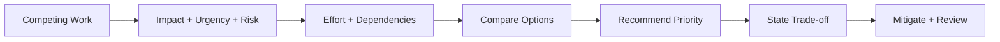
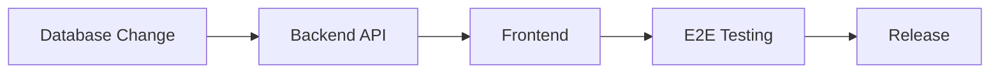
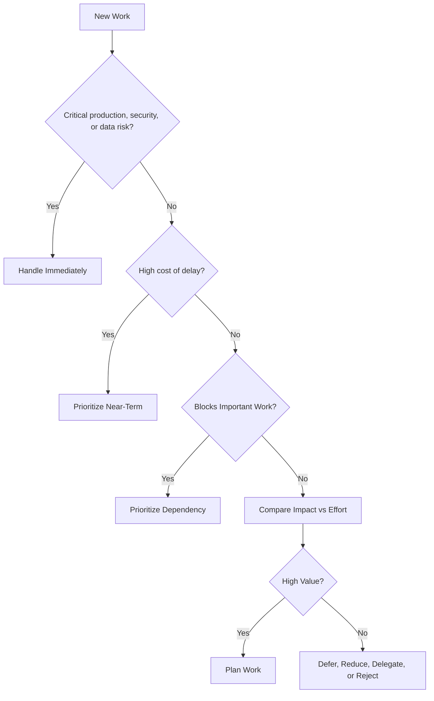
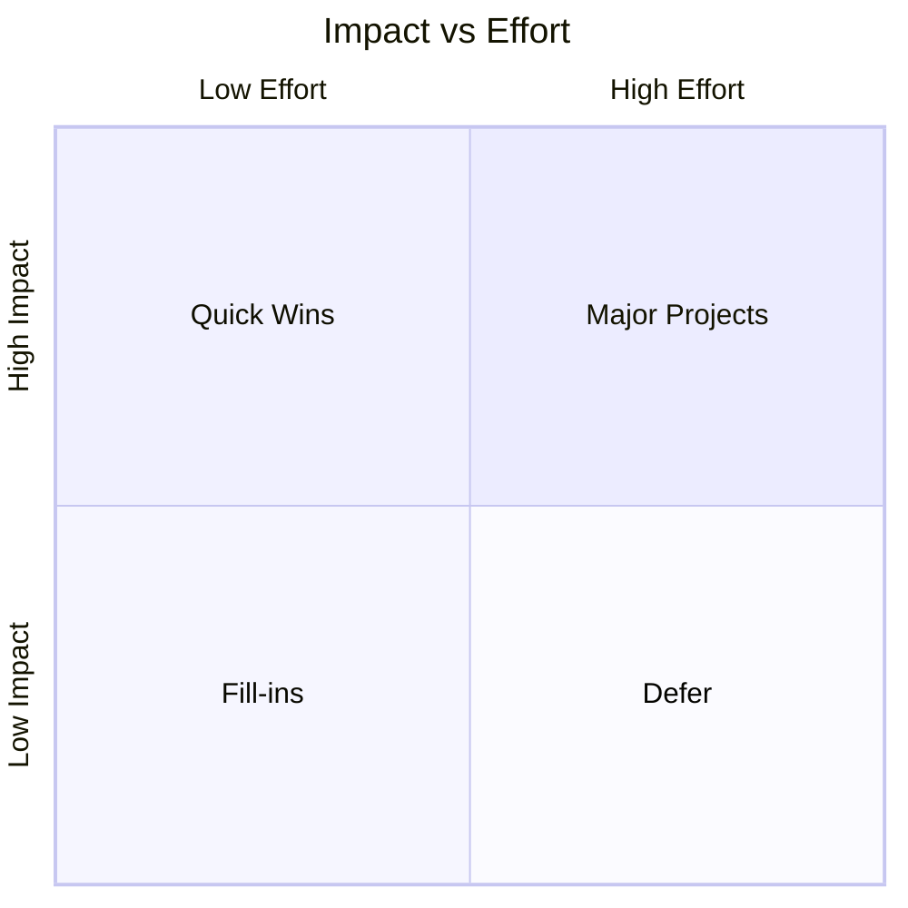
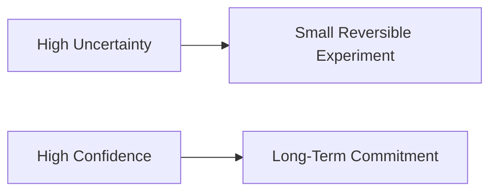
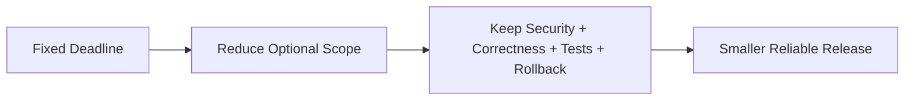
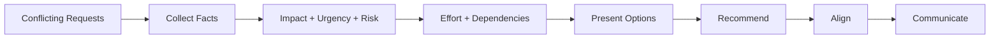
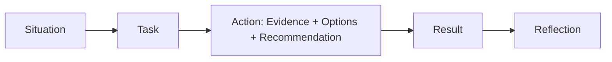

# Prioritization & Trade-offs

> How to decide what to work on when there is more work than capacity, and how to explain those decisions clearly in an interview.

## In Short

- **Prioritization** decides what goes first, what can wait, what should be reduced, and what should not be done now.
- Evaluate important work using **impact, urgency, risk, effort, and dependencies**.
- A good **trade-off** is intentional, evidence-based, communicated, and reviewed when conditions change.
- When uncertainty is high, prefer a **small reversible decision** over a large irreversible commitment.
- With a fixed deadline, reduce **scope before critical quality** such as security, data integrity, essential tests, and rollback capability.
- Do not prioritize based on the loudest stakeholder. Use shared criteria and make the **cost of delay** visible.
- A priority decision is incomplete until everyone knows **what is delayed, why, and when it will be revisited**.



---

# 1. What Prioritization Means

Prioritization is the process of deciding where limited engineering time should be spent.

A developer may need to choose between:

- Fixing a production issue
- Delivering a planned feature
- Reducing technical debt
- Improving performance
- Handling a security issue
- Supporting another team
- Improving tests or observability

Good prioritization is **not trying to do everything faster**. It is focusing the team on the work that creates the most value or prevents the most important risk.

### Simple Mental Model

Ask:

1. **What happens if we do this now?**
2. **What happens if we delay it?**
3. **What are we delaying by choosing it?**

That third question is what turns a normal task decision into a real trade-off.

---

# 2. The Five Factors to Evaluate

For most day-to-day engineering decisions, five factors are enough.

## 2.1 Impact

Impact describes how much value or damage is involved.

Consider:

- Number of users affected
- Revenue impact
- Customer experience
- Release or business goal impact
- Operational cost
- Reliability improvement

**Example:** A payment bug affecting 20% of transactions has much higher impact than a cosmetic issue on an internal admin page.

## 2.2 Urgency

Urgency describes how quickly action is required.

Look for:

- Customers blocked right now
- Fixed release dates
- Regulatory deadlines
- Expiring certificates or credentials
- Problems getting worse over time
- Another team waiting on the work

> **Important:** Urgent and important are not the same thing.

## 2.3 Risk

Risk can be:

- Security
- Financial
- Compliance
- Data integrity
- Availability
- Reputation
- Delivery risk

A small task that removes a severe risk can be more valuable than a large feature.

## 2.4 Effort

Effort is more than coding time.

Include:

- Development
- Testing
- Code review
- Deployment
- Migration
- Coordination
- Monitoring
- Rollback complexity

## 2.5 Dependencies

A task may deserve priority because other work cannot continue without it.



The database change may not create direct user value, but delaying it blocks the entire delivery chain.

---

# 3. Practical Prioritization Framework

A simple engineering decision flow is usually more useful than a complicated scoring system.



A useful comparison table:

| Factor | Question |
|---|---|
| Impact | How much value or damage is involved? |
| Urgency | How quickly must we act? |
| Risk | What can go wrong if we wait? |
| Effort | What is the real delivery cost? |
| Dependencies | What other work does this block or unlock? |

This model works well for bugs, features, technical debt, infrastructure work, and cross-team requests.

---

# 4. Common Prioritization Models

You do not need to use every framework. Pick the simplest one that helps the team make a clear decision.

## 4.1 Impact vs Effort

This is useful for quick engineering prioritization.



- **Quick wins:** High impact, low effort → usually prioritize.
- **Major projects:** High impact, high effort → plan carefully.
- **Fill-ins:** Low impact, low effort → do when capacity allows.
- **Defer:** Low impact, high effort → challenge or reduce scope.

## 4.2 RICE

RICE is useful when comparing product or feature initiatives.

```text
RICE = (Reach × Impact × Confidence) / Effort
```

Where:

- **Reach** = how many users/events are affected in a defined period
- **Impact** = expected value per user/event
- **Confidence** = confidence in the estimates
- **Effort** = total work required

The score is useful for comparison, but the assumptions behind the score matter more than the exact number.

## 4.3 MoSCoW

MoSCoW is useful when a deadline is fixed and scope must be controlled.

| Priority | Meaning |
|---|---|
| Must Have | Required for the release or outcome to succeed |
| Should Have | Important, but a workaround exists |
| Could Have | Valuable if capacity allows |
| Won't Have This Time | Explicitly excluded from the current scope |

The most important part is the last category: clearly stating what will **not** be delivered now.

## 4.4 Cost of Delay

Cost of delay asks:

> **What value do we lose by waiting?**

Examples:

- A payment failure loses revenue every hour.
- A security vulnerability increases exposure while it remains open.
- A blocked API integration delays another team's release.
- A performance issue may increase infrastructure cost every day.

High cost of delay can justify prioritizing work even when the implementation effort is significant.

---

# 5. Understanding Trade-offs

A trade-off exists when improving one outcome means accepting a cost somewhere else.

Common engineering trade-offs:

| Decision | Option A | Option B |
|---|---|---|
| Delivery | Faster release | More complete scope |
| Architecture | Simple now | More scalable design |
| Cost | Managed service | Self-hosted |
| Processing | Synchronous | Asynchronous |
| Consistency | Strong consistency | Higher availability |
| Performance | Faster execution | Simpler code |
| Scope | More features | Higher stability |
| Build strategy | Build internally | Buy/integrate service |

A trade-off does **not** mean casually reducing quality. It means choosing deliberately based on the situation.

## 5.1 A Good Trade-off Should Answer

1. What are the realistic options?
2. What do we gain from each?
3. What do we give up?
4. What risk are we accepting?
5. How can we reduce the downside?
6. When should we review the decision again?

## 5.2 Reversible vs Irreversible Decisions

When uncertainty is high, prefer decisions that are easy to reverse.

**More reversible:**

- Feature flags
- Canary releases
- Limited pilots
- Proofs of concept
- Temporary adapters
- Gradual rollout

**Harder to reverse:**

- Public API contracts
- Core data models
- Database partitioning strategies
- Strong vendor lock-in
- Breaking authentication changes



The harder a decision is to undo, the more evidence and review it deserves.

---

# 6. Common Software Development Trade-offs

## 6.1 Production Incident vs Planned Feature

Production work usually takes priority when it affects:

- Availability
- Payments
- Security
- Data correctness
- Critical customer flows
- A significant percentage of users

But not every production bug should interrupt the sprint.

| Severity | Example | Typical Response |
|---|---|---|
| Critical | Outage, data loss, severe security issue | Immediate |
| High | Major customer workflow blocked | Urgent |
| Medium | Limited impact with workaround | Schedule soon |
| Low | Cosmetic/minor inconvenience | Backlog |

## 6.2 Feature Work vs Technical Debt

Technical debt is easier to prioritize when connected to measurable impact.

Strong reasoning:

> “We prioritized refactoring because this module caused repeated payment defects and made every change take several days longer.”

Weak reasoning:

> “The code was messy, so we wanted to rewrite it.”

Connect technical debt to:

- Repeated incidents
- Slow releases
- High defect rates
- Security exposure
- Infrastructure cost
- Difficult maintenance
- Developer lead time

## 6.3 Speed vs Quality

A fixed deadline should usually reduce **scope**, not remove critical controls.



Instead of releasing five features with weak validation, release the two highest-value features safely.

## 6.4 Build vs Buy

| Factor | Build | Buy |
|---|---|---|
| Initial delivery | Slower | Faster |
| Customization | High | Usually limited |
| Maintenance | Internal | Mostly vendor |
| Control | High | Lower |
| Vendor dependency | Low | Higher |
| Cost | Engineering + infrastructure | Subscription/usage |
| Compliance | Direct control | Depends on vendor capability |

Build when the capability creates meaningful competitive advantage or requires deep control. Buy when the capability is common, mature, and expensive to operate internally.

Examples often bought rather than built include email delivery, observability platforms, identity verification, and commodity infrastructure services.

## 6.5 Performance vs Maintainability

A practical rule:

1. Start with the simplest correct solution.
2. Measure real performance.
3. Find the actual bottleneck.
4. Optimize the critical path.
5. Protect complex optimization with tests and documentation.

Do not add complexity for performance problems that have not been measured.

---

# 7. Handling Conflicting Priorities

Conflicting requests are common:

- Product wants a feature.
- Support wants a customer issue fixed.
- Security wants a vulnerability resolved.
- Engineering wants technical debt addressed.
- Management wants the delivery date protected.

A developer should not silently choose based on stakeholder seniority or who asks most aggressively.



## 7.1 Recommended Approach

### Step 1 — Clarify

Understand:

- Desired outcome
- Deadline
- Affected users
- Consequence of delay
- Expected effort
- Dependencies

### Step 2 — Compare Using Shared Criteria

Use evidence such as:

- Error rate
- User impact
- Revenue impact
- Support volume
- Security severity
- Regulatory deadline
- Engineering effort
- Dependency count

### Step 3 — Present the Trade-off

A good message makes both choices visible:

> “We can finish the reporting feature this sprint, but the performance issue moves to next sprint. Alternatively, we can reduce reporting scope and fix the highest-risk performance bottleneck now.”

### Step 4 — Make a Recommendation

Do not only ask, “What should I do?”

Give your recommendation with evidence:

> “Because the payment issue affects active transactions and has no reliable workaround, I recommend pausing the feature deployment and assigning two engineers to the incident.”

### Step 5 — Escalate When Needed

Escalate when:

- Multiple departments are affected
- Business impact is unclear
- Security or compliance conflicts with a deadline
- Budget or staffing decisions are required
- The risk is outside your authority

Escalation should contain **facts, options, trade-offs, and a recommendation**, not only the problem.

---

# 8. Communicating the Decision

A priority decision is not complete until affected people know what changed.

A clear update contains:

1. **What is now the priority**
2. **Why**
3. **What is being delayed or reduced**
4. **How the downside will be mitigated**
5. **When the decision will be reviewed**

Example:

> “We are prioritizing the checkout failure because it affects around 18% of payment attempts and directly impacts revenue. The admin export enhancement will move to the next sprint. We will review its timeline once payment stability is confirmed.”

For significant decisions, record:

- Context
- Options considered
- Decision
- Reason
- Accepted risks
- Mitigation
- Review point

Useful places include ADRs, issue comments, sprint notes, and incident documents.

---

# 9. Behavioral Interview Story Structure

For a prioritization story, the interviewer wants to understand **how you made the decision**, not only what happened.

Use **STAR + Reflection**.

## Situation

Explain:

- The competing priorities
- Team or time constraints
- Business impact

## Task

State your responsibility:

- Recommend what should happen first
- Protect a deadline
- Balance customer and engineering needs
- Reduce scope without sacrificing critical quality

## Action

This is the most important part.

Show that you:

- Collected evidence
- Measured impact
- Compared urgency and risk
- Estimated effort
- Identified dependencies
- Considered multiple options
- Recommended a priority
- Communicated what would be delayed
- Added mitigation

## Result

Use measurable outcomes where possible:

- Error rate reduced
- Revenue loss avoided
- Release completed safely
- Customer commitment maintained
- Incident prevented
- Deferred work completed later

## Reflection

Explain what improved afterward:

- Better alerting
- Severity matrix
- Clearer sprint intake
- Better ownership
- Technical-debt allocation
- Documented decision criteria



### Interview Answer Pattern

A strong answer sounds like this:

> “We had two competing priorities and could not complete both with the available capacity. I first compared user impact, urgency, revenue risk, effort, and available workarounds. Based on the data, I recommended prioritizing the higher-risk issue. I clearly communicated what would move, provided a temporary mitigation for the delayed work, and defined when we would revisit it. Afterward, we improved our monitoring and priority criteria so similar decisions became faster.”

The important point is to show a **real cost**. If nothing was delayed or reduced, the story does not demonstrate much prioritization.

---

# 10. Practical Example

## Scenario

Two days before a customer reporting release:

- Payment failures rise from **1% to 8%**.
- Reporting was promised to an important customer.
- The team has only **three developers**.
- Support starts receiving payment complaints.
- A temporary manual report is possible.

## Evaluate

| Factor | Payment Issue | Reporting Feature |
|---|---|---|
| User impact | High | Medium |
| Revenue impact | High | Indirect |
| Urgency | Immediate | Two-day deadline |
| Risk | Financial + reputational | Customer relationship |
| Workaround | No reliable workaround | Manual report possible |
| Effort | Unknown initially | Two days remaining |

The payment issue has the higher priority because customers are actively failing to complete transactions and there is no reliable workaround.

## Options

### Option A — Continue the Feature

**Gain:** Meet the original reporting commitment.

**Cost:** Payment failures continue and revenue remains at risk.

### Option B — Stop All Feature Work

**Gain:** Maximum incident focus.

**Cost:** Customer receives nothing on the promised date.

### Option C — Split the Response

- Two developers handle the payment incident.
- One developer prepares the temporary manual report.
- Full reporting release waits until payment stability is confirmed.

This is the strongest trade-off because it protects the critical revenue path while reducing the cost of delaying the customer feature.

## Result

A strong outcome could be:

- Payment failures return below 1%.
- The incident is resolved before peak traffic.
- The customer receives the manual report on time.
- The full feature ships a few days later.
- Monitoring is updated to alert on payment failure-rate increases.

The lesson is not simply “production comes first.” The important part is that the decision used evidence, made the trade-off explicit, and reduced the impact of the delayed work.

---

# 11. Key Principles to Remember

## Prioritize Outcomes, Not Activity

Finishing more tickets is not the goal. Focus on customer value, business impact, reliability, risk reduction, and delivery effectiveness.

## Make the Trade-off Explicit

Every priority consumes capacity that could have gone somewhere else.

Always be able to explain:

- What goes first
- What moves
- Why
- What risk is accepted
- When the decision will be reviewed

## Protect Non-Negotiable Quality

Do not casually trade away:

- Security
- Data integrity
- Regulatory compliance
- Payment correctness
- Critical tests
- Safe deployment
- Rollback capability

When the deadline is fixed, **cut scope before critical quality**.

## Use Data Without Waiting for Perfect Data

Use the best evidence available:

- Logs
- Metrics
- Customer reports
- Support tickets
- Historical incidents
- Engineering estimates
- Small experiments

If confidence is low, choose the most reversible path.

## Revisit Priorities

Priorities change when:

- New information appears
- User impact changes
- A dependency moves
- Risk increases
- Business goals change
- Team capacity changes

Prioritization is continuous, not a one-time event.

---

# 12. Summary

Prioritization is the ability to focus limited engineering capacity on the work that creates the most value or prevents the greatest risk.

For normal software development, remember this sequence:

```text
Impact → Urgency → Risk → Effort → Dependencies
                  ↓
             Compare options
                  ↓
          Recommend a priority
                  ↓
        State what gets delayed
                  ↓
          Mitigate and review
```

For interviews, demonstrate:

- Clear judgment
- Business awareness
- Technical reasoning
- Evidence-based decisions
- Stakeholder communication
- Ownership
- Measurable results
- Reflection and improvement

The strongest prioritization stories are not about doing everything. They are about making a difficult choice clearly, accepting its cost, and managing that cost responsibly.
