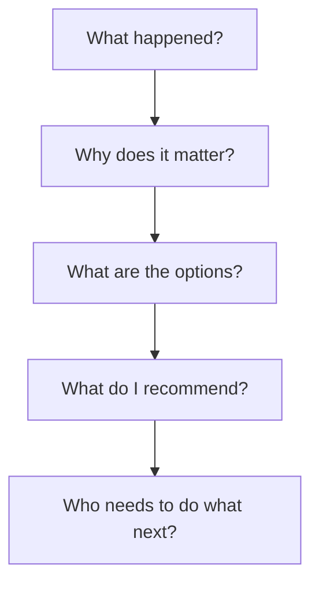
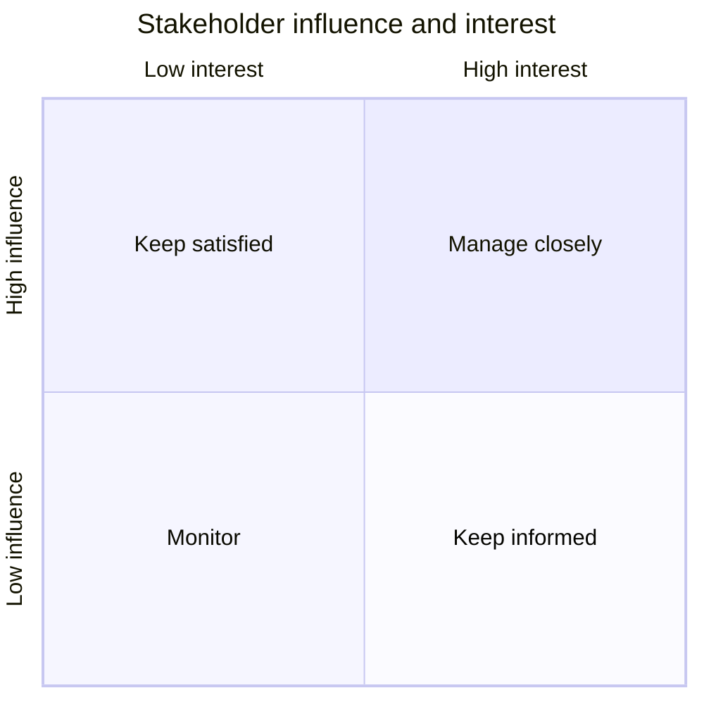
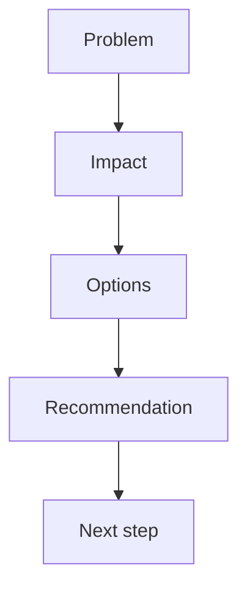
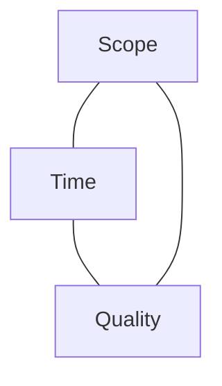
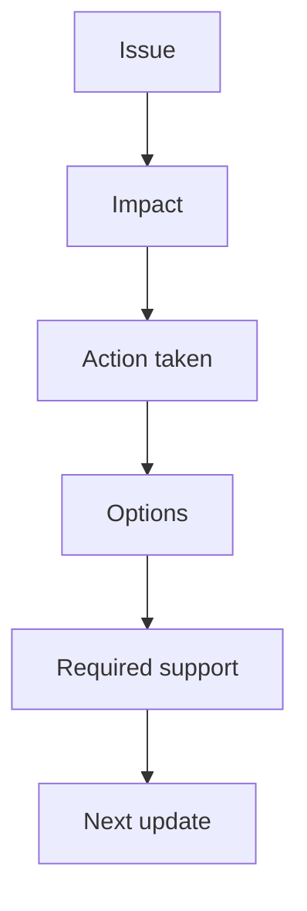
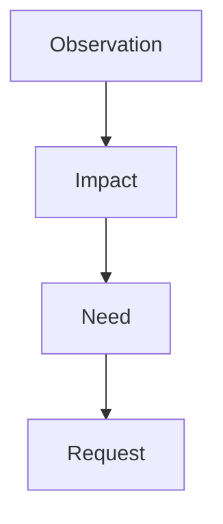
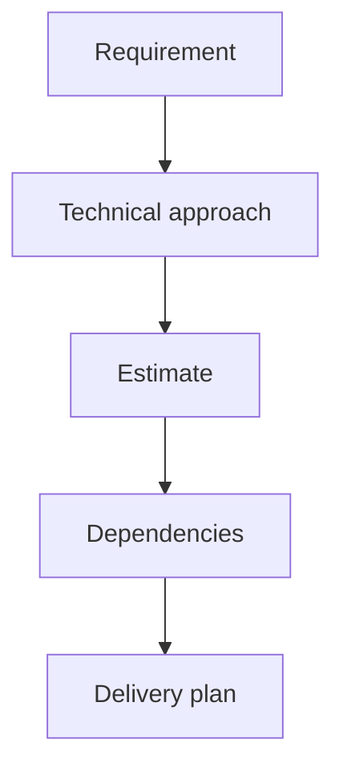
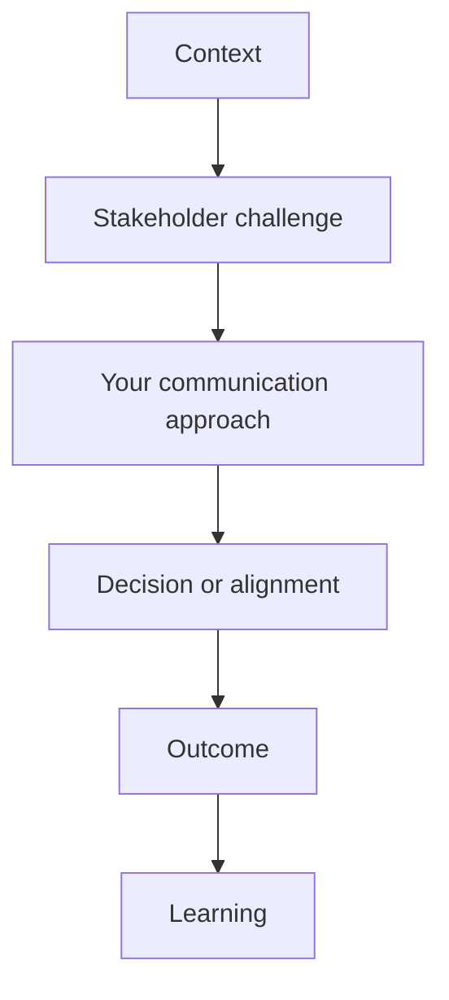

# Stakeholder Communication

> Learn how to communicate clearly with technical and non-technical stakeholders during project delivery, decision-making, risk management, and conflict resolution.

## In short

- Every update should carry the same five beats: what happened, why it matters, what the options are, what you recommend, and who does what next.
- Adapt the detail to the audience — leadership wants business impact and a decision, product wants scope and timeline, engineering wants the design.
- Lead with the outcome and the business impact, not the implementation. “Search is slow and customers are leaving” lands; “we need an index and a query refactor” does not.
- Separate facts from assumptions from recommendations, and say plainly when you do not know yet — then attach a plan for finding out.
- Communicate bad news early. Early gives the stakeholder a problem, options, and time to decide; late gives them a problem, urgency, and no options.
- Silence is not agreement. Confirm requirements, scope changes, decisions, and owners in writing, even when they were agreed verbally.
- Scope, time, and quality move together, so never commit to a date before you understand dependencies, testing, and review effort.



**Interview answer:** Set up an audience gap — two groups who needed the same information in different forms, or a stakeholder whose stated request was not their real need. Show how you translated: what you asked to uncover the actual requirement, how you framed the technical constraint in business terms, and what options you put in front of the decision-maker. Close on the decision that was reached, the written record you left behind, and the outcome.

**Gotcha:** Answering with “I kept everyone updated.” Frequency is not communication; the interviewer is listening for a real communication problem you solved, not a reporting cadence you maintained.

---

# 1. What Is Stakeholder Communication?

Stakeholder communication is the process of sharing information, collecting feedback, managing expectations, and creating alignment with people who are affected by a project or can influence its outcome.

For a developer, communication is not limited to explaining code. It also includes:

- Understanding business requirements.
- Clarifying unclear expectations.
- Explaining technical trade-offs.
- Sharing progress and risks.
- Raising blockers early.
- Negotiating scope and timelines.
- Helping stakeholders make informed decisions.
- Confirming that everyone has the same understanding.

A technically strong solution can still fail when stakeholders do not understand its purpose, limitations, risks, or progress. Successful delivery needs strong engineering *and* clear stakeholder communication; neither substitutes for the other.

---

# 2. Why It Matters for Developers

As developers gain experience, their responsibilities move beyond completing assigned tickets. They are expected to participate in planning, estimation, design discussions, production support, cross-team coordination, and decision-making.

Stakeholder communication becomes important because it helps developers:

- Avoid building the wrong solution.
- Reduce requirement misunderstandings.
- Detect risks before they become incidents.
- Build trust with product and business teams.
- Negotiate realistic deadlines.
- Explain why technical work is necessary.
- Handle production issues professionally.
- Influence decisions without formal authority.

For an intermediate-level developer, good communication demonstrates maturity and ownership.

## 2.1 Technical Work Is Connected to Business Outcomes

A stakeholder usually does not care only about implementation details. The same problem looks different from each side. The developer view:

> “We need to add an index and refactor the query.”

The business view:

> “Search results are slow, customers are leaving, and support complaints are increasing.”

Effective communication connects both views:

> The current search query becomes slow when the number of records increases. Adding the right database index and restructuring the query should reduce response time and improve the user experience. We need approximately two development days and one testing day.

This explanation gives the stakeholder the problem, the business impact, the proposed solution, the expected outcome, and the estimated effort.

---

# 3. Who Are the Stakeholders?

A stakeholder is anyone who affects the project, depends on it, funds it, manages it, supports it, or uses it.

## 3.1 Common Stakeholders for Developers

**Internal:** product managers, engineering managers, technical leads, QA engineers, UI/UX designers, DevOps or platform teams, security teams, support teams, sales teams, finance teams, compliance teams, and senior leadership.

**External:** customers, client representatives, vendors, payment providers, cloud providers, auditors, regulators, and integration partners.

## 3.2 Stakeholder Influence and Interest

Not every stakeholder needs the same amount of communication. A simple way to classify stakeholders is by their **influence** and **interest**.



- **Manage closely** — high influence and high interest: the product owner, engineering manager, a major client, the project sponsor. They need regular updates, early risk communication, and involvement in major decisions.
- **Keep satisfied** — high influence, lower day-to-day interest: senior leadership, compliance leadership, a department head. They need concise summaries, major milestones, risks, and business impact.
- **Keep informed** — high interest, limited decision-making authority: QA, support, operations, and dependent development teams. They need enough detail to prepare their work and understand changes.
- **Monitor** — lower influence and lower direct interest. They do not need frequent updates unless the project starts affecting them.

---

# 4. Core Principles of Effective Communication

Good stakeholder communication rests on five principles: clarity, context, timeliness, ownership, and confirmation.

## 4.1 Clarity

Use direct and understandable language.

Avoid:

> The service has a transient downstream dependency degradation because of an upstream availability issue.

Prefer:

> The payment service is currently failing because the external bank API is unavailable.

## 4.2 Context

Do not share information without explaining why it matters.

Instead of:

> The database CPU is at 85%.

Say:

> Database CPU has remained above 85% for the last 20 minutes. This is increasing API response time and may affect checkout traffic if the load continues.

## 4.3 Timeliness

Communicate important information early. A stakeholder can usually handle bad news better than a last-minute surprise. Early communication gives them a problem, options, and time to decide. Late communication gives them a problem, urgency, and limited options.

## 4.4 Ownership

Ownership does not mean solving everything alone. It means clearly stating the issue, identifying the impact, taking the next reasonable action, involving the right people, and following up until closure.

A strong ownership statement sounds like this:

> The deployment is blocked because the production secret is missing. I have contacted the platform team and prepared the remaining deployment steps. If we receive the secret by 3 PM, we can still deploy today. I will share the next update at 2 PM.

## 4.5 Confirmation

Do not assume that silence means agreement. Confirm requirements, deadlines, scope changes, ownership, decisions, and follow-up actions.

> To confirm, we will release the basic reporting flow this sprint and move CSV export to the next sprint. Priya will confirm the final column list by Wednesday.

---

# 5. Understanding Stakeholder Needs

Different stakeholders look at the same project from different perspectives.

| Stakeholder | Looks at |
|---|---|
| Business stakeholder | Value, cost, customer impact, deadline |
| Product manager | Scope, priority, user experience, delivery |
| Engineering manager | Feasibility, risk, quality, capacity |
| Developer | Design, implementation, maintainability |
| QA engineer | Acceptance criteria, testability, regression risk |
| Security team | Data protection, access, compliance |
| Support team | User issues, troubleshooting, operational readiness |

## 5.1 Ask What Decision the Stakeholder Needs to Make

Before sharing information, ask yourself what this person needs to know, what decision they need to make, what action you expect from them, how much technical detail is useful, and what happens if they misunderstand. This avoids both over-explaining and under-explaining.

## 5.2 Separate Facts, Assumptions, and Recommendations

Stakeholders should know what is confirmed and what is uncertain.

- **Fact:** The provider API failed 18% of requests during testing.
- **Assumption:** The failure rate may increase during peak traffic.
- **Recommendation:** Add retries with backoff and keep the existing provider as a fallback.

This structure improves trust because it prevents assumptions from being presented as facts.

## 5.3 Listen Before Proposing a Solution

Sometimes a stakeholder asks for a specific feature, but the underlying problem may be different.

> Stakeholder request: "Add an export button to every page."

A developer should explore the real need: who needs the export, what data they need, how often, in which format, and whether this is for reporting, audit, or data migration. The actual requirement may be a scheduled report rather than multiple export buttons.

---

# 6. Choosing the Right Communication Style

The same message should be communicated differently depending on the audience.

## 6.1 Communication by Audience

| Audience | Focus | Level of Detail |
|---|---|---:|
| Senior leadership | Business impact, risk, cost, decision | Low |
| Product manager | Scope, priority, timeline, user impact | Medium |
| Engineering team | Technical design, dependencies, trade-offs | High |
| QA team | Acceptance criteria, test cases, edge cases | High |
| Client | Outcome, timeline, limitations, next steps | Medium |
| Support team | User impact, workaround, troubleshooting | Medium |

## 6.2 Example: Same Issue, Different Audience

To the **engineering team**:

> The API latency is caused by an N+1 query in the order serializer. We can fix it using `select_related` and `prefetch_related`. Initial profiling shows query count can drop from 126 to 8.

To the **product manager**:

> The order page is slow because the backend fetches related data inefficiently. The fix should improve page load time without changing functionality. We need one development day and regression testing.

To **leadership**:

> The order page performance issue is affecting users with large accounts. A low-risk backend optimization is ready and can be released after one day of testing.

The technical truth remains the same, but the language and focus change.

## 6.3 Match the Communication Channel

| Situation | Preferred Channel |
|---|---|
| Quick clarification | Chat or direct message |
| Complex decision | Meeting followed by written summary |
| Requirement confirmation | Ticket, email, or project document |
| Urgent production incident | Incident channel or call |
| Weekly progress | Written status update |
| Sensitive feedback | Private conversation |
| Major architecture decision | Design document and review meeting |

Important decisions should always have a written record, even when discussed verbally.

---

# 7. Communicating Technical Information Clearly

Developers often need to explain complex technical topics to people who do not have the same technical background.

## 7.1 Start with the Outcome

Do not begin with implementation details. Instead of:

> We need to create a Redis-based distributed locking mechanism.

Start with:

> We need to prevent the same payment from being processed twice when multiple requests arrive at the same time.

Then explain the solution:

> We can use a short-lived distributed lock so only one request processes the payment at a time.

## 7.2 Use a Problem–Impact–Options–Recommendation Structure

A useful communication framework is:



### Example

**Problem:** The current image upload process stores files directly on the application server.

**Impact:** As traffic grows, deployments become risky and server storage may run out.

**Options:**

1. Increase server disk space.
2. Move uploads to object storage.
3. Limit file retention.

**Recommendation:** Move uploads to object storage because it scales better and separates application deployment from file storage.

**Next step:** Prepare a small proof of concept and migration plan.

## 7.3 Use Analogies Carefully

Analogies help explain technical concepts, but they should remain accurate.

> A cache works like keeping frequently used documents on your desk instead of walking to the archive room every time.

Then add the limitation:

> However, when the original document changes, we must also refresh or remove the cached copy.

## 7.4 Explain Trade-offs, Not Only Benefits

Every engineering decision has trade-offs.

| Option | Benefit | Trade-off |
|---|---|---|
| Build internally | Full control | Higher development and maintenance cost |
| Use third-party service | Faster delivery | Vendor dependency and recurring cost |
| Deliver small MVP | Faster feedback | Limited first-release capability |
| Build full solution | More complete | Higher risk and longer timeline |

A mature developer does not present one option as perfect. They explain the advantages, costs, and risks.

---

# 8. Managing Expectations

Managing expectations means ensuring that stakeholders understand what will be delivered, when it will be delivered, what is not included, and what risks remain.

## 8.1 Clarify the Delivery Triangle

Most project discussions involve three connected constraints.



Changing one constraint usually affects the others. Increasing scope may increase delivery time, reducing time may require reducing scope, keeping full scope and fixed time may increase quality risk, and improving quality may require more testing and implementation effort.

## 8.2 Avoid Overcommitting

Do not agree to a deadline before understanding scope, dependencies, testing effort, the review process, deployment requirements, team availability, and unknown technical risks.

A better response is:

> Based on the current information, the core API work looks achievable within four days. I need to confirm the external provider behavior and QA effort before committing to the release date.

This is more professional than giving an optimistic date and missing it later.

## 8.3 Define What “Done” Means

Different people may interpret completion differently. For a developer, “done” may mean code is complete. For a product manager, it may mean code reviewed, QA passed, deployed to production, documentation updated, and the support team informed. Confirm the completion criteria early.

## 8.4 Communicate Confidence Levels

When an estimate contains uncertainty, communicate it.

> I am confident about the backend changes, but the provider integration is still uncertain because their sandbox behaves differently from production. The current estimate is three to five days.

This is better than presenting an uncertain estimate as a fixed promise.

---

# 9. Communicating Risks, Delays, and Blockers

One of the strongest signs of professional maturity is the ability to communicate bad news early and constructively.

## 9.1 A Good Risk Update

A useful risk update answers six questions: what happened, what the impact is, what has already been done, what options are available, what decision or help is needed, and when the next update will be shared.



## 9.2 Example: Delay Communication

Weak communication:

> The feature will be delayed because the integration is difficult.

Strong communication:

> The release is at risk because the payment provider returns inconsistent status values between its sandbox and documentation. We completed the normal payment flow, but refund testing is blocked. I have raised the issue with the provider and prepared a fallback mapping based on observed responses. We have two options: release payments without refunds this week, or move the full release by three working days. Product input is needed on which option is preferable.

The stronger version is specific, calm, and action-oriented.

## 9.3 Raise Risks Before They Become Problems

A risk is something that may happen: the external API may not support our expected traffic. An issue is something that has already happened: load testing shows the external API starts rejecting requests above 50 requests per second.

Good communication raises the risk during planning rather than waiting for it to become an issue.

## 9.4 Do Not Hide Uncertainty

It is acceptable to say “we do not know yet,” “this is an assumption,” “we need more data,” or “the estimate may change after the proof of concept.” However, uncertainty should be followed by a plan:

> We do not yet know whether the current database can handle the expected reporting load. I will run a production-like load test using anonymized data and share the results tomorrow.

---

# 10. Handling Conflicting Stakeholder Priorities

Stakeholders often have different goals.

| Group | Wants |
|---|---|
| Product | Faster feature delivery |
| Engineering | Maintainable architecture |
| Security | Stricter controls |
| Sales | Client-specific customization |
| Operations | Stability and easy support |

The developer's role is not to choose based on personal preference. The goal is to make trade-offs visible and help the right decision-maker choose.

## 10.1 Focus on Shared Outcomes

Instead of saying:

> Security is blocking the release.

Say:

> The current approach allows faster release, but it does not meet the required access-control standard. We need either two additional days to add role validation or written approval to limit the first release to internal users.

This avoids blaming another team and focuses on the decision.

## 10.2 Make Constraints Visible

A simple decision table helps stakeholders compare options.

| Option | Delivery | Risk | Cost | Limitation |
|---|---:|---:|---:|---|
| Release current scope | Fast | High | Low | Security gap remains |
| Reduce scope | Medium | Low | Low | Some users wait |
| Delay full release | Slow | Low | Medium | Timeline changes |

## 10.3 Escalate with Context, Not Emotion

Escalation should not sound like a complaint.

Weak escalation:

> The infrastructure team is not responding and they always delay us.

Professional escalation:

> Production deployment requires a firewall rule from the infrastructure team. The request has been pending since Monday, and the release is scheduled for Thursday. I followed up twice and shared the required details. We now need help confirming an owner by Wednesday noon to protect the release date.

---

# 11. Giving Project Updates

A project update should help stakeholders quickly understand what has been completed, what is currently in progress, what is blocked or at risk, what decisions are needed, and what happens next.

## 11.1 Simple Status Update Format

```text
Status: On Track / At Risk / Blocked

Completed:
- ...

In Progress:
- ...

Risks or Blockers:
- ...

Decision Needed:
- ...

Next:
- ...
```

## 11.2 Example Weekly Update

> **Status: At Risk**
>
> **Completed**
> - Finished customer onboarding APIs.
> - Added audit logging for profile updates.
> - Completed initial QA for the standard workflow.
>
> **In Progress**
> - Working on document verification integration.
>
> **Risk**
> - The verification provider has not confirmed the production callback format. This may affect the planned Friday release.
>
> **Action**
> - The team has completed a fallback polling approach.
>
> **Decision Needed**
> - Confirm whether to release onboarding without automatic verification or move the release to next Tuesday.
>
> **Next**
> - Complete fallback testing and share the final recommendation by Thursday morning.

## 11.3 Use RAG Status Carefully

RAG means **Green** for on track with no significant concern, **Amber** for at risk but recoverable with action in progress, and **Red** for blocked or unable to meet the commitment without intervention.

Do not mark everything green to avoid difficult conversations. The status should reflect reality.

---

# 12. Driving Decisions and Alignment

Communication is not complete until the team knows what was decided and what happens next.

## 12.1 Decision Communication Format

A strong decision record contains:

```text
Decision:
Why:
Alternatives Considered:
Trade-offs:
Owner:
Effective Date:
Follow-up:
```

### Example

> **Decision:** Use the managed queue service instead of building a custom queue.
>
> **Why:** It supports retries, monitoring, and scaling without additional operational work.
>
> **Alternatives considered:** Database-based queue and self-hosted message broker.
>
> **Trade-off:** The managed service introduces recurring cloud cost and some vendor dependency.
>
> **Owner:** Platform team.
>
> **Follow-up:** Review cost and throughput after three months.

## 12.2 End Meetings with Clear Actions

Before a discussion ends, confirm what was decided, what is still open, who owns each action, what the deadline is, and when the team will review progress.

> To summarize, we will proceed with the reduced launch scope. Rahul will update the API contract by Tuesday, Neha will revise the QA plan by Wednesday, and I will share the migration script by Thursday. The export feature remains out of scope for this release.

## 12.3 Avoid False Agreement

A meeting can appear successful even when participants have different interpretations. Useful confirmation phrases include “Let me confirm my understanding,” “The decision I captured is…,” “The remaining open question is…,” “The owner for this action is…,” and “The agreed deadline is…”

---

# 13. Handling Difficult Conversations

Difficult conversations may involve disagreement, missed commitments, production failures, unrealistic deadlines, or negative feedback.

## 13.1 Stay Focused on Facts and Impact

Avoid personal statements. Instead of:

> You gave us incomplete requirements.

Say:

> The acceptance criteria did not include the partial-refund workflow, so it was not included in the implementation. We now need to decide whether to add it to this release or schedule it for the next sprint.

## 13.2 Use a Calm Structure



> The API contract changed twice after development started. This caused rework and reduced testing time. For future changes, we need a confirmed contract before implementation. Can we add a short API review and sign-off step before development begins?

## 13.3 Disagree with the Idea, Not the Person

> I understand why a synchronous process looks simpler. My concern is that the operation can take more than 30 seconds, which may cause request timeouts. I recommend processing it asynchronously and showing the user a status update.

This communicates respect, reasoning, and an alternative.

## 13.4 Accept Responsibility Clearly

When you make a mistake, acknowledge it, explain the impact, fix or contain it, prevent recurrence, and share the next update.

> I missed the timezone conversion in the scheduling logic, which caused some notifications to run one hour late. I have disabled the affected job, corrected the conversion, and added timezone-based tests. We are validating impacted records now, and I will share the final count after verification.

Avoid defensive language or excessive excuses.

---

# 14. Stakeholder Communication Across the Project Lifecycle

Communication needs change during each phase of a project.

| Phase | Focus on |
|---|---|
| Discovery | The business problem, user needs, success criteria, constraints, dependencies, and assumptions. Ask what problem we are solving, who experiences it, how success is measured, what is mandatory for the first release, and which systems or teams are involved. |
| Planning | Scope, estimates, risks, milestones, roles, and decision owners. |
| Development | Progress, requirement clarification, scope changes, technical risks, and cross-team dependencies. Updates should be regular enough to prevent surprises, but not so frequent that they create noise. |
| Testing | Test coverage, defects, release blockers, known limitations, and acceptance criteria. Stakeholders should understand the difference between a critical defect, a minor issue, a known limitation, and a future enhancement. |
| Release | Deployment timing, rollback plan, monitoring, support readiness, user communication, and ownership during release. |
| Post-release | System health, user feedback, incidents, success metrics, follow-up improvements, and lessons learned. |

The planning phase in particular follows a fixed chain:



---

# 15. Practical Communication Templates

## 15.1 Requirement Clarification

```text
My understanding is:

- The user should be able to ...
- This applies when ...
- The expected result is ...
- This does not include ...

Open questions:

- ...
- ...

Please confirm whether this matches the expected behavior.
```

## 15.2 Risk Communication

```text
Risk:
[Describe what may happen.]

Potential Impact:
[Explain affected users, timeline, cost, or quality.]

Current Assessment:
[Probability, evidence, and uncertainty.]

Mitigation:
[What is being done.]

Decision or Support Needed:
[Specific request.]

Next Update:
[When more information will be shared.]
```

## 15.3 Delay Communication

```text
The planned delivery date is at risk because [specific reason].

Completed:
[What is already finished.]

Remaining:
[What is still pending.]

Impact:
[What will be delayed or limited.]

Options:
1. [Option and trade-off]
2. [Option and trade-off]

Recommendation:
[Preferred option and reason.]
```

## 15.4 Decision Summary

```text
Decision:
[What was agreed.]

Reason:
[Why this option was selected.]

Trade-offs:
[What we accept by choosing it.]

Owner:
[Responsible person or team.]

Due Date:
[Expected completion.]

Open Items:
[Anything not yet resolved.]
```

## 15.5 Production Incident Update

```text
Status:
Investigating / Identified / Mitigated / Resolved

Impact:
[Who or what is affected.]

Start Time:
[When the issue began.]

Current Findings:
[Known facts only.]

Action Taken:
[Containment or fix.]

Next Step:
[Immediate next action.]

Next Update:
[Specific update time.]
```

---

# 16. Using Behavioral Examples Effectively

In behavioral interviews, stakeholder communication is usually evaluated through real situations.

A strong example should show more than “I kept everyone updated.” It should demonstrate different stakeholder needs, a real communication challenge, your reasoning, how you adapted your communication, how you handled uncertainty or disagreement, the final outcome, and what you learned.

## 16.1 A Useful Story Structure

Deliver it with STAR — see [The STAR Method](star-method.md) — where the context is the Situation, the stakeholder challenge and your communication approach carry the Task and Action, and the alignment reached is the Result.



## 16.2 Example Scenario

### Context

A client requested an urgent reporting feature before a regulatory deadline. The initial request appeared small, but the data needed to come from three systems owned by different teams.

### Stakeholder Challenge

- The client expected delivery in one week.
- Product wanted to accept the request.
- Engineering estimated two weeks.
- Compliance required validation before release.

### Communication Approach

The developer:

1. Broke the requirement into mandatory and optional fields.
2. Confirmed the regulatory deadline and minimum acceptable output.
3. Prepared two delivery options.
4. Explained technical dependencies in business language.
5. Recommended delivering the mandatory report first.
6. Sent a written summary with owners and dates.

### Outcome

The team released the mandatory report before the deadline and delivered optional enhancements later. The client received the required data without compromising validation.

### What This Demonstrates

Requirement clarification, expectation management, cross-functional communication, trade-off analysis, ownership, and written alignment.

---

# 17. Best Practices

- **Communicate early.** Do not wait until the deadline to report a problem.
- **Lead with business impact.** Explain how the technical issue affects users, revenue, operations, security, or delivery.
- **Be specific.** Use exact facts, dates, owners, risks, and next actions.
- **Adapt to the audience.** Do not give database-level detail to leadership unless it is necessary for a decision.
- **Offer options.** When possible, provide two or three realistic options with trade-offs.
- **Make a recommendation.** Do not only transfer the decision to the stakeholder; share your professional reasoning.
- **Document important decisions.** Written communication prevents future confusion and creates accountability.
- **Confirm understanding.** Summarize the agreement and ask for confirmation when requirements or decisions are important.
- **Separate people from problems.** Avoid blame. Focus on facts, impact, process, and resolution.
- **Close the loop.** After a risk, action, or incident is resolved, inform the stakeholders. Do not assume they already know.

Effective stakeholder communication does not require complex vocabulary or frequent meetings. It requires clarity, empathy, timing, ownership, and a focus on helping people make good decisions.
