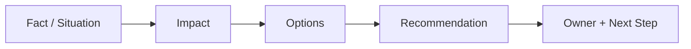
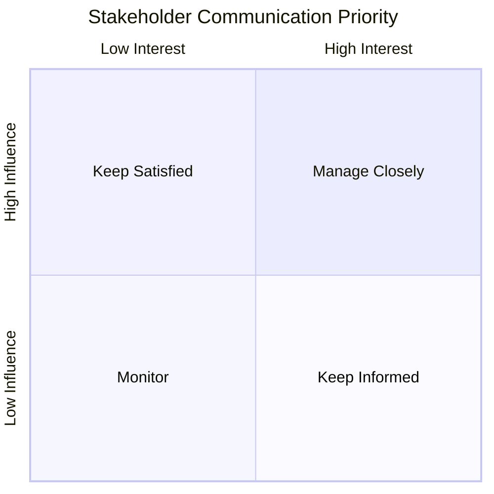
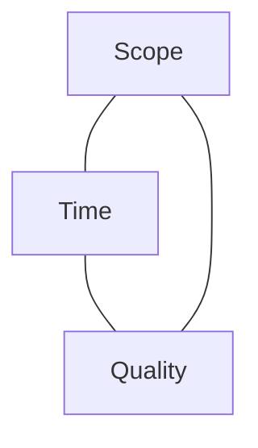
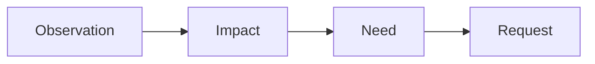
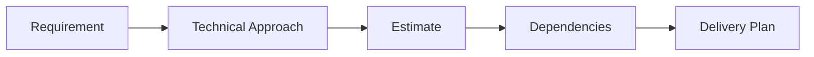

# Stakeholder Communication

> Communicate technical work in a way that helps technical and non-technical stakeholders understand impact, make decisions, manage risk, and stay aligned.

## In Short

- Start with **what happened and why it matters**, not implementation details.
- Adapt the message to the audience: leadership needs impact and decisions; product needs scope and timeline; engineering needs technical detail.
- Separate **facts, assumptions, risks, and recommendations**.
- Communicate bad news early, while there are still options.
- Never raise only a problem. Share the impact, available options, your recommendation, and the next action.
- Confirm important requirements, decisions, owners, scope changes, and deadlines in writing.
- Do not commit to a date until you understand dependencies, testing, review, deployment, and uncertainty.
- Good communication is not frequent status reporting; it is helping the right people make the right decisions.



---

# 1. What Is Stakeholder Communication?

Stakeholder communication is the process of sharing information, collecting feedback, managing expectations, and creating alignment with people who affect a project or are affected by it.

For a developer, this includes:

- Clarifying requirements.
- Explaining technical constraints and trade-offs.
- Sharing progress, risks, and blockers.
- Negotiating scope and timelines.
- Supporting product and business decisions.
- Coordinating with other engineering teams.
- Confirming decisions and ownership.

A technically correct solution can still fail if the team builds the wrong requirement, stakeholders expect something different, risks are communicated too late, or important decisions are never recorded.

---

# 2. Know Your Stakeholders

A stakeholder can be a product manager, engineering manager, QA engineer, security team, support team, client, vendor, leadership team, or any other person who depends on the project.

## 2.1 Different Stakeholders Need Different Information

| Stakeholder | Main Concern | Useful Communication |
|---|---|---|
| Leadership | Business impact, risk, cost, decision | Short and outcome-focused |
| Product | Scope, priority, timeline, user impact | Medium detail |
| Engineering | Design, dependencies, performance, trade-offs | Technical detail |
| QA | Acceptance criteria, edge cases, regression risk | Testable detail |
| Security / Compliance | Data, access, controls, compliance risk | Risk and control detail |
| Client / Business | Outcome, limitation, timeline, next step | Clear non-technical language |
| Support / Operations | User impact, workaround, monitoring | Operational detail |

Before sending an update, ask:

1. **What does this person need to know?**
2. **What decision or action do I need from them?**
3. **How much technical detail helps that decision?**
4. **What could happen if they misunderstand the message?**

## 2.2 Influence and Interest

Not everyone needs the same communication frequency.



- **Manage closely:** product owner, engineering manager, major client, sponsor.
- **Keep satisfied:** senior leadership or compliance leadership.
- **Keep informed:** QA, support, operations, dependent teams.
- **Monitor:** people with limited project impact unless conditions change.

The goal is not maximum communication. The goal is the **right information, through the right channel, at the right time**.

---

# 3. Use a Clear Communication Structure

A practical structure for most developer communication is:

**Situation → Impact → Options → Recommendation → Next Step**

## 3.1 Situation

State what is known.

> The payment provider is returning different refund statuses in the sandbox and its documentation.

## 3.2 Impact

Explain why it matters.

> Normal payments are working, but we cannot confidently complete refund testing. This puts Friday's release at risk.

## 3.3 Options

Give realistic choices.

> We can release payments without refunds this week, or move the complete release by three working days.

## 3.4 Recommendation

Give your professional view.

> I recommend delaying the complete release because refund behavior affects financial correctness.

## 3.5 Next Step

Make ownership explicit.

> Product needs to confirm the release option today. Engineering will continue provider testing and share another update tomorrow morning.

This structure works for blockers, production incidents, technical proposals, architecture discussions, estimation changes, and project updates.

---

# 4. Translate Technical Work Into Business Impact

Technical stakeholders care about implementation. Business stakeholders usually care about customer impact, risk, cost, timeline, and outcome.

Avoid starting with:

> We need to add an index and refactor the query.

Prefer:

> Search becomes slow for customers with large datasets. The issue comes from an inefficient database query. A backend optimization should improve response time without changing functionality, and it needs about two development days plus testing.

The second version still communicates the technical truth, but it connects it to a business outcome.

## 4.1 Same Issue, Different Audience

**Engineering**

> The order serializer creates an N+1 query. We can reduce database calls using `select_related` and `prefetch_related`.

**Product**

> The order page is slow because the backend repeatedly fetches related data. The fix does not change functionality and should take one development day plus regression testing.

**Leadership**

> The order page is slow for larger customers. A low-risk backend optimization is available and can be released after testing.

The information is consistent; only the level of detail changes.

---

# 5. Clarify Requirements Before Building

Stakeholders sometimes ask for a specific feature when their actual need is different.

Example request:

> "Add an export button to every page."

Before implementing, clarify:

- Who needs the export?
- What data do they need?
- How often do they use it?
- Which format is required?
- Is the purpose reporting, audit, migration, or manual analysis?
- Does it need to be real-time?

The real requirement may be a scheduled report rather than multiple export buttons.

## 5.1 Confirm Your Understanding

A simple confirmation format:

```text
My understanding:

- The user should be able to ...
- This applies when ...
- The expected result is ...
- This does not include ...

Open questions:

- ...
- ...

Please confirm whether this matches the expected behavior.
```

Written confirmation is especially important for:

- Scope changes.
- Acceptance criteria.
- External integrations.
- Security or compliance requirements.
- Delivery dates.
- Ownership.

Silence should not be treated as agreement.

---

# 6. Manage Scope, Time, and Quality

Delivery discussions usually involve three connected constraints:



Changing one usually affects the others.

- More scope usually needs more time.
- Less time may require reduced scope.
- Fixed scope and fixed time may increase delivery or quality risk.
- Higher quality may require more implementation and testing effort.

## 6.1 Do Not Commit Too Early

Before committing to a delivery date, understand:

- Scope.
- Dependencies.
- External providers.
- Technical unknowns.
- Code review.
- QA effort.
- Deployment requirements.
- Team availability.

A professional estimate sounds like:

> The core API work looks achievable in four days. I still need to confirm provider behavior and QA effort before committing to the production release date.

## 6.2 Communicate Confidence

Avoid presenting uncertain estimates as fixed promises.

> I am confident about the backend changes, but the provider integration is still uncertain because its sandbox differs from production. The current estimate is three to five days.

This gives stakeholders useful information without creating false certainty.

---

# 7. Communicate Risks, Delays, and Blockers Early

A risk communicated early gives stakeholders time to choose. The same risk communicated at the deadline becomes an emergency.

A strong risk update contains:

```text
Issue / Risk:
What happened or may happen?

Impact:
What users, timeline, cost, or quality may be affected?

Current Action:
What have we already done?

Options:
What realistic choices exist?

Recommendation:
What do we recommend and why?

Support Needed:
Who needs to decide or unblock something?

Next Update:
When will we communicate again?
```

## 7.1 Risk vs Issue

- **Risk:** Something that may happen.
  - Example: The external API may not support expected peak traffic.
- **Issue:** Something that has already happened.
  - Example: Load testing shows the API rejects requests above 50 requests per second.

Mature communication raises important risks during planning instead of waiting for them to become issues.

## 7.2 It Is Fine to Say "We Do Not Know Yet"

Uncertainty is acceptable when it is paired with a plan.

> We do not yet know whether the current database can handle the reporting load. I will run a production-like load test with anonymized data and share the result tomorrow.

---

# 8. Handle Conflicting Priorities Without Blame

Different stakeholders naturally optimize for different outcomes.

| Group | Typical Priority |
|---|---|
| Product | Faster feature delivery |
| Engineering | Maintainability and reliability |
| Security | Strong controls |
| Sales | Client requests |
| Operations | Stability and supportability |

Your role is not to "win" the disagreement. Make the trade-offs visible so the appropriate decision-maker can choose.

Avoid:

> Security is blocking the release.

Prefer:

> The current implementation can ship faster, but it does not meet the required access-control standard. We can add role validation in two days, or limit the first release to internal users.

## 8.1 Escalate with Context

Weak escalation:

> The infrastructure team is not responding.

Better:

> Production deployment requires a firewall rule. The request has been pending since Monday, and the release is Thursday. I have followed up twice and provided the required details. We need an owner confirmed by Wednesday noon to protect the release date.

Escalation should communicate **dependency, impact, previous action, and required help**.

---

# 9. Drive Decisions and Close the Loop

A discussion is incomplete until everyone knows:

- What was decided.
- Why it was decided.
- What trade-off was accepted.
- Who owns the next action.
- When it is due.
- What remains open.

Use a lightweight decision record:

```text
Decision:
[What was agreed]

Reason:
[Why this option was selected]

Trade-offs:
[What we accept]

Owner:
[Person or team]

Due Date:
[Expected completion]

Open Items:
[Anything unresolved]
```

Important decisions should have a written source of truth even when they were made in a meeting or call.

A strong meeting close sounds like:

> We will release the reduced scope. Rahul will update the API contract by Tuesday, QA will revise the test plan by Wednesday, and the export feature remains out of scope for this release.

---

# 10. Handling Difficult Conversations

Difficult discussions are easier when communication stays focused on **facts, impact, need, and request**.



Example:

> The API contract changed twice after development started. This caused rework and reduced testing time. We need a stable contract before implementation begins. Can we add a short API review and sign-off step before development?

This avoids personal blame while still addressing the problem.

## 10.1 Disagree With the Idea, Not the Person

> A synchronous flow is simpler, but this operation can take more than 30 seconds and may time out. I recommend processing it asynchronously and showing the user a status update.

## 10.2 When You Make a Mistake

Acknowledge:

1. What happened.
2. The impact.
3. What you did to contain or fix it.
4. How recurrence will be reduced.
5. When the next update will come.

Avoid defensiveness and unnecessary excuses.

---

# 11. Communication Across the Project Lifecycle

| Phase | Main Communication Focus |
|---|---|
| Discovery | Business problem, users, success criteria, assumptions, dependencies |
| Planning | Scope, estimate, risks, milestones, owners |
| Development | Progress, blockers, scope changes, technical risk |
| Testing | Acceptance criteria, defects, regression risk, release blockers |
| Release | Deployment timing, rollback, monitoring, support readiness |
| Post-release | System health, user feedback, incidents, metrics, follow-up work |

A useful planning chain is:



---

# 12. One Practical End-to-End Example

A client needs an urgent regulatory report in one week. The request initially sounds small, but the data comes from three systems owned by different teams.

## Situation

- Client expects delivery in one week.
- Product wants to accept the request.
- Engineering estimates two weeks.
- Compliance requires validation before release.

## Communication Approach

The developer:

1. Confirms the regulatory deadline and the minimum mandatory output.
2. Splits fields into **mandatory** and **optional**.
3. Identifies dependencies on the three systems.
4. Prepares two delivery options.
5. Explains the technical dependencies using business language.
6. Recommends shipping the mandatory report first.
7. Records the decision, owners, dates, and remaining scope in writing.

## Result

The mandatory report is delivered before the deadline, optional enhancements move to the next release, and compliance validation is not bypassed.

This example demonstrates the core skills interviewers usually look for in stakeholder communication:

**requirement clarification → trade-off analysis → audience adaptation → expectation management → recommendation → written alignment → outcome**

---

# 13. Best Practices to Remember

- **Lead with impact.** Explain what the technical situation means for users, delivery, security, revenue, cost, or operations.
- **Be specific.** Use concrete facts, dates, owners, and next actions.
- **Communicate early.** Do not wait until a risk becomes a deadline problem.
- **Match the audience.** Share only the level of detail that helps the stakeholder understand or decide.
- **Offer options.** Show realistic choices and their trade-offs.
- **Make a recommendation.** Use your engineering judgment instead of only passing the decision upward.
- **Separate facts from assumptions.** Make uncertainty visible.
- **Confirm important decisions in writing.**
- **Avoid blame.** Focus on the problem, impact, constraints, and resolution.
- **Close the loop.** When a risk, blocker, or incident is resolved, tell the stakeholders.
- **Keep a source of truth.** Important project decisions and current status should be easy to find.
- **Use meetings for discussion and decisions; use written updates for durable alignment.**

The goal of stakeholder communication is simple: **help people understand the situation, make good decisions, and know what happens next.**
