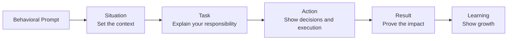
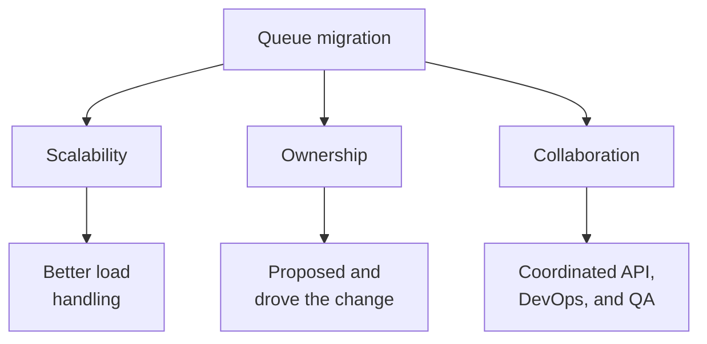
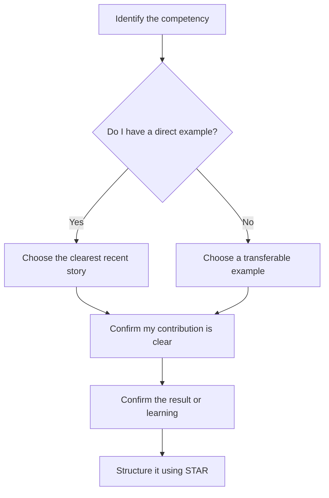
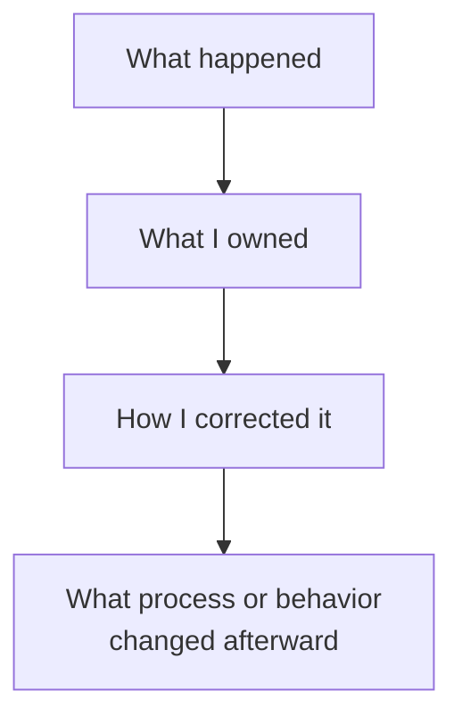

# The STAR Method for Behavioral Interviews

> A practical guide for software developers with 3+ years of experience

## In short

- STAR is **S**ituation, **T**ask, **A**ction, **R**esult: the context, your responsibility, what you personally did, and what changed because of it.
- Action is most of the answer. Situation and Task exist only to make the Action understandable.
- Say **we** for team context and **I** for your own contribution — an interviewer who cannot separate the two learns nothing about you.
- A Result needs a metric or a specific observable outcome. Never invent a number; an honest approximation you can explain beats an impressive one you cannot.
- Prepare six to eight real stories, not one per topic. A single story can evidence ownership, collaboration, and technical judgment at once.
- Failure stories are strong when they end in a changed process, not in an effortless recovery.
- Aim for roughly one-and-a-half to three minutes, then stop and let the interviewer follow up.



**Interview answer:** Open with two or three sentences of context and the one thing you were responsible for. Spend the middle of the answer on what you investigated, which options you compared, why you chose the one you chose, and how you reduced risk — that is where judgment becomes visible. Close on what measurably changed and one sentence on what you do differently now.

**Gotcha:** Spending most of the answer on background and team context. The interviewer is evaluating you, so a story where every verb is "we" scores as no evidence at all.

---

# 1. What Is the STAR Method?

The **STAR method** is a structured way to explain how you handled a real situation from your past experience.

STAR stands for:

| Part | Meaning | What it explains |
|---|---|---|
| **S** | Situation | The background and context |
| **T** | Task | Your responsibility, goal, or challenge |
| **A** | Action | The specific steps you personally took |
| **R** | Result | The outcome, impact, and learning |

Behavioral interviews are based on a simple idea:

> Your past behavior provides useful evidence of how you may handle similar situations in the future.

Instead of saying, “I am good at handling production issues,” you provide evidence through a real example. A claim without evidence sounds like this:

> “I work well under pressure.”

The same point, delivered as evidence, sounds like this:

> “During a production outage, I coordinated the investigation, identified the faulty deployment, restored service, and introduced a rollback check that reduced recovery time in future incidents.”

The second version is more credible because it shows what actually happened.

---

# 2. Why Behavioral Interviews Use STAR

Technical knowledge explains whether you understand software development. Behavioral examples help an interviewer understand **how you work in real situations**.

A STAR story can demonstrate several professional qualities at the same time: ownership, problem-solving, communication, collaboration, decision-making, adaptability, conflict resolution, customer awareness, technical leadership, and learning from failure.

For an experienced developer, interviewers are usually interested in more than the final technical solution. They also want to understand:

- How you identified the real problem
- How you made trade-offs
- How you involved other people
- How you handled uncertainty or pressure
- How you measured success
- What you learned and changed afterward

STAR helps you present these details in a logical order instead of giving an unstructured story.

---

# 3. The Four Parts of STAR

## 3.1 Situation

The **Situation** gives enough background for the interviewer to understand the environment and problem.

Include only the context needed to follow the story:

- What project or system were you working on?
- What was happening?
- Why did it matter?
- What constraints existed?

### Example

> Our payment API started timing out during peak traffic after a new merchant launch. The failure rate increased from less than 1% to around 8%, and customers were retrying payments.

This is strong because it quickly explains the system, the problem, and the business impact.

### Keep the Situation focused

Avoid spending too much time describing the company, every team member, or the complete architecture. The Situation should set the stage, not become the whole answer.

Too broad:

> “Our company had many services, and several teams worked on a large platform...”

Focused:

> “Our checkout service began timing out after traffic doubled during a campaign.”

## 3.2 Task

The **Task** explains your responsibility in that situation.

Clarify:

- What outcome were you responsible for?
- What problem did you need to solve?
- What decision did you need to make?
- What constraints or deadlines affected your work?

### Example

> I was the backend developer responsible for identifying the bottleneck, stabilizing the API before the next traffic peak, and making sure retries did not create duplicate payments.

A team may own the overall project, but the interviewer needs to understand **your personal responsibility**. The team goal was to improve checkout reliability; your task was to find the source of payment timeouts, deploy a safe fix, and prevent duplicate charges during retries.

## 3.3 Action

The **Action** is the most important part of the answer.

It explains exactly what you did, why you did it, and how you worked through the problem.

Useful action details include:

- How you investigated the issue
- Which data or logs you used
- What options you considered
- What trade-offs you made
- How you communicated with others
- How you reduced risk
- How you implemented and validated the solution

### Example

> I first compared application latency, database wait time, and downstream provider response time. The traces showed that requests were holding database connections while waiting for the payment provider. I proposed moving the external call outside the database transaction, adding an idempotency key, and introducing a bounded retry policy. I reviewed the change with the payments and QA teams, tested duplicate-request scenarios, and released it gradually using a feature flag.

This action is strong because it shows investigation, technical reasoning, risk awareness, collaboration, and safe delivery.

### Use “I” and “we” correctly

Use **we** when describing the team context, but use **I** when describing your contribution.

> We agreed to release the fix gradually. I implemented the transaction change, added the idempotency check, and created the monitoring dashboard.

This gives credit to the team without hiding your contribution.

## 3.4 Result

The **Result** explains what changed because of your actions. A strong Result can include technical improvement, business impact, customer impact, time or cost saved, reduced risk, team learning, process improvement, or personal learning.

### Example

> The timeout rate fell from about 8% to below 0.5%, duplicate payment attempts were safely rejected, and the system handled the next traffic peak without an incident. We later adopted the same idempotency pattern in two other payment workflows.

Where possible, include measurable evidence. A measured result sounds like “API p95 latency dropped from 1.8 seconds to 650 milliseconds.” When exact numbers are unavailable, use specific observable outcomes instead: the release completed without rollback, support tickets stopped, and the new validation became part of the deployment checklist.

A brief learning statement can make the result more mature:

> I learned that the fastest incident fix is not always the safest long-term fix, so I now separate immediate recovery actions from permanent corrective work.

---

# 4. How a Strong STAR Answer Flows

The interviewer normally learns the most from the Action section. That is where your judgment, ownership, communication, and technical maturity become visible, so that is where the speaking time should go.

| Part | Share of the answer | The question it answers |
|---|---|---|
| Situation | Brief context | What was happening? |
| Task | Clear responsibility | What did I need to achieve? |
| Action | Most of the answer | What did I personally do, and why? |
| Result | Impact and learning | What changed, and what did I learn? |

---

# 5. Developer-Focused STAR Example

## Scenario: Reducing Production API Latency

### Situation

> Our customer dashboard API had become slow as account data grew. During peak hours, the p95 response time exceeded three seconds, and users frequently refreshed the page, which created even more load.

### Task

> I was responsible for finding the main bottleneck and improving response time without changing the API contract or delaying a planned release.

### Action

> I enabled query-level monitoring and traced the endpoint from the API layer to PostgreSQL. I found an N+1 query pattern that loaded transaction details separately for every account. I compared `select_related`, `prefetch_related`, a custom aggregate query, and application-level caching. Because the data changed frequently, I avoided broad caching and replaced the repeated queries with a prefetch plus a database aggregation for summary values. I added an index for the most common filter, wrote integration tests for account-level permissions, and tested the query plan with production-like data. I then released the change gradually and monitored latency, database CPU, and error rate.

### Result

> The endpoint’s p95 response time dropped from about 3.2 seconds to 700 milliseconds, database CPU usage during peak traffic decreased, and dashboard-related support complaints stopped. I documented the investigation and added query-count checks to our performance test suite so similar problems could be detected earlier.

## Why this example works

| STAR part | Evidence shown |
|---|---|
| Situation | Real system problem with user impact |
| Task | Clear ownership and constraints |
| Action | Investigation, alternatives, trade-offs, testing, and rollout |
| Result | Metrics, customer impact, and prevention of recurrence |

The story is technical, but it also demonstrates ownership, prioritization, risk management, and communication.

---

# 6. Turning a Weak Answer into a Strong Answer

## Weak version

> The API was slow, so we optimized the database queries. I worked with the team, and performance improved.

This answer is difficult to evaluate because it does not explain how slow the API was, why it was slow, what your responsibility was, what you personally changed, which options you considered, or how much performance improved.

## Stronger version

> Our reporting API reached a p95 latency of nearly four seconds after data volume increased. I owned the performance investigation. Using traces and `EXPLAIN ANALYZE`, I found that a missing composite index caused repeated sequential scans. I compared an index-only change with query restructuring, tested both using production-like data, and selected the index because it provided the required improvement with lower release risk. After deployment, p95 latency dropped below one second and database CPU usage fell by roughly 25%.

## Improvement pattern

| Weak answer | Strong answer |
|---|---|
| Vague context | Specific context |
| Shared responsibility | Personal ownership |
| Generic action | Decisions and reasoning |
| General success | Measurable or observable impact |

---

# 7. Building a Reusable Story Bank

You do not need a different story for every possible behavioral topic. A small set of well-prepared stories can demonstrate multiple competencies.

Prepare approximately **six to eight strong stories** from your real experience. Each story should contain enough detail to be adapted naturally.

## Useful story categories for developers

| Story category | What it can demonstrate |
|---|---|
| Production incident | Ownership, calmness, debugging, communication |
| Difficult technical decision | Trade-offs, judgment, architecture thinking |
| Performance improvement | Analysis, technical depth, measurable impact |
| Conflict or disagreement | Listening, influence, collaboration |
| Missed expectation or failure | Accountability, learning, process improvement |
| Tight deadline | Prioritization, scope control, risk management |
| Process automation | Initiative, efficiency, developer experience |
| Customer-facing problem | Empathy, urgency, business awareness |
| Cross-team delivery | Coordination, dependency management, communication |
| Mentoring or code-quality improvement | Leadership, coaching, raising standards |

## One story can support multiple competencies

Consider a story about migrating a service from synchronous processing to a queue.



The story can be adapted depending on what the interviewer is evaluating. However, the facts should remain consistent.

## Story-bank template

| Story | Main challenge | My contribution | Result | Competencies |
|---|---|---|---|---|
| Payment timeout incident | Peak-load failures | Traced issue and redesigned transaction flow | Failure rate below 0.5% | Ownership, debugging, reliability |
| CI pipeline improvement | Slow deployments | Parallelized tests and added caching | Build time reduced by 40% | Initiative, automation |
| Architecture disagreement | Competing design choices | Created comparison and facilitated review | Team aligned on phased design | Influence, communication |
| Failed release | Missing edge-case validation | Owned rollback and improved checks | No repeat incident | Accountability, learning |

---

# 8. Choosing the Right Story

A strong story should be:

- **Relevant:** It demonstrates the quality being evaluated.
- **Recent:** Prefer examples from the last few years when possible.
- **Specific:** It focuses on one event rather than a long project history.
- **Substantial:** It contains a real challenge, decision, or trade-off.
- **Personal:** Your contribution is clear.
- **Credible:** Details and results are realistic and consistent.

## Story-selection flow



## Prefer depth over drama

The story does not need to involve a major outage or a company-wide project. A smaller example can be excellent when it clearly shows your thinking and contribution: improving an unclear code-review process, preventing duplicate background jobs, helping a junior developer debug a complex issue, challenging an unsafe release plan respectfully, reducing manual deployment work, or discovering a security or data-quality risk before release.

---

# 9. Handling Difficult Behavioral Scenarios

## 9.1 Failure or mistake

Do not present a fake weakness that ends in effortless success. A mature answer shows accountability.

A useful structure is:



### Example direction

> I approved a schema change without testing it against a production-sized dataset. The migration caused longer locks than expected. I helped stop the deployment, prepared a safer batched migration, and added a database migration review checklist with lock-time testing. The important lesson was to validate operational risk, not only functional correctness.

The goal is not to appear perfect. The goal is to demonstrate honesty, recovery, and growth.

## 9.2 Conflict or disagreement

A conflict story should not become a complaint about another person. Focus on the professional disagreement, the different priorities or assumptions, how you listened and clarified, how evidence was used, and how the final decision was reached.

### Example direction

> A teammate preferred introducing a new service, while I believed the current application could support the requirement. I created a lightweight comparison covering delivery time, operational cost, scaling limits, and future ownership. After reviewing it together, we agreed on a modular implementation inside the existing service, with clear conditions for extracting it later.

This demonstrates influence without unnecessary confrontation.

## 9.3 Team success

When the outcome was shared, do not claim all the credit. Explain both the team result and your contribution: the team completed the migration without downtime, and you designed the data-validation plan, implemented the backfill worker, and created the rollback procedure.

## 9.4 No exact metric available

Do not invent numbers. Use evidence that can be explained honestly: fewer support tickets, no repeated incident over a defined period, a successful release without rollback, reduced manual steps, a faster review or deployment cycle, adoption by another team, an improved audit or security outcome, or positive stakeholder feedback.

## 9.5 Confidential work

Protect sensitive information while preserving the value of the story. You can generalize company or client names, revenue values, exact traffic numbers, security details, and internal architecture names.

> I worked on a financial workflow processing several thousand daily transactions. I cannot share the client name, but I can explain the reliability problem, my design decisions, and the measured improvement.

---

# 10. Using Metrics Without Forcing Them

Metrics make results easier to understand, especially in engineering roles. Official Amazon interview guidance also recommends including data where applicable.

## Useful technical metrics

| Area | Example metrics |
|---|---|
| API performance | p95 latency, throughput, timeout rate |
| Reliability | Error rate, availability, incident count, recovery time |
| Database | Query duration, CPU usage, connection usage, storage growth |
| Delivery | Build time, deployment frequency, lead time, rollback rate |
| Quality | Defect rate, test coverage, escaped bugs, support tickets |
| Cost | Infrastructure cost, cloud usage, licensing cost |
| Team efficiency | Manual steps removed, review time, onboarding time |
| Customer impact | Conversion, completion rate, complaints, failed requests |

## Good and weak metric usage

Good metric usage is specific about what was measured:

> The change reduced average deployment time from 35 minutes to 12 minutes.

Weak metric usage is not:

> I improved performance by 90%.

The second statement lacks context. It is unclear what was measured or how.

## When estimates are acceptable

Use estimates only when you can explain their basis.

> We reduced a manual task from roughly two hours per release to about fifteen minutes, based on the deployment checklist used by the team.

Avoid false precision. Honest approximate values are better than impressive but unsupported numbers.

---

# 11. Delivery, Length, and Communication Style

A STAR answer should feel like a clear professional story, not a memorized speech.

## Recommended delivery style

- Start directly with the relevant situation.
- Keep background short.
- Spend most of the time on your actions and reasoning.
- Use simple language instead of unnecessary technical jargon.
- Explain technical terms when speaking to a non-technical interviewer.
- Pause briefly between STAR sections.
- Finish with the result rather than letting the story fade out.

## Typical answer length

Most STAR answers work well when delivered in roughly **one-and-a-half to three minutes**, depending on the complexity and follow-up questions. A useful speaking structure gives 20–30 seconds to Situation and Task, 60–90 seconds to Action, and 20–30 seconds to Result and learning.

These are guidelines, not strict rules. A complex senior-level story may require more explanation, while a simple example may require less.

## Sound prepared, not scripted

Prepare the facts and sequence, but do not memorize every sentence. A good preparation card contains keywords:

```text
Payment timeout
- Peak launch, 8% failures
- Owned investigation
- Tracing: external call inside transaction
- Idempotency + bounded retry + feature flag
- Failure rate below 0.5%
- Pattern reused by two workflows
```

This keeps the answer natural while protecting the important details.

---

# 12. STAR Preparation Worksheet

Use one worksheet for each story in your story bank. The prompts are questions to answer while preparing, not lines to recite.

```markdown
## Story title
Example: Payment API timeout during peak traffic

## Competencies demonstrated

## Situation (2-3 lines)
What was the system, project, or business context?
What problem occurred, why did it matter, and what constraints existed?

## Task (1-2 lines)
What was your responsibility and what outcome did you need to achieve?
What deadline, risk, or limitation mattered?

## Action (the main sequence)
What did you investigate first?
What options did you consider and why did you select your approach?
What did you personally implement or coordinate?
How did you test, communicate, or reduce risk?
1.
2.
3.
4.

## Result (2-3 lines)
What changed, and what metric or observable evidence proves the impact?
What did the team or customer gain, and what did you learn?

## Follow-up details to remember
Architecture detail:
Trade-off considered:
Metric source:
Other people involved:
What I would do differently:
```

---

# 13. Final Review Checklist

Before using a STAR story, confirm the following:

- [ ] The story describes one clear event.
- [ ] The context is understandable without excessive background.
- [ ] My responsibility is different from the team’s overall goal.
- [ ] Most of the answer focuses on my actions.
- [ ] I explain why I chose the approach.
- [ ] Important trade-offs or constraints are visible.
- [ ] I use “I” for my contribution and “we” for shared work.
- [ ] The result contains a metric or observable impact.
- [ ] Any numbers are honest and explainable.
- [ ] The story demonstrates learning or maturity.
- [ ] Confidential details are protected.
- [ ] I can deliver the story naturally without reading a script.
- [ ] I am ready for follow-up questions about technical details.

The strongest STAR answers do not make you sound perfect. They make your thinking, ownership, and growth easy to understand.

---

# 14. References

The structure and preparation guidance in this document is aligned with current behavioral-interview resources from established career and employer sources:

- [MIT Career Advising & Professional Development — The STAR Method for Behavioral Interviews](https://capd.mit.edu/resources/the-star-method-for-behavioral-interviews/)
- [MIT Career Toolkit — Interviewing](https://capd.mit.edu/resources/career-toolkit-interviewing/)
- [Amazon Jobs — Interview Loop](https://www.amazon.jobs/content/en/how-we-hire/interview-loop)
- [Amazon Jobs — SDE III Interview Preparation](https://www.amazon.jobs/content/en/how-we-hire/sde-iii-interview-prep)
- [Harvard Faculty of Arts & Sciences — Prepare for an Interview](https://careerservices.fas.harvard.edu/channels/prepare-for-an-interview/)
