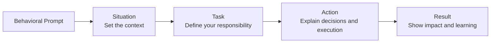
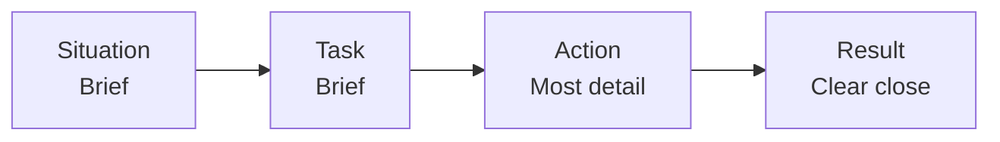
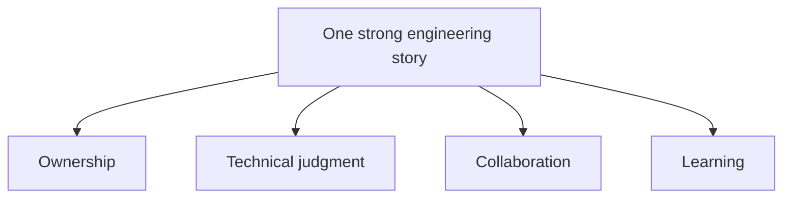
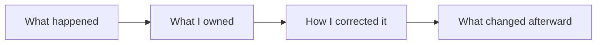

# The STAR Method for Behavioral Interviews

> A practical interview-preparation guide for software developers with 3+ years of experience.

## In Short

**STAR** is a simple structure for answering behavioral interview questions with a real example:

- **S — Situation:** What was happening?
- **T — Task:** What were you responsible for?
- **A — Action:** What did you personally do, and why?
- **R — Result:** What changed because of your actions?

The most important part is **Action**. Keep the background short, make your own contribution clear, and finish with a measurable or observable result.



A strong developer answer sounds like a real engineering story: **problem → responsibility → investigation → decision → implementation → impact**.

---

# 1. What Is the STAR Method?

The **STAR method** is a structured way to explain how you handled a real situation from your previous experience.

| Part | Meaning | What the interviewer should learn |
|---|---|---|
| **Situation** | Context | What problem or challenge existed |
| **Task** | Responsibility | What you personally needed to achieve |
| **Action** | Execution | What you did, why you did it, and how you handled trade-offs |
| **Result** | Impact | What improved, what changed, and what you learned |

Behavioral interviews use past examples because they give the interviewer evidence of how you actually work.

Instead of saying:

> “I am good at debugging production issues.”

STAR helps you show evidence:

> “A payment API started timing out during peak traffic. I traced the bottleneck, changed the transaction flow, added idempotency protection, and reduced failures to a stable level.”

The second version is more credible because the interviewer can see your ownership and reasoning.

---

# 2. Understanding Each Part of STAR

## 2.1 Situation — Give Only the Context Needed

The **Situation** explains the environment and problem.

Include:

- The system or project
- What went wrong or needed improvement
- Why it mattered
- Any important constraint

Keep this section short.

**Example context:**

> Our payment API started timing out after traffic increased during a merchant launch. Customers were retrying requests, which also created a risk of duplicate payments.

The interviewer now understands the problem without hearing the full architecture of the platform.

---

## 2.2 Task — Make Your Responsibility Clear

The **Task** explains what you were personally responsible for.

Clarify:

- What outcome you owned
- What decision or problem you needed to handle
- Any deadline, risk, or limitation

**Example:**

> I was responsible for identifying the bottleneck, stabilizing the API before the next traffic peak, and making sure retries could not create duplicate payments.

Use **we** for shared team context and **I** for your own work.

> We agreed on a gradual release. I implemented the transaction change, added the idempotency check, and created the monitoring dashboard.

This makes your contribution easy to evaluate without taking credit for the whole team.

---

## 2.3 Action — The Main Part of the Answer

The **Action** section should contain most of the detail.

For an experienced developer, this is where the interviewer sees your technical judgment.

Explain:

- How you investigated the problem
- What evidence or data you used
- Which options you considered
- Why you selected one approach
- What you personally implemented
- How you tested the solution
- How you reduced rollout risk
- How you collaborated when needed

**Example:**

> I compared API latency, database wait time, and payment-provider response time. Distributed traces showed that requests were keeping database transactions open while waiting for the external provider. I considered increasing the connection pool, adding more application instances, and changing the transaction boundary. Scaling resources would only hide the underlying issue, so I moved the external call outside the database transaction, added an idempotency key, and introduced bounded retries. I tested duplicate-request scenarios and released the change gradually behind a feature flag while monitoring error rate and latency.

Notice that the answer does more than list implementation steps. It shows **investigation, alternatives, reasoning, testing, and risk control**.

---

## 2.4 Result — Prove the Impact

The **Result** explains what changed because of your actions.

Good results may include:

- Reduced latency or error rate
- Higher reliability
- Lower infrastructure cost
- Faster deployments
- Fewer support tickets
- Reduced manual work
- Successful delivery without rollback
- A process improvement adopted by the team

**Example:**

> After the change, timeout failures dropped from roughly 8% to below 0.5%, duplicate retries were safely rejected, and the next traffic peak completed without an incident. We later reused the same idempotency pattern in another payment workflow.

Use exact metrics only when you genuinely know them. If exact numbers are unavailable, use a specific observable outcome instead.

For example:

> The release completed without rollback, support tickets stopped, and the validation became part of our deployment checklist.

Never invent a metric just to make the story sound stronger.

---

# 3. Complete Developer STAR Example

## Scenario: Payment API Timeout During Peak Traffic

### Situation

Our payment API began timing out during peak traffic after a merchant launch. Failure rates increased significantly, and customer retries created a risk of duplicate payment attempts.

### Task

I owned the backend investigation. My goal was to identify the bottleneck, stabilize the API before the next traffic peak, and protect the payment flow from duplicate retries without changing the external API contract.

### Action

I first compared application latency, database wait time, and external provider response time. Distributed tracing showed that requests were holding database connections while waiting for the payment provider.

I considered three approaches:

1. Increase the database connection pool.
2. Add more application instances.
3. Change the transaction boundary so the external call did not hold a database transaction open.

The first two options could increase capacity temporarily, but they would not remove the underlying bottleneck. I chose the transaction-flow change.

I moved the external provider call outside the database transaction, added an idempotency key for retry safety, and introduced bounded retries for transient provider failures. I added integration tests for duplicate requests and timeout scenarios, reviewed the change with QA and the payments team, and released it gradually behind a feature flag.

### Result

The timeout rate fell from approximately 8% to below 0.5%, duplicate retries were handled safely, and the next traffic peak completed without a payment incident. The idempotency approach was later reused in another payment workflow.

### Why This Works

| STAR part | Evidence shown |
|---|---|
| Situation | Real production issue with customer impact |
| Task | Clear personal ownership and constraints |
| Action | Investigation, options, trade-offs, implementation, testing, rollout |
| Result | Measurable reliability improvement and reusable learning |

This single example demonstrates more than technical skill. It also shows **ownership, decision-making, reliability thinking, collaboration, and risk management**.

---

# 4. How to Structure the Answer While Speaking

A STAR answer should feel like a professional story, not a memorized script.

MIT's current STAR guidance suggests spending most of the response on **Action**, using an approximate **20% Situation, 10% Task, 60% Action, and 10% Result** split as a guide rather than a strict rule.



For a typical answer:

- **Situation + Task:** about 30–45 seconds
- **Action:** about 60–90 seconds
- **Result:** about 20–30 seconds

The exact length depends on the story. In most interviews, roughly **1.5 to 3 minutes** is enough for the first answer before the interviewer asks follow-up questions.

## What to Emphasize as an Experienced Developer

Do not stop at:

> “I fixed the issue.”

Explain the engineering thinking behind the fix:

> “I compared the available options, rejected scaling the connection pool because it only increased capacity, and changed the transaction boundary because the trace data showed the real bottleneck.”

That sentence demonstrates judgment, not just implementation.

---

# 5. Building a Small Reusable Story Bank

You do not need one memorized answer for every behavioral topic.

Prepare around **5–8 real stories** that can be adapted depending on the competency being evaluated.

Useful story categories for developers include:

| Story type | What it can demonstrate |
|---|---|
| Production incident | Ownership, debugging, communication |
| Technical decision | Trade-offs, architecture judgment |
| Performance improvement | Analysis, optimization, measurable impact |
| Disagreement | Communication, influence, collaboration |
| Failure or missed expectation | Accountability, learning |
| Tight deadline | Prioritization, scope control |
| Automation improvement | Initiative, efficiency |
| Cross-team delivery | Coordination, dependency management |

One story can demonstrate several qualities.



Keep the **facts consistent**. Adapt the emphasis, not the history.

---

# 6. Handling Common Behavioral Situations

## 6.1 Failure or Mistake

A good failure story should show accountability and a real change afterward.

Use this flow:



The important part is not proving that you never fail. It is showing that you can recognize a problem, recover responsibly, and improve the process.

---

## 6.2 Conflict or Disagreement

Keep the story professional.

Focus on:

- What the disagreement was
- What assumptions or priorities differed
- What evidence you brought
- How you listened to the other view
- How the final decision was reached

The goal is to demonstrate **influence and collaboration**, not to prove that the other person was wrong.

---

## 6.3 No Exact Metric Available

Do not invent numbers.

Use observable evidence such as:

- No repeated incident after the change
- Fewer support tickets
- Successful release without rollback
- Reduced manual steps
- Faster review or deployment
- Adoption by another team
- Better audit or security outcome

Amazon's current SDE interview guidance specifically recommends using **metrics or data where applicable**, which means data is useful when it is real and relevant—not something that must be forced into every story.

---

## 6.4 Confidential Work

You can protect sensitive details while keeping the story useful.

Generalize:

- Client or company names
- Exact revenue
- Sensitive traffic volume
- Security details
- Internal architecture names

You can still explain the problem, your decisions, and the outcome.

---

# 7. Practical STAR Preparation Template

Use a short outline instead of memorizing complete sentences.

```markdown
## Story Title
Payment API timeout during peak traffic

## Situation
- What system or project was involved?
- What happened?
- Why did it matter?

## Task
- What was I personally responsible for?
- What constraint, deadline, or risk mattered?

## Action
- What did I investigate first?
- What evidence did I use?
- Which options did I compare?
- Why did I choose the final approach?
- What did I implement?
- How did I test and release it safely?

## Result
- What changed?
- Which metric or observable outcome proves it?
- What did I learn or change afterward?

## Follow-up Details
- Architecture detail:
- Trade-off considered:
- Metric source:
- People involved:
- What I would do differently:
```

A preparation card with keywords is usually better than a fully memorized speech because it keeps the answer natural and easier to adapt.

---

# 8. Final Review Checklist

Before using a STAR story in an interview:

- [ ] It describes one specific real event.
- [ ] The Situation is short and easy to understand.
- [ ] My personal responsibility is clear.
- [ ] Most of the answer focuses on my Action.
- [ ] I explain why I selected the approach.
- [ ] Important trade-offs or constraints are visible.
- [ ] I use **I** for my work and **we** for shared work.
- [ ] The Result has a real metric or observable outcome.
- [ ] Any numbers are honest and explainable.
- [ ] The story shows ownership and professional judgment.
- [ ] I can explain technical details if the interviewer asks.
- [ ] I can tell the story naturally without reading a script.

The strongest STAR answers do not try to make you sound perfect. They make your **thinking, ownership, decisions, and impact** easy for the interviewer to understand.

---

# 9. References

Current guidance checked against:

- [MIT Career Advising & Professional Development — Using the STAR Method for Your Next Behavioral Interview](https://capd.mit.edu/resources/the-star-method-for-behavioral-interviews/)
- [MIT Career Toolkit — Interviewing](https://capd.mit.edu/resources/career-toolkit-interviewing/)
- [Amazon Jobs — SDE III Interview Prep](https://www.amazon.jobs/content/en/how-we-hire/sde-iii-interview-prep)
- [Amazon Jobs — Interview Loop](https://www.amazon.jobs/content/en/how-we-hire/interview-loop)
