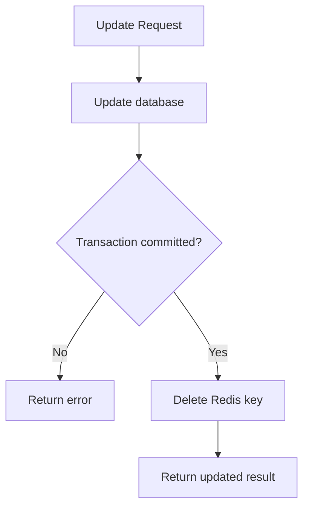
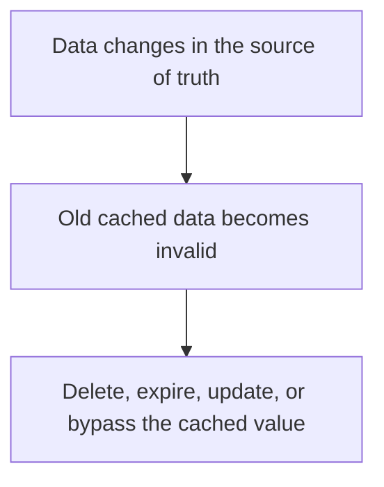
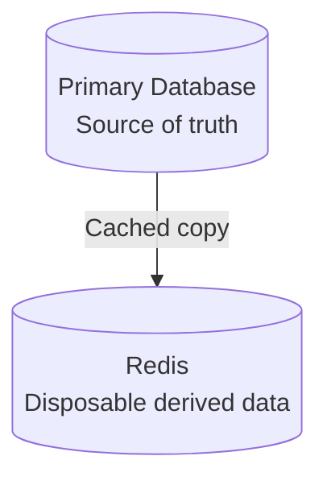
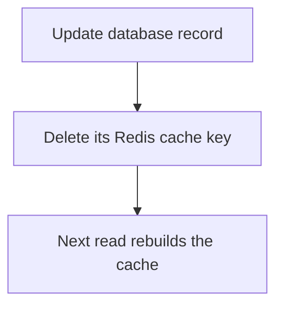
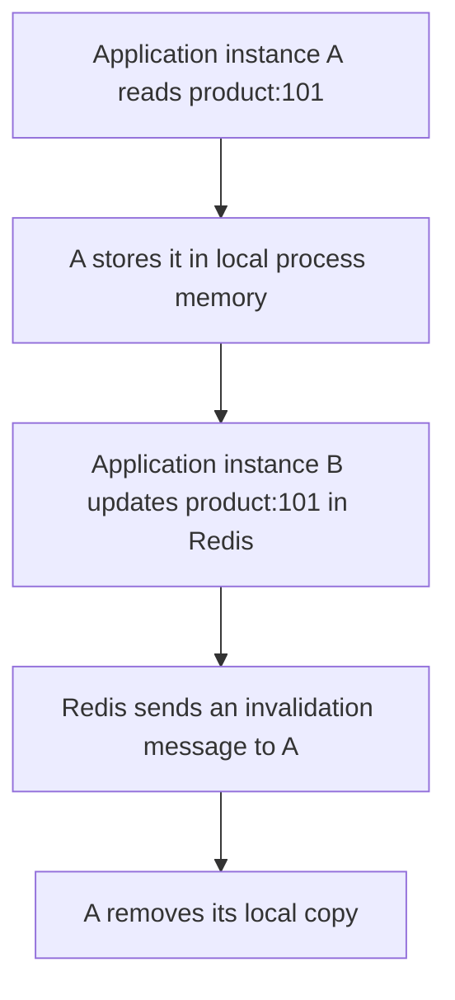
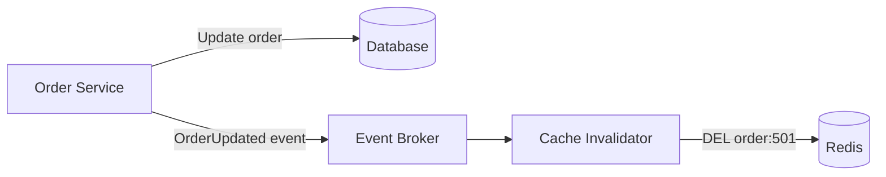
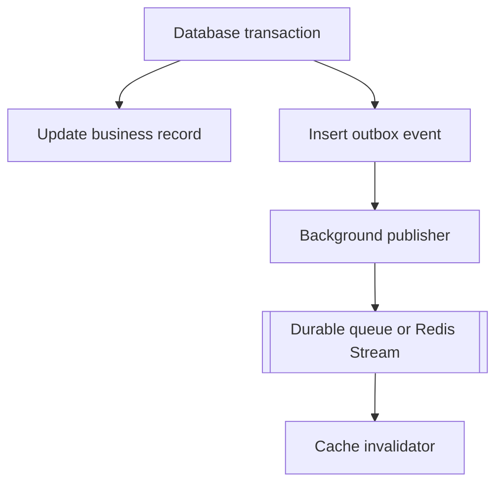
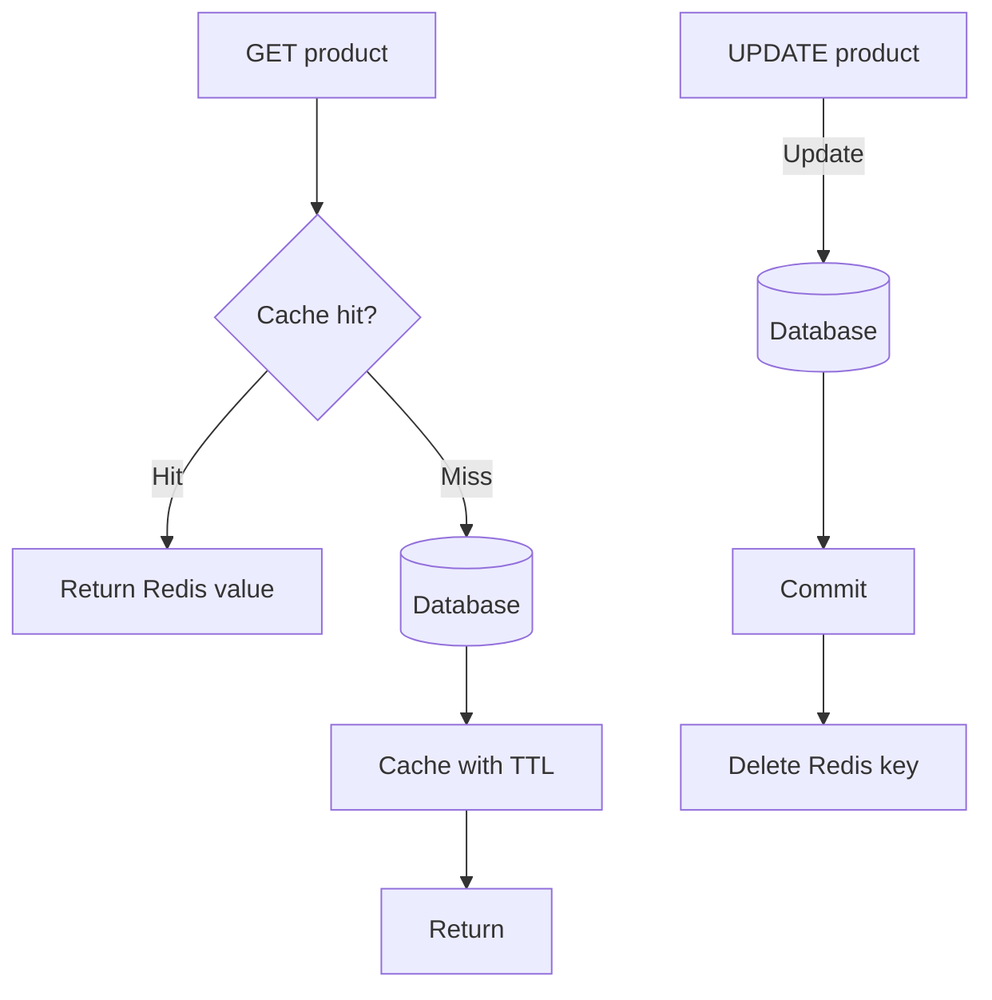
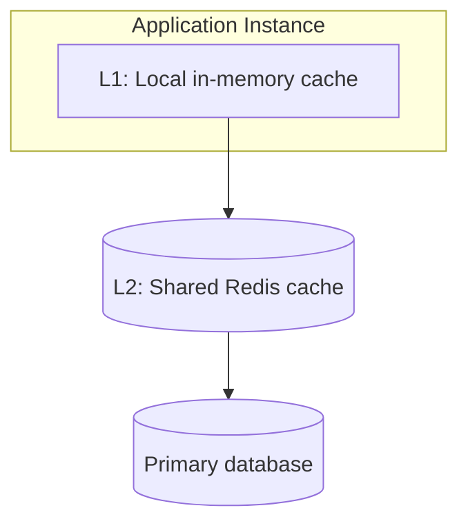

# Cache Invalidation with Redis

> A practical, interview-focused guide for developers working with Redis caching in production systems.

## In short

- Invalidation is making a cached copy unusable once the source of truth changes — by deleting it, expiring it, overwriting it, or routing reads to a new key.
- The default for cache-aside is **update the database, commit, then delete the key**. Delete rather than update: the read path already owns the canonical representation.
- Attach a safety TTL even when active invalidation exists — it bounds staleness for the cases where the `DEL` fails.
- Versioned keys (`catalog:v43:category:20`) invalidate a whole group of related entries with one `INCR`, with no keyspace scanning.
- Event-driven invalidation crosses service boundaries, but needs durable delivery (Streams, Kafka, an outbox); Pub/Sub silently drops messages for disconnected subscribers.
- Invalidation is not eviction. Eviction is Redis reclaiming memory; invalidation is the application declaring data stale.
- The unavoidable race is a slow reader writing a pre-update value back *after* the invalidation. Bound it with a TTL, a version inside the cached value, or generation-based keys.



**Interview answer:** For cache-aside, invalidate by deleting the key after the database transaction commits, never before. Deleting before the commit lets a concurrent read repopulate the old row, and updating the cache instead of deleting duplicates the read path's serialization logic in the write path. Always pair the delete with a TTL so a failed invalidation cannot produce indefinitely stale data, and when one write affects many keys, bump a namespace version instead of hunting for them.

**Gotcha:** "Delete the cache, then update the database" sounds safer, but it is the ordering that produces long-lived staleness — a concurrent reader reloads the pre-update row into Redis before your transaction commits, and nothing removes it again until the TTL runs out.

---

# 1. What Is Cache Invalidation?

**Cache invalidation** is the process of removing, expiring, or marking cached data as outdated when the original data changes.

A cache improves performance by storing frequently accessed data closer to the application. However, once the source data changes, the cached copy may become stale: the database holds a product price of ₹1,200 while Redis still returns ₹1,000, and the application shows the wrong number.

Cache invalidation ensures that the next request receives fresh data instead of an outdated cached value.

## Simple definition



---

# 2. Why Cache Invalidation Is Difficult

A cache and a database are two separate systems. Updating them together as one perfectly atomic operation is usually not possible.

The application must handle situations such as:

- The database update succeeds, but Redis deletion fails.
- Redis is updated, but the database transaction rolls back.
- Two requests update the same record concurrently.
- One request repopulates an old value after another request invalidates it.
- An invalidation event is lost while a consumer is offline.
- Thousands of requests rebuild the same key after it expires.

The central problem is **consistency**:

**How fresh must the cached data be?**

| Strong freshness | Eventual freshness |
|---|---|
| More coordination | Better performance |
| Higher complexity | Simpler design |

Most application caches use **eventual consistency** with a bounded stale period.

---

# 3. Source of Truth and Cache Ownership

Before designing invalidation, clearly define the system that owns the authoritative data.



For a normal cache-aside design:

- The database is the source of truth.
- Redis contains a temporary copy.
- Redis data can be deleted and rebuilt.
- The application should remain correct when the cache is empty.

A useful design rule is:

> The cache may improve performance, but it should not be the only place where business-critical data exists.

---

# 4. Core Redis Invalidation Mechanisms

Redis provides multiple mechanisms that can be used to invalidate cached data.

## 4.1 Delete a key with `DEL`

`DEL` removes one or more keys immediately, and accepts several in a single command: `DEL product:101 product:102 product:103`.

Typical use:



## 4.2 Delete large values with `UNLINK`

`UNLINK report:monthly:2026-07` removes the key from the keyspace immediately but frees its memory asynchronously.

This is useful when cached values are large, such as:

- Large hashes
- Large lists or sets
- Serialized reports
- Large JSON documents

For small string values, `DEL` is normally sufficient.

## 4.3 Expire keys with TTL

A TTL automatically removes a key after a configured duration. It can be set with the write, or applied separately to a key that already exists.

```redis
SET product:101 '{"id":101,"price":1200}' EX 300   # value and TTL together
HSET product:101 id 101 name "Keyboard" price 1200 # or set the value first,
EXPIRE product:101 300                             # then attach the TTL
```

Check the remaining TTL with `TTL product:101`.

TTL is usually a **safety net**, not the only invalidation mechanism for frequently changing business data.

## 4.4 Overwrite the cached value

Instead of deleting the key, the application can replace it with the new value: `SET product:101 '{"id":101,"price":1300}' EX 300`.

This can reduce the next-read latency, but the application must carefully coordinate database and cache writes.

> A normal `SET` replaces the value and its existing TTL unless expiration options or `KEEPTTL` are used.

## 4.5 Logical invalidation through versioned keys

Instead of deleting old keys, change the version used in the key name: reads move from `catalog:v17:electronics` to `catalog:v18:electronics`. The old key becomes unreachable and can expire naturally.

This is useful for:

- Large collections
- Search results
- Configuration snapshots
- Tenant-wide cache resets
- Deployment-related invalidation

## 4.6 Redis client-side caching invalidation

Redis client-side caching can track keys read by an application connection. When another client modifies a tracked key, Redis sends an invalidation message to clients that previously read it.



This is mainly useful for an **L1 local-memory cache** placed in front of Redis.

---

# 5. Common Cache Invalidation Strategies

## 5.1 TTL-based invalidation

The cache entry expires automatically after a fixed duration — `SET exchange-rate:USD-INR "87.20" EX 60` is valid for one minute and then disappears on its own.

### Suitable for

- Data where limited staleness is acceptable
- Exchange rates
- Dashboard summaries
- Third-party API responses
- Public content
- Non-critical configuration

### Advantages

- Simple to implement
- Automatically removes old data
- Limits how long stale data can survive
- Helps control memory usage

### Limitations

- Data may remain stale until expiration
- Many keys may expire at the same time
- A very short TTL reduces cache effectiveness
- A very long TTL increases stale-data risk

### TTL with jitter

Add a small random value to avoid many keys expiring simultaneously. Computing the TTL as `base_ttl + random.randint(0, 60)` turns four keys that would all expire at 300 seconds into 312, 349, 327, and 358.

---

## 5.2 Delete-on-write invalidation

After successfully changing the database, delete the corresponding cache key; the next read reloads fresh data. This is the most common invalidation strategy for cache-aside systems.

### Example

```python
def update_product(product_id: int, payload: dict):
    product = product_repository.update(product_id, payload)
    redis_client.delete(f"product:{product_id}")
    return product
```

### Why deletion is often safer than updating the cache

Deleting the key avoids duplicating transformation and serialization logic in the write path. The normal read path becomes responsible for rebuilding the cache from the source of truth.

---

## 5.3 Update-on-write invalidation

After updating the database and committing the transaction, immediately write the new object to Redis rather than deleting the key.

### Suitable for

- Read-heavy records that will almost certainly be requested again
- Values that are inexpensive to serialize
- Systems where the write service knows the complete final representation

### Risk

The cache update may use incomplete or differently transformed data compared with the normal read path.

For cache-aside systems, **delete-on-write is generally easier to reason about**.

---

## 5.4 Event-driven invalidation

The service that changes data publishes an event. Cache consumers invalidate affected keys.



### Suitable for

- Microservices
- Multiple cache-owning services
- Data replicated across several application boundaries
- Asynchronous workflows

### Reliable design

Use a durable event system such as:

- Redis Streams
- RabbitMQ
- Apache Kafka
- AWS SQS or SNS/SQS
- A database outbox with a relay worker

Redis Pub/Sub and keyspace notifications are useful for transient real-time signals, but they do not provide durable delivery when subscribers disconnect.

---

## 5.5 Version-based invalidation

Store a version number and include it in dependent cache keys. Bumping the version moves every dependent read to a fresh namespace in one command.

```redis
SET catalog:version 42        # readers use catalog:v42:category:electronics
INCR catalog:version          # after a major catalog change
                              # readers now use catalog:v43:category:electronics
```

Old keys are no longer read and can expire automatically.

### Suitable for

- Invalidating many related keys
- Collection caches
- Search result caches
- Permission or configuration snapshots
- Tenant-level invalidation

---

## 5.6 Tag-based invalidation

Maintain a Redis Set containing all keys related to a business entity or tag.

```redis
SADD cache-tag:product:101 \
  product:101 \
  product:101:reviews \
  search:keyboard:page:1
```

When product `101` changes:

```redis
SMEMBERS cache-tag:product:101
UNLINK product:101 product:101:reviews search:keyboard:page:1
DEL cache-tag:product:101
```

### Trade-off

Tag-based invalidation provides precise dependency tracking, but it adds:

- More Redis writes
- Additional metadata
- Cleanup requirements
- Concurrency considerations

Use it only when versioned namespaces or direct key deletion are insufficient.

---

# 6. Cache-Aside Invalidation Flow

Cache-aside is the most frequently used Redis caching pattern. The read and write flows themselves, with working code and their trade-offs against write-through and write-behind, are covered in [Cache Strategies](cache-strategies.md).

The part that belongs to invalidation is the **ordering** of the two writes.

## Why invalidate after database commit?

Suppose the cache is deleted before the database transaction commits:

```text
1. Delete cache key
2. Another request reads the old database value
3. It stores the old value back in Redis
4. Original database transaction commits
5. Redis now contains stale data
```

The safer default order is therefore **database commit → cache invalidation**.

This still requires a retry or outbox mechanism if Redis invalidation fails after the database commit.

---

# 7. Race Conditions and Consistency Problems

## 7.1 Stale repopulation race

Consider two requests:

```text
Request A                              Request B
---------                              ---------
Cache miss
Read old value from DB
                                       Update DB
                                       Delete cache key
Store old value in cache
```

The old value may be restored after invalidation.

### Mitigation options

#### Option 1: Short safety TTL

Writing the entry with a short expiry such as `EX 120` means the stale value eventually disappears on its own. This bounds inconsistency but does not prevent it.

#### Option 2: Version in the cached value

Store a database version or `updated_at` value with the cached object.

```json
{
  "id": 101,
  "price": 1300,
  "version": 8
}
```

Before replacing a cache entry, ensure that an older version cannot overwrite a newer one.

#### Option 3: Generation-based keys

Write the result under the version that existed when the read started, so `product:101:v8` and `product:101:v9` coexist. After an update, readers switch to `v9`. A slow request can only repopulate the old `v8` namespace.

#### Option 4: Lock cache rebuilding

Allow only one request to rebuild a missing key. This mainly prevents stampedes and can reduce race windows.

#### Option 5: Conditional atomic operations

Use a Redis transaction, Lua script, or supported compare-and-delete/compare-and-set operation when invalidation depends on the current value.

Redis 8.4 introduced `DELEX` for conditional deletion of string keys, as in `DELEX lock:product:101 IFEQ "request-token-123"`.

This is especially useful when releasing locks safely: one request must not delete a lock owned by another request.

---

## 7.2 Database updated but invalidation failed

When the database update succeeds and the Redis delete fails, the database is correct but Redis may continue returning stale data indefinitely.

### Recommended protections

- Always assign a TTL to cached business data.
- Retry invalidation with a bounded retry policy.
- Record invalidation failures in logs and metrics.
- Use a transactional outbox for critical invalidation events.
- Make invalidation operations idempotent.

Deleting an already deleted Redis key is safe, which makes retrying straightforward.

---

## 7.3 Lost event-driven invalidation

A simple Pub/Sub subscriber can miss messages while disconnected.

For critical invalidation, use durable delivery:



The outbox record and business update are committed in the same database transaction, preventing the event from being silently lost between two systems.

---

## 7.4 Delete versus update conflict

Two concurrent operations may arrive in a different order. If a product is updated to version 11 and then to version 12, the consumer can receive version 12 first and version 11 second.

Possible protections:

- Include entity versions in events.
- Ignore events older than the last processed version.
- Delete the cache instead of writing event payloads directly.
- Partition events by entity ID when ordered processing is required.

---

# 8. Cache Stampede After Invalidation

Invalidation creates the conditions for a stampede: the moment a popular key is deleted, every in-flight request for it misses at once and hits the database together.

This matters here only as a consequence to plan for. The problem itself, and the nine mitigations for it — request coalescing, distributed locking, stale-while-revalidate, early refresh, probabilistic early expiration, TTL jitter, prewarming, negative caching, and backpressure — are covered in [Caching Layers and Stampede](../system-design/caching-layers-stampede.md).

The invalidation-side takeaway: an invalidation that deletes many hot keys at once is a self-inflicted stampede, so prefer namespace versioning (which lets old entries expire on their own schedule) over a bulk delete of live keys.

---

# 9. Key Design for Reliable Invalidation

Good cache invalidation starts with predictable key naming.

## Recommended format

Name keys as `<environment>:<service>:<resource>:<identifier>:<variant>`.

```text
prod:catalog:product:101
prod:catalog:product:101:reviews
prod:catalog:category:20:page:1
prod:billing:invoice:INV-901
```

## Include relevant dimensions

A key must include every input that changes the cached result.

```text
Bad:
search:products

Better:
search:products:q=keyboard:sort=price:page=2:tenant=15
```

A normalized hash can be used when parameters are long, as in `search:products:sha256-a84e...`.

## Use namespace versions

Embed a version segment in the key, as in `prod:catalog:v4:category:20:page:1`. Incrementing that namespace version invalidates all keys in the namespace without scanning Redis.

## Redis Cluster hash tags

In Redis Cluster, multi-key operations normally require keys to be in the same hash slot. Place the shared portion inside braces when related keys must be handled together.

```text
product:{101}:details
product:{101}:reviews
product:{101}:recommendations
```

All these keys use `101` as the hash tag and map to the same cluster slot.

Use hash tags intentionally; putting too many hot keys in the same slot can create an uneven workload.

---

# 10. Practical Python and Redis Example

The following example uses `redis-py` and a cache-aside design.

## 10.1 Cache helper

```python
from __future__ import annotations

import json
import random
from dataclasses import asdict, dataclass
from typing import Protocol

from redis import Redis

@dataclass(frozen=True)
class Product:
    id: int
    name: str
    price: float
    version: int

class ProductRepository(Protocol):
    def get(self, product_id: int) -> Product | None:
        ...

    def update_price(self, product_id: int, price: float) -> Product:
        ...

class ProductCacheService:
    BASE_TTL_SECONDS = 300
    TTL_JITTER_SECONDS = 60
    NEGATIVE_TTL_SECONDS = 30
    NOT_FOUND_MARKER = "__NOT_FOUND__"

    def __init__(self, redis: Redis, repository: ProductRepository) -> None:
        self.redis = redis
        self.repository = repository

    @staticmethod
    def _key(product_id: int) -> str:
        return f"product:{product_id}"

    def get_product(self, product_id: int) -> Product | None:
        key = self._key(product_id)
        cached = self.redis.get(key)

        if cached is not None:
            value = cached.decode("utf-8")
            if value == self.NOT_FOUND_MARKER:
                return None

            return Product(**json.loads(value))

        product = self.repository.get(product_id)

        if product is None:
            # Negative caching prevents repeated database misses.
            self.redis.set(
                key,
                self.NOT_FOUND_MARKER,
                ex=self.NEGATIVE_TTL_SECONDS,
            )
            return None

        ttl = self.BASE_TTL_SECONDS + random.randint(
            0,
            self.TTL_JITTER_SECONDS,
        )

        self.redis.set(
            key,
            json.dumps(asdict(product)),
            ex=ttl,
        )
        return product

    def update_product_price(self, product_id: int, price: float) -> Product:
        # The repository should commit its database transaction before returning.
        updated_product = self.repository.update_price(product_id, price)

        # Delete-on-write: the next read rebuilds the canonical representation.
        self.redis.delete(self._key(product_id))
        return updated_product
```

## 10.2 Important behavior



## 10.3 Handling invalidation failure

For critical data, do not silently ignore Redis errors.

```python
import logging

from redis.exceptions import RedisError

logger = logging.getLogger(__name__)

def invalidate_product(redis: Redis, product_id: int) -> None:
    key = f"product:{product_id}"

    try:
        redis.delete(key)
    except RedisError:
        logger.exception(
            "Failed to invalidate product cache",
            extra={"product_id": product_id, "cache_key": key},
        )
        # A production system may also enqueue an idempotent retry event.
        raise
```

Whether the API request should fail depends on the business requirement. For highly sensitive data such as permissions or account status, failing closed may be safer than serving a potentially stale cached result.

---

# 11. Invalidating Related and Collection Caches

Updating one entity may affect several cache entries.

Example: changing a product price may invalidate:

```text
product:101
category:20:products:page:1
category:20:products:page:2
search:q=keyboard:sort=price
homepage:featured-products
```

## Option 1: Delete known keys

Use when the dependency list is small and predictable.

```python
redis_client.delete(
    "product:101",
    "homepage:featured-products",
)
```

## Option 2: Version collection namespaces

```redis
INCR category:20:cache-version
```

The application then reads collection keys using the new version: `category:20:v18:products:page:1`

This is often cleaner than finding and deleting every paginated key.

## Option 3: Maintain dependency tags

Use a Set to track dependent keys when precise invalidation is necessary.

## Avoid broad `KEYS` scans in application traffic

This pattern is risky in production: `KEYS category:20:*`

`KEYS` can block Redis while traversing a large keyspace.

If an administrative scan is unavoidable, use `SCAN` incrementally: `SCAN 0 MATCH category:20:* COUNT 500`

For normal request flows, prefer:

- Directly known keys
- Namespace versioning
- Dependency sets
- Event-driven invalidation

---

# 12. Multi-Level Cache Invalidation

Some applications use two cache layers:



Deleting only the Redis key is insufficient if application instances still hold local copies.

## Invalidation approaches

### Redis client-side caching

Use Redis key tracking so Redis sends invalidation messages to clients that cached a tracked key locally.

### Explicit invalidation channel

Publish an application-level event: `PUBLISH cache-invalidation '{"key":"product:101"}'`

Each instance removes the key from its L1 cache.

Because Pub/Sub is transient, combine it with short local TTLs or a durable event system when missed invalidations are unacceptable.

### Keep L1 TTL shorter than L2 TTL

```text
L1 local TTL:  10 seconds
L2 Redis TTL: 300 seconds
```

This limits the stale-data window if an L1 invalidation message is missed.

---

# 13. Monitoring Cache Invalidation

A cache should be observable like any other production component.

## Important metrics

| Metric | Why it matters |
|---|---|
| Cache hit ratio | Shows whether caching is effective |
| Cache miss rate | Detects cold-cache or invalidation spikes |
| Cache write rate | Shows cache population activity |
| Invalidation count | Shows how often data changes |
| Invalidation failures | Detects stale-data risk |
| Redis command latency | Detects overloaded or slow Redis nodes |
| Database load after invalidation | Detects stampedes |
| Keyspace hits and misses | Gives Redis-level read effectiveness |
| Evicted keys | Shows memory pressure |
| Expired keys | Shows TTL-driven removal volume |
| Consumer lag | Important for event-driven invalidation |

## Useful application logs

```json
{
  "event": "cache_invalidated",
  "entity": "product",
  "entity_id": 101,
  "cache_key": "product:101",
  "reason": "price_updated",
  "duration_ms": 1.8
}
```

Do not log full cached values when they may contain sensitive information.

## Important distinction

```text
Expiration  = key removed because its TTL ended
Eviction    = key removed because Redis needed memory
Invalidation = application intentionally made cached data unusable
```

Eviction is a memory-management behavior, not a business-consistency strategy.

---

# 14. Strategy Selection Guide

| Requirement | Recommended approach |
|---|---|
| Data can be stale for a few minutes | TTL-based caching |
| Individual database record changes | Delete-on-write plus TTL |
| Frequently read record after every update | Update-on-write or delete-on-write with prewarming |
| Many paginated or filtered keys | Namespace versioning |
| Multiple services depend on changes | Durable event-driven invalidation |
| Local memory cache in front of Redis | Redis client tracking or explicit invalidation events |
| Large Redis values | `UNLINK` instead of synchronous deletion |
| Popular key may cause database spike | Single-flight lock, jitter, or stale-while-revalidate |
| Cache invalidation must survive service downtime | Durable queue, Redis Stream, or outbox pattern |
| Permissions or security-sensitive state | Immediate invalidation, short TTL, and fail-safe behavior |

## Practical default for normal web applications

```text
Cache-aside
    +
Delete after successful database commit
    +
Safety TTL with jitter
    +
Metrics and retry handling
```

This combination is simple, common, and reliable enough for many production systems.

---

# 15. Production Best Practices

## 15.1 Always use a safety TTL

Even event-driven caches benefit from a TTL. It limits stale data when invalidation fails.

## 15.2 Invalidate after a successful database commit

Do not remove a cache entry for a database change that may still roll back.

## 15.3 Prefer deletion for cache-aside writes

Let the normal read path rebuild the canonical cached representation.

## 15.4 Make invalidation idempotent

The same invalidation event may be retried multiple times. `DEL` on a missing key returns `0` rather than failing, so a repeated delete should still be treated as successful invalidation.

## 15.5 Add TTL jitter

Prevent many related keys from expiring in the same second.

## 15.6 Protect hot keys from stampedes

Use a single-flight lock, stale-while-revalidate, request coalescing, or prewarming — see [Caching Layers and Stampede](../system-design/caching-layers-stampede.md).

## 15.7 Avoid wildcard deletion in request paths

Use versioned namespaces or explicitly tracked dependencies instead of scanning the entire keyspace.

## 15.8 Treat Pub/Sub signals as non-durable

Use Pub/Sub for fast notification, but use a durable queue or stream when every invalidation must be processed.

## 15.9 Track cache schema versions

When the serialized object structure changes, change the key version.

```text
product:v1:101
product:v2:101
```

This prevents new application code from reading incompatible old cached data.

## 15.10 Separate cache keys by environment and tenant

```text
prod:tenant:42:product:101
staging:tenant:42:product:101
```

This prevents collisions and makes ownership clear.

## 15.11 Keep invalidation close to the write use case

The service responsible for changing the source data should also initiate the invalidation or publish the domain event that causes it.

## 15.12 Test with Redis unavailable

Verify that:

- Reads can fall back to the database when appropriate.
- Writes do not silently create indefinite stale data.
- Timeouts prevent slow Redis operations from blocking requests.
- Retry logic does not overload Redis.
- Metrics expose failures clearly.

---
