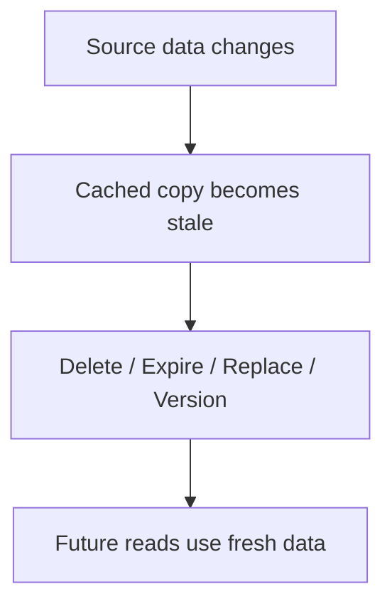
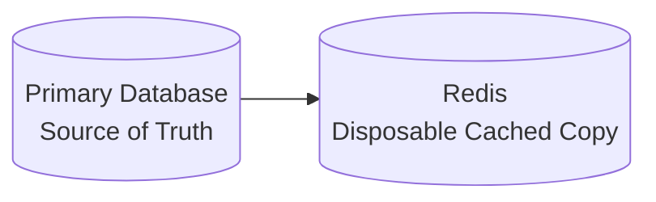
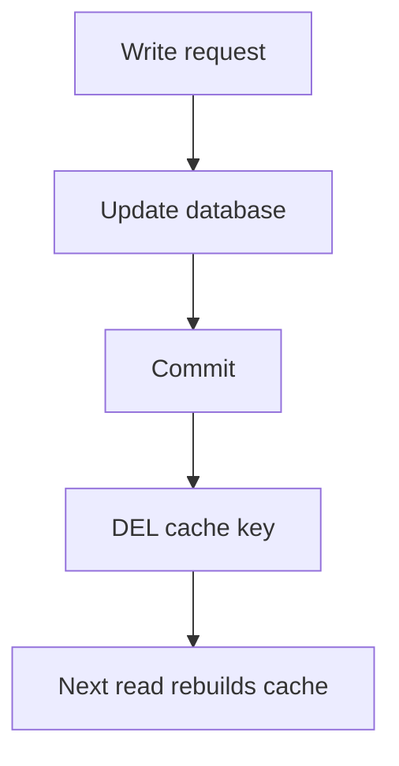
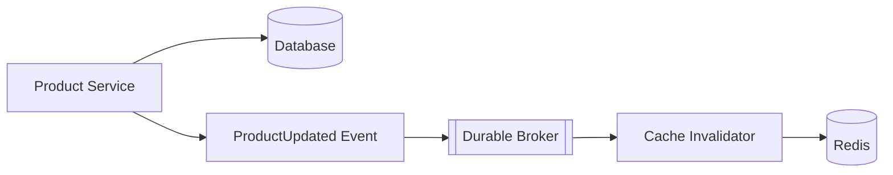
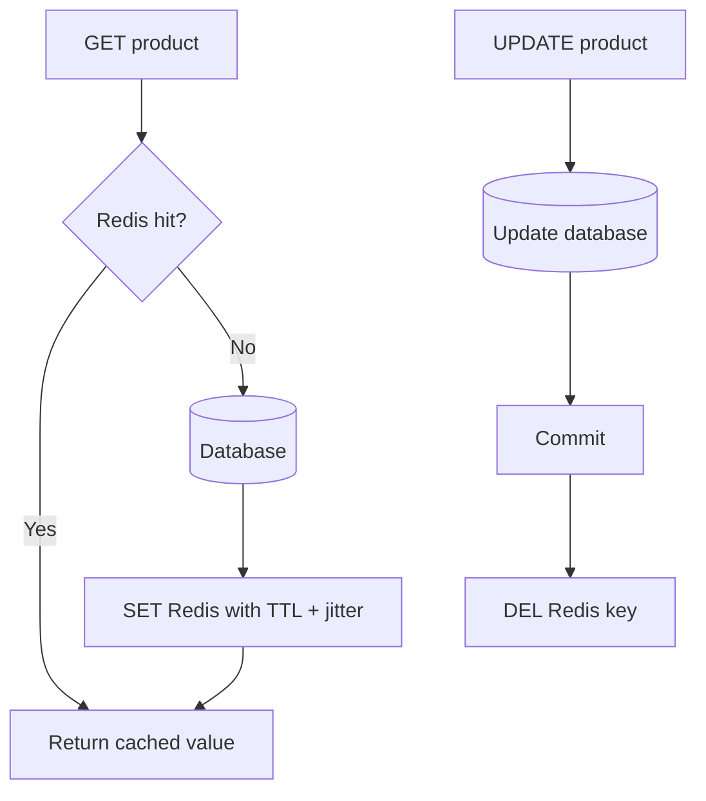
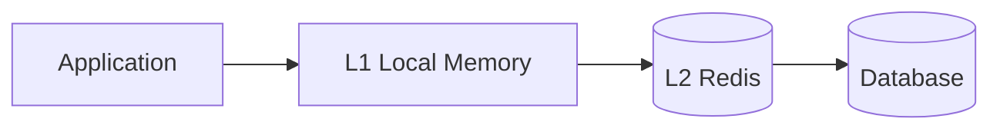

# Cache Invalidation with Redis

> A practical, interview-focused guide to keeping Redis cache data consistent with the source of truth.

## In Short

- **Cache invalidation** means making cached data unusable when the original data changes.
- In a normal **cache-aside** design, the safest default is: **update database → commit → delete cache key**.
- Prefer **deleting** the cache entry instead of updating it when the read path already owns the canonical serialization logic.
- Always keep a **safety TTL** so a failed invalidation cannot leave stale data forever.
- Use **versioned keys** when one change affects many related cache entries.
- Use **durable events** such as Redis Streams, Kafka, RabbitMQ, SQS, or an outbox when invalidation crosses service boundaries.
- Redis Pub/Sub is useful for fast notifications, but it is **not durable**.
- Invalidation and eviction are different:
  - **Invalidation** = application marks data stale.
  - **Expiration** = TTL ends.
  - **Eviction** = Redis removes data because of memory pressure.


---

# 1. What Is Cache Invalidation?

Cache invalidation is the process of removing, expiring, replacing, or logically bypassing cached data after the source of truth changes.

Example:

```text
Database:
product:101 price = ₹1,200

Redis:
product:101 price = ₹1,000
```

Redis is now serving stale data.

The goal of invalidation is to make sure the application eventually reads the new value.



---

# 2. Why Cache Invalidation Is Difficult

The database and Redis are separate systems. A normal application cannot update both as one atomic transaction.

Problems can occur when:

- The database update succeeds but Redis deletion fails.
- Redis is changed before the database transaction commits.
- Two requests update the same record concurrently.
- A slow reader writes an old database value back into Redis.
- An invalidation event is lost.
- Deleting a hot key causes many requests to hit the database together.

The important design question is:

> **How much stale data can the application tolerate, and for how long?**

Most application caches use **eventual consistency with a bounded stale period**.

---

# 3. Source of Truth and Cache Ownership

For a typical cache-aside application:



The normal assumptions are:

- The database owns the authoritative data.
- Redis stores a derived copy.
- Redis data can be deleted and rebuilt.
- The application should remain functionally correct when the cache is empty.

This principle simplifies invalidation because Redis does not need to behave like a second database.

---

# 4. Core Redis Invalidation Mechanisms

## 4.1 `DEL` — Delete a Cached Key

The most common operation is:

```redis
DEL product:101
```

`DEL` can remove multiple known keys:

```redis
DEL product:101 product:101:reviews homepage:featured
```

For normal small cached values, `DEL` is usually sufficient.

---

## 4.2 `UNLINK` — Delete Large Values Without Blocking Memory Cleanup

For large Redis objects, use:

```redis
UNLINK report:monthly:2026-08
```

`UNLINK` removes the key from the keyspace immediately and frees the underlying memory asynchronously.

Use it when cached values can contain large hashes, lists, sets, or serialized documents.

---

## 4.3 TTL — Automatic Safety Expiration

A TTL bounds how long stale data can survive.

```redis
SET product:101 '{"id":101,"price":1200}' EX 300
```

You can inspect it with:

```redis
TTL product:101
```

A TTL should usually be a **backup protection**, not the only invalidation strategy for frequently changing business data.

### TTL with jitter

If thousands of keys all expire at exactly 300 seconds, they may rebuild simultaneously.

Instead:

```python
ttl = 300 + random.randint(0, 60)
```

This spreads expirations across time.

---

## 4.4 Overwrite the Cached Value

The write path can replace the cached value:

```redis
SET product:101 '{"id":101,"price":1300}' EX 300
```

This can avoid the next cache miss, but it creates more coordination because the write path must produce exactly the same representation as the read path.

For ordinary cache-aside systems, **delete-on-write is easier to reason about**.

> A normal `SET` replaces an existing TTL unless a new expiration is supplied or `KEEPTTL` is used.

---

## 4.5 Versioned Keys

Instead of deleting many related keys, change the namespace version.

```text
catalog:v42:category:20:page:1
catalog:v42:category:20:page:2
```

After a major catalog change:

```redis
INCR catalog:version
```

New reads use:

```text
catalog:v43:category:20:page:1
```

The old `v42` entries become unreachable and expire naturally.

This is very useful for:

- Paginated collections
- Search results
- Configuration snapshots
- Tenant-wide cache resets
- Large groups of dependent keys

---

# 5. Main Invalidation Strategies

## 5.1 TTL-Based

Use TTL-only caching when limited staleness is acceptable.

Typical examples:

- Dashboard summaries
- Third-party API responses
- Public content
- Exchange rates
- Non-critical configuration

```text
Simple
+
Automatic cleanup
-
May serve stale data until expiry
```

---

## 5.2 Delete-on-Write

This is the normal choice for cache-aside.



Why delete instead of update?

Because the read path already knows how to:

- Fetch the complete object
- Apply transformations
- Serialize it
- Attach the correct TTL

Deleting avoids duplicating that logic in the write path.

---

## 5.3 Update-on-Write

After the database commit, immediately write the new cached value.

Use it when:

- The object is read almost immediately after every update.
- The write service knows the complete final representation.
- Avoiding the next cache miss is important.

The trade-off is higher consistency complexity.

---

## 5.4 Event-Driven Invalidation

Useful when multiple services cache the same underlying business data.



For important invalidations, prefer durable delivery:

- Redis Streams
- Kafka
- RabbitMQ
- AWS SQS
- Database outbox + worker

Redis Pub/Sub is good for real-time notification, but disconnected subscribers can miss messages.

---

# 6. Correct Cache-Aside Write Ordering

The safest default is:

```text
1. Update database
2. Commit transaction
3. Delete cache key
4. Return response
```

## Why not delete first?

Consider this sequence:

```text
Writer                          Reader
------                          ------
DEL product:101
                                Cache miss
                                Read old DB value
                                SET old value in Redis
Commit new DB value
```

Redis now contains the old value even though the database contains the new one.

That is why the normal order is:

> **Database commit → cache invalidation**

If the Redis deletion fails after the commit, use a TTL plus retry/outbox handling for data where stale values matter.

---

# 7. Important Race Condition: Stale Repopulation

Even with correct write ordering, another race is possible.

```text
Reader A                        Writer B
--------                        --------
Cache miss
Read version 7 from DB
                                Update DB to version 8
                                Commit
                                DEL cache key
SET version 7 into Redis
```

The slow reader restores stale data after the invalidation.

## Common protections

### Safety TTL

The stale value eventually disappears.

```redis
SET product:101 "..." EX 120
```

Simple and common, but it only **bounds** staleness.

### Versioned cached values

Store the database version or `updated_at` with the value:

```json
{
  "id": 101,
  "price": 1300,
  "version": 8
}
```

Do not allow version `7` to replace version `8`.

### Generation-based keys

Use versions in the key:

```text
product:101:v7
product:101:v8
```

After the update, readers move to `v8`. A slow reader can only repopulate the old namespace.

### Conditional operations

For advanced compare-and-delete cases, Redis 8.4+ provides `DELEX` for string keys.

Example for safely deleting a lock only when its token matches:

```redis
DELEX lock:product:101 IFEQ "request-token-123"
```

This is mainly useful for ownership-sensitive values such as distributed locks, not as the default cache invalidation command.

---

# 8. Invalidating Related Cache Entries

One database change may affect several keys:

```text
product:101
category:20:products:page:1
category:20:products:page:2
search:keyboard:sort=price
homepage:featured-products
```

Choose based on dependency size.

## Small and predictable dependency set

Delete known keys directly:

```python
redis_client.delete(
    "product:101",
    "homepage:featured-products",
)
```

## Many collection keys

Prefer namespace versioning:

```redis
INCR category:20:cache-version
```

Readers then use the new version:

```text
category:20:v18:products:page:1
```

## Dynamic precise dependencies

Maintain tag/dependency sets only when direct keys or namespace versions are insufficient.

Avoid this in normal request handling:

```redis
KEYS category:20:*
```

`KEYS` can block Redis while scanning a large keyspace.

If an administrative scan is unavoidable, use incremental `SCAN`:

```redis
SCAN 0 MATCH category:20:* COUNT 500
```

---

# 9. Practical Python Example

The following example uses `redis-py` with cache-aside, TTL jitter, and delete-on-write.

```python
from __future__ import annotations

import json
import random

from redis import Redis


class ProductService:
    BASE_TTL = 300
    TTL_JITTER = 60

    def __init__(self, redis: Redis, repository):
        self.redis = redis
        self.repository = repository

    @staticmethod
    def cache_key(product_id: int) -> str:
        return f"product:{product_id}"

    def get_product(self, product_id: int):
        key = self.cache_key(product_id)

        cached = self.redis.get(key)
        if cached is not None:
            return json.loads(cached)

        product = self.repository.get(product_id)
        if product is None:
            return None

        ttl = self.BASE_TTL + random.randint(0, self.TTL_JITTER)

        self.redis.set(
            key,
            json.dumps(product),
            ex=ttl,
        )

        return product

    def update_price(self, product_id: int, price: float):
        # Repository commits the database transaction before returning.
        product = self.repository.update_price(product_id, price)

        # Delete-on-write.
        self.redis.delete(self.cache_key(product_id))

        return product
```

Flow:



For critical data, do not silently ignore invalidation failures. Record the failure and retry through an idempotent mechanism.

---

# 10. Multi-Level Cache Invalidation

Some systems use:



Deleting only the Redis key is not enough if application instances still hold local copies.

Common solutions:

- Redis client-side caching with server-assisted key tracking
- Explicit invalidation events
- Short L1 TTLs
- Durable events when missed invalidations are unacceptable

Redis client-side caching tracks keys read by clients and sends invalidation messages when those keys change.

A common TTL relationship is:

```text
L1 local cache:  5–15 seconds
L2 Redis cache:  several minutes
```

This bounds local staleness even if an invalidation notification is missed.

---

# 11. Key Design for Easier Invalidation

Predictable key names make invalidation much simpler.

Recommended pattern:

```text
<environment>:<service>:<resource>:<id>:<variant>
```

Examples:

```text
prod:catalog:product:101
prod:catalog:product:101:reviews
prod:catalog:category:20:page:1
```

Include every dimension that changes the result.

Bad:

```text
search:products
```

Better:

```text
search:products:q=keyboard:sort=price:page=2:tenant=15
```

For long parameter sets, use a normalized hash.

## Redis Cluster hash tags

Related keys can be forced into the same cluster slot:

```text
product:{101}:details
product:{101}:reviews
product:{101}:recommendations
```

Use hash tags only when multi-key operations require co-location. Putting too many hot keys in one slot can create uneven load.

---

# 12. Production Defaults

For most normal web applications, start with:

```text
Cache-aside
    +
Database commit first
    +
Delete-on-write
    +
Safety TTL
    +
TTL jitter
    +
Retry/metrics for failed invalidation
```

Add more complexity only when the use case needs it:

| Requirement | Good default |
|---|---|
| Limited staleness is acceptable | TTL |
| One record changed | Delete-on-write + TTL |
| Many related collection keys | Namespace versioning |
| Multiple services cache the data | Durable event-driven invalidation |
| Large Redis object | `UNLINK` |
| Local L1 cache exists | Client tracking or invalidation events |
| Security-sensitive cached state | Immediate invalidation + short TTL + fail-safe handling |

## Final Takeaway

The most important rule to remember is:

> **Treat Redis as disposable derived data. Update and commit the source of truth first, then invalidate Redis.**

For cache-aside, **delete-on-write + safety TTL** is the best default because it keeps the write path simple and lets the normal read path rebuild the correct representation.

When invalidation affects many keys, switch from deleting individual keys to **versioned namespaces**. When invalidation crosses services, use **durable events** instead of relying only on Pub/Sub.
