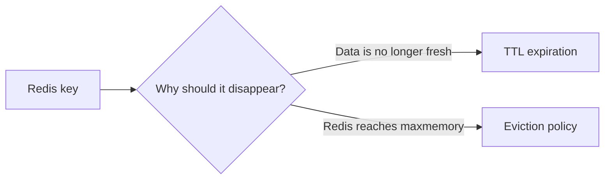
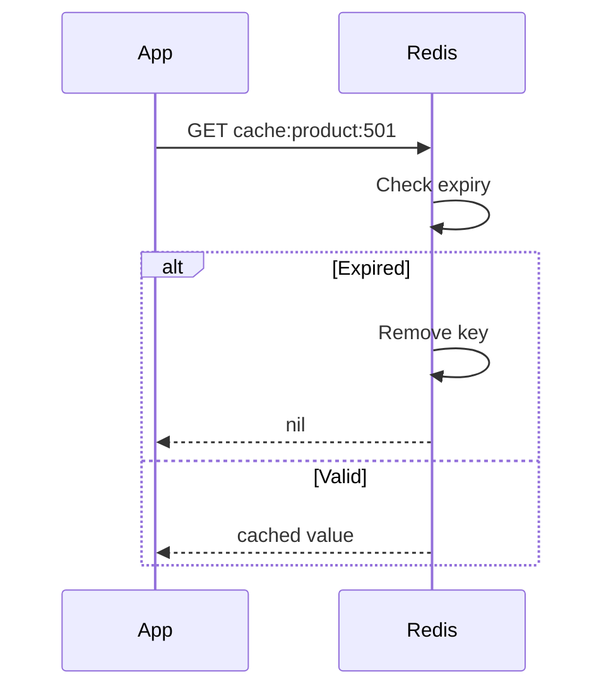
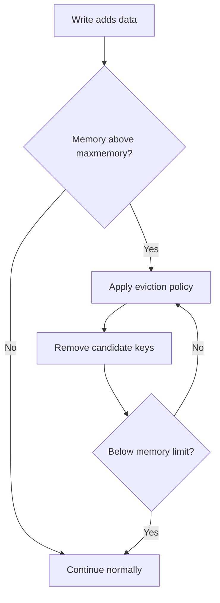
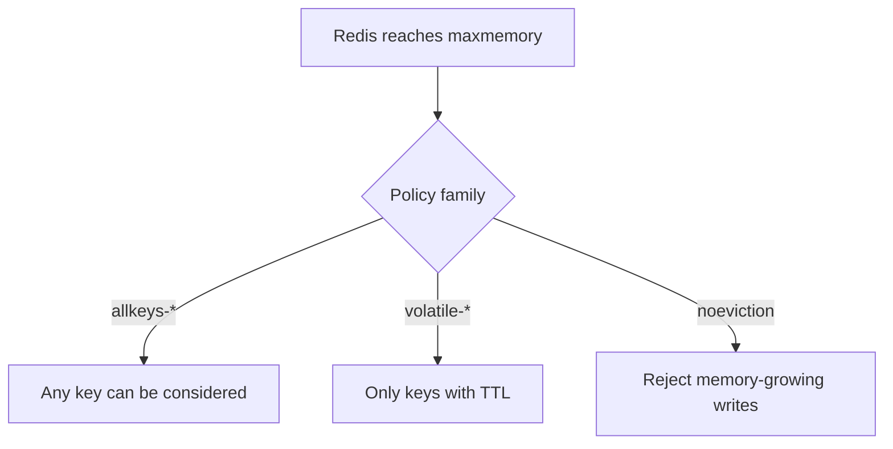
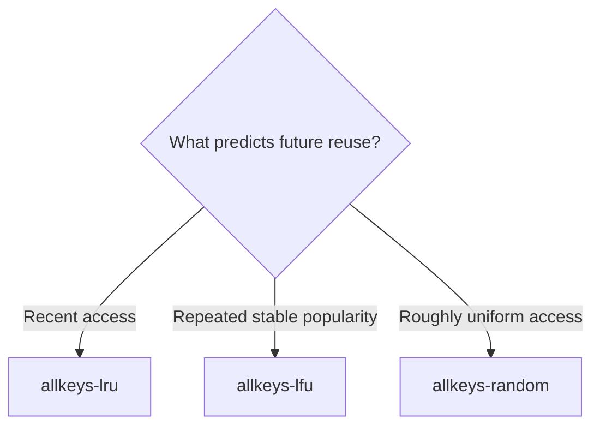
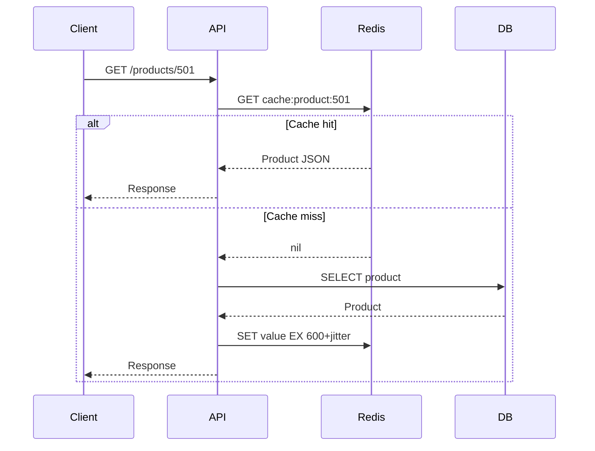
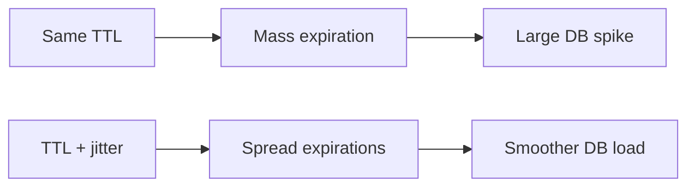

# Redis TTL and Eviction Policies (LRU, LFU)

> Practical understanding of TTL, expiration, `maxmemory`, LRU/LFU eviction, monitoring, and production cache usage.

> **Documentation baseline:** Redis Open Source 8.10 documentation, reviewed in August 2026.

## In Short

- **TTL (Time To Live)** controls **freshness** for an individual key.
- **Eviction** controls **memory usage** for the Redis instance when `maxmemory` is reached.
- Prefer setting a value and expiry together: `SET key value EX 600`.
- A normal `SET` overwrites the key and removes its existing TTL unless `KEEPTTL` is used.
- In-place operations such as `INCR`, `HSET`, and `LPUSH` normally preserve the key TTL.
- `allkeys-lru` is a strong general-purpose cache policy.
- `allkeys-lfu` is useful when a stable set of keys is repeatedly popular.
- `volatile-*` policies only evict keys that have an expiry.
- Redis LRU and LFU are **approximate**, not exact, which keeps memory and CPU overhead low.



---

# 1. TTL vs Eviction

TTL and eviction both remove keys, but they solve different problems.

| Area | TTL / Expiration | Eviction |
|---|---|---|
| Purpose | Keep data fresh | Keep Redis within memory limits |
| Trigger | Expiration time is reached | Memory exceeds `maxmemory` |
| Scope | Per key | Entire Redis instance |
| Requires memory pressure | No | Yes |
| Example | Product cache expires after 10 minutes | Cold cache keys are removed when memory is full |
| Main commands/settings | `SET EX`, `EXPIRE`, `TTL`, `PERSIST` | `maxmemory`, `maxmemory-policy` |

### Mental Model

```text
TTL:
"Is this cached value still valid?"

Eviction:
"If Redis is full, which key should be removed?"
```

A cache normally uses **both**:

```text
TTL       -> controls staleness
Eviction  -> controls capacity
```

---

# 2. How TTL Works

TTL means **Time To Live**: the remaining lifetime of a key before Redis considers it expired.

```bash
SET cache:product:501 '{"name":"Keyboard","price":2999}' EX 600
```

The key expires after **600 seconds (10 minutes)**.

## 2.1 Prefer Atomic Value + TTL

Avoid separating the write and expiry when both belong to the same operation:

```bash
SET cache:product:501 "value"
EXPIRE cache:product:501 600
```

If the application fails between the two commands, the key may remain without an expiry.

Prefer:

```bash
SET cache:product:501 "value" EX 600
```

The value and TTL are applied in one command.

## 2.2 Common TTL Commands

| Command | Purpose |
|---|---|
| `EXPIRE key seconds` | Set TTL in seconds |
| `PEXPIRE key milliseconds` | Set TTL in milliseconds |
| `SET key value EX seconds` | Set value with TTL |
| `SET key value PX milliseconds` | Set value with millisecond TTL |
| `EXPIREAT key timestamp` | Expire at a Unix timestamp |
| `TTL key` | Remaining TTL in seconds |
| `PTTL key` | Remaining TTL in milliseconds |
| `EXPIRETIME key` | Absolute expiry timestamp |
| `PERSIST key` | Remove the expiry |

Example:

```bash
SET session:user:42 "active" EX 1800
TTL session:user:42
```

Important `TTL` results:

| Result | Meaning |
|---:|---|
| Positive number | Remaining lifetime |
| `-1` | Key exists but has no expiry |
| `-2` | Key does not exist |

## 2.3 Conditional Expiration

Redis supports conditions with `EXPIRE`:

```bash
EXPIRE session:user:42 1800 NX
EXPIRE session:user:42 3600 GT
EXPIRE session:user:42 300 LT
```

| Option | Meaning |
|---|---|
| `NX` | Set expiry only if the key has no expiry |
| `XX` | Set expiry only if the key already has an expiry |
| `GT` | Set only if the new expiry is greater |
| `LT` | Set only if the new expiry is smaller |

These are useful when application logic needs to safely extend or shorten an existing deadline.

---

# 3. Important TTL Behavior

## 3.1 `SET` Normally Removes the Existing TTL

```bash
SET user:42 "old" EX 300
SET user:42 "new"

TTL user:42
# -1
```

A successful normal `SET` replaces the value and discards the previous TTL.

To preserve the TTL:

```bash
SET user:42 "new" KEEPTTL
```

## 3.2 In-Place Updates Preserve TTL

Operations that modify the existing data structure without replacing the key normally keep its expiry.

Examples:

```bash
INCR page:views
HSET user:42 last_seen "2026-08-20T10:00:00Z"
LPUSH queue:emails "job-501"
```

Think of it this way:

```text
Replace the key/value -> TTL may be removed
Modify value in place -> TTL normally remains
```

## 3.3 Expiration Belongs to the Key

Normal `EXPIRE` and `TTL` operate on the complete key.

```text
user:42
  ├── name
  ├── email
  └── role

EXPIRE user:42 600
        |
        └── expiry applies to the whole hash
```

Redis also supports hash-field expiration commands in modern versions, but normal cache designs are often simpler when one cached object maps to one Redis key.

## 3.4 Expiration Uses Absolute Time

Redis stores expiration using an absolute point in time.

If Redis stops before a key expires and restarts after its deadline, the key is already expired.

Accurate server/container clocks therefore matter.

---

# 4. How Redis Removes Expired Keys

Redis does not continuously scan every key.

It uses two complementary approaches.

## 4.1 Passive Expiration

When a client accesses a key, Redis checks its expiry.



## 4.2 Active Expiration

Keys may expire without being accessed again.

Redis therefore performs background expiration work and samples keys with TTLs so expired data does not remain in memory indefinitely.

### Key Point

A key can be **logically expired** before Redis has physically reclaimed every byte associated with it.

For application behavior, an expired key is treated as unavailable.

---

# 5. What Triggers Eviction

Eviction is related to memory pressure, not data age.

Example:

```conf
maxmemory 2gb
maxmemory-policy allkeys-lru
```

Redis checks memory when commands add more data. If memory is above `maxmemory`, it evicts keys according to the configured policy until memory is brought back under the limit.



## Memory Headroom

Do not set `maxmemory` equal to all host or container RAM.

Redis may also need memory for:

- Replication buffers
- AOF/persistence buffers
- Client connections
- Temporary command allocations
- Memory fragmentation
- Operating-system and container overhead

Use `INFO memory` and infrastructure monitoring to choose a safe limit.

---

# 6. Redis Eviction Policies

Redis eviction policies fall into three practical groups.

## 6.1 `noeviction`

```conf
maxmemory-policy noeviction
```

Redis does not automatically remove keys.

When memory is full, commands that need more memory can fail, while read-only operations can continue.

Use this when automatic data loss is unacceptable and the application is designed to handle write failures.

## 6.2 `allkeys-*`

Any key can be selected for eviction.

| Policy | Behavior |
|---|---|
| `allkeys-lru` | Evict approximately least recently used keys |
| `allkeys-lfu` | Evict approximately least frequently used keys |
| `allkeys-random` | Evict random keys |
| `allkeys-lrm` | Evict approximately least recently modified keys |

`allkeys-lrm` is available in Redis 8.6+ and tracks modification recency rather than read access. For normal caching interviews, LRU and LFU remain the main policies to understand.

## 6.3 `volatile-*`

Only keys that have an expiry are eligible.

| Policy | Behavior |
|---|---|
| `volatile-lru` | LRU among expiring keys |
| `volatile-lfu` | LFU among expiring keys |
| `volatile-random` | Random among expiring keys |
| `volatile-ttl` | Prefer keys with the shortest remaining TTL |
| `volatile-lrm` | Least recently modified among expiring keys |

If a volatile policy has **no keys with TTLs available for eviction**, it effectively behaves like `noeviction` for memory-growing writes.



---

# 7. LRU: Least Recently Used

LRU focuses on **recency**.

```text
Recently accessed -> probably still useful
Not accessed recently -> better eviction candidate
```

Example:

| Key | Last Access |
|---|---:|
| `product:101` | 2 seconds ago |
| `product:205` | 20 seconds ago |
| `product:990` | 12 minutes ago |
| `product:301` | 2 hours ago |

`product:301` is the strongest LRU candidate.

## Where LRU Fits

LRU works well when recent access predicts future access:

- API response caches
- Search-result caches
- User/profile caches
- Recently viewed data
- Rapidly changing hot sets

## Redis Uses Approximate LRU

Redis does not maintain a perfectly sorted global LRU list.

Instead, it samples candidate keys and selects good eviction candidates.


The sample count is controlled by:

```conf
maxmemory-samples 5
```

Increasing the sample size can make eviction closer to ideal LRU, but uses more CPU.

---

# 8. LFU: Least Frequently Used

LFU focuses on **frequency**.

```text
Frequently accessed -> more valuable
Rarely accessed -> better eviction candidate
```

Example:

| Key | Relative Popularity |
|---|---:|
| `product:popular` | Very high |
| `category:phones` | High |
| `product:average` | Medium |
| `product:rare` | Very low |

`product:rare` is a likely LFU candidate.

## Where LFU Fits

LFU is useful when a relatively stable group of keys stays popular:

- Popular product/catalog data
- Frequently reused reference data
- Shared metadata
- Popular articles/content
- Stable hot-key workloads

## Approximate Counter + Decay

Redis LFU does not store an exact request count.

It uses:

- A compact probabilistic counter
- Sampling during eviction
- Counter decay over time

Decay matters because yesterday's popular key should not remain protected forever.


Main settings:

```conf
lfu-log-factor 10
lfu-decay-time 1
```

For most applications, the defaults are a good starting point.

---

# 9. LRU vs LFU

| Area | LRU | LFU |
|---|---|---|
| Full form | Least Recently Used | Least Frequently Used |
| Main signal | Last access time | Access frequency |
| Best when | Hot set changes often | Popularity is relatively stable |
| Example | Search results | Popular product records |
| Redis implementation | Approximate sampling | Approximate counter + sampling + decay |
| Main policy | `allkeys-lru` | `allkeys-lfu` |
| Debug command | `OBJECT IDLETIME` | `OBJECT FREQ` |

### Simple Decision Rule



If you are unsure for a dedicated cache, `allkeys-lru` is a practical starting point. Compare hit ratio, latency, database load, and eviction rate before tuning further.

---

# 10. Choosing the Right Policy

| Situation | Practical choice |
|---|---|
| Dedicated general-purpose cache | `allkeys-lru` |
| Stable popularity-driven cache | `allkeys-lfu` |
| Uniform/random-looking access | `allkeys-random` |
| Only expiring keys may be removed | `volatile-lru` / `volatile-lfu` |
| Short TTL means low business value | `volatile-ttl` |
| Automatic eviction is not acceptable | `noeviction` |

### Prefer Separate Redis Instances for Different Workloads

Avoid mixing disposable cache data with data that needs different durability or eviction behavior.

```text
Redis A
  -> Disposable application cache
  -> allkeys-lru / allkeys-lfu

Redis B
  -> Sessions, queues, locks, streams, or other operational data
  -> policy chosen for that workload
```

This keeps failure behavior easier to reason about.

---

# 11. Practical End-to-End Example

Assume an e-commerce API caches product details.

### Requirements

- Product data may be stale for up to 10 minutes.
- Redis is dedicated to caching.
- Frequently reused products should remain cached.
- Cache memory must stay below 4 GB.
- Traffic is popularity-driven.

### Redis Configuration

```conf
maxmemory 4gb
maxmemory-policy allkeys-lfu
maxmemory-samples 5
lfu-log-factor 10
lfu-decay-time 1
```

### Python Cache-Aside Example

```python
from __future__ import annotations

import json
import random
from typing import Any

from redis import Redis
from redis.exceptions import RedisError


redis_client = Redis(
    host="localhost",
    port=6379,
    decode_responses=True,
    socket_connect_timeout=2,
    socket_timeout=2,
)


def load_product_from_database(product_id: int) -> dict[str, Any]:
    return {
        "id": product_id,
        "name": "Mechanical Keyboard",
        "price": 2999,
    }


def get_product(product_id: int) -> dict[str, Any]:
    key = f"cache:product:{product_id}"

    try:
        cached = redis_client.get(key)
        if cached is not None:
            return json.loads(cached)
    except RedisError:
        pass

    product = load_product_from_database(product_id)

    # Base TTL + jitter spreads expiration times.
    ttl_seconds = 600 + random.randint(0, 60)

    try:
        redis_client.set(
            key,
            json.dumps(product),
            ex=ttl_seconds,
        )
    except RedisError:
        pass

    return product
```

### Request Flow



### Why This Works

```text
TTL + jitter
    -> limits stale data
    -> avoids many keys expiring at exactly the same time

maxmemory
    -> limits cache memory

allkeys-lfu
    -> protects frequently reused products under memory pressure

database
    -> remains the source of truth
```

---

# 12. Monitoring TTL and Eviction

Use:

```bash
redis-cli INFO memory
redis-cli INFO stats
redis-cli CONFIG GET maxmemory
redis-cli CONFIG GET maxmemory-policy
```

Important metrics:

| Metric | Why It Matters |
|---|---|
| `used_memory` | Current Redis memory allocation |
| `used_memory_dataset` | Memory used by dataset |
| `maxmemory` | Configured memory ceiling |
| `evicted_keys` | Keys removed due to memory pressure |
| `expired_keys` | Keys removed after TTL expiration |
| `keyspace_hits` | Successful cache lookups |
| `keyspace_misses` | Cache misses |
| `mem_fragmentation_ratio` | Helps identify fragmentation |
| `current_eviction_exceeded_time` | Time currently spent above the eviction threshold |

### Cache Hit Ratio

```text
hit_ratio =
    keyspace_hits
    -------------------------------
    keyspace_hits + keyspace_misses
```

Example:

```text
900,000 hits
100,000 misses

Hit ratio = 90%
```

Do not judge the cache only by hit ratio. Also watch:

- Database query volume
- P95/P99 API latency
- Eviction rate
- Redis CPU
- Write errors
- Memory pressure
- Cache rebuild cost

---

# 13. Production Best Practices

## 13.1 Match TTL to Freshness Requirements

Different data needs different TTLs.

| Data | Example TTL |
|---|---:|
| Product description | 30–60 minutes |
| Inventory | 5–30 seconds |
| User profile | 5–15 minutes |
| OTP | 2–10 minutes |
| Rate-limit key | Same as rate-limit window |

Choose TTL based on how quickly the source changes and how much staleness the business can tolerate.

## 13.2 Add TTL Jitter

Creating thousands of keys with exactly the same TTL can make them expire together.

Instead of:

```text
TTL = 600 seconds
```

use something like:

```text
TTL = 600 + random(0, 60)
```



## 13.3 Use TTL for Freshness, Eviction for Capacity

Do not substitute one for the other.

```text
Freshness -> TTL or explicit invalidation
Capacity  -> maxmemory + eviction policy
```

A stale key can remain forever if it has no TTL and memory never becomes tight.

At the same time, TTL alone cannot protect Redis from a sudden burst that fills memory before keys expire.

## 13.4 Use Atomic Redis Operations

Prefer:

```bash
SET key value EX 600
```

instead of:

```bash
SET key value
EXPIRE key 600
```

Atomic operations reduce partial-state and race-condition problems.

## 13.5 Keep Cache Failure Non-Critical When Possible

In cache-aside designs, Redis is normally an optimization rather than the source of truth.

```text
Redis unavailable
      |
      v
Read source database
      |
      v
Return response
```

Use short Redis timeouts and monitor failures so a cache outage does not unnecessarily become a complete application outage.

---

# 14. What to Remember for Interviews

```text
TTL       = per-key freshness
Eviction  = instance-wide memory control

allkeys-lru
    -> strong general-purpose cache choice
    -> uses recency

allkeys-lfu
    -> protects repeatedly popular keys
    -> uses approximate frequency + decay

volatile-*
    -> only keys with TTL are eligible

noeviction
    -> Redis does not make room automatically
    -> memory-growing writes can fail

SET key value EX 600
    -> preferred atomic value + TTL write

SET key value
    -> replaces existing TTL unless KEEPTTL is used
```

The key design idea is simple:

> **TTL decides when cached data is too old. Eviction decides what Redis sacrifices when memory is full.**
