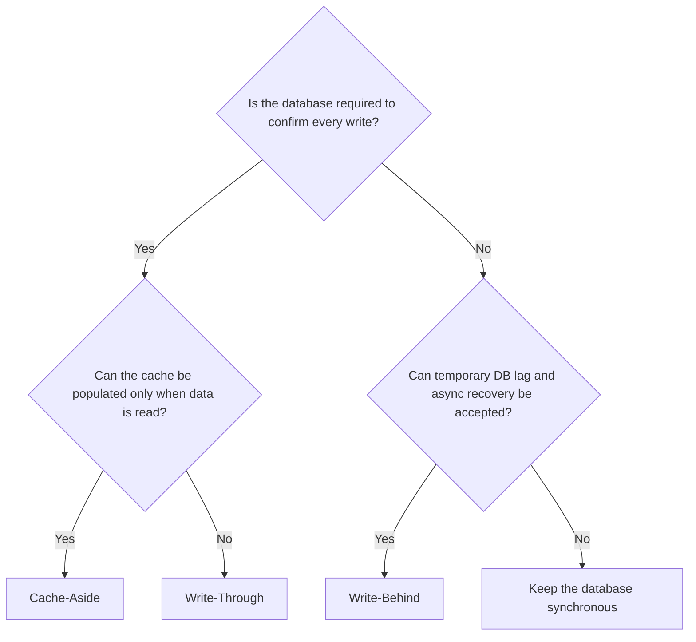
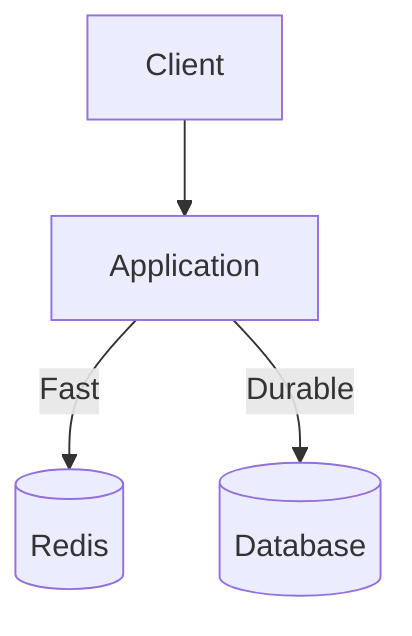
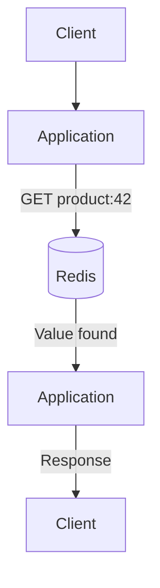
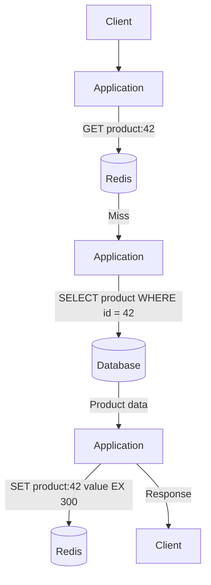
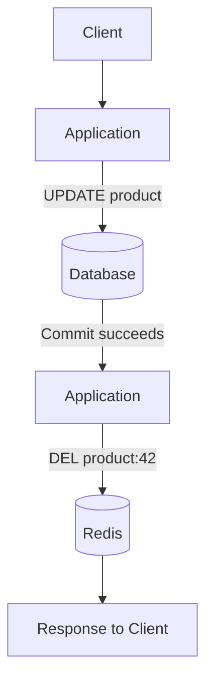
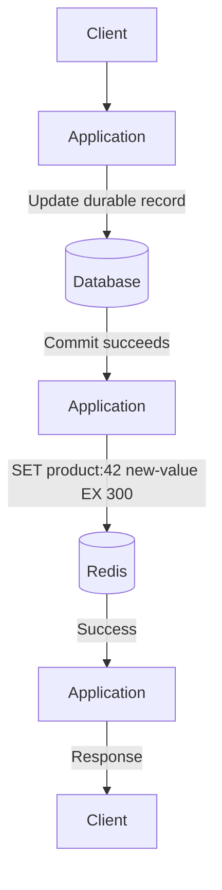
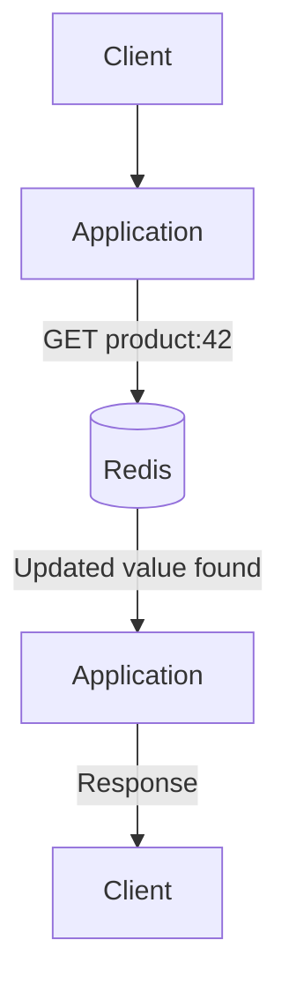
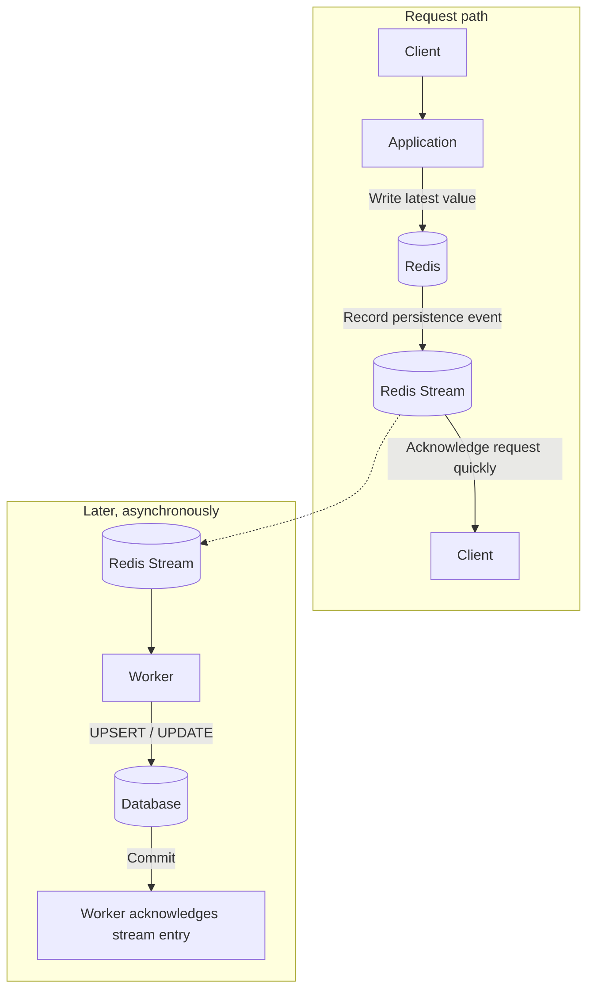
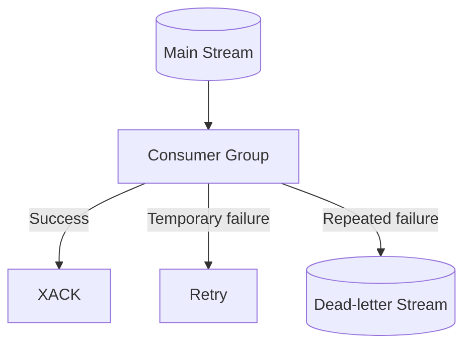
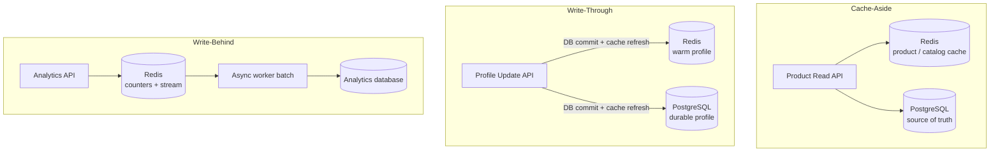

# Redis Cache Strategies: Cache-Aside, Write-Through, and Write-Behind

> Understand how each caching strategy works, where it fits, and what consistency and failure trade-offs it introduces.

## In short

- **Cache-aside (lazy loading):** read Redis, fall back to the database on a miss, store the result with a TTL. Writes update the database and then `DEL` the key.
- **Write-through:** the write updates the database and Redis before the request completes, so the record stays warm — at the cost of write latency and a dual-write gap.
- **Write-behind:** the write lands in Redis and an asynchronous worker persists it later. Lowest write latency, highest failure complexity (retries, ordering, idempotency, recovery).
- Redis and a database never share one atomic transaction, so every strategy has a dual-write gap. TTLs, versioning, invalidation events, and outboxes manage that gap rather than remove it.
- The database is the source of truth in all three — except inside write-behind's pending window, where Redis becomes part of the durability model.
- Only cache-aside populates on reads; the other two populate on writes, so they cache data nobody may ever ask for.
- Choose per data domain, not once per application: catalog reads, profile updates, and page-view counters each want a different strategy.



**Interview answer:** Start with cache-aside — it caches only data that is actually requested, keeps the database authoritative, and degrades safely when Redis is cold or unavailable. Move to write-through when records are commonly read straight after being written and keeping the cache warm is worth the extra write latency. Move to write-behind only when write throughput matters more than immediate durability, and only if you can build retries, idempotency, ordering, and recovery around the async worker.

**Gotcha:** On a cache-aside write, delete the key rather than overwriting it with the new value. Overwriting duplicates the read path's serialization logic in the write path, and lets a slower concurrent write leave a value in Redis that the database never held.

---

# 1. Caching Strategy Fundamentals

A cache strategy defines **how data moves between the application, Redis, and the primary database**.

Caching is not only about storing data in memory. A complete strategy must answer:

- Where does the application read data from?
- Where does the application write data first?
- How are Redis and the database kept reasonably consistent?

## 1.1 Cache, Database, and Source of Truth

In most systems:

- **Redis** provides fast, in-memory access.
- **The database** provides durable storage and is usually the source of truth.
- **The application or cache layer** coordinates reads, writes, expiration, and invalidation.



Redis can also become the immediate system of record in a write-behind design, but this requires stronger durability, replication, recovery, and operational controls.

## 1.2 The Three Core Questions

When evaluating a cache strategy, focus on these three questions:

### A. Read path

Does the application read Redis first or always read the database?

### B. Write path

Does the application write to:

- the database first,
- Redis and the database synchronously, or
- Redis first and the database later?

### C. Consistency window

For how long can Redis and the database contain different values?

No distributed cache/database design gives free speed, perfect consistency, and simple failure handling at the same time. Each strategy chooses a different balance.

---

# 2. Cache-Aside

Cache-aside is also called **lazy loading**.

The application manages Redis directly:

1. Check Redis.
2. On a cache miss, read the database.
3. Store the result in Redis with a TTL.
4. Return the result.

Only data that is actually requested enters the cache.

## 2.1 Read Flow

### Cache hit



### Cache miss



### Read pseudocode

```python
def get_product(product_id):
    key = f"product:{product_id}"

    cached = redis.get(key)
    if cached is not None:
        return deserialize(cached)

    product = database.get_product(product_id)
    if product is None:
        return None

    redis.set(key, serialize(product), ex=300)
    return product
```

## 2.2 Write Flow

The safest common cache-aside write flow is:

1. Update the database.
2. Delete the related Redis key.
3. Let the next read reload fresh data.



Why delete instead of immediately updating the cache?

- Deletion is simpler.
- The next read rebuilds the cache from the authoritative database.
- It avoids duplicating serialization or projection logic in multiple write paths.
- It reduces the chance that Redis receives a value different from the committed database record.

A TTL still acts as a fallback if explicit invalidation is missed.

## 2.3 Python and Redis Example

The following example uses `redis-py` and assumes the database is the source of truth.

```python
import json
from typing import Any

from redis import Redis

redis_client = Redis(
    host="localhost",
    port=6379,
    decode_responses=True,
)

CACHE_TTL_SECONDS = 300

def product_cache_key(product_id: int) -> str:
    return f"cache:product:{product_id}"

def get_product(product_id: int, repository: Any) -> dict | None:
    key = product_cache_key(product_id)

    cached_value = redis_client.get(key)
    if cached_value is not None:
        return json.loads(cached_value)

    product = repository.get_by_id(product_id)
    if product is None:
        return None

    payload = {
        "id": product.id,
        "name": product.name,
        "price": str(product.price),
        "version": product.version,
    }

    redis_client.set(
        key,
        json.dumps(payload),
        ex=CACHE_TTL_SECONDS,
    )

    return payload

def update_product(
    product_id: int,
    changes: dict,
    repository: Any,
) -> dict:
    # The database transaction must commit first.
    product = repository.update(product_id, changes)

    # Invalidate only after a successful commit.
    redis_client.delete(product_cache_key(product_id))

    return {
        "id": product.id,
        "name": product.name,
        "price": str(product.price),
        "version": product.version,
    }
```

### Negative caching

Repeated requests for a missing object can also overload the database. A short-lived marker can prevent this.

```python
NOT_FOUND_MARKER = "__NOT_FOUND__"

def get_product_with_negative_cache(
    product_id: int,
    repository: Any,
) -> dict | None:
    key = product_cache_key(product_id)
    cached_value = redis_client.get(key)

    if cached_value == NOT_FOUND_MARKER:
        return None

    if cached_value is not None:
        return json.loads(cached_value)

    product = repository.get_by_id(product_id)

    if product is None:
        redis_client.set(key, NOT_FOUND_MARKER, ex=30)
        return None

    payload = {
        "id": product.id,
        "name": product.name,
        "price": str(product.price),
    }

    redis_client.set(key, json.dumps(payload), ex=300)
    return payload
```

Use a much shorter TTL for negative results because the object may be created soon afterward.

## 2.4 Strengths and Trade-offs

### Strengths

- Simple and widely used.
- Database remains authoritative.
- Only frequently accessed data consumes Redis memory.
- Cache failures can often fall back to the database.
- Works well for read-heavy APIs.
- Easy to apply gradually to selected endpoints.

### Trade-offs

- The first request after expiration is slower.
- Redis may temporarily contain stale data.
- Every cache miss reaches the database.
- Popular keys can cause a cache stampede.
- Application code must handle cache population and invalidation.
- Newly deployed or flushed caches start cold.

### Best fit

Cache-aside is usually the default choice for:

- product details,
- user profiles,
- configuration data,
- catalog queries,
- permissions that tolerate short staleness,
- computed API responses,
- database query results.

---

# 3. Write-Through

In write-through caching, a write is not considered complete until the durable database update and cache synchronization have been performed as part of the request path.

Conceptually, the application writes through a caching layer: `Application -> Cache Layer -> Database`

In many Redis-based applications, the service itself coordinates both writes because open-source Redis does not automatically persist arbitrary cached objects into an external SQL database.

A practical database-authoritative sequence is:

1. Commit the database transaction.
2. Update or invalidate Redis synchronously.
3. Return success.

## 3.1 Write Flow



This is often described as **write-through at the application layer**.

A dedicated write-through cache provider may expose only the cache interface to the application and synchronously update the database internally. The central idea is the same: database persistence happens before the write request is fully acknowledged.

## 3.2 Read Flow

Because successful writes also refresh Redis, later reads are likely to hit a warm cache.



A cache miss still needs a fallback, usually the same read behavior as cache-aside.

## 3.3 Python and Redis Example

```python
import json
from typing import Any

from redis import Redis
from redis.exceptions import RedisError

redis_client = Redis(
    host="localhost",
    port=6379,
    decode_responses=True,
)

def update_product_write_through(
    product_id: int,
    changes: dict,
    repository: Any,
) -> dict:
    # Step 1: Make the durable database authoritative.
    product = repository.update(product_id, changes)

    payload = {
        "id": product.id,
        "name": product.name,
        "price": str(product.price),
        "version": product.version,
    }

    key = f"cache:product:{product_id}"

    try:
        # Step 2: Refresh Redis during the request.
        redis_client.set(
            key,
            json.dumps(payload),
            ex=300,
        )
    except RedisError:
        # The database is already updated.
        # Remove the key when possible or record a repair event.
        try:
            redis_client.delete(key)
        except RedisError:
            pass

        # Emit a metric/event so a repair process can reconcile the cache.
        # Whether to fail the API depends on the business requirement.

    return payload
```

### Important limitation: dual writes

A relational database transaction and a Redis command do not normally share one atomic transaction.

This sequence can occur:

```text
1. Database update succeeds.
2. Process crashes.
3. Redis update never happens.
```

The database is correct, but Redis may be stale until:

- the key expires,
- an explicit invalidation occurs,
- a repair event is processed, or
- the cache is rebuilt.

Therefore, a robust write-through implementation still needs TTLs, version checks, invalidation, or reconciliation.

### Alternative: update database and delete cache

Some teams call synchronous database update plus cache deletion a write-through-style write path. Strictly speaking, it is usually better classified as **cache-aside invalidation**, because the next read—not the current write—repopulates Redis.

## 3.4 Strengths and Trade-offs

### Strengths

- Recently written data is immediately available in Redis.
- Avoids a cache miss immediately after a successful update.
- Good for records that are read frequently after being changed.
- Gives a simpler read path when cache coverage is high.
- Can reduce stale-read windows compared with TTL-only cache-aside.

### Trade-offs

- Every write has additional Redis latency.
- Redis failure complicates the request outcome.
- Database and Redis updates are not naturally atomic.
- Caches data even when it may never be read.
- Write-heavy workloads may create unnecessary Redis traffic.
- More application logic is required for repair and reconciliation.

### Best fit

Write-through is useful for:

- user session or profile data read immediately after update,
- frequently updated configuration read by many services,
- inventory views where fresh cache values are important,
- systems with predictable read-after-write traffic,
- datasets small enough to keep mostly warm.

It is less suitable when write latency must be minimal or when many writes are never followed by reads.

---

# 4. Write-Behind

Write-behind is also called **write-back caching**.

The application writes to Redis first. The database is updated asynchronously afterward.

```text
Application -> Redis -> Queue/Stream -> Worker -> Database
```

The user-facing request avoids waiting for the database write, which can produce very high write throughput and low latency.

The trade-off is significant: Redis and the asynchronous pipeline now participate in the durability guarantee.

## 4.1 Write Flow



The database is eventually consistent with Redis.

## 4.2 Read Flow

Reads normally come from Redis because Redis may contain a value that has not yet reached the database.


Reading directly from the database during the delay can return an older value.

This means the architecture must clearly define:

- Which store is authoritative during normal operation?
- What happens if Redis is unavailable?
- Can reads safely fall back to an older database value?
- How is pending data recovered after a crash?

## 4.3 Redis Streams Implementation

Redis Streams can provide a durable-style processing log when combined with suitable Redis persistence and high availability.

### Producer

The producer updates Redis and records a database synchronization event.

```python
import json
import time
import uuid

from redis import Redis

redis_client = Redis(
    host="localhost",
    port=6379,
    decode_responses=True,
)

STREAM_NAME = "write_behind:products"

def update_product_write_behind(
    product_id: int,
    changes: dict,
) -> dict:
    key = f"product:{product_id}"

    event_id = str(uuid.uuid4())
    version = int(time.time_ns())

    payload = {
        "id": product_id,
        "changes": changes,
        "version": version,
        "event_id": event_id,
    }

    # A pipeline reduces network round trips but is not the same as a
    # cross-system transaction with the database.
    pipe = redis_client.pipeline(transaction=True)

    pipe.hset(
        key,
        mapping={
            "payload": json.dumps(changes),
            "version": version,
        },
    )

    pipe.xadd(
        STREAM_NAME,
        {
            "event_id": event_id,
            "product_id": product_id,
            "version": version,
            "payload": json.dumps(changes),
        },
    )

    pipe.execute()
    return payload
```

The Redis transaction ensures that the Redis key update and stream append execute together without another client's commands interleaving between them. It does **not** make the later database write atomic with Redis.

### Consumer group setup

```python
from redis.exceptions import ResponseError

GROUP_NAME = "database-writers"

try:
    redis_client.xgroup_create(
        name=STREAM_NAME,
        groupname=GROUP_NAME,
        id="0",
        mkstream=True,
    )
except ResponseError as exc:
    if "BUSYGROUP" not in str(exc):
        raise
```

### Worker

```python
import json
import socket
from typing import Any

CONSUMER_NAME = f"worker-{socket.gethostname()}"

def process_write_behind_events(repository: Any) -> None:
    while True:
        response = redis_client.xreadgroup(
            groupname=GROUP_NAME,
            consumername=CONSUMER_NAME,
            streams={STREAM_NAME: ">"},
            count=100,
            block=5000,
        )

        if not response:
            continue

        for _, messages in response:
            for message_id, fields in messages:
                try:
                    product_id = int(fields["product_id"])
                    version = int(fields["version"])
                    changes = json.loads(fields["payload"])
                    event_id = fields["event_id"]

                    # The database operation should be idempotent.
                    # A version check prevents older events from overwriting
                    # a newer database value.
                    repository.upsert_if_newer(
                        product_id=product_id,
                        changes=changes,
                        version=version,
                        event_id=event_id,
                    )

                    redis_client.xack(
                        STREAM_NAME,
                        GROUP_NAME,
                        message_id,
                    )

                except Exception:
                    # Do not acknowledge failed work.
                    # The entry remains pending for retry or recovery.
                    continue
```

### Why idempotency is required

A worker may commit the database transaction and crash before calling `XACK`.

The same message can then be processed again.

Therefore, the database operation should safely handle duplicates using one or more of:

- a unique `event_id`,
- an entity version,
- an idempotency table,
- an upsert with a version condition,
- a monotonic sequence number.

The realistic delivery target is normally **at-least-once processing with idempotent writes**, not an assumption of exactly-once execution.

### Pending event recovery

Consumer groups maintain a pending entries list for delivered but unacknowledged messages. A recovery process should:

1. Inspect old pending entries.
2. Claim entries whose consumers have failed.
3. Retry them.
4. Move permanently failing events to a dead-letter stream.

Conceptual flow:



### Redis Enterprise write-behind

Redis also documents an integrated Write-behind Engine for Redis Enterprise environments. It captures changes for selected Redis key patterns and asynchronously maps them into supported downstream databases.

For standard Redis deployments, teams commonly implement the asynchronous path themselves with Redis Streams, a message broker, or an outbox/CDC pipeline.

## 4.4 Strengths and Trade-offs

### Strengths

- Very low user-facing write latency.
- High write throughput.
- Multiple rapid updates can potentially be batched or coalesced.
- The database can be protected from sudden write bursts.
- Good for counters, telemetry, activity data, and buffered updates.

### Trade-offs

- Data can be lost if Redis or the event pipeline is not durable enough.
- The database is temporarily stale.
- Recovery is more complex.
- Reads must usually prefer Redis.
- Duplicate processing must be expected.
- Ordering must be managed.
- Redis memory and stream growth must be monitored.
- Operational complexity is much higher than cache-aside.

### Best fit

Write-behind can fit:

- analytics counters,
- page-view or engagement events,
- non-critical usage metrics,
- high-volume device telemetry,
- gaming state with carefully designed durability,
- buffered aggregation,
- workloads where temporary database lag is acceptable.

Avoid it as the default for:

- payments,
- irreversible financial ledger entries,
- compliance-critical records,
- data that must be durably committed before success is returned,
- workflows where Redis cannot be treated as part of the durable data platform.

---

# 5. Side-by-Side Comparison

| Area | Cache-Aside | Write-Through | Write-Behind |
|---|---|---|---|
| Primary read source | Redis, then database on miss | Usually Redis, then database on miss | Usually Redis |
| Write destination first | Database | Database or synchronous cache layer | Redis |
| Database update | Synchronous | Synchronous | Asynchronous |
| Cache update | On read miss | During write | During write |
| User-facing write latency | Database latency | Database + cache coordination | Usually lowest |
| Read-after-write cache hit | Not guaranteed after invalidation | Usually yes | Yes, from Redis |
| Consistency model | Eventual within invalidation/TTL window | Tighter, but dual-write gaps remain | Eventual database consistency |
| Failure complexity | Low to medium | Medium | High |
| Cache population | Only requested data | All written data | All written data |
| Database as source of truth | Yes | Usually yes | Not always during pending writes |
| Typical workload | Read-heavy | Read-heavy after frequent updates | Extremely write-heavy |
| Common Redis mechanism | `GET`, `SET EX`, `DEL` | `SET`, `HSET`, TTL, invalidation | Hash/String + Streams/queue |
| Recommended default | Often yes | Situation-dependent | Specialized use case |

---

# 6. Consistency and Failure Scenarios

## 6.1 Cache-Aside: Database Updated, Cache Deletion Fails

```text
Database = new value
Redis    = old value
```

The old value may be returned until the TTL expires.

Mitigations:

- always set a TTL,
- retry invalidation,
- publish an invalidation event,
- include a version in the cached object,
- use a repair/reconciliation process for important data.

## 6.2 Cache-Aside: Cache Stampede

Because cache-aside populates only on a miss, a hot key expiring means every concurrent request for it misses at the same moment and queries the database together. This is the one failure mode that is inherent to the strategy rather than to a particular implementation of it.

The problem and its mitigations — request coalescing, distributed locking, stale-while-revalidate, early refresh, probabilistic early expiration, TTL jitter, prewarming, negative caching, and backpressure — are covered in [Caching Layers and Stampede](../system-design/caching-layers-stampede.md). The two that this note applies directly are TTL jitter (section 8.3) and hot-key regeneration locks (section 8.6).

## 6.3 Write-Through: Database Succeeds, Redis Fails

The durable state is correct, but the cache may be old.

Possible policies:

### Policy A: Return success

Use when the database is authoritative and cache freshness is not part of the API guarantee.

Actions:

- invalidate later,
- emit a repair event,
- rely on a short TTL.

### Policy B: Return failure

This can confuse clients because the database may already contain the update. A retry could apply the same business action twice unless the endpoint is idempotent.

Use this policy only with carefully defined API semantics.

## 6.4 Write-Behind: Redis Succeeds, Worker Fails

The user sees success, but the database is not yet updated.

Required controls:

- retry with backoff,
- persistent pending-event tracking,
- dead-letter handling,
- consumer health monitoring,
- stream lag metrics,
- idempotent database operations.

## 6.5 Write-Behind: Out-of-Order Updates

Suppose two events exist:

```text
Version 10: price = 100
Version 11: price = 120
```

If version 11 reaches the database first and version 10 is retried later, version 10 must not overwrite the newer value.

A conditional database update can enforce ordering:

```sql
UPDATE products
SET
    price = :price,
    version = :incoming_version
WHERE
    id = :product_id
    AND version < :incoming_version;
```

## 6.6 Cache Penetration

Clients repeatedly request keys that do not exist.

Mitigations:

- short negative caching,
- input validation,
- rate limiting,
- Bloom filters for very large keyspaces.

## 6.7 Cache Outage

A good cache-aside design usually degrades to the database, but unrestricted fallback can overload it.

Use:

- circuit breakers,
- database concurrency limits,
- request shedding,
- local short-lived fallback caches,
- graceful degradation,
- precomputed responses for critical paths.

---

# 7. Choosing the Right Strategy

The decision flow is the diagram in **In short** at the top of this note. These are the criteria behind each of its branches.

## Prefer Cache-Aside When

- Reads greatly exceed writes.
- The database must remain authoritative.
- A small stale-data window is acceptable.
- You want a simple and resilient starting point.
- Only a subset of data is frequently requested.

## Prefer Write-Through When

- Updated records are commonly read immediately.
- Keeping the cache warm is worth additional write latency.
- You can define what happens when cache synchronization fails.
- You have reconciliation or versioning for dual-write gaps.

## Prefer Write-Behind When

- Write latency and throughput are more important than immediate database consistency.
- The business accepts delayed persistence.
- Redis is configured and operated as a durability-sensitive component.
- You can build retries, idempotency, ordering, monitoring, and recovery.

---

# 8. Production Design Practices

## 8.1 Use Consistent Key Naming

```text
cache:{service}:{entity}:{id}:{version}
```

Examples:

```text
cache:catalog:product:42:v3
cache:identity:user:901:v1
cache:pricing:quote:abc123:v2
```

A clear namespace improves debugging, bulk invalidation, ownership, and observability.

## 8.2 Always Define Expiration Intentionally

Do not treat one TTL as correct for every entity.

| Data type | Example TTL approach |
|---|---|
| Product description | Minutes to hours |
| Price | Seconds to minutes |
| Feature configuration | Short TTL plus event invalidation |
| Missing object marker | A few seconds |
| Authentication/session state | Based on security policy |
| Expensive immutable report | Long TTL or versioned key |

The TTL should be based on the acceptable staleness window, not an arbitrary round number.

## 8.3 Add TTL Jitter

When many keys are loaded together, identical TTLs cause synchronized expiration. Randomize each TTL around its base value so related keys do not all expire in the same second.

```python
import random

base_ttl = 300
ttl = base_ttl + random.randint(-30, 30)

redis_client.set(key, value, ex=ttl)
```

## 8.4 Cache Stable DTOs, Not ORM Objects

Serialize a clear data-transfer object:

```json
{
  "id": 42,
  "name": "Mechanical Keyboard",
  "price": "99.00",
  "version": 7
}
```

Do not serialize live database sessions, lazy relationships, framework-specific model state, or internal secrets.

## 8.5 Include a Schema or Entity Version

Versioning helps when:

- cache payload structure changes,
- deployments run mixed application versions,
- events arrive out of order,
- old cached values must be rejected.

## 8.6 Protect Hot-Key Regeneration

A simple lock can allow one process to rebuild a missing hot key while others wait briefly or serve stale data.

Conceptual command: `SET lock:product:42 <unique-token> NX PX 5000`

The lock should:

- have an expiry,
- use a unique token,
- be released only if the token still matches,
- protect only the expensive regeneration section.

Do not hold a cache lock around slow or unrelated work.

## 8.7 Do Not Confuse Pipelines with Transactions

### Pipeline

A pipeline batches commands to reduce network round trips.

```text
Command 1 \
Command 2  > one batched network exchange
Command 3 /
```

### Transaction

A Redis transaction queues commands and executes them as an isolated sequence after `EXEC`.

Neither creates an atomic transaction across Redis and an external database.

## 8.8 Design Idempotent Writes

For write-through retries and especially write-behind consumers, include an idempotency key or version.

```text
event_id = 9e7d...
entity_id = 42
version   = 18
```

The database should be able to recognize that an event was already applied.

## 8.9 Monitor Strategy-Specific Metrics

### Cache metrics

- cache hit ratio,
- cache miss ratio,
- command latency,
- evictions,
- expired keys,
- Redis memory usage,
- connection-pool saturation,
- hot keys.

### Write-behind metrics

- stream length,
- pending entries,
- oldest pending-event age,
- consumer lag,
- retries,
- dead-letter count,
- database write latency,
- reconciliation differences.

A high hit ratio is useful only if stale data and failure rates remain acceptable.

## 8.10 Plan for Redis Memory Pressure

When Redis reaches `maxmemory`, behavior depends on the configured eviction policy.

The application must know whether Redis will:

- reject writes,
- evict keys with TTLs,
- evict keys across the full keyspace,
- approximate LRU or LFU behavior.

For write-behind, uncontrolled eviction is especially dangerous if Redis contains data not yet persisted to the database.

## 8.11 Separate Cache Data from Critical Pending Writes

A strong design may use separate Redis databases or clusters for:

- disposable cache entries,
- durable-sensitive streams,
- locks,
- rate limits,
- sessions.

This prevents cache eviction pressure from affecting pending write-behind events.

## 8.12 Secure Redis

Production Redis should not be exposed directly to the public internet.

Use:

- private networking,
- TLS where appropriate,
- authentication and ACLs,
- least-privilege users,
- command restrictions where needed,
- secret management,
- audit and connection monitoring.

---

# 9. Combined Real-World Architecture

Large systems often use more than one caching strategy.

Example e-commerce platform:



A realistic strategy map might be:

| Domain | Strategy | Reason |
|---|---|---|
| Product catalog | Cache-aside | Read-heavy and database-authoritative |
| User profile | Write-through | Frequently read immediately after update |
| Page-view counters | Write-behind | Very high write volume and acceptable delay |
| Payment ledger | No write-behind cache | Durable commit required before success |
| Feature flags | Cache-aside plus invalidation events | Fast reads with controlled freshness |
| Inventory reservation | Database transaction plus carefully controlled cache | Correctness is more important than cache speed |

The strategy should be selected per data domain, not once for the entire application.

---

# 10. Quick Mental Model

```text
Cache-Aside:
Read  -> Redis -> miss -> Database -> Redis
Write -> Database -> delete Redis key

Write-Through:
Write -> Database + Redis before request completes
Read  -> Redis -> database fallback

Write-Behind:
Write -> Redis -> asynchronous stream/worker -> Database
Read  -> Redis because it may contain the newest value
```

---

## Official Redis References

- [Redis cache-aside overview](https://redis.io/docs/latest/develop/use-cases/cache-aside/)
- [Redis cache-aside with redis-py](https://redis.io/docs/latest/develop/use-cases/cache-aside/redis-py/)
- [Redis write-behind architecture](https://redis.io/docs/latest/integrate/write-behind/architecture/)
- [Redis write-behind quick start](https://redis.io/docs/latest/integrate/write-behind/quickstart/write-behind-guide/)
- [Redis Streams](https://redis.io/docs/latest/develop/data-types/streams/)
- [Redis pipelining](https://redis.io/docs/latest/develop/using-commands/pipelining/)
- [Redis transactions](https://redis.io/docs/latest/develop/using-commands/transactions/)
- [Redis key eviction](https://redis.io/docs/latest/develop/reference/eviction/)
- [Redis `SET` command and locking pattern](https://redis.io/docs/latest/commands/set/)

---

> **Practical default:** Start with cache-aside using explicit invalidation, TTLs, jitter, and stampede protection. Move to write-through or write-behind only when a measured workload and clearly defined consistency requirement justify the added complexity.
