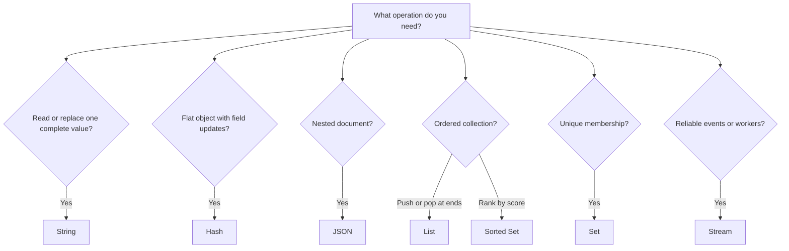
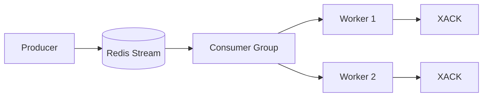
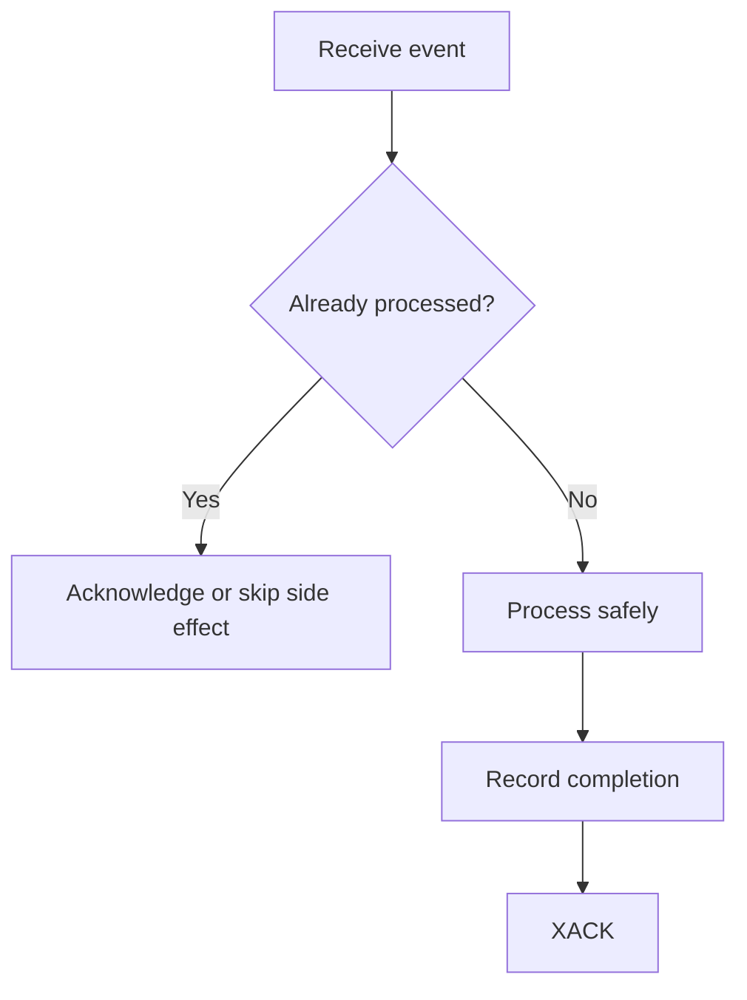

# Redis Data Structures

> Understand the Redis data structures that matter most in normal backend development, how to choose between them, and how they affect caching, queues, ranking, counters, and event processing.

## In short

Redis is more than a simple `key -> string` cache. A key points to a value with a specific data type, and Redis provides commands that operate directly on that structure.

The structures you should know first are:

- **String** — cache values, tokens, counters, simple locks.
- **Hash** — flat objects and field-level updates.
- **List** — simple queues, stacks, and recent items.
- **Set** — uniqueness and membership.
- **Sorted Set** — ranking, scheduling, and score-based ordering.
- **Stream** — reliable event processing with consumer groups.
- **JSON** — nested documents when partial path updates matter.

Redis 8 also includes structures such as JSON, time series, probabilistic structures, and vector sets in the main Redis distribution. Redis 8.8 introduced the **Array** data type, and Redis 8.10 introduced **compact hashes** plus `HIMPORT` for high-throughput compact-hash ingestion.

The most important modelling rule is:

> Choose the Redis structure from the operations your application needs, not only from the shape of the data.

For example, a leaderboard is naturally a **Sorted Set** because Redis can update a score and return rankings without reading and sorting all users in application code.

---

# 1. Mental Model

A Redis key has one value type.

```text
key
 |
 +--> String
 +--> Hash
 +--> List
 +--> Set
 +--> Sorted Set
 +--> Stream
 +--> JSON
 +--> Specialized structure
```

Example:

```redis
SET product:101 "Laptop"
TYPE product:101
```

Output:

```text
string
```

If the same key is later used with a hash command:

```redis
HSET product:101 price 50000
```

Redis returns a `WRONGTYPE` error because `product:101` already contains a String.

## 1.1 Generic Key Operations

Common commands that work across Redis types:

| Command | Purpose |
|---|---|
| `EXISTS key` | Check whether a key exists |
| `TYPE key` | Check the value type |
| `DEL key` | Delete synchronously |
| `UNLINK key` | Delete asynchronously |
| `EXPIRE key seconds` | Add a TTL |
| `TTL key` | Check remaining TTL |
| `PERSIST key` | Remove the TTL |
| `MEMORY USAGE key` | Inspect approximate memory use |
| `SCAN cursor` | Incrementally iterate through keys |

For production systems, prefer `SCAN` over `KEYS *` when the keyspace may be large.

---

# 2. Quick Selection Guide



| Requirement | Best starting choice |
|---|---|
| Cache complete API response | String |
| Cache flat database row | Hash |
| Cache nested document | JSON |
| Counter | String |
| Per-object counters | Hash |
| Last 20 viewed products | List |
| Unique users / tags / permissions | Set |
| Leaderboard | Sorted Set |
| Delayed jobs | Sorted Set |
| Simple queue | List |
| Reliable worker queue / event log | Stream |
| Approximate unique count | HyperLogLog |
| Nearby locations | Geospatial |
| Semantic similarity | Vector Set / Redis Search |

---

# 3. Strings

A Redis String is a byte sequence. It can hold text, numbers, serialized JSON, tokens, or binary data.

## 3.1 Basic Operations

```redis
SET app:name "billing-service"
GET app:name

MSET app:version "2.4" app:environment "production"
MGET app:version app:environment
```

## 3.2 Cache with TTL

```redis
SET cache:product:101 '{"id":101,"name":"Keyboard"}' EX 300
```

This stores the cached value for 300 seconds.

Using `SET ... EX` is usually better than separate `SET` and `EXPIRE` calls when both must happen together.

## 3.3 Atomic Counters

```redis
SET api:requests 0

INCR api:requests
INCRBY api:requests 10
DECR api:requests
```

`INCR` avoids an application-side read-modify-write race.

Instead of:

```text
GET counter
counter = counter + 1
SET counter
```

use:

```redis
INCR counter
```

## 3.4 Conditional Writes

```redis
SET lock:invoice:9001 worker-7 NX EX 30
```

Important options:

- `NX` — set only if the key does not exist.
- `XX` — set only if the key already exists.
- `EX` — expiration in seconds.
- `PX` — expiration in milliseconds.

A conditional String is useful for idempotency markers, cache-population coordination, and simple lock patterns.

## 3.5 Use Strings When

Use a String when the value is normally read and replaced as one unit.

Typical examples:

- Cached API response
- Access token
- Feature flag
- Counter
- Idempotency key
- Serialized object

Typical complexity: `GET`, `SET`, and `INCR` are O(1).

---

# 4. Hashes

A Redis Hash stores field-value pairs under one key.

```text
user:42
├── name        -> "Aarav"
├── email       -> "aarav@example.com"
├── role        -> "admin"
└── login_count -> "18"
```

Hashes are a strong choice for small, flat objects.

## 4.1 Basic Operations

```redis
HSET user:42 name "Aarav" email "aarav@example.com" role "admin"

HGET user:42 email
HMGET user:42 name role
HGETALL user:42
HDEL user:42 role
```

## 4.2 Atomic Field Updates

```redis
HINCRBY user:42 login_count 1
```

Only the required field changes. The application does not need to read and rewrite the entire object.

## 4.3 Hash vs Serialized JSON String

| Requirement | String containing JSON | Hash |
|---|---|---|
| Read whole object | Excellent | Good |
| Read one field | Must fetch/parse whole value | `HGET` |
| Update one field | Rewrite whole value | `HSET` |
| Increment one field | Usually extra logic | `HINCRBY` |
| Nested arrays/objects | Natural | Awkward |
| TTL for whole object | Easy | Easy with `EXPIRE` |

Use:

- **String** when the complete object is normally read together.
- **Hash** when individual fields are frequently read or updated.
- **JSON** when the document is genuinely nested.

## 4.4 Field Expiration

Redis supports expiration for individual hash fields through commands such as:

```text
HEXPIRE
HPEXPIRE
HTTL
HPTTL
```

Use field-level expiration when fields have independent lifetimes. For a normal cached object, a key-level TTL is usually simpler.

## 4.5 Redis 8.10 Compact Hashes

Redis 8.10 added a compact-hash encoding that can reduce memory when many hashes share the same field schema.

It also introduced `HIMPORT` for high-throughput compact-hash ingestion.

For normal application development, the familiar `HSET`, `HGET`, `HMGET`, and `HGETALL` model remains the same.

---

# 5. Lists

A Redis List is an ordered sequence that allows duplicates.

Lists are optimized for adding and removing elements at the ends.

## 5.1 Queue

A FIFO queue can be implemented with:

```redis
LPUSH jobs:email '{"job_id":1,"type":"welcome"}'
RPOP jobs:email
```

A blocking consumer can wait for work:

```redis
BRPOP jobs:email 5
```

## 5.2 Stack

A LIFO stack can use one side:

```redis
LPUSH browser:history "/home"
LPUSH browser:history "/products"

LPOP browser:history
```

## 5.3 Bounded Recent Items

```redis
LPUSH user:42:recent-products 501
LTRIM user:42:recent-products 0 19
```

This keeps only the latest 20 items.

## 5.4 Important Limitation

Lists are excellent at the ends, but distant index access is expensive.

```redis
LINDEX events 100000
```

may require Redis to traverse many elements.

Use a List when **insertion order** matters and your main operations are push/pop/range operations.

---

# 6. Sets

A Redis Set stores unique, unordered members.

```text
permissions:user:42
{
  "read:invoice",
  "write:invoice",
  "view:reports"
}
```

## 6.1 Basic Operations

```redis
SADD permissions:user:42 read:invoice write:invoice view:reports

SISMEMBER permissions:user:42 write:invoice
SMISMEMBER permissions:user:42 write:invoice delete:invoice

SREM permissions:user:42 view:reports
SCARD permissions:user:42
```

Membership checks are typically O(1).

## 6.2 Set Operations

```redis
SADD developers:python user:1 user:2 user:3
SADD developers:django user:2 user:3 user:4

SINTER developers:python developers:django
SUNION developers:python developers:django
SDIFF developers:python developers:django
```

These operations are useful for:

- Roles and permissions
- Tags
- Deduplication
- Common interests
- Feature membership
- Exact unique-user tracking

For very large sets, prefer `SSCAN` when you can process members incrementally instead of returning everything through `SMEMBERS`.

---

# 7. Sorted Sets

A Sorted Set stores unique members with numeric scores.

```text
leaderboard
user:21 -> 980
user:42 -> 870
user:17 -> 740
```

Redis automatically maintains score order.

## 7.1 Leaderboard

```redis
ZADD leaderboard 980 user:21 870 user:42 740 user:17

ZINCRBY leaderboard 50 user:42

ZREVRANK leaderboard user:42
ZREVRANGE leaderboard 0 9 WITHSCORES
```

The application does not need to read and sort the complete leaderboard.

## 7.2 Delayed Jobs

A timestamp can be the score:

```redis
ZADD jobs:scheduled 1785421200 job:9001
```

Workers can fetch jobs that are ready:

```redis
ZRANGEBYSCORE jobs:scheduled -inf 1785421200
```

## 7.3 Sliding-Window Rate Limiting

Request timestamps can be scores:

```redis
ZADD rate:user:42 1785421200123 req:abc
ZREMRANGEBYSCORE rate:user:42 -inf 1785421140123
ZCARD rate:user:42
```

In production, dependent operations like this are usually wrapped in a Lua script or Redis Function so they execute atomically.

## 7.4 Common Uses

- Leaderboards
- Priority queues
- Delayed jobs
- Scheduling
- Sliding-window rate limiting
- Trending content

`ZADD` and rank operations are generally O(log N), while range queries depend on how many members are returned.

---

# 8. Streams

Redis Streams are designed for persistent event data and reliable consumer processing.

Each stream entry has:

- A unique ID
- One or more field-value pairs

```text
orders:events
├── 1785421200000-0 {type: created, order_id: 9001}
├── 1785421201000-0 {type: paid,    order_id: 9001}
└── 1785421202000-0 {type: packed,  order_id: 9001}
```

## 8.1 Produce Events

```redis
XADD orders:events * type created order_id 9001
XADD orders:events * type paid order_id 9001 amount 2499
```

## 8.2 Consumer Groups



Create a group:

```redis
XGROUP CREATE orders:events order-processors 0 MKSTREAM
```

Read new events:

```redis
XREADGROUP GROUP order-processors worker-1 \
  COUNT 10 BLOCK 5000 \
  STREAMS orders:events >
```

Acknowledge successful processing:

```redis
XACK orders:events order-processors 1785421200000-0
```

Inspect pending events:

```redis
XPENDING orders:events order-processors
```

## 8.3 Delivery Model

Consumer groups normally require **idempotent consumers** because an event can be delivered again if a worker processes it but crashes before acknowledgment.



## 8.4 List vs Stream

| Requirement | List | Stream |
|---|---|---|
| Simple queue | Excellent | Good |
| Persistent event history | Manual | Built in |
| Consumer groups | No | Yes |
| Acknowledgment | No | Yes |
| Pending-message tracking | No | Yes |
| Replay by ID | Limited | Yes |
| Operational simplicity | Simpler | More features |

Use a **List** for a simple queue.

Use a **Stream** when consumer groups, acknowledgment, retries, replay, or event history matter.

---

# 9. JSON

Redis JSON stores nested JSON documents and supports path-based access and updates.

```redis
JSON.SET product:101 $ '{
  "name": "Mechanical Keyboard",
  "price": 2499,
  "stock": 25,
  "tags": ["keyboard", "electronics"],
  "manufacturer": {
    "name": "Example Corp",
    "country": "India"
  }
}'
```

Read a nested path:

```redis
JSON.GET product:101 $.manufacturer.country
```

Update one path:

```redis
JSON.SET product:101 $.price 2299
JSON.NUMINCRBY product:101 $.stock -1
```

Use JSON when:

- The document contains nested objects or arrays.
- You frequently update individual paths.
- You need Redis Query Engine indexing over document fields.

Do not choose Redis JSON only because your HTTP API returns JSON.

---

# 10. Specialized Structures Worth Knowing

These structures are useful, but they are usually secondary to Strings, Hashes, Lists, Sets, Sorted Sets, and Streams in everyday backend work.

| Structure | Main purpose | Example |
|---|---|---|
| Bitmap | Boolean state for dense numeric IDs | Daily active users |
| Bitfield | Packed numeric fields | Compact counters/flags |
| HyperLogLog | Approximate unique count | Unique visitors |
| Geospatial | Nearby-location search | Drivers near a customer |
| Time Series | Timestamped numeric measurements | API latency metrics |
| Bloom Filter | Probabilistic membership | "Probably seen before?" |
| Cuckoo Filter | Membership with deletion | Dedup with removals |
| Count-Min Sketch | Approximate frequency | Page-view counts |
| Top-K | Approximate frequent items | Trending products |
| t-digest | Approximate percentiles | P95/P99 latency |
| Vector Set | Vector similarity | Semantic similarity |
| Array | Sparse/direct numeric indexes | Indexed events, ring buffers |

## 10.1 Array

Redis 8.8 introduced the Array type.

Arrays are useful when the **numeric position itself has meaning** and you need fast access by index.

Conceptually:

```text
events:1
index 0       -> "login"
index 1       -> "click"
index 2       -> "purchase"
index 1000000 -> "special-event"
```

Typical commands include:

```redis
ARSET events:1 0 "login" "click" "purchase"
ARGET events:1 0
ARRING recent:metrics 100 "23.1" "23.4" "23.2"
```

Use:

- **List** when insertion order and push/pop behavior matter.
- **Hash** when fields have names.
- **Array** when numeric indexes are part of the domain model.

Because Arrays are newer, check your deployment and client-library compatibility before using them in an existing system.

---

# 11. Atomicity and Concurrency

An individual Redis command is atomic relative to other commands.

For example:

```redis
INCR inventory:reserved
```

does not partially overlap with another `INCR`.

The problem appears when application logic uses multiple dependent commands:

```text
GET balance
calculate new balance
SET balance
```

Another client can modify the value between the `GET` and `SET`.

## 11.1 Prefer Atomic Commands

Prefer:

```redis
INCR counter
HINCRBY user:42 login_count 1
ZINCRBY leaderboard 10 user:42
```

instead of read-modify-write logic in the application.

## 11.2 Transactions

```redis
MULTI
INCR account:42:login_count
SADD online:users user:42
EXEC
```

Redis executes the queued transaction commands without interleaving another client's commands between them.

`WATCH` can add optimistic concurrency.

## 11.3 Lua Scripts and Redis Functions

Use server-side logic when multiple dependent operations must succeed atomically.

Common examples:

- Sliding-window rate limiter
- Check-and-reserve inventory
- Release a lock only if the owner token matches
- Update several related structures

Keep scripts bounded and fast because long-running commands or scripts delay other clients.

---

# 12. Performance and Memory

Redis is optimized for low-latency access, but data modelling still matters.

## 12.1 Avoid Unbounded Collections

Bound collections intentionally:

```redis
LTRIM user:42:activity 0 99

XTRIM orders:events MAXLEN ~ 100000

ZREMRANGEBYRANK leaderboard:history 0 -10001
```

## 12.2 Avoid Huge Blocking Responses

Be careful with commands that return entire large collections:

```text
KEYS *
SMEMBERS huge-set
HGETALL huge-hash
LRANGE huge-list 0 -1
ZRANGE huge-zset 0 -1
```

Prefer incremental or bounded access:

```text
SCAN
HSCAN
SSCAN
ZSCAN
bounded range queries
```

Redis can use I/O threads, but command execution still depends heavily on the main execution path. A large expensive command can therefore increase latency for unrelated clients.

## 12.3 Pipeline Independent Commands

Pipelining reduces network round trips:

```python
pipe = redis_client.pipeline(transaction=False)
pipe.get("product:101")
pipe.get("product:102")
pipe.hgetall("user:42")

results = pipe.execute()
```

Pipelining improves network efficiency.

It does **not** automatically make the commands transactional.

## 12.4 Watch for Hot Keys

A hot key receives a very large share of traffic.

Examples:

- One global counter
- One popular cached response
- One global leaderboard
- One very busy stream

Possible approaches include:

- Local/in-process caching
- Client-side caching
- Sharded counters
- Partitioned streams
- Request coalescing
- Redesigning the key boundary

---

# 13. Key-Modelling Best Practices

Use predictable key names:

```text
billing:invoice:9001
auth:session:abc123
user:42:permissions
cache:product:101
```

A useful pattern is:

```text
<domain>:<entity>:<id>:<purpose>
```

Before choosing a structure, ask:

1. What will be read most often?
2. What will be updated most often?
3. What must be atomic?
4. Does this data need a TTL?
5. Can the collection grow without a bound?
6. Can this key become a hot key?
7. Do I need exact or approximate results?

In Redis, access pattern matters more than modelling the data exactly like a relational database.

---

# 14. Practical Python Example

Install the client:

```bash
pip install redis
```

Example with `redis-py`:

```python
from __future__ import annotations

import json
from typing import Any

from redis import Redis


redis_client = Redis(
    host="localhost",
    port=6379,
    decode_responses=True,
    socket_connect_timeout=2,
    socket_timeout=2,
)


def cache_product(product: dict[str, Any], ttl_seconds: int = 300) -> None:
    """Store a complete object as a Redis String."""
    key = f"cache:product:{product['id']}"
    redis_client.set(key, json.dumps(product), ex=ttl_seconds)


def cache_user_profile(
    user_id: int,
    profile: dict[str, str],
    ttl_seconds: int = 1800,
) -> None:
    """Store a flat object as a Redis Hash."""
    key = f"cache:user:{user_id}"

    with redis_client.pipeline(transaction=True) as pipe:
        pipe.hset(key, mapping=profile)
        pipe.expire(key, ttl_seconds)
        pipe.execute()


def record_product_view(product_id: int, user_id: int) -> None:
    """Use different structures for different access patterns."""
    with redis_client.pipeline(transaction=False) as pipe:
        # String counter
        pipe.incr(f"analytics:product:{product_id}:views")

        # Set for exact unique viewers
        pipe.sadd(f"analytics:product:{product_id}:viewers", user_id)

        # Sorted Set for ranking
        pipe.zincrby("analytics:products:popular", 1, product_id)

        pipe.execute()


def publish_order_event(order_id: int, event_type: str) -> str:
    """Append a durable event to a Redis Stream."""
    return redis_client.xadd(
        "orders:events",
        {
            "order_id": str(order_id),
            "type": event_type,
        },
        maxlen=100_000,
        approximate=True,
    )
```

Structures used:

| Requirement | Structure |
|---|---|
| Complete cached product | String |
| Flat user profile | Hash |
| Total product views | String counter |
| Exact unique viewers | Set |
| Product popularity | Sorted Set |
| Order event log | Stream |

---

# 15. Final Takeaway

The Redis data structure is part of the application design.

A good structure lets Redis perform the important operation directly:

```text
Counter          -> INCR
Object field     -> HSET / HINCRBY
Recent items     -> LPUSH + LTRIM
Membership       -> SISMEMBER
Ranking          -> ZADD / ZRANGE
Reliable events  -> XADD / XREADGROUP / XACK
Nested document  -> JSON.SET / JSON.GET
```

The practical rule to remember is:

> If the application repeatedly reads data, modifies it locally, and writes it back, check whether Redis already has a structure and atomic command that performs that operation directly.
