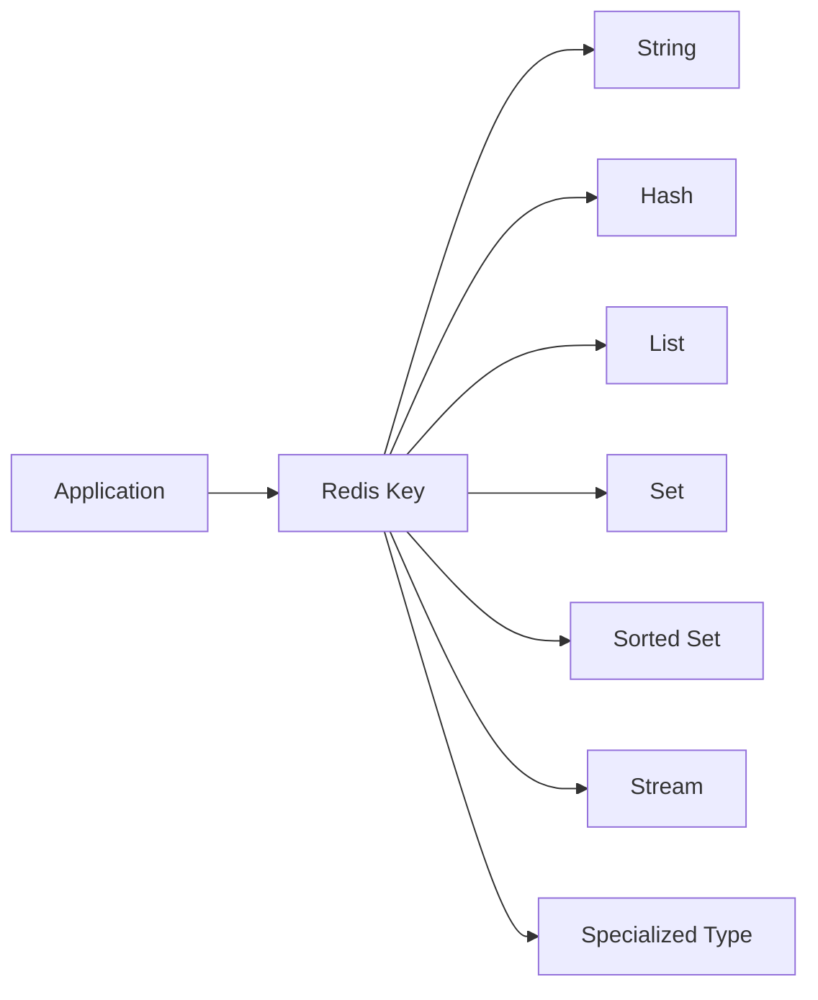
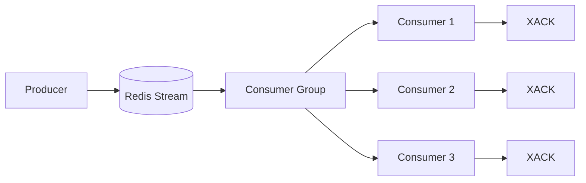
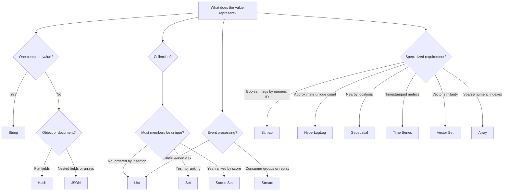
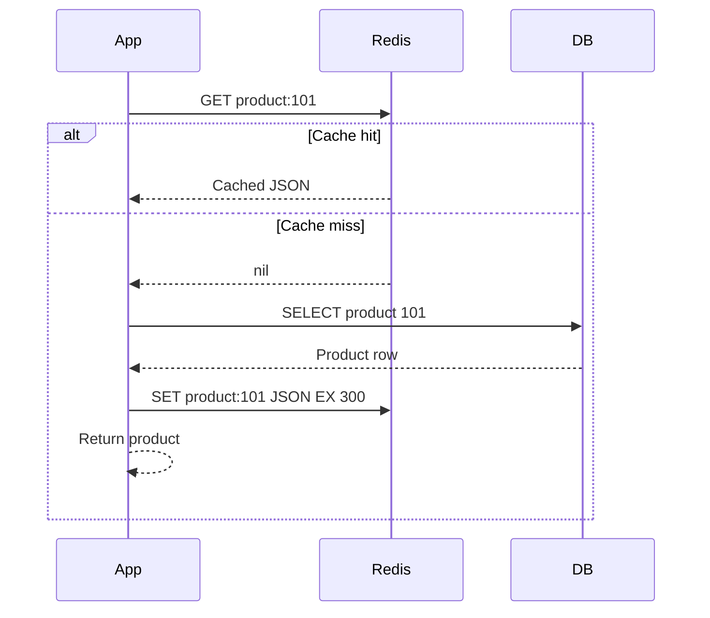

# Redis Data Structures

> **Topic:** Caching with Redis  
> **Level:** Intermediate developer  
> **Purpose:** Understand how Redis data structures work, when to use each one, and how they support real-world caching and backend systems.

---

## Table of Contents

1. [Redis Is More Than a Key-Value Cache](#1-redis-is-more-than-a-key-value-cache)
2. [Mental Model: Key, Value Type, and Commands](#2-mental-model-key-value-type-and-commands)
3. [Data Structure Overview](#3-data-structure-overview)
4. [Strings](#4-strings)
5. [Hashes](#5-hashes)
6. [Lists](#6-lists)
7. [Sets](#7-sets)
8. [Sorted Sets](#8-sorted-sets)
9. [Streams](#9-streams)
10. [Bitmaps](#10-bitmaps)
11. [Bitfields](#11-bitfields)
12. [HyperLogLog](#12-hyperloglog)
13. [Geospatial Indexes](#13-geospatial-indexes)
14. [JSON](#14-json)
15. [Time Series](#15-time-series)
16. [Probabilistic Structures](#16-probabilistic-structures)
17. [Vector Sets](#17-vector-sets)
18. [Arrays](#18-arrays)
19. [Choosing the Correct Data Structure](#19-choosing-the-correct-data-structure)
20. [Caching Design Patterns Using Data Structures](#20-caching-design-patterns-using-data-structures)
21. [Atomicity, Transactions, and Concurrency](#21-atomicity-transactions-and-concurrency)
22. [Memory and Performance Considerations](#22-memory-and-performance-considerations)
23. [Key-Naming and Data-Modelling Best Practices](#23-key-naming-and-data-modelling-best-practices)
24. [Practical Python Example](#24-practical-python-example)
25. [Summary](#25-summary)
26. [Official References](#26-official-references)

---

# 1. Redis Is More Than a Key-Value Cache

Redis stores data using the following model:

```text
key -> value
```

The important point is that the value does not have to be a plain string. It can be a hash, list, set, sorted set, stream, JSON document, time series, vector set, and more.



This allows Redis to perform operations close to the data.

For example, instead of reading an entire leaderboard into the application, sorting it, and writing it back, Redis can update and rank members directly through sorted-set commands.

```redis
ZINCRBY leaderboard 25 user:101
ZREVRANK leaderboard user:101
```

That is why Redis is often described as a **data structure server**, not merely a cache.

---

# 2. Mental Model: Key, Value Type, and Commands

Every Redis key has one primary value type.

```redis
SET product:101 "Laptop"
TYPE product:101
```

Output:

```text
string
```

A key created as one type cannot be used with commands belonging to another type.

```redis
SET user:1 "Avadh"
HSET user:1 email "user@example.com"
```

The second command fails with:

```text
WRONGTYPE Operation against a key holding the wrong kind of value
```

## 2.1 Generic Key Commands

These commands work with most Redis data types:

| Command | Purpose |
|---|---|
| `EXISTS key` | Check whether a key exists |
| `TYPE key` | Return the key's value type |
| `DEL key` | Delete a key |
| `UNLINK key` | Delete a key asynchronously |
| `EXPIRE key seconds` | Set a TTL in seconds |
| `PEXPIRE key milliseconds` | Set a TTL in milliseconds |
| `TTL key` | Check remaining TTL |
| `PERSIST key` | Remove the TTL |
| `RENAME old new` | Rename a key |
| `MEMORY USAGE key` | Estimate memory used by a key |
| `SCAN cursor` | Incrementally iterate through keys |

> Use `SCAN` in application and production tooling. Avoid using `KEYS *` on a large production database because it scans the complete keyspace in one blocking operation.

## 2.2 TTL Applies to the Key

A Redis key can have an expiration regardless of its data type.

```redis
HSET session:abc123 user_id 42 role admin
EXPIRE session:abc123 1800
TTL session:abc123
```

When the TTL reaches zero, the complete key and its value are removed.

Modern Redis versions also support expiration for individual hash fields, but key-level expiration remains the most common caching model.

---

# 3. Data Structure Overview

## 3.1 Frequently Used Core Structures

| Structure | Stores | Ordering | Uniqueness | Common Use |
|---|---|---:|---:|---|
| String | One byte sequence | No | Not applicable | Cache values, tokens, counters |
| Hash | Field-value pairs | No guaranteed business ordering | Fields are unique | Objects, sessions, profiles |
| List | Ordered sequence of strings | Insertion order | Duplicates allowed | Queues, stacks, recent items |
| Set | Unordered strings | No | Members are unique | Tags, permissions, deduplication |
| Sorted Set | Member-score pairs | Score order | Members are unique | Leaderboards, scheduling, ranking |
| Stream | Ordered event entries | Entry ID | IDs are unique | Event processing, reliable messaging |

## 3.2 Specialized Structures

| Structure | Main Purpose |
|---|---|
| Bitmap | Boolean state for many numeric IDs |
| Bitfield | Packed integer counters and flags |
| HyperLogLog | Approximate unique count |
| Geospatial | Store coordinates and find nearby locations |
| JSON | Nested document storage and partial updates |
| Time Series | Timestamped measurements and aggregation |
| Bloom Filter | Memory-efficient membership checks |
| Cuckoo Filter | Membership checks with deletion support |
| Count-Min Sketch | Approximate item frequency |
| Top-K | Approximate most frequent items |
| t-digest | Approximate percentiles |
| Vector Set | Vector similarity search |
| Array | Sparse, directly index-addressable string values |

---

# 4. Strings

A Redis string stores a sequence of bytes. It can hold text, numbers, serialized JSON, images, or other binary data.

A single string value can be up to **512 MB** by default.

## 4.1 Basic Commands

```redis
SET app:name "billing-service"
GET app:name
MSET app:version "2.4" app:environment "production"
MGET app:version app:environment
DEL app:name
```

## 4.2 Cache with TTL

```redis
SET product:101 '{"id":101,"name":"Keyboard","price":2499}' EX 300
```

This stores the value for 300 seconds.

Equivalent commands:

```redis
SET product:101 '{"id":101,"name":"Keyboard","price":2499}'
EXPIRE product:101 300
```

Prefer the first form when possible because the value and expiration are set atomically.

## 4.3 Conditional Writes

```redis
SET lock:invoice:9001 worker-7 NX EX 30
```

- `NX`: Set only when the key does not exist.
- `XX`: Set only when the key already exists.
- `EX`: Expiration in seconds.
- `PX`: Expiration in milliseconds.

Conditional writes are useful for simple locks, idempotency markers, and cache population coordination.

## 4.4 Counters

Redis stores integers as strings but provides atomic numeric commands.

```redis
SET api:requests 0
INCR api:requests
INCRBY api:requests 10
DECR api:requests
```

For floating-point numbers:

```redis
INCRBYFLOAT wallet:42 12.50
```

## 4.5 Common Use Cases

- Serialized API responses
- HTML fragments
- Authentication tokens
- Feature flags
- Idempotency keys
- Counters
- Simple distributed locks
- Rate-limit counters

## 4.6 When a String Is a Good Choice

Use a string when:

- The complete value is normally read or replaced together.
- The application already serializes the value.
- The object is small.
- You need simple `GET` and `SET`.
- You need atomic counters.

Avoid using one large serialized object when the application frequently updates only one small field. A hash or JSON document may be more suitable.

## 4.7 Complexity

| Operation | Typical Complexity |
|---|---:|
| `GET` | O(1) |
| `SET` | O(1) |
| `INCR` | O(1) |
| `MGET` | O(N), where N is the number of keys |
| `APPEND` | O(1) amortized, depending on allocation |

---

# 5. Hashes

A Redis hash stores field-value pairs under one Redis key.

```text
user:42
├── name  -> "Aarav"
├── email -> "aarav@example.com"
├── role  -> "admin"
└── login_count -> "18"
```

## 5.1 Basic Commands

```redis
HSET user:42 name "Aarav" email "aarav@example.com" role "admin"
HGET user:42 email
HMGET user:42 name role
HGETALL user:42
HEXISTS user:42 role
HDEL user:42 role
HLEN user:42
```

## 5.2 Atomic Numeric Updates

```redis
HINCRBY user:42 login_count 1
HINCRBYFLOAT product:101 rating_total 4.5
```

No application-side read-modify-write cycle is required.

## 5.3 Cache an Object as a Hash

```redis
HSET product:101 \
    name "Mechanical Keyboard" \
    price "2499" \
    stock "25" \
    category "electronics"

EXPIRE product:101 300
```

The application can retrieve only the required fields:

```redis
HMGET product:101 name price
```

## 5.4 Hash vs Serialized JSON String

| Requirement | String containing JSON | Hash |
|---|---|---|
| Read complete object | Excellent | Good |
| Read one field | Application must deserialize complete value | Direct with `HGET` |
| Update one field | Replace complete value | Direct with `HSET` |
| Nested objects and arrays | Supported through serialization | Not naturally supported |
| Numeric field increment | Application logic normally required | `HINCRBY` / `HINCRBYFLOAT` |
| Memory for small flat objects | Often efficient | Often efficient |
| Query nested paths | No | No |

Use a hash for a flat record. Use Redis JSON when nested document operations are required.

## 5.5 Field Expiration

Recent Redis versions support expiration on individual hash fields. This can be useful when fields have independent lifetimes, such as per-user temporary attributes.

Example command family:

```text
HEXPIRE, HPEXPIRE, HEXPIREAT, HPEXPIREAT, HTTL, HPTTL
```

Key-level TTL is still simpler and should be preferred when all fields represent one cached object.

## 5.6 Redis 8.10 Note: Compact Hashes

Redis 8.10 introduced a compact-hash encoding intended to reduce memory when many hashes share the same schema. It also introduced `HIMPORT` for high-throughput compact-hash insertion.

The normal `HSET`, `HGET`, and `HGETALL` mental model remains unchanged.

## 5.7 Common Use Cases

- User profiles
- Session attributes
- Shopping carts
- Product summaries
- Configuration objects
- Per-entity counters
- Cached database rows

## 5.8 Complexity

| Operation | Typical Complexity |
|---|---:|
| `HGET` | O(1) average |
| `HSET` | O(1) average per field |
| `HDEL` | O(N), where N is the number of fields removed |
| `HGETALL` | O(N), where N is the number of fields |
| `HSCAN` | O(1) per call; O(N) for a full iteration |

> Avoid placing an unbounded number of fields in one hash. Large hashes can make full reads, deletion, replication, and migration more expensive.

---

# 6. Lists

A Redis list is an ordered sequence of string values. Lists preserve insertion order and allow duplicates.

```text
notifications:user:42

HEAD                                   TAIL
["payment_received", "quote_ready", "login"]
```

Redis lists are optimized for insertion and removal at both ends.

## 6.1 Stack Operations

A stack follows **Last In, First Out — LIFO**.

```redis
LPUSH browser:history "/home"
LPUSH browser:history "/products"
LPOP browser:history
```

## 6.2 Queue Operations

A queue follows **First In, First Out — FIFO**.

```redis
LPUSH jobs:email '{"job_id":1,"template":"welcome"}'
RPOP jobs:email
```

Blocking consumption:

```redis
BRPOP jobs:email 5
```

This waits for up to five seconds when the list is empty.

## 6.3 Bounded Recent-Items List

```redis
LPUSH user:42:recent-products 501
LTRIM user:42:recent-products 0 9
```

This keeps only the ten most recent items.

## 6.4 Moving Items Atomically

`LMOVE` can remove an item from one list and add it to another atomically.

```redis
LMOVE jobs:ready jobs:processing RIGHT LEFT
```

This is safer than separate pop and push commands.

Redis 8.10 also added `LMOVEM` and `BLMOVEM` for moving multiple elements.

## 6.5 List Limitations

Random access is not the main strength of linked-list-like structures.

```redis
LINDEX events 100000
```

This may require traversing many elements.

Use:

- A list for operations at the ends.
- A stream for reliable event processing and consumer groups.
- An array for direct numeric-index access in Redis versions that support arrays.
- A sorted set when elements need scores or priorities.

## 6.6 Common Use Cases

- Simple queues
- Stacks
- Recent activity
- Notification history
- Work waiting lists
- Fixed-length rolling lists

## 6.7 Complexity

| Operation | Typical Complexity |
|---|---:|
| `LPUSH` / `RPUSH` | O(1) per element |
| `LPOP` / `RPOP` | O(1) for one element |
| `LLEN` | O(1) |
| `LINDEX` | O(N) |
| `LRANGE` | O(S + N), based on traversal and returned elements |
| `LTRIM` | O(N), based on removed elements |

---

# 7. Sets

A Redis set is an unordered collection of unique strings.

```text
roles:user:42 = {"admin", "billing", "reports"}
```

Adding an existing member again has no effect.

## 7.1 Basic Commands

```redis
SADD roles:user:42 admin billing reports
SISMEMBER roles:user:42 admin
SMISMEMBER roles:user:42 admin support
SMEMBERS roles:user:42
SREM roles:user:42 reports
SCARD roles:user:42
```

## 7.2 Set Operations

```redis
SADD developers:python user:1 user:2 user:3
SADD developers:django user:2 user:3 user:4
```

Intersection:

```redis
SINTER developers:python developers:django
```

Union:

```redis
SUNION developers:python developers:django
```

Difference:

```redis
SDIFF developers:python developers:django
```

These operations make sets useful for relationship and permission logic.

## 7.3 Random Selection

```redis
SRANDMEMBER giveaway:participants
SPOP giveaway:participants
```

- `SRANDMEMBER` reads a random member.
- `SPOP` reads and removes a random member.

## 7.4 Common Use Cases

- Unique visitors
- Tags
- Roles and permissions
- Online users
- Feature membership
- Deduplication
- Mutual friends or common interests
- Random sampling

## 7.5 Complexity

| Operation | Typical Complexity |
|---|---:|
| `SADD` | O(1) average per member |
| `SREM` | O(1) average per member |
| `SISMEMBER` | O(1) average |
| `SCARD` | O(1) |
| `SMEMBERS` | O(N) |
| Set intersection/union/difference | Depends on input-set sizes |

> Use `SSCAN` instead of `SMEMBERS` when a set can contain a very large number of members and the application can process results incrementally.

---

# 8. Sorted Sets

A Redis sorted set contains unique members, each associated with a floating-point score.

```text
leaderboard

user:21 -> 980
user:42 -> 870
user:17 -> 740
```

Members are automatically maintained in score order.

## 8.1 Basic Commands

```redis
ZADD leaderboard 980 user:21 870 user:42 740 user:17
ZINCRBY leaderboard 50 user:42
ZRANK leaderboard user:42
ZREVRANK leaderboard user:42
ZRANGE leaderboard 0 -1 WITHSCORES
ZREVRANGE leaderboard 0 9 WITHSCORES
ZSCORE leaderboard user:42
ZREM leaderboard user:17
```

## 8.2 Leaderboard

```redis
ZINCRBY game:season:2026:scores 25 user:42
ZREVRANGE game:season:2026:scores 0 9 WITHSCORES
```

Because the structure remains ordered, the application does not need to sort all players on every request.

## 8.3 Priority Queue

Use the priority as the score:

```redis
ZADD jobs:priority 10 job:normal
ZADD jobs:priority 1 job:urgent
ZRANGE jobs:priority 0 0 WITHSCORES
```

Lower or higher scores can mean greater priority depending on the chosen convention.

## 8.4 Delayed Jobs

Use an execution timestamp as the score:

```redis
ZADD jobs:scheduled 1785421200 job:9001
ZRANGEBYSCORE jobs:scheduled -inf 1785421200
```

Workers query jobs whose scores are less than or equal to the current time.

## 8.5 Sliding-Window Rate Limiter

Use request timestamps as scores and unique request IDs as members.

```redis
ZADD rate:user:42 1785421200123 req:abc
ZREMRANGEBYSCORE rate:user:42 -inf 1785421140123
ZCARD rate:user:42
```

The application generally executes these steps atomically through a Lua script or Redis function.

## 8.6 Common Use Cases

- Leaderboards
- Priority queues
- Delayed jobs
- Sliding-window rate limiting
- Trending content
- Ranking
- Scheduling
- Time-ordered indexes

## 8.7 Complexity

| Operation | Typical Complexity |
|---|---:|
| `ZADD` | O(log N) per member |
| `ZREM` | O(log N) per member |
| `ZSCORE` | O(1) |
| `ZRANK` / `ZREVRANK` | O(log N) |
| Range query | O(log N + M), where M is returned members |

---

# 9. Streams

A Redis stream is an append-only sequence of entries. Each entry has:

- A unique stream ID
- One or more field-value pairs

```text
orders:events
├── 1785421200000-0 {type: "created", order_id: "9001"}
├── 1785421201000-0 {type: "paid",    order_id: "9001"}
└── 1785421202000-0 {type: "packed",  order_id: "9001"}
```

Streams are designed for event logs and reliable processing.

## 9.1 Add Events

```redis
XADD orders:events * type created order_id 9001 user_id 42
XADD orders:events * type paid order_id 9001 amount 2499
```

`*` tells Redis to generate the entry ID.

## 9.2 Read Events

```redis
XRANGE orders:events - +
XREAD COUNT 10 STREAMS orders:events 0-0
```

To wait for new entries:

```redis
XREAD BLOCK 5000 STREAMS orders:events $
```

## 9.3 Consumer Groups

A consumer group distributes messages among consumers.



Create a group:

```redis
XGROUP CREATE orders:events order-processors 0 MKSTREAM
```

Read as a group member:

```redis
XREADGROUP GROUP order-processors worker-1 \
    COUNT 10 BLOCK 5000 \
    STREAMS orders:events >
```

Acknowledge a processed message:

```redis
XACK orders:events order-processors 1785421200000-0
```

Inspect pending messages:

```redis
XPENDING orders:events order-processors
```

Recover abandoned work:

```redis
XAUTOCLAIM orders:events order-processors worker-2 60000 0-0 COUNT 10
```

## 9.4 Delivery Semantics

Consumer groups commonly provide **at-least-once delivery**.

A consumer may receive the same event more than once, for example when:

1. It processes an event.
2. It crashes before sending `XACK`.
3. Another consumer claims and processes the pending event.

Therefore, stream consumers should normally be idempotent.

```text
event_id -> already processed?

yes -> do not repeat side effects
no  -> process, record completion, acknowledge
```

## 9.5 Stream Trimming

Prevent unbounded growth:

```redis
XADD orders:events MAXLEN ~ 100000 * type created order_id 9002
```

The `~` allows approximate trimming, which is generally more efficient.

## 9.6 List vs Stream

| Requirement | List | Stream |
|---|---|---|
| Simple queue | Good | Good |
| Persistent event history | Manual | Built in |
| Multiple independent readers | Difficult | Supported |
| Consumer groups | No | Yes |
| Pending-message tracking | No | Yes |
| Acknowledgement | No | Yes |
| Replay from an ID | Limited | Yes |
| Simple push/pop | Excellent | More complex |

Use a list for a simple queue. Use a stream when delivery tracking, replay, consumer groups, or event history matters.

## 9.7 Common Use Cases

- Domain events
- Audit events
- Background processing
- Event sourcing support
- Service-to-service messaging
- Activity feeds
- IoT event ingestion

---

# 10. Bitmaps

A bitmap is not a separate underlying value type. Redis performs bit operations on string values.

Each bit can represent a Boolean state for a numeric ID.

```text
active:2026-07-30

User ID:  0 1 2 3 4 5 6 7
Active?:  0 1 0 1 0 0 1 0
```

## 10.1 Basic Commands

```redis
SETBIT active:2026-07-30 1 1
SETBIT active:2026-07-30 3 1
SETBIT active:2026-07-30 6 1

GETBIT active:2026-07-30 3
BITCOUNT active:2026-07-30
```

## 10.2 Compare Days

```redis
BITOP AND active:both-days active:2026-07-29 active:2026-07-30
BITCOUNT active:both-days
```

## 10.3 Common Use Cases

- Daily active users
- Attendance
- Feature-completion flags
- Subscription-state flags
- Boolean status across dense numeric IDs

## 10.4 Important Trade-Off

The bitmap size depends on the largest offset.

Setting bit `1,000,000,000` may allocate a large string even when only one bit is set. Bitmaps are best when IDs are reasonably dense.

---

# 11. Bitfields

Bitfields pack several integers into one Redis string and allow atomic reads, writes, and increments.

Example layout:

```text
| plan: 2 bits | retries: 4 bits | region: 3 bits | flags: 7 bits |
```

## 11.1 Commands

```redis
BITFIELD account:42 \
    SET u2 0 2 \
    SET u4 2 5 \
    GET u2 0 \
    GET u4 2
```

Increment a packed value:

```redis
BITFIELD account:42 INCRBY u4 2 1
```

Overflow behavior can be configured:

```redis
BITFIELD account:42 OVERFLOW SAT INCRBY u4 2 20
```

## 11.2 Common Use Cases

- Compact counters
- Packed flags
- Game statistics
- Device-state values
- Memory-sensitive numeric attributes

Bitfields improve memory efficiency but reduce readability and increase modelling complexity. Use them only when the memory benefit is meaningful.

---

# 12. HyperLogLog

HyperLogLog estimates the number of unique elements using a small, fixed amount of memory.

```redis
PFADD visitors:2026-07-30 user:1 user:2 user:3
PFADD visitors:2026-07-30 user:2
PFCOUNT visitors:2026-07-30
```

The result is approximate, not exact.

Merge estimates:

```redis
PFMERGE visitors:week \
    visitors:2026-07-28 \
    visitors:2026-07-29 \
    visitors:2026-07-30

PFCOUNT visitors:week
```

## 12.1 Set vs HyperLogLog

| Requirement | Set | HyperLogLog |
|---|---|---|
| Exact unique count | Yes | No |
| Retrieve members | Yes | No |
| Membership check | Yes | No |
| Memory for millions of items | Potentially large | Small and predictable |
| Best use | Exact membership | Approximate cardinality |

Use HyperLogLog for analytics where a small estimation error is acceptable.

Common examples:

- Unique website visitors
- Unique search queries
- Unique devices
- Unique API consumers

---

# 13. Geospatial Indexes

Redis geospatial indexes store longitude and latitude and support proximity searches.

Internally, geospatial data is managed using sorted-set capabilities, but applications use `GEO*` commands.

## 13.1 Add Locations

```redis
GEOADD restaurants \
    72.8777 19.0760 mumbai-central \
    72.8562 19.0178 lower-parel
```

The command order is:

```text
longitude latitude member
```

## 13.2 Search Nearby Locations

```redis
GEOSEARCH restaurants \
    FROMLONLAT 72.87 19.07 \
    BYRADIUS 5 km \
    WITHDIST \
    ASC
```

## 13.3 Distance

```redis
GEODIST restaurants mumbai-central lower-parel km
```

## 13.4 Common Use Cases

- Nearby stores
- Delivery partners
- Ride matching
- Serviceable locations
- Location-aware recommendations

For complex shapes, polygons, or rich geographic querying, use Redis Search geospatial capabilities or a dedicated geospatial database.

---

# 14. JSON

Redis JSON stores structured JSON documents and allows access and modification through JSONPath-like paths.

## 14.1 Store a Document

```redis
JSON.SET product:101 $ '{
  "name": "Mechanical Keyboard",
  "price": 2499,
  "stock": 25,
  "tags": ["keyboard", "electronics"],
  "manufacturer": {
    "name": "Example Corp",
    "country": "India"
  }
}'
```

## 14.2 Read Paths

```redis
JSON.GET product:101 $.name
JSON.GET product:101 $.manufacturer.country
```

## 14.3 Update Paths

```redis
JSON.SET product:101 $.price 2299
JSON.NUMINCRBY product:101 $.stock -1
JSON.ARRAPPEND product:101 $.tags '"sale"'
```

## 14.4 JSON vs Hash

| Requirement | Hash | JSON |
|---|---|---|
| Flat object | Excellent | Good |
| Nested object | Awkward | Native |
| Arrays | Manual serialization | Native |
| Field-level numeric update | Yes | Yes |
| Path-based update | No | Yes |
| Secondary indexing | With Redis Search | With Redis Search |
| Memory usage | Usually lower for simple flat data | Usually higher |

Use JSON when document structure and nested updates matter. Do not choose JSON only because the application returns JSON over HTTP.

---

# 15. Time Series

Redis time series stores timestamped numeric samples and supports retention, aggregation, labels, and range queries.

```text
temperature:room:1

10:00 -> 23.1
10:01 -> 23.4
10:02 -> 23.2
```

## 15.1 Create and Add Samples

```redis
TS.CREATE temperature:room:1 \
    RETENTION 86400000 \
    LABELS building A room 1

TS.ADD temperature:room:1 * 23.1
TS.ADD temperature:room:1 * 23.4
```

The retention value is in milliseconds.

## 15.2 Query a Range

```redis
TS.RANGE temperature:room:1 - +
```

Aggregate into five-minute averages:

```redis
TS.RANGE temperature:room:1 - + \
    AGGREGATION avg 300000
```

## 15.3 Common Use Cases

- Application metrics
- IoT sensors
- Financial prices
- Monitoring
- Smart-meter readings
- Latency and throughput measurements

Use a sorted set for simple timestamp ordering. Use time series when retention, labels, downsampling, and numeric aggregation are central requirements.

---

# 16. Probabilistic Structures

Probabilistic structures trade perfect accuracy for lower memory usage and fast computation.

## 16.1 Bloom Filter

A Bloom filter answers:

```text
"Has this item probably been seen?"
```

```redis
BF.ADD seen:articles article:101
BF.EXISTS seen:articles article:101
```

Possible answers:

- Definitely not present
- Probably present

Bloom filters can produce false positives but not false negatives under normal use.

Common uses:

- Avoid unnecessary database lookups
- URL or event deduplication
- Check whether a username may already exist
- Prevent repeat content recommendations

## 16.2 Cuckoo Filter

A Cuckoo filter also supports membership checking and generally supports deletion.

```redis
CF.ADD seen:payments payment:9001
CF.EXISTS seen:payments payment:9001
CF.DEL seen:payments payment:9001
```

Choose it when deletion is required and its memory/performance trade-offs fit the workload.

## 16.3 Count-Min Sketch

Count-Min Sketch estimates item frequency.

```redis
CMS.INITBYPROB product:views 0.001 0.01
CMS.INCRBY product:views product:101 1 product:102 1
CMS.QUERY product:views product:101 product:102
```

Common uses:

- Approximate page-view frequency
- Event frequency
- Heavy-hitter detection

## 16.4 Top-K

Top-K estimates the most frequent items.

```redis
TOPK.RESERVE trending:products 10 2000 7 0.925
TOPK.ADD trending:products product:101 product:102 product:101
TOPK.LIST trending:products WITHCOUNT
```

Common uses:

- Trending searches
- Popular products
- Most frequent error codes

## 16.5 t-digest

t-digest estimates percentiles from numeric observations.

```redis
TDIGEST.CREATE latency:api
TDIGEST.ADD latency:api 12 15 18 22 31 55 120
TDIGEST.QUANTILE latency:api 0.50 0.95 0.99
```

Common uses:

- P50, P95, and P99 latency
- Response-time distribution
- Transaction-value percentiles

---

# 17. Vector Sets

A vector set stores high-dimensional vectors and finds similar elements.

```text
document text
    |
embedding model
    |
[0.18, -0.27, 0.91, ...]
    |
Redis vector set
```

## 17.1 Main Operations

The core commands include:

```text
VADD     Add a vector and member
VSIM     Find similar members
VREM     Remove a member
VCARD    Return the number of members
VSETATTR Associate JSON attributes with a member
```

A simplified conceptual example:

```redis
VADD products:embeddings VALUES 3 0.12 0.45 0.78 product:101
VSIM products:embeddings VALUES 3 0.10 0.41 0.80 COUNT 5
```

Exact client syntax can vary depending on how vectors are encoded.

## 17.2 Common Use Cases

- Semantic search
- Similar-product recommendations
- Retrieval-augmented generation
- LLM memory retrieval
- Duplicate-content detection
- Semantic caching

Use vector sets when similarity is the primary operation. Use Redis Search when the application needs a richer combination of text, numeric, tag, geospatial, and vector queries.

---

# 18. Arrays

Redis arrays were introduced in Redis 8.8. They map unsigned integer indexes to string values.

Unlike a list, an array can directly access a high or sparse index without creating all intermediate positions.

```text
events:1

index 0       -> "login"
index 1       -> "click"
index 2       -> "purchase"
index 1000000 -> "special-event"
```

## 18.1 Basic Commands

```redis
ARSET events:1 0 "login" "click" "purchase"
ARGET events:1 0
ARMSET events:1 100 "logout" 1000000 "special-event"
ARMGET events:1 0 100 1000000
```

## 18.2 Length vs Element Count

```redis
ARLEN events:1
ARCOUNT events:1
```

- `ARLEN`: Highest index plus one.
- `ARCOUNT`: Number of non-empty elements.

These differ for sparse arrays.

## 18.3 Ring Buffer

Arrays can maintain a fixed-size circular buffer:

```redis
ARRING recent:metrics 100 "23.1" "23.4" "23.2"
ARLASTITEMS recent:metrics 10
```

## 18.4 Server-Side Aggregation

Arrays can perform operations over ranges:

```redis
AROP metrics:recent 0 99 SUM
AROP metrics:recent 0 99 MAX
```

## 18.5 Array vs List vs Hash

| Requirement | Array | List | Hash |
|---|---|---|---|
| Direct numeric-index access | Excellent | Weak for distant positions | Good if index is used as field |
| Sparse indexes | Native | No | Yes |
| Push/pop at ends | Not its primary model | Excellent | No |
| Ring buffer | Native | Manual with push + trim | Manual |
| Named fields | No | No | Yes |
| Range aggregation/search | Supported | Limited | Application-side |

Because arrays are newer, verify server and client-library compatibility before adopting them in an existing production environment.

---

# 19. Choosing the Correct Data Structure



## 19.1 Quick Decision Table

| Requirement | Recommended Structure |
|---|---|
| Cache complete API response | String |
| Cache flat database record | Hash |
| Cache nested document | JSON |
| Atomic counter | String |
| Per-object counters | Hash |
| Last 20 viewed products | List |
| Unique active users | Set |
| Approximate unique visitors | HyperLogLog |
| Leaderboard | Sorted Set |
| Delayed job scheduler | Sorted Set |
| Reliable event processing | Stream |
| Simple FIFO queue | List |
| Daily attendance for dense numeric IDs | Bitmap |
| Nearby-driver lookup | Geospatial |
| P95 API latency | t-digest or Time Series |
| Semantic product search | Vector Set or Redis Search |
| Sparse direct-index storage | Array |

---

# 20. Caching Design Patterns Using Data Structures

## 20.1 Cache-Aside with a String



Typical value:

```redis
SET cache:product:101 '{"id":101,"name":"Keyboard"}' EX 300
```

## 20.2 Cache-Aside with a Hash

```redis
HSET cache:product:101 name "Keyboard" price "2499" stock "25"
EXPIRE cache:product:101 300
```

This is useful when endpoints request different subsets of a flat object.

## 20.3 Negative Caching

Cache the fact that a record does not exist for a short time:

```redis
SET cache:product:999 "__NOT_FOUND__" EX 30
```

This prevents repeated database queries for the same missing record.

The negative TTL should usually be shorter than the positive-cache TTL.

## 20.4 Cache Versioning

```text
product:v1:101
product:v2:101
```

When the serialized shape changes, increment the version rather than relying on every old key to be immediately invalidated.

## 20.5 Cache Tags with Sets

Associate cached keys with a logical group:

```redis
SADD cache-tag:category:electronics \
    cache:product:101 \
    cache:product:102
```

On invalidation, retrieve and delete the associated keys.

For atomic, high-volume invalidation, use a Lua script, Redis function, or application-side pipelining.

## 20.6 Preventing Cache Stampede

When a popular key expires, many requests may query the database simultaneously.

A common approach:

```redis
SET lock:cache:product:101 worker-7 NX EX 10
```

The lock winner refreshes the cache. Other workers briefly wait, return stale data, or use another fallback strategy.

For correctness-sensitive distributed locks, understand ownership tokens, safe release, failure handling, and the limitations of a single Redis node.

---

# 21. Atomicity, Transactions, and Concurrency

## 21.1 Individual Commands Are Atomic

Redis executes an individual command atomically relative to other commands.

```redis
INCR inventory:reserved
```

Two clients cannot partially overlap one `INCR` operation.

However, a sequence of commands is not automatically atomic.

```text
GET balance
calculate new balance in application
SET balance
```

Two clients can race between `GET` and `SET`.

## 21.2 Prefer Atomic Data-Structure Commands

Instead of:

```text
GET counter
counter = counter + 1
SET counter
```

Use:

```redis
INCR counter
```

Instead of reading a sorted set, sorting in application code, and replacing it, use `ZADD`, `ZINCRBY`, and range commands.

## 21.3 Transactions

```redis
MULTI
INCR account:42:login_count
SADD online:users user:42
EXEC
```

Redis transactions execute queued commands without interleaving from another client.

Use `WATCH` for optimistic concurrency:

```redis
WATCH inventory:product:101
GET inventory:product:101
MULTI
DECR inventory:product:101
EXEC
```

If the watched key changes before `EXEC`, the transaction is aborted.

## 21.4 Lua Scripts and Redis Functions

Use server-side logic when several dependent operations must be atomic.

Typical examples:

- Sliding-window rate limiter
- Check stock and reserve inventory
- Release a lock only when the ownership token matches
- Read, transform, and update multiple structures

Keep scripts bounded and fast because long-running server-side logic can block other work.

---

# 22. Memory and Performance Considerations

## 22.1 Redis Is Primarily Memory-Based

Data structures consume RAM, and memory usage includes more than raw values:

- Key metadata
- Object metadata
- Allocator overhead
- Data-structure nodes
- Expiration metadata
- Replication and persistence buffers

Inspect a key:

```redis
MEMORY USAGE product:101
```

Inspect server memory:

```redis
INFO memory
```

## 22.2 Many Tiny Keys vs One Large Collection

Both extremes have costs.

### Many Tiny Keys

Advantages:

- Independent TTL
- Independent invalidation
- Easy sharding by key

Costs:

- Per-key metadata overhead
- Larger keyspace
- More expiration metadata

### One Very Large Collection

Advantages:

- Lower per-key overhead
- Related data grouped together

Costs:

- Full reads can be expensive
- Deletion and migration may be heavier
- One hot key can become a bottleneck
- One key belongs to one cluster hash slot

Choose boundaries based on access, TTL, invalidation, and scaling requirements.

## 22.3 Avoid Unbounded Growth

Bound structures deliberately:

```redis
LTRIM user:42:activity 0 99
XTRIM orders:events MAXLEN ~ 100000
ZREMRANGEBYRANK leaderboard:history 0 -10001
EXPIRE temporary:key 3600
```

## 22.4 Avoid Large Blocking Responses

Potentially expensive commands include:

```text
KEYS *
SMEMBERS very-large-set
HGETALL very-large-hash
LRANGE very-large-list 0 -1
ZRANGE very-large-zset 0 -1
```

Use incremental iteration or pagination:

```text
SCAN
HSCAN
SSCAN
ZSCAN
XRANGE with bounded ranges
```

## 22.5 Pipeline Independent Commands

Pipelining reduces network round trips:

```python
pipe = redis_client.pipeline(transaction=False)
pipe.get("product:101")
pipe.get("product:102")
pipe.hgetall("user:42")
results = pipe.execute()
```

Pipelining improves network efficiency but does not automatically make the commands transactional.

## 22.6 Hot Keys

A hot key receives a disproportionate share of traffic.

Examples:

- One global counter
- One global leaderboard
- One very popular cached response
- One huge stream

Possible solutions:

- Local in-process caching
- Client-side caching
- Read replicas where appropriate
- Sharded counters
- Partitioned streams
- Key replication at the application level
- Better request coalescing

---

# 23. Key-Naming and Data-Modelling Best Practices

## 23.1 Use Predictable Names

Recommended pattern:

```text
<domain>:<entity>:<id>:<purpose>
```

Examples:

```text
billing:invoice:9001
auth:session:abc123
catalog:product:101
user:42:permissions
rate-limit:user:42
```

## 23.2 Keep Names Clear but Not Wastefully Long

Key names consume memory. Use clear, stable naming without repeating unnecessary text.

Good:

```text
product:101
```

Needlessly verbose:

```text
production-application-cached-product-object-with-id:101
```

## 23.3 Use Hash Tags in Redis Cluster When Needed

Keys inside the same `{...}` hash tag map to the same cluster slot:

```text
order:{9001}:details
order:{9001}:events
order:{9001}:payments
```

This enables multi-key operations on those keys in Redis Cluster.

Do not place every key under the same hash tag because that defeats data distribution.

## 23.4 Match Structure to Access Pattern

Do not model Redis exactly like a relational database.

Ask:

1. What will be read?
2. What will be updated?
3. What must be atomic?
4. What needs an independent TTL?
5. How large can the collection become?
6. Will the key become hot?
7. Does the application need exact or approximate results?

Redis modelling should be driven by commands and access paths.

---

# 24. Practical Python Example

Install the client:

```bash
pip install redis
```

Example using `redis-py`:

```python
from __future__ import annotations

import json
from typing import Any

from redis import Redis
from redis.exceptions import RedisError


redis_client = Redis(
    host="localhost",
    port=6379,
    db=0,
    decode_responses=True,
    socket_connect_timeout=2,
    socket_timeout=2,
)


def cache_product(product: dict[str, Any], ttl_seconds: int = 300) -> None:
    """Cache a complete product as a serialized string."""
    key = f"cache:product:{product['id']}"
    redis_client.set(key, json.dumps(product), ex=ttl_seconds)


def get_cached_product(product_id: int) -> dict[str, Any] | None:
    """Return a cached product, or None on a cache miss."""
    value = redis_client.get(f"cache:product:{product_id}")
    return json.loads(value) if value is not None else None


def cache_user_profile(
    user_id: int,
    profile: dict[str, str],
    ttl_seconds: int = 1800,
) -> None:
    """Cache a flat profile as a Redis hash."""
    key = f"cache:user:{user_id}"

    pipe = redis_client.pipeline(transaction=True)
    pipe.hset(key, mapping=profile)
    pipe.expire(key, ttl_seconds)
    pipe.execute()


def record_product_view(product_id: int, user_id: int) -> None:
    """Update exact and approximate analytics."""
    pipe = redis_client.pipeline(transaction=False)

    # Exact total views.
    pipe.incr(f"analytics:product:{product_id}:views")

    # Unique viewers for this product.
    pipe.sadd(f"analytics:product:{product_id}:viewers", user_id)

    # Ranking by views.
    pipe.zincrby("analytics:products:popular", 1, product_id)

    pipe.execute()


def publish_order_event(order_id: int, event_type: str) -> str:
    """Append an event to a Redis stream."""
    return redis_client.xadd(
        "orders:events",
        {
            "order_id": str(order_id),
            "type": event_type,
        },
        maxlen=100_000,
        approximate=True,
    )


def health_check() -> bool:
    try:
        return bool(redis_client.ping())
    except RedisError:
        return False
```

## 24.1 Structures Used in the Example

| Requirement | Structure |
|---|---|
| Complete cached product | String |
| Flat user profile | Hash |
| Total product views | String counter |
| Exact unique viewers | Set |
| Product popularity ranking | Sorted Set |
| Order event log | Stream |

This demonstrates the main Redis design principle:

> Choose a data structure based on the operation the application must perform, not only on the shape of the data.

---

# 25. Summary

Redis provides purpose-built data structures that allow common backend operations to happen directly and atomically on the server.

The most important structures for normal application development are:

- **String:** Complete cached values, tokens, counters, and simple locks
- **Hash:** Flat objects and field-level updates
- **List:** Simple queues, stacks, and recent items
- **Set:** Unique membership, deduplication, and relationships
- **Sorted Set:** Ranking, scheduling, priority, and time-window logic
- **Stream:** Event logs, consumer groups, acknowledgement, and replay

Specialized structures solve more focused problems:

- **Bitmap and Bitfield:** Compact Boolean and numeric state
- **HyperLogLog:** Approximate unique counts
- **Geospatial:** Nearby-location queries
- **JSON:** Nested document manipulation
- **Time Series:** Timestamped measurements
- **Probabilistic structures:** Memory-efficient approximations
- **Vector Set:** Similarity search
- **Array:** Sparse direct-index storage and ring buffers

The correct Redis structure reduces:

- Application-side processing
- Network round trips
- Race conditions
- Memory usage
- Database load
- Implementation complexity

The wrong structure often creates expensive scans, difficult invalidation, large values, hot keys, or unnecessary application logic.

---

# 26. Official References

- [Redis data types](https://redis.io/docs/latest/develop/data-types/)
- [Compare Redis data types](https://redis.io/docs/latest/develop/data-types/compare-data-types/)
- [Redis strings](https://redis.io/docs/latest/develop/data-types/strings/)
- [Redis hashes](https://redis.io/docs/latest/develop/data-types/hashes/)
- [Redis lists](https://redis.io/docs/latest/develop/data-types/lists/)
- [Redis sets](https://redis.io/docs/latest/develop/data-types/sets/)
- [Redis sorted sets](https://redis.io/docs/latest/develop/data-types/sorted-sets/)
- [Redis streams](https://redis.io/docs/latest/develop/data-types/streams/)
- [Redis JSON](https://redis.io/docs/latest/develop/data-types/json/)
- [Redis time series](https://redis.io/docs/latest/develop/data-types/timeseries/)
- [Redis probabilistic structures](https://redis.io/docs/latest/develop/data-types/probabilistic/)
- [Redis vector sets](https://redis.io/docs/latest/develop/data-types/vector-sets/)
- [Redis arrays](https://redis.io/docs/latest/develop/data-types/arrays/)
- [Redis 8.8 release notes](https://redis.io/docs/latest/operate/oss_and_stack/stack-with-enterprise/release-notes/redisce/redisos-8.8-release-notes/)
- [Redis releases](https://github.com/redis/redis/releases)

---

> **Version note:** The core concepts apply broadly across Redis 6, 7, and 8. This guide includes newer Redis 8.x capabilities such as arrays and notes from the Redis 8.10 release. Always check the commands supported by the Redis server and client-library versions used in your project.
