# Redis Use Cases

> **Topic:** Caching with Redis  
> **Audience:** Backend developers with 3+ years of experience  
> **Last reviewed:** July 2026  
> **Version context:** Redis Open Source 8.8

---

## Index

1. [Redis in One Minute](#1-redis-in-one-minute)
2. [Why Redis Is Used](#2-why-redis-is-used)
3. [Use-Case Selection Map](#3-use-case-selection-map)
4. [Application Caching](#4-application-caching)
5. [Session Storage](#5-session-storage)
6. [Rate Limiting](#6-rate-limiting)
7. [Counters and Real-Time Analytics](#7-counters-and-real-time-analytics)
8. [Leaderboards and Ranking](#8-leaderboards-and-ranking)
9. [Background Job Queues](#9-background-job-queues)
10. [Pub/Sub Messaging](#10-pubsub-messaging)
11. [Reliable Event Streaming](#11-reliable-event-streaming)
12. [Temporary Data, OTPs, and Idempotency](#12-temporary-data-otps-and-idempotency)
13. [Shopping Carts and Short-Lived State](#13-shopping-carts-and-short-lived-state)
14. [Geospatial Search](#14-geospatial-search)
15. [Time-Series Data and Dashboards](#15-time-series-data-and-dashboards)
16. [Distributed Coordination and Locks](#16-distributed-coordination-and-locks)
17. [Probabilistic Data Processing](#17-probabilistic-data-processing)
18. [Search, Recommendations, and AI Use Cases](#18-search-recommendations-and-ai-use-cases)
19. [Choosing the Correct Redis Data Type](#19-choosing-the-correct-redis-data-type)
20. [When Redis Is Not the Right Choice](#20-when-redis-is-not-the-right-choice)
21. [Production Best Practices](#21-production-best-practices)
22. [Practical System Design Example](#22-practical-system-design-example)
23. [Key Takeaways](#23-key-takeaways)
24. [Official References](#24-official-references)

---

# 1. Redis in One Minute

Redis is an in-memory data store commonly used as:

- A distributed cache
- A session store
- A counter and rate limiter
- A lightweight message broker
- A queue or event-streaming system
- A real-time ranking engine
- A geospatial and time-series store
- A search and vector-retrieval database

Redis stores data primarily in memory, which makes reads and writes extremely fast. It also provides useful data structures such as strings, hashes, lists, sets, sorted sets, streams, JSON, time series, geospatial indexes, and probabilistic structures.

```text
Traditional database
    |
    | Durable, relational, complex queries
    | Usually slower than memory access
    v
PostgreSQL / MySQL / MongoDB

Redis
    |
    | Fast, temporary or frequently accessed data
    | Atomic operations, TTL, rich data structures
    v
Cache / Sessions / Counters / Queues / Real-time state
```

Redis usually complements the primary database rather than replacing it.

---

# 2. Why Redis Is Used

Redis is useful when an application needs one or more of the following:

## 2.1 Very Low Latency

Data is accessed from memory instead of repeatedly reading from a disk-based database.

Examples:

- Loading a frequently viewed product
- Reading a user session on every request
- Checking an API rate limit
- Fetching the top 10 players

## 2.2 Reduced Database Load

Frequently requested data can be served from Redis, reducing:

- SQL queries
- Database CPU usage
- Connection-pool pressure
- API response time

## 2.3 Atomic Operations

Commands such as `INCR`, `SET NX`, `HINCRBY`, and `ZINCRBY` are atomic.

Atomic means that Redis completes the operation without another command interrupting it halfway.

This is useful for:

- Counters
- Inventory reservations
- Rate limiting
- Idempotency keys
- Distributed coordination

## 2.4 Automatic Expiration

Redis can automatically delete data after a Time To Live, or TTL.

Typical TTL-based data:

- Cache entries
- Login sessions
- OTPs
- Password-reset tokens
- Temporary locks
- Idempotency keys

## 2.5 Shared State Across Application Instances

In a horizontally scaled application, multiple backend instances need a common store.

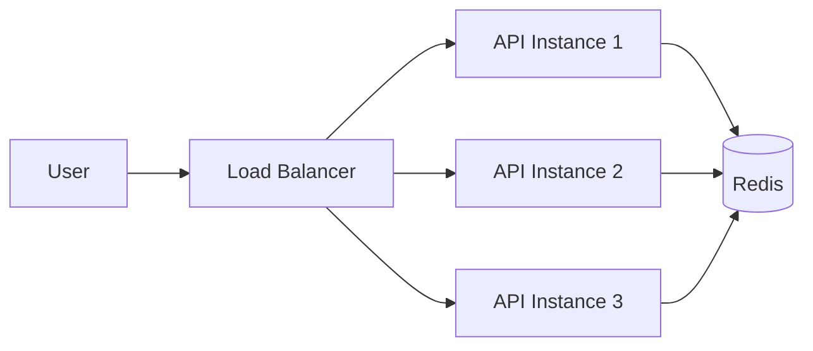

Without a shared store, each server may have different cache, session, or rate-limit information.

---

# 3. Use-Case Selection Map

| Requirement | Recommended Redis Feature |
|---|---|
| Cache a database result | String, Hash, or JSON with TTL |
| Store user sessions | Hash or JSON with TTL |
| Count API requests | String with `INCR` and `EXPIRE` |
| Build a sliding-window rate limiter | Sorted Set or Lua script |
| Maintain a leaderboard | Sorted Set |
| Store unique members | Set |
| Implement a simple queue | List |
| Build a reliable consumer queue | Stream with consumer groups |
| Broadcast live events | Pub/Sub |
| Store temporary tokens | String with TTL |
| Prevent duplicate processing | `SET NX` with TTL |
| Find nearby stores or drivers | Geospatial index |
| Store metrics over time | Time Series |
| Estimate unique visitors | HyperLogLog |
| Check probable membership | Bloom Filter |
| Perform semantic search | Vector search |
| Cache semantically similar LLM answers | Vector search plus TTL |

---

# 4. Application Caching

Caching is the most common Redis use case.

The application stores frequently accessed data in Redis so that future requests do not need to query the primary database.

## 4.1 Cache-Aside Flow

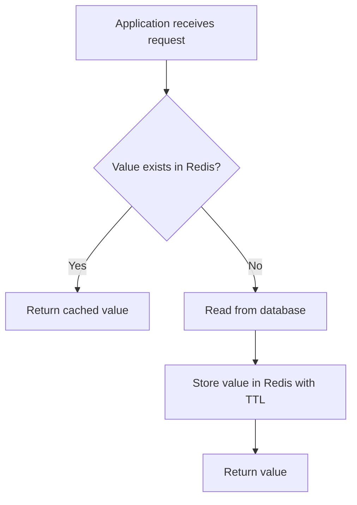

### Read Flow

1. Read from Redis.
2. On a cache hit, return the value.
3. On a cache miss, query the database.
4. Store the result in Redis.
5. Return the result.

### Write Flow

1. Update the database.
2. Delete or update the related Redis key.
3. Allow the next read to repopulate the cache.

## 4.2 Python Example

```python
import json
from typing import Any

from redis import Redis

redis_client = Redis(
    host="localhost",
    port=6379,
    decode_responses=True,
)

PRODUCT_TTL_SECONDS = 300


def get_product(product_id: int) -> dict[str, Any] | None:
    cache_key = f"product:{product_id}"

    cached_product = redis_client.get(cache_key)
    if cached_product is not None:
        return json.loads(cached_product)

    product = load_product_from_database(product_id)
    if product is None:
        return None

    redis_client.set(
        cache_key,
        json.dumps(product),
        ex=PRODUCT_TTL_SECONDS,
    )
    return product
```

## 4.3 Good Caching Candidates

Redis caching works well for:

- Product details
- User profiles
- Application configuration
- Pricing rules
- Permissions
- API responses
- Dashboard summaries
- Expensive computed results
- Frequently executed reports
- Third-party API responses

## 4.4 Poor Caching Candidates

Avoid caching data when:

- Every request returns different data
- The value changes continuously
- Strong read-after-write consistency is mandatory
- The result is rarely requested
- The object is too large compared with its access frequency
- Cache invalidation would be more complex than the original query

## 4.5 Negative Caching

A missing database record can also be cached for a short period.

```python
NOT_FOUND = "__not_found__"

value = redis_client.get(cache_key)

if value == NOT_FOUND:
    return None

if value is None:
    product = load_product_from_database(product_id)

    if product is None:
        redis_client.set(cache_key, NOT_FOUND, ex=30)
        return None
```

This prevents repeated database queries for invalid or nonexistent IDs.

## 4.6 Cache Stampede Protection

A cache stampede occurs when a popular key expires and many requests query the database at the same time.

```text
Popular key expires
        |
        v
100 requests miss the cache
        |
        v
100 database queries run together
```

Common protections:

- Add random jitter to TTL values
- Use a short Redis lock during regeneration
- Refresh popular keys before they expire
- Serve stale data while one worker refreshes it
- Request coalescing: allow only one database load per key

```python
import random

ttl = 300 + random.randint(0, 60)
redis_client.set(cache_key, value, ex=ttl)
```

---

# 5. Session Storage

HTTP is stateless. A backend must store information that identifies and describes the user's active session.

Redis can store:

- User ID
- Authentication context
- Tenant ID
- Selected language
- Cart ID
- Permissions
- Last activity time
- Temporary workflow state

## 5.1 Architecture

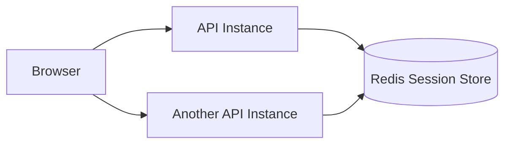

All backend instances read the same session data. Sticky sessions are not required.

## 5.2 Example Data Model

```text
Key: session:7dd92c
Type: Hash
TTL: 30 minutes

user_id      -> 1842
tenant_id    -> acme
role         -> admin
last_page    -> /billing
```

```python
session_key = f"session:{session_id}"

redis_client.hset(
    session_key,
    mapping={
        "user_id": "1842",
        "tenant_id": "acme",
        "role": "admin",
    },
)
redis_client.expire(session_key, 1800)
```

## 5.3 Sliding Session Expiration

The application can refresh the TTL after an authenticated request.

```python
redis_client.expire(session_key, 1800)
```

Active sessions remain alive, while inactive sessions expire automatically.

## 5.4 Important Security Rule

Store only a random session identifier in the browser cookie.

Do not expose the complete server-side session object to the client.

---

# 6. Rate Limiting

Rate limiting controls how many requests a user, IP address, API key, or tenant can make.

It protects:

- Public APIs
- Login endpoints
- OTP endpoints
- Expensive search operations
- Payment services
- Third-party APIs
- LLM APIs
- File-processing endpoints

## 6.1 Fixed-Window Counter

Example rule:

> Maximum 100 requests per user per minute.

```python
def is_allowed(user_id: int, limit: int = 100) -> bool:
    key = f"rate-limit:user:{user_id}:minute"

    request_count = redis_client.incr(key)

    if request_count == 1:
        redis_client.expire(key, 60)

    return request_count <= limit
```

## 6.2 Flow

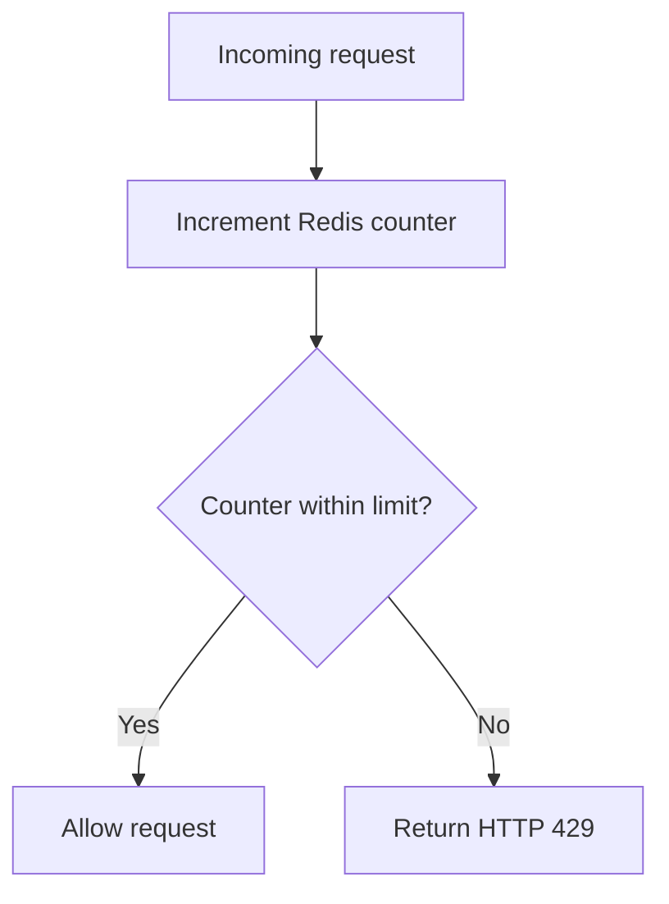

## 6.3 Rate-Limiting Algorithms

| Algorithm | Strength | Limitation |
|---|---|---|
| Fixed window | Simple and fast | Allows bursts near window boundaries |
| Sliding log | Accurate | Uses more memory |
| Sliding-window counter | Good balance | More implementation complexity |
| Token bucket | Supports controlled bursts | Requires careful atomic updates |
| Leaky bucket | Smooth request flow | May delay or reject bursts |

Use a Lua script or an appropriate atomic command when multiple Redis operations must behave as one operation.

---

# 7. Counters and Real-Time Analytics

Redis is excellent for counters that change frequently.

Examples:

- Page views
- Video likes
- Download counts
- Active users
- API usage
- Failed login attempts
- Number of jobs completed
- Number of unread notifications

## 7.1 Simple Counter

```python
redis_client.incr("page:home:views")
```

## 7.2 Hash-Based Counters

```python
redis_client.hincrby(
    "metrics:2026-07-30",
    "successful_payments",
    1,
)
```

## 7.3 Batched Persistence

For critical long-term analytics, Redis should not be the only data store.

A common design is:

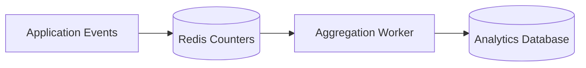

Redis handles high-frequency increments. A worker periodically writes aggregated results to a durable database.

---

# 8. Leaderboards and Ranking

Redis Sorted Sets store unique members ordered by a numeric score.

Common uses:

- Gaming leaderboards
- Sales rankings
- Most active users
- Popular products
- Contributor rankings
- Priority queues
- Trending content

## 8.1 Example

```python
leaderboard_key = "leaderboard:weekly"

redis_client.zadd(
    leaderboard_key,
    {
        "user:101": 920,
        "user:102": 870,
        "user:103": 995,
    },
)

redis_client.zincrby(leaderboard_key, 25, "user:102")
```

Get the top players:

```python
top_players = redis_client.zrevrange(
    leaderboard_key,
    0,
    9,
    withscores=True,
)
```

Get a user's rank:

```python
rank = redis_client.zrevrank(
    leaderboard_key,
    "user:102",
)
```

## 8.2 Why Sorted Sets Fit

Redis automatically maintains score order.

```text
Score     Member
--------------------
995       user:103
920       user:101
895       user:102
```

The application does not need to repeatedly sort the full dataset.

---

# 9. Background Job Queues

Redis is widely used as a broker or queue backend for background task systems.

Examples:

- Sending emails
- Generating reports
- Processing images
- Running OCR
- Importing spreadsheets
- Creating invoices
- Calling external APIs
- Processing webhook events

Popular Redis-backed task libraries include:

- Celery
- RQ
- BullMQ
- Sidekiq
- Dramatiq

## 9.1 Queue Architecture

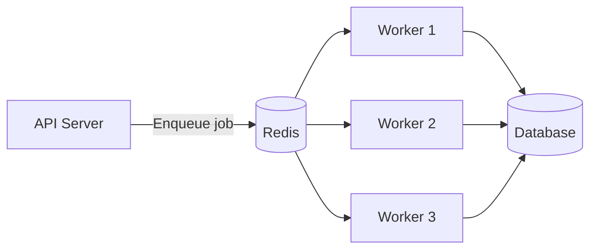

The API returns quickly while workers process jobs asynchronously.

## 9.2 Lists vs Streams

### Redis List

Use for a basic queue.

```text
Producer: LPUSH jobs payload
Consumer: BRPOP jobs
```

### Redis Stream

Use when you need:

- Consumer groups
- Acknowledgements
- Retry handling
- Pending-message tracking
- Event replay
- Retention control

For production-grade reliable processing, a mature task framework or Redis Streams is usually safer than building a custom List-based queue.

---

# 10. Pub/Sub Messaging

Redis Pub/Sub broadcasts a message from a publisher to all currently connected subscribers.

Typical uses:

- Live notifications
- Chat messages
- WebSocket updates
- Cache invalidation signals
- Real-time UI refresh
- Presence updates
- Internal event broadcasting

## 10.1 Flow

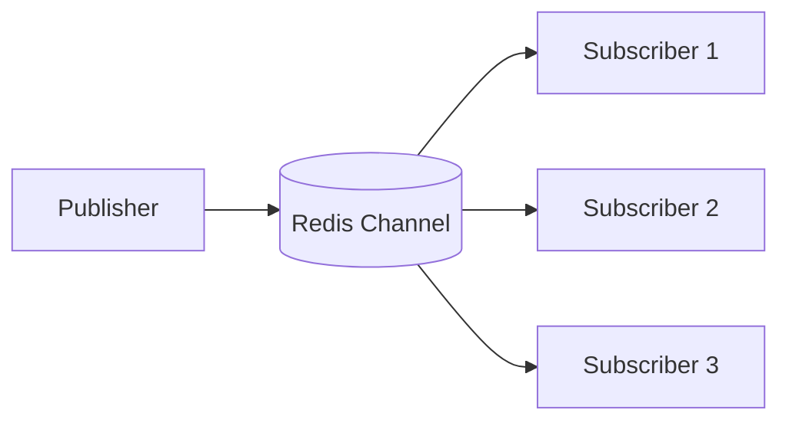

## 10.2 Commands

```text
SUBSCRIBE order-events
PUBLISH order-events '{"order_id": 501, "status": "paid"}'
```

## 10.3 Important Limitation

Pub/Sub does not persist message history.

If a subscriber is disconnected when a message is published, that subscriber misses the message.

Use Pub/Sub when:

- The message is temporary
- Only online consumers need it
- Replay is not required

Use Redis Streams when delivery tracking and replay are required.

---

# 11. Reliable Event Streaming

Redis Streams behave like append-only event logs.

Use Streams for:

- Order events
- Audit pipelines
- Telemetry
- Activity feeds
- Inter-service events
- Data synchronization
- Workflow processing
- Reliable consumer groups

## 11.1 Stream Flow

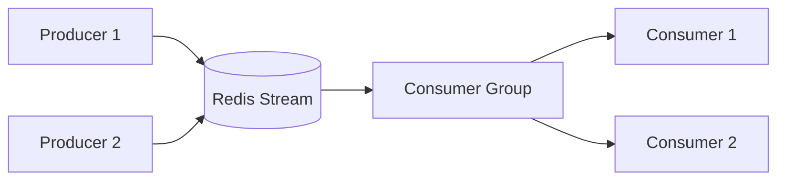

## 11.2 Basic Commands

Add an event:

```text
XADD orders * order_id 501 status created
```

Read events:

```text
XREAD COUNT 10 STREAMS orders 0
```

Create a consumer group:

```text
XGROUP CREATE orders order-workers 0 MKSTREAM
```

Acknowledge successful processing:

```text
XACK orders order-workers 1712345678901-0
```

## 11.3 Pub/Sub vs Streams

| Requirement | Pub/Sub | Streams |
|---|---:|---:|
| Broadcast to online subscribers | Yes | Possible |
| Persist messages | No | Yes |
| Replay old messages | No | Yes |
| Consumer groups | No | Yes |
| Acknowledgements | No | Yes |
| Pending-message recovery | No | Yes |
| Best for live temporary events | Yes | Sometimes |
| Best for reliable processing | No | Yes |

---

# 12. Temporary Data, OTPs, and Idempotency

Redis TTL and atomic writes make it suitable for short-lived state.

## 12.1 OTP Storage

```python
redis_client.set(
    f"otp:{phone_number}",
    otp_hash,
    ex=300,
)
```

The key automatically expires after five minutes.

Store an OTP hash rather than the plain OTP whenever practical.

## 12.2 Password-Reset Tokens

```python
redis_client.set(
    f"password-reset:{token}",
    str(user_id),
    ex=900,
)
```

## 12.3 Idempotency Keys

An idempotency key prevents the same operation from being processed twice.

Common examples:

- Payment requests
- Order creation
- Webhook processing
- Background jobs
- File imports

```python
def claim_idempotency_key(key: str) -> bool:
    return bool(
        redis_client.set(
            f"idempotency:{key}",
            "processing",
            nx=True,
            ex=3600,
        )
    )
```

`nx=True` means: set the key only when it does not already exist.

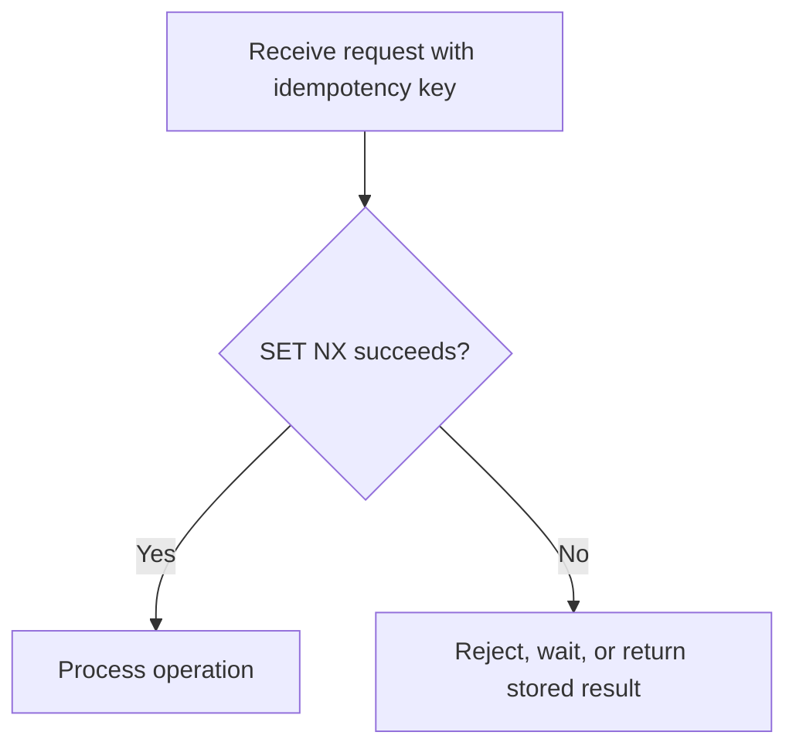

For payment-grade idempotency, also save the final operation status or response in a durable database.

---

# 13. Shopping Carts and Short-Lived State

Redis can store shopping-cart or multi-step workflow data that changes frequently.

Example cart hash:

```text
Key: cart:user:1842
Type: Hash

product:501 -> 2
product:712 -> 1
coupon      -> SUMMER10
```

```python
cart_key = f"cart:user:{user_id}"

redis_client.hincrby(cart_key, "product:501", 1)
redis_client.hset(cart_key, "coupon", "SUMMER10")
redis_client.expire(cart_key, 7 * 24 * 60 * 60)
```

Good use cases:

- Anonymous carts
- Checkout state
- Multi-step form progress
- Temporary document-processing state
- Recently viewed products
- Draft filters and preferences

For completed orders, copy the final data into the primary database.

---

# 14. Geospatial Search

Redis geospatial indexes store longitude and latitude and can search for nearby locations.

Common uses:

- Nearby stores
- Driver discovery
- Food-delivery agents
- Service centers
- Warehouses
- Location-based offers

## 14.1 Example

```text
GEOADD stores 72.8777 19.0760 store:mumbai-central
GEOADD stores 72.8562 19.0178 store:dadar
```

Find stores within five kilometres:

```text
GEOSEARCH stores
  FROMLONLAT 72.8777 19.0760
  BYRADIUS 5 km
  WITHDIST
```

## 14.2 Architecture

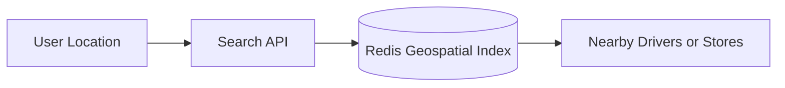

For complex geospatial filtering, full-text search, polygons, or advanced geospatial analysis, consider Redis Search or a dedicated geospatial database.

---

# 15. Time-Series Data and Dashboards

Redis Time Series stores timestamped numerical values.

Common uses:

- CPU and memory metrics
- IoT sensor readings
- Request latency
- Stock or market ticks
- Application error rates
- Business KPIs
- Real-time monitoring dashboards

## 15.1 Example Commands

```text
TS.CREATE api:latency:checkout RETENTION 86400000
TS.ADD api:latency:checkout * 142
```

Query one-hour averages:

```text
TS.RANGE api:latency:checkout - +
  AGGREGATION avg 3600000
```

Redis Time Series can support:

- Retention periods
- Aggregations
- Downsampling
- Labels
- Range queries
- Multiple related series

For long-term analytical storage, Redis can be combined with systems such as PostgreSQL, ClickHouse, Prometheus, or a cloud data warehouse.

---

# 16. Distributed Coordination and Locks

A distributed lock coordinates multiple application instances so that only one instance performs a protected operation at a time.

Examples:

- Generate one report
- Refresh one expensive cache key
- Run one scheduled reconciliation
- Prevent duplicate job execution
- Reserve a limited resource briefly

## 16.1 Basic Lock

```python
lock_key = "lock:report:monthly"

acquired = redis_client.set(
    lock_key,
    worker_id,
    nx=True,
    ex=30,
)

if acquired:
    try:
        generate_report()
    finally:
        # In production, delete only if the stored value still equals worker_id.
        release_lock_safely(lock_key, worker_id)
```

## 16.2 Safety Requirements

A Redis lock should include:

- A unique owner token
- A bounded TTL
- Atomic acquisition
- Ownership verification before release
- A strategy for operations that exceed the TTL

Do not use a simplistic lock for correctness-critical financial or inventory guarantees. Prefer database transactions, unique constraints, fencing tokens, or a coordination system when incorrect concurrent execution could cause serious damage.

---

# 17. Probabilistic Data Processing

Redis provides memory-efficient approximate data structures.

## 17.1 HyperLogLog

Estimates the number of unique values.

Example:

```text
PFADD visitors:2026-07-30 user:1 user:2 user:3
PFCOUNT visitors:2026-07-30
```

Use for:

- Approximate unique visitors
- Unique API clients
- Unique devices
- Campaign reach

## 17.2 Bloom Filter

Checks whether an item probably exists.

Use for:

- Avoiding unnecessary database lookups
- Duplicate-content detection
- Checking whether a username may already exist
- Filtering already-seen events

A Bloom filter can return false positives but not false negatives under normal operation.

## 17.3 Count-Min Sketch

Estimates event frequency.

Use for:

- Frequently searched terms
- Hot products
- Popular endpoints
- Abuse detection

## 17.4 Top-K

Estimates the most frequent items in a stream.

Use for:

- Trending searches
- Popular hashtags
- Most requested products
- Heavy-hitter detection

Approximate structures save substantial memory when exact results are not required.

---

# 18. Search, Recommendations, and AI Use Cases

Modern Redis versions support JSON documents, full-text search, vector search, and hybrid filtering.

## 18.1 Vector Search

Redis can store vector embeddings and search for similar items.

Common uses:

- Semantic search
- Retrieval-Augmented Generation, or RAG
- Similar-product search
- Document retrieval
- Image similarity
- Recommendation systems
- Duplicate-content detection

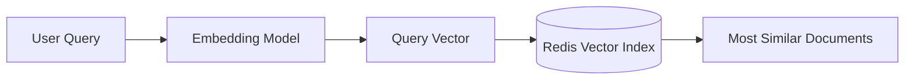

Redis vector search supports vector similarity combined with metadata filters such as:

- Tenant
- Category
- Price
- Language
- Security scope
- Document type

## 18.2 Semantic Cache

A normal cache matches exact keys.

A semantic cache can reuse a previous answer when a new question has a similar meaning.

```text
Original: "How can I reset my password?"
New:      "I forgot my password. What should I do?"
```

High-level flow:

1. Convert the incoming question into an embedding.
2. Search Redis for a sufficiently similar cached question.
3. Return the cached answer on a semantic hit.
4. Otherwise call the LLM.
5. Cache the new question, answer, embedding, and metadata.

Benefits:

- Lower LLM cost
- Faster response time
- Reduced duplicate model calls

Use strict tenant filters, similarity thresholds, TTLs, and knowledge-version metadata to avoid returning inappropriate or outdated answers.

## 18.3 Recommendation Engine

Redis can combine:

- Vector similarity
- Category filters
- Price filters
- Session activity
- Recently clicked items
- Real-time inventory state

This supports low-latency personalized recommendations.

## 18.4 Online Feature Store

Redis can serve precomputed machine-learning features during inference.

Examples:

```text
user:1842
  age_group              -> 25-34
  orders_last_30_days    -> 8
  average_order_value    -> 1480.50
  last_login_seconds_ago -> 24
  fraud_score            -> 0.13
```

The model server can fetch these features with a small number of low-latency Redis calls.

## 18.5 Agent Memory

Redis can support AI-agent state such as:

- Current conversation state
- Working memory
- Long-term semantic memories
- Tool execution history
- Ordered event logs
- User or tenant-scoped context

Memory isolation, expiration, authorization, and deletion policies are essential.

---

# 19. Choosing the Correct Redis Data Type

| Data Type | Best-Fit Use Cases |
|---|---|
| String | Cache values, tokens, counters, flags, locks |
| Hash | Sessions, user profiles, carts, object fields |
| List | Simple queues, recent items, stacks |
| Set | Unique values, memberships, tags, permissions |
| Sorted Set | Leaderboards, ranking, scheduling, sliding windows |
| Stream | Reliable events, consumer groups, processing pipelines |
| JSON | Nested application objects and document-style data |
| Geospatial | Nearby locations and radius searches |
| Time Series | Metrics, sensors, monitoring dashboards |
| HyperLogLog | Approximate unique counts |
| Bloom Filter | Probabilistic membership checks |
| Count-Min Sketch | Frequency estimation |
| Top-K | Approximate trending items |
| Vector Index | Semantic search, RAG, recommendations |

A strong Redis design starts with the access pattern, not the command.

Ask:

1. What is the key?
2. How is the value accessed?
3. Does the value expire?
4. Must updates be atomic?
5. Is exact accuracy required?
6. Must the data survive Redis failure?
7. How large can the value or collection become?

---

# 20. When Redis Is Not the Right Choice

Redis should not automatically become the primary store for every feature.

Avoid using Redis as the only system when you need:

## 20.1 Complex Relational Queries

Examples:

- Multi-table joins
- Complex reporting
- Relational integrity
- Ad hoc SQL analytics

A relational database is a better fit.

## 20.2 Unlimited Low-Cost Storage

Memory is more expensive than disk storage.

Large cold datasets usually belong in:

- PostgreSQL
- Object storage
- Data warehouses
- Search engines
- Analytical databases

## 20.3 Strong Durable Guarantees for Every Write

Redis supports persistence, replication, and high availability, but an in-memory architecture has different durability trade-offs from a transactional relational database.

Keep the primary source of truth in a durable system when data loss is unacceptable.

## 20.4 Large Objects

Very large values can cause:

- Network latency
- Blocking or CPU pressure
- High memory usage
- Slow serialization
- Uneven cluster distribution

Prefer smaller, purpose-specific keys.

## 20.5 Unbounded Collections

Lists, Sets, Sorted Sets, Streams, and JSON objects should have clear limits or retention strategies.

---

# 21. Production Best Practices

## 21.1 Use Clear Key Naming

```text
<environment>:<service>:<entity>:<identifier>
```

Examples:

```text
prod:catalog:product:501
prod:auth:session:7dd92c
prod:billing:idempotency:request-934
```

A simpler format is also valid:

```text
product:501
session:7dd92c
rate-limit:user:1842
```

Consistency matters more than the exact format.

## 21.2 Add TTLs to Temporary Data

Temporary data without TTL becomes permanent memory usage.

Always consider TTLs for:

- Cache entries
- Sessions
- Locks
- OTPs
- Idempotency keys
- Temporary workflow state
- Rate-limit counters

## 21.3 Avoid `KEYS` in Production

`KEYS` scans the complete keyspace and can block Redis on large datasets.

Use `SCAN` for incremental iteration.

## 21.4 Avoid Large or Hot Keys

A large key stores too much data.

A hot key receives disproportionate traffic.

Mitigations:

- Split data across keys
- Add local in-process caching where appropriate
- Replicate reads
- Precompute smaller views
- Use request coalescing
- Add controlled sharding

## 21.5 Use Pipelines

Pipelines reduce network round trips.

```python
pipeline = redis_client.pipeline()

for product_id in product_ids:
    pipeline.get(f"product:{product_id}")

products = pipeline.execute()
```

## 21.6 Use Transactions or Lua for Multi-Step Atomic Logic

A sequence of individually atomic commands is not automatically atomic as a group.

Use:

- `MULTI` / `EXEC`
- Optimistic locking with `WATCH`
- Lua scripts
- Purpose-built atomic Redis commands

## 21.7 Plan for Failure

Decide how the application behaves when Redis is unavailable.

For a noncritical cache:

```text
Redis failure -> Query database directly
```

For a session store or rate limiter, failure handling needs an explicit policy:

- Fail open
- Fail closed
- Use a local fallback
- Reject selected operations
- Degrade nonessential features

The choice depends on security and business impact.

## 21.8 Monitor Redis

Important metrics include:

- Memory usage
- Evicted keys
- Expired keys
- Cache hit rate
- Commands per second
- Connected clients
- Blocked clients
- Replication lag
- Slow commands
- Network throughput
- CPU usage
- Keyspace size
- Hot keys

## 21.9 Configure Memory and Eviction

Set an appropriate `maxmemory` and eviction policy.

Examples:

- `allkeys-lru`
- `allkeys-lfu`
- `volatile-lru`
- `volatile-ttl`
- `noeviction`

The correct policy depends on whether the Redis instance is a pure cache or also stores important non-cache data.

A common production practice is to separate critical state from disposable cache data into different Redis instances or logical deployments.

## 21.10 Secure Redis

Production Redis should include:

- Private networking
- TLS when required
- Authentication
- Least-privilege ACLs
- Restricted administrative commands
- Secret rotation
- No public internet exposure
- Backup and restore testing

---

# 22. Practical System Design Example

Consider an e-commerce backend.

## 22.1 Redis Responsibilities

| Requirement | Redis Design |
|---|---|
| Product caching | `product:{id}` with TTL |
| User session | `session:{id}` Hash with TTL |
| Cart | `cart:user:{id}` Hash |
| API rate limit | Counter or Sorted Set |
| Popular products | Sorted Set |
| Unique daily visitors | HyperLogLog |
| Order events | Stream |
| Live order updates | Pub/Sub |
| Payment idempotency | `SET NX` with TTL |
| Nearby warehouses | Geospatial index |
| Product recommendations | Vector search |

## 22.2 Architecture

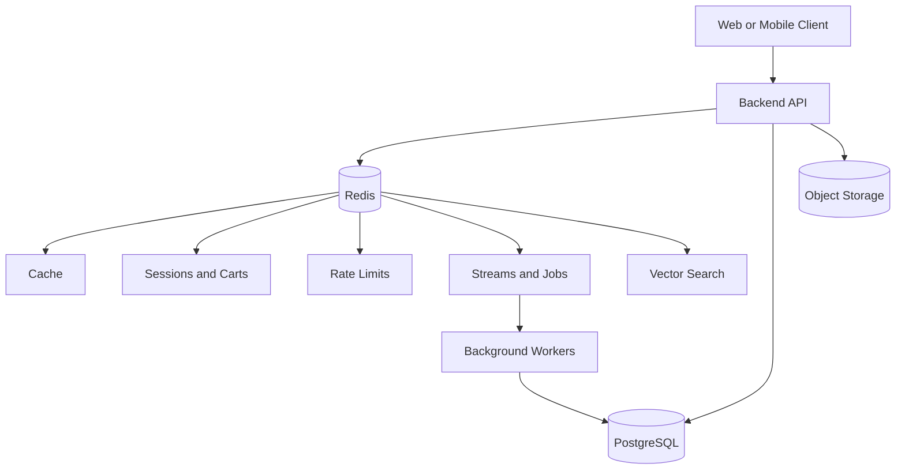

## 22.3 Request Example

Product detail request:

```text
1. Client requests GET /products/501
2. API checks product:501 in Redis
3. Cache hit: return immediately
4. Cache miss: query PostgreSQL
5. Store result in Redis for five minutes
6. Return product
```

Checkout request:

```text
1. Client sends an idempotency key
2. API claims the key with SET NX
3. API reads cart data from Redis
4. Database transaction creates the order
5. API writes an event to a Redis Stream
6. Worker processes email, invoice, and fulfilment tasks
7. Live status updates are published to connected clients
```

Redis is handling fast operational state. PostgreSQL remains the durable source of truth for products, customers, orders, and payments.

---

# 23. Key Takeaways

- Redis is more than a simple key-value cache.
- Caching, sessions, counters, rate limiting, and temporary state are its most common backend use cases.
- Sorted Sets are ideal for ranking and time-window algorithms.
- Pub/Sub is for live, non-durable broadcasting.
- Streams are for persistent events, replay, acknowledgements, and consumer groups.
- TTL is central to good Redis memory management.
- Redis should usually complement, not replace, the primary database.
- Atomic commands, Lua scripts, pipelines, and correct data-type selection are important for production-quality designs.
- Modern Redis also supports JSON, time series, search, vectors, semantic caching, recommendations, feature stores, and agent memory.
- Every Redis use case needs explicit decisions about durability, expiration, failure handling, memory, and consistency.

---

# 24. Official References

- [Redis documentation](https://redis.io/docs/latest/)
- [Redis use cases](https://redis.io/docs/latest/develop/use-cases/)
- [Redis data types](https://redis.io/docs/latest/develop/data-types/)
- [Cache-aside](https://redis.io/docs/latest/develop/use-cases/cache-aside/)
- [Session storage](https://redis.io/docs/latest/develop/use-cases/session-store/)
- [Rate limiting](https://redis.io/docs/latest/develop/use-cases/rate-limiter/)
- [Leaderboards](https://redis.io/docs/latest/develop/use-cases/leaderboard/)
- [Pub/Sub](https://redis.io/docs/latest/develop/use-cases/pub-sub/)
- [Redis Streams](https://redis.io/docs/latest/develop/use-cases/streaming/)
- [Geospatial indexes](https://redis.io/docs/latest/develop/data-types/geospatial/)
- [Time Series](https://redis.io/docs/latest/develop/data-types/timeseries/)
- [Vector search](https://redis.io/docs/latest/develop/ai/search-and-query/vectors/)
- [Semantic cache](https://redis.io/docs/latest/develop/use-cases/semantic-cache/)
- [Recommendation engine](https://redis.io/docs/latest/develop/use-cases/recommendation-engine/)
- [Feature store](https://redis.io/docs/latest/develop/use-cases/feature-store/)
- [Agent memory](https://redis.io/docs/latest/develop/use-cases/agent-memory/)
