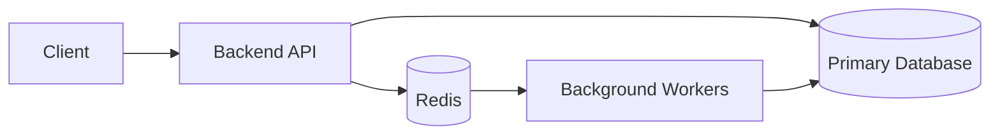
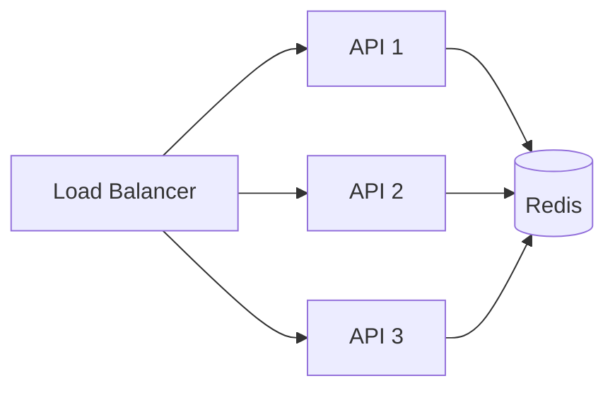
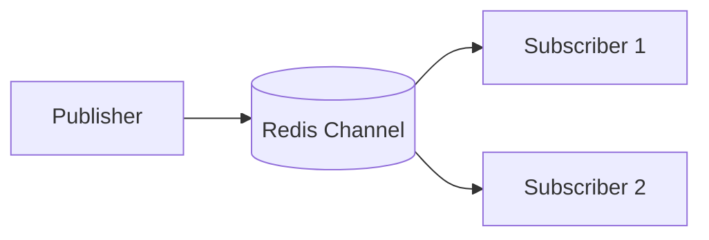
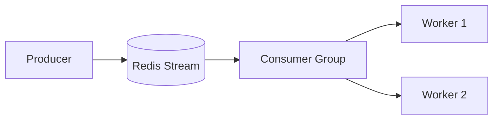
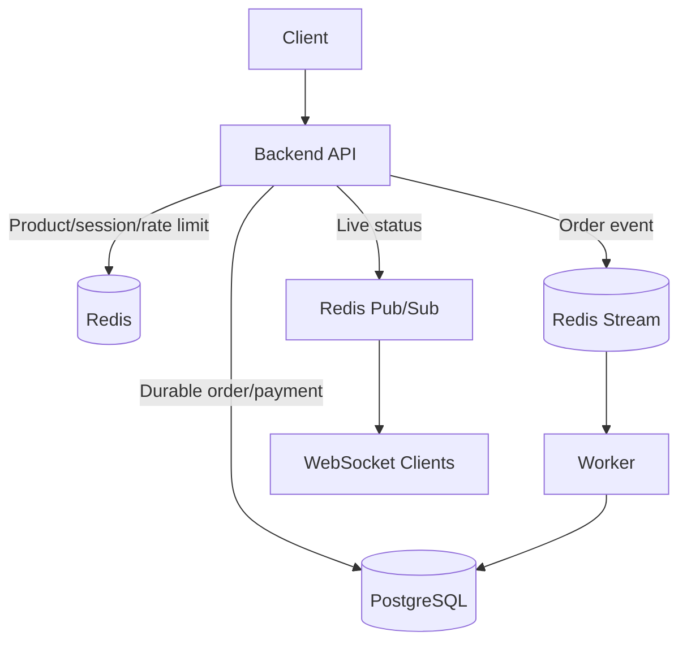

# Redis Use Cases

> Redis is most useful as a **fast shared state layer** beside the primary database. It is commonly used for caching, sessions, rate limiting, counters, leaderboards, temporary state, queues, and real-time events.
>
> **Version context:** Redis Open Source 8.8

## Index

1. [Redis in One Minute](#1-redis-in-one-minute)
2. [Why Redis Fits These Use Cases](#2-why-redis-fits-these-use-cases)
3. [Caching](#3-caching)
4. [Sessions and Temporary State](#4-sessions-and-temporary-state)
5. [Rate Limiting and Counters](#5-rate-limiting-and-counters)
6. [Leaderboards and Ranking](#6-leaderboards-and-ranking)
7. [Queues, Pub/Sub, and Streams](#7-queues-pubsub-and-streams)
8. [Idempotency and Distributed Coordination](#8-idempotency-and-distributed-coordination)
9. [Other Useful Redis Use Cases](#9-other-useful-redis-use-cases)
10. [Choosing the Right Redis Data Type](#10-choosing-the-right-redis-data-type)
11. [When Redis Is Not the Right Choice](#11-when-redis-is-not-the-right-choice)
12. [Production Best Practices](#12-production-best-practices)
13. [Practical System Design Example](#13-practical-system-design-example)

---

# 1. Redis in One Minute

Redis is an in-memory data store designed for very fast reads and writes. In normal backend development, it usually sits **between the application and slower or durable systems** such as PostgreSQL.

Typical responsibilities include:

- Cache frequently requested data.
- Store login sessions and short-lived workflow state.
- Share counters across multiple API instances.
- Enforce rate limits.
- Maintain leaderboards and rankings.
- Coordinate temporary locks and idempotency keys.
- Power queues, event streams, and live notifications.



The important design idea is:

**PostgreSQL or another durable database usually remains the source of truth. Redis holds fast operational state.**

---

# 2. Why Redis Fits These Use Cases

Most Redis use cases come from four capabilities.

## 2.1 In-Memory Speed

Redis keeps actively used data in memory, so accessing a small value is usually much faster than repeatedly querying a disk-backed database or remote service.

This is useful when the same data is requested frequently, such as product details, permissions, sessions, or dashboard counters.

## 2.2 Atomic Commands

Many Redis operations are atomic. For example:

```text
INCR api:requests:user:42
ZINCRBY leaderboard 25 user:42
SET idempotency:abc processing NX EX 3600
```

Atomic operations avoid normal read-modify-write races for common counters and coordination tasks.

## 2.3 TTL-Based Expiration

A Redis key can expire automatically after a configured Time To Live (TTL).

Good TTL candidates include:

- Cache entries
- Sessions
- OTPs
- Password-reset tokens
- Rate-limit counters
- Idempotency keys
- Temporary locks

## 2.4 Shared State Across Instances

In a horizontally scaled backend, in-process memory belongs to only one server. Redis gives every application instance access to the same state.



This is why Redis is especially useful for sessions, distributed counters, rate limits, and coordination.

---

# 3. Caching

Caching is the most common Redis use case.

The usual pattern is **cache-aside**:

```text
Request
  -> Check Redis
      -> Hit: return cached value
      -> Miss: query database
               -> store result in Redis with TTL
               -> return result
```

Good caching candidates:

- Product or catalog details
- User profiles
- Permissions
- Configuration
- Expensive computed results
- Third-party API responses
- Dashboard summaries

Avoid caching data when it changes continuously, is rarely requested, is very large, or requires strict read-after-write consistency.

A cache entry should normally have a TTL so stale or forgotten data does not stay in memory forever.

---

# 4. Sessions and Temporary State

Redis is a common server-side session store because every API instance can read the same session.

Example:

```text
Key: session:7dd92c
Type: Hash
TTL: 30 minutes

user_id   -> 1842
tenant_id -> acme
role      -> admin
```

```python
session_key = f"session:{session_id}"

redis_client.hset(
    session_key,
    mapping={
        "user_id": "1842",
        "tenant_id": "acme",
        "role": "admin",
    },
)
redis_client.expire(session_key, 1800)
```

The same idea works for:

- Anonymous shopping carts
- Multi-step form progress
- OTPs
- Password-reset tokens
- Recently viewed items
- Temporary processing state

For sessions, keep only a random session identifier in the browser cookie. Sensitive server-side session data should remain on the server.

---

# 5. Rate Limiting and Counters

Redis is well suited to rate limiting because the counter must be **shared across all application instances** and updates must be atomic.

Common targets include:

- Login attempts
- OTP generation
- Public APIs
- LLM endpoints
- Expensive search endpoints
- File-processing APIs

A classic fixed-window implementation uses `INCR` with expiry.

```text
Key: rate:user:42:minute
INCR key
EXPIRE key 60
```

Redis 8.8 also provides `INCREX`, which can increment a numeric key and manage expiration in one atomic operation. This makes window-counter style limits simpler when Redis 8.8 is available.

For more accurate sliding windows, a Sorted Set can store request timestamps:

```text
ZADD -> add current request timestamp
ZREMRANGEBYSCORE -> remove old timestamps
ZCARD -> count requests still inside the window
```

The same atomic-counter capability is also useful for page views, failed login attempts, unread counts, API usage, and lightweight real-time metrics.

---

# 6. Leaderboards and Ranking

Redis **Sorted Sets** are a natural fit for leaderboards because every member has a numeric score and Redis keeps members ordered automatically.

```python
redis_client.zadd(
    "leaderboard:weekly",
    {
        "user:101": 920,
        "user:102": 870,
        "user:103": 995,
    },
)

redis_client.zincrby("leaderboard:weekly", 25, "user:102")
```

Get the top 10:

```python
top_players = redis_client.zrevrange(
    "leaderboard:weekly",
    0,
    9,
    withscores=True,
)
```

Sorted Sets are also useful for:

- Sales rankings
- Trending content
- Priority scores
- Popular products
- Most active users

---

# 7. Queues, Pub/Sub, and Streams

Redis supports several messaging styles. Choosing the correct one is important.

## 7.1 Simple Queue

Lists can implement a basic producer-consumer queue.

```text
Producer -> LPUSH jobs payload
Worker   -> BRPOP jobs
```

This is simple, but a custom List-based queue does not provide the reliability features most production task systems need.

For normal application work, libraries such as Celery, RQ, BullMQ, Sidekiq, or Dramatiq are usually safer than building queue semantics manually.

## 7.2 Pub/Sub

Pub/Sub broadcasts messages to subscribers that are connected **right now**.

Good uses:

- Live UI updates
- WebSocket notifications
- Presence events
- Cache-invalidation signals



Pub/Sub uses at-most-once delivery. If a subscriber is disconnected when a message is published, that message is missed.

Use Pub/Sub only when losing an occasional message is acceptable.

## 7.3 Streams

Redis Streams are append-only event logs with persistent entries, consumer groups, pending-message tracking, and acknowledgements.

Use Streams when processing must be recoverable:

- Order events
- Background workflows
- Audit/event pipelines
- Data synchronization
- Reliable inter-service events



### Pub/Sub vs Streams

| Requirement | Pub/Sub | Streams |
|---|---:|---:|
| Live broadcast | Yes | Yes |
| Persist messages | No | Yes |
| Replay old messages | No | Yes |
| Consumer groups | No | Yes |
| Acknowledgements | No | Yes |
| Recover pending work | No | Yes |
| Best for temporary events | Yes | Sometimes |
| Best for reliable processing | No | Yes |

**Rule of thumb:** if a missed message matters, prefer Streams or a dedicated durable broker instead of Pub/Sub.

---

# 8. Idempotency and Distributed Coordination

Redis is useful for short-lived coordination because `SET` can combine **set-if-not-exists** and a TTL atomically.

## 8.1 Idempotency Key

```python
def claim_idempotency_key(key: str) -> bool:
    return bool(
        redis_client.set(
            f"idempotency:{key}",
            "processing",
            nx=True,
            ex=3600,
        )
    )
```

If two requests use the same idempotency key, only the first `SET ... NX` succeeds.

Common use cases:

- Payment requests
- Order creation
- Webhook processing
- File imports
- Duplicate background jobs

For payment-grade workflows, keep the final business result in a durable database as well.

## 8.2 Distributed Locks

A basic Redis lock follows the same idea:

```text
SET lock:report:monthly <unique-owner-token> NX EX 30
```

A safe lock needs:

- A unique owner token
- A bounded TTL
- Atomic acquisition
- Ownership verification before release
- A plan when work takes longer than the TTL

Do not rely on a simplistic Redis lock for correctness-critical financial or inventory guarantees. Database constraints, transactions, or fencing-token designs are safer when a concurrency error can corrupt business data.

---

# 9. Other Useful Redis Use Cases

These are useful, but less common than caching, sessions, rate limiting, and queues in everyday backend interviews.

| Use case | Redis feature |
|---|---|
| Nearby stores or drivers | Geospatial indexes |
| Approximate unique visitors | HyperLogLog |
| Probable membership checks | Bloom filter |
| Real-time metrics | Time Series |
| JSON documents and search | Redis JSON/Search capabilities |
| Semantic or RAG retrieval | Vector search |
| Semantic LLM response cache | Vector search + metadata + TTL |

For AI applications, Redis can serve embeddings, semantic-cache entries, or low-latency online features. Use tenant filters, authorization, TTLs, and knowledge-version metadata so data is not mixed across users or returned after it becomes stale.

Redis 8.8 also introduces newer capabilities such as the Array data structure and additional stream/rate-limiting commands, but these are less important than the core patterns above for normal backend interview preparation.

---

# 10. Choosing the Right Redis Data Type

Start with the access pattern, not with a Redis command.

| Requirement | Typical Redis choice |
|---|---|
| Cache one value/object | String or JSON + TTL |
| Session or object fields | Hash + TTL |
| Unique members | Set |
| Ranking by score | Sorted Set |
| Sliding-window timestamps | Sorted Set |
| Simple queue | List |
| Reliable event processing | Stream |
| Temporary token | String + TTL |
| Idempotency/lock claim | `SET ... NX` + TTL |
| Shared numeric counter | `INCR`, `INCRBY`, or Redis 8.8 `INCREX` |

Before choosing Redis, ask:

1. Does the data need to expire?
2. Must updates be atomic?
3. Must every application instance see the same value?
4. Can the data be rebuilt if Redis loses it?
5. How large can the key or collection become?

---

# 11. When Redis Is Not the Right Choice

Redis should not automatically become the primary database.

Avoid using Redis as the only store when you need:

## 11.1 Complex Relational Queries

Joins, relational constraints, ad-hoc SQL analytics, and complex reporting belong in a relational or analytical database.

## 11.2 Large Cold Datasets

Memory is more expensive than disk. Large, rarely accessed data usually belongs in PostgreSQL, object storage, a search engine, or a warehouse.

## 11.3 Strong Durability for Every Write

Redis supports persistence and replication, but operational Redis state has different durability trade-offs from a transactional source-of-truth database.

If losing the latest write is unacceptable, commit the business state to a durable system before returning success.

## 11.4 Large or Unbounded Values

Avoid huge values and collections that grow forever. They increase memory usage, network cost, and operational risk.

---

# 12. Production Best Practices

Keep these rules in mind in real systems:

- **Use predictable key names:** for example, `prod:auth:session:7dd92c`.
- **Add TTLs to temporary data:** especially caches, sessions, locks, tokens, and counters.
- **Avoid `KEYS` in production:** prefer incremental `SCAN` when iteration is necessary.
- **Keep values small:** large values increase latency and memory pressure.
- **Watch for hot keys:** one extremely popular key can become a bottleneck.
- **Use pipelines:** reduce network round trips when sending many independent commands.
- **Use Lua or transactions for multi-command atomic logic:** individual atomic commands do not make an entire multi-step workflow atomic.
- **Define failure behavior:** decide whether the application fails open, fails closed, or falls back when Redis is unavailable.
- **Monitor memory and eviction:** especially used memory, evicted keys, hit rate, slow commands, client count, CPU, replication lag, and hot keys.
- **Separate disposable cache from critical Redis state:** one eviction policy should not decide the fate of both.
- **Secure Redis:** use private networking, authentication, ACLs, TLS where required, and avoid public exposure.

---

# 13. Practical System Design Example

Consider an e-commerce backend.

## 13.1 Redis Responsibilities

| Requirement | Redis design |
|---|---|
| Product details | `product:{id}` cache with TTL |
| User session | `session:{id}` Hash with TTL |
| Shopping cart | `cart:user:{id}` Hash |
| API rate limit | Counter or Sorted Set |
| Popular products | Sorted Set |
| Payment idempotency | `SET ... NX` with TTL |
| Order-processing events | Stream |
| Live order-status updates | Pub/Sub |

## 13.2 End-to-End Flow



A product request can use Redis as a cache:

```text
1. Client requests GET /products/501.
2. API checks product:501 in Redis.
3. Cache hit -> return immediately.
4. Cache miss -> query PostgreSQL.
5. Store the result in Redis with a TTL.
6. Return the product.
```

A checkout request uses Redis differently:

```text
1. Client sends an idempotency key.
2. API claims it with SET ... NX + TTL.
3. API reads short-lived cart/session state from Redis.
4. PostgreSQL transaction creates the durable order/payment state.
5. API appends an order event to a Redis Stream.
6. Workers process asynchronous work.
7. Pub/Sub can push temporary live updates to connected clients.
```

The pattern is consistent throughout the system:

**Redis handles fast, shared, operational state. The primary database owns durable business truth.**
