# Redis TTL and Eviction Policies (LRU, LFU)

> **Topic:** Caching with Redis  
> **Level:** Intermediate developer  
> **Focus:** Practical understanding of TTL, memory limits, LRU/LFU eviction, configuration, monitoring, and production usage  
> **Documentation baseline:** Redis 8.x documentation, reviewed in July 2026

---

# 1. Why TTL and Eviction Matter

Redis stores data primarily in memory. Memory is fast, but it is limited.

A production Redis cache must answer two different questions:

1. **How long should a cached value remain valid?**
2. **Which value should Redis remove when memory becomes full?**

Redis solves these with:

- **TTL**, which controls the lifetime of a key.
- **Eviction policy**, which controls memory-pressure removal.

Without TTL, stale cache entries may remain indefinitely.

Without a suitable eviction policy, Redis may reject writes when its configured memory limit is reached.

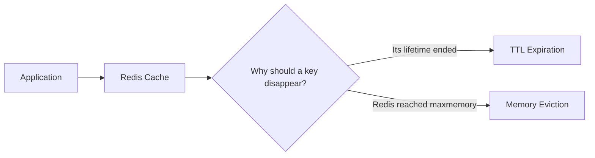

---

# 2. TTL vs Eviction

TTL and eviction both remove keys, but they solve different problems.

| Area | TTL / Expiration | Eviction |
|---|---|---|
| Main purpose | Prevent stale data from living forever | Keep Redis within its memory limit |
| Trigger | Expiration time is reached | Memory exceeds `maxmemory` |
| Configured per key | Yes | No |
| Configured at server level | Expiration processing is automatic | Yes, through `maxmemory-policy` |
| Requires memory pressure | No | Yes |
| Typical example | OTP expires after 5 minutes | Cold product cache is removed when RAM is full |
| Main commands/settings | `EXPIRE`, `SET EX`, `TTL`, `PERSIST` | `maxmemory`, `maxmemory-policy` |

## Mental Model

```text
TTL asks:

    "Is this key still valid?"

Eviction asks:

    "If memory is full, which key is least valuable?"
```

A key may therefore disappear in either of these ways:

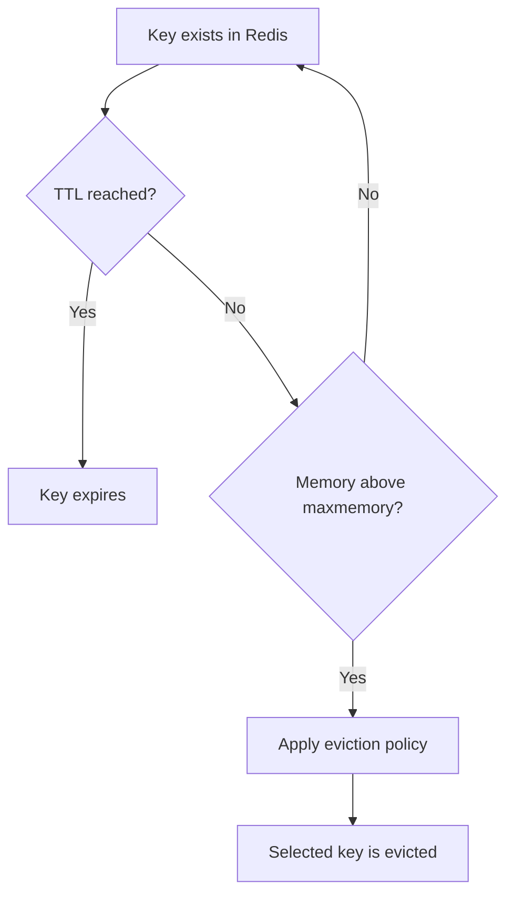

---

# 3. How Redis TTL Works

TTL means **Time To Live**.

It is the remaining time before Redis considers a key expired.

Example:

```bash
SET session:user:42 "active"
EXPIRE session:user:42 1800
```

The session will expire after 1,800 seconds, which is 30 minutes.

A more compact and usually preferred form is:

```bash
SET session:user:42 "active" EX 1800
```

This sets the value and expiration atomically in one command.

## Why Atomic TTL Assignment Matters

Consider this sequence:

```bash
SET session:user:42 "active"
EXPIRE session:user:42 1800
```

If the application crashes after `SET` but before `EXPIRE`, the key remains without a TTL.

This is safer:

```bash
SET session:user:42 "active" EX 1800
```

The value and TTL are applied together.

---

# 4. TTL Commands

## 4.1 Set Expiration in Seconds

```bash
EXPIRE key seconds
```

Example:

```bash
SET otp:user:1001 "483921"
EXPIRE otp:user:1001 300
```

The OTP expires after five minutes.

---

## 4.2 Set Expiration in Milliseconds

```bash
PEXPIRE key milliseconds
```

Example:

```bash
SET lock:payment:812 "worker-7"
PEXPIRE lock:payment:812 1500
```

The lock expires after 1.5 seconds.

---

## 4.3 Set Value with Expiration

### Seconds

```bash
SET key value EX seconds
```

### Milliseconds

```bash
SET key value PX milliseconds
```

Examples:

```bash
SET cache:product:501 '{"name":"Keyboard","price":2999}' EX 600
```

```bash
SET rate-limit:user:42 "1" PX 1000
```

---

## 4.4 Set an Absolute Expiration Time

Redis can expire a key at a specific Unix timestamp.

```bash
EXPIREAT key unix_timestamp_seconds
PEXPIREAT key unix_timestamp_milliseconds
```

The `SET` command also supports absolute expiration:

```bash
SET key value EXAT unix_timestamp_seconds
SET key value PXAT unix_timestamp_milliseconds
```

This is useful when many keys must expire at a known business deadline.

Example use cases:

- Promotion expires at midnight.
- Temporary access ends at a contract deadline.
- Daily counter resets at a fixed time.

---

## 4.5 Check Remaining TTL

### Seconds

```bash
TTL key
```

### Milliseconds

```bash
PTTL key
```

Possible `TTL` results:

| Result | Meaning |
|---:|---|
| Positive number | Remaining lifetime in seconds |
| `-1` | Key exists but has no expiration |
| `-2` | Key does not exist |

Example:

```bash
SET cache:user:42 "data" EX 120
TTL cache:user:42
```

Possible output:

```text
(integer) 118
```

---

## 4.6 Check the Absolute Expiration Timestamp

```bash
EXPIRETIME key
PEXPIRETIME key
```

These commands return the Unix timestamp at which the key will expire.

Use them when an application needs an absolute deadline instead of a remaining duration.

---

## 4.7 Remove a TTL

```bash
PERSIST key
```

Example:

```bash
SET config:feature-x "enabled" EX 3600
PERSIST config:feature-x
```

The key remains, but its expiration is removed.

---

## 4.8 Conditional Expiration

`EXPIRE`, `PEXPIRE`, `EXPIREAT`, and `PEXPIREAT` support conditions.

| Option | Meaning |
|---|---|
| `NX` | Set expiration only when the key currently has no expiration |
| `XX` | Set expiration only when the key already has an expiration |
| `GT` | Set expiration only when the new TTL is greater than the current TTL |
| `LT` | Set expiration only when the new TTL is less than the current TTL |

Examples:

```bash
EXPIRE session:user:42 1800 NX
```

Add an expiry only when one is not already present.

```bash
EXPIRE session:user:42 3600 GT
```

Extend the expiry only when the new expiry is longer.

```bash
EXPIRE otp:user:42 60 LT
```

Shorten the expiry only when the new expiry is smaller.

These options are useful for:

- Sliding sessions
- Distributed locks
- Rate-limit windows
- Safely extending or shortening deadlines

---

# 5. Important TTL Behaviors

## 5.1 Overwriting a Key Can Remove Its TTL

A normal `SET` replaces the old value and normally clears the existing TTL.

```bash
SET user:42 "old-value" EX 300
TTL user:42

SET user:42 "new-value"
TTL user:42
```

The second `TTL` returns `-1` because the new `SET` replaced the key without preserving its expiration.

Use `KEEPTTL` to retain the existing TTL:

```bash
SET user:42 "new-value" KEEPTTL
```

## 5.2 In-Place Updates Usually Preserve TTL

Commands that modify the existing data structure without replacing the key generally keep the TTL.

Examples include operations such as:

```bash
INCR page:view:home
HSET user:42 last_seen "2026-07-30T10:30:00Z"
LPUSH queue:emails "job-501"
```

The important distinction is:

```text
Replace/delete the key itself  -> TTL may be removed
Modify the value in place      -> TTL is generally preserved
```

Always verify behavior for the exact Redis command used by your application.

---

## 5.3 Renaming Transfers Expiration

When a key is renamed, its expiration is transferred to the new key name.

```bash
SET temp:user:42 "data" EX 600
RENAME temp:user:42 cache:user:42
TTL cache:user:42
```

The renamed key keeps the remaining TTL.

---

## 5.4 Expiration Uses Absolute Time

Redis stores expiration as an absolute timestamp.

This means time continues to pass even when Redis is stopped.

Example:

1. A key is set to expire at 10:30.
2. Redis is stopped at 10:25.
3. Redis restarts at 10:35.
4. The key is already expired.

System clock accuracy therefore matters.

Large clock changes between servers, containers, or virtual machines can cause unexpected expiration behavior.

---

## 5.5 TTL Applies to the Key

Traditionally, Redis expiration is attached to the key rather than an individual field inside a hash.

```text
user:42 -> entire hash has one TTL
```

Modern Redis versions also provide hash-field expiration commands, but ordinary `EXPIRE` and `TTL` still apply to the complete key.

For most caching designs, keeping one cached object per Redis key remains simple and predictable.

---

# 6. How Redis Expires Keys

Redis uses two complementary expiration approaches.

## 6.1 Passive Expiration

When a client accesses a key, Redis checks whether the key has expired.

If it has expired, Redis deletes it and behaves as though the key does not exist.

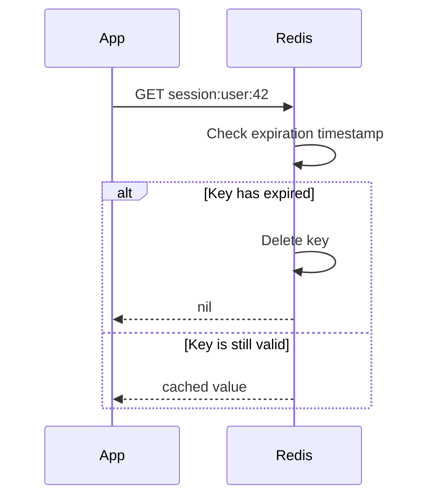

## 6.2 Active Expiration

Some expired keys may never be accessed again.

Redis therefore periodically samples keys that have expiration times and removes expired ones.

This avoids keeping all logically expired keys forever.

## Combined Behavior

```text
Passive expiration:
    Remove an expired key when it is accessed.

Active expiration:
    Periodically find and remove expired keys in the background.
```

Redis does not need to continuously scan every key, which would be expensive for a large dataset.

---

# 7. What Triggers Eviction

Eviction begins when Redis memory usage exceeds the configured `maxmemory` limit.

Example configuration:

```conf
maxmemory 2gb
maxmemory-policy allkeys-lru
```

Runtime configuration:

```bash
CONFIG SET maxmemory 2gb
CONFIG SET maxmemory-policy allkeys-lru
```

## Eviction Flow

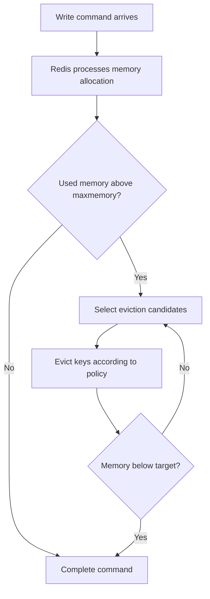

## Important Point

Eviction does not happen just because a key is old.

A key becomes an eviction candidate only when:

1. Redis has a memory limit.
2. Memory pressure crosses that limit.
3. The selected policy permits eviction.

If `maxmemory` is not configured, Redis can continue growing until the operating system or environment becomes the limiting factor.

---

## Memory Headroom

Do not configure `maxmemory` equal to all available machine RAM.

Redis may need additional memory for:

- Client connections
- Replication buffers
- AOF buffers
- Forking during persistence
- Temporary command allocations
- Memory fragmentation
- Operating system processes

Example:

```text
Machine memory:               8 GB
Redis maxmemory:              5.5-6 GB
Remaining system headroom:    2-2.5 GB
```

The exact value depends on persistence, replication, dataset shape, traffic, and deployment environment.

Use `INFO memory` and operating-system monitoring rather than relying only on a fixed percentage.

---

# 8. Redis Eviction Policies

Redis policies can be divided into three groups.

## 8.1 No Eviction

### `noeviction`

Redis does not automatically remove keys.

When memory is full, commands that require additional memory fail with an error. Read commands can continue to work.

```conf
maxmemory-policy noeviction
```

Suitable for:

- Data that must not be discarded automatically
- Redis used as a primary data store
- Workloads where the application must explicitly handle capacity failures

Usually not the best option for a disposable cache.

---

## 8.2 All-Keys Policies

These policies can evict any key.

| Policy | Behavior |
|---|---|
| `allkeys-lru` | Evict approximately least recently used keys |
| `allkeys-lfu` | Evict approximately least frequently used keys |
| `allkeys-random` | Evict random keys |
| `allkeys-lrm` | Evict approximately least recently modified keys in Redis versions that support LRM |

For a dedicated cache, `allkeys-lru` and `allkeys-lfu` are the most commonly useful choices.

---

## 8.3 Volatile Policies

These policies consider only keys that have an expiration.

| Policy | Behavior |
|---|---|
| `volatile-lru` | LRU among keys with a TTL |
| `volatile-lfu` | LFU among keys with a TTL |
| `volatile-random` | Random key among keys with a TTL |
| `volatile-ttl` | Key with the shortest remaining TTL |
| `volatile-lrm` | Least recently modified among keys with a TTL, where supported |

A key without a TTL is protected from these policies.

### Critical Behavior

When a volatile policy is configured but no eligible keys have TTLs, Redis behaves similarly to `noeviction` for additional memory-consuming writes.

```text
volatile-lru + no expiring keys
            =
no eligible key to evict
            =
write may fail at maxmemory
```

---

## Allkeys vs Volatile

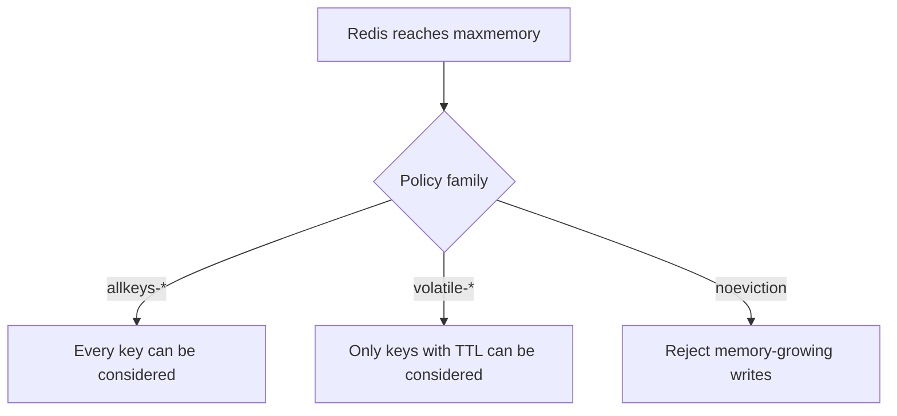

## Practical Recommendation

Use separate Redis deployments when possible:

```text
Redis instance A:
    Pure cache
    allkeys-lru or allkeys-lfu

Redis instance B:
    Sessions, queues, locks, durable operational data
    Different persistence and memory policy
```

Mixing disposable cache entries with critical non-evictable data creates difficult failure behavior.

---

# 9. LRU: Least Recently Used

LRU tries to remove keys that have not been accessed recently.

```text
Recent access = likely useful
Old access    = likely safe to remove
```

## Example Access Timeline

```text
Current time ---------------------------------------------------->

product:101    accessed 2 seconds ago
product:205    accessed 10 seconds ago
product:990    accessed 15 minutes ago
product:301    accessed 2 hours ago

Likely LRU candidate: product:301
```

## Suitable Workloads

LRU works well when recency predicts future access.

Examples:

- News feeds
- Recently viewed products
- User profile caches
- Search results
- API response caches
- Rapidly changing hot data

## Redis Uses Approximate LRU

Redis does not maintain one perfectly ordered global list of every key.

An exact implementation would require more CPU and memory.

Instead, Redis:

1. Samples a small number of keys.
2. Compares their idle/access information.
3. Evicts the best candidate from the sample.
4. Maintains an eviction candidate pool to improve results.


The number of sampled keys is controlled by:

```conf
maxmemory-samples 5
```

A larger sample can make eviction closer to true LRU, but increases CPU work.

Example:

```conf
maxmemory-samples 10
```

Use benchmarking before changing the default.

## Inspecting Idle Time

When the selected policy is not LFU-based, Redis can expose idle time:

```bash
OBJECT IDLETIME cache:product:501
```

Example result:

```text
(integer) 84
```

The key has been idle for approximately 84 seconds.

This command is useful for debugging and analysis, not for implementing your own full production eviction scanner.

---

# 10. LFU: Least Frequently Used

LFU tries to remove keys that are accessed less frequently.

```text
High access frequency = valuable
Low access frequency  = eviction candidate
```

## Example

| Key | Approximate access frequency |
|---|---|
| `product:popular` | 9500 |
| `category:phones` | 3100 |
| `product:average` | 120 |
| `product:rare` | 4 |

Likely LFU candidate: `product:rare`

## Suitable Workloads

LFU works well when a stable set of keys remains popular over time.

Examples:

- Popular product catalog entries
- Frequently accessed configuration
- Top articles
- Shared reference data
- Repeated API metadata
- Stable hot-key workloads

## Redis Uses Approximate LFU

Redis does not store an exact unlimited request count for every key.

It uses:

- A compact probabilistic logarithmic counter
- Sampling during eviction
- Counter decay over time

The frequency counter is intentionally approximate.

This provides a good balance between:

- Memory usage
- CPU cost
- Adaptation to changing access patterns
- Cache hit rate

---

## Why LFU Needs Decay

Assume a product was extremely popular last month but is no longer requested.

Without decay:

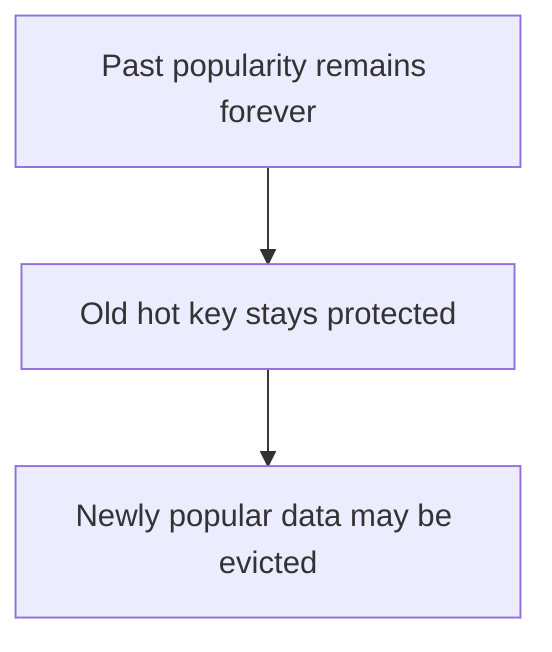

With decay:

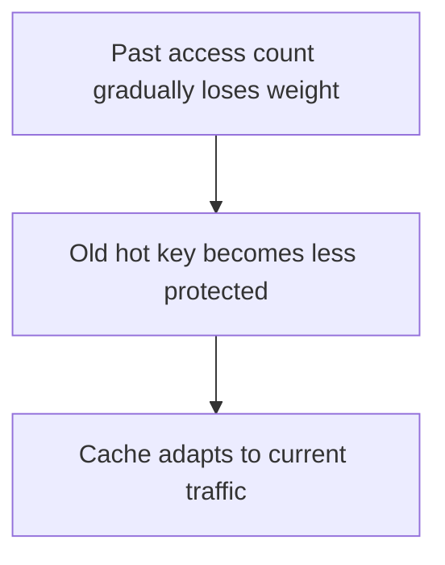

---

## LFU Configuration

```conf
lfu-log-factor 10
lfu-decay-time 1
```

### `lfu-log-factor`

Controls how quickly the probabilistic frequency counter grows.

General effect:

| Value Direction | Effect |
|---|---|
| Lower | Counter grows faster |
| Higher | More accesses are needed to increase the counter |

The default is generally appropriate unless load testing shows a reason to tune it.

### `lfu-decay-time`

Controls counter decay in minutes.

```conf
lfu-decay-time 1
```

This means Redis evaluates frequency aging using a one-minute decay interval.

General effect:

| Value Direction | Effect |
|---|---|
| Lower | Old popularity loses importance faster |
| Higher | Popular keys remain protected longer |

Choose based on how quickly your hot set changes.

---

## Inspecting Frequency

When an LFU policy is active:

```bash
OBJECT FREQ cache:product:501
```

Example:

```text
(integer) 17
```

This value is a logarithmic frequency counter, not an exact request count.

Do not interpret it as “the key was accessed exactly 17 times.”

---

# 11. LRU vs LFU

| Area | LRU | LFU |
|---|---|---|
| Full form | Least Recently Used | Least Frequently Used |
| Main signal | How recently a key was accessed | How often a key is accessed |
| Best for | Changing or recency-driven hot sets | Stable popularity-driven hot sets |
| Example | Latest search results | Most popular product records |
| Redis implementation | Approximate sampling | Approximate counter + sampling + decay |
| Main policy | `allkeys-lru` | `allkeys-lfu` |
| Volatile version | `volatile-lru` | `volatile-lfu` |
| Introspection | `OBJECT IDLETIME` | `OBJECT FREQ` |
| Tuning | `maxmemory-samples` | Samples, log factor, decay time |

## Scenario Comparison

Assume these keys exist:

| Key | Last Access | Total Recent Access Pattern |
|---|---:|---:|
| A | 1 second ago | Accessed once |
| B | 10 seconds ago | Accessed 10,000 times |
| C | 20 seconds ago | Accessed 500 times |
| D | 60 seconds ago | Accessed twice |

### LRU View

LRU mainly sees recency.

```text
D is the oldest recently used key.
D is a strong eviction candidate.
```

### LFU View

LFU mainly sees frequency after accounting for decay.

```text
A or D may have the lowest frequency.
B is strongly protected because it is frequently used.
```

## Simple Decision Rule

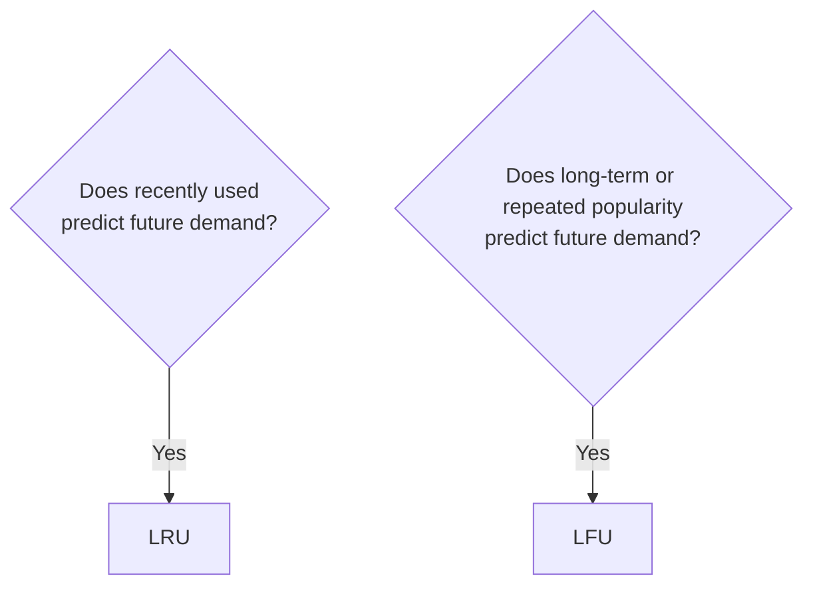

When uncertain, begin with `allkeys-lru`, observe hit rate and evictions, and compare against `allkeys-lfu` using production-like load tests.

---

# 12. Choosing the Right Policy

## Decision Flow

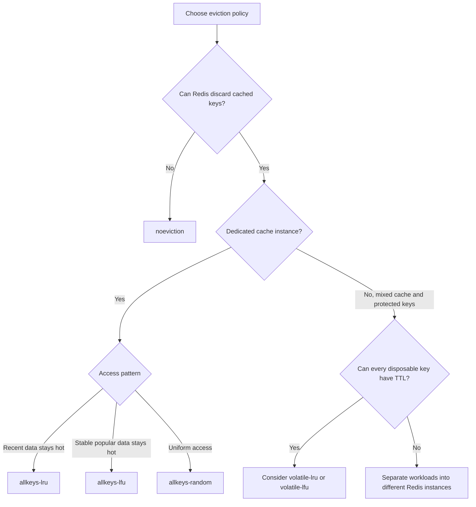

## Policy Guidance

### Use `allkeys-lru` When

- Redis is a dedicated cache.
- Recently accessed data is likely to be accessed again.
- The hot set changes regularly.
- You need a strong general-purpose default.

Typical examples:

- Search result cache
- User profile cache
- Timeline cache
- Recently requested API responses

---

### Use `allkeys-lfu` When

- Redis is a dedicated cache.
- Some keys are consistently more popular than others.
- Protecting heavily reused data improves hit rate.
- The hot set changes more slowly.

Typical examples:

- Popular products
- Frequently accessed categories
- Shared lookup tables
- Repeated public content

---

### Use `volatile-lru` or `volatile-lfu` When

- One Redis instance contains both expiring cache keys and non-expiring keys.
- Only expiring keys are allowed to be evicted.
- Every disposable key reliably receives a TTL.

Prefer separate Redis instances when operationally possible.

---

### Use `volatile-ttl` When

The application intentionally assigns shorter TTLs to less valuable entries.

Example:

```text
High-value cache: TTL 30 minutes
Medium-value cache: TTL 10 minutes
Low-value cache: TTL 1 minute
```

When memory fills, keys closest to expiration are preferred for eviction.

This policy works only when TTL values accurately represent business value.

---

### Use `allkeys-random` When

- Access is close to uniform.
- Maintaining recency/frequency does not provide much benefit.
- Simplicity is more useful than access-based selection.

This is less common for normal web application caches.

---

### Use `noeviction` When

- Automatic data loss is unacceptable.
- The application can handle out-of-memory write errors.
- Redis is not being treated as a disposable cache.

It requires careful capacity planning and alerting.

---

# 13. Configuration Examples

## 13.1 Dedicated General-Purpose Cache

```conf
maxmemory 2gb
maxmemory-policy allkeys-lru
maxmemory-samples 5
```

This is a practical starting point for many web application caches.

---

## 13.2 Stable Popularity Cache

```conf
maxmemory 2gb
maxmemory-policy allkeys-lfu
maxmemory-samples 5

lfu-log-factor 10
lfu-decay-time 1
```

Suitable when a relatively stable group of popular keys should remain cached.

---

## 13.3 Mixed Expiring and Protected Keys

```conf
maxmemory 2gb
maxmemory-policy volatile-lru
```

Only keys with expiration are eviction candidates.

This requires strict application discipline:

```text
Every disposable cache key must have a TTL.
```

---

## 13.4 Configure Redis at Runtime

```bash
redis-cli CONFIG SET maxmemory 2gb
redis-cli CONFIG SET maxmemory-policy allkeys-lru
redis-cli CONFIG SET maxmemory-samples 5
```

Check active values:

```bash
redis-cli CONFIG GET maxmemory
redis-cli CONFIG GET maxmemory-policy
redis-cli CONFIG GET maxmemory-samples
```

Runtime changes may not survive restart unless configuration is persisted appropriately.

For production, manage settings through:

- `redis.conf`
- Container configuration
- Helm values
- Cloud provider settings
- Infrastructure as Code

---

## 13.5 Docker Compose Example

```yaml
services:
  redis:
    image: redis:8
    command:
      - redis-server
      - --maxmemory
      - 512mb
      - --maxmemory-policy
      - allkeys-lru
      - --maxmemory-samples
      - "5"
    ports:
      - "6379:6379"
```

For production, also configure:

- Authentication and ACLs
- TLS where required
- Persistence according to the workload
- Health checks
- Resource limits
- Metrics and alerting
- Replication or managed high availability

---

# 14. Practical Python Example

The following example uses `redis-py`.

```bash
pip install redis
```

## 14.1 Cache-Aside with TTL

```python
from __future__ import annotations

import json
import random
from typing import Any

from redis import Redis
from redis.exceptions import RedisError


redis_client = Redis(
    host="localhost",
    port=6379,
    decode_responses=True,
    socket_connect_timeout=2,
    socket_timeout=2,
)


def load_product_from_database(product_id: int) -> dict[str, Any]:
    """Example database lookup."""
    return {
        "id": product_id,
        "name": "Mechanical Keyboard",
        "price": 2999,
    }


def get_product(product_id: int) -> dict[str, Any]:
    cache_key = f"cache:product:{product_id}"

    try:
        cached_value = redis_client.get(cache_key)

        if cached_value is not None:
            return json.loads(cached_value)
    except RedisError:
        # The database remains the source of truth.
        # Log this exception through the application's logging system.
        pass

    product = load_product_from_database(product_id)

    # Base TTL plus jitter prevents many keys from expiring together.
    ttl_seconds = 600 + random.randint(0, 60)

    try:
        redis_client.set(
            cache_key,
            json.dumps(product),
            ex=ttl_seconds,
        )
    except RedisError:
        # Cache failure should not necessarily fail the request.
        pass

    return product
```

## Request Flow

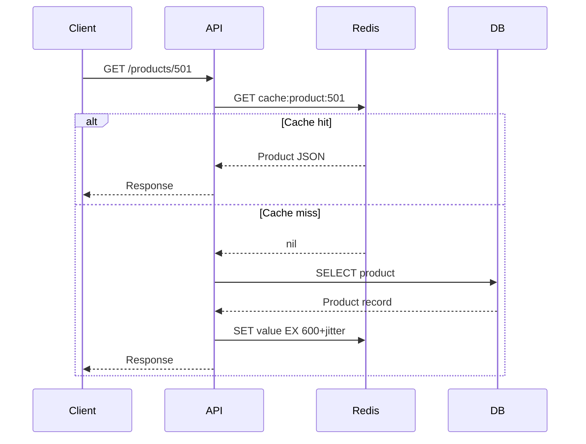

---

## 14.2 Sliding Session TTL

A sliding session refreshes the expiry when the user remains active.

```python
from redis import Redis

redis_client = Redis(decode_responses=True)

SESSION_TTL_SECONDS = 1800


def read_session(session_id: str) -> str | None:
    key = f"session:{session_id}"

    # Redis 6.2+ supports GETEX.
    # It reads the value and updates its TTL atomically.
    return redis_client.getex(
        key,
        ex=SESSION_TTL_SECONDS,
    )
```

Equivalent Redis command:

```bash
GETEX session:abc123 EX 1800
```

This avoids a race between separate `GET` and `EXPIRE` commands.

---

## 14.3 Safe Lock with Expiration

```python
import secrets
from redis import Redis

redis_client = Redis(decode_responses=True)


def acquire_lock(resource_id: str, ttl_ms: int = 5000) -> str | None:
    lock_key = f"lock:{resource_id}"
    token = secrets.token_urlsafe(24)

    acquired = redis_client.set(
        lock_key,
        token,
        nx=True,
        px=ttl_ms,
    )

    return token if acquired else None
```

Redis command:

```bash
SET lock:payment:812 random-token NX PX 5000
```

The TTL prevents a crashed worker from holding the lock forever.

Lock release should compare the token and delete atomically, normally with a Lua script or an appropriate client helper.

---

# 15. Monitoring TTL and Eviction

Configuration is only the starting point. Observe real workload behavior.

## 15.1 Memory Metrics

```bash
redis-cli INFO memory
```

Important fields include:

| Metric | Meaning |
|---|---|
| `used_memory` | Memory allocated by Redis |
| `used_memory_human` | Human-readable used memory |
| `used_memory_dataset` | Memory used by the dataset |
| `maxmemory` | Configured dataset memory limit |
| `maxmemory_policy` | Active eviction policy |
| `mem_fragmentation_ratio` | Relationship between process memory and Redis allocation |
| `mem_not_counted_for_evict` | Some buffer memory excluded from eviction comparison |

Do not diagnose memory only from one metric.

Compare:

- Redis allocator memory
- Dataset memory
- Process RSS
- Container memory
- Host memory
- Replication/persistence buffers
- Fragmentation

---

## 15.2 Eviction and Expiration Metrics

```bash
redis-cli INFO stats
```

Important fields:

| Metric | Meaning |
|---|---|
| `evicted_keys` | Keys removed due to memory pressure |
| `expired_keys` | Keys removed because their TTL elapsed |
| `keyspace_hits` | Successful key lookups |
| `keyspace_misses` | Failed key lookups |
| `current_eviction_exceeded_time` | Current time spent over the eviction threshold, where available |
| `total_eviction_exceeded_time` | Total time spent over the memory threshold |

## Hit Ratio

```text
hit_ratio = keyspace_hits / (keyspace_hits + keyspace_misses)
```

Example:

```text
keyspace_hits   = 900,000
keyspace_misses = 100,000

hit_ratio = 900,000 / 1,000,000
          = 0.90
          = 90%
```

Interpret hit ratio with context.

A low hit ratio may mean:

- TTL is too short.
- Cache capacity is too small.
- Eviction policy does not match access patterns.
- Cache keys have poor reuse.
- Invalidations happen too aggressively.
- The workload naturally has low repetition.

A very high hit ratio is useful only if cached data remains correct and sufficiently fresh.

---

## 15.3 Inspect TTL Distribution

For one key:

```bash
TTL cache:product:501
PTTL cache:product:501
```

For debugging a small controlled dataset:

```bash
SCAN 0 MATCH "cache:product:*" COUNT 100
```

Avoid using `KEYS *` in production on a large database because it scans the keyspace synchronously.

For fleet-wide TTL analysis, prefer:

- Redis Insight
- Metrics exporters
- Sampling scripts based on `SCAN`
- Managed-service observability
- Offline analysis of representative keys

---

## 15.4 Check Eviction Policy

```bash
CONFIG GET maxmemory-policy
CONFIG GET maxmemory
CONFIG GET maxmemory-samples
```

For LFU:

```bash
CONFIG GET lfu-log-factor
CONFIG GET lfu-decay-time
OBJECT FREQ cache:product:501
```

For non-LFU policies:

```bash
OBJECT IDLETIME cache:product:501
```

---

## 15.5 Useful Alert Conditions

Create alerts for patterns such as:

```text
used_memory near maxmemory
evicted_keys increasing rapidly
cache hit ratio dropping
memory fragmentation rising
write commands rejected
expired_keys unexpectedly high
latency increasing during eviction
replica lag increasing
host/container memory pressure
```

A single eviction is not necessarily a problem. In a cache, eviction is expected.

The key question is whether eviction causes:

- Poor hit rate
- Excess database load
- Increased response latency
- Request failures
- Repeated cache churn

---

# 16. Production Best Practices

## 16.1 Set TTL According to Data Freshness

Do not use one universal TTL for every type of data.

Example:

| Cached Data | Possible TTL |
|---|---:|
| Product description | 30–60 minutes |
| Product inventory | 5–30 seconds |
| User profile | 5–15 minutes |
| Static configuration | 1–24 hours |
| OTP | 2–10 minutes |
| API rate-limit window | Window duration |
| Distributed lock | Slightly longer than expected operation time |

TTL should reflect:

- How often source data changes
- How stale data is allowed to become
- Database load
- Rebuild cost
- Business risk

---

## 16.2 Add TTL Jitter

If thousands of keys are created together with the same TTL, they may expire together.

This can cause:

- Sudden cache misses
- Database traffic spike
- Higher latency
- Cache stampede

Instead of:

```text
TTL = 600 seconds for every key
```

Use:

```text
TTL = 600 + random(0, 60) seconds
```

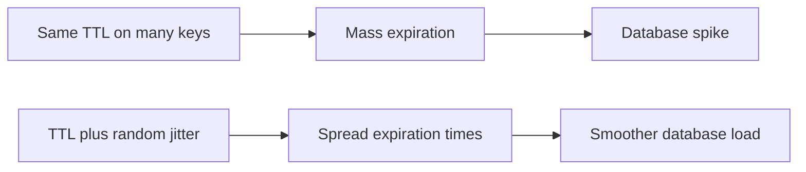

---

## 16.3 Use Atomic Commands

Prefer:

```bash
SET key value EX 600
```

over:

```bash
SET key value
EXPIRE key 600
```

Prefer:

```bash
GETEX key EX 1800
```

over:

```bash
GET key
EXPIRE key 1800
```

Atomic commands reduce race conditions and partial updates.

---

## 16.4 Do Not Rely on Eviction for Freshness

Eviction is driven by memory pressure, not business validity.

A stale key might stay in Redis for days if memory is available.

Use TTL or explicit invalidation for freshness.

```text
Freshness control -> TTL / invalidation
Memory control    -> eviction policy
```

---

## 16.5 Do Not Rely Only on TTL for Capacity

TTL does not guarantee Redis will remain below a safe memory level.

A sudden traffic burst can create millions of keys before their TTL expires.

Configure both:

```conf
maxmemory 2gb
maxmemory-policy allkeys-lru
```

and assign suitable TTLs in the application.

---

## 16.6 Separate Cache from Critical Data

Avoid mixing these in the same Redis instance:

```text
Disposable API cache
Critical job queue
Authentication sessions
Distributed locks
Durable counters
Pub/Sub or Streams workload
```

Different workloads need different:

- Eviction behavior
- Persistence
- Backup strategy
- Latency expectations
- Scaling strategy
- Failure handling

Separate instances reduce unintended data loss and simplify capacity planning.

---

## 16.7 Handle Cache Failure Gracefully

For cache-aside:

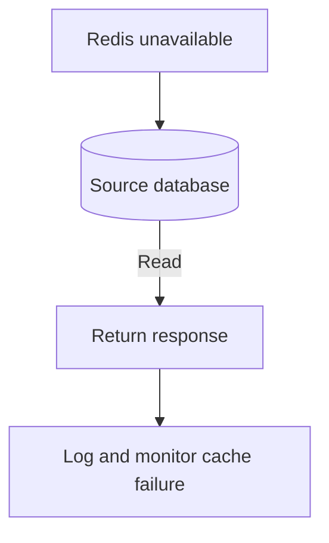

Do not let a non-critical cache become a mandatory dependency unless the business design intentionally requires it.

Also protect the database using:

- Timeouts
- Circuit breakers
- Request coalescing
- Rate limiting
- Stale-while-revalidate
- Cache warming
- Backpressure

---

## 16.8 Use Namespaced Keys

Examples:

```text
cache:product:501
cache:user-profile:42
session:abc123
lock:invoice:9901
rate-limit:user:42:2026073016
```

Benefits:

- Easier debugging
- Easier scanning
- Clear ownership
- Safer invalidation
- Better observability

---

## 16.9 Keep Cache Values Reasonably Sized

One very large value may cause:

- Temporary memory spikes
- Network latency
- Command latency
- More expensive eviction/repopulation
- Uneven cluster distribution

Measure real serialized size.

Possible strategies:

- Cache only fields needed by the endpoint.
- Split large objects where access patterns justify it.
- Compress only after benchmarking CPU versus memory.
- Avoid caching unbounded collections.
- Paginate cached results.

---

## 16.10 Test Policies with Realistic Traffic

LRU and LFU behavior depends on access distribution.

A synthetic test with uniform random access may not represent production.

Test using:

- Realistic hot-key distribution
- Production-like object sizes
- Burst traffic
- TTL distribution
- Cache warm-up
- Database latency
- Failover behavior
- Memory pressure

Compare:

```text
Hit ratio
P50/P95/P99 latency
Database query volume
Eviction rate
Memory fragmentation
CPU usage
Write rejection rate
```

---

# 17. End-to-End Example

Consider an e-commerce API that caches product details.

## Requirements

- Product details can be stale for up to 10 minutes.
- Popular products should stay cached.
- Redis is dedicated to caching.
- Redis must stay below 4 GB.
- Traffic follows a popularity pattern: a small percentage of products receive most requests.

## Recommended Setup

```conf
maxmemory 4gb
maxmemory-policy allkeys-lfu
maxmemory-samples 5
lfu-log-factor 10
lfu-decay-time 1
```

Application write:

```bash
SET cache:product:501 product-json EX 600
```

With jitter:

```text
TTL = 600 to 660 seconds
```

## Runtime Behavior

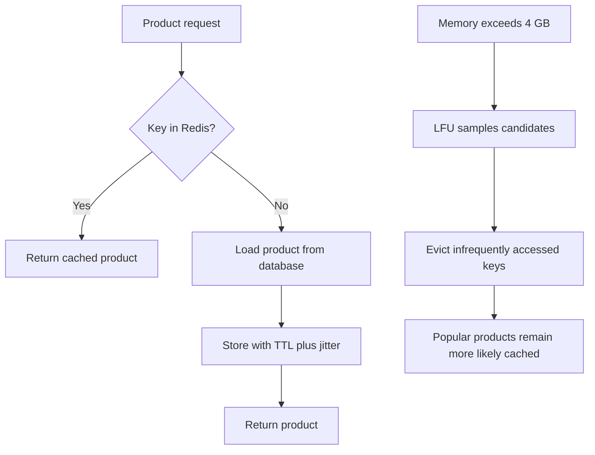

## Why LFU Fits

- Access is popularity-driven.
- Frequently accessed products are likely to remain popular.
- Rarely requested products are cheaper eviction candidates.
- TTL still limits staleness.
- `maxmemory` limits capacity.
- LFU decides what to sacrifice under pressure.

## Monitoring

```bash
INFO memory
INFO stats
CONFIG GET maxmemory-policy
OBJECT FREQ cache:product:501
TTL cache:product:501
```

Track:

- Cache hit ratio
- `evicted_keys`
- `expired_keys`
- Database product-query volume
- API P95 latency
- Redis memory usage

---

# 18. Quick Revision

## Core Formula

```text
TTL        = when a key becomes invalid
maxmemory  = how much cache memory Redis may use
policy     = which key Redis removes under memory pressure
```

## LRU

```text
Evict keys not used recently.
Best when recent access predicts future access.
```

## LFU

```text
Evict keys used less frequently.
Best when a stable popularity pattern exists.
```

## Allkeys

```text
Every key can be evicted.
Usually appropriate for a dedicated cache.
```

## Volatile

```text
Only keys with TTL can be evicted.
Requires every disposable key to have expiration.
```

## Recommended Starting Points

```text
General dedicated cache:
    allkeys-lru

Stable popularity-based cache:
    allkeys-lfu

Non-discardable data:
    noeviction, with strict capacity management

Mixed critical and disposable data:
    Prefer separate Redis instances
```

## Final Mental Model

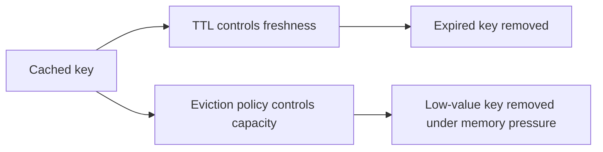

---

# 19. Official References

- [Redis Key Eviction](https://redis.io/docs/latest/develop/reference/eviction/)
- [Redis EXPIRE Command](https://redis.io/docs/latest/commands/expire/)
- [Redis TTL Command](https://redis.io/docs/latest/commands/ttl/)
- [Redis PTTL Command](https://redis.io/docs/latest/commands/pttl/)
- [Redis INFO Command](https://redis.io/docs/latest/commands/info/)
- [Redis OBJECT FREQ Command](https://redis.io/docs/latest/commands/object-freq/)
- [Redis OBJECT IDLETIME Command](https://redis.io/docs/latest/commands/object-idletime/)
- [Redis Keyspace and Expiration](https://redis.io/docs/latest/develop/use/keyspace/)

---

> **Key takeaway:** TTL protects data freshness. Eviction protects memory capacity. A reliable Redis cache normally needs both.
