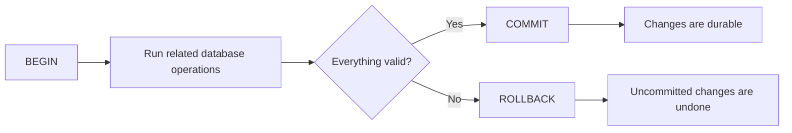
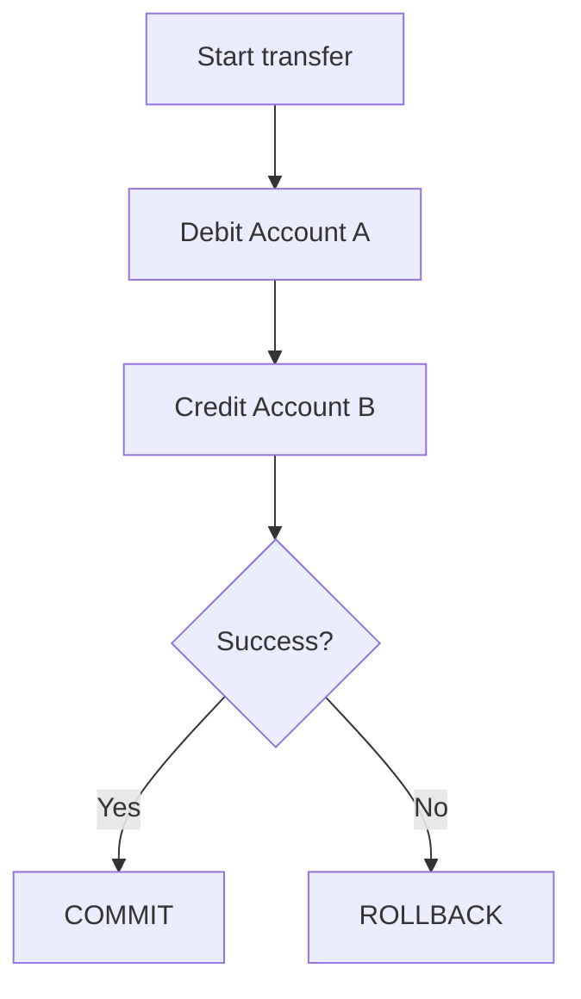
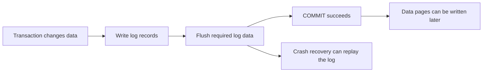
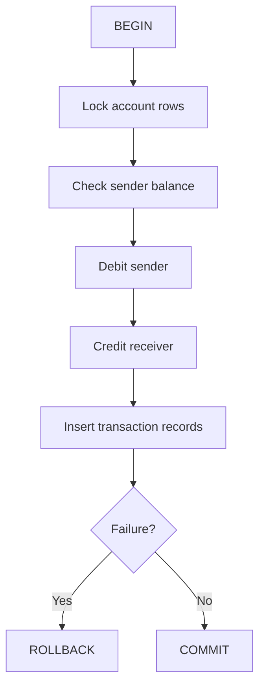
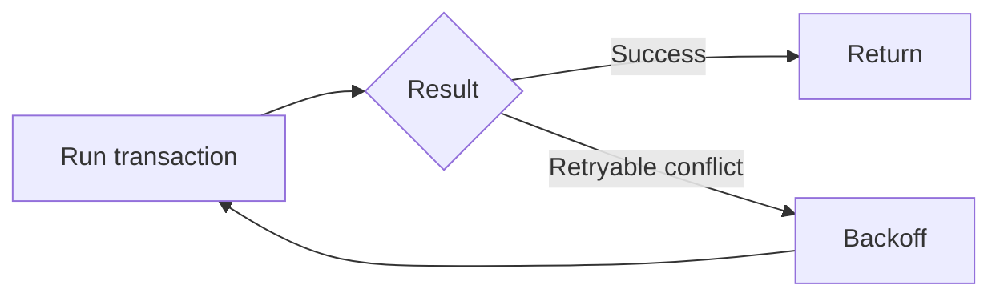

# ACID Properties in Databases

> ACID explains how a database keeps transactional data reliable when operations fail, multiple users work at the same time, or the database crashes.

## In Short

| Property | Meaning |
|---|---|
| **Atomicity** | All operations in a transaction succeed together, or all are rolled back. |
| **Consistency** | A successful transaction leaves the database in a valid state. |
| **Isolation** | Concurrent transactions should not incorrectly interfere with each other. |
| **Durability** | Once a transaction commits, its changes survive a crash or restart. |



A good practical rule is:

> **Put database operations that must succeed together inside one short transaction.**

---

# 1. Transactions: The Foundation of ACID

A **transaction** is one logical unit of database work.

```sql
BEGIN;

-- related INSERT / UPDATE / DELETE operations

COMMIT;
```

A transaction normally ends with:

- `COMMIT` — accept the transaction.
- `ROLLBACK` — cancel its uncommitted changes.

Many database systems treat a statement executed outside an explicit transaction as a single-statement transaction. That is convenient for independent operations, but it is not enough when several statements must succeed together.

### Example

These two updates belong to one business operation:

```sql
BEGIN;

UPDATE accounts
SET balance = balance - 100
WHERE id = 1;

UPDATE accounts
SET balance = balance + 100
WHERE id = 2;

COMMIT;
```

Running them as separate transactions could leave the data partially updated if the second operation fails.

---

# 2. Atomicity — All or Nothing

**Atomicity** means a transaction is treated as one unit.

For a ₹100 transfer:

```text
Account A: debit ₹100
Account B: credit ₹100
```

If crediting Account B fails, the debit from Account A must also be undone.



Application code usually follows this pattern:

```python
try:
    connection.begin()

    debit_account()
    credit_account()

    connection.commit()
except Exception:
    connection.rollback()
    raise
```

Frameworks such as Django, SQLAlchemy, and database drivers usually provide transaction helpers so this pattern does not need to be implemented manually each time.

### Savepoints

A **savepoint** lets you roll back part of a transaction without cancelling the entire transaction.

```sql
SAVEPOINT before_optional_step;

-- some work

ROLLBACK TO SAVEPOINT before_optional_step;
```

A savepoint is **not a commit**. The outer transaction is still active.

---

# 3. Consistency — Keep Data Valid

**Consistency** means a successful transaction moves the database from one valid state to another.

Validity is protected by rules such as:

- `PRIMARY KEY`
- `FOREIGN KEY`
- `UNIQUE`
- `NOT NULL`
- `CHECK`
- data types
- application-level business rules

### Example

A bank account should not have a negative balance:

```sql
CREATE TABLE accounts (
    id BIGINT PRIMARY KEY,
    balance DECIMAL(12, 2) NOT NULL
        CHECK (balance >= 0)
);
```

This update violates the rule:

```sql
UPDATE accounts
SET balance = -100
WHERE id = 1;
```

The database rejects it instead of storing invalid data.

### Database Rules vs Business Rules

Some rules belong naturally in the database:

```text
UNIQUE email
FOREIGN KEY relationships
NOT NULL required fields
CHECK balance >= 0
```

Other rules may require application logic:

```text
An order can become CONFIRMED only when:
payment succeeds
AND
inventory is reserved
```

The application defines the workflow, while database constraints provide a final integrity boundary.

> **ACID consistency is not the same as distributed-system consistency.**  
> Here, consistency means preserving constraints and invariants, not making every replica immediately return the same latest value.

---

# 4. Isolation — Safe Concurrent Transactions

**Isolation** controls how transactions behave when they run at the same time.

Consider two requests trying to withdraw money from the same account:

```text
Transaction A ── reads balance ── updates balance
Transaction B ── reads balance ── updates balance
```

Without proper concurrency control, both transactions could make decisions using stale data.

For read-modify-write operations, a common approach is a locking read:

```sql
BEGIN;

SELECT balance
FROM accounts
WHERE id = 1
FOR UPDATE;

-- validate and update the balance

COMMIT;
```

`FOR UPDATE` protects the selected row from conflicting updates until the transaction finishes.

Databases also provide multiple isolation levels to balance correctness and concurrency. The detailed anomalies and levels belong in [Transaction Isolation Levels](transaction-isolation-levels.md).

Optimistic and pessimistic concurrency strategies belong in [Optimistic vs Pessimistic Locking](locking-optimistic-pessimistic.md).

---

# 5. Durability — Committed Means Persistent

**Durability** means that after the database confirms a successful `COMMIT`, the committed change should survive a crash or restart.

Many relational databases achieve this using a **write-ahead log (WAL)** or **redo log**.



The important idea is:

> The database records enough recovery information before reporting the transaction as safely committed.

Durability can be affected by database flush settings, storage behavior, replication configuration, and infrastructure choices.

### Durability Is Not a Backup

Durability protects committed data from normal crash recovery scenarios. It does not replace:

- backups
- point-in-time recovery
- replication
- disaster recovery

A durable transaction can still be deleted later by a user or an application bug.

---

# 6. Complete Example: Safe Money Transfer

The same transfer can demonstrate all four ACID properties.

```sql
BEGIN;

-- Lock both rows in a predictable order
SELECT id, balance
FROM accounts
WHERE id IN (1, 2)
ORDER BY id
FOR UPDATE;

-- Debit only if enough balance exists
UPDATE accounts
SET balance = balance - 100
WHERE id = 1
  AND balance >= 100;

-- Application verifies that exactly one row was updated

UPDATE accounts
SET balance = balance + 100
WHERE id = 2;

INSERT INTO account_transactions (
    account_id,
    amount,
    transaction_type
)
VALUES
    (1, 100, 'DEBIT'),
    (2, 100, 'CREDIT');

COMMIT;
```

| Property | What It Protects |
|---|---|
| **Atomicity** | Debit, credit, and transaction records succeed together or roll back together. |
| **Consistency** | Constraints and business rules keep balances and relationships valid. |
| **Isolation** | Concurrent transfers cannot safely modify the same rows without coordination. |
| **Durability** | After commit, the transfer survives normal crash recovery. |



---

# 7. ACID in Real Applications

## 7.1 Keep Transactions Short

Inside a transaction:

- perform only the required database work
- avoid user interaction
- avoid slow external API calls
- lock resources in a predictable order
- commit or roll back as soon as possible

Long transactions increase lock waits, contention, deadlock risk, and retained row versions.

## 7.2 Prefer Atomic SQL Updates

Avoid this read-modify-write sequence:

```text
Read stock
Calculate stock - 1
Write stock
```

Prefer one conditional database operation:

```sql
UPDATE inventory
SET stock = stock - 1
WHERE product_id = 100
  AND stock > 0;
```

Then check the affected-row count.

This reduces the window for race conditions.

## 7.3 External APIs Are Outside the Database Transaction

A database rollback cannot undo a payment that an external payment provider has already accepted.

```text
Database transaction
    ├── Update order
    ├── Call payment API   ← external side effect
    └── ROLLBACK           ← cannot automatically undo payment
```

For workflows that cross database and service boundaries, common patterns include:

- transactional outbox
- idempotency keys
- retry with backoff
- idempotent consumers
- saga / compensating actions

HTTP idempotency is covered separately in [HTTP Idempotency and Methods](../api-design/idempotency-http-methods.md).

## 7.4 Retry Transaction-Level Conflicts

Deadlock detection or serializable isolation may abort a transaction to preserve correctness.

When the failure is retryable, retry the **whole transaction**, because earlier reads may no longer be valid.



---

# 8. Practical Mental Model

Use ACID when several database operations represent one business action:

```text
Business operation
       │
       ▼
BEGIN
       │
       ├── Validate invariants
       ├── Read / lock required rows
       ├── Apply related changes
       └── Write audit/history records
       │
       ▼
COMMIT or ROLLBACK
```

Remember ACID as:

```text
Atomicity   → all or nothing
Consistency → valid data
Isolation   → safe concurrency
Durability  → committed data survives
```

For normal backend development, the most important habits are:

1. Define the business operation that must succeed together.
2. Put its related database writes in one explicit transaction.
3. Enforce critical invariants with database constraints.
4. Use locking or optimistic concurrency for read-modify-write flows.
5. Keep transactions short.
6. Retry only failures that are safe to retry.
7. Do not assume a database rollback can undo external side effects.
