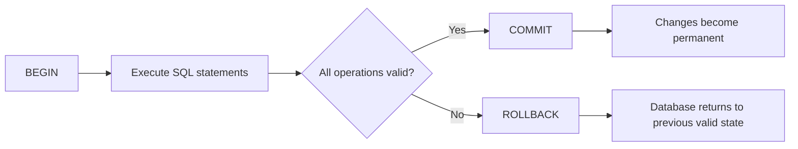
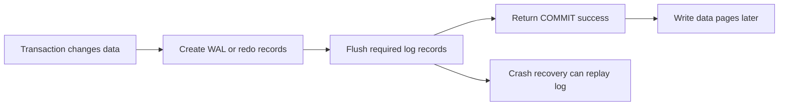
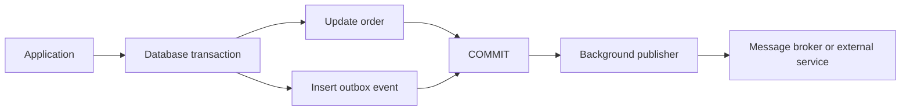

# ACID Properties in Databases

> **Topic:** Databases & SQL  
> **Level:** Intermediate developer  
> **Purpose:** Understand how relational databases keep transactional data correct during failures and concurrent access.

---

# 1. ACID at a Glance

**ACID** is a set of four properties that make database transactions reliable:

| Letter | Property | Simple Meaning |
|---|---|---|
| **A** | Atomicity | Either every operation succeeds, or none of them is applied |
| **C** | Consistency | A transaction must leave the database in a valid state |
| **I** | Isolation | Concurrent transactions should not incorrectly interfere |
| **D** | Durability | Committed data must survive crashes and restarts |

A useful mental model is:

```text
Atomicity   → Complete the whole unit of work or undo it
Consistency → Preserve business rules and database constraints
Isolation   → Control what concurrent transactions can observe
Durability  → Preserve committed results after failure
```

## Why ACID Matters

ACID is important when partial, invalid, conflicting, or lost data would cause a real problem.

Common examples include:

- Transferring money between accounts
- Creating an order and reducing inventory
- Booking the last available seat
- Recording an insurance claim
- Updating payroll
- Creating an invoice and its line items
- Reserving a unique username or email address

Without reliable transactions, an application could deduct money without crediting the receiver, sell the same item twice, or report success for data that disappears after a crash.

---

# 2. Transactions: The Foundation of ACID

A **transaction** is a logical unit of database work containing one or more operations.

```sql
BEGIN;

-- One or more related SQL statements

COMMIT;
```

The transaction has two normal outcomes:

- `COMMIT` makes its changes permanent.
- `ROLLBACK` cancels its uncommitted changes.

## Transaction Lifecycle



## Autocommit

Most database clients operate in **autocommit mode** by default. In that mode, each standalone statement acts like its own transaction.

```sql
UPDATE accounts
SET balance = balance - 100
WHERE id = 1;
```

Conceptually, the database processes it like this:

```sql
BEGIN;

UPDATE accounts
SET balance = balance - 100
WHERE id = 1;

COMMIT;
```

Autocommit is convenient for independent statements, but related operations must usually be grouped inside an explicit transaction.

---

# 3. Atomicity

## 3.1 Definition

**Atomicity means that a transaction is treated as one indivisible unit.**

Either:

- All operations complete successfully, or
- All operations are rolled back

The database must not keep only half of a transaction.

## 3.2 Example: Bank Transfer

Suppose $100 must be transferred from account `1` to account `2`.

Two changes are required:

1. Deduct $100 from account `1`
2. Add $100 to account `2`

```sql
BEGIN;

UPDATE accounts
SET balance = balance - 100
WHERE id = 1;

UPDATE accounts
SET balance = balance + 100
WHERE id = 2;

COMMIT;
```

If the second `UPDATE` fails, the first change must not remain.

```text
Without atomicity:

Account 1: -$100  ✓
Account 2: +$100  ✗
Result: Money is lost
```

```text
With atomicity:

Account 1: -$100  ✓
Account 2: +$100  ✗

Transaction rolls back

Account 1: unchanged
Account 2: unchanged
```

## 3.3 Rollback on Failure

Application code should explicitly roll back a failed transaction.

```python
try:
    connection.execute("BEGIN")

    connection.execute(
        "UPDATE accounts SET balance = balance - 100 WHERE id = 1"
    )
    connection.execute(
        "UPDATE accounts SET balance = balance + 100 WHERE id = 2"
    )

    connection.commit()
except Exception:
    connection.rollback()
    raise
```

Most frameworks provide transaction helpers that perform this pattern automatically.

## 3.4 Savepoints

A **savepoint** creates a rollback point inside a transaction.

```sql
BEGIN;

INSERT INTO orders (customer_id, status)
VALUES (10, 'PENDING');

SAVEPOINT order_created;

INSERT INTO order_items (order_id, product_id, quantity)
VALUES (501, 20, 2);

-- Undo only the work after the savepoint
ROLLBACK TO SAVEPOINT order_created;

COMMIT;
```

A savepoint does not commit data. It only allows part of the current transaction to be undone.

## 3.5 What Supports Atomicity

Databases commonly use:

- Transaction boundaries
- Undo information
- Rollback mechanisms
- Write-ahead or redo logging
- Crash-recovery procedures

---

# 4. Consistency

## 4.1 Definition

**Consistency means that a successful transaction moves the database from one valid state to another valid state.**

A valid state follows all required rules, including:

- Primary-key uniqueness
- Foreign-key relationships
- `NOT NULL` rules
- `CHECK` constraints
- Unique constraints
- Data types
- Business invariants

## 4.2 Example: Preventing Negative Balances

```sql
CREATE TABLE accounts (
    id BIGINT PRIMARY KEY,
    owner_name VARCHAR(100) NOT NULL,
    balance DECIMAL(12, 2) NOT NULL,
    CONSTRAINT balance_must_be_non_negative
        CHECK (balance >= 0)
);
```

This transaction violates the constraint:

```sql
UPDATE accounts
SET balance = -50
WHERE id = 1;
```

The database rejects the operation, so the table remains valid.

## 4.3 Example: Referential Integrity

```sql
CREATE TABLE customers (
    id BIGINT PRIMARY KEY,
    name VARCHAR(100) NOT NULL
);

CREATE TABLE orders (
    id BIGINT PRIMARY KEY,
    customer_id BIGINT NOT NULL,
    status VARCHAR(20) NOT NULL,
    CONSTRAINT fk_orders_customer
        FOREIGN KEY (customer_id)
        REFERENCES customers(id)
);
```

An order cannot reference a customer that does not exist.

## 4.4 Database Consistency vs Application Consistency

Not every business rule can be represented with a simple database constraint.

Consider this rule:

> A confirmed order is valid only when payment succeeds and sufficient stock is reserved.

Part of this rule may be enforced through SQL constraints, but the complete rule may require application logic.

```text
Application responsibilities
    ├── Validate workflow rules
    ├── Determine permitted state transitions
    └── Place related changes in one transaction

Database responsibilities
    ├── Enforce schema constraints
    ├── Maintain relationships
    ├── Control concurrency
    └── Reject invalid writes
```

The database and the application work together to preserve consistency.

## 4.5 Consistency Is Not the Same as “All Replicas Are Immediately Equal”

In ACID, **consistency** refers to preserving defined rules and invariants.

In distributed systems, the word **consistency** is also used to describe whether different replicas return the same latest value. That is related to distributed consistency models and should not be confused with the `C` in ACID.

---

# 5. Isolation

## 5.1 Definition

**Isolation controls how concurrent transactions see and affect one another.**

The ideal behavior is that concurrently executed transactions produce a result equivalent to some valid serial order.

```text
Concurrent execution:

Transaction A ────────┐
                      ├── Database
Transaction B ────────┘

Isolation should make the result behave as though:

A completed before B
        or
B completed before A
```

Complete serial execution is safe but can reduce concurrency. Databases therefore provide multiple isolation levels.

## 5.2 Common Concurrency Anomalies

### Dirty Read

Transaction B reads a change made by Transaction A before A commits.

```text
Transaction A                    Transaction B
-------------                    -------------
UPDATE balance = 500
                                SELECT balance → 500
ROLLBACK
```

Transaction B used a value that never became permanent.

---

### Non-Repeatable Read

A transaction reads the same row twice and receives different committed values.

```text
Transaction A                    Transaction B
-------------                    -------------
SELECT balance → 500
                                UPDATE balance = 400
                                COMMIT
SELECT balance → 400
```

The row changed between Transaction A's reads.

---

### Phantom Read

A transaction repeats a range query and sees additional or missing rows.

```text
Transaction A                    Transaction B
-------------                    -------------
SELECT COUNT(*)
FROM orders
WHERE status = 'NEW';
Result: 10
                                INSERT new matching order
                                COMMIT
Run same query
Result: 11
```

The second query returns a different set of rows.

---

### Lost Update

Two transactions read the same value, calculate a new value, and one update overwrites the other.

```text
Initial stock = 10

Transaction A reads 10
Transaction B reads 10

Transaction A writes 9
Transaction B writes 9

Expected stock = 8
Actual stock   = 9
```

A safer statement performs the update atomically:

```sql
UPDATE inventory
SET stock = stock - 1
WHERE product_id = 100
  AND stock > 0;
```

The application must then verify that exactly one row was updated.

## 5.3 Standard Isolation Levels

| Isolation Level | Dirty Reads | Non-Repeatable Reads | Phantom Reads | Relative Concurrency |
|---|---:|---:|---:|---|
| `READ UNCOMMITTED` | Possible | Possible | Possible | Highest |
| `READ COMMITTED` | Prevented | Possible | Possible | High |
| `REPEATABLE READ` | Prevented | Prevented | Standard permits possibility | Medium |
| `SERIALIZABLE` | Prevented | Prevented | Prevented | Lowest |

> Actual behavior differs across database engines. For example, PostgreSQL treats `READ UNCOMMITTED` as `READ COMMITTED`, and its `REPEATABLE READ` implementation prevents phantom reads but can still require transaction retries for serialization-related conflicts.

## 5.4 Setting an Isolation Level

PostgreSQL-style syntax:

```sql
BEGIN TRANSACTION ISOLATION LEVEL SERIALIZABLE;

-- Transaction statements

COMMIT;
```

Another common form is:

```sql
BEGIN;

SET TRANSACTION ISOLATION LEVEL REPEATABLE READ;

-- Transaction statements

COMMIT;
```

## 5.5 Choosing an Isolation Level

### Use `READ COMMITTED` when:

- Each statement may use the latest committed data
- Maximum throughput is important
- The application uses targeted locks or atomic updates where needed
- Occasional re-reading of changed data is acceptable

### Use `REPEATABLE READ` when:

- A transaction needs a stable view of data
- Reports or multi-step calculations must use a consistent snapshot
- The database engine's exact repeatable-read behavior is understood

### Use `SERIALIZABLE` when:

- Complex invariants must remain correct under concurrency
- Conflicting transactions are relatively uncommon
- The application can retry serialization failures

## 5.6 Row Locking

When a transaction must read a row and then make a decision based on it, a locking read may be appropriate.

```sql
BEGIN;

SELECT balance
FROM accounts
WHERE id = 1
FOR UPDATE;

UPDATE accounts
SET balance = balance - 100
WHERE id = 1;

COMMIT;
```

`FOR UPDATE` commonly locks the selected row against conflicting updates until the transaction ends.

## 5.7 Optimistic Concurrency Control

Another approach detects whether data changed before an update.

```sql
UPDATE documents
SET
    content = 'updated content',
    version = version + 1
WHERE id = 50
  AND version = 7;
```

If zero rows are updated, another transaction changed the document first. The application can reload the data and retry or report a conflict.

---

# 6. Durability

## 6.1 Definition

**Durability means that after a transaction commits successfully, its result must survive a database restart or system failure.**

```text
Transaction
    │
    ├── COMMIT acknowledged
    │
    └── Server crashes
             │
             └── Committed change is recovered
```

## 6.2 Write-Ahead Logging

Many relational databases use **write-ahead logging (WAL)** or a **redo log**.

The basic idea is:

1. Record the intended change in a durable log
2. Flush the required log data to stable storage
3. Acknowledge the commit
4. Write modified data pages later
5. Use the log during recovery if a crash occurs



This avoids forcing every modified table page to disk before each commit.

## 6.3 Durability Is Affected by Configuration

Durability is not only a SQL concept. It also depends on:

- Database flush settings
- Operating-system write behavior
- Storage-device caches
- Filesystem behavior
- Hardware reliability
- Cloud storage guarantees
- Replication configuration
- Backup and recovery strategy

Some database settings allow weaker disk-flush guarantees for higher throughput. Such settings may increase the amount of committed data that can be lost during a severe failure.

## 6.4 Durability Is Not the Same as Backup

A committed transaction may be durable against a process or server crash, but durability alone does not protect against:

- Accidental deletion
- Incorrect application logic
- Malicious data changes
- Database corruption beyond recovery capability
- Loss of the entire storage system
- Regional disasters

Backups, point-in-time recovery, and replication provide additional protection.

---

# 7. Complete ACID Example: Money Transfer

## 7.1 Schema

```sql
CREATE TABLE accounts (
    id BIGINT PRIMARY KEY,
    owner_name VARCHAR(100) NOT NULL,
    balance DECIMAL(12, 2) NOT NULL
        CHECK (balance >= 0)
);

CREATE TABLE account_transactions (
    id BIGINT PRIMARY KEY,
    account_id BIGINT NOT NULL,
    amount DECIMAL(12, 2) NOT NULL,
    transaction_type VARCHAR(10) NOT NULL
        CHECK (transaction_type IN ('DEBIT', 'CREDIT')),
    created_at TIMESTAMP NOT NULL DEFAULT CURRENT_TIMESTAMP,
    FOREIGN KEY (account_id) REFERENCES accounts(id)
);
```

## 7.2 Transfer Transaction

```sql
BEGIN;

-- Lock both account rows in a predictable order
SELECT id, balance
FROM accounts
WHERE id IN (1, 2)
ORDER BY id
FOR UPDATE;

-- Debit sender only when sufficient balance exists
UPDATE accounts
SET balance = balance - 100
WHERE id = 1
  AND balance >= 100;

-- Application verifies that exactly one row was updated

UPDATE accounts
SET balance = balance + 100
WHERE id = 2;

INSERT INTO account_transactions (
    id,
    account_id,
    amount,
    transaction_type
)
VALUES
    (1001, 1, 100, 'DEBIT'),
    (1002, 2, 100, 'CREDIT');

COMMIT;
```

## 7.3 How ACID Applies

| Property | Role in the Transfer |
|---|---|
| Atomicity | Debit, credit, and history records all succeed or all roll back |
| Consistency | Balances remain valid and transaction rows reference real accounts |
| Isolation | Concurrent transfers cannot incorrectly use or overwrite the same balance |
| Durability | After commit, the transfer survives a database crash |

## 7.4 Transaction Boundary Diagram

```text
BEGIN
  │
  ├── Lock account rows
  ├── Check sender balance
  ├── Debit sender
  ├── Credit receiver
  ├── Insert audit records
  │
  ├── Any failure? ── Yes ──> ROLLBACK
  │
  └── No
       │
       └── COMMIT
            │
            └── Transfer is permanent
```

---

# 8. How Databases Implement ACID

ACID is usually implemented through several mechanisms working together.

## 8.1 Transaction Manager

Tracks transaction state:

- Active
- Committed
- Aborted
- Waiting
- Conflicted

## 8.2 Undo Information

Allows uncommitted changes to be reversed or hidden.

Used for:

- Rollback
- Crash recovery
- Snapshot visibility in MVCC systems

## 8.3 WAL or Redo Log

Stores enough information to recover committed changes after a crash.

## 8.4 Locks

Protect resources from incompatible concurrent operations.

Common lock scopes include:

- Row
- Page
- Table
- Key or key range
- Advisory application-defined resource

## 8.5 Multi-Version Concurrency Control

**MVCC** keeps multiple logical row versions so readers and writers can work concurrently with less blocking.

Simplified view:

```text
Row versions:

Version 1: balance = 500   visible to older snapshot
Version 2: balance = 400   visible after newer commit
```

A transaction sees row versions according to its snapshot and isolation rules.

## 8.6 Constraints

Constraints reject writes that would create an invalid database state.

```text
PRIMARY KEY  → Entity must be uniquely identifiable
FOREIGN KEY  → Referenced entity must exist
UNIQUE       → Duplicate value is not allowed
NOT NULL     → Required value cannot be missing
CHECK        → Value must satisfy a condition
```

---

# 9. ACID in Real Application Architecture

## 9.1 Keep One Database Transaction Focused

A transaction should normally contain database operations that form one business unit.

```text
Good transaction scope:

Create order
    ├── Insert order
    ├── Insert order items
    ├── Reserve inventory
    └── Commit
```

Long transactions hold locks and old row versions for longer, increasing contention and cleanup work.

## 9.2 External APIs Are Not Automatically Part of the Transaction

This flow is unsafe:

```text
BEGIN database transaction
    ├── Update order
    ├── Call payment API
    ├── Call email API
    └── COMMIT
```

A normal database rollback cannot undo a payment already accepted by an external service.

## 9.3 Transactional Outbox Pattern

The **transactional outbox** pattern stores an event in the same database transaction as the business change.



Example:

```sql
BEGIN;

UPDATE orders
SET status = 'PAID'
WHERE id = 5001;

INSERT INTO outbox_events (
    event_type,
    aggregate_id,
    payload
)
VALUES (
    'ORDER_PAID',
    '5001',
    '{"order_id": 5001}'
);

COMMIT;
```

A separate process publishes pending outbox events. This prevents the database update and event creation from becoming inconsistent.

## 9.4 Idempotency

A retryable operation should avoid applying the same logical request twice.

```sql
CREATE TABLE payment_requests (
    idempotency_key VARCHAR(100) PRIMARY KEY,
    payment_id BIGINT NOT NULL,
    created_at TIMESTAMP NOT NULL DEFAULT CURRENT_TIMESTAMP
);
```

A unique idempotency key can ensure that repeated requests resolve to one recorded operation.

## 9.5 Distributed Transactions

A local ACID transaction protects one transactional database boundary. It does not automatically make a workflow across multiple databases and services atomic.

Common approaches include:

- Two-phase commit for tightly coordinated systems
- Saga pattern for multi-service workflows
- Transactional outbox for reliable event publication
- Idempotent consumers
- Compensating actions
- Retry with backoff

The correct choice depends on latency, failure handling, operational complexity, and consistency requirements.

---

# 10. Performance and Reliability Trade-offs

Stronger transactional guarantees can require more work.

| Mechanism | Reliability Benefit | Possible Cost |
|---|---|---|
| Higher isolation | Fewer concurrency anomalies | More waiting, conflicts, or retries |
| Synchronous log flush | Stronger commit durability | Higher commit latency |
| More indexes and constraints | Better integrity and validation | Slower writes |
| Row locks | Correct read-modify-write workflows | Lock waits and deadlocks |
| Replication acknowledgement | Better failure protection | Additional network latency |
| Long transactions | One large atomic unit | More contention and retained versions |

The goal is not to choose the strongest setting everywhere. The goal is to choose guarantees that match the business risk.

Example:

```text
Bank transfer
    → Strong consistency and durability are essential

Analytics event counter
    → Small delays or retry-based correction may be acceptable
```

---

# 11. Practical Development Guidelines

## 11.1 Define the Business Unit Before Writing SQL

Identify which operations must succeed together.

```text
Order placement unit:

1. Create order
2. Add order items
3. Reserve inventory
4. Record payment state
```

Operations in that unit should be placed in an appropriate transaction or coordinated workflow.

## 11.2 Put Critical Invariants in the Database

Use constraints for rules that must always hold.

```sql
ALTER TABLE users
ADD CONSTRAINT users_email_unique UNIQUE (email);
```

Application validation improves user experience, while database constraints protect integrity under concurrency and from every database client.

## 11.3 Prefer Atomic SQL Updates

Instead of:

```text
Read stock
Calculate stock - 1
Write new stock
```

Use:

```sql
UPDATE inventory
SET stock = stock - 1
WHERE product_id = 100
  AND stock > 0;
```

Then verify the affected-row count.

## 11.4 Keep Transactions Short

Inside a transaction:

- Perform required database work
- Avoid user interaction
- Avoid slow network calls where possible
- Access locked resources in a consistent order
- Commit or roll back promptly

## 11.5 Handle Retryable Failures

Serializable transactions and deadlock detection can abort one transaction to preserve correctness.

Application logic should be able to retry appropriate failures:

```text
Attempt transaction
    │
    ├── Success → Return result
    │
    └── Retryable conflict
            │
            ├── Back off briefly
            └── Retry entire transaction
```

The entire transaction must be retried because its earlier reads may no longer be valid.

## 11.6 Use Connection Pools Carefully

A pooled connection may retain session state, depending on the driver and pool configuration.

Ensure that:

- Failed transactions are rolled back
- Connections are returned in a clean state
- Isolation level changes are scoped correctly
- Transaction boundaries are explicit

## 11.7 Test Concurrency, Not Only Single Requests

Concurrency problems may not appear in normal unit tests.

Useful tests include:

- Two users purchasing the last item
- Multiple withdrawals from the same account
- Duplicate requests with the same idempotency key
- Serialization failure retry
- Deadlock handling
- Process crash around commit
- Outbox publisher restart

---

# 12. Quick Revision

## 12.1 One-Line Definitions

```text
Atomicity:
A transaction is all-or-nothing.

Consistency:
A transaction preserves defined data rules and invariants.

Isolation:
Concurrent transactions behave safely according to an isolation model.

Durability:
Committed results survive supported failures.
```

## 12.2 Complete Mental Model

```text
                    ACID TRANSACTION
                           │
        ┌──────────────────┼──────────────────┐
        │                  │                  │
   All or nothing     Valid state       Safe concurrency
     Atomicity        Consistency          Isolation
        │                  │                  │
        └──────────────────┼──────────────────┘
                           │
                Commit survives failure
                       Durability
```

## 12.3 Fast Comparison

| Property | Main Question |
|---|---|
| Atomicity | Did the entire unit succeed or get undone? |
| Consistency | Are all required rules still true? |
| Isolation | Can concurrent work produce an incorrect result? |
| Durability | Will committed data survive a failure? |

## 12.4 Final Example

For an order placement transaction:

```text
Atomicity
→ Order, items, and inventory reservation succeed together.

Consistency
→ Quantities, references, and state transitions remain valid.

Isolation
→ Two customers cannot incorrectly reserve the same final item.

Durability
→ A confirmed order remains stored after a restart.
```

---

# 13. Official References

The explanations in this guide were checked against current official database documentation in July 2026.

- PostgreSQL 18 — Concurrency Control:  
  <https://www.postgresql.org/docs/current/mvcc.html>

- PostgreSQL 18 — Transaction Isolation:  
  <https://www.postgresql.org/docs/current/transaction-iso.html>

- PostgreSQL 18 — `START TRANSACTION`:  
  <https://www.postgresql.org/docs/current/sql-start-transaction.html>

- MySQL Reference Manual — InnoDB and the ACID Model:  
  <https://dev.mysql.com/doc/refman/en/mysql-acid.html>

- SQLite — Transactional Behavior:  
  <https://www.sqlite.org/transactional.html>

---

> **Core takeaway:** ACID is not only about using `BEGIN` and `COMMIT`. Reliable transactional design also requires correct constraints, suitable isolation, safe concurrency handling, durable storage configuration, clear transaction boundaries, and retry-aware application logic.
