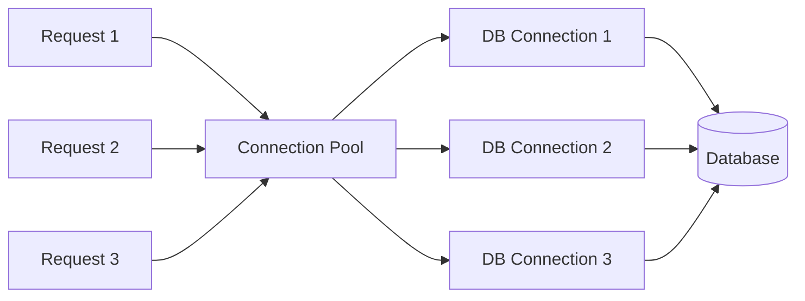
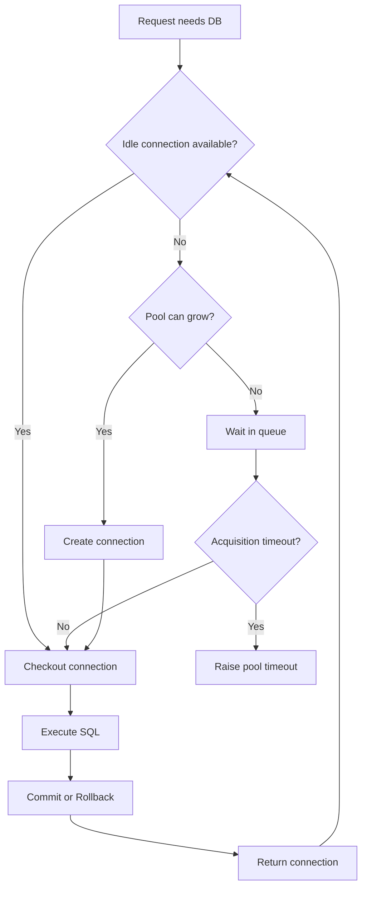
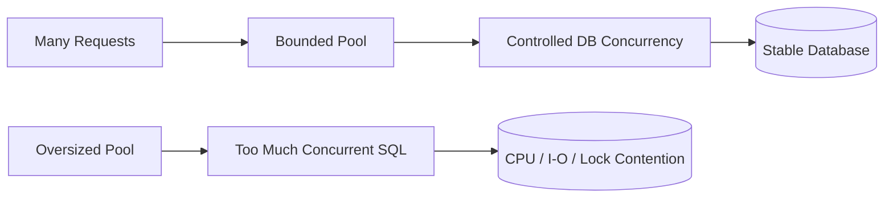
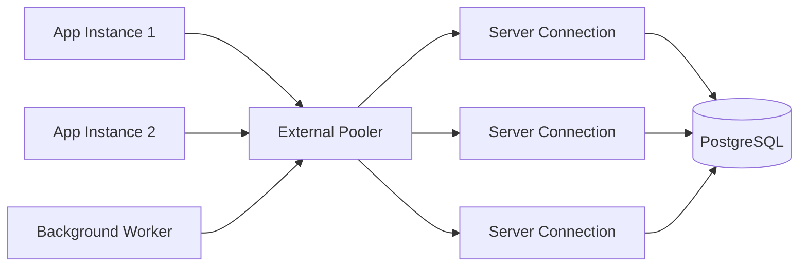

# Connection Pooling in Databases

> Connection pooling keeps a controlled set of database connections open and reuses them across requests. It reduces connection setup cost and, just as importantly, limits how much concurrent work can reach the database.

## In short

- A request **borrows** a connection, runs SQL, commits or rolls back, and **returns** the connection to the pool.
- Reusing connections avoids repeating TCP/TLS setup, authentication, and database-session initialization for every request.
- A bounded pool provides **backpressure**: when every connection is busy, new callers wait instead of creating unlimited database connections.
- Pool size is usually **per application process**, so deployment capacity must include every instance and worker.
- A larger pool is not automatically faster. Too much database concurrency can increase CPU pressure, I/O contention, locks, and query latency.
- Pool timeouts usually mean you should first investigate **slow queries, long transactions, lock waits, leaks, or excessive concurrency**.



---

# 1. What Is Connection Pooling?

A **connection pool** is a managed collection of reusable physical database connections.

Without pooling, each request may create and destroy its own connection:

```text
Request -> Connect -> Authenticate -> Execute SQL -> Close
```

With pooling:

```text
Request -> Borrow -> Execute SQL -> Return
                         |
                    Reused later
```

The important distinction is:

- **Physical connection:** the real network/database connection kept open by the pool.
- **Logical usage:** one request temporarily checks out that connection.

This lets many requests share a much smaller, controlled number of physical connections.

## 1.1 Why Opening Connections Is Expensive

Creating a new connection can involve:

1. DNS lookup.
2. TCP connection establishment.
3. TLS negotiation.
4. Authentication.
5. Database session allocation.
6. Driver/session initialization.
7. Network round trips.

A single connection may be cheap, but repeatedly creating connections under load increases latency and consumes database resources.

---

# 2. How a Pool Works

A normal checkout lifecycle looks like this:



Waiting when the pool is full is not automatically bad. It is often the mechanism that protects the database from excessive concurrency.

## 2.1 Important Pool Settings

| Setting | Meaning | Why it matters |
|---|---|---|
| `min_size` | Minimum ready connections | Reduces cold-start cost but keeps connections open |
| `pool_size` / `max_size` | Normal or maximum pool capacity | Main concurrency limit |
| `max_overflow` | Temporary connections above normal size | Handles bursts but still counts against DB limits |
| acquisition timeout | Maximum wait for a connection | Prevents requests waiting forever |
| idle timeout | Closes unused connections | Releases quiet-period capacity |
| max lifetime / recycle | Replaces old connections | Helps with stale or infrastructure-closed connections |
| health check / pre-ping | Validates a connection before use | Reduces stale-connection failures |
| reset on return | Cleans transaction/session state | Makes reused connections safe |

### Connection leak

A leak happens when code checks out a connection but never returns it. Prefer context managers or framework-managed sessions so cleanup happens even when an exception occurs.

---

# 3. Pool Size Is a Deployment-Level Decision

A common mistake is reading `pool_size = 10` and assuming the entire application can open only ten connections.

In a multi-process deployment, each process normally owns its own pool.

```text
Maximum application connections
    = instances
    × worker processes per instance
    × maximum connections per pool
```

For SQLAlchemy-style overflow:

```text
maximum connections per pool = pool_size + max_overflow
```

## 3.1 Example Capacity Calculation

Assume:

```text
4 application instances
2 workers per instance
pool_size = 5
max_overflow = 2
```

Then:

```text
Maximum per worker = 5 + 2 = 7
Deployment maximum = 4 × 2 × 7 = 56 connections
```

Those 56 connections must fit inside the database connection budget together with migrations, monitoring, background jobs, admin access, and other services.

## 3.2 Build a Connection Budget First

```text
Application budget
    = database connection limit
    - admin/emergency reserve
    - monitoring and maintenance
    - background jobs
    - other services
    - safety margin
```

The result is an **upper limit**, not the performance-optimal pool size.

## 3.3 Estimate the Concurrency You Actually Need

A useful first approximation is:

```text
Required concurrent connections
    ≈ DB operations per second
    × average connection-hold time in seconds
```

Example:

```text
200 DB operations/second
average hold time = 50 ms = 0.05 s

200 × 0.05 ≈ 10 concurrent connections
```

Use this as a starting point, then validate with realistic load tests and production metrics.

> **Interview point:** Pool size is based on **concurrent database work**, not total users.

---

# 4. Why a Bigger Pool Can Be Slower

A pool controls how many queries can reach the database at once.

When concurrency exceeds what the database can efficiently handle, extra connections can cause:

- CPU context switching.
- Memory pressure.
- Disk I/O contention.
- Lock contention.
- Cache disruption.
- Longer query latency.



A good pool behaves like a **controlled gateway**, not just a cache of connections.

---

# 5. Application Pool vs External Pooler

## 5.1 Application-Side Pooling

The pool lives inside the application process.

Common examples:

- SQLAlchemy `QueuePool` / async-compatible pool.
- Psycopg `ConnectionPool` / `AsyncConnectionPool`.
- HikariCP.
- Node.js `pg.Pool`.
- Django PostgreSQL pooling through Psycopg.

### Best fit

- Long-running services.
- Predictable instance counts.
- Applications where per-process connection budgets are easy to control.

## 5.2 External Pooling

An external pooler sits between applications and PostgreSQL.

Examples include **PgBouncer** and managed database proxies.



External pooling is especially useful when autoscaling or serverless workloads could otherwise create sudden connection storms.

## 5.3 PgBouncer Pooling Modes

| Mode | Server connection returned | Session state across transactions | Typical use |
|---|---|---|---|
| Session | When client disconnects | Yes | Maximum PostgreSQL compatibility |
| Transaction | After each transaction | No | Common for stateless web APIs |
| Statement | After each statement | No | Very restrictive; uncommon for normal apps |

With **transaction pooling**, do not assume session-level state remains attached to one PostgreSQL connection across transactions. Features such as session-level `SET`, session advisory locks, and some temporary-table patterns need special care.

Modern PgBouncer can support protocol-level prepared statements in transaction mode when configured appropriately, but this does **not** make arbitrary session state persistent.

---

# 6. Transactions and Connection Safety

The pool can safely reuse connections only when each request leaves them in a clean state.

## 6.1 Keep Transactions Short

Avoid holding a database transaction open while calling external services.

Bad flow:

```text
BEGIN
  -> Query DB
  -> Call payment API for 15 seconds
  -> Send email
COMMIT
```

Better flow:

```text
Call external dependency if possible
  -> BEGIN
  -> Perform required DB work
  -> COMMIT quickly
  -> Trigger follow-up work
```

Long transactions can hold locks, retain row versions, consume a pool connection, and create **idle in transaction** sessions.

## 6.2 Return Connections Reliably

Use framework-managed sessions, context managers, or `try/finally`.

```python
with pool.connection() as connection:
    connection.execute("SELECT ...")
```

The goal is always:

```text
Checkout -> Execute -> Commit/Rollback -> Return
```

## 6.3 Session State with Transaction Poolers

For transaction-local configuration, prefer transaction-scoped state when supported:

```sql
BEGIN;
SET LOCAL statement_timeout = '2s';
SELECT ...;
COMMIT;
```

`SET LOCAL` ends with the transaction, so it fits transaction-pooling designs better than persistent session settings.

---

# 7. Practical Example: FastAPI + SQLAlchemy Async

SQLAlchemy automatically uses an asyncio-compatible queue pool for `create_async_engine()`.

```python
import os

from fastapi import Depends, FastAPI
from sqlalchemy import text
from sqlalchemy.ext.asyncio import (
    AsyncSession,
    async_sessionmaker,
    create_async_engine,
)

DATABASE_URL = os.environ["DATABASE_URL"]

engine = create_async_engine(
    DATABASE_URL,
    pool_size=5,
    max_overflow=2,
    pool_timeout=5,
    pool_recycle=1800,
    pool_pre_ping=True,
)

SessionLocal = async_sessionmaker(
    engine,
    expire_on_commit=False,
)

app = FastAPI()


async def get_db():
    async with SessionLocal() as session:
        try:
            yield session
        except Exception:
            await session.rollback()
            raise


@app.get("/users/{user_id}")
async def get_user(
    user_id: int,
    session: AsyncSession = Depends(get_db),
):
    result = await session.execute(
        text("SELECT id, email FROM users WHERE id = :user_id"),
        {"user_id": user_id},
    )
    return result.mappings().one_or_none()
```

### What the configuration means

```text
pool_size=5
    Keep up to five normal pooled connections.

max_overflow=2
    Permit two extra connections during a burst.

pool_timeout=5
    Wait at most five seconds to acquire a connection.

pool_recycle=1800
    Recycle old connections on later checkout.

pool_pre_ping=True
    Check that a pooled connection is alive before using it.
```

Maximum simultaneous connections for this engine are approximately:

```text
5 + 2 = 7
```

If eight worker processes each create this engine, the deployment can potentially reach:

```text
8 × 7 = 56 connections
```

> Async code does **not** mean unlimited database concurrency. The pool should remain bounded.

### Django note

Current Django 6.0 PostgreSQL support can use Psycopg pooling through `DATABASES["default"]["OPTIONS"]["pool"]`. It requires Psycopg pool support (`psycopg[pool]` or `psycopg-pool`) and does not apply to `psycopg2`.

---

# 8. Monitoring and Diagnosis

Monitor both the **application pool** and the **database**.

## 8.1 Pool Metrics

Focus on:

- Checked-out connections.
- Idle connections.
- Waiting callers.
- Acquisition wait time.
- Acquisition timeouts.
- Connection hold duration.
- Connection creation/close rate.

## 8.2 Database Metrics

For PostgreSQL, watch:

- Active and total sessions.
- `idle in transaction` sessions.
- Long-running transactions.
- Lock waits.
- Query latency.
- CPU and disk I/O.

## 8.3 How to Read a Pool Timeout

A pool timeout means the caller could not obtain a connection quickly enough. Investigate in this order:

1. Are all connections checked out?
2. How long are they held?
3. Are queries slow?
4. Are transactions waiting on locks?
5. Is anything `idle in transaction`?
6. Is a connection leaking?
7. Did worker or replica counts recently increase?
8. Does the database still have spare CPU/I/O capacity?
9. Only then consider increasing the pool.

---

# 9. Production Best Practices

- Create **one shared pool per application process**, not one pool per request.
- Keep the pool **bounded** and use a finite acquisition timeout.
- Count `max_overflow` in the database connection budget.
- Keep transactions short and avoid remote API calls while holding a connection.
- Use context managers or framework cleanup so connections are always returned.
- Enable stale-connection handling when your infrastructure can terminate idle/old connections.
- Do not share already-open pooled connections across forked worker processes.
- Recalculate capacity whenever instances, worker counts, background concurrency, or autoscaling limits change.
- Separate user-facing, reporting, and background-job pools when their workload behavior is very different.
- Tune from metrics and load tests instead of choosing a large pool “just to be safe.”

---

# 10. Interview Summary

A connection pool is a bounded set of reusable database connections. Requests borrow and return connections instead of creating a new one every time, which reduces setup overhead and limits database concurrency.

The most important sizing rule is to think about the **whole deployment**:

```text
total possible connections
    = instances
    × workers per instance
    × (pool_size + overflow)
```

Then make sure that number fits inside the database connection budget. After that, tune from real concurrency, query latency, connection-hold time, wait time, and database CPU/I/O.

The key idea to remember is:

> **A connection pool is both a performance optimization and a backpressure mechanism.**
