# Connection Pooling in Databases

> **Topic:** Databases & SQL  
> **Level:** Intermediate developer  
> **Last reviewed:** July 27, 2026

---

# 1. What Is Connection Pooling?

A **database connection pool** is a managed collection of reusable database connections.

Instead of opening a new database connection for every request, the application:

1. Borrows an existing connection from the pool.
2. Executes SQL using that connection.
3. Commits or rolls back the transaction.
4. Returns the connection to the pool.
5. Reuses the same physical connection for another request.

```text
Without pooling:

Request -> Open connection -> Authenticate -> Execute SQL -> Close connection


With pooling:

Request -> Borrow connection -> Execute SQL -> Return connection
                         ^
                         |
                    Reusable pool
```

Connection pooling reduces connection-creation overhead and protects the database from an unlimited number of client connections.

---

## 1.1 The Main Idea

A pool separates two concepts:

- **Logical usage:** An application request temporarily uses a connection.
- **Physical connection:** A real TCP/database connection remains open and is reused.

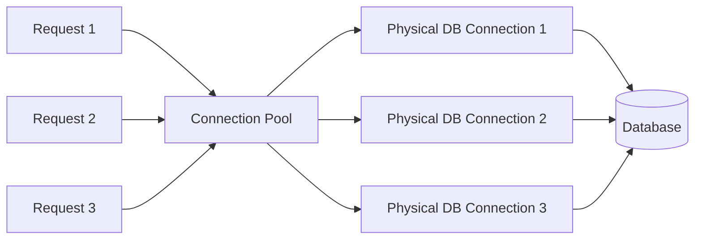

Thousands of application requests can therefore be served over a much smaller and controlled number of database connections.

---

# 2. Why Database Connections Are Expensive

Opening a database connection may involve:

1. DNS resolution.
2. TCP connection establishment.
3. TLS negotiation.
4. Authentication.
5. Database process, thread, or session allocation.
6. Session initialization.
7. Driver and ORM setup.
8. Network round trips.

For a single request, this overhead may be small. At high request volume, repeatedly creating connections increases:

- Latency
- CPU consumption
- Memory usage
- Authentication work
- Network traffic
- Risk of reaching the database connection limit

PostgreSQL also allocates resources according to its connection configuration. Increasing `max_connections` is therefore not free.

---

## 2.1 Without Pooling

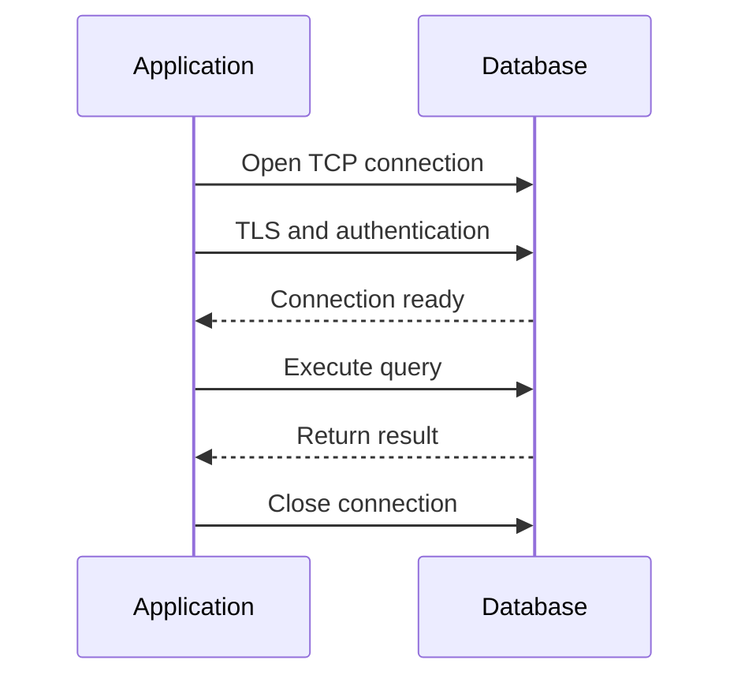

The setup cost is paid repeatedly.

---

## 2.2 With Pooling

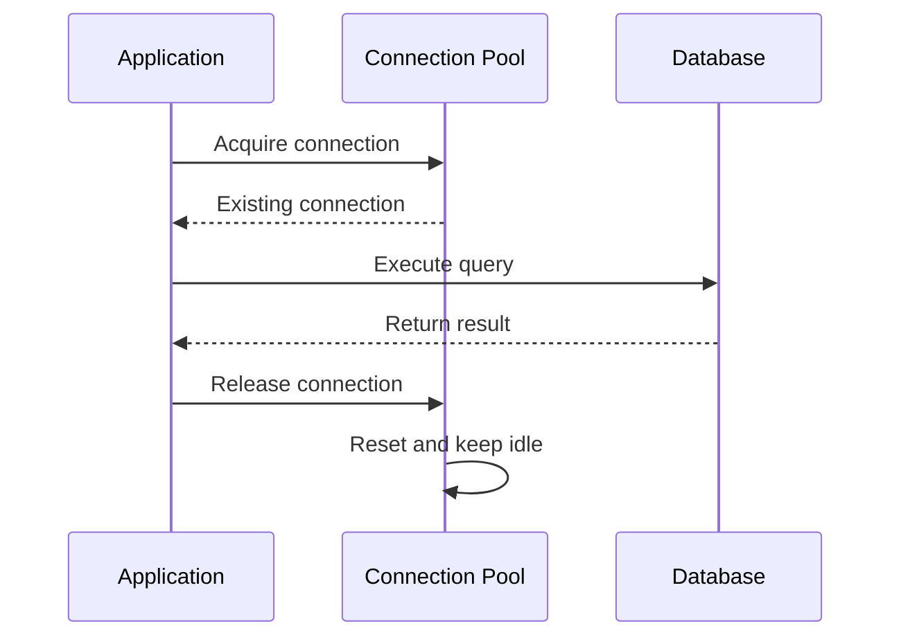

The physical connection remains available for future work.

---

# 3. How a Connection Pool Works

A connection normally moves through the following lifecycle:

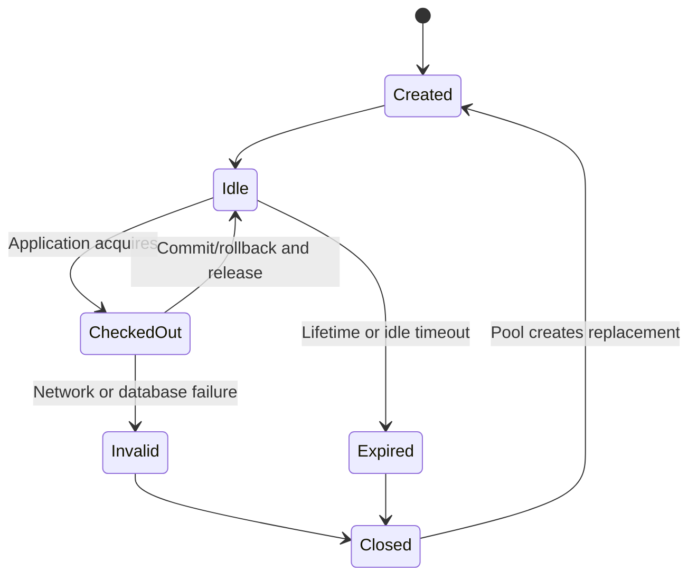

---

## 3.1 Connection Checkout

When code asks the pool for a connection:

- If an idle connection exists, the pool returns it.
- If the pool can grow, it may create a new connection.
- If the maximum size has been reached, the caller waits.
- If no connection becomes available before the acquisition timeout, the pool raises an error.

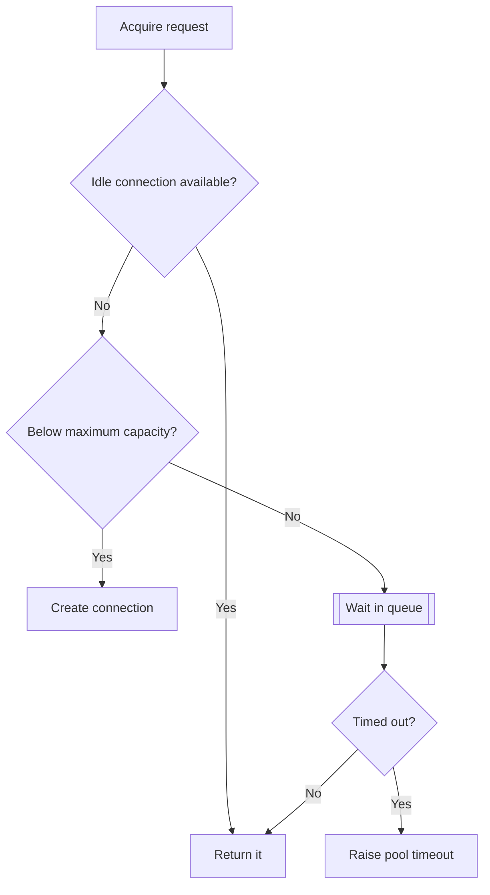

---

## 3.2 Connection Return

Returning a connection does not usually close the physical connection.

The pool typically performs a reset operation such as:

- Roll back an unfinished transaction.
- Clear transaction-level state.
- Mark the connection as idle.
- Validate or discard the connection if necessary.

This is why application code must release connections reliably.

---

## 3.3 Queueing Is Intentional

When the pool is full, waiting is not automatically a problem. A bounded queue protects the database from excessive concurrency.

The real questions are:

- How many callers are waiting?
- How long do they wait?
- Are connections held longer than expected?
- Is the database already at its efficient concurrency limit?
- Is the pool too small, or are queries too slow?

Increasing the pool size may temporarily hide slow queries while putting more pressure on the database.

---

# 4. Important Terms

## 4.1 Pool Size

The number of persistent connections maintained by the pool.

Examples:

- SQLAlchemy: `pool_size`
- HikariCP: `maximumPoolSize`
- Psycopg: `min_size` and `max_size`
- PgBouncer: `default_pool_size`

---

## 4.2 Minimum Pool Size

The minimum number of connections that the pool tries to keep ready.

A larger minimum can reduce cold-start latency, but it also keeps more database connections open during quiet periods.

---

## 4.3 Maximum Pool Size

The maximum number of physical connections the pool may hold.

Once this limit is reached, additional callers normally wait for another operation to return a connection.

---

## 4.4 Overflow or Burst Capacity

Some pools allow temporary connections beyond the normal persistent pool size.

For example:

```text
pool_size = 10
max_overflow = 5

Maximum possible connections = 10 + 5 = 15
```

Overflow capacity helps with short traffic bursts, but it must be included in the total database connection budget.

---

## 4.5 Acquisition Timeout

The maximum time a caller waits to obtain a connection.

Common names include:

- `pool_timeout`
- `connectionTimeout`
- `timeout`

A finite timeout is important. Waiting forever can turn database pressure into stuck application requests.

---

## 4.6 Idle Timeout

How long an unused connection may remain in the pool before being closed.

Idle timeout helps reduce unnecessary open connections after a temporary traffic spike.

---

## 4.7 Maximum Lifetime

The maximum age of a physical connection.

Once the lifetime is reached, the pool retires and replaces the connection.

This can help when:

- Load balancers terminate old connections.
- Firewalls have connection-age limits.
- Cloud databases rotate infrastructure.
- Long-lived connections become stale.

The pool lifetime should generally be shorter than any known infrastructure-enforced connection lifetime.

---

## 4.8 Health Check or Pre-Ping

Before returning a pooled connection, the pool can verify that it is still alive.

A common check is conceptually similar to:

```sql
SELECT 1;
```

SQLAlchemy provides `pool_pre_ping=True`. Psycopg pools support a connection check callback.

A health check improves resilience but adds a small network cost when performed during each checkout.

---

## 4.9 Connection Leak

A connection leak occurs when application code acquires a connection but fails to return it.

```python
# Unsafe pattern
connection = pool.get_connection()
connection.execute("SELECT ...")

# An exception here may prevent connection release.
```

Use context managers, `try/finally`, or framework-managed sessions:

```python
with pool.connection() as connection:
    connection.execute("SELECT ...")
```

---

## 4.10 Pool Saturation

A pool is saturated when every connection is checked out.

Saturation may be normal during short bursts. Sustained saturation usually indicates one or more of the following:

- Slow queries
- Long transactions
- Connection leaks
- Too much application concurrency
- An undersized pool
- Database lock contention
- External service calls being made while a transaction remains open

---

# 5. Types of Connection Pooling

Connection pooling can exist at different layers.

---

## 5.1 Application-Side Pooling

The application process owns the pool.

Examples:

- SQLAlchemy `QueuePool`
- Psycopg `ConnectionPool`
- Java HikariCP
- Node.js `pg.Pool`
- .NET provider pooling

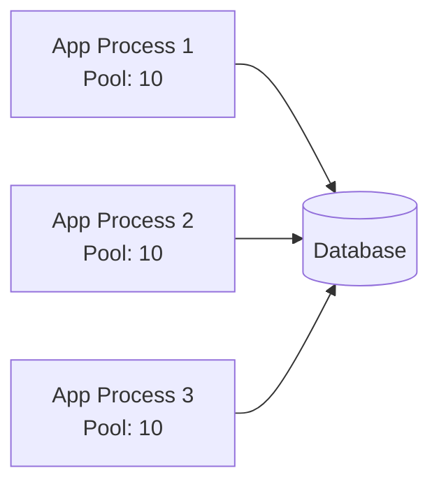

### Advantages

- Simple to use
- Usually built into the driver or ORM
- Fast local checkout
- Application-specific configuration
- No extra network hop

### Important limitation

Every process normally owns a separate pool.

If an application runs:

- 4 containers
- 3 worker processes per container
- 10 connections per worker

Then the deployment may open:

```text
4 × 3 × 10 = 120 database connections
```

The pool size is **not** global unless a shared external pooler is used.

---

## 5.2 External or Proxy Pooling

A separate service sits between applications and the database.

Examples:

- PgBouncer for PostgreSQL
- Amazon RDS Proxy
- Cloud SQL connectors and managed pooling layers
- Vendor-provided serverless database poolers

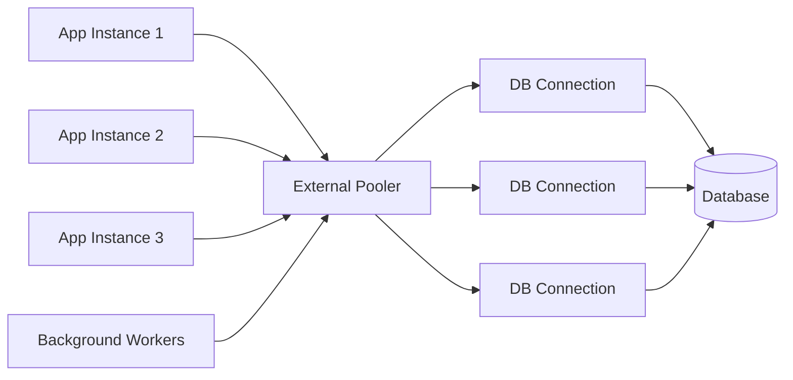

### Advantages

- Centralized connection control
- Useful with many application instances
- Protects the database from connection storms
- Particularly useful for serverless and autoscaling systems
- Can multiplex many client connections over fewer database connections

### Trade-offs

- Additional infrastructure
- Another network hop
- Pooling mode may limit session-level features
- Requires monitoring and high availability
- Client and server connection counts must be understood separately

---

## 5.3 Application Pool Plus External Pooler

Both layers can be used together:

```text
Application pool -> PgBouncer -> PostgreSQL
```

This is valid when configured intentionally, but there are two independent limits.

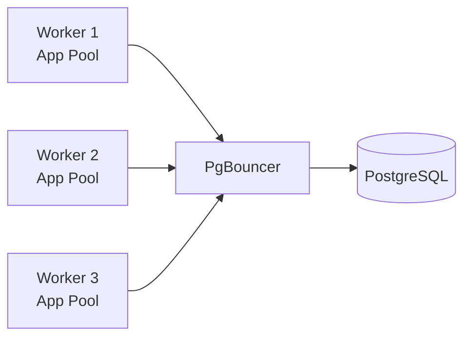

The application pool limits client connections to PgBouncer. PgBouncer limits physical server connections to PostgreSQL.

In serverless deployments, teams often use a very small application pool or disable persistent application-side pooling and rely on the external pooler. The correct choice depends on:

- Deployment lifetime
- Instance count
- Driver behavior
- External pooler mode
- Connection setup cost
- Database provider guidance

Avoid assuming that “double pooling” is always wrong or always beneficial.

---

# 6. Core Pool Configuration

A production pool normally needs more than only a maximum size.

| Setting | Purpose | Typical concern |
|---|---|---|
| Minimum size | Keeps ready connections | Too high wastes DB capacity |
| Maximum size | Caps physical connections | Too high overloads DB |
| Overflow | Handles short bursts | Must be counted in DB budget |
| Acquisition timeout | Limits queue wait | Too high hides saturation |
| Idle timeout | Removes unused connections | Too low causes churn |
| Maximum lifetime | Recycles old connections | Coordinate with infrastructure |
| Health check | Detects stale connections | Adds checkout overhead |
| Reset on return | Clears transaction state | Required for safe reuse |
| Keepalive | Detects dead peers | Requires driver/OS support |
| Leak detection | Identifies long-held connections | Threshold must avoid noise |

---

## 6.1 Recommended Starting Behavior

A reasonable starting strategy for many services is:

- Use a small bounded pool.
- Use a finite acquisition timeout.
- Enable stale-connection handling.
- Recycle connections before infrastructure timeouts.
- Return connections immediately after database work.
- Measure before increasing capacity.

There is no universal correct pool size.

---

## 6.2 Fixed vs Dynamic Pools

### Fixed Pool

```text
minimum size = maximum size = 10
```

The pool maintains a stable capacity.

Useful when:

- Traffic is predictable.
- The database budget is fixed.
- Low checkout latency is important.
- The service is continuously active.

### Dynamic Pool

```text
minimum size = 2
maximum size = 10
```

The pool grows under load and shrinks after connections become idle.

Useful when:

- Traffic varies significantly.
- Many services share one database.
- Idle capacity should be released.
- Instances may remain mostly inactive.

---

# 7. How to Size a Connection Pool

Pool sizing should be based on the complete deployment, not only one process.

---

## 7.1 Calculate the Maximum Deployment Connection Count

For an application-side pool:

```text
Maximum application connections
    = Number of instances
    × Worker processes per instance
    × Pools per worker
    × Maximum connections per pool
```

For a pool with overflow:

```text
Maximum connections per pool
    = pool_size + max_overflow
```

### Example

Assume:

- 4 application instances
- 3 worker processes per instance
- One pool per worker
- `pool_size = 10`
- `max_overflow = 5`

```text
Maximum per pool = 10 + 5 = 15

Deployment maximum = 4 × 3 × 1 × 15
                   = 180 connections
```

A developer who looks only at `pool_size = 10` may incorrectly believe the application uses only ten database connections.

---

## 7.2 Build a Database Connection Budget

```text
Application connection budget
    = Database connection limit
    - Reserved administrative connections
    - Migration and maintenance connections
    - Monitoring connections
    - Background-job connections
    - Connections used by other services
    - Safety margin
```

### Example

```text
PostgreSQL max_connections             = 200
Reserved/admin and emergency capacity  = 10
Monitoring and maintenance             = 10
Other services                         = 40
Safety margin                          = 20
------------------------------------------------
Available for this application         = 120
```

If the application has 12 worker processes:

```text
Maximum per worker pool = 120 / 12 = 10
```

This is an upper budget, not proof that ten is the optimal performance value.

---

## 7.3 Pool Size Is Not Equal to User Count

A system may have 10,000 active users but need only a small number of concurrent database connections.

Most users are not executing SQL at exactly the same instant.

What matters is:

- Request rate
- Percentage of requests using the database
- Time each operation holds a connection
- Query latency
- Transaction duration
- Database CPU and I/O capacity

---

## 7.4 A Useful Approximation Using Concurrency

A rough estimate can be derived from:

```text
Required concurrent connections
    ≈ Database operations per second
    × Average connection-hold time in seconds
```

### Example

```text
Database operations per second = 200
Average connection-hold time   = 50 ms = 0.05 s

Estimated concurrency = 200 × 0.05
                      = 10 connections
```

Add measured headroom for variance and bursts rather than multiplying the result without evidence.

This approximation becomes less accurate when:

- One request runs parallel queries.
- Transactions contain many sequential operations.
- Queries have highly variable latency.
- Locking causes long waits.
- Background jobs share the same pool.

---

## 7.5 Why a Larger Pool Can Be Slower

More database connections create more concurrent work.

After the database reaches an efficient concurrency level, additional connections may cause:

- CPU context switching
- Memory pressure
- Cache disruption
- Disk I/O contention
- Lock contention
- Longer query latency
- Larger queues inside the database

A pool should apply backpressure before the database becomes unstable.

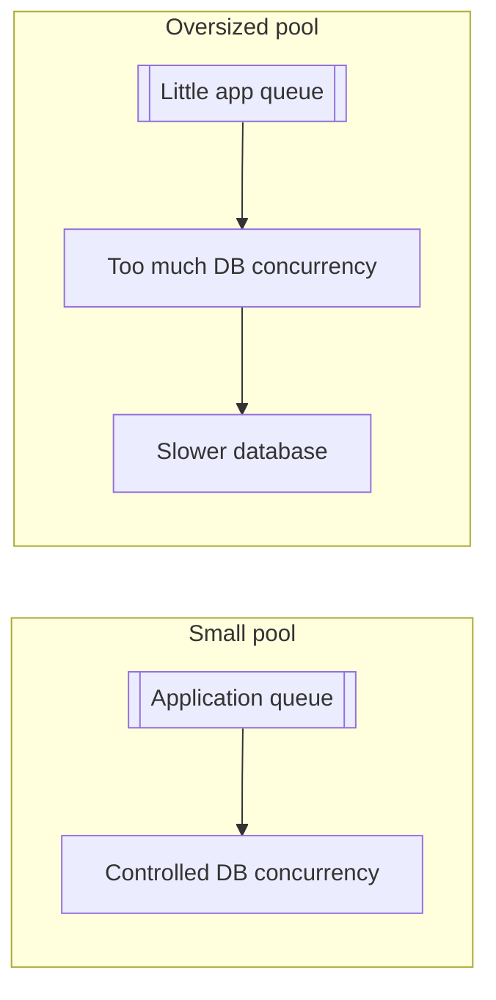

---

## 7.6 Practical Sizing Process

1. Calculate the maximum connection budget.
2. Start with a conservative per-process pool.
3. Set a short, finite acquisition timeout.
4. Run realistic load tests.
5. Observe pool wait time and database utilization.
6. Optimize slow queries and long transactions.
7. Increase the pool only if the database has unused capacity.
8. Recalculate whenever replica or worker counts change.

---

# 8. PgBouncer Pooling Modes

PgBouncer can return a PostgreSQL server connection to its pool at different boundaries.

---

## 8.1 Session Pooling

A server connection remains assigned to one client for the complete client session.

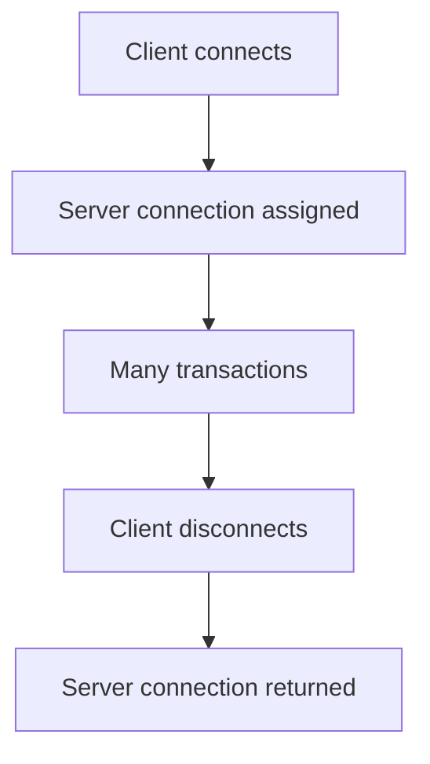

### Characteristics

- Highest compatibility
- Session state remains tied to one server connection
- Lower multiplexing efficiency than transaction mode
- Suitable when the application depends on session-level behavior

---

## 8.2 Transaction Pooling

The server connection is returned after each transaction.

```text
Client Transaction 1 -> Server Connection A
Client Transaction 2 -> Server Connection C
Client Transaction 3 -> Server Connection B
```

The same client may use different physical PostgreSQL connections for different transactions.

### Characteristics

- Strong connection multiplexing
- Common for web APIs
- Session-level state cannot be assumed to persist
- Application transactions must be clearly bounded
- Features tied to a specific server session require careful compatibility review

---

## 8.3 Statement Pooling

The server connection is returned after each statement.

### Characteristics

- Highest multiplexing
- Multi-statement transactions are not supported
- Most restrictive mode
- Less common for normal transactional applications

---

## 8.4 Mode Comparison

| Capability | Session | Transaction | Statement |
|---|---:|---:|---:|
| Connection released after | Client disconnect | Transaction ends | Statement ends |
| Multi-statement transaction | Yes | Yes | No |
| Session state across transactions | Yes | Not guaranteed | Not guaranteed |
| Multiplexing efficiency | Lowest | High | Highest |
| General compatibility | Highest | Medium | Lowest |
| Typical web API use | Possible | Common | Uncommon |

Always verify specific PostgreSQL features against the current PgBouncer feature matrix.

---

# 9. Transactions and Session State

Connection pooling is safe only when connection state is properly managed.

---

## 9.1 Connection, Session, and Transaction Are Different

```text
Physical connection:
Long-lived network/database connection

Database session:
State associated with that physical connection

Transaction:
Atomic unit of work executed through the session
```

A pool reuses the physical connection and its session. The pool or application must ensure that state from one request does not unexpectedly affect another.

---

## 9.2 Return Connections in a Clean State

Before a connection returns to the pool:

- Commit successful work.
- Roll back failed or incomplete work.
- Close cursors.
- Avoid leaving an open transaction.
- Restore any changed session settings when required.

Example:

```python
with engine.begin() as connection:
    connection.execute(...)
    connection.execute(...)

# The transaction is committed on success.
# It is rolled back if an exception occurs.
# The connection is returned to the pool.
```

---

## 9.3 “Idle in Transaction” Is Dangerous

A connection may be open, unused, and still inside a transaction.

```text
BEGIN;
SELECT ...;

# Application waits for an API call for 30 seconds.

COMMIT;
```

During the wait, the transaction may:

- Hold locks
- Prevent vacuum cleanup
- Retain old row versions
- Consume a pool connection
- Increase contention

Keep external network calls and slow computation outside database transactions whenever possible.

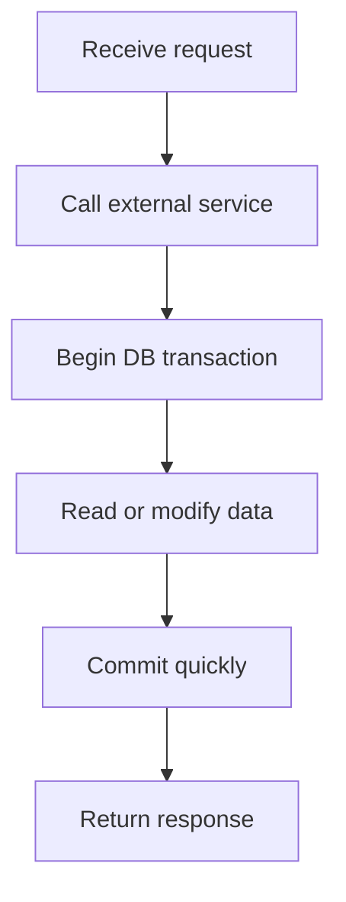

---

## 9.4 Session-Level Features with Transaction Pooling

Do not assume the following remain attached to the client across transactions when using transaction pooling:

- Temporary tables
- Session-level `SET` values
- Session advisory locks
- Connection-local cursors
- Session-specific extensions or state
- Some prepared-statement behaviors

Prefer transaction-local configuration where possible:

```sql
BEGIN;

SET LOCAL statement_timeout = '2s';

SELECT ...;

COMMIT;
```

`SET LOCAL` applies only to the current transaction and fits transaction-pooling architecture better than persistent session state.

---

# 10. Practical Configuration Examples

## 10.1 SQLAlchemy 2.x — Synchronous Application Pool

```python
import os

from sqlalchemy import create_engine, text
from sqlalchemy.orm import sessionmaker

DATABASE_URL = os.environ["DATABASE_URL"]

engine = create_engine(
    DATABASE_URL,
    pool_size=10,
    max_overflow=5,
    pool_timeout=5,
    pool_recycle=1800,
    pool_pre_ping=True,
)

SessionLocal = sessionmaker(
    bind=engine,
    autoflush=False,
    expire_on_commit=False,
)


def get_user(user_id: int) -> dict | None:
    with SessionLocal() as session:
        row = session.execute(
            text(
                """
                SELECT id, email
                FROM users
                WHERE id = :user_id
                """
            ),
            {"user_id": user_id},
        ).mappings().one_or_none()

        return dict(row) if row else None
```

### Configuration meaning

```text
pool_size=10
    Keep up to 10 persistent pooled connections.

max_overflow=5
    Allow up to 5 temporary connections during a burst.

pool_timeout=5
    Wait at most 5 seconds for a connection.

pool_recycle=1800
    Replace connections older than 30 minutes when checked out.

pool_pre_ping=True
    Check whether a connection is alive before using it.
```

The maximum possible number of connections for this engine is:

```text
10 + 5 = 15
```

Multiply this by the number of worker processes and application instances.

---

## 10.2 SQLAlchemy — Safe Transaction Scope

```python
from sqlalchemy import text


def transfer_money(
    sender_id: int,
    receiver_id: int,
    amount: int,
) -> None:
    if amount <= 0:
        raise ValueError("amount must be positive")

    with engine.begin() as connection:
        debit_result = connection.execute(
            text(
                """
                UPDATE accounts
                SET balance = balance - :amount
                WHERE id = :sender_id
                  AND balance >= :amount
                """
            ),
            {
                "sender_id": sender_id,
                "amount": amount,
            },
        )

        if debit_result.rowcount != 1:
            raise ValueError("sender account missing or insufficient balance")

        credit_result = connection.execute(
            text(
                """
                UPDATE accounts
                SET balance = balance + :amount
                WHERE id = :receiver_id
                """
            ),
            {
                "receiver_id": receiver_id,
                "amount": amount,
            },
        )

        if credit_result.rowcount != 1:
            raise ValueError("receiver account not found")
```

`engine.begin()` provides a clear lifecycle:

```text
Checkout -> Begin -> Execute -> Commit/Rollback -> Return
```

---

## 10.3 SQLAlchemy 2.x — Async Engine

```python
import os

from sqlalchemy import text
from sqlalchemy.ext.asyncio import async_sessionmaker, create_async_engine

DATABASE_URL = os.environ["ASYNC_DATABASE_URL"]

engine = create_async_engine(
    DATABASE_URL,
    pool_size=10,
    max_overflow=5,
    pool_timeout=5,
    pool_recycle=1800,
    pool_pre_ping=True,
)

AsyncSessionLocal = async_sessionmaker(
    engine,
    expire_on_commit=False,
)


async def get_order(order_id: int) -> dict | None:
    async with AsyncSessionLocal() as session:
        result = await session.execute(
            text(
                """
                SELECT id, status, total_amount
                FROM orders
                WHERE id = :order_id
                """
            ),
            {"order_id": order_id},
        )

        row = result.mappings().one_or_none()
        return dict(row) if row else None
```

SQLAlchemy uses an asyncio-compatible pool automatically for an async engine.

Async code does not mean unlimited database concurrency. The pool must remain bounded.

---

## 10.4 FastAPI Dependency Pattern

```python
from collections.abc import AsyncIterator

from fastapi import Depends, FastAPI, HTTPException
from sqlalchemy import text
from sqlalchemy.ext.asyncio import AsyncSession

app = FastAPI()


async def get_db() -> AsyncIterator[AsyncSession]:
    async with AsyncSessionLocal() as session:
        try:
            yield session
        except Exception:
            await session.rollback()
            raise


@app.get("/orders/{order_id}")
async def read_order(
    order_id: int,
    session: AsyncSession = Depends(get_db),
) -> dict:
    result = await session.execute(
        text(
            """
            SELECT id, status, total_amount
            FROM orders
            WHERE id = :order_id
            """
        ),
        {"order_id": order_id},
    )

    order = result.mappings().one_or_none()

    if order is None:
        raise HTTPException(status_code=404, detail="Order not found")

    return dict(order)
```

The dependency ensures the session is closed and its connection is returned.

---

## 10.5 Django 6.0 with Psycopg Pooling

Install the pool support:

```bash
pip install "psycopg[pool]"
```

Configure the PostgreSQL backend:

```python
# settings.py

import os

DATABASES = {
    "default": {
        "ENGINE": "django.db.backends.postgresql",
        "NAME": os.environ["DB_NAME"],
        "USER": os.environ["DB_USER"],
        "PASSWORD": os.environ["DB_PASSWORD"],
        "HOST": os.environ["DB_HOST"],
        "PORT": os.getenv("DB_PORT", "5432"),
        "CONN_MAX_AGE": 0,
        "OPTIONS": {
            "pool": {
                "min_size": 2,
                "max_size": 10,
                "timeout": 5,
                "max_idle": 300,
                "max_lifetime": 1800,
            },
        },
    },
}
```

Important points:

- Django's PostgreSQL pool option uses Psycopg's pool.
- It requires Psycopg 3 pool support.
- With ASGI, use backend pooling rather than relying on Django persistent connections.
- Treat each application process as owning its own pool.
- When PgBouncer transaction pooling is used, review server-side cursor compatibility.

For Django-managed persistent connections without a backend pool:

```python
DATABASES = {
    "default": {
        # ...
        "CONN_MAX_AGE": 60,
        "CONN_HEALTH_CHECKS": True,
    }
}
```

Persistent connections and a configurable multi-connection pool are related but not identical concepts.

---

## 10.6 Psycopg 3 Pool

```python
import os

from psycopg_pool import ConnectionPool

pool = ConnectionPool(
    conninfo=os.environ["DATABASE_URL"],
    min_size=2,
    max_size=10,
    timeout=5,
    max_idle=300,
    max_lifetime=1800,
    check=ConnectionPool.check_connection,
)


def find_product(product_id: int) -> tuple | None:
    with pool.connection() as connection:
        with connection.cursor() as cursor:
            cursor.execute(
                """
                SELECT id, name, price
                FROM products
                WHERE id = %s
                """,
                (product_id,),
            )
            return cursor.fetchone()
```

At application startup, a readiness check can verify that the minimum pool is available:

```python
pool.open()
pool.wait(timeout=10)
```

At shutdown:

```python
pool.close()
```

---

## 10.7 Node.js with `pg.Pool`

```javascript
import pg from "pg";

const { Pool } = pg;

const pool = new Pool({
  connectionString: process.env.DATABASE_URL,
  max: 10,
  idleTimeoutMillis: 30_000,
  connectionTimeoutMillis: 5_000,
});

pool.on("error", (error) => {
  console.error("Unexpected error on idle PostgreSQL client", error);
});

export async function findUser(userId) {
  const result = await pool.query(
    `
      SELECT id, email
      FROM users
      WHERE id = $1
    `,
    [userId],
  );

  return result.rows[0] ?? null;
}
```

For a multi-statement transaction, acquire and release one client explicitly:

```javascript
export async function createOrder(userId, totalAmount) {
  const client = await pool.connect();

  try {
    await client.query("BEGIN");

    const result = await client.query(
      `
        INSERT INTO orders (user_id, total_amount)
        VALUES ($1, $2)
        RETURNING id
      `,
      [userId, totalAmount],
    );

    await client.query("COMMIT");
    return result.rows[0];
  } catch (error) {
    await client.query("ROLLBACK");
    throw error;
  } finally {
    client.release();
  }
}
```

All statements in a transaction must use the same checked-out client.

---

## 10.8 Java with HikariCP

```properties
spring.datasource.hikari.maximum-pool-size=10
spring.datasource.hikari.connection-timeout=5000
spring.datasource.hikari.max-lifetime=1800000
spring.datasource.hikari.keepalive-time=300000
spring.datasource.hikari.pool-name=orders-db-pool
```

A HikariCP pool blocks callers when no idle connection exists and the maximum size has been reached. It waits up to the configured connection timeout.

The maximum pool size must be calculated across all application instances.

---

## 10.9 PgBouncer Example

```ini
[databases]
appdb = host=postgres port=5432 dbname=appdb

[pgbouncer]
listen_addr = 0.0.0.0
listen_port = 6432

auth_type = scram-sha-256
auth_file = /etc/pgbouncer/userlist.txt

pool_mode = transaction

max_client_conn = 500
default_pool_size = 30
min_pool_size = 5
reserve_pool_size = 5

server_idle_timeout = 600
query_timeout = 30

admin_users = pgbouncer_admin
stats_users = metrics_user
```

Connection flow:

```text
Application connects to:
    pgbouncer:6432

PgBouncer connects to:
    postgres:5432
```

`max_client_conn` controls clients connected to PgBouncer.  
`default_pool_size` controls server connections per user/database pool.

These values do not represent the same resource.

---

# 11. Common Deployment Architectures

## 11.1 Long-Running Monolith

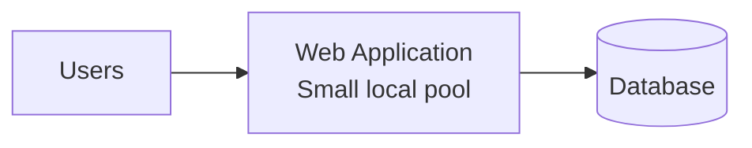

Suitable when:

- Instance count is stable.
- The service is long-running.
- Application-side pooling is sufficient.
- The connection budget is easy to calculate.

---

## 11.2 Multiple Microservices

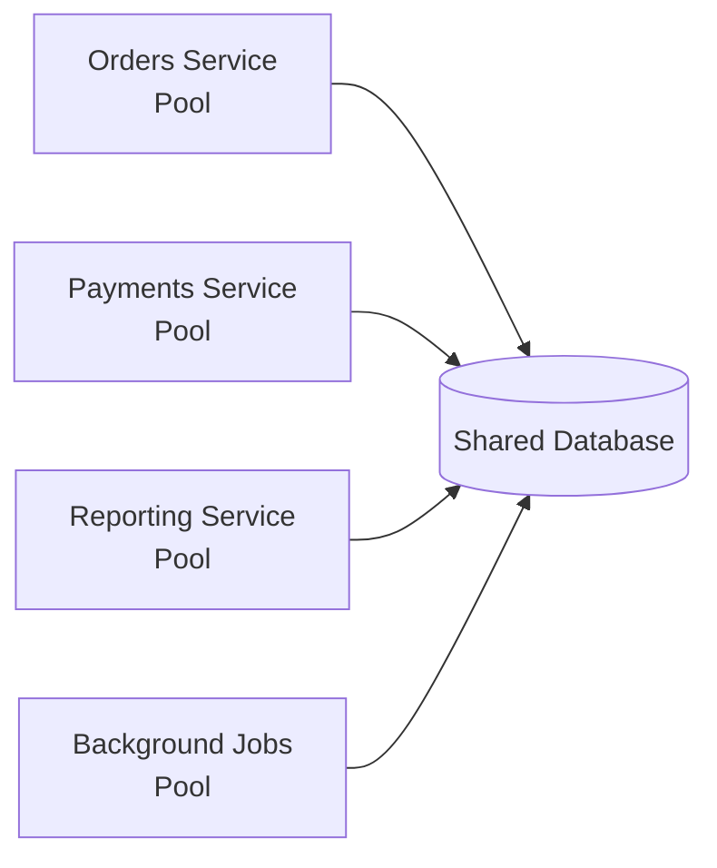

Each service must receive an explicit part of the shared database connection budget.

A reporting or batch workload should often use a separate pool so that it cannot consume all connections required by user-facing APIs.

---

## 11.3 Kubernetes Deployment

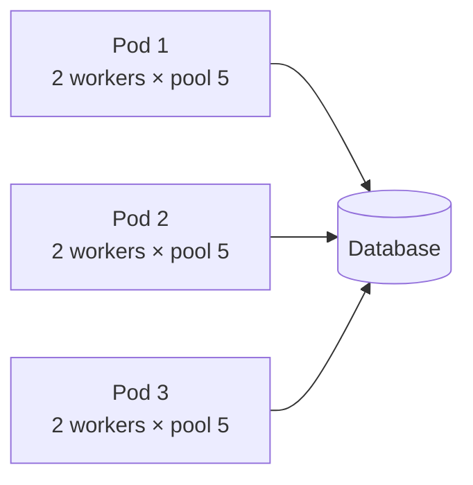

For three pods:

```text
3 pods × 2 workers × 5 connections = 30 connections
```

If Horizontal Pod Autoscaling increases the deployment to 12 pods:

```text
12 pods × 2 workers × 5 connections = 120 connections
```

Pool configuration must be safe at the **maximum replica count**, not only at the current replica count.

---

## 11.4 Serverless or Scale-to-Zero

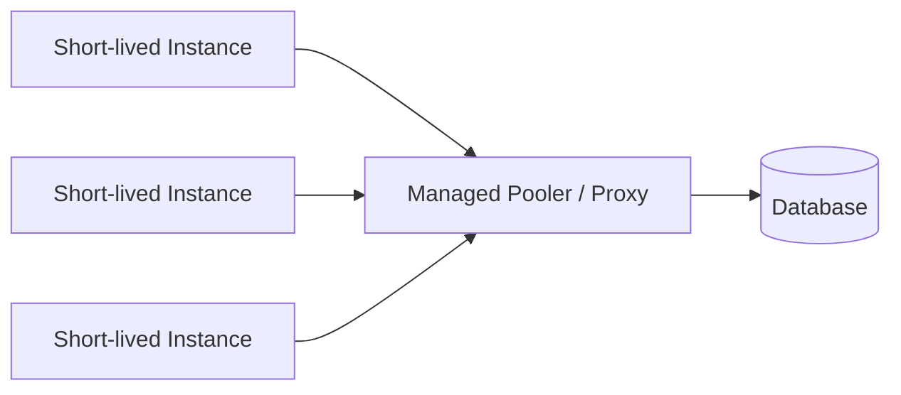

Serverless instances can create sudden connection storms.

An external managed pooler or database proxy is often helpful because:

- Instances scale rapidly.
- Process-local pools are multiplied.
- Instances may be short-lived.
- Cold starts may establish many connections at once.

Use provider-recommended pooled endpoints and confirm transaction/session feature compatibility.

---

## 11.5 Read and Write Pools

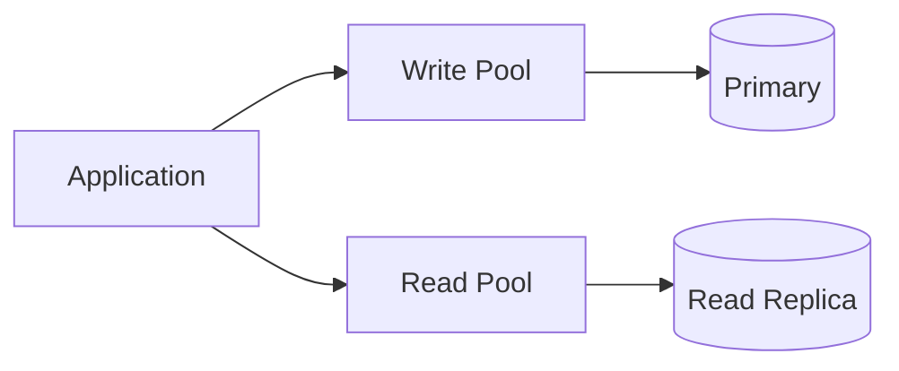

Separate pools can prevent read traffic from consuming write capacity.

Consider:

- Replica lag
- Read-after-write consistency
- Different pool sizes
- Separate health checks
- Failover behavior

---

# 12. Monitoring and Metrics

A pool should be observable in production.

---

## 12.1 Application Pool Metrics

Monitor:

| Metric | Meaning |
|---|---|
| Active/checked-out connections | Connections currently in use |
| Idle connections | Connections ready for use |
| Total connections | Active plus idle |
| Pending waiters | Callers waiting for a connection |
| Checkout/acquisition latency | Time required to obtain a connection |
| Acquisition timeouts | Requests that could not get a connection |
| Connection creation rate | Frequency of new physical connections |
| Connection close rate | Frequency of retirement or failure |
| Usage duration | Time a connection remains checked out |
| Leak warnings | Connections held beyond a threshold |

---

## 12.2 Database Metrics

For PostgreSQL, useful indicators include:

- Current connections
- Active sessions
- Idle sessions
- Idle-in-transaction sessions
- Long-running transactions
- Lock waits
- Query latency
- CPU utilization
- Disk I/O
- Buffer-cache behavior
- Transaction rate
- Connection failures

Example diagnostic query:

```sql
SELECT
    state,
    COUNT(*) AS connection_count
FROM pg_stat_activity
GROUP BY state
ORDER BY connection_count DESC;
```

Find long-running transactions:

```sql
SELECT
    pid,
    usename,
    application_name,
    state,
    NOW() - xact_start AS transaction_age,
    NOW() - query_start AS query_age,
    wait_event_type,
    wait_event,
    LEFT(query, 200) AS query
FROM pg_stat_activity
WHERE xact_start IS NOT NULL
ORDER BY xact_start;
```

Find idle-in-transaction sessions:

```sql
SELECT
    pid,
    usename,
    application_name,
    NOW() - xact_start AS transaction_age,
    LEFT(query, 200) AS last_query
FROM pg_stat_activity
WHERE state = 'idle in transaction'
ORDER BY xact_start;
```

---

## 12.3 PgBouncer Metrics

PgBouncer exposes administrative commands such as:

```sql
SHOW POOLS;
SHOW CLIENTS;
SHOW SERVERS;
SHOW STATS;
SHOW DATABASES;
```

Important observations include:

- Client connections
- Server connections
- Waiting clients
- Active clients
- Active server connections
- Average transaction time
- Average query time
- Pool capacity by database and user

---

## 12.4 Healthy vs Unhealthy Patterns

### Healthy

```text
Active connections: moderate and variable
Idle connections: available during normal load
Wait time: near zero most of the time
Timeouts: zero or extremely rare
Database CPU: below sustained saturation
Transactions: short and bounded
```

### Unhealthy

```text
Active connections: always at maximum
Pending waiters: continuously increasing
Acquisition timeouts: frequent
Database CPU: saturated
Long transactions: increasing
Idle in transaction: present
Connection creation: continuously churning
```

---

# 13. Diagnosing Pool Problems

This section describes symptoms and reasoning, rather than treating every timeout as a pool-size problem.

---

## 13.1 Pool Timeout

Typical error:

```text
Timed out while waiting for a database connection
```

### Investigation order

1. Check active, idle, and waiting pool metrics.
2. Measure how long connections remain checked out.
3. Look for missing `close()`, `release()`, or context-manager usage.
4. Inspect long-running queries.
5. Inspect lock waits.
6. Inspect idle-in-transaction sessions.
7. Confirm actual instance and worker counts.
8. Confirm the database has unused capacity.
9. Only then consider changing pool size.

---

## 13.2 Database Reports “Too Many Connections”

Likely causes include:

- Pool size multiplied across many processes.
- Autoscaling increased instance count.
- Overflow was omitted from capacity calculations.
- Background workers use separate pools.
- Multiple services share the same database.
- Old application instances did not shut down cleanly.
- Direct connections bypass the pooler.
- Migrations or administrative tools consumed the remaining slots.

Calculate the complete connection budget before increasing `max_connections`.

---

## 13.3 Stale or Closed Connections

Symptoms may appear after:

- Database restart
- Failover
- Firewall timeout
- Load balancer timeout
- Network interruption
- Cloud database sleep/wake cycle

Possible controls:

- Pre-ping or health check
- Maximum lifetime
- Idle timeout
- TCP keepalive
- Driver reconnect behavior
- Retry of safe, idempotent operations

Do not blindly retry an entire transaction unless the operation is designed to be safely retried.

---

## 13.4 High Database CPU After Increasing Pool Size

This often means the pool is allowing more concurrent SQL than the database can efficiently execute.

Actions:

1. Reduce the pool limit.
2. Find expensive queries.
3. Add or improve indexes where appropriate.
4. Reduce transaction duration.
5. Limit batch concurrency.
6. Separate reporting workloads.
7. Scale database CPU or I/O only after confirming the workload requires it.

---

## 13.5 Connections Are Idle but Requests Still Wait

Possible explanations:

- The idle connections belong to another database/user pool.
- Each process has its own pool.
- Requests are waiting in a different application instance.
- A lock inside the pool implementation is contended.
- Connections are invalid or being recycled.
- Metrics are aggregated incorrectly.
- The system uses separate read and write pools.

Always inspect metrics using the same dimensions as the pool:

```text
service + instance + process + pool name + database + user
```

---

## 13.6 Connection Churn

Connection churn means connections are repeatedly created and destroyed.

Possible reasons:

- Idle timeout is too short.
- Maximum lifetime is too short.
- Infrastructure closes connections first.
- Health checks repeatedly reject connections.
- Traffic repeatedly scales from zero.
- The application creates a new pool per request.

A pool should normally be created once per process and shared.

---

# 14. Production Best Practices

## 14.1 Create One Pool per Process

Create the pool during application startup and reuse it.

```python
# Good: module/application-level engine
engine = create_engine(DATABASE_URL)
```

Do not create a new engine or pool inside every request handler.

---

## 14.2 Keep the Pool Bounded

An unlimited pool transfers overload directly to the database.

Use:

- Maximum pool size
- Finite acquisition timeout
- Bounded request concurrency
- Backpressure

---

## 14.3 Keep Transactions Short

Perform only database-related work while holding the transaction.

Avoid:

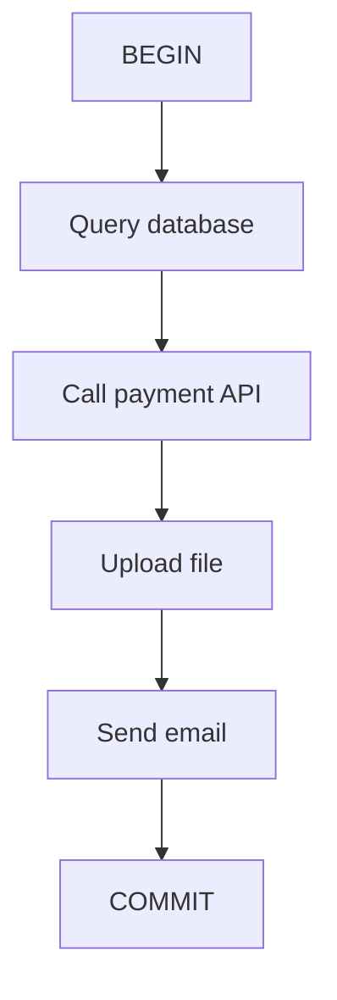

Prefer:

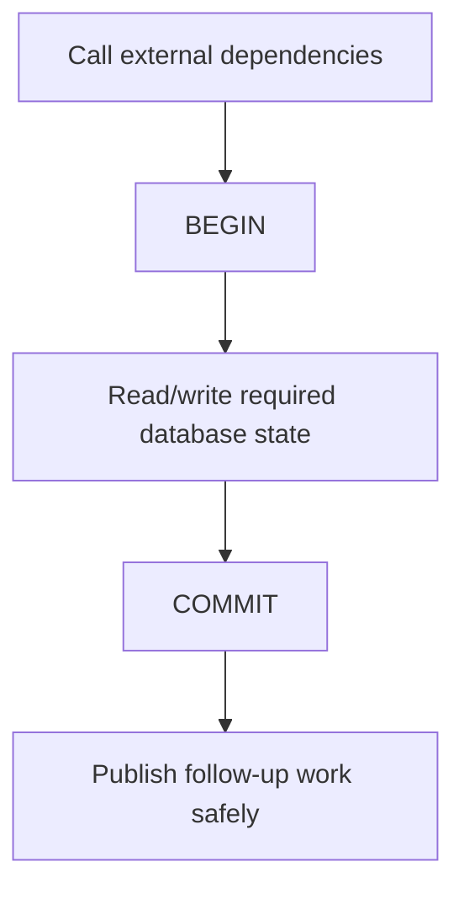

For workflows requiring consistency across systems, use patterns such as an outbox rather than keeping a database transaction open during remote calls.

---

## 14.4 Always Return Connections

Use:

- Context managers
- `try/finally`
- Framework dependency cleanup
- Transaction helpers

Example:

```python
with pool.connection() as connection:
    with connection.transaction():
        ...
```

---

## 14.5 Use Timeouts at Multiple Layers

Relevant timeout types include:

- Pool acquisition timeout
- Connection establishment timeout
- Statement timeout
- Lock timeout
- Transaction timeout
- HTTP request timeout

Each timeout protects a different boundary.

A pool timeout does not cancel a slow SQL statement already running on another connection.

---

## 14.6 Tag Connections

Set an application name where supported:

```text
orders-api
billing-worker
reporting-job
migration-runner
```

This makes `pg_stat_activity`, logs, and monitoring easier to interpret.

---

## 14.7 Separate Workload Classes

Use separate pools for workloads with different behavior:

```text
User-facing API:
    Small timeout, predictable queries

Background jobs:
    Controlled concurrency, longer operations

Reporting:
    Read replica, stricter concurrency limit

Migrations:
    Dedicated direct/session-compatible connection
```

---

## 14.8 Coordinate Pool Lifetime with Infrastructure

Suppose a load balancer terminates connections after 60 minutes.

Configure the pool to retire connections earlier, for example around 50–55 minutes, with appropriate jitter when supported.

This reduces the chance that infrastructure kills a connection while the application believes it is healthy.

---

## 14.9 Handle Process Forking Correctly

Connections should not be shared across forked processes.

Create the pool after the worker process is created, or dispose and recreate inherited connections according to the framework and driver documentation.

This is relevant for:

- Gunicorn
- Celery prefork workers
- Multiprocessing
- Preloaded application servers

---

## 14.10 Plan for Graceful Shutdown

During shutdown:

1. Stop accepting new requests.
2. Allow in-flight operations to finish within a deadline.
3. Close the pool.
4. Let connections terminate cleanly.

This prevents connection leaks and interrupted transactions during deployments.

---

## 14.11 Recalculate After Scaling Changes

Revisit connection limits whenever changing:

- Pod or instance count
- Gunicorn/Uvicorn worker count
- Thread count
- Celery worker concurrency
- Number of services
- Pool overflow
- Read replicas
- External pooler configuration

Pool size is an architectural capacity setting, not only an application constant.

---

# 15. Interview-Relevant Takeaways

A strong explanation of connection pooling should communicate the following ideas.

---

## 15.1 Pooling Improves Reuse and Controls Concurrency

Connection pooling is not only a speed optimization.

It provides:

- Connection reuse
- Lower setup latency
- A bounded database concurrency limit
- Backpressure when capacity is exhausted
- Centralized connection lifecycle management

---

## 15.2 The Pool Size Is Per Process

The most important capacity formula is:

```text
instances × processes × maximum pool size
```

Include overflow and all other services.

---

## 15.3 More Connections Do Not Always Improve Throughput

After database capacity is reached, a larger pool can make the system slower by increasing contention.

Optimize query and transaction duration before treating pool size as the primary solution.

---

## 15.4 Transaction Pooling Changes Session Semantics

With PgBouncer transaction pooling, one client may use different PostgreSQL server connections across transactions.

Therefore, session-level state must not be assumed to persist.

---

## 15.5 A Pool Timeout Is a Symptom

A timeout may indicate:

- Slow SQL
- Locks
- Long transactions
- Leaks
- Too much concurrency
- Incorrect deployment-level sizing

The fix is not automatically “increase the pool.”

---

## 15.6 Async Still Needs a Bounded Pool

Async application code can create a large number of concurrent tasks. The database cannot necessarily execute the same number of queries concurrently.

A bounded async pool prevents the event loop from overwhelming the database.

---

# 16. Quick Revision Summary

```text
Connection Pooling
│
├── Reuses physical database connections
├── Reduces connection setup cost
├── Limits concurrent database work
├── Queues callers when the pool is full
│
├── Important settings
│   ├── Minimum size
│   ├── Maximum size
│   ├── Overflow
│   ├── Acquisition timeout
│   ├── Idle timeout
│   ├── Maximum lifetime
│   └── Health check
│
├── Pool types
│   ├── Application-side pool
│   ├── External pooler/proxy
│   └── Both, with deliberate limits
│
├── PgBouncer modes
│   ├── Session
│   ├── Transaction
│   └── Statement
│
├── Sizing
│   ├── Count instances
│   ├── Count worker processes
│   ├── Include overflow
│   ├── Reserve DB capacity
│   └── Validate with load testing
│
└── Monitor
    ├── Active connections
    ├── Idle connections
    ├── Waiting callers
    ├── Acquisition latency
    ├── Timeouts
    ├── Query duration
    ├── Locks
    └── Long transactions
```

---

## Final Mental Model

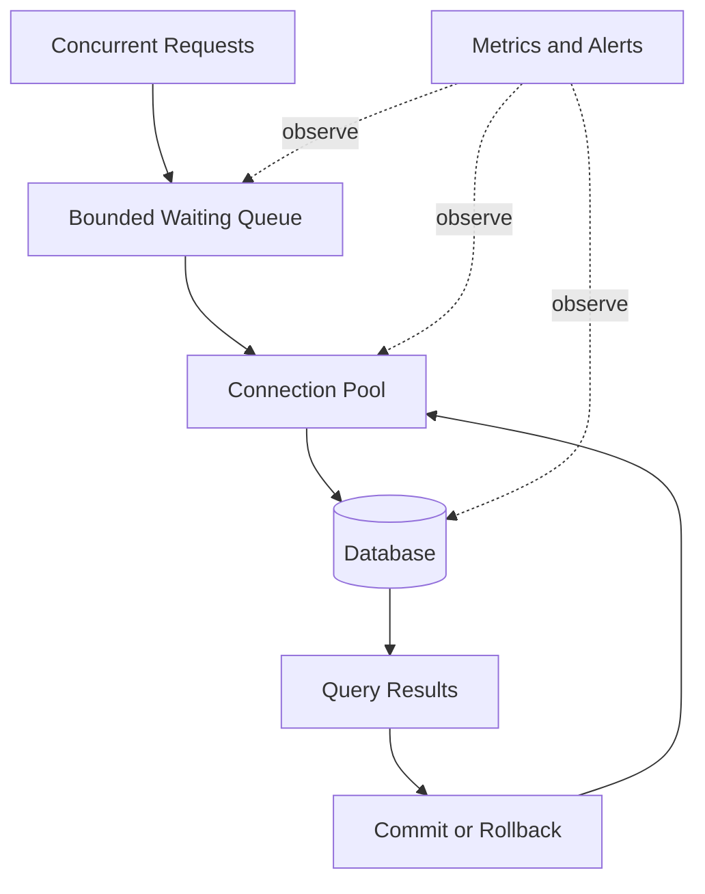

The pool is a controlled gateway between application concurrency and database capacity.

---

# 17. Official References

- [PostgreSQL — Connections and Authentication](https://www.postgresql.org/docs/current/runtime-config-connection.html)
- [PgBouncer — Configuration](https://www.pgbouncer.org/config)
- [PgBouncer — Feature Compatibility](https://www.pgbouncer.org/features.html)
- [PgBouncer — Usage and Administrative Commands](https://www.pgbouncer.org/usage.html)
- [SQLAlchemy 2.x — Connection Pooling](https://docs.sqlalchemy.org/en/21/core/pooling.html)
- [Django — Database Connections and PostgreSQL Pooling](https://docs.djangoproject.com/en/6.0/ref/databases/)
- [Psycopg 3 — Connection Pools](https://www.psycopg.org/psycopg3/docs/advanced/pool.html)
- [Node-Postgres — Pooling](https://node-postgres.com/features/pooling)
- [HikariCP — Configuration and Pool Sizing](https://github.com/brettwooldridge/HikariCP)
