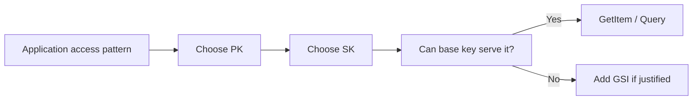
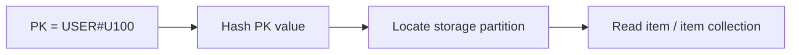
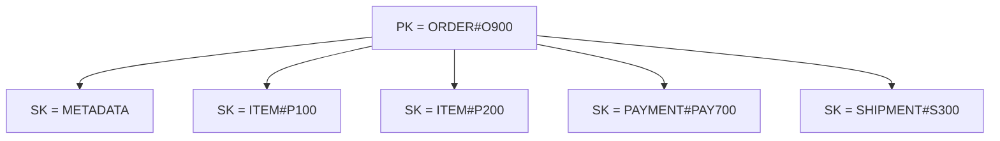

# DynamoDB: Keys, GSI/LSI, and Single-Table Design

> DynamoDB is easiest to understand when you stop thinking in tables and joins and start thinking in **access patterns, partition keys, sort keys, and queries**.

## In Short

- DynamoDB is a fully managed, serverless NoSQL database built for predictable, low-latency access at scale.
- A primary key is either a **partition key** or a **partition key + sort key**.
- The partition key decides where data is distributed; poor key distribution can create hot keys.
- The sort key groups and orders related items under the same partition-key value.
- `Query` requires an exact partition-key value and can optionally apply a condition to the sort key.
- `FilterExpression` is applied after DynamoDB reads matching items, so it does not reduce the read work already performed.
- A **GSI** creates a new access path with a different partition key and/or sort key.
- An **LSI** keeps the same partition key but provides another sort order.
- Single-table design stores multiple related entity types in one table so common application reads can be served with direct key lookups or a small number of queries.
- Design DynamoDB from **known access patterns first**, not from a normalized relational schema.



---

# 1. DynamoDB Mental Model

A relational database commonly starts with entities, normalized tables, relationships, and joins.

DynamoDB starts from a different question:

> **What data must the application read or write efficiently?**

## 1.1 Relational vs DynamoDB Thinking

| Relational database | DynamoDB |
|---|---|
| Normalize data into related tables | Intentionally group or duplicate data for access patterns |
| Flexible SQL queries | Predictable key-based queries |
| Relationships use joins | Relationships are represented through key structure |
| Schema is defined mainly by columns | Items may have different non-key attributes |
| Indexes can often be added later | Key and index design should be planned early |

DynamoDB tables are flexible about non-key attributes. Two items can have completely different shapes while still using the same primary-key attributes.

```json
{
  "PK": "USER#U100",
  "SK": "PROFILE",
  "name": "Aarav",
  "email": "aarav@example.com"
}
```

```json
{
  "PK": "USER#U100",
  "SK": "ORDER#2026-08-19T10:30:00Z#O900",
  "orderId": "O900",
  "status": "PAID"
}
```

The common `PK` and `SK` attributes define how both items are stored and queried.

---

# 2. Primary Keys and Querying

## 2.1 Simple and Composite Primary Keys

DynamoDB supports two primary-key forms.

### Simple Primary Key

Only a partition key is used.

```text
UserId = U100
```

The partition-key value uniquely identifies the item.

Use this when one key always maps to one item.

### Composite Primary Key

A partition key and sort key are used together.

```text
PK = USER#U100
SK = PROFILE
```

or:

```text
PK = USER#U100
SK = ORDER#O900
```

The complete `(PK, SK)` pair must be unique, while many items can share the same `PK`.

This is the most useful structure for one-to-many relationships and single-table design.

---

## 2.2 Partition Key

DynamoDB hashes the partition-key value to determine where the item is stored.



Good partition keys usually have:

- High cardinality
- Traffic distributed across many values
- A direct connection to an application access pattern
- No single value receiving most reads or writes

Typical examples:

```text
USER#U100
ORDER#O900
DEVICE#D501
ACCOUNT#A120
TENANT#T40#PROJECT#P8
```

Risky low-cardinality keys include:

```text
ACTIVE
PENDING
TODAY
INDIA
DEFAULT
```

These can concentrate traffic on a small number of key values.

For very high-volume workloads, use bucketing or write sharding when the access pattern allows it:

```text
DEVICE#D501#2026-08
STATUS#PENDING#SHARD#03
```

The goal is not simply “unique keys”; it is **evenly distributed traffic**.

---

## 2.3 Sort Key

The sort key organizes items that share the same partition-key value.

Example:

```text
PK = USER#U100

SK = PROFILE
SK = ADDRESS#A10
SK = ORDER#2026-08-17T09:00:00Z#O880
SK = ORDER#2026-08-18T12:00:00Z#O890
SK = ORDER#2026-08-19T10:30:00Z#O900
```

All items with the same partition-key value form an **item collection**.

Sort keys are commonly used for:

- One-to-many relationships
- Time-ordered data
- Hierarchies
- Prefix queries
- Range queries
- Version history
- Multiple related entity types

Useful patterns:

```text
ORDER#<created_at>#<order_id>
COMMENT#<created_at>#<comment_id>
VERSION#000001
PROJECT#P100#SPRINT#S10#TASK#T500
```

For timestamps, ISO 8601 strings sort naturally:

```text
2026-08-17T09:00:00Z
2026-08-18T12:00:00Z
2026-08-19T10:30:00Z
```

If numeric values are encoded as strings, pad them when lexical ordering matters:

```text
SCORE#000005
SCORE#000050
SCORE#000500
```

---

## 2.4 `GetItem`, `Query`, and `Scan`

### `GetItem`

Use the full primary key to retrieve exactly one item.

```text
PK = USER#U100
SK = PROFILE
```

### `Query`

A `Query` requires equality on one partition-key value.

An optional sort-key condition can further narrow the result:

```text
=
<
<=
>
>=
BETWEEN
begins_with
```

Example:

```text
PK = USER#U100
AND begins_with(SK, "ORDER#")
```

This efficiently retrieves only order items for one user.

### `Scan`

`Scan` reads items across the table or index and should normally be reserved for cases such as administration, migration, backfills, or infrequent background processing.

| Operation | Best use |
|---|---|
| `GetItem` | One known item |
| `BatchGetItem` | Multiple known keys |
| `Query` | Items sharing one partition-key value |
| `Scan` | Deliberate full-table/index processing |

### `FilterExpression`

A filter is applied **after** DynamoDB reads items matched by the key condition.

Therefore, this:

```text
PK = USER#U100
FilterExpression: status = "PAID"
```

can reduce returned items, but it does not reduce the read work already performed.

If a condition is important and frequently used, model it into the key or an index when practical.

---

# 3. Secondary Indexes

A secondary index gives DynamoDB another key-based access path.

Suppose the base table supports:

```text
Get order by order ID
```

but the application also needs:

```text
List orders for a customer
List orders by status
Find order by payment reference
```

Those access patterns may require a secondary index.

---

## 3.1 Global Secondary Index (GSI)

A GSI can use a partition key and optional sort key that are different from the base table.

Base table:

```text
PK = ORDER#O900
SK = METADATA
```

GSI:

```text
GSI1PK = CUSTOMER#C100
GSI1SK = 2026-08-19T10:30:00Z#ORDER#O900
```

Now the application can query all orders for `CUSTOMER#C100`.

### Important GSI Properties

- Partition key can differ from the base table.
- Sort key is optional.
- Can be added or removed after table creation.
- Queries are **eventually consistent only**.
- GSI key values are **not unique constraints**.
- Only items containing the required GSI key attributes appear in that index, which enables sparse-index patterns.
- A GSI is automatically updated when indexed base-table items change.
- A GSI query can return only attributes projected into that GSI.
- Current default quota: **20 GSIs per table**.

### Sparse GSI Example

Only failed jobs receive these attributes:

```text
GSI1PK = FAILED_JOB
GSI1SK = 2026-08-19T10:30:00Z#JOB#J900
```

Successful jobs omit those attributes and therefore do not appear in the index.

This is useful for:

- Failed jobs
- Pending work
- Unpaid invoices
- Escalated tickets
- Retry queues

---

## 3.2 Local Secondary Index (LSI)

An LSI uses the **same partition key** as the base table but a **different sort key**.

Base table:

```text
PK = CUSTOMER#C100
SK = ORDER#O900
```

LSI:

```text
PK = CUSTOMER#C100
LSI1SK = 2026-08-19T10:30:00Z
```

This gives the same customer's items another ordering.

### Important LSI Properties

- Partition key must match the base table.
- Uses a different sort key.
- Must be created when the table is created.
- Cannot be added later.
- Supports eventual or strongly consistent reads.
- Shares throughput with the base table in provisioned mode.
- Item collection for one partition-key value is limited to **10 GB** when an LSI exists.
- Current maximum: **5 LSIs per table**.
- DynamoDB can fetch non-projected LSI attributes from the base table, which adds read cost and latency.

LSIs are useful when you specifically need another sort order inside the same partition key and strong consistency matters.

---

## 3.3 GSI vs LSI

| Feature | GSI | LSI |
|---|---|---|
| Partition key | Can differ from table | Must match table |
| Sort key | Optional | Required |
| Add after table creation | Yes | No |
| Remove independently | Yes | No |
| Strongly consistent reads | No | Yes |
| 10 GB item-collection limit | No LSI-style limit | Yes |
| Default/max count | 20 default quota | 5 maximum |
| Typical use | New access pattern across the table | Alternate ordering inside one partition key |

In normal application development, **GSIs are used much more often** because they are more flexible.

---

## 3.4 Index Projection

Projection controls which non-key attributes are copied into an index.

| Projection | Meaning |
|---|---|
| `KEYS_ONLY` | Table and index key attributes |
| `INCLUDE` | Keys plus selected attributes |
| `ALL` | All item attributes |

Choose projections from the response shape the access pattern actually needs.

For example, an order-list endpoint may only require:

```json
{
  "orderId": "O900",
  "createdAt": "2026-08-19T10:30:00Z",
  "status": "PAID",
  "totalCents": 14999
}
```

It probably does not need full payment audit data or every order line.

More projection usually means fewer follow-up reads, but more index storage and write amplification.

---

# 4. Single-Table Design

Single-table design stores multiple related entity types in one DynamoDB table.

The goal is not “put everything in one table”.

The goal is:

> **Place data together when application access patterns benefit from reading it together.**

AWS recommends starting with access patterns and considering single-table design when related entities are frequently queried together.

---

## 4.1 Access-Pattern-First Modeling

Before defining keys, list the operations the service must support.

Example:

| Access pattern | Operation | Key path |
|---|---|---|
| Get user profile | `GetItem` | `PK=USER#id`, `SK=PROFILE` |
| Get user addresses | `Query` | `PK=USER#id`, `SK begins_with ADDRESS#` |
| List user orders | `Query` | `PK=USER#id`, `SK begins_with ORDER#` |
| Get complete order | `Query` | `PK=ORDER#id` |
| List paid orders | GSI `Query` | `GSI1PK=STATUS#PAID#SHARD#n` |
| Find order by payment reference | GSI `Query` | `GSI2PK=PAYMENTREF#ref` |

Every important request should ideally map to a direct key lookup, a `Query`, a GSI `Query`, or a deliberate batch operation.

---

## 4.2 Entity Prefixes

Prefixes make a shared table understandable and prevent identifier collisions.

```text
USER#U100
ORDER#O900
PRODUCT#P200
PAYMENT#PAY700
```

Example:

```text
PK = ORDER#O900
SK = METADATA
```

```text
PK = ORDER#O900
SK = ITEM#P200
```

A separate `entityType` attribute is also useful for mapping items in application code:

```json
{
  "PK": "ORDER#O900",
  "SK": "METADATA",
  "entityType": "Order"
}
```

---

## 4.3 Item Collections

Related items can share the same partition key:

```text
PK = ORDER#O900

SK = METADATA
SK = ITEM#P100
SK = ITEM#P200
SK = PAYMENT#PAY700
SK = SHIPMENT#S300
```

One `Query` on `PK = ORDER#O900` can return the full order aggregate.



This replaces several application-side joins with one predictable key-based read.

---

# 5. Practical E-Commerce Example

The following example shows the most common DynamoDB modeling ideas together.

## 5.1 Required Access Patterns

The application needs to:

- Get a user profile
- List a user's orders newest first
- Get an order with its lines, payment, and shipment
- List paid orders by time
- Find an order using an external payment reference

---

## 5.2 Sample Items

### User Profile

```json
{
  "PK": "USER#U100",
  "SK": "PROFILE",
  "entityType": "User",
  "name": "Aarav Mehta"
}
```

### User Order Summary

```json
{
  "PK": "USER#U100",
  "SK": "ORDER#2026-08-19T10:30:00Z#O900",
  "entityType": "UserOrder",
  "orderId": "O900",
  "status": "PAID",
  "totalCents": 14999
}
```

### Order Metadata

```json
{
  "PK": "ORDER#O900",
  "SK": "METADATA",
  "entityType": "Order",
  "userId": "U100",
  "status": "PAID",
  "createdAt": "2026-08-19T10:30:00Z",
  "totalCents": 14999,
  "GSI1PK": "STATUS#PAID#SHARD#03",
  "GSI1SK": "2026-08-19T10:30:00Z#ORDER#O900",
  "GSI2PK": "PAYMENTREF#PROVIDER_78310",
  "GSI2SK": "ORDER#O900"
}
```

### Order Line

```json
{
  "PK": "ORDER#O900",
  "SK": "ITEM#P200",
  "entityType": "OrderItem",
  "productId": "P200",
  "quantity": 1,
  "unitPriceCents": 9999
}
```

### Payment

```json
{
  "PK": "ORDER#O900",
  "SK": "PAYMENT#PAY700",
  "entityType": "Payment",
  "providerReference": "PROVIDER_78310",
  "status": "CAPTURED"
}
```

### Shipment

```json
{
  "PK": "ORDER#O900",
  "SK": "SHIPMENT#S300",
  "entityType": "Shipment",
  "trackingNumber": "TRK123456",
  "status": "IN_TRANSIT"
}
```

---

## 5.3 Query Examples with `boto3`

```python
from typing import Any

import boto3
from boto3.dynamodb.conditions import Key

table = boto3.resource("dynamodb").Table("Commerce")
```

### Get One User

```python
def get_user(user_id: str) -> dict[str, Any] | None:
    response = table.get_item(
        Key={
            "PK": f"USER#{user_id}",
            "SK": "PROFILE",
        },
        ConsistentRead=True,
    )
    return response.get("Item")
```

### List User Orders, Newest First

```python
def list_user_orders(user_id: str) -> list[dict[str, Any]]:
    response = table.query(
        KeyConditionExpression=(
            Key("PK").eq(f"USER#{user_id}")
            & Key("SK").begins_with("ORDER#")
        ),
        ScanIndexForward=False,
    )
    return response.get("Items", [])
```

Because the timestamp is embedded in the sort key, reversing the sort order returns the newest orders first.

### Get Complete Order

```python
def get_order(order_id: str) -> list[dict[str, Any]]:
    response = table.query(
        KeyConditionExpression=Key("PK").eq(f"ORDER#{order_id}")
    )
    return response.get("Items", [])
```

The result can contain metadata, order lines, payment, and shipment in one response.

### Find an Order by Payment Reference

```python
def find_order_by_payment_ref(reference: str) -> list[dict[str, Any]]:
    response = table.query(
        IndexName="GSI2",
        KeyConditionExpression=(
            Key("GSI2PK").eq(f"PAYMENTREF#{reference}")
        ),
        Limit=1,
    )
    return response.get("Items", [])
```

A GSI does not enforce uniqueness, so if a payment reference must be unique, enforce that rule separately.

---

# 6. Consistency, Pagination, and Transactions

## 6.1 Read Consistency

| Source | Eventual consistency | Strong consistency |
|---|---:|---:|
| Base table | Yes | Yes |
| LSI | Yes | Yes |
| GSI | Yes | No |
| DynamoDB Streams | Yes | No |

Strong reads are useful when the application must immediately observe the latest successful write.

Eventually consistent reads are often suitable for lists, dashboards, catalog browsing, and other views that tolerate a short propagation delay.

---

## 6.2 Pagination

A single DynamoDB `Query` processes up to **1 MB per page** before returning a continuation key.

If `LastEvaluatedKey` is returned, pass it as `ExclusiveStartKey` to retrieve the next page.

For APIs, expose a cursor rather than loading every page into memory.

```python
def list_orders_page(
    user_id: str,
    cursor: dict[str, Any] | None = None,
) -> dict[str, Any]:
    kwargs: dict[str, Any] = {
        "KeyConditionExpression": (
            Key("PK").eq(f"USER#{user_id}")
            & Key("SK").begins_with("ORDER#")
        ),
        "Limit": 20,
        "ScanIndexForward": False,
    }

    if cursor:
        kwargs["ExclusiveStartKey"] = cursor

    return table.query(**kwargs)
```

---

## 6.3 Transactions

Use `TransactWriteItems` when multiple writes must succeed or fail together.

Common examples:

- Create a user and reserve a unique email
- Create an order and reserve inventory
- Write a relationship in two directions
- Create an immutable history item and update the current-state item

Do not use transactions for every write; use them when the business operation genuinely requires atomicity.

### Unique Attribute Pattern

DynamoDB enforces uniqueness for the table primary key, not GSI key values.

To reserve an email:

```text
PK = UNIQUE#EMAIL#aarav@example.com
SK = UNIQUE
```

Create the unique marker and the user in one transaction with a condition that the marker does not already exist.

---

# 7. Practical Design Rules

## 7.1 Design Workflow

1. **List access patterns** — exact reads and writes the application must support.
2. **Define result shape** — one item or many, order, page size, and consistency.
3. **Choose the base `PK` and `SK`** for the most important access patterns.
4. **Add GSIs only for remaining important access patterns.**
5. **Create representative sample items** before implementation.
6. **Write the actual `GetItem` / `Query` expressions** for every important access pattern.
7. **Estimate high-volume keys and traffic distribution.**
8. **Test with realistic skew**, such as one large tenant or one heavily used status.

---

## 7.2 When Single-Table Design Fits

Single-table design works especially well when:

- Access patterns are known
- Related entities are frequently read together
- Low and predictable latency matters
- The application is comfortable with denormalization
- The service owns its data model
- Scale and request efficiency matter

Typical examples include:

- Order services
- IoT workloads
- Messaging systems
- Workflow/job systems
- Session stores
- Gaming systems
- Multi-tenant SaaS services

Use multiple tables when entity groups have little access correlation, need different operational controls, or are independently owned by different services.

Single-table design is a modeling technique, not a requirement for every DynamoDB application.

---

# 8. Quick Revision Checklist

### Keys

- [ ] Every important access pattern has a key-based path.
- [ ] Partition-key traffic is well distributed.
- [ ] Sort keys support required prefix, range, and ordering needs.
- [ ] Time and numeric values sort correctly.
- [ ] Large item collections are bucketed when needed.

### Indexes

- [ ] Every GSI exists for a real access pattern.
- [ ] GSI eventual consistency is acceptable.
- [ ] GSI partition keys do not create hot keys.
- [ ] Projections contain only data the query normally needs.
- [ ] GSI keys are not treated as uniqueness constraints.
- [ ] LSI use accepts creation-time and 10 GB constraints.

### Single-Table Design

- [ ] Access patterns were defined before the schema.
- [ ] Related data is grouped intentionally.
- [ ] Duplicated relationship items have a consistency strategy.
- [ ] Pagination is part of the API design.
- [ ] Full-table scans are deliberate rather than part of normal request paths.

---

## Final Mental Model

```text
Access Pattern
      ↓
Partition Key
      ↓
Sort Key
      ↓
GetItem / Query
      ↓
Need another access path?
      ↓
GSI
```

For DynamoDB, the most important skill is not memorizing API methods. It is learning to turn application access patterns into **well-distributed partition keys, useful sort keys, and a small number of intentional indexes**.
