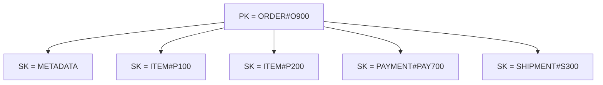
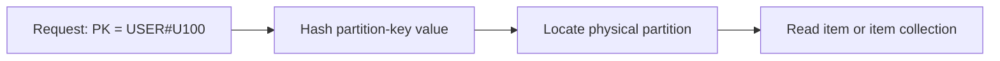
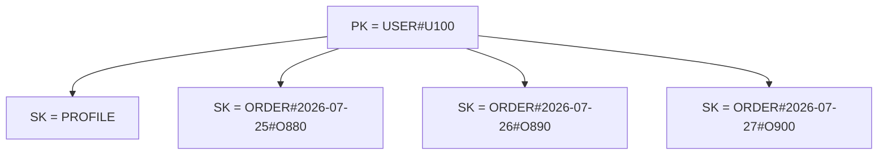
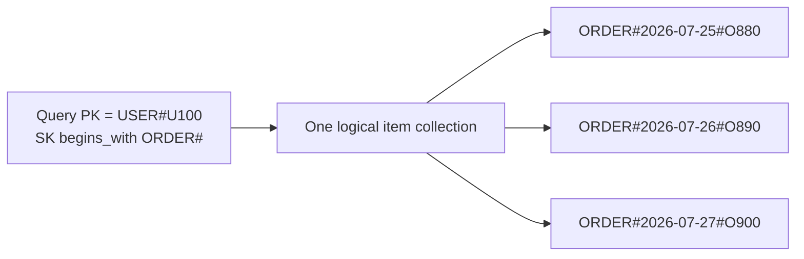
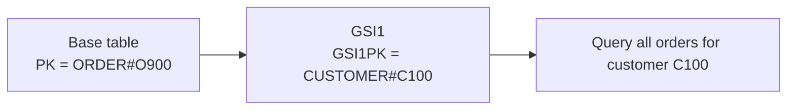
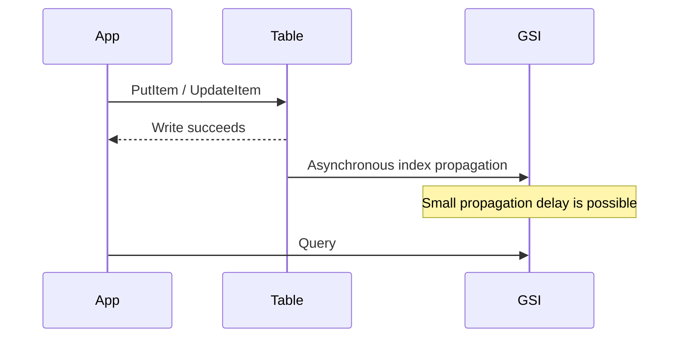
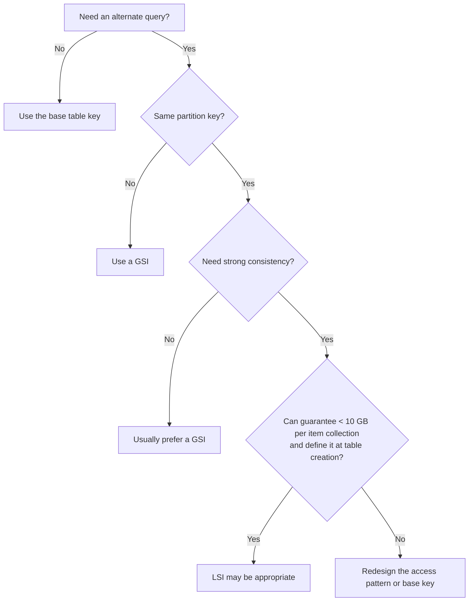
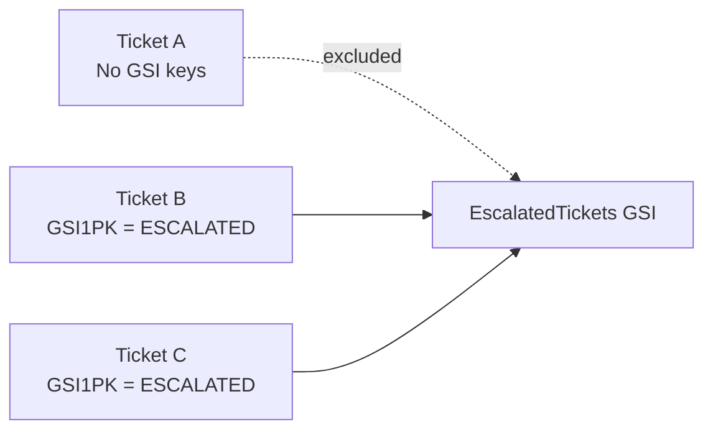
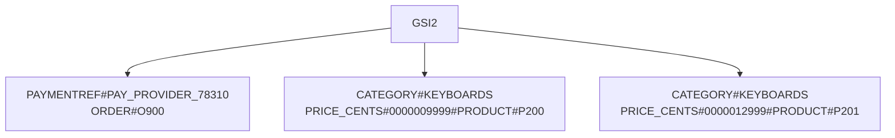
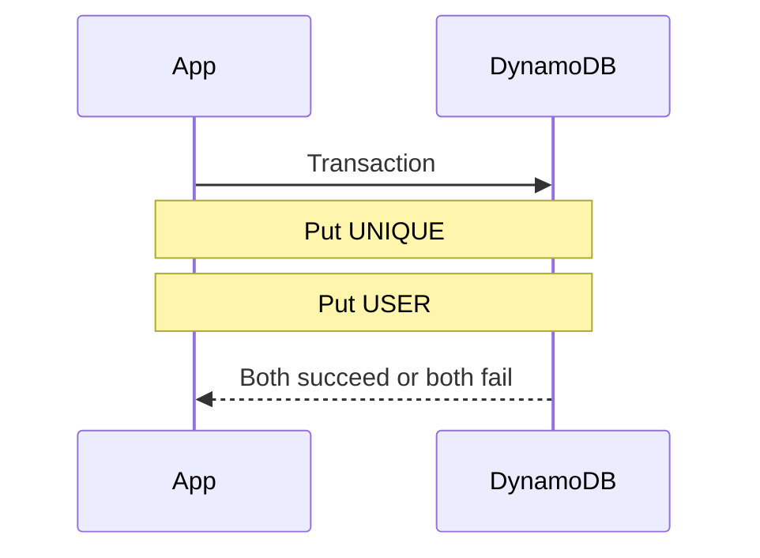

# DynamoDB: Keys, GSI/LSI, and Single-Table Design

> Build a practical understanding of DynamoDB key design, secondary indexes, and single-table modeling for real application development and technical interviews.

## In short

- A primary key is either a partition key alone or a partition key plus a sort key; the pair must be unique.
- The partition key controls distribution, so it needs high cardinality and even traffic or one value becomes a hot partition.
- The sort key orders items inside one partition-key value, which is what models one-to-many, hierarchy, time ranges, and prefix queries.
- A `Query` needs an exact partition-key value plus an optional sort-key condition; a `FilterExpression` runs after the read, so it does not reduce read work.
- A GSI adds a new access path across the whole table but is eventually consistent only; an LSI adds another sort order inside the same partition key, must exist at table creation, and caps the item collection at 10 GB.
- Single-table design stores several entity types in one table under prefixed keys such as `USER#U100` and `ORDER#O900`, so one query returns a whole aggregate.
- Model access patterns first: list every operation the application must run, then design a key path for each one.



**Interview answer:** Single-table design stores multiple entity types — users, orders, order lines, payments — in one table, keyed so that the items read together share a partition-key value and form one item collection. DynamoDB pushes you toward it because there are no joins: the only efficient way to fetch a parent and its children together is to make them one `Query` on one partition key. So you list the application's access patterns first, then design `PK`/`SK` and any GSIs to serve each one.

**Gotcha:** The common mistake is modelling relationally first — normalizing entities into separate tables and expecting to join them later — instead of starting from the access patterns the application must serve.

---

# 1. DynamoDB Mental Model

Amazon DynamoDB is a fully managed, serverless NoSQL database designed for predictable low-latency access at scale.

A relational database usually starts with:

- Entities
- Tables
- Relationships
- Normalization
- Joins

DynamoDB design usually starts with:

- Application access patterns
- Primary-key values
- Item collections
- Query operations
- Intentional denormalization

The important mindset is:

> Do not first ask, “What tables do I have?”  
> Ask, “What data must the application read or write in one request?”

## Relational vs DynamoDB Thinking

| Relational database | DynamoDB |
|---|---|
| Normalize entities into separate tables | Store related items together when they are read together |
| Query many columns using flexible SQL | Query efficiently through known key-based access patterns |
| Relationships are resolved using joins | Relationships are represented through key structure |
| Schema is mainly column-oriented | Items can have different attributes |
| Indexes are often added after implementation | Key and index design should be planned before implementation |

## Core Structure

```text
Table
 ├── Item
 │    ├── Primary-key attributes
 │    └── Other attributes
 ├── Item
 └── Item
```

A DynamoDB table does not require every item to have the same non-key attributes.

Example:

```json
{
  "PK": "USER#U100",
  "SK": "PROFILE",
  "name": "Aarav",
  "email": "aarav@example.com"
}
```

```json
{
  "PK": "USER#U100",
  "SK": "ORDER#O900",
  "status": "PAID",
  "total": 149.99
}
```

Both items can exist in the same table because they share the table's primary-key attribute names, even though their remaining attributes differ.

---

# 2. Primary Keys

A DynamoDB primary key uniquely identifies an item.

DynamoDB supports two primary-key forms:

1. **Simple primary key** — partition key only
2. **Composite primary key** — partition key plus sort key

---

## 2.1 Partition Key

The partition key determines how DynamoDB distributes data internally.

DynamoDB hashes the partition-key value and uses the result to locate the physical partition that stores the item.



A good partition key normally has:

- High cardinality
- Even traffic distribution
- No permanently hot value
- A clear relationship to an access pattern

### Good Partition-Key Candidates

```text
USER#<user_id>
ORDER#<order_id>
TENANT#<tenant_id>
DEVICE#<device_id>
ACCOUNT#<account_id>
```

### Risky Partition-Key Candidates

```text
STATUS#ACTIVE
COUNTRY#INDIA
TYPE#ORDER
DATE#2026-07-27
```

These values may place a very large amount of traffic or data under a small number of keys.

A low-cardinality attribute can still be useful as a GSI key when its traffic is controlled, sharded, or combined with another distribution strategy. It is usually risky as the main table partition key.

---

## 2.2 Sort Key

A sort key groups related items under the same partition-key value and stores them in sorted order.

Example:

```text
PK = USER#U100
SK = ORDER#2026-07-27T10:30:00Z#O900
```

All items with `PK = USER#U100` form an **item collection**.



### Why Sort Keys Are Powerful

They support:

- One-to-many relationships
- Hierarchical data
- Time-ordered records
- Prefix queries
- Range queries
- Version history
- Multiple entity types in one item collection

### Common Sort-Key Patterns

```text
PROFILE
ORDER#<order_id>
ORDER#<created_at>#<order_id>
ADDRESS#<address_id>
INVOICE#<year>#<invoice_id>
COMMENT#<created_at>#<comment_id>
```

### Sort Order Matters

String sort keys use UTF-8 byte order. For naturally ordered timestamps, use ISO 8601:

```text
2026-07-01T08:00:00Z
2026-07-10T09:30:00Z
2026-07-27T12:15:00Z
```

For numeric values encoded as strings, use zero padding where necessary:

```text
SCORE#000005
SCORE#000050
SCORE#000500
```

Without padding, lexical order may produce unexpected results:

```text
1
10
100
2
20
```

---

## 2.3 Simple vs Composite Primary Key

### Simple Primary Key

The primary key is `PK` alone, so the partition-key value must be unique across the table.

Example:

```json
{
  "UserId": "U100",
  "name": "Aarav"
}
```

Use it when each partition key maps to exactly one item.

### Composite Primary Key

The primary key is `PK` plus `SK`. The combined value must be unique, but multiple items may share the same `PK`.

Example:

| PK | SK | Entity |
|---|---|---|
| `USER#U100` | `PROFILE` | User profile |
| `USER#U100` | `ORDER#O900` | Order |
| `USER#U100` | `ORDER#O901` | Order |

Uniqueness is evaluated using the complete `(PK, SK)` pair, so `(USER#U100, ORDER#O900)` and `(USER#U100, ORDER#O901)` are two different items.

### Practical Rule

Use a composite primary key when the application must retrieve:

- A parent and its children
- A collection of related records
- Records ordered by date, score, version, or category
- Multiple entity types with one `Query`

---

## 2.4 How Query Uses Keys

A DynamoDB `Query` requires:

- Equality on one partition-key value
- An optional condition on the sort key

Supported sort-key conditions include:

```text
=
<
<=
>
>=
BETWEEN
begins_with
```

### Conceptual Query

```sql
PK = 'USER#U100'
AND begins_with(SK, 'ORDER#')
```

This returns the user's order items without scanning unrelated partitions.



### Query vs Scan

| Operation | Behavior | Typical use |
|---|---|---|
| `GetItem` | Reads one item using its full primary key | Exact lookup |
| `BatchGetItem` | Reads multiple known items | Multiple exact lookups |
| `Query` | Reads items for one partition-key value | Normal application access |
| `Scan` | Reads every item or index entry examined | Administration, migration, rare background work |

A `FilterExpression` is applied after DynamoDB reads the candidate items. It can reduce returned data, but it does not reduce the read work already performed.

Therefore:

> Put frequently used filtering conditions into keys whenever possible.

---

## 2.5 Good Key Design

### Choose High-Cardinality Partition Keys

Prefer:

```text
CUSTOMER#C100392
DEVICE#D893120
ORDER#O783910
```

Avoid placing all writes under:

```text
CURRENT
TODAY
ACTIVE
DEFAULT
```

### Add Type Prefixes

Prefix key values with the entity type — `USER#U100` rather than a bare `U100`. Section 4.3 covers what that buys you.

### Avoid Unbounded Item Collections

A key such as `PK = TENANT#T1` may become too large or too hot when one tenant owns millions of records.

Possible alternatives:

```text
TENANT#T1#2026-07
TENANT#T1#SHARD#01
TENANT#T1#PROJECT#P100
```

The correct choice depends on the required queries.

### Design for Traffic, Not Only Data Size

A partition-key value can be problematic even with little stored data if most requests target that one value.

Ask:

- How many writes per second target this key?
- How many reads per second target this key?
- Can one customer, tenant, or status dominate traffic?
- Will a time-based key make all current writes hit one partition-key value?

---

# 3. Secondary Indexes

A secondary index creates an additional key-based view of table data.

The table's primary key might support "get an order by order ID", while the application may also need:

```text
Get all orders for a customer
Get all pending orders
Get orders by external payment ID
Get products by category and price
```

A secondary index supports an access pattern that the base primary key cannot efficiently answer.

---

## 3.1 Why Secondary Indexes Exist

Assume the table's primary key is:

```text
PK = ORDER#<order_id>
SK = METADATA
```

This efficiently supports "get order O900", but not "get all orders for customer C100".

A GSI can provide another key structure:

```text
GSI1PK = CUSTOMER#C100
GSI1SK = ORDER#2026-07-27T10:30:00Z#O900
```



A secondary index is not a separate source of truth. DynamoDB maintains it from base-table writes.

---

## 3.2 Global Secondary Index (GSI)

A GSI can use:

- A partition key different from the base table
- An optional sort key different from the base table
- Keys that are unrelated to the base primary key

Example:

```text
Base table:
PK = ORDER#O900
SK = METADATA

GSI1:
GSI1PK = CUSTOMER#C100
GSI1SK = 2026-07-27T10:30:00Z#ORDER#O900
```

### GSI Characteristics

Section 3.4 compares GSI and LSI feature by feature. Two GSI properties are easy to miss in that comparison:

- Does not enforce uniqueness on index-key values
- Is sparse by default: only items containing the required index-key attributes appear in it

### Eventual Consistency

A successful base-table write may not appear in the GSI immediately.



Do not immediately read a GSI when correctness requires read-after-write consistency. Read the base table using the primary key, or model the critical access path differently.

### GSI Write Impact

When an item has GSI key attributes, a base-table write also causes an index write, so one application write becomes a base-table write plus a GSI update.

In provisioned mode, insufficient GSI write capacity can throttle writes associated with that index. Monitor table and index metrics separately.

### Example: Orders by Status

```text
GSI1PK = STATUS#PENDING
GSI1SK = 2026-07-27T10:30:00Z#ORDER#O900
```

A query on `GSI1PK = STATUS#PENDING` returns every pending order, but that single value may become a hot partition-key value.

A sharded design can distribute traffic:

```text
GSI1PK = STATUS#PENDING#SHARD#00
GSI1PK = STATUS#PENDING#SHARD#01
...
GSI1PK = STATUS#PENDING#SHARD#09
```

The application queries all shards in parallel and merges the results.

Use sharding only when the measured or expected traffic justifies the added complexity.

---

## 3.3 Local Secondary Index (LSI)

An LSI uses:

- The same partition key as the base table
- A different sort key

Example:

```text
Base table:
PK = CUSTOMER#C100
SK = ORDER#O900

LSI1:
PK = CUSTOMER#C100
LSI1SK = 2026-07-27T10:30:00Z
```

This provides two orderings for the same item collection: the base table arranges orders by order identifier, the LSI arranges the same orders by creation time.

### Important LSI Limitation

With an LSI, all items sharing one base-table partition-key value form an item collection whose total size is limited to 10 GB, including the related LSI data.

If one customer such as `PK = CUSTOMER#C100` can generate an unbounded amount of order history, an LSI may create a long-term scaling constraint.

### When an LSI Is Reasonable

Use an LSI when all of these are true:

- You need an alternate sort order within the same partition-key value
- Strongly consistent index reads are required
- The item collection will safely remain below 10 GB
- The index requirements are known before table creation

In many modern designs, a GSI is preferred because it is more flexible.

---

## 3.4 GSI vs LSI

| Feature | GSI | LSI |
|---|---|---|
| Partition key | Can differ from table | Must match table |
| Sort key | Optional; can differ | Required; must differ from table sort key |
| Creation | At table creation or later | Only at table creation |
| Deletion | Can be deleted | Cannot be deleted independently |
| Read consistency | Eventually consistent only | Eventual or strong |
| Provisioned throughput | Separate from base table | Shared with base table |
| Per-partition-key size limit | No LSI-style 10 GB item-collection limit | 10 GB item-collection limit |
| Default quota | 20 per table | 5 per table |
| Typical use | New access pattern across the table | Alternate ordering within one item collection |
| Flexibility | High | Limited |

### Selection Guide



---

## 3.5 Index Projections

A projection controls which attributes are copied into an index.

### Projection Types

| Projection | Included data |
|---|---|
| `KEYS_ONLY` | Table primary-key attributes plus index-key attributes |
| `INCLUDE` | Keys plus selected non-key attributes |
| `ALL` | All base-item attributes |

### Trade-Off

```text
More projected attributes
    ├── Fewer follow-up reads
    ├── Larger index storage
    └── Higher write and storage cost
```

### GSI Behavior

A GSI query can return only attributes projected into that GSI. It cannot automatically fetch missing attributes from the base table.

Typical application flow with `KEYS_ONLY`:

1. Query the GSI
2. Receive base-table primary keys
3. Use `BatchGetItem` to fetch complete items

This may be efficient for occasional queries, but it adds another network round trip.

### LSI Behavior

When querying an LSI, DynamoDB can fetch non-projected attributes from the base table, but those fetches consume additional read capacity and add latency.

### Practical Projection Rule

Project only what the access pattern normally needs.

Example list endpoint:

```json
{
  "orderId": "O900",
  "createdAt": "2026-07-27T10:30:00Z",
  "status": "PAID",
  "total": 149.99
}
```

It may not need:

```json
{
  "shippingAddress": {},
  "paymentAudit": {},
  "allOrderLines": []
}
```

---

## 3.6 Sparse and Overloaded Indexes

### Sparse GSI

A GSI contains an item only when the item has all required GSI key attributes.

Example: only escalated tickets receive these fields:

```text
GSI1PK = ESCALATED
GSI1SK = 2026-07-27T10:30:00Z#TICKET#T900
```

Normal tickets omit the fields and therefore do not appear in the index.



Good sparse-index use cases include:

- Pending jobs
- Unprocessed events
- Escalated tickets
- Unpaid invoices
- Active sessions
- Failed tasks requiring retry

When the state changes, remove the GSI key attributes to remove the item from the index.

### Overloaded GSI

An overloaded GSI supports multiple entity-specific access patterns using the same generic GSI attributes.

Example:

```text
For orders:
GSI1PK = CUSTOMER#C100
GSI1SK = ORDER#2026-07-27#O900

For products:
GSI1PK = CATEGORY#LAPTOP
GSI1SK = PRICE#001299.99#PRODUCT#P200

For employees:
GSI1PK = DEPARTMENT#ENGINEERING
GSI1SK = EMPLOYEE#E500
```

The same physical GSI supports different logical queries because prefixes keep the namespaces separate.

Use overloading deliberately. Maintain a schema document so developers know which entity writes which index attributes.

---

# 4. Single-Table Design

## 4.1 What Single-Table Design Means

Single-table design stores multiple entity types in one DynamoDB table and arranges them around application access patterns.

For example, one table can contain:

- Users
- Addresses
- Orders
- Order lines
- Products
- Payments

This does not mean putting every unrelated system into one table without boundaries.

It means:

> Store highly related application data in a small number of tables, often one table, when doing so enables efficient key-based access.

### Example

```text
ApplicationTable
 ├── User item
 ├── Address item
 ├── Order item
 ├── Order-line item
 ├── Product item
 └── Payment item
```

Entity identity is usually encoded with prefixes: `USER#U100`, `ORDER#O900`, `PRODUCT#P200`, `PAYMENT#PAY700`.

---

## 4.2 Access-Pattern-First Modeling

Before creating the table, list the exact operations the application must support, then design a key path for each operation.

### Access-Pattern Matrix

| Access pattern | Operation | Key path |
|---|---|---|
| Get user profile | `GetItem` | `PK=USER#id`, `SK=PROFILE` |
| Get user addresses | `Query` | `PK=USER#id`, `SK begins_with ADDRESS#` |
| Get user orders | `Query` | `PK=USER#id`, `SK begins_with ORDER#` |
| Get order and lines | `Query` | `PK=ORDER#id` |
| Get pending orders | GSI `Query` | `GSI1PK=STATUS#PENDING` |
| Get category products | GSI `Query` | `GSI2PK=CATEGORY#name` |

Every important request should map to:

- A direct base-table key
- A base-table query
- A GSI query
- A deliberate batch operation

It should not normally depend on a full table scan.

---

## 4.3 Entity Prefixes

Entity prefixes make a polymorphic table readable.

```text
PK = USER#U100
SK = PROFILE
```

```text
PK = ORDER#O900
SK = METADATA
```

```text
PK = ORDER#O900
SK = ITEM#P200
```

### Benefits

- Prevents collisions between equal raw identifiers
- Makes CloudWatch logs and DynamoDB console output understandable
- Supports `begins_with`
- Communicates item type without inspecting every attribute
- Helps generic repository and mapper code

A separate `entityType` attribute is still useful:

```json
{
  "PK": "ORDER#O900",
  "SK": "METADATA",
  "entityType": "Order"
}
```

Do not rely only on parsing keys when explicit type information improves maintainability.

---

## 4.4 Item Collections

An item collection is the set of items sharing the same partition-key value. For example, `PK = ORDER#O900` holds these items:

```text
SK = METADATA
SK = ITEM#P100
SK = ITEM#P200
SK = PAYMENT#PAY700
SK = SHIPMENT#S300
```

One query can return the complete order aggregate, which replaces several relational joins with one key-based query.

The design intentionally duplicates some information when another access pattern needs a different grouping.

---

# 5. Complete E-Commerce Example

## 5.1 Requirements and Access Patterns

Assume an e-commerce application needs:

### User Operations

- Get a user profile
- Get a user's addresses
- List a user's orders newest first

### Order Operations

- Get one order
- Get all order lines
- Get payment and shipment information with the order

### Operational Operations

- List orders by status and creation time
- Find an order by payment-provider reference

### Product Operations

- Get one product
- List products by category and price

---

## 5.2 Key Schema

Base table:

```text
PK: String
SK: String
```

Indexes:

```text
GSI1PK: String
GSI1SK: String

GSI2PK: String
GSI2SK: String
```

### Logical Use

| Key | Purpose |
|---|---|
| Base `PK/SK` | Direct entities and aggregates |
| `GSI1` | Operational lookup: status or external reference |
| `GSI2` | Browse/list access patterns such as customer orders and category products |

One index can be overloaded when namespaces are clearly separated.

---

## 5.3 Sample Items

### User Profile

```json
{
  "PK": "USER#U100",
  "SK": "PROFILE",
  "entityType": "User",
  "name": "Aarav Mehta",
  "email": "aarav@example.com",
  "createdAt": "2026-07-01T09:00:00Z"
}
```

### User Address

```json
{
  "PK": "USER#U100",
  "SK": "ADDRESS#A10",
  "entityType": "Address",
  "label": "HOME",
  "city": "Ahmedabad",
  "country": "IN"
}
```

### User-to-Order Reference

This item lets the application list a user's orders without reading full order aggregates.

```json
{
  "PK": "USER#U100",
  "SK": "ORDER#2026-07-27T10:30:00Z#O900",
  "entityType": "UserOrder",
  "orderId": "O900",
  "status": "PAID",
  "total": 149.99
}
```

### Order Metadata

```json
{
  "PK": "ORDER#O900",
  "SK": "METADATA",
  "entityType": "Order",
  "orderId": "O900",
  "userId": "U100",
  "status": "PAID",
  "total": 149.99,
  "createdAt": "2026-07-27T10:30:00Z",

  "GSI1PK": "STATUS#PAID#SHARD#03",
  "GSI1SK": "2026-07-27T10:30:00Z#ORDER#O900",

  "GSI2PK": "PAYMENTREF#PAY_PROVIDER_78310",
  "GSI2SK": "ORDER#O900"
}
```

### Order Line

```json
{
  "PK": "ORDER#O900",
  "SK": "ITEM#P200",
  "entityType": "OrderItem",
  "productId": "P200",
  "productName": "Mechanical Keyboard",
  "quantity": 1,
  "unitPrice": 99.99
}
```

### Payment

```json
{
  "PK": "ORDER#O900",
  "SK": "PAYMENT#PAY700",
  "entityType": "Payment",
  "paymentId": "PAY700",
  "providerReference": "PAY_PROVIDER_78310",
  "status": "CAPTURED",
  "amount": 149.99
}
```

### Shipment

```json
{
  "PK": "ORDER#O900",
  "SK": "SHIPMENT#S300",
  "entityType": "Shipment",
  "shipmentId": "S300",
  "carrier": "ExampleCarrier",
  "trackingNumber": "TRK123456",
  "status": "IN_TRANSIT"
}
```

### Product

```json
{
  "PK": "PRODUCT#P200",
  "SK": "METADATA",
  "entityType": "Product",
  "name": "Mechanical Keyboard",
  "category": "KEYBOARDS",
  "price": 99.99,

  "GSI2PK": "CATEGORY#KEYBOARDS",
  "GSI2SK": "PRICE#000099.99#PRODUCT#P200"
}
```

---

## 5.4 Query Examples

The following Python examples use `boto3`.

### Get User Profile

```python
from typing import Any

import boto3
from boto3.dynamodb.conditions import Key

table = boto3.resource("dynamodb").Table("Commerce")

def get_user(user_id: str) -> dict[str, Any] | None:
    response = table.get_item(
        Key={
            "PK": f"USER#{user_id}",
            "SK": "PROFILE",
        },
        ConsistentRead=True,
    )
    return response.get("Item")
```

### Get User Addresses

```python
def list_user_addresses(user_id: str) -> list[dict[str, Any]]:
    response = table.query(
        KeyConditionExpression=(
            Key("PK").eq(f"USER#{user_id}")
            & Key("SK").begins_with("ADDRESS#")
        )
    )
    return response.get("Items", [])
```

### List User Orders, Newest First

```python
def list_user_orders(user_id: str) -> list[dict[str, Any]]:
    response = table.query(
        KeyConditionExpression=(
            Key("PK").eq(f"USER#{user_id}")
            & Key("SK").begins_with("ORDER#")
        ),
        ScanIndexForward=False,
    )
    return response.get("Items", [])
```

`ScanIndexForward=False` reverses sort-key order.

### Get Complete Order Aggregate

```python
def get_order(order_id: str) -> list[dict[str, Any]]:
    response = table.query(
        KeyConditionExpression=Key("PK").eq(f"ORDER#{order_id}")
    )
    return response.get("Items", [])
```

The response can contain:

- Order metadata
- Order lines
- Payment
- Shipment

The application maps each item by `entityType` or sort-key prefix.

### Find Order by Payment Reference

```python
def find_order_by_payment_reference(
    provider_reference: str,
) -> list[dict[str, Any]]:
    response = table.query(
        IndexName="GSI2",
        KeyConditionExpression=(
            Key("GSI2PK").eq(f"PAYMENTREF#{provider_reference}")
        ),
        Limit=1,
    )
    return response.get("Items", [])
```

The GSI key is not a uniqueness constraint. The application must enforce uniqueness if the business requires it.

### List Paid Orders for One Shard

```python
def list_paid_orders_for_shard(
    shard: int,
    start: str,
    end: str,
) -> list[dict[str, Any]]:
    shard_value = f"{shard:02d}"

    response = table.query(
        IndexName="GSI1",
        KeyConditionExpression=(
            Key("GSI1PK").eq(f"STATUS#PAID#SHARD#{shard_value}")
            & Key("GSI1SK").between(start, end)
        ),
    )
    return response.get("Items", [])
```

A production service querying all status shards should:

- Query shards concurrently with a controlled concurrency limit
- Merge results by timestamp
- Apply pagination carefully
- Preserve per-shard continuation keys

### List Products by Category and Price Range

```python
def list_products_by_price(
    category: str,
    minimum: float,
    maximum: float,
) -> list[dict[str, Any]]:
    lower = f"PRICE#{minimum:09.2f}"
    upper = f"PRICE#{maximum:09.2f}~"

    response = table.query(
        IndexName="GSI2",
        KeyConditionExpression=(
            Key("GSI2PK").eq(f"CATEGORY#{category}")
            & Key("GSI2SK").between(lower, upper)
        ),
    )
    return response.get("Items", [])
```

For production money values, store the amount in the smallest integer currency unit when appropriate, so `$99.99` becomes `9999` cents. This avoids floating-point comparison problems.

A more robust price sort key would be `PRICE_CENTS#0000009999#PRODUCT#P200`.

---

## 5.5 Adding GSIs

### GSI1: Orders by Status

```text
GSI1PK = STATUS#<status>#SHARD#<n>
GSI1SK = <created_at>#ORDER#<order_id>
```

This supports listing orders for a status within a time range.

### GSI2: Multiple Browse and Lookup Patterns

For payment lookup:

```text
GSI2PK = PAYMENTREF#<external_reference>
GSI2SK = ORDER#<order_id>
```

For product browsing:

```text
GSI2PK = CATEGORY#<category>
GSI2SK = PRICE_CENTS#<padded_price>#PRODUCT#<product_id>
```

This is an overloaded GSI.



---

# 6. Common Design Patterns

## 6.1 One-to-Many Relationship

Example: customer and orders.

```text
PK = CUSTOMER#C100
SK = PROFILE

PK = CUSTOMER#C100
SK = ORDER#2026-07-27#O900
```

Query the partition to retrieve the customer and orders, or use a sort-key prefix to retrieve only orders.

---

## 6.2 Hierarchical Sort Keys

Example:

```text
COUNTRY#IN
COUNTRY#IN#STATE#GJ
COUNTRY#IN#STATE#GJ#CITY#AHMEDABAD
```

This supports prefix queries at different hierarchy levels.

A business example:

```text
PROJECT#P100
PROJECT#P100#SPRINT#S10
PROJECT#P100#SPRINT#S10#TASK#T500
```

---

## 6.3 Time-Ordered Data

```text
PK = DEVICE#D100
SK = EVENT#2026-07-27T10:30:00.123Z#E900
```

This supports:

- Events for one device
- Events between two timestamps
- Newest or oldest first
- Pagination within one device

For very high-volume devices, add time buckets:

```text
PK = DEVICE#D100#2026-07
SK = EVENT#2026-07-27T10:30:00.123Z#E900
```

---

## 6.4 Write Sharding

A single logical key may receive too much write traffic. Instead of a single `PK = COUNTER#GLOBAL`, use:

```text
PK = COUNTER#GLOBAL#SHARD#00
PK = COUNTER#GLOBAL#SHARD#01
...
PK = COUNTER#GLOBAL#SHARD#19
```

Writes choose a shard. Reads aggregate all shards. The trade-off is better write distribution against more complex reads.

---

## 6.5 Version History

```text
PK = DOCUMENT#D100
SK = VERSION#000001
PK = DOCUMENT#D100
SK = VERSION#000002
PK = DOCUMENT#D100
SK = VERSION#000003
```

A pointer item may store the latest version:

```text
PK = DOCUMENT#D100
SK = CURRENT
latestVersion = 3
```

Update the current pointer and new version with a transaction when atomicity is required.

---

## 6.6 Uniqueness Constraint Pattern

DynamoDB enforces uniqueness only for the table primary key, not for GSI keys.

To enforce a unique email, create a dedicated lock item:

```text
PK = UNIQUE#EMAIL#aarav@example.com
SK = UNIQUE
```

Create the user and uniqueness item in one `TransactWriteItems` request with a condition that the uniqueness item must not already exist.



This is a common way to enforce application-level uniqueness.

---

## 6.7 Materialized Relationship Item

Sometimes the same relationship must be queried from both directions.

Example: users belong to teams.

```text
PK = TEAM#T100
SK = MEMBER#U100
```

```text
PK = USER#U100
SK = TEAM#T100
```

The relationship is duplicated intentionally.

Use a transaction if both copies must change atomically.

---

# 7. Capacity, Consistency, and Cost

## 7.1 Base-Table Writes May Produce Multiple Writes

One logical business operation may update:

- Base entity item
- Relationship/reference item
- GSI entries
- Uniqueness item
- Aggregate item

Single-table design can reduce read requests but may increase write amplification.

Measure the complete operation rather than counting only API calls made directly by application code.

---

## 7.2 Read Consistency

| Data source | Eventually consistent | Strongly consistent |
|---|---:|---:|
| Base table | Yes | Yes |
| LSI | Yes | Yes |
| GSI | Yes | No |
| DynamoDB Streams | Yes | No |

Use strong reads only where the business requires them because they consume more read capacity than eventually consistent reads.

Examples that may justify strong consistency:

- Immediately reading an updated account configuration
- Confirming a lock item
- Reading a just-written critical state from the base table

Examples usually suitable for eventual consistency:

- Product browse lists
- Search-style screens
- Dashboards
- Operational status queues tolerant of a short delay

---

## 7.3 Index Cost

Indexes add:

- Storage
- Write work
- Capacity requirements
- Operational monitoring
- Schema complexity

Do not create a GSI only because an attribute “might be useful later.”

Create it for a known, important access pattern.

---

## 7.4 Pagination

A DynamoDB `Query` returns up to 1 MB per page before filters are applied.

When `LastEvaluatedKey` is present, pass it back as `ExclusiveStartKey`.

```python
def query_all_pages(user_id: str) -> list[dict[str, Any]]:
    items: list[dict[str, Any]] = []
    last_key: dict[str, Any] | None = None

    while True:
        kwargs: dict[str, Any] = {
            "KeyConditionExpression": (
                Key("PK").eq(f"USER#{user_id}")
                & Key("SK").begins_with("ORDER#")
            )
        }

        if last_key is not None:
            kwargs["ExclusiveStartKey"] = last_key

        response = table.query(**kwargs)
        items.extend(response.get("Items", []))
        last_key = response.get("LastEvaluatedKey")

        if last_key is None:
            break

    return items
```

For APIs, normally expose a cursor rather than loading every page into memory.

---

## 7.5 Transactions

Use DynamoDB transactions when multiple writes must succeed or fail together.

Examples:

- Create user plus unique-email lock
- Create order plus inventory reservation
- Move relationship records between owners
- Write immutable event plus update current-state item

Do not use transactions by default. They cost more and should protect a real atomicity requirement.

---

# 8. When Single-Table Design Is a Good Fit

## Good Fit

Single-table design works well when:

- Access patterns are known
- The application is latency-sensitive
- Most reads follow predictable key paths
- Related entities are frequently retrieved together
- The team is comfortable with denormalization
- Scale and request cost matter
- The service owns its data model

Examples:

- E-commerce order service
- IoT telemetry service
- Gaming leaderboard
- Session and identity service
- Workflow/job-processing system
- Multi-tenant SaaS service
- Messaging conversations

## Consider Multiple Tables When

Multiple tables may be clearer when:

- Entity groups have almost no access correlation
- Different services independently own their data
- Backup, security, encryption, lifecycle, or capacity requirements differ
- The application has highly exploratory query requirements
- A migration needs temporary isolation
- Teams cannot safely coordinate one shared key schema
- The workload is analytical rather than operational

Single-table design is an optimization pattern, not a rule that every system must follow.

---

# 9. Practical Design Workflow

## Step 1: List Access Patterns

Write concrete operations:

```text
Get order by ID
List orders for customer
List pending orders by time
Get all items for order
Find order by payment reference
```

Avoid vague requirements such as "search orders in every possible way". DynamoDB is strongest when important queries are known.

---

## Step 2: Identify Result Shape

For each operation, define:

- One item or many items
- Required ordering
- Expected result size
- Pagination requirement
- Consistency requirement
- Read frequency
- Write frequency

---

## Step 3: Design the Base Primary Key

Place the highest-value and most common access patterns on the base table.

Example:

```text
PK = ORDER#<id>
SK = METADATA | ITEM#... | PAYMENT#... | SHIPMENT#...
```

---

## Step 4: Add GSIs for Remaining Access Patterns

For example, a `GSI1` for orders by customer and a `GSI2` for orders by status.

Try to overload an index only when:

- The key namespaces remain clear
- Projection requirements are compatible
- Traffic distribution remains safe
- The shared index is documented

---

## Step 5: Add Representative Sample Data

Create at least:

- A normal entity
- A parent with children
- A high-volume partition-key example
- An item that appears in a sparse index
- An item that does not appear in the sparse index

Sample items expose design problems earlier than diagrams alone.

---

## Step 6: Write Every Query

Implement or pseudocode each access pattern.

Verify that each operation uses:

- `GetItem`
- `BatchGetItem`
- `Query`
- GSI `Query`

Any required `Scan` should be explicitly justified.

---

## Step 7: Estimate Scale

Estimate:

- Item size
- Items per logical partition key
- Reads and writes per second
- GSI write amplification
- Large-tenant behavior
- Time-based traffic spikes
- Growth over multiple years

---

## Step 8: Test With Production-Like Distribution

A test with uniformly random users can hide real hot-key problems.

Test:

- One very large tenant
- One popular product
- One status receiving most orders
- A burst at the start of an hour or day
- Repeated access to the same key
- GSI propagation-sensitive flows

---

# 10. Best-Practice Checklist

## Keys

- [ ] Every important access pattern has a key-based path.
- [ ] Partition keys have sufficient cardinality.
- [ ] High-traffic values do not create hot keys.
- [ ] Sort keys support required range and prefix queries.
- [ ] Timestamps use an order-safe format.
- [ ] Numeric strings are padded when lexical sorting is used.
- [ ] Entity prefixes are consistent and documented.
- [ ] Item collections have a bounded or intentionally bucketed growth model.

## GSIs

- [ ] Every GSI supports a known access pattern.
- [ ] The GSI partition key distributes traffic safely.
- [ ] Eventual consistency is acceptable.
- [ ] Projection includes only required attributes.
- [ ] Write amplification is included in cost estimates.
- [ ] Sparse-index behavior is intentional.
- [ ] GSI keys are not incorrectly treated as uniqueness constraints.
- [ ] Index capacity and throttling are monitored separately.

## LSIs

- [ ] The LSI is required at table creation.
- [ ] Strongly consistent index reads are genuinely needed.
- [ ] The same partition key is appropriate.
- [ ] Each item collection will remain safely below 10 GB.
- [ ] The inability to add or remove the LSI later is accepted.

## Single-Table Design

- [ ] Access patterns were documented before schema design.
- [ ] Entity and relationship duplication is intentional.
- [ ] Transaction boundaries are defined.
- [ ] Every duplicated write has a consistency strategy.
- [ ] Pagination is designed, not added later.
- [ ] Large-tenant and hot-key scenarios were tested.
- [ ] The key schema is documented for future developers.
- [ ] Scans are limited to deliberate operational use cases.

---

# 11. Official References

- [Amazon DynamoDB Developer Guide — Core components](https://docs.aws.amazon.com/amazondynamodb/latest/developerguide/HowItWorks.CoreComponents.html)
- [DynamoDB read consistency](https://docs.aws.amazon.com/amazondynamodb/latest/developerguide/HowItWorks.ReadConsistency.html)
- [Using Global Secondary Indexes](https://docs.aws.amazon.com/amazondynamodb/latest/developerguide/GSI.html)
- [Local Secondary Indexes](https://docs.aws.amazon.com/amazondynamodb/latest/developerguide/LSI.html)
- [Improving data access with secondary indexes](https://docs.aws.amazon.com/amazondynamodb/latest/developerguide/SecondaryIndexes.html)
- [Best practices for partition-key design](https://docs.aws.amazon.com/amazondynamodb/latest/developerguide/bp-partition-key-design.html)
- [Best practices for sort keys](https://docs.aws.amazon.com/amazondynamodb/latest/developerguide/bp-sort-keys.html)
- [Best practices for secondary indexes](https://docs.aws.amazon.com/amazondynamodb/latest/developerguide/bp-indexes.html)
- [Data-modeling foundations](https://docs.aws.amazon.com/amazondynamodb/latest/developerguide/data-modeling-foundations.html)
- [DynamoDB service quotas](https://docs.aws.amazon.com/amazondynamodb/latest/developerguide/ServiceQuotas.html)

---

> **Study note:** The most valuable DynamoDB skill is not memorizing GSI and LSI definitions. It is taking a list of application access patterns and converting each one into a predictable primary-key or index query.
