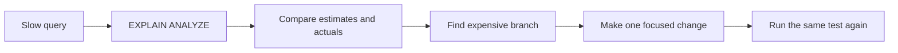
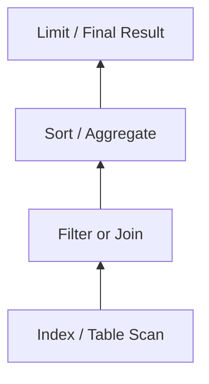

# EXPLAIN and EXPLAIN ANALYZE for Query Optimization

> Understand how a database executes a query, identify expensive work, and verify optimizations with evidence.

**Primary examples:** PostgreSQL 18  
**Also covered:** MySQL 8.4, SQL Server 2025, and SQLite

## In short

- `EXPLAIN` shows the plan the optimizer expects to use.
- `EXPLAIN ANALYZE` executes the statement and adds actual runtime information such as time, rows, and loops.
- PostgreSQL `cost=...` values are planner units, **not milliseconds**.
- Compare **estimated rows vs actual rows** first. Large differences often explain poor scan or join choices.
- For repeated nodes, PostgreSQL reports actual time and rows as averages per execution; use `loops` to understand the total work.
- A `Seq Scan` is not automatically bad. It is suspicious when a large table is scanned to return very few rows.
- In PostgreSQL 18, `ANALYZE` implicitly enables `BUFFERS`, so analyzed plans include buffer activity unless it is disabled.
- Never add every node's time together because a parent node includes work done by its children.
- `EXPLAIN ANALYZE` really executes the statement, including data-changing statements.



---

# 1. Why Execution Plans Matter

SQL is **declarative**: you describe the result you want, while the database decides how to produce it.

```sql
SELECT id, customer_id, created_at
FROM orders
WHERE customer_id = 42;
```

The optimizer may choose to:

- scan the table;
- use an index;
- combine indexes;
- execute work in parallel;
- use a nested loop, hash join, or merge join;
- sort in memory or spill temporary data to disk.

An execution plan makes those decisions visible.

For normal development, plans are most useful when answering:

- Is the expected index being used?
- Is the database reading far more rows than it returns?
- Are row-count estimates accurate?
- Is a join repeatedly executing an inner lookup?
- Is sorting or hashing using temporary disk space?
- Did an index or query rewrite actually improve the workload?

---

# 2. EXPLAIN vs EXPLAIN ANALYZE

## 2.1 `EXPLAIN`

`EXPLAIN` creates the execution plan without executing a normal `SELECT`.

```sql
EXPLAIN
SELECT *
FROM orders
WHERE customer_id = 42;
```

Use it when you want to inspect the optimizer's expected plan safely.

It mainly gives:

- estimated startup and total cost;
- estimated rows;
- estimated row width;
- selected scan and join operations.

## 2.2 `EXPLAIN ANALYZE`

`EXPLAIN ANALYZE` executes the statement and measures what actually happened.

```sql
EXPLAIN ANALYZE
SELECT *
FROM orders
WHERE customer_id = 42;
```

For PostgreSQL 18, a practical command is:

```sql
EXPLAIN (ANALYZE, BUFFERS, SETTINGS)
SELECT *
FROM orders
WHERE customer_id = 42;
```

`ANALYZE` already enables `BUFFERS` in PostgreSQL 18, but writing it explicitly makes the intention clear.

It adds information such as:

- actual startup and completion time;
- actual rows;
- loops;
- rows removed by filters;
- buffer activity;
- sort and hash details;
- planning and execution time.

## 2.3 Main difference

| Command | Executes statement? | Estimates | Actual runtime data | Typical use |
|---|---:|---:|---:|---|
| `EXPLAIN` | No for a normal `SELECT` | Yes | No | Inspect the expected plan |
| `EXPLAIN ANALYZE` | Yes | Yes | Yes | Diagnose and validate performance |

> **Important:** `EXPLAIN ANALYZE` executes `INSERT`, `UPDATE`, `DELETE`, and `MERGE` operations too.

---

# 3. How to Read a PostgreSQL Plan

Execution plans are trees. Child nodes produce rows for their parent nodes.

```text
Limit
└── Sort
    └── Index Scan on orders
```

Read the branch from the deepest child upward:

1. `Index Scan` finds rows.
2. `Sort` orders them.
3. `Limit` returns only the required rows.

A useful mental model is:



## 3.1 Core plan metrics

Example:

```text
Index Scan using idx_orders_customer_id on orders
  (cost=0.43..12.47 rows=5 width=64)
  (actual time=0.031..0.045 rows=4 loops=1)
```

### `cost=0.43..12.47`

`startup cost .. total cost`

These are **internal planner cost units**, not milliseconds.

The optimizer compares alternative plans using these estimated costs.

### `rows=5`

Estimated number of rows produced by the node.

This estimate strongly affects:

- scan choice;
- join order;
- join algorithm;
- memory decisions;
- parallel execution.

### `width=64`

Estimated average output-row size in bytes.

Wide rows increase memory, copying, sorting, hashing, and I/O requirements.

### `actual time=0.031..0.045`

Approximate:

```text
time to first row .. time to finish the node
```

These values are measured in milliseconds.

### `actual rows=4`

Rows actually returned **per loop**.

### `loops=1`

Number of times the node executed.

If a node shows:

```text
actual time=0.010..0.020 rows=1 loops=5000
```

its completion time is roughly:

```text
0.020 ms × 5000 = 100 ms
```

This is why a tiny inner lookup can become expensive inside a large nested loop.

## 3.2 Estimated rows vs actual rows

One of the strongest signals is:

```text
Estimated rows: 100
Actual rows:    10,000
```

The optimizer expected 100 rows but processed 10,000.

Large estimation errors can cause it to choose:

- a nested loop instead of a hash join;
- repeated index lookups instead of a scan;
- a poor join order;
- insufficient memory for a sort or hash;
- no parallelism when parallel work could help.

Common reasons include:

- stale statistics;
- skewed values;
- correlated columns;
- unusual parameter values;
- complex expressions;
- rapidly changing data.

For PostgreSQL, refresh statistics when appropriate:

```sql
ANALYZE orders;
```

## 3.3 Do not add node times

A parent's time includes work performed by its descendants.

For example:

```text
Hash Join      actual time=1..20
├── Seq Scan   actual time=0..12
└── Hash       actual time=0..5
```

Do **not** calculate `20 + 12 + 5`.

Use the tree to find which branch is responsible for the work.

---

# 4. Important Plan Operations

## 4.1 Sequential Scan

```text
Seq Scan on orders
```

The database reads most or all of the table.

This can be correct when:

- the table is small;
- many rows are required;
- the filter is not selective;
- no useful index exists;
- sequential reading is cheaper than many index lookups.

A sequential scan becomes suspicious when a very large table is scanned to return only a tiny result.

## 4.2 Index Scan

```text
Index Scan using idx_orders_customer_id on orders
```

The index finds matching entries, then PostgreSQL retrieves the required table rows.

Best suited to selective predicates.

## 4.3 Index-Only Scan

```text
Index Only Scan using idx_orders_customer_created on orders
```

The required values can be obtained from the index itself.

This can reduce heap access, although PostgreSQL may still need heap visibility checks depending on the visibility map.

## 4.4 Bitmap Scan

```text
Bitmap Heap Scan on orders
└── Bitmap Index Scan on idx_orders_status
```

Useful when more than a few rows match and PostgreSQL can group row locations before accessing table pages.

## 4.5 Nested Loop Join

```text
Nested Loop
├── outer input
└── inner lookup
```

Works well when:

- the outer result is small;
- the inner side has an efficient index lookup.

Watch for a large `loops` value on the inner node.

## 4.6 Hash Join

```text
Hash Join
├── input
└── Hash
    └── input
```

Common for equality joins over medium or large inputs.

Watch for multiple hash batches or temporary I/O, which can indicate that the hash work exceeded available memory.

## 4.7 Merge Join

```text
Merge Join
├── sorted input
└── sorted input
```

Useful when both inputs are already ordered by the join key or can be sorted efficiently.

## 4.8 Sort

In-memory example:

```text
Sort Method: quicksort  Memory: 2048kB
```

Disk-spill example:

```text
Sort Method: external merge  Disk: 128000kB
```

A spill is a signal to check:

- how many rows are being sorted;
- row width;
- whether filtering can happen earlier;
- whether an index can provide the required order;
- memory configuration.

---

# 5. One Practical Optimization Example

Assume this query is common in an API:

```sql
SELECT id, customer_id, created_at
FROM orders
WHERE customer_id = 42
ORDER BY created_at DESC
LIMIT 20;
```

## 5.1 Existing index

```sql
CREATE INDEX idx_orders_customer_id
ON orders (customer_id);
```

A possible plan is:

```text
Limit
└── Sort
    Sort Key: created_at DESC
    └── Bitmap Heap Scan on orders
        └── Bitmap Index Scan on idx_orders_customer_id
```

The index helps find the customer's orders, but PostgreSQL still has to sort the matching rows.

## 5.2 Better index for this access pattern

```sql
CREATE INDEX idx_orders_customer_created
ON orders (customer_id, created_at DESC);
```

A possible improved plan is:

```text
Limit
└── Index Scan using idx_orders_customer_created on orders
    Index Cond: (customer_id = 42)
```

Why it helps:

1. `customer_id` supports the equality filter.
2. `created_at DESC` matches the requested order.
3. PostgreSQL can read rows in the required order.
4. It can stop after 20 rows instead of sorting every matching order.

The important lesson is not "always create a composite index." The index should match a real, frequent access pattern and should be verified with another analyzed plan.

---

# 6. Using BUFFERS to Understand I/O

PostgreSQL buffer information can look like:

```text
Buffers: shared hit=120 read=8
```

| Metric | Meaning |
|---|---|
| `shared hit` | Block was already available in PostgreSQL shared buffers |
| `shared read` | Block had to be read into shared buffers |
| `shared dirtied` | Query changed a previously clean shared block |
| `shared written` | A dirty shared block was written by the backend |
| `temp read/written` | Temporary-file I/O, often from sorts or hashes |

A `shared read` does not necessarily mean a physical disk read because the operating system may still have the block cached.

Why buffers matter:

```text
Query A: shared hit=25,000
Query B: shared hit=300
```

Even if both are currently fast, Query A touches far more pages and can create more cache and I/O pressure under concurrency.

---

# 7. A Reliable Query-Tuning Workflow

Use a **measure → change → measure** process.

## Step 1: Capture the real query

Use representative:

- parameters;
- joins;
- filters;
- ordering;
- pagination;
- schema and indexes.

Different parameter values can produce very different plans.

## Step 2: Capture a baseline

```sql
EXPLAIN (ANALYZE, BUFFERS, SETTINGS)
SELECT ...;
```

Record:

- execution time;
- actual rows;
- loops;
- buffer activity;
- temporary I/O;
- sort/hash behavior.

## Step 3: Find the expensive branch

Look for:

- large estimated-vs-actual row differences;
- scans reading many rows but returning few;
- high `time × loops`;
- many rows removed by filters;
- repeated inner lookups;
- disk-based sorts or hashes.

## Step 4: Understand why

Ask whether the issue comes from:

- missing or unsuitable indexes;
- stale statistics;
- low-selectivity predicates;
- non-sargable expressions;
- poor join conditions;
- too many selected columns;
- ordering or pagination requirements.

## Step 5: Make one focused change

Typical changes:

- add or adjust an index;
- refresh statistics;
- rewrite a predicate so an index can be used;
- reduce rows before sorting or joining;
- return only required columns;
- use keyset pagination for large paginated datasets where appropriate.

## Step 6: Measure again

Compare the same query under similar conditions.

```text
Before: 850 ms, 120,000 shared blocks
After:   35 ms,   2,500 shared blocks
```

A plan that merely looks different is not enough. The workload metric should actually improve.

---

# 8. Safe Use in Development and Production

## 8.1 Data-changing statements

`EXPLAIN ANALYZE` executes the statement.

A PostgreSQL testing pattern is:

```sql
BEGIN;

EXPLAIN (ANALYZE, BUFFERS)
UPDATE orders
SET status = 'archived'
WHERE created_at < DATE '2024-01-01';

ROLLBACK;
```

This rolls back transactional table changes, but the statement still runs.

Be aware that:

- locks can still be acquired;
- triggers still execute;
- sequences are generally not rolled back;
- external side effects may not be reversible;
- WAL and temporary work may still be generated.

For production, start with plain `EXPLAIN` when actual execution is risky.

## 8.2 Test realistic data

Plans depend heavily on:

- table size;
- data distribution;
- tenant size;
- null frequency;
- date ranges;
- parameter values;
- concurrency.

A query that works well on a small development database can behave very differently in production.

## 8.3 Avoid tuning from one cached run

Run comparable tests more than once and inspect buffer activity.

Do not compare a cold first run directly with a fully cached later run and assume the plan change caused the difference.

---

# 9. Database-Specific Syntax

The main idea is the same across databases, but commands and terminology differ.

## 9.1 PostgreSQL 18

```sql
EXPLAIN
SELECT ...;
```

```sql
EXPLAIN (ANALYZE, BUFFERS)
SELECT ...;
```

Important fields:

- `cost`;
- estimated `rows` and `width`;
- `actual time`, actual `rows`, and `loops`;
- `Rows Removed by Filter`;
- `Buffers`;
- sort/hash details;
- planning and execution time.

PostgreSQL 18 implicitly enables `BUFFERS` with `ANALYZE`.

## 9.2 MySQL 8.4

```sql
EXPLAIN FORMAT=TREE
SELECT ...;
```

```sql
EXPLAIN ANALYZE
SELECT ...;
```

MySQL 8.4 `EXPLAIN ANALYZE`:

- executes the supported statement;
- always uses `TREE` output;
- reports estimated cost and rows;
- reports actual first-row time, execution time, rows, and loops.

Unlike normal `EXPLAIN`, `EXPLAIN ANALYZE` does not support JSON output in MySQL 8.4.

## 9.3 SQL Server 2025

SQL Server commonly uses graphical execution plans.

- **Estimated Execution Plan:** shows the compiled plan without executing the query.
- **Actual Execution Plan:** is produced after execution and includes runtime information.
- Common operators include Index Seek, Index Scan, Table Scan, Nested Loops, Hash Match, Merge Join, Sort, and Aggregate.

A key diagnostic is still:

```text
Estimated rows ↔ Actual rows
```

## 9.4 SQLite

```sql
EXPLAIN QUERY PLAN
SELECT ...;
```

Typical output:

```text
SCAN orders
```

or:

```text
SEARCH orders USING INDEX idx_orders_customer_id (customer_id=?)
```

Useful SQLite terms:

- `SCAN` — all rows are visited;
- `SEARCH` — only a subset is visited;
- `USING COVERING INDEX` — required values can be obtained from the index;
- `USE TEMP B-TREE FOR ORDER BY` — temporary sorting is required.

SQLite documents `EXPLAIN QUERY PLAN` as an interactive debugging format, so applications should not depend on its exact output format.

---

# 10. What to Remember

When you open an execution plan, check these relationships first:

```text
Estimated rows  ↔ Actual rows
Actual time     × Loops
Rows processed  ↔ Rows returned
Memory work     ↔ Disk spill
Buffer activity ↔ Query result size
```

A practical reading order is:

1. Check total execution time.
2. Compare estimated and actual rows.
3. Find branches with high time or many loops.
4. Look for large scans returning few rows.
5. Check rows removed by filters.
6. Inspect join strategy and repeated inner lookups.
7. Check sort/hash memory and temporary I/O.
8. Review buffer activity.
9. Make one focused change.
10. Run the same test again.

The key interview-level idea is simple:

> An execution plan is evidence of **how the optimizer expected the query to run** and, with `ANALYZE`, **how it actually ran**. Effective tuning comes from comparing those two views and changing the real source of unnecessary work.
