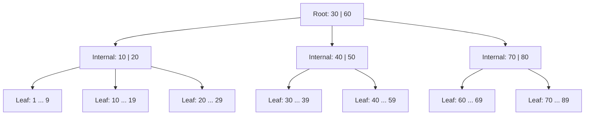
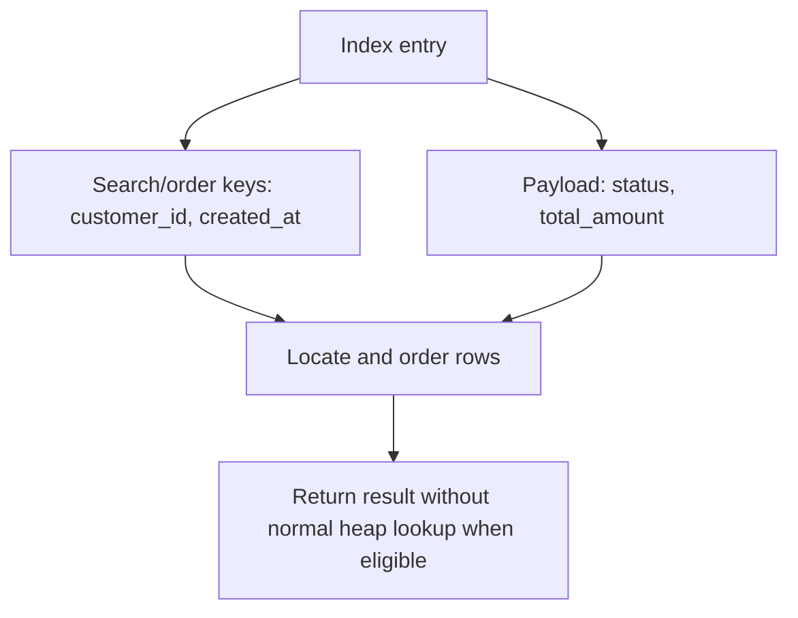
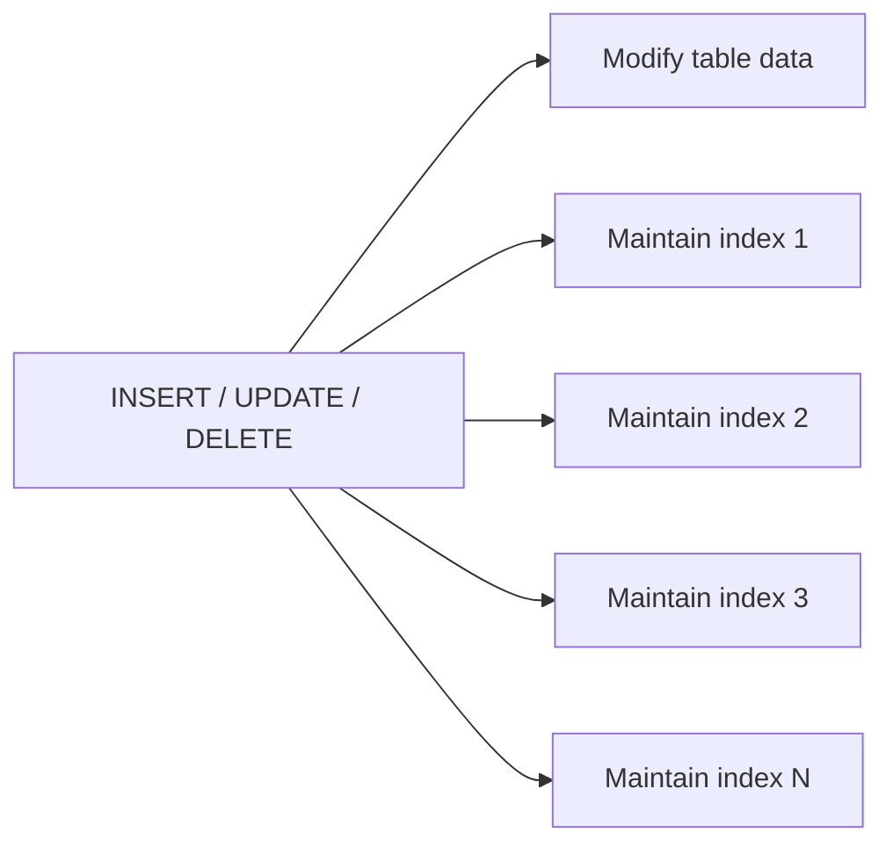
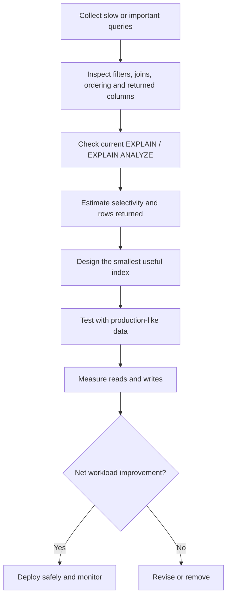
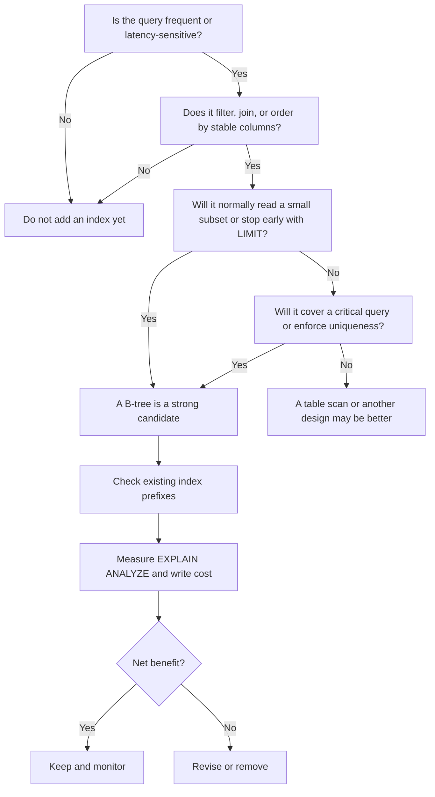

# B-Tree Indexing: When It Helps vs When It Hurts

> **Topic:** Databases & SQL  
> **Level:** Intermediate developer / interview preparation  
> **Last reviewed:** July 2026  
> **Primary examples:** PostgreSQL and MySQL/InnoDB

---

# 1. Why Indexing Matters

Without a useful index, a database may need to inspect every row in a table to find the required data.

```text
Table scan

Row 1  -> check
Row 2  -> check
Row 3  -> check
...
Row N  -> check
```

For a table containing ten million rows, scanning the entire table for one customer can be wasteful.

A B-tree index keeps selected column values in sorted order and stores references to the corresponding table rows. The database can navigate the tree, locate the required value, and read only the relevant part of the table.

```text
Index search

Root page
   |
   v
Internal page
   |
   v
Leaf page containing the target key
   |
   v
Matching table row(s)
```

However, an index is not free. Every additional index consumes storage and normally has to be maintained when rows are inserted, updated, or deleted.

The important engineering question is therefore not:

> “Should this column have an index?”

It is:

> “Does this index improve the real workload enough to justify its write, storage, and maintenance cost?”

---

# 2. What a B-Tree Index Is

A B-tree is a balanced, ordered, multi-level search structure.

A simplified B-tree might look like this:



Each node can contain many keys and child pointers. Database pages are usually large enough to hold many index entries, so each tree level eliminates a large part of the search space.

## 2.1 B-tree vs B+ tree terminology

Database documentation commonly uses the term **B-tree**, although many relational database implementations behave more like a **B+ tree**:

- Internal nodes guide navigation.
- Leaf nodes contain the searchable index entries.
- Leaf pages are ordered, making sequential range scans efficient.

For application development and interviews, calling it a **B-tree index** is correct unless discussing storage-engine internals in detail.

## 2.2 How lookup works

Assume an index exists on `users.email`:

```sql
CREATE INDEX idx_users_email ON users (email);
```

The query is:

```sql
SELECT id, name
FROM users
WHERE email = 'alex@example.com';
```

Conceptually, the database performs these steps:

1. Read the root page.
2. Choose the branch containing `alex@example.com`.
3. Continue through one or more internal pages.
4. Reach the matching leaf entry.
5. Use the row reference to retrieve the required table row, unless the query can be answered entirely from the index.


## 2.3 Why the tree stays fast

A B-tree remains balanced as data changes. All leaf entries stay at approximately the same depth, avoiding a long linked-list-style search path.

Lookup is commonly described as approximately:

```text
O(log N)
```

A range scan is commonly approximated as:

```text
O(log N + K)
```

Where:

- `N` is the number of indexed entries.
- `K` is the number of matching entries returned from the range.

This notation is useful as a mental model, but actual database cost also depends on:

- Page reads and cache hits
- Row width
- Data distribution
- Table-to-index correlation
- Number of rows returned
- Storage type
- Concurrency
- Database statistics

---

# 3. What SQL Operations a B-Tree Supports

B-tree indexes are designed for values that can be placed in a consistent sorted order.

They commonly support:

| Operation | Example | Usually B-tree-friendly? |
|---|---|---:|
| Equality | `customer_id = 42` | Yes |
| Range | `created_at >= '2026-01-01'` | Yes |
| Between | `amount BETWEEN 100 AND 500` | Yes |
| Set of values | `status IN ('NEW', 'PAID')` | Often |
| Less/greater than | `price < 1000` | Yes |
| Null check | `deleted_at IS NULL` | Database-dependent, commonly yes |
| Prefix match | `name LIKE 'Ava%'` | Often, with collation/operator considerations |
| Leading wildcard | `name LIKE '%ava%'` | Usually no |
| Ordering | `ORDER BY created_at` | Yes, when index order matches |
| Minimum/maximum | `MIN(created_at)` | Often |
| Exact join key | `orders.customer_id = customers.id` | Often |

PostgreSQL's B-tree planner support includes equality and ordered comparisons such as `<`, `<=`, `=`, `>=`, and `>`, as well as compatible uses of `BETWEEN`, `IN`, and certain anchored prefix patterns. MySQL also documents B-tree support for exact values, sets, and ranges.

---

# 4. When a B-Tree Index Helps

## 4.1 Selective equality lookups

A selective condition matches a small percentage of the table.

```sql
SELECT *
FROM users
WHERE email = 'alex@example.com';
```

A unique email usually identifies zero or one row, so this is an ideal B-tree use case.

```sql
CREATE UNIQUE INDEX uq_users_email ON users (email);
```

### Good candidates

- User ID
- Email address
- Order number
- External reference ID
- Invoice number
- Tenant ID combined with a business key

### Why it helps

The database reads a small number of index pages and a small number of table rows instead of scanning the whole table.

---

## 4.2 Range queries

Because entries are sorted, a B-tree can locate the beginning of a range and then scan forward until the range ends.

```sql
SELECT id, total_amount
FROM orders
WHERE created_at >= '2026-07-01'
  AND created_at <  '2026-08-01';
```

```sql
CREATE INDEX idx_orders_created_at ON orders (created_at);
```

Conceptually:

```text
... Jun 29 | Jun 30 | Jul 01 | Jul 02 | ... | Jul 31 | Aug 01 ...
                       ^----------------------^
                              scan range
```

Typical range use cases include:

- Date and timestamp windows
- Price ranges
- Sequence-number ranges
- Pagination by increasing ID
- Numeric measurements

A B-tree is usually a better fit for ordered ranges than a hash index, because a hash does not preserve value order.

---

## 4.3 `ORDER BY` and `LIMIT`

A matching B-tree can return rows in index order and avoid a separate sort.

```sql
SELECT id, customer_id, created_at
FROM orders
WHERE customer_id = 42
ORDER BY created_at DESC
LIMIT 20;
```

A suitable index is:

```sql
CREATE INDEX idx_orders_customer_created
ON orders (customer_id, created_at DESC);
```

The engine can:

1. Find the entries for `customer_id = 42`.
2. Read them in descending `created_at` order.
3. Stop after 20 rows.


This pattern is especially valuable for:

- Recent activity feeds
- Latest orders
- Audit history
- Notifications
- Cursor-based pagination
- Top-N reports

An index is not automatically faster for every `ORDER BY`. If a query needs most of the table, a sequential scan followed by sorting may be cheaper than many scattered row lookups through an index.

---

## 4.4 Join columns

Indexes are useful on columns repeatedly used to find matching rows during joins.

```sql
SELECT o.id, c.name
FROM orders AS o
JOIN customers AS c
  ON c.id = o.customer_id
WHERE c.id = 42;
```

Typical definitions:

```sql
ALTER TABLE customers
ADD PRIMARY KEY (id);

CREATE INDEX idx_orders_customer_id
ON orders (customer_id);
```

The primary-key side is normally indexed automatically. The foreign-key side may need an explicit index, depending on the database and schema definition.

An index on the foreign-key column can also help:

- Find all child rows for one parent.
- Validate or execute parent-row deletion/update behavior.
- Avoid repeatedly scanning the child table during joins.

Do not blindly index every foreign key. Base the decision on table size, write load, join frequency, and deletion/update patterns.

---

## 4.5 Uniqueness enforcement

A unique B-tree index provides both lookup performance and a database-level constraint.

```sql
CREATE UNIQUE INDEX uq_users_tenant_username
ON users (tenant_id, username);
```

This guarantees that the same username cannot appear twice inside one tenant.

Using the database to enforce uniqueness is safer than checking only in application code because concurrent requests can otherwise pass the same pre-insert check.

---

## 4.6 Covering and index-only queries

A covering index contains all columns required by a query. The database may answer the query using only the index, reducing table-page reads.

### PostgreSQL example

```sql
CREATE INDEX idx_orders_customer_created_cover
ON orders (customer_id, created_at DESC)
INCLUDE (status, total_amount);
```

Query:

```sql
SELECT created_at, status, total_amount
FROM orders
WHERE customer_id = 42
ORDER BY created_at DESC
LIMIT 20;
```

The key columns are:

```text
customer_id, created_at
```

The payload columns are:

```text
status, total_amount
```



PostgreSQL can use index-only scans when the index stores every required column and its visibility rules allow table access to be skipped. This is most effective on data that does not change constantly.

### MySQL/InnoDB note

MySQL does not use PostgreSQL's `INCLUDE` syntax. A query can still be covered when all required columns are present in the index structure, usually by placing additional columns at the end of a composite index.

Be careful: adding many columns makes the index wider and more expensive to maintain.

---

## 4.7 Partial and filtered workloads

A partial index stores only rows satisfying a predicate.

PostgreSQL example:

```sql
CREATE INDEX idx_orders_pending_created
ON orders (created_at)
WHERE status = 'PENDING';
```

Query:

```sql
SELECT id, created_at
FROM orders
WHERE status = 'PENDING'
ORDER BY created_at;
```

This is useful when:

- Pending rows are a small subset.
- Queries frequently access that subset.
- Indexing completed or archived rows provides little value.

Benefits can include:

- Smaller index
- Better cache usage
- Lower write maintenance for rows outside the predicate

The query predicate must be compatible with the partial-index predicate. PostgreSQL must be able to prove during planning that the query satisfies the index condition.

---

# 5. When a B-Tree Index Hurts

## 5.1 Write overhead

Every relevant `INSERT`, `UPDATE`, or `DELETE` may require index work.



For an insert, the database may need to:

1. Find the correct leaf page.
2. Add the new key and row reference.
3. Split a full page if necessary.
4. Write extra pages and transaction-log records.
5. Coordinate locks or latches with concurrent operations.

For an update:

- If an indexed column changes, the old index entry normally has to be removed or invalidated and a new entry added.
- Even changes to non-indexed columns can interact with storage-engine details and index-only-scan visibility.

For a delete:

- Entries eventually have to be removed or reclaimed.

### Indexes are most likely to hurt when

- The table receives heavy write traffic.
- Many indexes exist on the same table.
- Indexed values change frequently.
- Batch imports must update every index.
- The table stores short-lived or event-stream data.

---

## 5.2 Extra storage and cache pressure

An index duplicates key values and stores row locators or primary-key values.

A wide index may become large enough to compete with table data for memory and storage cache.

Consequences include:

- More disk space
- Larger backups
- Longer restore operations
- More replication traffic
- More cache misses
- Longer maintenance operations
- Slower index creation and rebuilds

In InnoDB, secondary-index records include the primary-key columns. A long primary key therefore increases the size of every secondary index.

---

## 5.3 Low-selectivity columns

A low-selectivity column has relatively few distinct values compared with the row count.

Examples:

```text
is_active: true / false
status: NEW / PAID / CANCELLED
country_code: a limited set of countries
```

Consider:

```sql
SELECT *
FROM users
WHERE is_active = true;
```

If 98% of users are active, the index points to almost the whole table. The database may prefer a sequential table scan because following many index entries and then visiting many table rows can cost more.

This does **not** mean boolean or status columns should never be indexed.

They can be effective when:

- The searched value is rare.
- Combined with a more selective column.
- Used in a partial index.
- Used to support a specific order and limit.

Example:

```sql
CREATE INDEX idx_jobs_ready_priority
ON jobs (priority DESC, created_at)
WHERE status = 'READY';
```

Here, the rare subset is indexed rather than the entire status distribution.

---

## 5.4 Queries returning a large part of the table

An index is usually strongest when it allows the engine to avoid reading most rows.

Suppose this query returns 70% of a table:

```sql
SELECT *
FROM orders
WHERE created_at >= '2020-01-01';
```

Even with an index on `created_at`, the engine may decide that a sequential scan is cheaper.

Why?

```text
Index plan:
read index pages
+ follow many row references
+ read many scattered table pages

Sequential plan:
read table pages once in physical order
```

The optimizer chooses based on estimated cost, not on the rule “an index exists, so use it.”

---

## 5.5 Small tables

For a table containing only a few pages, scanning the whole table can be cheaper than navigating an index and then reading table rows.

Typical examples:

- Country lookup table
- Feature-flag definitions
- Small configuration table
- Small status master

Indexes may still be required for uniqueness or referential integrity, but not necessarily for read speed.

---

## 5.6 Non-sargable expressions

A predicate is **sargable** when the database can use it as a search argument to navigate an index.

Assume this index:

```sql
CREATE INDEX idx_orders_created_at ON orders (created_at);
```

This predicate is index-friendly:

```sql
WHERE created_at >= '2026-07-01'
  AND created_at <  '2026-08-01'
```

This form may prevent normal use of the plain index because the function is applied to the indexed column:

```sql
WHERE DATE(created_at) = '2026-07-01'
```

A better rewrite is:

```sql
WHERE created_at >= '2026-07-01 00:00:00'
  AND created_at <  '2026-07-02 00:00:00'
```

Alternatively, use a supported expression or functional index when that exact expression is part of the regular workload.

PostgreSQL example:

```sql
CREATE INDEX idx_users_lower_email
ON users (lower(email));
```

Then:

```sql
SELECT id
FROM users
WHERE lower(email) = 'alex@example.com';
```

Expression indexes speed matching reads but add computation and maintenance cost to writes.

---

## 5.7 Leading-wildcard searches

A normal B-tree can often use a known string prefix:

```sql
WHERE name LIKE 'Ava%'
```

The matching values occupy a contiguous ordered region.

A leading wildcard removes the known starting point:

```sql
WHERE name LIKE '%ava%'
```

The database cannot normally jump to one useful B-tree range because matching text may begin anywhere.

For substring, token, or linguistic search, consider database-specific full-text, trigram, inverted, or search-engine solutions rather than forcing a normal B-tree.

---

## 5.8 Wrong composite-column order

Assume:

```sql
CREATE INDEX idx_orders_status_customer_created
ON orders (status, customer_id, created_at);
```

This may work well for:

```sql
WHERE status = 'PAID'
  AND customer_id = 42
  AND created_at >= '2026-01-01'
```

But it may be much less useful for:

```sql
WHERE customer_id = 42
ORDER BY created_at DESC;
```

The leading `status` column is not constrained. The engine may need to scan many separate status groups or choose another plan.

A more suitable index for the second query is:

```sql
CREATE INDEX idx_orders_customer_created
ON orders (customer_id, created_at DESC);
```

Composite-index order should follow query access patterns, not the column order in the table definition.

---

## 5.9 Too many, duplicate, or oversized indexes

These indexes overlap:

```sql
CREATE INDEX idx_orders_customer
ON orders (customer_id);

CREATE INDEX idx_orders_customer_created
ON orders (customer_id, created_at);
```

For many workloads, the second index can support searches using only `customer_id`, making the first index potentially redundant.

However, do not drop it automatically. The shorter index may still be useful because it is smaller, cheaper to cache, and cheaper to scan. Verify using production-like plans and usage statistics.

Warning signs include:

- Many indexes sharing the same leading columns
- Indexes created for one-time reports
- Wide indexes containing large text columns
- Several almost-identical composite indexes
- Indexes with zero or negligible observed usage
- Indexes that duplicate constraints already implemented elsewhere

---

## 5.10 Random clustered keys in InnoDB

In InnoDB, the primary key is the clustered index, and table rows are stored with it.

A random primary key, such as a randomly distributed identifier, can cause inserts to land across many different leaf pages instead of mainly at the end of the index.

Potential effects include:

- More page splits
- Lower page locality
- More random I/O
- More buffer-pool churn
- Larger secondary indexes when the key is wide

This does not mean UUIDs are always wrong. They may be required for distributed ID generation or security boundaries. The point is to understand the storage trade-off and choose an appropriate UUID representation and generation strategy for the database.

---

# 6. Composite B-Tree Indexes

A composite index contains multiple ordered key columns.

```sql
CREATE INDEX idx_orders_customer_status_created
ON orders (customer_id, status, created_at DESC);
```

The physical ordering is conceptually:

```text
customer_id
    then status within each customer
        then created_at within each customer/status group
```

Example ordering:

```text
customer_id | status     | created_at
------------+------------+--------------------
10          | CANCELLED  | 2026-07-12
10          | PAID       | 2026-07-20
10          | PAID       | 2026-07-18
11          | PAID       | 2026-07-25
11          | PENDING    | 2026-07-26
```

## 6.1 The leftmost-prefix idea

For an index on:

```text
(a, b, c)
```

The most naturally supported prefixes are:

```text
(a)
(a, b)
(a, b, c)
```

Typical effectiveness:

| Query condition | Expected usefulness |
|---|---|
| `a = ?` | Strong |
| `a = ? AND b = ?` | Strong |
| `a = ? AND b = ? AND c = ?` | Strong |
| `b = ?` | Usually weak or unusable as a direct prefix |
| `c = ?` | Usually weak or unusable as a direct prefix |
| `b = ? AND c = ?` | Usually not an efficient direct search |

Modern optimizers may support techniques such as skip scan in some situations, but leftmost-prefix thinking remains the safest general design model.

## 6.2 Equality before range

A practical design heuristic is:

```text
Equality columns -> range column -> ordering/covering needs
```

Query:

```sql
SELECT id, created_at
FROM orders
WHERE tenant_id = 7
  AND customer_id = 42
  AND created_at >= '2026-07-01'
ORDER BY created_at DESC;
```

Candidate index:

```sql
CREATE INDEX idx_orders_tenant_customer_created
ON orders (tenant_id, customer_id, created_at DESC);
```

Why this order works:

1. `tenant_id` narrows to one tenant.
2. `customer_id` narrows to one customer.
3. `created_at` defines the range and required order.

Once an index scan reaches a range condition, later columns often cannot reduce the contiguous range as effectively as leading equality columns. They may still help filtering, covering, or newer optimizer strategies, but the common design rule remains useful.

## 6.3 Ordering columns

For:

```sql
ORDER BY created_at DESC, id DESC
LIMIT 50
```

A matching index may be:

```sql
CREATE INDEX idx_events_created_id_desc
ON events (created_at DESC, id DESC);
```

A stable tie-breaker such as `id` is useful for deterministic ordering and cursor pagination.

Cursor query:

```sql
SELECT id, created_at, payload
FROM events
WHERE (created_at, id) < ('2026-07-27 12:00:00', 90001)
ORDER BY created_at DESC, id DESC
LIMIT 50;
```

This avoids the increasing work associated with large `OFFSET` values.

## 6.4 One composite index vs several single-column indexes

Suppose a query filters by both columns:

```sql
WHERE customer_id = 42
  AND status = 'PAID'
```

Options:

```sql
-- Option A
CREATE INDEX idx_orders_customer ON orders (customer_id);
CREATE INDEX idx_orders_status ON orders (status);

-- Option B
CREATE INDEX idx_orders_customer_status
ON orders (customer_id, status);
```

A database may combine multiple single-column indexes, but that introduces extra work to scan and merge them. A matching composite index is often more efficient for a stable, frequent access pattern.

Separate indexes may be better when:

- Queries commonly filter each column independently.
- Query combinations vary.
- One composite order cannot serve the important patterns.

A composite index may be better when:

- The same column combination is used frequently.
- The index also supports ordering.
- It substantially reduces rows early.
- It covers a critical query.

---

# 7. Covering, Partial, and Expression Indexes

These are not separate tree structures; they are ways of designing B-tree indexes for a specific workload.

| Technique | Main purpose | Main risk |
|---|---|---|
| Covering index | Avoid table lookups | Wider index and more write cost |
| Partial index | Index only useful subset | Predicate must match workload |
| Expression index | Index computed search value | Expression maintenance on writes |
| Unique index | Enforce data rule and search | Insert/update conflicts must be handled |
| Descending/mixed-order index | Match specialized sorting | Adds another maintained access path |

### Example set

```sql
-- Ordinary composite index
CREATE INDEX idx_orders_customer_created
ON orders (customer_id, created_at DESC);

-- PostgreSQL covering index
CREATE INDEX idx_orders_customer_created_cover
ON orders (customer_id, created_at DESC)
INCLUDE (status, total_amount);

-- PostgreSQL partial index
CREATE INDEX idx_orders_open_created
ON orders (created_at DESC)
WHERE status IN ('PENDING', 'PROCESSING');

-- PostgreSQL expression index
CREATE INDEX idx_users_normalized_email
ON users (lower(email));

-- Unique business rule
CREATE UNIQUE INDEX uq_orders_tenant_number
ON orders (tenant_id, order_number);
```

The best index is normally the smallest index that supports an important query or constraint.

---

# 8. A Practical E-Commerce Example

Consider this table:

```sql
CREATE TABLE orders (
    id            BIGINT PRIMARY KEY,
    tenant_id     BIGINT NOT NULL,
    customer_id   BIGINT NOT NULL,
    order_number  VARCHAR(50) NOT NULL,
    status        VARCHAR(20) NOT NULL,
    total_amount  DECIMAL(12, 2) NOT NULL,
    created_at    TIMESTAMP NOT NULL,
    updated_at    TIMESTAMP NOT NULL
);
```

## Workload A: Find an order by business number

```sql
SELECT *
FROM orders
WHERE tenant_id = 7
  AND order_number = 'ORD-2026-000123';
```

Suitable index:

```sql
CREATE UNIQUE INDEX uq_orders_tenant_order_number
ON orders (tenant_id, order_number);
```

Why:

- Both conditions are equality checks.
- The combination is highly selective.
- The index also enforces a business rule.

---

## Workload B: Show a customer's recent orders

```sql
SELECT id, status, total_amount, created_at
FROM orders
WHERE tenant_id = 7
  AND customer_id = 42
ORDER BY created_at DESC
LIMIT 20;
```

PostgreSQL-oriented index:

```sql
CREATE INDEX idx_orders_tenant_customer_recent
ON orders (tenant_id, customer_id, created_at DESC)
INCLUDE (status, total_amount);
```

Why:

- Equality filters come first.
- Sort column follows.
- Required display columns are available as payload.
- The engine can stop after 20 entries.

Potential downside:

- `status` and `total_amount` increase index width.
- Frequent updates to included values increase index maintenance.
- Index-only benefits depend on engine behavior and table churn.

---

## Workload C: Operations dashboard for pending orders

```sql
SELECT id, customer_id, created_at
FROM orders
WHERE tenant_id = 7
  AND status = 'PENDING'
ORDER BY created_at ASC
LIMIT 100;
```

PostgreSQL partial-index option:

```sql
CREATE INDEX idx_orders_pending_queue
ON orders (tenant_id, created_at ASC)
INCLUDE (customer_id)
WHERE status = 'PENDING';
```

Why:

- Only pending rows are indexed.
- Queue order is directly available.
- Completed orders do not make the index larger.

This is attractive when pending rows are a small fraction of all orders.

---

## Workload D: Revenue report covering most rows

```sql
SELECT tenant_id, SUM(total_amount)
FROM orders
WHERE created_at >= '2020-01-01'
GROUP BY tenant_id;
```

If the condition matches most of the table, a normal `created_at` index may not help much. A sequential or parallel scan can be more efficient.

For recurring large analytical workloads, alternatives may include:

- Table partitioning
- Summary tables
- Materialized views
- Column-oriented analytics systems
- BRIN in PostgreSQL for very large physically correlated data

A B-tree is not always the correct answer simply because the query contains a `WHERE` clause.

---

# 9. How to Verify Whether an Index Helps

Never judge an index only by its definition. Inspect the query plan using production-like data.

## 9.1 PostgreSQL

Estimated plan:

```sql
EXPLAIN
SELECT id, status, total_amount, created_at
FROM orders
WHERE tenant_id = 7
  AND customer_id = 42
ORDER BY created_at DESC
LIMIT 20;
```

Executed plan with runtime measurements:

```sql
EXPLAIN (ANALYZE, BUFFERS)
SELECT id, status, total_amount, created_at
FROM orders
WHERE tenant_id = 7
  AND customer_id = 42
ORDER BY created_at DESC
LIMIT 20;
```

`EXPLAIN ANALYZE` executes the statement. Use care with writes or expensive production queries.

Possible plan nodes include:

```text
Seq Scan
Index Scan
Index Only Scan
Bitmap Index Scan
Bitmap Heap Scan
Sort
```

Index usage statistics:

```sql
SELECT
    schemaname,
    relname AS table_name,
    indexrelname AS index_name,
    idx_scan,
    idx_tup_read,
    idx_tup_fetch
FROM pg_stat_user_indexes
ORDER BY idx_scan ASC;
```

Index and table size:

```sql
SELECT
    pg_size_pretty(pg_relation_size('idx_orders_tenant_customer_recent'))
        AS index_size,
    pg_size_pretty(pg_relation_size('orders'))
        AS table_size;
```

Planner statistics should be current:

```sql
ANALYZE orders;
```

PostgreSQL normally relies on autovacuum and auto-analyze, but high-change or unusual tables may require tuning.

---

## 9.2 MySQL

Estimated plan:

```sql
EXPLAIN FORMAT=TREE
SELECT id, status, total_amount, created_at
FROM orders
WHERE tenant_id = 7
  AND customer_id = 42
ORDER BY created_at DESC
LIMIT 20;
```

Executed plan:

```sql
EXPLAIN ANALYZE
SELECT id, status, total_amount, created_at
FROM orders
WHERE tenant_id = 7
  AND customer_id = 42
ORDER BY created_at DESC
LIMIT 20;
```

Inspect indexes:

```sql
SHOW INDEX FROM orders;
```

Refresh table statistics when appropriate:

```sql
ANALYZE TABLE orders;
```

Important MySQL plan fields and concepts include:

- Chosen key/index
- Estimated rows
- Actual rows and loops with `EXPLAIN ANALYZE`
- Index lookup or range scan
- Covering-index indication
- Filesort
- Temporary table

---

## 9.3 What to inspect in a plan

### 1. Access method

Did the engine choose:

- Sequential/table scan?
- Index lookup?
- Range scan?
- Index-only/covering scan?
- Bitmap/index-merge approach?

### 2. Estimated vs actual rows

Large differences suggest stale or insufficient statistics, skewed data, or correlated predicates.

```text
Estimated rows: 10
Actual rows:    250,000
```

A poor estimate can lead to the wrong join order or scan type.

### 3. Rows removed by filtering

If an index returns many candidate rows and most are later discarded, the index keys may not match the query well.

### 4. Sorting

Check whether the engine performs an explicit sort even though an ordering index was expected.

Possible causes:

- Index columns are in the wrong order.
- Sort direction does not match a multicolumn requirement.
- A leading column is not constrained.
- Collation differs.
- The optimizer estimates scan-and-sort as cheaper.

### 5. Table/heap reads

A covering index may still require table access, depending on the engine and row visibility. Measure actual buffers and I/O rather than assuming the word “covering” guarantees zero table reads.

### 6. Total workload effect

A query becoming faster does not prove the index is beneficial overall. Measure:

- Read latency improvement
- Insert/update/delete slowdown
- Index size
- Cache effect
- Replication lag
- Maintenance duration
- Overall throughput

---

# 10. A Repeatable Index-Design Workflow



## Step 1: Start from queries, not columns

Bad starting point:

```text
“This column looks important, so index it.”
```

Better starting point:

```text
“This high-frequency query filters by tenant and customer,
sorts by created time, and returns 20 rows.”
```

## Step 2: Identify the access pattern

For each important query, record:

```text
Equality filters:
Range filters:
Join keys:
ORDER BY:
LIMIT:
Selected columns:
Expected rows:
Execution frequency:
Write frequency on the table:
```

## Step 3: Check selectivity

Example:

```sql
SELECT
    COUNT(*) AS total_rows,
    COUNT(DISTINCT customer_id) AS distinct_customers,
    COUNT(*) FILTER (WHERE status = 'PENDING') AS pending_rows
FROM orders;
```

Use database-appropriate syntax where `FILTER` is unavailable.

The value distribution matters more than the data type alone.

## Step 4: Design the narrowest useful key

A common order is:

```text
1. Stable equality predicates
2. Remaining high-value equality predicates
3. Range or ordering column
4. Only necessary covering columns
```

This is a heuristic, not an absolute law. Query frequency, selectivity, sort requirements, and engine behavior can change the best order.

## Step 5: Compare against existing indexes

Before creating an index, check whether an existing one already has a useful prefix.

```text
Existing:  (tenant_id, customer_id, created_at)
Proposed:  (tenant_id, customer_id)
```

The proposed index may be redundant.

## Step 6: Test realistic data

A query plan on 500 test rows may differ completely from a plan on 50 million production rows.

Test with:

- Similar row count
- Similar value distribution
- Similar row width
- Similar cache state where possible
- Similar concurrency

## Step 7: Measure both sides of the trade-off

Track before and after:

```text
Read latency
Rows examined
Buffers/pages read
CPU time
Write throughput
Index size
Replication behavior
```

## Step 8: Deploy safely

Large index builds can consume CPU, memory, I/O, and locks.

PostgreSQL supports `CREATE INDEX CONCURRENTLY`, which reduces write blocking but has additional cost and operational rules.

```sql
CREATE INDEX CONCURRENTLY idx_orders_customer_created
ON orders (customer_id, created_at DESC);
```

Deployment behavior differs by database and version. Validate the exact lock and online-DDL behavior for your engine before production rollout.

## Step 9: Monitor and revisit

Workloads change. An index that was useful six months ago may now be redundant.

Review:

- Slow-query logs
- Query plans
- Index usage counters
- Index size growth
- Write latency
- Data distribution
- New application access patterns

Do not remove an apparently unused index without checking whether it supports:

- Rare but critical jobs
- Monthly reports
- Incident-response queries
- Uniqueness constraints
- Foreign-key operations
- Failover or maintenance workflows

---

# 11. PostgreSQL and MySQL Differences

| Area | PostgreSQL | MySQL/InnoDB |
|---|---|---|
| Default/general index | B-tree is default | B-tree-style indexes are standard for InnoDB keys |
| Main table organization | Heap table; indexes are separate secondary structures | Primary key is the clustered index containing row data |
| Secondary-index locator | References table tuple location | Stores primary-key columns to locate clustered row |
| Covering syntax | Supports `INCLUDE` payload columns | No PostgreSQL-style `INCLUDE`; covering uses columns present in index |
| Partial indexes | Supported | No equivalent general partial-index feature in standard InnoDB syntax |
| Expression indexes | Supported | Functional indexes/generated-column approaches are available, with version-specific rules |
| Index-only behavior | Depends on indexed columns and MVCC visibility map | A covering secondary index can avoid clustered-row lookup when all data is available |
| Multiple-index combination | Bitmap scans can combine indexes | Index Merge can combine indexes in supported cases |
| Plan inspection | `EXPLAIN`, `EXPLAIN ANALYZE`, `BUFFERS` | `EXPLAIN`, `FORMAT=TREE`, `EXPLAIN ANALYZE` |
| Statistics refresh | `ANALYZE`; normally automated with autovacuum/auto-analyze | `ANALYZE TABLE`; InnoDB persistent statistics and histograms |

The same logical design can have different physical costs across engines. For example, a wide primary key is especially important in InnoDB because it is copied into secondary-index records.

---

# 12. Decision Guide

Use this as a fast engineering check.



### A B-tree is usually a strong candidate when

- Equality lookup is selective.
- A bounded range is queried.
- A join repeatedly finds a small matching set.
- `ORDER BY ... LIMIT` can stop early.
- A uniqueness rule must be enforced.
- A narrow covering index avoids expensive row lookups.
- A small active subset can be indexed with a partial index.

### Be cautious when

- The table is write-heavy.
- The query returns a large percentage of rows.
- The first indexed column has poor selectivity for the workload.
- The predicate transforms the indexed column.
- Search begins with a wildcard.
- The table is very small.
- Similar indexes already exist.
- The proposed index is wide.
- The index is designed from intuition rather than a measured query plan.

---

# 13. Key Takeaways

1. A B-tree keeps keys ordered and balanced, making it effective for equality, range, ordering, and prefix-based access patterns.
2. Index benefit depends on **selectivity and rows fetched**, not merely on whether a column appears in `WHERE`.
3. `ORDER BY ... LIMIT` is one of the strongest B-tree patterns because the engine can often stop early.
4. Composite indexes are ordered from left to right. Leading columns determine how efficiently the engine can narrow the search.
5. A useful design heuristic is **equality columns first, then range/order columns**, adjusted for the real workload.
6. Covering indexes can reduce table reads, but wider indexes increase storage and write cost.
7. Low-cardinality columns can still be valuable when combined with selective columns or used in a partial index.
8. Functions applied to indexed columns and leading-wildcard searches commonly prevent normal B-tree navigation.
9. More indexes improve some reads but slow writes, consume cache, enlarge backups, and increase operational work.
10. The optimizer is allowed to ignore an index when a sequential scan is cheaper.
11. Always validate with `EXPLAIN` and, when safe, `EXPLAIN ANALYZE` using production-like data.
12. The best index is usually the **smallest measured index that supports an important query or constraint**.

---

# 14. Official References

The content above was reviewed against current official documentation available in July 2026.

## PostgreSQL 18

- [Chapter 11: Indexes](https://www.postgresql.org/docs/current/indexes.html)
- [Index Types and B-Tree Operators](https://www.postgresql.org/docs/current/indexes-types.html)
- [Multicolumn Indexes](https://www.postgresql.org/docs/current/indexes-multicolumn.html)
- [Indexes and ORDER BY](https://www.postgresql.org/docs/current/indexes-ordering.html)
- [Indexes on Expressions](https://www.postgresql.org/docs/current/indexes-expressional.html)
- [Partial Indexes](https://www.postgresql.org/docs/current/indexes-partial.html)
- [Index-Only Scans and Covering Indexes](https://www.postgresql.org/docs/current/indexes-index-only-scans.html)
- [Using EXPLAIN](https://www.postgresql.org/docs/current/using-explain.html)
- [ANALYZE](https://www.postgresql.org/docs/current/sql-analyze.html)
- [Routine Vacuuming](https://www.postgresql.org/docs/current/routine-vacuuming.html)

## MySQL 8.4

- [Column Indexes](https://dev.mysql.com/doc/refman/8.4/en/column-indexes.html)
- [Multiple-Column Indexes](https://dev.mysql.com/doc/refman/8.4/en/multiple-column-indexes.html)
- [Clustered and Secondary Indexes](https://dev.mysql.com/doc/refman/8.4/en/innodb-index-types.html)
- [EXPLAIN Statement](https://dev.mysql.com/doc/refman/8.4/en/explain.html)
- [Optimizer Statistics](https://dev.mysql.com/doc/refman/8.4/en/optimizer-statistics.html)

---

> **Final mental model:** An index exchanges additional work during writes and storage maintenance for less work during selected reads. Create it only when the read benefit is important, repeatable, and measurable.
