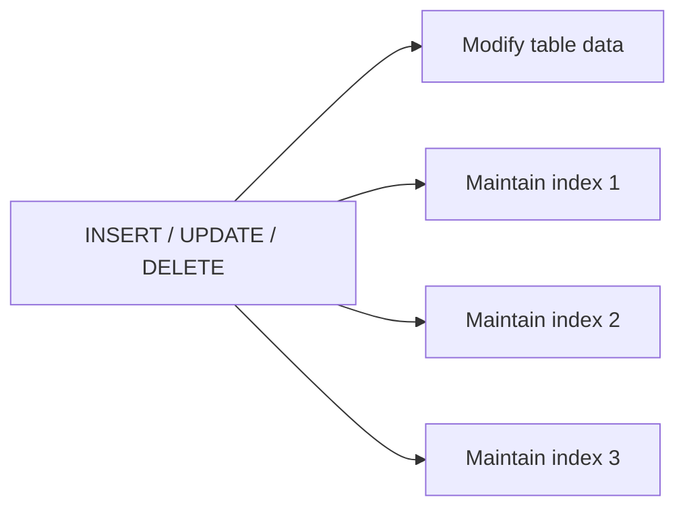
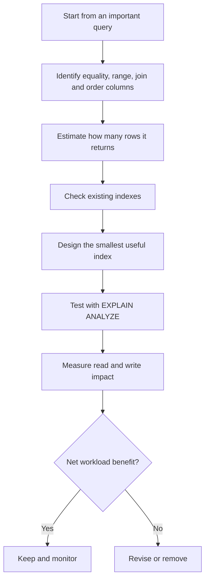

# B-Tree Indexing: When It Helps vs When It Hurts

> A practical guide to how B-tree indexes speed up common SQL queries, how to design composite indexes, and when an index can make a workload slower instead of faster.
>
> **Primary examples:** PostgreSQL 18 and MySQL 8.4 LTS / InnoDB.
>
> **Version context — August 2026:** PostgreSQL 18 is the current supported major release. MySQL 8.4 is the current LTS line; MySQL also has a newer Innovation release line.

## In Short

- A B-tree keeps keys in sorted, balanced pages, so the database can jump to a small part of the data instead of scanning every row.
- It is strongest for selective equality lookups, ranges, joins, uniqueness, and `ORDER BY ... LIMIT` queries.
- An index is useful because of the **access pattern and number of rows read**, not simply because a column appears in `WHERE`.
- Composite indexes are ordered left to right. Leading equality columns usually come first, followed by the range or ordering column.
- Covering indexes can reduce table-row lookups, but wider indexes cost more storage and write work.
- Every index adds work to `INSERT`, `UPDATE`, and `DELETE`, so unnecessary indexes directly hurt write-heavy systems.
- Always verify an index with `EXPLAIN` / `EXPLAIN ANALYZE` on production-like data.

---

## Index

1. [Why Indexing Matters](#1-why-indexing-matters)
2. [How a B-Tree Works](#2-how-a-b-tree-works)
3. [When a B-Tree Helps](#3-when-a-b-tree-helps)
4. [Composite B-Tree Indexes](#4-composite-b-tree-indexes)
5. [Covering, Partial, and Expression Indexes](#5-covering-partial-and-expression-indexes)
6. [When a B-Tree Hurts](#6-when-a-b-tree-hurts)
7. [Practical E-Commerce Example](#7-practical-e-commerce-example)
8. [How to Verify an Index](#8-how-to-verify-an-index)
9. [PostgreSQL vs MySQL/InnoDB](#9-postgresql-vs-mysqlinnodb)
10. [Practical Design Rules](#10-practical-design-rules)

---

# 1. Why Indexing Matters

Without a useful index, the database may need to inspect a large part of a table to find matching rows.

```text
Sequential / table scan

Row 1  -> check
Row 2  -> check
Row 3  -> check
...
Row N  -> check
```

For a small table this can be perfectly fine. For a table with millions of rows, scanning everything to find one customer or one order can be wasteful.

A B-tree index stores selected values in sorted order and keeps references that let the database locate matching rows quickly.


The important idea is:

```text
Without useful index -> inspect many table rows
With useful index    -> navigate to a small relevant range
```

An index is therefore a trade-off:

```text
Faster targeted reads
        vs
Extra write + storage + maintenance cost
```

---

# 2. How a B-Tree Works

A B-tree is a **balanced, ordered, multi-level search structure** designed to work efficiently with database pages.

```mermaid
flowchart TD
    R[Root: 30 | 60]
    A[Internal: 10 | 20]
    B[Internal: 40 | 50]
    C[Internal: 70 | 80]
    L1[Leaf: 1 ... 29]
    L2[Leaf: 30 ... 59]
    L3[Leaf: 60 ... 89]

    R --> A
    R --> B
    R --> C
    A --> L1
    B --> L2
    C --> L3
```

## 2.1 Why It Stays Fast

The tree stays balanced as rows are added or removed. Instead of checking values one by one, each tree level eliminates a large part of the search space.

A useful mental model is:

```text
Point lookup  -> approximately O(log N)
Range lookup  -> approximately O(log N + K)
```

Where:

- `N` = number of indexed entries.
- `K` = number of entries returned from the matching range.

This is only a conceptual model. Real performance also depends on cache hits, row width, data distribution, storage, concurrency, and how many table pages must be read.

## 2.2 B-Tree vs B+ Tree Terminology

Database documentation normally calls these indexes **B-tree indexes**. Many implementations place search entries mainly at the leaf level and link ordered leaf pages, which resembles a B+ tree internally.

For normal development and interviews, **B-tree index** is the correct term unless the discussion is specifically about storage-engine internals.

## 2.3 Operations B-Trees Commonly Support

| Operation | Example | Typical fit |
|---|---|---|
| Equality | `customer_id = 42` | Excellent |
| Range | `created_at >= '2026-08-01'` | Excellent |
| Between | `amount BETWEEN 100 AND 500` | Excellent |
| Set lookup | `status IN ('NEW', 'PAID')` | Often useful |
| Ordered comparison | `price < 1000` | Excellent |
| Prefix search | `name LIKE 'Ava%'` | Often useful |
| Leading wildcard | `name LIKE '%ava%'` | Usually poor for normal B-tree |
| Ordering | `ORDER BY created_at` | Useful when index order matches |
| Join lookup | `orders.customer_id = customers.id` | Often useful |
| Min / max | `MAX(created_at)` | Often useful |

The core reason is simple: **B-tree values are ordered**.

---

# 3. When a B-Tree Helps

## 3.1 Selective Equality Lookups

A selective predicate matches only a small part of the table.

```sql
SELECT id, name
FROM users
WHERE email = 'alex@example.com';
```

A suitable index is:

```sql
CREATE UNIQUE INDEX uq_users_email
ON users (email);
```

This is an ideal B-tree pattern because an email normally matches zero or one row.

Common examples:

- Primary or business IDs
- Email addresses
- Order numbers
- Invoice numbers
- External reference IDs
- `(tenant_id, business_key)` combinations

---

## 3.2 Range Queries

Because leaf entries are ordered, the database can find the beginning of a range and scan forward until the range ends.

```sql
SELECT id, total_amount
FROM orders
WHERE created_at >= '2026-08-01'
  AND created_at <  '2026-09-01';
```

```sql
CREATE INDEX idx_orders_created_at
ON orders (created_at);
```

Conceptually:

```text
... Jul 31 | Aug 01 | Aug 02 | ... | Aug 31 | Sep 01 ...
             ^-----------------------^
                    scan range
```

Typical range use cases include timestamps, prices, sequence numbers, numeric measurements, and cursor pagination.

---

## 3.3 `ORDER BY ... LIMIT`

This is one of the most valuable B-tree patterns in application development.

```sql
SELECT id, status, created_at
FROM orders
WHERE customer_id = 42
ORDER BY created_at DESC
LIMIT 20;
```

A suitable index is:

```sql
CREATE INDEX idx_orders_customer_created
ON orders (customer_id, created_at DESC);
```

The database can conceptually do this:


This is useful for:

- Recent orders
- Notifications
- Activity feeds
- Audit history
- Latest records
- Top-N results
- Cursor-based pagination

The important part is **early stopping**. The database does not necessarily need to read all matching rows and sort them first.

---

## 3.4 Join Columns

Indexes are valuable when a join repeatedly needs to locate matching rows.

```sql
SELECT o.id, c.name
FROM orders AS o
JOIN customers AS c
  ON c.id = o.customer_id
WHERE c.id = 42;
```

Typical indexes:

```sql
ALTER TABLE customers
ADD PRIMARY KEY (id);

CREATE INDEX idx_orders_customer_id
ON orders (customer_id);
```

The parent primary key is normally already indexed. The child-side foreign-key column often benefits from an index when the relationship is frequently joined or when parent deletes/updates must locate child rows.

Do not index a foreign key only because it is a foreign key. Consider table size, join frequency, delete/update behavior, and write volume.

---

## 3.5 Uniqueness Enforcement

A unique B-tree index provides both fast lookup and a database-level rule.

```sql
CREATE UNIQUE INDEX uq_users_tenant_username
ON users (tenant_id, username);
```

This guarantees that the same username cannot appear twice inside one tenant.

Database-level uniqueness is safer than only checking in application code because concurrent requests can otherwise pass the same pre-insert check.

---

# 4. Composite B-Tree Indexes

A composite index contains multiple ordered key columns.

```sql
CREATE INDEX idx_orders_tenant_customer_created
ON orders (tenant_id, customer_id, created_at DESC);
```

Its order is conceptually:

```text
tenant_id
    -> customer_id within each tenant
        -> created_at within each tenant/customer group
```

## 4.1 Leading-Column / Leftmost-Prefix Rule

For an index on:

```text
(a, b, c)
```

The strongest access patterns normally begin from the left:

| Query condition | Typical usefulness |
|---|---|
| `a = ?` | Strong |
| `a = ? AND b = ?` | Strong |
| `a = ? AND b = ? AND c = ?` | Strong |
| `b = ?` | Usually much weaker |
| `c = ?` | Usually much weaker |

Modern optimizers can sometimes use techniques such as **skip scan**, including PostgreSQL 18 in suitable cases. However, leading-column constraints still give the most predictable and efficient B-tree access pattern.

Do not design an important index assuming skip scan will rescue the wrong column order.

## 4.2 Equality Before Range

Consider:

```sql
SELECT id, created_at
FROM orders
WHERE tenant_id = 7
  AND customer_id = 42
  AND created_at >= '2026-08-01'
ORDER BY created_at DESC;
```

A strong candidate is:

```sql
CREATE INDEX idx_orders_tenant_customer_created
ON orders (tenant_id, customer_id, created_at DESC);
```

Why:

```text
1. tenant_id   -> equality
2. customer_id -> equality
3. created_at  -> range + ordering
```

This is a practical heuristic, not an absolute formula. Query frequency, selectivity, ordering, and database-specific optimizer behavior still matter.

## 4.3 One Composite Index vs Multiple Single-Column Indexes

Query:

```sql
WHERE customer_id = 42
  AND status = 'PAID'
```

Possible designs:

```sql
-- Separate indexes
CREATE INDEX idx_orders_customer ON orders (customer_id);
CREATE INDEX idx_orders_status   ON orders (status);

-- Matching composite index
CREATE INDEX idx_orders_customer_status
ON orders (customer_id, status);
```

PostgreSQL can combine indexes with bitmap scans, and MySQL can use Index Merge in supported cases. But a matching composite index is often more efficient for a stable, frequent access pattern because it directly stores the useful combined ordering.

Separate indexes remain useful when the columns are also queried independently.

---

# 5. Covering, Partial, and Expression Indexes

These are workload-specific ways of designing indexes. They are not separate replacements for B-tree itself.

## 5.1 Covering Indexes

A covering index contains all data needed by a query, allowing the engine to avoid some table-row lookups.

### PostgreSQL

```sql
CREATE INDEX idx_orders_customer_created_cover
ON orders (customer_id, created_at DESC)
INCLUDE (status, total_amount);
```

Query:

```sql
SELECT created_at, status, total_amount
FROM orders
WHERE customer_id = 42
ORDER BY created_at DESC
LIMIT 20;
```

Key columns:

```text
customer_id, created_at
```

Payload columns:

```text
status, total_amount
```

PostgreSQL can perform an **index-only scan** when the query needs only values stored in the index and MVCC visibility information allows heap access to be skipped. This is especially effective for relatively stable data.

### MySQL / InnoDB

MySQL does not use PostgreSQL's `INCLUDE` syntax. A query is covered when every required value is available from the chosen index. Extra columns are normally added to the end of a composite index when coverage is worthwhile.

Be conservative: wider indexes consume more memory, storage, and write bandwidth.

---

## 5.2 Partial Indexes — PostgreSQL

A partial index stores only rows matching a predicate.

```sql
CREATE INDEX idx_orders_pending
ON orders (tenant_id, created_at)
WHERE status = 'PENDING';
```

This can be excellent when `PENDING` rows are a small, frequently accessed subset of a very large table.

Benefits:

- Smaller index
- Better cache usage
- Less maintenance for rows outside the predicate
- Can support partial unique constraints

Important: PostgreSQL must be able to prove that the query condition implies the index predicate. Similar-looking predicates are not always considered equivalent by the planner.

MySQL/InnoDB does not provide a general PostgreSQL-style partial-index feature.

---

## 5.3 Expression / Functional Indexes

Sometimes the application searches by a computed value.

Normal column index:

```sql
CREATE INDEX idx_users_email
ON users (email);
```

This query transforms the indexed column:

```sql
SELECT id
FROM users
WHERE lower(email) = 'alex@example.com';
```

A normal index on `email` is not the same access path as an index on `lower(email)`.

PostgreSQL example:

```sql
CREATE INDEX idx_users_lower_email
ON users (lower(email));
```

MySQL 8.4 also supports functional key parts, although syntax and restrictions differ from PostgreSQL.

Expression indexes improve matching reads but add computation and index maintenance to writes.

---

## 5.4 Sargable Predicates

A predicate is **sargable** when the database can use it as a search argument to navigate an index efficiently.

Prefer:

```sql
WHERE created_at >= '2026-08-01 00:00:00'
  AND created_at <  '2026-08-02 00:00:00'
```

Instead of relying on a plain `created_at` index for:

```sql
WHERE DATE(created_at) = '2026-08-01'
```

If the functional form is a frequent access pattern, create an appropriate expression/functional index where supported.

Similarly:

```sql
WHERE name LIKE 'Ava%'
```

can often use an ordered prefix range, while:

```sql
WHERE name LIKE '%ava%'
```

normally cannot navigate a plain B-tree to one useful starting range.

For substring or linguistic search, use database-specific full-text, trigram, inverted-index, or search-engine solutions.

---

# 6. When a B-Tree Hurts

An index is not free. It can make a system slower when its read benefit does not justify its ongoing cost.

## 6.1 Write Overhead

Every relevant write may require index maintenance.



For an insert, the engine may need to find the target leaf page, add the new key, split pages when necessary, and write additional log/index pages.

For updates, changing an indexed value normally requires changing the corresponding index entry. More indexes mean more work per write.

This matters most for:

- High-throughput OLTP tables
- Event or logging tables
- Bulk imports
- Frequently updated indexed columns
- Tables with many overlapping indexes

---

## 6.2 Low Selectivity or Large Result Sets

Consider:

```sql
SELECT *
FROM users
WHERE is_active = true;
```

If almost every row is active, the index may not help. The engine may prefer one sequential/table scan instead of following a huge number of index entries back to table rows.

The same applies to a date condition that returns most of a table.

```text
Index plan:
index pages + many row lookups

Table scan:
read table pages directly
```

The optimizer chooses the estimated cheaper plan. An existing index does **not** mean the engine must use it.

Low-cardinality columns such as booleans or statuses can still be useful when:

- The searched value is rare
- Combined with more selective columns
- Used in a partial index
- Used with an ordering pattern and small `LIMIT`

---

## 6.3 Small Tables

For a tiny table, scanning all rows can be cheaper than navigating an index and then fetching rows.

Examples include small configuration, status, or country lookup tables.

Indexes may still exist for primary keys, uniqueness, or referential integrity, but not necessarily because they improve read speed.

---

## 6.4 Too Many or Very Wide Indexes

Indexes consume:

- Disk space
- Buffer/cache space
- Backup size
- Replication bandwidth
- Write I/O
- Maintenance time

These two indexes overlap:

```sql
CREATE INDEX idx_orders_customer
ON orders (customer_id);

CREATE INDEX idx_orders_customer_created
ON orders (customer_id, created_at);
```

The second index can often support searches on `customer_id` alone because it starts with the same key. However, the shorter index is smaller and may still be valuable for some workloads.

Do not drop an overlapping index from theory alone. Verify plans and real usage first.

---

## 6.5 Random Clustered Primary Keys in InnoDB

In InnoDB, the primary key is the clustered index that stores the row data.

A wide, randomly distributed primary key can cause inserts to land across many B-tree pages rather than mainly near the end of the key space.

Possible effects:

- More page splits
- Lower locality
- More buffer-pool churn
- Larger secondary indexes

This does not mean UUIDs are always wrong. It means that UUID representation, width, and generation strategy matter more in InnoDB because secondary-index entries also store the primary-key value.

---

# 7. Practical E-Commerce Example

Consider one `orders` table used by a multi-tenant application:

```sql
CREATE TABLE orders (
    id            BIGINT PRIMARY KEY,
    tenant_id     BIGINT NOT NULL,
    customer_id   BIGINT NOT NULL,
    order_number  VARCHAR(50) NOT NULL,
    status        VARCHAR(20) NOT NULL,
    total_amount  DECIMAL(12, 2) NOT NULL,
    created_at    TIMESTAMP NOT NULL,
    updated_at    TIMESTAMP NOT NULL
);
```

We will use this one scenario to design indexes from actual query patterns.

## 7.1 Find One Order by Business Number

```sql
SELECT *
FROM orders
WHERE tenant_id = 7
  AND order_number = 'ORD-2026-000123';
```

Suitable index:

```sql
CREATE UNIQUE INDEX uq_orders_tenant_order_number
ON orders (tenant_id, order_number);
```

Why it works:

- Both predicates are equality conditions.
- The combination is highly selective.
- It also enforces the business rule.

---

## 7.2 Show a Customer's Latest 20 Orders

```sql
SELECT id, status, total_amount, created_at
FROM orders
WHERE tenant_id = 7
  AND customer_id = 42
ORDER BY created_at DESC
LIMIT 20;
```

PostgreSQL-oriented design:

```sql
CREATE INDEX idx_orders_tenant_customer_recent
ON orders (tenant_id, customer_id, created_at DESC)
INCLUDE (status, total_amount);
```

The key order matches the access path:

```text
tenant equality
-> customer equality
-> created_at ordering
-> stop after 20
```

The included columns can make the query coverable, but they should be kept only if the read benefit is worth the wider index.

For MySQL/InnoDB, coverage is normally achieved by keeping the additional needed columns in the composite index itself rather than using `INCLUDE`.

---

## 7.3 Operations Queue for Pending Orders

```sql
SELECT id, customer_id, created_at
FROM orders
WHERE tenant_id = 7
  AND status = 'PENDING'
ORDER BY created_at ASC
LIMIT 100;
```

If pending rows are a small fraction of all orders, PostgreSQL can use a partial index:

```sql
CREATE INDEX idx_orders_pending_queue
ON orders (tenant_id, created_at ASC)
INCLUDE (customer_id)
WHERE status = 'PENDING';
```

This keeps completed orders out of the queue index entirely.

The same scenario demonstrates the main B-tree lesson:

> Design indexes from the queries the application actually runs, not from individual columns that merely look important.

---

# 8. How to Verify an Index

Index design is incomplete until the plan is measured.

## 8.1 PostgreSQL

Use:

```sql
EXPLAIN (ANALYZE, BUFFERS)
SELECT id, status, total_amount, created_at
FROM orders
WHERE tenant_id = 7
  AND customer_id = 42
ORDER BY created_at DESC
LIMIT 20;
```

Look for:

- `Index Scan` or `Index Only Scan`
- The index name actually chosen
- `actual time`
- Estimated rows vs actual rows
- Buffer hits and reads
- Whether a separate `Sort` was avoided

If estimated rows are very different from actual rows, planner statistics may be stale or insufficient.

Refresh statistics when appropriate:

```sql
ANALYZE orders;
```

For index usage over time:

```sql
SELECT
    relname AS table_name,
    indexrelname AS index_name,
    idx_scan,
    idx_tup_read,
    idx_tup_fetch
FROM pg_stat_user_indexes
WHERE relname = 'orders'
ORDER BY idx_scan DESC;
```

## 8.2 MySQL

Use:

```sql
EXPLAIN ANALYZE
SELECT id, status, total_amount, created_at
FROM orders
WHERE tenant_id = 7
  AND customer_id = 42
ORDER BY created_at DESC
LIMIT 20;
```

Inspect existing indexes:

```sql
SHOW INDEX FROM orders;
```

Refresh optimizer statistics when appropriate:

```sql
ANALYZE TABLE orders;
```

MySQL may legitimately choose a full table scan when a table is small or when an indexed condition matches too much of the table.

## 8.3 What to Compare Before and After

```text
Read latency
Rows scanned / examined
Buffers or pages read
Sort work
CPU time
Write throughput
Index size
Replication / WAL / redo impact
```

A successful index improves the important workload as a whole, not just one isolated query.

---

# 9. PostgreSQL vs MySQL/InnoDB

| Area | PostgreSQL 18 | MySQL 8.4 / InnoDB |
|---|---|---|
| General-purpose index | B-tree is default | InnoDB keys are B-tree based |
| Table organization | Heap table; indexes stored separately | Primary key is the clustered index containing row data |
| Secondary-index row locator | Points to heap tuple location | Stores primary-key value to locate clustered row |
| Covering syntax | `INCLUDE` supported | No PostgreSQL-style `INCLUDE`; coverage comes from columns stored in the index |
| Partial indexes | Supported | No general equivalent in standard InnoDB index syntax |
| Expression / functional indexes | Supported | Functional key parts supported |
| Index-only behavior | Requires values in index plus favorable MVCC visibility | Covering secondary index can avoid clustered-row lookup when required data is present |
| Multiple-index combination | Bitmap scans | Index Merge in supported cases |
| Primary-key width impact | Does not define physical heap order | Wide PK increases secondary-index size |
| Plan inspection | `EXPLAIN`, `EXPLAIN ANALYZE`, `BUFFERS` | `EXPLAIN`, `EXPLAIN ANALYZE` |

The logical principles are similar, but physical costs differ because PostgreSQL uses a heap table while InnoDB clusters the table around the primary key.

---

# 10. Practical Design Rules

Use these rules as a compact mental model.

| Situation | B-tree guidance |
|---|---|
| Selective equality lookup | Strong candidate |
| Bounded range | Strong candidate |
| Frequent join lookup | Usually useful |
| `ORDER BY ... LIMIT` | Very strong when index order matches |
| Unique business key | Use a unique index/constraint |
| Query needs a few extra output columns | Consider covering, but keep it narrow |
| Small hot subset in PostgreSQL | Consider a partial index |
| Function applied in every lookup | Consider expression/functional index |
| Query returns most rows | Scan may be cheaper |
| Boolean/status matches most rows | Usually weak alone |
| Leading wildcard search | Use another search strategy |
| Write-heavy table | Keep index count disciplined |
| Existing similar index | Check whether it already covers the access pattern |

A practical index-design sequence is:



## Final Mental Model

```text
A good B-tree index:

1. matches an important query pattern,
2. narrows the search early,
3. supports required ordering when useful,
4. stays as narrow as practical,
5. avoids unnecessary table lookups when coverage is valuable,
6. and saves more read work than it adds in write and storage cost.
```

The key interview-level idea is not simply **"indexes make queries faster."**

It is:

> **A B-tree is valuable when its ordered access path lets the database avoid significant work. The optimizer may ignore it when scanning the table is cheaper, and every additional index must justify its ongoing write and storage cost.**
