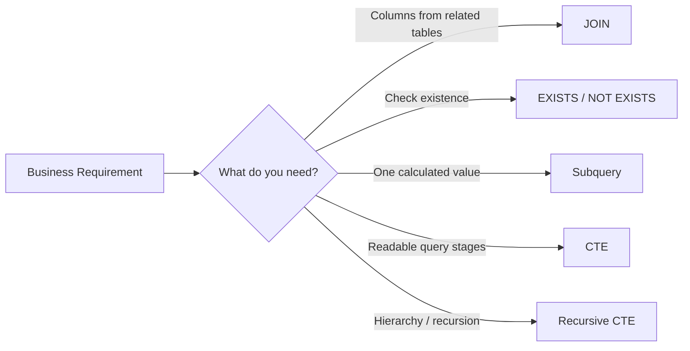
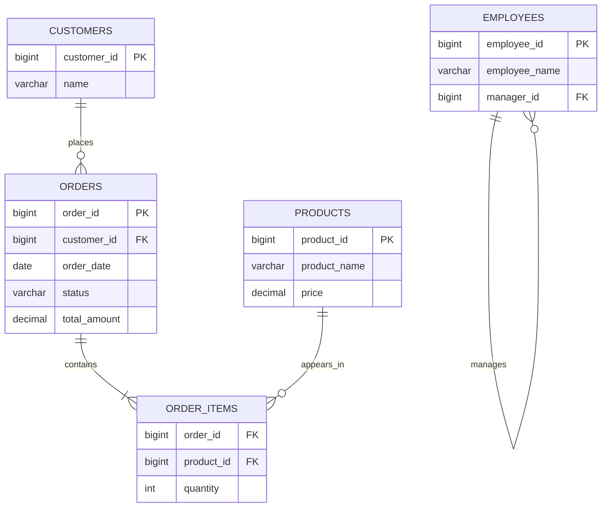
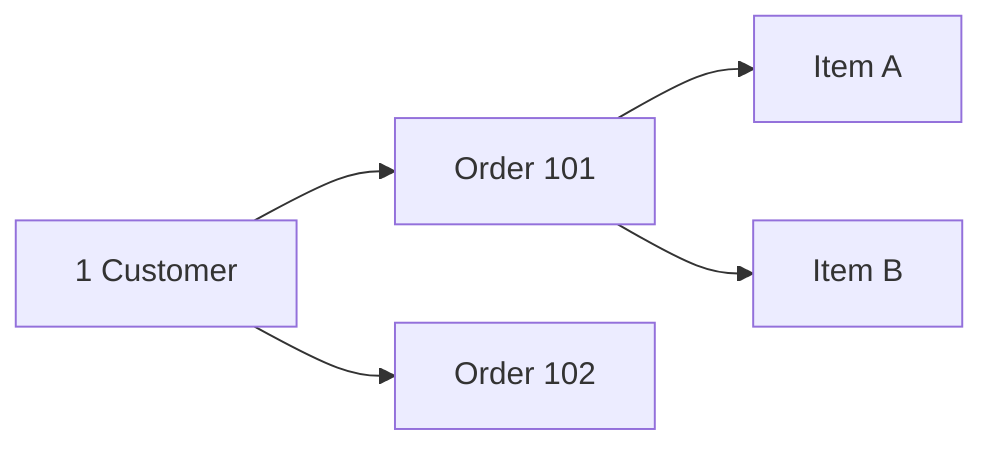
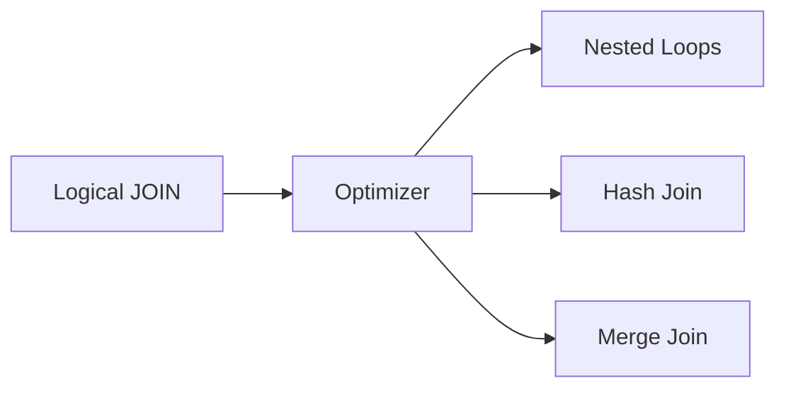
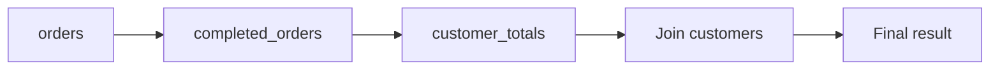
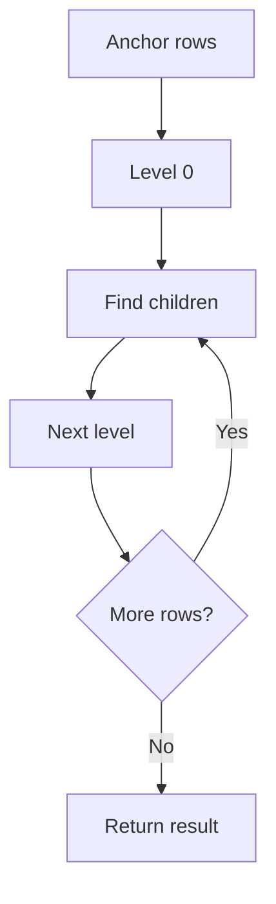
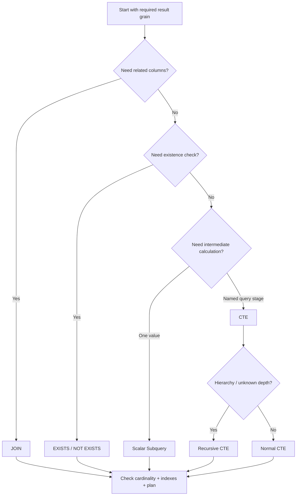

# Joins, Subqueries & CTEs (`WITH`) in SQL

> A practical, interview-focused guide for developers working with relational databases.
>
> **Coverage:** joins, subqueries, CTEs, recursive CTEs, common production patterns, and performance basics.
>
> **Database notes:** Examples are mostly portable SQL. Differences are called out for PostgreSQL 18, MySQL 8.4, and SQL Server 2025 / 17.x documentation.

## In short

- Use a **`JOIN`** when you need columns from related tables.
- Use **`EXISTS` / `NOT EXISTS`** when the question is whether a related row exists.
- Use a **scalar subquery** when you need one calculated value inside another query.
- Use a **CTE** when a complex query becomes easier to understand as named steps.
- Use a **recursive CTE** for hierarchies or graph-like relationships of unknown depth.
- A one-to-many join naturally creates multiple rows. Do not add `DISTINCT` just to hide incorrect join logic.
- With an outer join, a right-table filter in `WHERE` can remove the `NULL` rows and change the meaning of the query.
- A CTE is **not automatically faster** and is not guaranteed to behave like a cached temporary table.



---

## 1. Why These Concepts Matter

Real applications rarely keep all required data in one table.

For example, an order API may need data from:

- `customers`
- `orders`
- `order_items`
- `products`

These concepts solve different parts of that problem:

- **Join:** combine related rows.
- **Subquery:** use the result of one query inside another.
- **CTE:** give an intermediate query a meaningful name.
- **Recursive CTE:** repeatedly follow parent-child relationships.

The key interview skill is not memorizing syntax. It is understanding:

1. what one output row represents,
2. how tables are related,
3. where filtering should happen,
4. how `NULL` affects the result,
5. whether the query will scale with real data.

---

## 2. Sample Schema Used in This Guide

We will use one small e-commerce example throughout the note.



Assume:

```text
customers
1  Asha
2  Ravi
3  Neha
4  Kabir

orders
101  1  completed  120
102  1  pending     80
103  2  completed  250
104  3  completed  180
```

Kabir has no order, which makes the difference between inner and outer joins easy to see.

---

## 3. The Core Mental Model

SQL works with **sets of rows**.

A simplified logical processing order is:

```text
FROM / JOIN
    ↓
ON
    ↓
WHERE
    ↓
GROUP BY
    ↓
HAVING
    ↓
SELECT
    ↓
DISTINCT
    ↓
ORDER BY
    ↓
LIMIT / OFFSET / FETCH
```

This explains an important rule:

- `ON` controls which rows match during a join.
- `WHERE` filters the result after the join.

For inner joins, moving some conditions between `ON` and `WHERE` may produce the same result.

For outer joins, it can completely change the result.

Also remember:

> SQL describes **what result you want**. The optimizer decides **how to execute it**.

A logical `JOIN` may physically use nested loops, a hash join, or a merge join depending on the database, indexes, statistics, and data size.

---

## 4. SQL Joins

### 4.1 `INNER JOIN`

Returns only rows that match on both sides.

```sql
SELECT
    c.customer_id,
    c.name,
    o.order_id,
    o.total_amount
FROM customers AS c
JOIN orders AS o
    ON o.customer_id = c.customer_id;
```

Conceptually:

```text
Asha  → Order 101
Asha  → Order 102
Ravi  → Order 103
Neha  → Order 104
Kabir → no match → removed
```

Use it when the result only makes sense if both related rows exist.

### 4.2 `LEFT JOIN`

Keeps every row from the left table and fills right-side columns with `NULL` when no match exists.

```sql
SELECT
    c.customer_id,
    c.name,
    o.order_id
FROM customers AS c
LEFT JOIN orders AS o
    ON o.customer_id = c.customer_id;
```

Kabir still appears:

```text
4 | Kabir | NULL
```

Common uses:

- show all customers, including those without orders,
- show all products, including never-sold products,
- find missing related records.

To find customers without orders:

```sql
SELECT c.customer_id, c.name
FROM customers AS c
WHERE NOT EXISTS (
    SELECT 1
    FROM orders AS o
    WHERE o.customer_id = c.customer_id
);
```

`NOT EXISTS` usually communicates the anti-join intent more clearly than `LEFT JOIN ... IS NULL`.

### 4.3 `RIGHT JOIN`

Preserves all rows from the right side.

```sql
SELECT c.name, o.order_id
FROM customers AS c
RIGHT JOIN orders AS o
    ON o.customer_id = c.customer_id;
```

It can usually be rewritten as a `LEFT JOIN` by swapping table order. Many teams prefer `LEFT JOIN` because the preserved side is easier to read consistently.

### 4.4 `FULL OUTER JOIN`

Keeps:

- matched rows,
- unmatched left rows,
- unmatched right rows.

```sql
SELECT
    c.customer_id,
    c.name,
    o.order_id
FROM customers AS c
FULL OUTER JOIN orders AS o
    ON o.customer_id = c.customer_id;
```

Typical use cases are reconciliation, migration validation, and comparing two datasets.

**MySQL 8.4:** there is no native `FULL OUTER JOIN`; it is commonly emulated with a `LEFT JOIN` plus the unmatched rows from the other side using `UNION ALL`.

### 4.5 `CROSS JOIN`

Returns every possible pair.

```sql
SELECT s.size_name, c.color_name
FROM sizes AS s
CROSS JOIN colors AS c;
```

If there are 4 sizes and 5 colors, the result has:

```text
4 × 5 = 20 rows
```

Useful for generating combinations, but dangerous on large tables because row counts can grow very quickly.

### 4.6 Self Join

A self join joins a table to itself using aliases.

```sql
SELECT
    e.employee_name,
    m.employee_name AS manager_name
FROM employees AS e
LEFT JOIN employees AS m
    ON m.employee_id = e.manager_id;
```

Typical use case: employee → manager.

For an unknown number of hierarchy levels, prefer a recursive CTE.

### 4.7 Join Multiplication

A join returns **one row for every matching pair**.

If one customer has 3 orders, that customer appears 3 times.

If an order has 2 items and 3 payments, joining both detail tables directly can create:

```text
2 items × 3 payments = 6 rows
```

That can make aggregates incorrect.



The important question is:

> What should one final row represent?

Do not use `DISTINCT` as a default fix for unexpected row multiplication.

### 4.8 `ON` vs `WHERE` with `LEFT JOIN`

Requirement:

> Show every customer and include completed orders when they exist.

Correct:

```sql
SELECT
    c.customer_id,
    c.name,
    o.order_id
FROM customers AS c
LEFT JOIN orders AS o
    ON o.customer_id = c.customer_id
   AND o.status = 'completed';
```

The `status` condition controls which orders match, but every customer survives.

Different meaning:

```sql
SELECT
    c.customer_id,
    c.name,
    o.order_id
FROM customers AS c
LEFT JOIN orders AS o
    ON o.customer_id = c.customer_id
WHERE o.status = 'completed';
```

Now customers without a completed order are removed because their right-side value is `NULL`.

This is one of the most common interview concepts around joins.

---

## 5. How Databases Physically Execute Joins

The SQL join type and the physical join algorithm are different concepts.



### Nested-loop join

Conceptually:

```text
for each row in the outer input:
    find matching rows in the inner input
```

Often good when:

- the outer side is small,
- the inner side has a useful index,
- only a small number of rows are needed.

### Hash join

The database builds a hash table from one input and probes it with the other.

Often useful for:

- large equality joins,
- analytical workloads,
- inputs without useful ordering.

If the hash table does not fit in memory, it may spill to disk.

### Merge join

Reads two inputs in join-key order and advances through them together.

Often useful when both sides are already ordered by indexes or sorting is otherwise cheap.

### Practical rule

Do not guess the physical join algorithm from the SQL text. Check the execution plan with the database's plan tools such as `EXPLAIN` or the SQL Server execution plan.

---

## 6. Subqueries

A subquery is a query inside another SQL statement.

```sql
SELECT ...
FROM ...
WHERE column = (
    SELECT ...
);
```

### 6.1 Scalar Subquery

A scalar subquery returns one value.

```sql
SELECT order_id, total_amount
FROM orders
WHERE total_amount > (
    SELECT AVG(total_amount)
    FROM orders
);
```

Use it when the outer query needs one calculated value.

If the subquery returns multiple rows where one value is required, the query fails.

### 6.2 `IN`

Checks whether a value belongs to a returned set.

```sql
SELECT customer_id, name
FROM customers
WHERE customer_id IN (
    SELECT customer_id
    FROM orders
    WHERE status = 'completed'
);
```

This is readable for membership logic.

### 6.3 `EXISTS`

Checks whether at least one matching row exists.

```sql
SELECT c.customer_id, c.name
FROM customers AS c
WHERE EXISTS (
    SELECT 1
    FROM orders AS o
    WHERE o.customer_id = c.customer_id
      AND o.status = 'completed'
);
```

Use `EXISTS` when you do not need columns from the related table and only care whether a match exists.

The selected value inside `EXISTS` is not used; `SELECT 1` is simply a common convention.

### 6.4 `NOT IN` and `NULL`

Be careful with:

```sql
WHERE customer_id NOT IN (
    SELECT customer_id
    FROM orders
);
```

If the subquery can return `NULL`, SQL's three-valued logic can produce unexpected results.

For anti-join logic, prefer:

```sql
WHERE NOT EXISTS (
    SELECT 1
    FROM orders AS o
    WHERE o.customer_id = c.customer_id
);
```

### 6.5 Correlated Subquery

A correlated subquery refers to a column from the outer query.

```sql
SELECT
    o.order_id,
    o.customer_id,
    o.total_amount
FROM orders AS o
WHERE o.total_amount > (
    SELECT AVG(o2.total_amount)
    FROM orders AS o2
    WHERE o2.customer_id = o.customer_id
);
```

This returns orders above the average for their own customer.

Logically the inner query depends on each outer row, although the optimizer may transform the query into a more efficient plan.

### 6.6 Derived Table

A subquery in `FROM` acts like a table for that query.

```sql
SELECT totals.customer_id, totals.total_spent
FROM (
    SELECT
        customer_id,
        SUM(total_amount) AS total_spent
    FROM orders
    WHERE status = 'completed'
    GROUP BY customer_id
) AS totals
WHERE totals.total_spent >= 200;
```

When nesting becomes difficult to read, a CTE often expresses the same logic more clearly.

### 6.7 `ANY`, `SOME`, and `ALL`

These compare one value against a set returned by a subquery.

```sql
-- Greater than at least one returned value
WHERE total_amount > ANY (
    SELECT total_amount
    FROM orders
    WHERE customer_id = 1
);

-- Greater than every returned value
WHERE total_amount > ALL (
    SELECT total_amount
    FROM orders
    WHERE customer_id = 1
);
```

`ANY` and `SOME` are equivalent in this context. In everyday application SQL, `MIN()` or `MAX()` is often easier to read when that is the real business rule.

### 6.8 Lateral Derived Tables

A lateral query can reference an earlier table from the same `FROM` clause. It is useful for patterns such as "latest child row per parent."

PostgreSQL/MySQL style:

```sql
SELECT
    c.customer_id,
    c.name,
    latest.order_id
FROM customers AS c
LEFT JOIN LATERAL (
    SELECT o.order_id
    FROM orders AS o
    WHERE o.customer_id = c.customer_id
    ORDER BY o.order_date DESC, o.order_id DESC
    LIMIT 1
) AS latest ON TRUE;
```

PostgreSQL and MySQL support `LATERAL`. SQL Server commonly expresses the same kind of dependent table expression with `CROSS APPLY` or `OUTER APPLY`.

---

## 7. Common Table Expressions

A CTE is a named intermediate result defined with `WITH`.

```sql
WITH completed_orders AS (
    SELECT
        order_id,
        customer_id,
        total_amount
    FROM orders
    WHERE status = 'completed'
)
SELECT
    customer_id,
    SUM(total_amount) AS total_spent
FROM completed_orders
GROUP BY customer_id;
```

Think of it as:

> a query-level name for an intermediate result.

A CTE normally exists only for the single statement that follows it.

### 7.1 Multiple CTEs

CTEs are useful when a complex query has clear stages.

```sql
WITH completed_orders AS (
    SELECT customer_id, total_amount
    FROM orders
    WHERE status = 'completed'
),
customer_totals AS (
    SELECT
        customer_id,
        SUM(total_amount) AS total_spent
    FROM completed_orders
    GROUP BY customer_id
)
SELECT
    c.customer_id,
    c.name,
    ct.total_spent
FROM customer_totals AS ct
JOIN customers AS c
    ON c.customer_id = ct.customer_id
WHERE ct.total_spent >= 200;
```



Use meaningful CTE names based on business steps rather than names such as `cte1`, `cte2`, and `temp`.

### 7.2 CTE vs View vs Temporary Table

| Need | Better starting point |
|---|---|
| Readable logic inside one statement | CTE |
| Reuse across many queries | View |
| Persist intermediate rows during a session/workflow | Temporary table |
| Index a large intermediate result | Temporary/materialized object |
| Precompute reusable expensive results | Materialized view or summary table |

### 7.3 Recursive CTE

A recursive CTE refers to itself and is useful for trees and hierarchies.

PostgreSQL/MySQL style:

```sql
WITH RECURSIVE employee_tree AS (
    SELECT
        employee_id,
        employee_name,
        manager_id,
        0 AS depth
    FROM employees
    WHERE manager_id IS NULL

    UNION ALL

    SELECT
        e.employee_id,
        e.employee_name,
        e.manager_id,
        t.depth + 1
    FROM employees AS e
    JOIN employee_tree AS t
        ON e.manager_id = t.employee_id
)
SELECT *
FROM employee_tree;
```

How it works:



A recursive CTE needs:

- an **anchor** query,
- a **recursive** query,
- a condition that eventually stops recursion,
- cycle protection when the data can contain loops.

**SQL Server:** recursive CTEs use plain `WITH`, not `WITH RECURSIVE`.

### 7.4 Materialization and Inlining

A CTE is primarily a readability and query-structure feature. Do not assume:

> “A CTE is faster because it runs once.”

Optimizer behavior differs.

- **PostgreSQL 18** can fold eligible side-effect-free CTEs into the parent query and supports `MATERIALIZED` / `NOT MATERIALIZED` controls.
- **MySQL 8.4** can merge eligible CTEs/derived tables into the outer query or materialize them.
- **SQL Server 17.x** documentation states that non-recursive CTE query results are not inherently materialized; the optimizer decides how the final plan executes the references.

Always check the execution plan before using CTE structure as a performance assumption.

---

## 8. Join vs Subquery vs CTE

Requirement:

> Return customers who have at least one completed order.

### Join

```sql
SELECT DISTINCT
    c.customer_id,
    c.name
FROM customers AS c
JOIN orders AS o
    ON o.customer_id = c.customer_id
WHERE o.status = 'completed';
```

This works, but the join creates one row per matching order, so `DISTINCT` is needed to get one row per customer.

### `EXISTS`

```sql
SELECT
    c.customer_id,
    c.name
FROM customers AS c
WHERE EXISTS (
    SELECT 1
    FROM orders AS o
    WHERE o.customer_id = c.customer_id
      AND o.status = 'completed'
);
```

This expresses the requirement more directly.

### CTE

```sql
WITH completed_customers AS (
    SELECT DISTINCT customer_id
    FROM orders
    WHERE status = 'completed'
)
SELECT
    c.customer_id,
    c.name
FROM customers AS c
JOIN completed_customers AS cc
    ON cc.customer_id = c.customer_id;
```

Useful if the intermediate result is part of a larger query workflow.

### Decision guide

| Requirement | Clear starting point |
|---|---|
| Need columns from both tables | `JOIN` |
| Need to know whether a related row exists | `EXISTS` |
| Need to know whether no related row exists | `NOT EXISTS` |
| Need one calculated value | Scalar subquery |
| Need a table-like nested result | Derived table / CTE |
| Need readable query stages | CTE |
| Need unknown-depth hierarchy traversal | Recursive CTE |

This is a readability guide, not a universal performance rule.

---

## 9. Practical Production Patterns

### 9.1 Aggregate Before Joining Detail Tables

Suppose one order has multiple items and multiple payments.

Joining both detail tables directly can multiply rows and over-count totals.

Safer pattern:

```sql
WITH item_totals AS (
    SELECT
        order_id,
        SUM(quantity * unit_price) AS item_total
    FROM order_items
    GROUP BY order_id
),
payment_totals AS (
    SELECT
        order_id,
        SUM(amount) AS paid_total
    FROM payments
    GROUP BY order_id
)
SELECT
    o.order_id,
    it.item_total,
    pt.paid_total
FROM orders AS o
LEFT JOIN item_totals AS it
    ON it.order_id = o.order_id
LEFT JOIN payment_totals AS pt
    ON pt.order_id = o.order_id;
```

Each detail table is reduced to **one row per order** before the final join.

### 9.2 Latest Row per Parent

Use a window function when you need one latest row per customer.

```sql
WITH ranked_orders AS (
    SELECT
        o.*,
        ROW_NUMBER() OVER (
            PARTITION BY customer_id
            ORDER BY order_date DESC, order_id DESC
        ) AS rn
    FROM orders AS o
)
SELECT *
FROM ranked_orders
WHERE rn = 1;
```

The secondary sort makes tie handling deterministic.

### 9.3 Count Related Rows Including Zero

```sql
SELECT
    c.customer_id,
    c.name,
    COUNT(o.order_id) AS order_count
FROM customers AS c
LEFT JOIN orders AS o
    ON o.customer_id = c.customer_id
GROUP BY c.customer_id, c.name;
```

Use `COUNT(o.order_id)`, not `COUNT(*)`.

For a customer without orders:

- `COUNT(*)` counts the preserved left row.
- `COUNT(o.order_id)` ignores the right-side `NULL` and returns `0`.

### 9.4 Pagination with One-to-Many Joins

If you paginate after joining customers to orders, you may paginate **joined rows** instead of customers.

Safer approach:

1. select the customer page first,
2. then join orders.

```sql
WITH customer_page AS (
    SELECT customer_id, name
    FROM customers
    ORDER BY customer_id
    LIMIT 20 OFFSET 0
)
SELECT
    cp.customer_id,
    cp.name,
    o.order_id
FROM customer_page AS cp
LEFT JOIN orders AS o
    ON o.customer_id = cp.customer_id
ORDER BY cp.customer_id, o.order_id;
```

For very large page numbers, keyset pagination is usually preferable to a high `OFFSET`.

---

## 10. Performance and Query-Review Checklist

Before optimizing a join/subquery/CTE query, review it in this order.

### 10.1 Define the result grain

Ask:

```text
One row per customer?
One row per order?
One row per order item?
One row per customer per month?
```

Many duplicate and aggregation problems come from not defining this first.

### 10.2 Verify join cardinality

Know whether each relationship is:

- one-to-one,
- one-to-many,
- many-to-one,
- many-to-many.

### 10.3 Index join and correlation columns

Common examples:

```sql
orders(customer_id)
order_items(order_id)
order_items(product_id)
employees(manager_id)
```

A foreign key does not universally mean the referencing column is automatically indexed. Verify the schema and database behavior.

### 10.4 Keep related key types compatible

Avoid joining values that require implicit conversion, such as an integer key against a text key.

Type mismatch can affect correctness and index usage.

### 10.5 Prefer `EXISTS` for existence logic

If you only need to know whether a related row exists, `EXISTS` is usually clearer than `JOIN + DISTINCT`.

### 10.6 Treat `DISTINCT` as intentional

Use `DISTINCT` when the requirement truly needs a distinct set—not as a repair for a bad join.

### 10.7 Be careful with `NOT IN`

If the inner value can be `NULL`, prefer `NOT EXISTS`.

### 10.8 Select only required columns

Avoid unnecessary `SELECT *` in production joins, especially when tables are wide or API contracts should remain stable.

### 10.9 Check the execution plan

Look for:

- actual vs estimated row counts,
- full scans on large tables,
- repeated nested-loop work,
- hash/sort spills,
- missing or unused indexes,
- unexpectedly large intermediate row counts.

### 10.10 Test with realistic data

A query that is fast on 20 rows may behave very differently with:

- millions of rows,
- skewed tenant data,
- many `NULL` values,
- a few parents with thousands of children.

Correct SQL comes first; measured optimization comes second.

---

## 11. Database Portability Notes

| Feature | PostgreSQL 18 | MySQL 8.4 | SQL Server 17.x |
|---|---|---|---|
| `INNER JOIN` | Yes | Yes | Yes |
| `LEFT JOIN` | Yes | Yes | Yes |
| `RIGHT JOIN` | Yes | Yes | Yes |
| Native `FULL OUTER JOIN` | Yes | No | Yes |
| `CROSS JOIN` | Yes | Yes | Yes |
| Non-recursive CTE | Yes | Yes | Yes |
| Recursive syntax | `WITH RECURSIVE` | `WITH RECURSIVE` | `WITH` |
| Lateral form | `LATERAL` | `LATERAL` derived table | `CROSS APPLY` / `OUTER APPLY` |
| CTE materialization control | `MATERIALIZED`, `NOT MATERIALIZED` for eligible CTEs | Optimizer merge/materialization | Optimizer-managed |
| Recursive cycle support | `CYCLE` available | Usually explicit path/depth logic | Usually explicit path/depth logic / recursion controls |

### SQL Server semicolon before a CTE

A CTE can require a leading semicolon when the previous T-SQL statement was not terminated:

```sql
;WITH customer_totals AS (
    SELECT
        customer_id,
        SUM(total_amount) AS total_spent
    FROM orders
    GROUP BY customer_id
)
SELECT *
FROM customer_totals;
```

A good general practice is to terminate SQL statements with semicolons.

---

## Final Mental Model



The most important practical habit is:

> **Define what one result row represents before writing the joins.**

Once the result grain is clear, choosing between a join, subquery, and CTE becomes much easier—and most duplicate-counting and filtering mistakes become easier to spot.
