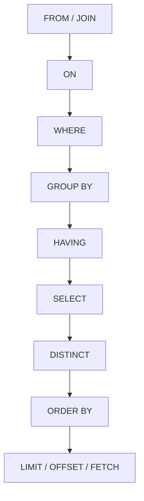
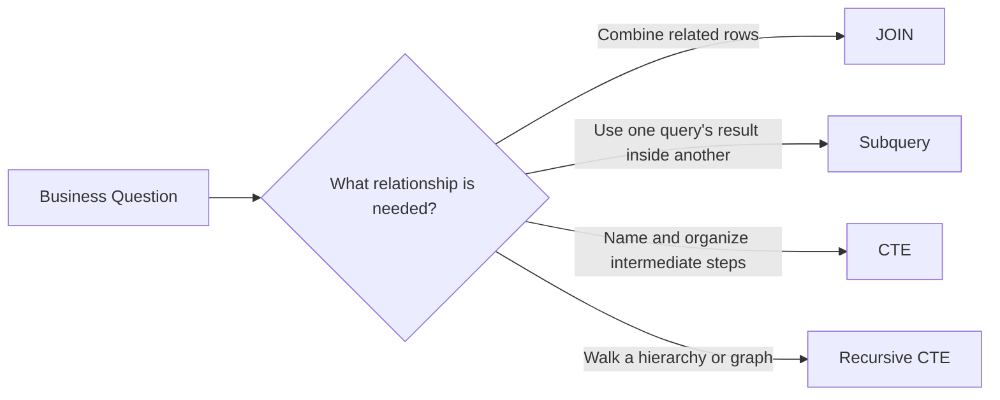
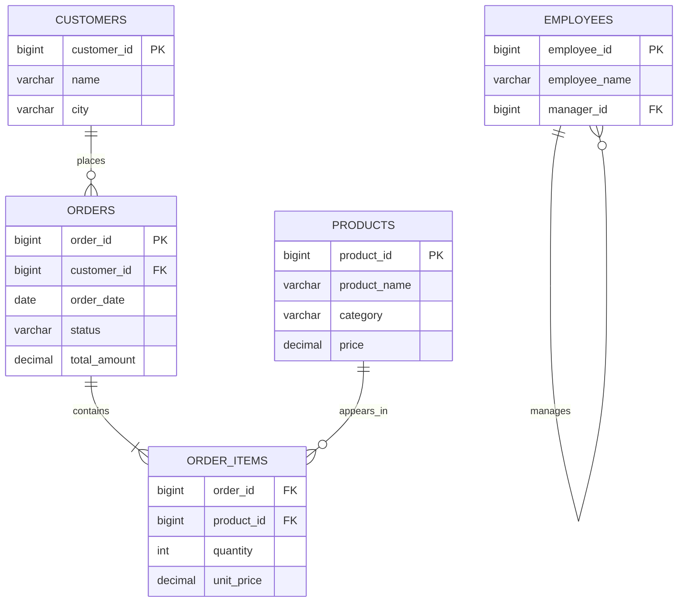
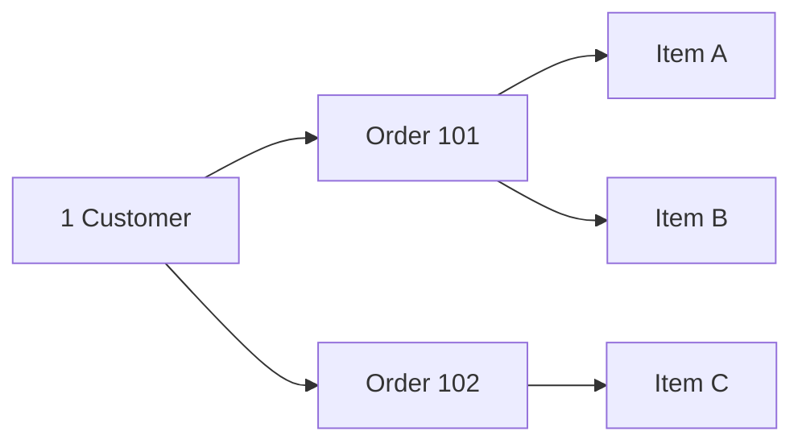
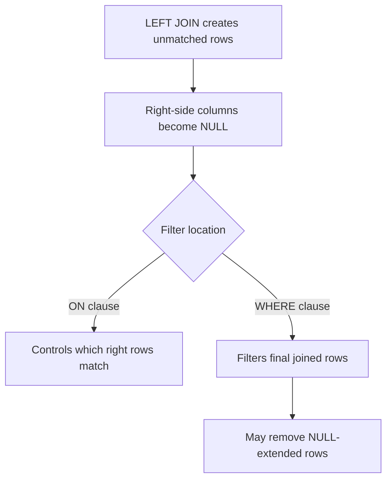
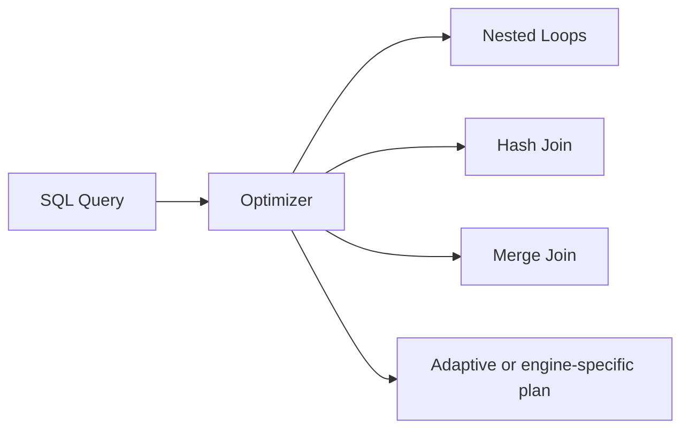
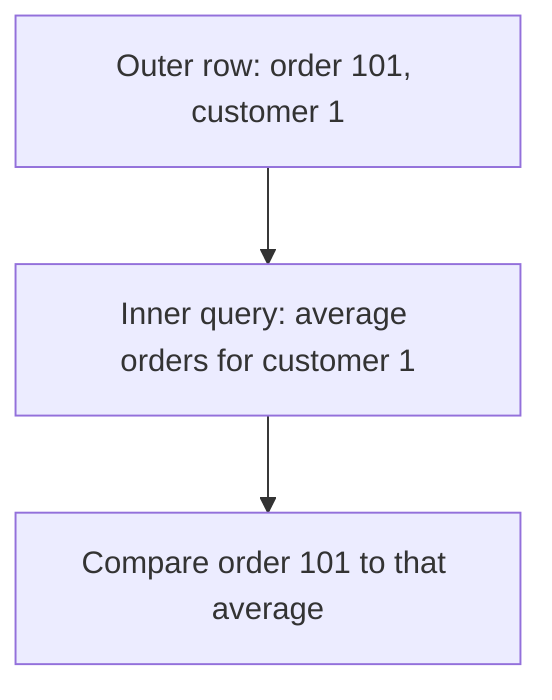
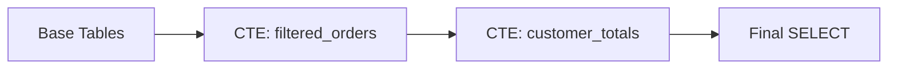
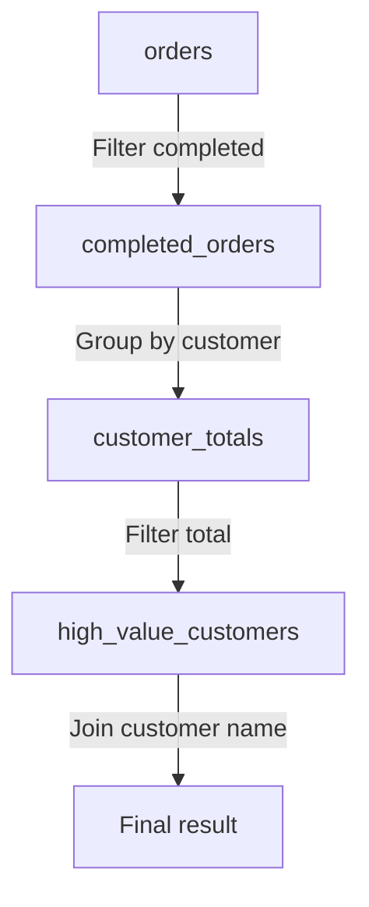
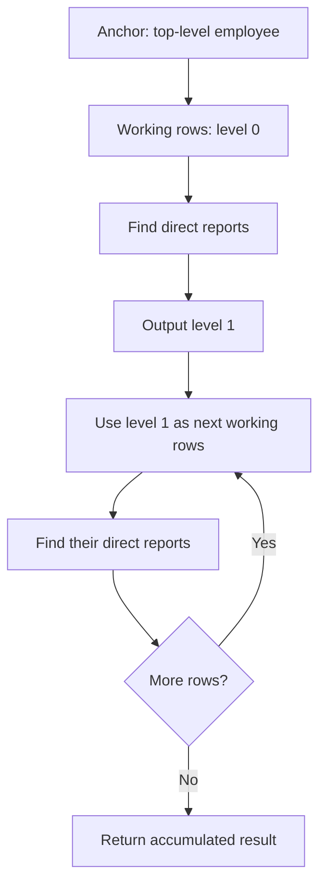

# Joins, Subqueries & CTEs (`WITH`) in SQL

> A practical, interview-focused guide for developers working with relational databases.
>
> **Coverage:** SQL joins, subqueries, common table expressions, recursive CTEs, query-planning concepts, performance, portability, and production patterns.
> **Examples use mostly portable SQL.:** Database-specific differences are called out for PostgreSQL 18, MySQL 8.4, and the current SQL Server version-17 documentation view.

## In short

- `INNER JOIN` keeps only matched pairs; `LEFT JOIN` keeps every left row and fills the right-side columns with `NULL` when nothing matches; `RIGHT JOIN` mirrors it, and `FULL OUTER JOIN` preserves unmatched rows from both sides.
- A join produces one row per matching pair, so a one-to-many join multiplies the parent row — fix the result grain rather than hiding the multiplication behind `DISTINCT`.
- Relationship conditions belong in `ON`; filters on the joined result belong in `WHERE`. On an outer join the two clauses mean different things.
- Use `EXISTS` / `NOT EXISTS` for "does a related row exist" questions, and avoid `NOT IN` over a nullable column, where `UNKNOWN` comparisons can silently return nothing.
- A subquery can be scalar, a column feeding `IN`/`ANY`/`ALL`, a correlated lookup, or a derived table in `FROM`; a CTE is the same idea given a name and scoped to the one statement that follows `WITH`.
- `WITH RECURSIVE` walks hierarchies and graphs of unknown depth, and needs a termination condition plus cycle protection.
- A CTE is a readability tool, not a guaranteed cache or optimisation fence — engines may inline, merge, spool, or materialise it.



**Interview answer:** An `INNER JOIN` returns only rows that match on both sides, so a customer with no orders disappears from the result. A `LEFT JOIN` keeps every row of the left table and pads the right-side columns with `NULL` when there is no match, which is what makes "all customers, including those who never ordered" expressible, and what makes `WHERE o.order_id IS NULL` an anti-join. For matched rows the two behave identically; they differ only in whether unmatched left rows survive.

**Gotcha:** Putting a filter on the right-hand table in the `WHERE` clause of a `LEFT JOIN` — `WHERE o.status = 'completed'` removes the `NULL`-extended rows and silently turns the query back into an inner join. That predicate belongs in the `ON` clause.

---

## 1. Why These Concepts Matter

Real applications rarely store everything in one table. A typical API request may need to combine:

- a customer record,
- the customer's orders,
- individual order items,
- product information,
- payment status,
- and calculated totals.

Joins, subqueries, and CTEs are three ways to express relationships and break a data problem into manageable pieces.



The main skill is not memorizing syntax. It is choosing a form that is:

1. logically correct,
2. readable for the team,
3. efficient for the database optimizer,
4. safe around duplicates and `NULL`,
5. portable enough for the project's database.

---

## 2. Sample Schema Used in This Guide

Most examples use a small e-commerce model.



Example rows:

### `customers`

| customer_id | name  | city      |
|------------:|-------|-----------|
| 1           | Asha  | Ahmedabad |
| 2           | Ravi  | Mumbai    |
| 3           | Neha  | Pune      |
| 4           | Kabir | Delhi     |

### `orders`

| order_id | customer_id | order_date | status    | total_amount |
|---------:|------------:|------------|-----------|-------------:|
| 101      | 1           | 2026-07-01 | completed | 120.00       |
| 102      | 1           | 2026-07-05 | pending   | 80.00        |
| 103      | 2           | 2026-07-07 | completed | 250.00       |
| 104      | 2           | 2026-07-09 | cancelled | 40.00        |
| 105      | 3           | 2026-07-10 | completed | 180.00       |

Kabir has no order. This is useful when comparing inner and outer joins.

---

## 3. The Core Mental Model

A query works with **sets of rows**. Each clause transforms one set into another.

A simplified logical processing order is `FROM`/`JOIN` → `ON` → `WHERE` → `GROUP BY` → `HAVING` → `SELECT` → `DISTINCT` → `ORDER BY` → `LIMIT`/`OFFSET`/`FETCH`.

This order explains several important behaviors:

- Tables are joined before the final `SELECT` list is produced.
- `ON` controls matching during a join.
- `WHERE` filters the joined result.
- A filter placed in `WHERE` can remove the `NULL`-extended rows created by an outer join.
- A subquery can produce one value, one row, one column, or a full table-like result.
- A CTE gives a name to an intermediate result used by the statement that follows it.

### Logical relationship vs physical execution

SQL describes **what result you want**. The optimizer decides **how to produce it**.

For example, this logical join:

```sql
SELECT c.customer_id, c.name, o.order_id
FROM customers AS c
JOIN orders AS o
  ON o.customer_id = c.customer_id;
```

might physically use:

- a nested-loop join,
- a hash join,
- a merge join,
- or a database-specific adaptive strategy.

You normally should not force an algorithm before checking the execution plan and measuring the workload.

---

## 4. SQL Joins

A join combines rows from two input relations using a condition: `left input + join rule + right input = joined result`.

### 4.1 INNER JOIN

An inner join returns only rows that match on both sides.

```sql
SELECT
    c.customer_id,
    c.name,
    o.order_id,
    o.total_amount
FROM customers AS c
INNER JOIN orders AS o
    ON o.customer_id = c.customer_id;
```

`INNER` is optional: `JOIN` on its own means the same thing.

#### Conceptual result

```text
customers                     orders
-----------                   ------
Asha  ─────────────────────── 101
Asha  ─────────────────────── 102
Ravi  ─────────────────────── 103
Ravi  ─────────────────────── 104
Neha  ─────────────────────── 105
Kabir ── no match ─────────── removed
```

#### When to use it

Use an inner join when the result is meaningful only when both related rows exist.

Examples:

- orders with their customers,
- order items with valid products,
- employees assigned to an existing department,
- payments linked to an order.

#### Duplicate multiplication

A join returns **one result row for every matching pair**.

If one customer has three orders, the customer appears three times. If an order has five items, joining customers → orders → items can produce five rows for that order.



This is normal relational behavior, not automatically a duplicate-data problem.

Do not add `DISTINCT` merely to hide unexpected row multiplication. First verify the relationship cardinality and join condition.

---

### 4.2 LEFT JOIN

A left join returns:

- every row from the left table,
- matching rows from the right table,
- `NULL` for right-side columns when no match exists.

```sql
SELECT
    c.customer_id,
    c.name,
    o.order_id,
    o.status
FROM customers AS c
LEFT JOIN orders AS o
    ON o.customer_id = c.customer_id;
```

Kabir remains in the result even though no order exists:

| customer_id | name  | order_id | status |
|------------:|-------|---------:|--------|
| 1           | Asha  | 101      | completed |
| 1           | Asha  | 102      | pending |
| 2           | Ravi  | 103      | completed |
| 2           | Ravi  | 104      | cancelled |
| 3           | Neha  | 105      | completed |
| 4           | Kabir | `NULL`   | `NULL` |

#### Common use cases

- list all customers, including customers without orders,
- list all products, including products never sold,
- show all dates, including dates with zero activity,
- find missing related data.

#### Find rows with no match

```sql
SELECT c.customer_id, c.name
FROM customers AS c
LEFT JOIN orders AS o
    ON o.customer_id = c.customer_id
WHERE o.order_id IS NULL;
```

This is an anti-join pattern. `NOT EXISTS` is often clearer and safer for the same intent:

```sql
SELECT c.customer_id, c.name
FROM customers AS c
WHERE NOT EXISTS (
    SELECT 1
    FROM orders AS o
    WHERE o.customer_id = c.customer_id
);
```

---

### 4.3 RIGHT JOIN

A right join preserves every row from the right table.

```sql
SELECT
    c.name,
    o.order_id
FROM customers AS c
RIGHT JOIN orders AS o
    ON o.customer_id = c.customer_id;
```

It can usually be rewritten as a left join by swapping table order:

```sql
SELECT
    c.name,
    o.order_id
FROM orders AS o
LEFT JOIN customers AS c
    ON c.customer_id = o.customer_id;
```

#### Practical preference

Many teams standardize on `LEFT JOIN` because queries are easier to read from the preserved entity outward. `RIGHT JOIN` is valid, but using both left and right joins in a long query can make the preservation direction harder to follow.

---

### 4.4 FULL OUTER JOIN

A full outer join returns:

- all matching pairs,
- unmatched rows from the left,
- unmatched rows from the right.

```sql
SELECT
    c.customer_id,
    c.name,
    o.order_id
FROM customers AS c
FULL OUTER JOIN orders AS o
    ON o.customer_id = c.customer_id;
```

#### Typical uses

- compare data between two systems,
- reconcile imported and existing records,
- detect missing records on either side,
- compare daily snapshots.

#### MySQL note

MySQL 8.4 does not provide native `FULL OUTER JOIN` syntax. A common emulation combines a left join and an anti-matching right-side query with `UNION ALL`:

```sql
SELECT
    c.customer_id,
    c.name,
    o.order_id
FROM customers AS c
LEFT JOIN orders AS o
    ON o.customer_id = c.customer_id

UNION ALL

SELECT
    c.customer_id,
    c.name,
    o.order_id
FROM orders AS o
LEFT JOIN customers AS c
    ON c.customer_id = o.customer_id
WHERE c.customer_id IS NULL;
```

Use `UNION ALL` here because the second branch intentionally contains only right-only rows. It avoids unnecessary duplicate elimination.

---

### 4.5 CROSS JOIN

A cross join returns the Cartesian product: every left row paired with every right row.

```sql
SELECT
    s.size_name,
    c.color_name
FROM sizes AS s
CROSS JOIN colors AS c;
```

If there are 4 sizes and 5 colors, the result has `4 × 5 = 20` rows.

#### Useful cases

- generate every size/color combination,
- combine dates with stores for zero-filled reports,
- create test combinations,
- expand a small configuration matrix.

#### Risk

A cross join between two large inputs can explode row counts: `1,000,000 rows × 50,000 rows = 50,000,000,000 pairs`.

An accidental Cartesian product also occurs when a join condition is missing or incomplete.

---

### 4.6 SELF JOIN

A self join joins a table to itself using different aliases.

For an employee hierarchy:

```sql
SELECT
    e.employee_id,
    e.employee_name,
    m.employee_name AS manager_name
FROM employees AS e
LEFT JOIN employees AS m
    ON m.employee_id = e.manager_id;
```

Here:

- `e` represents the employee role,
- `m` represents the manager role,
- both aliases refer to `employees`.

#### Use cases

- employee and manager,
- category and parent category,
- compare rows within the same table,
- find overlapping time ranges,
- find previous/next related rows when window functions are not suitable.

For an unknown-depth hierarchy, a recursive CTE is more appropriate than manually chaining many self joins.

---

### 4.7 Semi-Joins and Anti-Joins

SQL often expresses semi-join and anti-join logic through `EXISTS` and `NOT EXISTS`.

#### Semi-join: return left rows that have at least one match

```sql
SELECT c.customer_id, c.name
FROM customers AS c
WHERE EXISTS (
    SELECT 1
    FROM orders AS o
    WHERE o.customer_id = c.customer_id
);
```

The result includes each qualifying customer once, regardless of how many orders the customer has.

A normal join would return one row per matching order unless grouped or deduplicated.

#### Anti-join: return left rows that have no match

```sql
SELECT c.customer_id, c.name
FROM customers AS c
WHERE NOT EXISTS (
    SELECT 1
    FROM orders AS o
    WHERE o.customer_id = c.customer_id
);
```

#### Why `EXISTS` communicates intent well

Use `EXISTS` when the business question is:

> Does at least one related row exist?

The selected expression inside `EXISTS` is not used as output. `SELECT 1` is a common convention.

---

### 4.8 Joining More Than Two Tables

Example: customer order lines with product details.

```sql
SELECT
    c.name AS customer_name,
    o.order_id,
    o.order_date,
    p.product_name,
    oi.quantity,
    oi.unit_price,
    oi.quantity * oi.unit_price AS line_total
FROM customers AS c
JOIN orders AS o
    ON o.customer_id = c.customer_id
JOIN order_items AS oi
    ON oi.order_id = o.order_id
JOIN products AS p
    ON p.product_id = oi.product_id;
```

#### Read it as a relationship chain

```text
customers
   └── orders
         └── order_items
               └── products
```

#### Keep each relationship local

Keep every relationship condition in the `ON` clause of the join it belongs to, as in the query above. Avoid collecting unrelated join predicates in one distant `WHERE` block. ANSI join syntax makes relationships clearer and reduces accidental Cartesian products.

#### Join order in SQL text is not always execution order

For inner joins, an optimizer can often reorder inputs. Outer joins place more restrictions on reordering because row-preservation semantics must be maintained.

---

### 4.9 NULL and Predicate Placement

This is one of the most important join concepts.

Suppose the requirement is:

> Show every customer and include only completed orders when available.

Correct:

```sql
SELECT
    c.customer_id,
    c.name,
    o.order_id
FROM customers AS c
LEFT JOIN orders AS o
    ON o.customer_id = c.customer_id
   AND o.status = 'completed';
```

The order-status predicate is part of matching. Customers without a completed order remain.

Different meaning:

```sql
SELECT
    c.customer_id,
    c.name,
    o.order_id
FROM customers AS c
LEFT JOIN orders AS o
    ON o.customer_id = c.customer_id
WHERE o.status = 'completed';
```

The `WHERE` condition removes rows where `o.status` is `NULL`, so customers without completed orders disappear. For this condition, the query behaves like an inner join.



#### `NULL = NULL` is not true

In normal SQL comparison logic, `NULL = NULL` produces `UNKNOWN`, not `TRUE`. Therefore, two `NULL` join keys do not match through a normal equality predicate.

Some databases provide null-safe equality operators, but syntax differs. Use them only when null-to-null matching is genuinely required and portability is understood.

---

## 5. How Databases Physically Execute Joins

Logical join type and physical join algorithm are different ideas.

- **Logical join:** inner, left outer, full outer, semi, anti.
- **Physical algorithm:** nested loops, hash, merge, or another engine-specific strategy.



### Nested-loop join

Conceptually:

```text
for each row in outer input:
    find matching rows in inner input
```

It is often effective when:

- the outer input is small,
- the inner input has a useful index,
- the join is selective,
- the workload retrieves a small number of rows.

A problematic form occurs when the database repeatedly scans a large unindexed inner input.

### Hash join

Conceptually:

1. Build a hash table from one input, usually the smaller estimated input.
2. Scan the other input.
3. Probe the hash table for matching keys.

It is often effective for:

- large unsorted inputs,
- equality joins,
- analytical queries,
- intermediate results without suitable indexes.

A hash table that exceeds available memory may spill to disk, increasing I/O.

### Merge join

Conceptually:

1. Read both inputs in join-key order.
2. Advance through them together.
3. emit matching keys.

It can be effective when:

- both inputs are already sorted through indexes,
- inputs are large,
- the join predicate supports ordered matching.

If sorting is required first, that cost may make another plan cheaper.

### Confirming the choice

The algorithm above is chosen from estimates, so the only way to know what a query really did is to read its plan. For the per-engine commands, the plan-node vocabulary, and how to compare estimated against actual rows, see [EXPLAIN and EXPLAIN ANALYZE](explain-analyze.md).

---

## 6. Subqueries

A subquery is a query nested inside another SQL statement.

```sql
SELECT ...
FROM ...
WHERE column = (
    SELECT ...
);
```

A subquery can produce:

| Form | Typical shape | Common placement |
|------|---------------|------------------|
| Scalar | one row, one column | `SELECT`, `WHERE`, expression |
| Row | one row, multiple columns | comparison, database-dependent syntax |
| Column | many rows, one column | `IN`, `ANY`, `ALL` |
| Table | many rows and columns | `FROM`, join input |

---

### 6.1 Scalar Subqueries

A scalar subquery must return at most one value.

#### Compare with an aggregate result

```sql
SELECT
    order_id,
    total_amount
FROM orders
WHERE total_amount > (
    SELECT AVG(total_amount)
    FROM orders
);
```

The inner query returns one average value. The outer query compares each order against it.

#### Scalar subquery in the `SELECT` list

```sql
SELECT
    c.customer_id,
    c.name,
    (
        SELECT COUNT(*)
        FROM orders AS o
        WHERE o.customer_id = c.customer_id
    ) AS order_count
FROM customers AS c;
```

This is a correlated scalar subquery because it references `c.customer_id` from the outer query.

A grouped left join is an alternative:

```sql
SELECT
    c.customer_id,
    c.name,
    COUNT(o.order_id) AS order_count
FROM customers AS c
LEFT JOIN orders AS o
    ON o.customer_id = c.customer_id
GROUP BY c.customer_id, c.name;
```

Do not assume one form is always faster. Modern optimizers can transform some subqueries, but plans depend on the engine, statistics, indexes, and data distribution.

#### Multiple-row failure

This is invalid if the subquery returns more than one row:

```sql
WHERE total_amount = (
    SELECT total_amount
    FROM orders
    WHERE status = 'completed'
)
```

Use an aggregate, `IN`, `EXISTS`, or another rule that matches the intended cardinality.

---

### 6.2 Subqueries with IN

`IN` checks whether a value equals any value returned by a subquery.

```sql
SELECT customer_id, name
FROM customers
WHERE customer_id IN (
    SELECT customer_id
    FROM orders
    WHERE status = 'completed'
);
```

#### Equivalent intent using `EXISTS`

```sql
SELECT c.customer_id, c.name
FROM customers AS c
WHERE EXISTS (
    SELECT 1
    FROM orders AS o
    WHERE o.customer_id = c.customer_id
      AND o.status = 'completed'
);
```

Both forms communicate membership/existence. The optimizer may transform them into a semi-join.

#### The `NOT IN` and `NULL` trap

Consider:

```sql
SELECT c.customer_id, c.name
FROM customers AS c
WHERE c.customer_id NOT IN (
    SELECT o.customer_id
    FROM orders AS o
);
```

If the subquery can return a `NULL`, the comparison can become `UNKNOWN`, potentially returning no rows or producing surprising results.

Safer for anti-join logic:

```sql
SELECT c.customer_id, c.name
FROM customers AS c
WHERE NOT EXISTS (
    SELECT 1
    FROM orders AS o
    WHERE o.customer_id = c.customer_id
);
```

Another option is to explicitly remove nulls from the subquery, but `NOT EXISTS` usually states the intent more directly.

---

### 6.3 Subqueries with EXISTS

`EXISTS` tests whether the subquery returns at least one row.

```sql
SELECT c.customer_id, c.name
FROM customers AS c
WHERE EXISTS (
    SELECT 1
    FROM orders AS o
    WHERE o.customer_id = c.customer_id
      AND o.total_amount >= 200.00
);
```

#### Important behavior

The database only needs to establish that a qualifying row exists. Logically, values selected inside the subquery are irrelevant, so `SELECT 1`, `SELECT *`, and `SELECT o.order_id` are equivalent in meaning inside `EXISTS`. `SELECT 1` is commonly used because it makes the existence-only intent obvious.

#### Nested existence condition

Find customers who purchased an electronics product:

```sql
SELECT c.customer_id, c.name
FROM customers AS c
WHERE EXISTS (
    SELECT 1
    FROM orders AS o
    JOIN order_items AS oi
        ON oi.order_id = o.order_id
    JOIN products AS p
        ON p.product_id = oi.product_id
    WHERE o.customer_id = c.customer_id
      AND p.category = 'Electronics'
);
```

---

### 6.4 Correlated Subqueries

A correlated subquery refers to columns from the outer query.

```sql
SELECT
    o.order_id,
    o.customer_id,
    o.total_amount
FROM orders AS o
WHERE o.total_amount > (
    SELECT AVG(o2.total_amount)
    FROM orders AS o2
    WHERE o2.customer_id = o.customer_id
);
```

The query returns orders above the average for their own customer.

#### Conceptual evaluation



Logically, the inner query is evaluated in the context of each outer row. Physically, the optimizer may decorrelate or transform it into a different plan.

#### Window-function alternative

```sql
WITH scored_orders AS (
    SELECT
        o.*,
        AVG(total_amount) OVER (
            PARTITION BY customer_id
        ) AS customer_avg
    FROM orders AS o
)
SELECT
    order_id,
    customer_id,
    total_amount
FROM scored_orders
WHERE total_amount > customer_avg;
```

Window functions often make “compare each row with its group's aggregate” problems clearer and can avoid repeated-looking aggregation logic.

---

### 6.5 Derived Tables

A subquery in the `FROM` clause behaves like a temporary table result for that query. It is called a derived table.

```sql
SELECT
    customer_totals.customer_id,
    customer_totals.total_spent
FROM (
    SELECT
        customer_id,
        SUM(total_amount) AS total_spent
    FROM orders
    WHERE status = 'completed'
    GROUP BY customer_id
) AS customer_totals
WHERE customer_totals.total_spent >= 200.00;
```

The derived table needs an alias in commonly used databases.

#### Join a derived table

```sql
SELECT
    c.customer_id,
    c.name,
    totals.total_spent
FROM customers AS c
JOIN (
    SELECT
        customer_id,
        SUM(total_amount) AS total_spent
    FROM orders
    WHERE status = 'completed'
    GROUP BY customer_id
) AS totals
    ON totals.customer_id = c.customer_id;
```

A CTE can make the same logic easier to scan:

```sql
WITH totals AS (
    SELECT
        customer_id,
        SUM(total_amount) AS total_spent
    FROM orders
    WHERE status = 'completed'
    GROUP BY customer_id
)
SELECT
    c.customer_id,
    c.name,
    totals.total_spent
FROM customers AS c
JOIN totals
    ON totals.customer_id = c.customer_id;
```

#### Lateral derived tables

A normal derived table cannot always reference an earlier `FROM` item. A lateral join allows that dependency.

PostgreSQL-style example:

```sql
SELECT
    c.customer_id,
    c.name,
    latest.order_id,
    latest.order_date
FROM customers AS c
LEFT JOIN LATERAL (
    SELECT o.order_id, o.order_date
    FROM orders AS o
    WHERE o.customer_id = c.customer_id
    ORDER BY o.order_date DESC, o.order_id DESC
    LIMIT 1
) AS latest ON TRUE;
```

Use cases include:

- top N related rows per parent,
- calling a table-valued function per row,
- reusing outer-row values in a `FROM` subquery.

Portability differs:

- PostgreSQL supports `LATERAL`.
- MySQL 8.4 supports lateral derived tables.
- SQL Server commonly expresses similar logic with `CROSS APPLY` or `OUTER APPLY`.

---

### 6.6 ANY, SOME, and ALL

These operators compare a value with a set returned by a subquery.

`ANY` and `SOME` are synonyms in standard usage.

#### Greater than at least one value

```sql
SELECT order_id, total_amount
FROM orders
WHERE total_amount > ANY (
    SELECT total_amount
    FROM orders
    WHERE customer_id = 1
);
```

#### Greater than every value

```sql
SELECT order_id, total_amount
FROM orders
WHERE total_amount > ALL (
    SELECT total_amount
    FROM orders
    WHERE customer_id = 1
);
```

For readability, an aggregate is often clearer when the business rule is specifically based on a maximum or minimum:

```sql
WHERE total_amount > (
    SELECT MAX(total_amount)
    FROM orders
    WHERE customer_id = 1
)
```

Be careful with empty sets and `NULL` values; three-valued logic affects the result.

---

## 7. Common Table Expressions

A common table expression is a named result defined using `WITH` and scoped to one statement.

```sql
WITH cte_name AS (
    SELECT ...
)
SELECT ...
FROM cte_name;
```

Think of a CTE as a query-level name for an intermediate relation—not automatically as a stored table or cached result.



---

### 7.1 Basic CTE

```sql
WITH completed_orders AS (
    SELECT
        order_id,
        customer_id,
        order_date,
        total_amount
    FROM orders
    WHERE status = 'completed'
)
SELECT
    customer_id,
    SUM(total_amount) AS total_spent
FROM completed_orders
GROUP BY customer_id;
```

#### Why use it

- give a meaningful name to a transformation,
- reduce nesting,
- separate filtering, aggregation, and final presentation,
- make a complex query easier to review,
- provide the structure required for recursion.

---

### 7.2 Multiple CTEs

CTEs can be chained.

```sql
WITH completed_orders AS (
    SELECT
        order_id,
        customer_id,
        total_amount
    FROM orders
    WHERE status = 'completed'
),
customer_totals AS (
    SELECT
        customer_id,
        COUNT(*) AS completed_order_count,
        SUM(total_amount) AS total_spent
    FROM completed_orders
    GROUP BY customer_id
),
high_value_customers AS (
    SELECT
        customer_id,
        completed_order_count,
        total_spent
    FROM customer_totals
    WHERE total_spent >= 200.00
)
SELECT
    c.customer_id,
    c.name,
    h.completed_order_count,
    h.total_spent
FROM high_value_customers AS h
JOIN customers AS c
    ON c.customer_id = h.customer_id
ORDER BY h.total_spent DESC;
```

#### Data-flow view



Each CTE should represent a useful logical step. Too many one-line CTEs can fragment a simple query, while one giant CTE can hide the workflow. Prefer meaningful boundaries.

---

### 7.3 CTE Reuse and Scope

A CTE exists only for the statement immediately following the `WITH` clause.

```sql
WITH completed_orders AS (
    SELECT *
    FROM orders
    WHERE status = 'completed'
)
SELECT *
FROM completed_orders;

-- completed_orders is no longer available here.
SELECT *
FROM completed_orders;  -- invalid
```

#### Referencing a CTE more than once

```sql
WITH customer_totals AS (
    SELECT
        customer_id,
        SUM(total_amount) AS total_spent
    FROM orders
    GROUP BY customer_id
)
SELECT
    a.customer_id AS customer_a,
    b.customer_id AS customer_b,
    a.total_spent
FROM customer_totals AS a
JOIN customer_totals AS b
    ON b.total_spent = a.total_spent
   AND b.customer_id > a.customer_id;
```

Multiple references do not universally guarantee that the CTE is calculated once and cached. Engines may inline, merge, spool, or materialize it depending on semantics and optimizer rules.

#### CTE is not a replacement for every database object

Use a CTE for statement-local logic.

Use another object when appropriate:

| Need | Better fit |
|------|------------|
| Reuse across many queries | View |
| Persist intermediate data | Temporary table |
| Add indexes to intermediate rows | Temporary table/materialized object |
| Reuse controlled business API | Stored procedure/function, depending on architecture |
| Precompute expensive reusable results | Materialized view or summary table |

---

### 7.4 Recursive CTEs

A recursive CTE refers to itself. It is useful for hierarchical or iterative relationships.

Typical structure:

```sql
WITH RECURSIVE hierarchy AS (
    -- Anchor member: starting rows
    SELECT ...

    UNION ALL

    -- Recursive member: find the next level
    SELECT ...
    FROM some_table
    JOIN hierarchy
      ON ...
)
SELECT *
FROM hierarchy;
```

SQL Server uses recursive CTE syntax without the `RECURSIVE` keyword: plain `WITH hierarchy AS (...)`.

#### Employee hierarchy example

```sql
WITH RECURSIVE employee_tree AS (
    SELECT
        e.employee_id,
        e.employee_name,
        e.manager_id,
        0 AS depth
    FROM employees AS e
    WHERE e.manager_id IS NULL

    UNION ALL

    SELECT
        child.employee_id,
        child.employee_name,
        child.manager_id,
        parent.depth + 1
    FROM employees AS child
    JOIN employee_tree AS parent
        ON child.manager_id = parent.employee_id
)
SELECT
    employee_id,
    employee_name,
    manager_id,
    depth
FROM employee_tree
ORDER BY depth, employee_id;
```

#### How recursion proceeds



#### Generate a date series

```sql
WITH RECURSIVE dates AS (
    SELECT DATE '2026-07-01' AS day

    UNION ALL

    SELECT day + INTERVAL '1 day'
    FROM dates
    WHERE day < DATE '2026-07-07'
)
SELECT day
FROM dates;
```

Date arithmetic syntax differs by database. For example, SQL Server commonly uses `DATEADD`, while MySQL uses forms such as `day + INTERVAL 1 DAY`.

#### Termination is essential

A recursive CTE needs a condition that eventually stops producing rows, such as `WHERE depth < 20`, or a relationship that naturally reaches a leaf.

#### Cycle protection

Bad or graph-like data can contain cycles such as `A → B → C → A`.

Possible safeguards include:

- storing visited identifiers in a path,
- rejecting a row already present in that path,
- using database-supported cycle detection where available,
- enforcing valid hierarchy constraints during writes,
- applying a reasonable recursion-depth limit.

PostgreSQL supports SQL-standard-style cycle handling in recursive queries. Other engines use different mechanisms and recursion limits.

#### `UNION ALL` vs `UNION`

Recursive CTEs commonly use `UNION ALL` because it:

- retains all generated rows,
- avoids duplicate-elimination work,
- matches tree traversal semantics.

Use `UNION` only when duplicate elimination is part of the required logic and you understand its effect on recursion.

---

### 7.5 Materialization and Inlining

A CTE is a logical construct. Its physical treatment varies.

The optimizer may:

- inline or merge the CTE into the outer query,
- materialize it into an intermediate result,
- reuse a spool or temporary structure,
- choose different behavior based on references and query semantics.

#### Why this matters

Inlining may allow:

- outer filters to be pushed into the CTE,
- indexes to be used more selectively,
- join reordering across the CTE boundary.

Materialization may help when:

- an expensive result is reused,
- repeated evaluation must be avoided,
- semantics require an execution boundary.

Materialization may hurt when:

- it creates a large temporary result,
- it blocks predicate pushdown,
- it prevents a more selective plan.

#### PostgreSQL behavior

Current PostgreSQL documentation describes CTE folding and materialization rules and supports `MATERIALIZED` and `NOT MATERIALIZED` controls for eligible non-recursive, side-effect-free CTEs.

Example:

```sql
WITH recent_orders AS NOT MATERIALIZED (
    SELECT *
    FROM orders
    WHERE order_date >= DATE '2026-07-01'
)
SELECT *
FROM recent_orders
WHERE customer_id = 1;
```

These keywords are PostgreSQL-specific. Use them after examining the plan rather than as a default style rule.

#### MySQL behavior

MySQL's optimizer can merge eligible derived tables, views, and CTEs into the outer query block or materialize them as internal temporary tables.

#### SQL Server behavior

SQL Server documentation notes that query results from a non-recursive CTE are not inherently materialized as a persisted result. Each outer reference can cause the CTE query definition to be considered again, though the optimizer can choose spools or other plan operators.

#### Practical rule

Do not claim:

> “A CTE is always faster because it runs once.”

That statement is not generally correct. Compare actual plans and runtime behavior.

---

## 8. Join vs Subquery vs CTE

Many problems can be expressed in more than one form.

### Example requirement

> Return customers who have at least one completed order.

### Join

```sql
SELECT DISTINCT
    c.customer_id,
    c.name
FROM customers AS c
JOIN orders AS o
    ON o.customer_id = c.customer_id
WHERE o.status = 'completed';
```

### `EXISTS` subquery

```sql
SELECT
    c.customer_id,
    c.name
FROM customers AS c
WHERE EXISTS (
    SELECT 1
    FROM orders AS o
    WHERE o.customer_id = c.customer_id
      AND o.status = 'completed'
);
```

### CTE plus join

```sql
WITH completed_customers AS (
    SELECT DISTINCT customer_id
    FROM orders
    WHERE status = 'completed'
)
SELECT
    c.customer_id,
    c.name
FROM customers AS c
JOIN completed_customers AS cc
    ON cc.customer_id = c.customer_id;
```

All three can be correct. The clearest intent is usually the `EXISTS` version because the requirement asks whether a matching row exists.

### Decision guide

| Requirement | Usually clear starting point |
|-------------|------------------------------|
| Return columns from both related tables | `JOIN` |
| Check whether at least one match exists | `EXISTS` |
| Check whether no match exists | `NOT EXISTS` |
| Compare with one calculated value | Scalar subquery |
| Use a nested result as a table | Derived table or CTE |
| Split a long query into named stages | CTE |
| Traverse unknown hierarchy depth | Recursive CTE |
| Reuse and index a large intermediate set | Temporary table may be better |

This is a starting point, not a performance guarantee.

---

## 9. Practical Production Patterns

### 9.1 Aggregate before joining to avoid double counting

Suppose an order has multiple items and multiple payments. Joining both detail tables directly can multiply combinations — `2 items × 3 payments = 6 joined rows` — and aggregates can become incorrect.

#### Safer pattern

```sql
WITH item_totals AS (
    SELECT
        order_id,
        SUM(quantity * unit_price) AS item_total
    FROM order_items
    GROUP BY order_id
),
payment_totals AS (
    SELECT
        order_id,
        SUM(amount) AS paid_total
    FROM payments
    GROUP BY order_id
)
SELECT
    o.order_id,
    item_totals.item_total,
    payment_totals.paid_total
FROM orders AS o
LEFT JOIN item_totals
    ON item_totals.order_id = o.order_id
LEFT JOIN payment_totals
    ON payment_totals.order_id = o.order_id;
```

Each detail source is reduced to one row per order before the final join.

---

### 9.2 Latest row per parent

Requirement:

> Return the latest order for every customer.

#### Window-function solution

```sql
WITH ranked_orders AS (
    SELECT
        o.*,
        ROW_NUMBER() OVER (
            PARTITION BY o.customer_id
            ORDER BY o.order_date DESC, o.order_id DESC
        ) AS row_num
    FROM orders AS o
)
SELECT
    customer_id,
    order_id,
    order_date,
    status,
    total_amount
FROM ranked_orders
WHERE row_num = 1;
```

The secondary ordering by `order_id` provides deterministic tie-breaking when dates are equal.

#### Correlated-subquery version

```sql
SELECT o.*
FROM orders AS o
WHERE o.order_date = (
    SELECT MAX(o2.order_date)
    FROM orders AS o2
    WHERE o2.customer_id = o.customer_id
);
```

This may return multiple orders when a customer has multiple orders on the same latest date. That might be correct or might violate the requirement. Define tie behavior explicitly.

---

### 9.3 Count related rows without losing zero counts

```sql
SELECT
    c.customer_id,
    c.name,
    COUNT(o.order_id) AS order_count
FROM customers AS c
LEFT JOIN orders AS o
    ON o.customer_id = c.customer_id
GROUP BY c.customer_id, c.name;
```

Use `COUNT(o.order_id)`, not `COUNT(*)`.

For a customer with no orders:

- `COUNT(*)` counts the preserved customer row and returns `1`.
- `COUNT(o.order_id)` ignores the right-side `NULL` and returns `0`.

---

### 9.4 Conditional aggregation after a left join

```sql
SELECT
    c.customer_id,
    c.name,
    COUNT(o.order_id) AS all_orders,
    SUM(CASE WHEN o.status = 'completed' THEN 1 ELSE 0 END) AS completed_orders,
    SUM(CASE WHEN o.status = 'pending' THEN 1 ELSE 0 END) AS pending_orders
FROM customers AS c
LEFT JOIN orders AS o
    ON o.customer_id = c.customer_id
GROUP BY c.customer_id, c.name;
```

This produces several metrics in one grouped pass.

Some databases support a `FILTER` clause for aggregates, but `CASE` is more portable.

---

### 9.5 Find duplicate business keys

```sql
WITH duplicate_emails AS (
    SELECT
        email,
        COUNT(*) AS occurrences
    FROM users
    GROUP BY email
    HAVING COUNT(*) > 1
)
SELECT
    u.user_id,
    u.email,
    d.occurrences
FROM users AS u
JOIN duplicate_emails AS d
    ON d.email = u.email
ORDER BY u.email, u.user_id;
```

The first CTE identifies duplicate keys; the final query returns the actual rows.

---

### 9.6 Reconciliation between two systems

```sql
SELECT
    COALESCE(a.external_id, b.external_id) AS external_id,
    a.amount AS system_a_amount,
    b.amount AS system_b_amount,
    CASE
        WHEN a.external_id IS NULL THEN 'missing_in_a'
        WHEN b.external_id IS NULL THEN 'missing_in_b'
        WHEN a.amount <> b.amount THEN 'amount_mismatch'
        ELSE 'matched'
    END AS reconciliation_status
FROM system_a_transactions AS a
FULL OUTER JOIN system_b_transactions AS b
    ON b.external_id = a.external_id;
```

For MySQL, emulate the full outer join using two branches and `UNION ALL` as shown earlier.

---

### 9.7 Pagination with joined data

Joining one-to-many tables before applying pagination can paginate child rows instead of parent entities.

Problematic intent:

```sql
SELECT c.*, o.*
FROM customers AS c
JOIN orders AS o
    ON o.customer_id = c.customer_id
ORDER BY c.customer_id
LIMIT 20;
```

The first 20 joined rows may represent fewer than 20 customers.

A safer parent-first pattern:

```sql
WITH customer_page AS (
    SELECT customer_id, name, city
    FROM customers
    ORDER BY customer_id
    LIMIT 20 OFFSET 0
)
SELECT
    cp.customer_id,
    cp.name,
    cp.city,
    o.order_id,
    o.order_date
FROM customer_page AS cp
LEFT JOIN orders AS o
    ON o.customer_id = cp.customer_id
ORDER BY cp.customer_id, o.order_id;
```

For large page numbers, keyset pagination is usually more scalable than a high `OFFSET`.

---

### 9.8 Delete or update based on related rows

Database syntax varies for joined data-modification statements. A portable logical approach often uses `EXISTS`:

```sql
UPDATE customers AS c
SET status = 'inactive'
WHERE NOT EXISTS (
    SELECT 1
    FROM orders AS o
    WHERE o.customer_id = c.customer_id
      AND o.order_date >= DATE '2025-07-27'
);
```

Before running a broad `UPDATE` or `DELETE`, first execute the same predicate as a `SELECT` and verify the affected keys.

---

## 10. Performance and Query-Review Checklist

This section is a practical review sequence rather than a list of universal rules.

### 10.1 Confirm result cardinality

For each join, identify whether the relationship is:

- one-to-one,
- one-to-many,
- many-to-one,
- many-to-many.

Ask what one output row represents:

```text
One row per customer?
One row per order?
One row per order item?
One row per customer and month?
```

Without a defined result grain, accidental multiplication and incorrect aggregates are likely.

### 10.2 Index join and correlation columns

Common candidates:

```sql
orders(customer_id)
order_items(order_id)
order_items(product_id)
employees(manager_id)
```

A foreign-key constraint does not guarantee that every database automatically creates an index on the referencing column. Verify engine behavior and schema definitions.

Composite indexes should match real filtering and ordering patterns. For example: `orders(customer_id, order_date DESC)`

can support “latest orders for one customer,” depending on the database and query.

### 10.3 Keep data types compatible

Joining an integer to a string can cause:

- implicit conversion,
- index avoidance,
- extra CPU,
- incorrect comparison behavior,
- deployment differences between engines.

Related keys should normally use the same data type and compatible collation.

### 10.4 Filter early—but preserve semantics

Reducing rows before expensive joins can help, but do not move a filter across an outer join boundary unless the meaning remains unchanged.

Correct optimization is semantic first, physical second.

### 10.5 Select only required columns

Avoid `SELECT *` in production queries when:

- joined tables have overlapping names,
- the API needs a stable response contract,
- wide text or binary columns exist,
- covering indexes could otherwise satisfy the query,
- schema additions should not silently change output.

### 10.6 Prefer `EXISTS` for existence logic

When no right-side columns are needed, prefer `WHERE EXISTS (...)` over a `JOIN` plus `SELECT DISTINCT ...`. This often avoids duplicate-producing joins and communicates the requirement directly.

### 10.7 Treat `DISTINCT` as a semantic operator

`DISTINCT` is correct when the requirement is a distinct set. It should not be used automatically to conceal an incomplete join condition or misunderstood cardinality.

### 10.8 Watch `NOT IN` with nullable data

Prefer `NOT EXISTS` for anti-join logic unless the subquery column is guaranteed non-null and the team clearly understands the semantics.

### 10.9 Inspect estimated and actual rows

Large differences can indicate:

- stale statistics,
- skewed data,
- correlated columns,
- parameter sensitivity,
- expressions that hide distribution,
- missing constraints.

Bad estimates can lead to an unsuitable join order or algorithm.

### 10.10 Measure CTE behavior instead of assuming it

A CTE may improve readability without changing performance. It can also change optimization boundaries depending on the database and query form.

Compare plans for:

- CTE,
- derived table,
- inline query,
- temporary table with an index.

Use the simplest version that remains clear and meets measured performance requirements.

### 10.11 Watch memory-intensive operators

Hash joins, sorts, and aggregations can spill to disk when memory is insufficient or cardinality estimates are wrong.

Plan symptoms include:

- temporary-file activity,
- hash batches or spills,
- sort spills,
- high temp-database usage,
- sudden latency growth as data increases.

### 10.12 Test with production-like distributions

Ten evenly distributed test rows cannot expose behavior caused by:

- millions of rows,
- one high-volume tenant,
- a highly popular status value,
- mostly `NULL` foreign keys,
- a few customers with thousands of child rows.

Performance testing should represent realistic volume and skew.

---

## 11. Database Portability Notes

| Feature | PostgreSQL 18 | MySQL 8.4 | SQL Server docs view 17 |
|--------|---------------|-----------|-------------------------|
| `INNER JOIN` | Yes | Yes | Yes |
| `LEFT JOIN` | Yes | Yes | Yes |
| `RIGHT JOIN` | Yes | Yes | Yes |
| Native `FULL OUTER JOIN` | Yes | No | Yes |
| `CROSS JOIN` | Yes | Yes | Yes |
| Non-recursive CTE | Yes | Yes | Yes |
| Recursive CTE keyword | `WITH RECURSIVE` | `WITH RECURSIVE` | `WITH` |
| Lateral query form | `LATERAL` | `LATERAL` derived tables | `APPLY` commonly used |
| CTE materialization controls | `MATERIALIZED`, `NOT MATERIALIZED` for eligible cases | Optimizer chooses merge/materialization; hints/settings differ | Optimizer-managed; CTE is not inherently persisted |
| Recursive cycle syntax | Supports `CYCLE` in current versions | Use explicit path/depth logic | Use explicit path/depth logic and recursion controls |
| Date arithmetic | Interval syntax | `INTERVAL` syntax | `DATEADD` commonly used |

> SQL portability is broader than syntax. `NULL` ordering, collations, identifier casing, date arithmetic, execution plans, recursion limits, and optimization behavior also vary.

### Semicolon before a SQL Server CTE

In T-SQL, a CTE may need a leading semicolon when the previous statement was not terminated:

```sql
;WITH customer_totals AS (
    SELECT customer_id, SUM(total_amount) AS total_spent
    FROM orders
    GROUP BY customer_id
)
SELECT *
FROM customer_totals;
```

A better general practice is to terminate every SQL statement with a semicolon.

### Data-changing CTEs

PostgreSQL supports data-modifying statements inside `WITH` with important semantics and `RETURNING` behavior.

Other databases differ significantly. Treat data-changing CTE syntax as database-specific and review concurrency, statement ordering, and affected-row semantics carefully.

---

## 12. Official References

The database-specific notes in this guide were checked against current official documentation available in July 2026.

- [PostgreSQL 18 — `WITH` Queries / Common Table Expressions](https://www.postgresql.org/docs/18/queries-with.html)
- [PostgreSQL 18 — SQL `SELECT`](https://www.postgresql.org/docs/current/sql-select.html)
- [MySQL 8.4 — Common Table Expressions](https://dev.mysql.com/doc/refman/8.4/en/with.html)
- [MySQL 8.4 — Subqueries](https://dev.mysql.com/doc/refman/8.4/en/subqueries.html)
- [MySQL 8.4 — Optimizing Subqueries, Derived Tables, Views, and CTEs](https://dev.mysql.com/doc/refman/8.4/en/subquery-optimization.html)
- [SQL Server — Joins](https://learn.microsoft.com/en-us/sql/relational-databases/performance/joins?view=sql-server-ver17)
- [SQL Server — Common Table Expressions](https://learn.microsoft.com/en-us/sql/t-sql/queries/with-common-table-expression-transact-sql?view=sql-server-ver17)
- [SQL Server — Recursive CTEs](https://learn.microsoft.com/en-us/sql/t-sql/queries/recursive-common-table-expression-transact-sql?view=sql-server-ver17)

---

### Final Perspective

Joins, subqueries, and CTEs are not competing features. They are complementary tools:

- a **join** expresses how relations connect,
- a **subquery** lets one query depend on another result,
- a **CTE** names and organizes a query step,
- a **recursive CTE** walks relationships of unknown depth.

Strong SQL comes from understanding the result grain, relationship cardinality, `NULL` behavior, and execution plan—not from preferring one syntax form in every situation.
