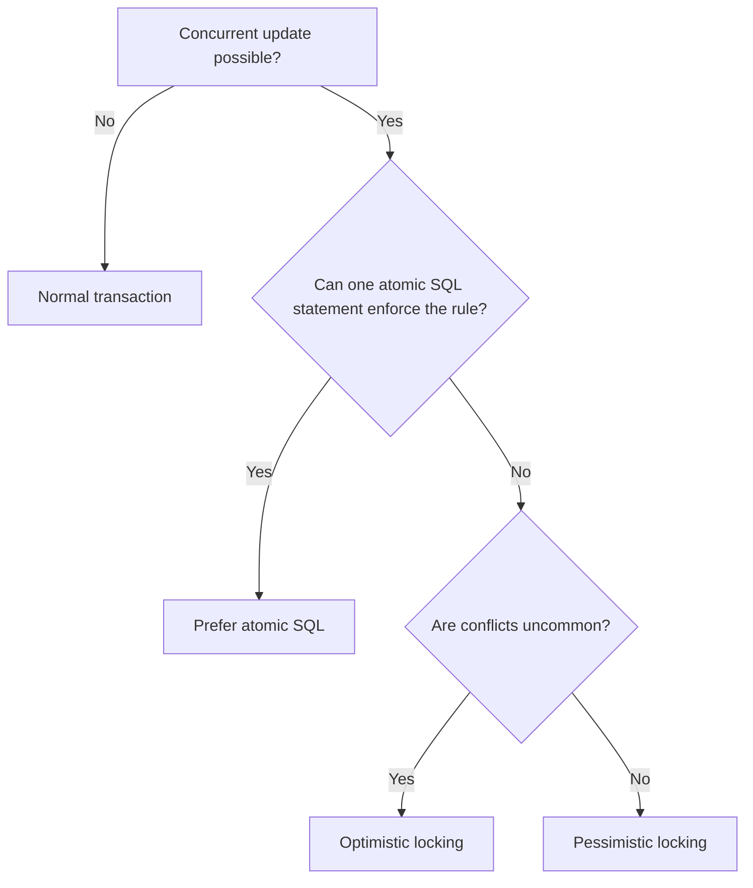
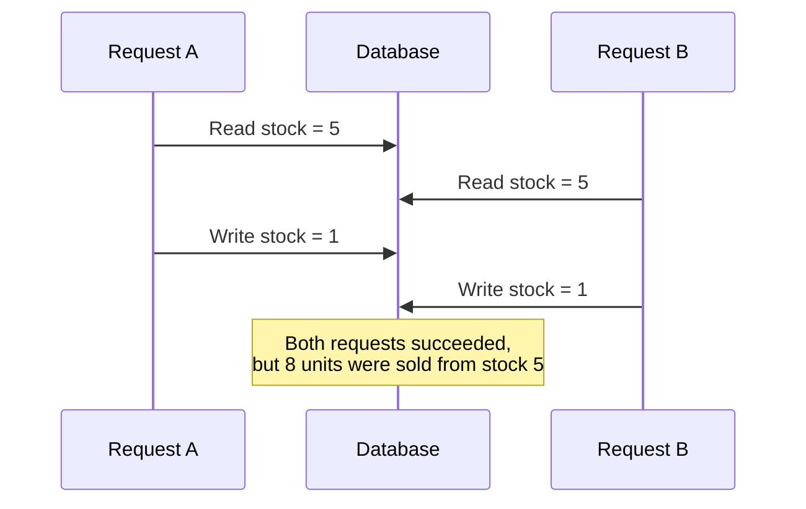
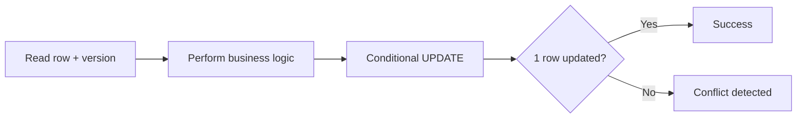
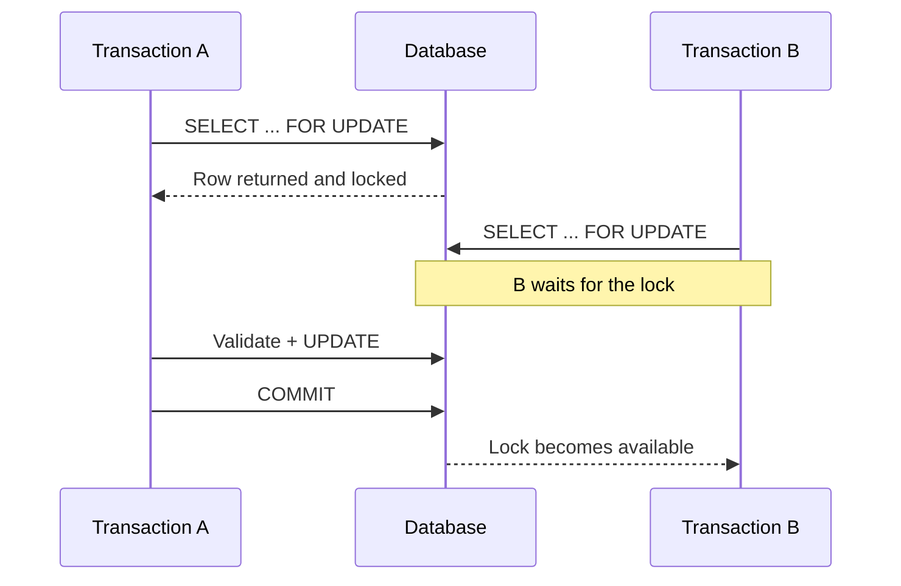

# Locking: Optimistic vs Pessimistic

> Locking protects shared data when multiple transactions try to read and update the same records at the same time.

## In short

- **Optimistic locking** assumes conflicts are uncommon. Read normally, then update only if the row version is still the same.
- **Pessimistic locking** assumes conflicts are likely or expensive. Lock the row first, then validate and update it.
- For simple counters, balances, or stock checks, a **single atomic `UPDATE`** is often better than either explicit strategy.
- Pessimistic transactions should stay **short** because locks are normally held until commit or rollback.
- Optimistic conflicts, deadlocks, serialization failures, and some lock-timeout failures should be handled with controlled retries when the operation is safe to repeat.



---

# 1. Why Locking Is Needed

A common concurrency problem is the **lost update**.

Assume a product has:

```text
stock = 5
```

Two requests try to buy `4` units at nearly the same time.



The unsafe pattern is:

```sql
SELECT stock
FROM products
WHERE id = 101;

-- Application calculates: 5 - 4 = 1

UPDATE products
SET stock = 1
WHERE id = 101;
```

Both requests read the same old value and one write overwrites the other.

Concurrency control makes the **check + update** safe.

---

# 2. Optimistic Locking

Optimistic locking assumes that concurrent updates are relatively rare.

The application does **not** lock the row during the initial read. Instead, it stores a version value and verifies that version during the update.

## 2.1 How it works



Example table:

```sql
CREATE TABLE products (
    id BIGINT PRIMARY KEY,
    name VARCHAR(200) NOT NULL,
    stock INTEGER NOT NULL CHECK (stock >= 0),
    version BIGINT NOT NULL DEFAULT 1
);
```

Suppose the application reads:

```text
id = 101
stock = 5
version = 7
```

The update becomes:

```sql
UPDATE products
SET
    stock = stock - 4,
    version = version + 1
WHERE id = 101
  AND version = 7
  AND stock >= 4;
```

Interpret the affected-row count:

```text
1 row updated
    → Update succeeded.

0 rows updated
    → Version changed, stock is insufficient,
      or the row no longer exists.
```

The important rule is:

> Never use optimistic locking without checking the affected-row count.

## 2.2 When optimistic locking fits

Use it when:

- Reads are much more common than conflicting writes.
- A user may keep an edit form open for a long time.
- The version can travel through an API request.
- A stale update can be rejected or retried.
- Keeping a database transaction open across the full interaction is not practical.

Typical examples include profile editing, document editing, product metadata, and administrative configuration.

## 2.3 Conflict handling

A version conflict is usually an expected application outcome, not automatically a server failure.

Common choices are:

- Reload the newest record.
- Return an HTTP `409 Conflict`.
- Merge non-conflicting fields.
- Retry automatically when the operation is idempotent and safe to repeat.

---

# 3. Pessimistic Locking

Pessimistic locking locks the row **before** the application makes the business decision.

The common SQL pattern is:

```sql
BEGIN;

SELECT id, stock
FROM products
WHERE id = 101
FOR UPDATE;

-- Validate current stock.

UPDATE products
SET stock = stock - 4
WHERE id = 101;

COMMIT;
```



The selected row stays locked until the transaction finishes.

## 3.1 `NOWAIT`

Use `NOWAIT` when the request should fail immediately instead of waiting.

```sql
SELECT id, stock
FROM products
WHERE id = 101
FOR UPDATE NOWAIT;
```

This is useful when low request latency matters and the application can return a “resource busy” response or retry later.

## 3.2 `SKIP LOCKED`

`SKIP LOCKED` ignores rows already locked by another transaction.

```sql
SELECT id
FROM jobs
WHERE status = 'PENDING'
ORDER BY created_at
FOR UPDATE SKIP LOCKED
LIMIT 10;
```

It is commonly used for concurrent job workers because each worker can claim different rows.

It should not be treated as a normal reporting query because locked rows are intentionally omitted.

## 3.3 Keep pessimistic transactions short

Avoid:

```text
BEGIN
Lock row
Call external API
Perform long computation
Update row
COMMIT
```

Prefer:

```text
BEGIN
Lock row
Validate and update local state
COMMIT

Perform external work afterwards
```

Long-held locks increase blocking, timeout risk, and deadlock probability.

---

# 4. Optimistic vs Pessimistic

| Area | Optimistic | Pessimistic |
|---|---|---|
| Assumption | Conflicts are uncommon | Conflicts are likely or expensive |
| Initial read | Normal read | Locking read |
| Typical SQL | `UPDATE ... WHERE version = ?` | `SELECT ... FOR UPDATE` |
| Conflict detection | During update | Before/during locked work |
| Waiting | Usually little blocking before write | Other transactions may wait |
| Best fit | Forms, APIs, metadata edits | Scarce resources, strict state changes |
| Main risk | Repeated conflicts and retries | Blocking and deadlocks |
| Transaction length | Usually short | Must stay short |
| Retry handling | Common | Needed for deadlocks/timeouts in some cases |

A useful mental model is:

```text
Optimistic
    "Do the work, then verify nobody changed the row."

Pessimistic
    "Reserve the row first, then do the work."
```

---

# 5. Prefer Atomic SQL When Possible

Before adding explicit locking, check whether the business rule can be expressed in one database statement.

For inventory:

```sql
UPDATE products
SET stock = stock - :quantity
WHERE id = :id
  AND stock >= :quantity;
```

Then check the row count:

```text
1 row updated
    → Stock reserved successfully.

0 rows updated
    → Insufficient stock or product not found.
```

Why this is powerful:

- No separate read-modify-write race.
- Less application logic.
- Shorter transaction.
- Less lock contention.
- The database enforces the rule atomically.

For simple state changes, this is often the best first choice.

---

# 6. Django Patterns

## 6.1 Pessimistic locking with `select_for_update()`

```python
from django.core.exceptions import ValidationError
from django.db import transaction


@transaction.atomic
def reserve_stock(product_id: int, quantity: int) -> None:
    product = (
        Product.objects
        .select_for_update()
        .get(id=product_id)
    )

    if product.stock < quantity:
        raise ValidationError("Insufficient stock.")

    product.stock -= quantity
    product.save(update_fields=["stock"])
```

Important points:

- Evaluate `select_for_update()` inside a transaction.
- The selected rows stay locked until the transaction ends.
- `nowait=True` can fail immediately.
- `skip_locked=True` can skip rows locked by another transaction.
- Backend support differs; for example, SQLite does not provide normal row-level `SELECT ... FOR UPDATE` behavior.

## 6.2 Optimistic locking with a version field

Django does not automatically add optimistic locking just because a model has a `version` field.

```python
from django.db import models


class Product(models.Model):
    name = models.CharField(max_length=200)
    stock = models.PositiveIntegerField()
    version = models.PositiveBigIntegerField(default=1)
```

Use a conditional update:

```python
from django.db.models import F


updated_rows = (
    Product.objects
    .filter(
        id=product_id,
        version=expected_version,
    )
    .update(
        name=new_name,
        version=F("version") + 1,
    )
)

if updated_rows == 0:
    raise ConcurrencyConflict()
```

## 6.3 Atomic update with `F()`

For a simple stock decrement:

```python
from django.db.models import F


updated_rows = (
    Product.objects
    .filter(
        id=product_id,
        stock__gte=quantity,
    )
    .update(
        stock=F("stock") - quantity,
    )
)

if updated_rows == 0:
    raise InsufficientStock()
```

This is usually cleaner than loading the row, changing the Python value, and saving it again.

---

# 7. Locking, MVCC, and Isolation Levels

These concepts are related but different.

```text
MVCC
    Database mechanism that keeps multiple row versions
    so readers and writers can work with less blocking.

Optimistic locking
    Application pattern that detects stale data during update.

Pessimistic locking
    Explicitly locks rows before the business decision.

Isolation level
    Defines which concurrent changes a transaction can observe
    and which anomalies the database prevents.
```

A database using MVCC does **not** automatically make every application read-modify-write sequence safe.

At stronger isolation levels such as `SERIALIZABLE`, the database may abort a transaction when concurrent execution cannot be safely serialized. In that case, retry the **entire transaction**, not only the failed SQL statement.

---

# 8. Production Best Practices

## Keep transactions short

Do not keep locks open while:

- Calling payment providers.
- Sending emails.
- Waiting for another service.
- Waiting for user input.
- Performing expensive computation.

## Use database constraints

Keep important invariants close to the data.

```sql
CHECK (stock >= 0)
```

Application validation improves error messages, but database constraints protect every code path.

## Lock rows in a consistent order

When multiple rows must be locked, use the same ordering everywhere.

```sql
SELECT id, balance
FROM accounts
WHERE id IN (:id1, :id2)
ORDER BY id
FOR UPDATE;
```

Consistent ordering reduces a common source of deadlocks.

## Use selective indexed queries

Prefer:

```sql
WHERE id = :id
```

over broad locking scans.

The more rows a locking query touches, the greater the potential contention.

## Retry carefully

Retry only when the operation is safe to repeat.

Use:

- A bounded retry count.
- Backoff and jitter.
- Full transaction restart when required.
- Idempotency keys for external side effects.

## Monitor contention

Useful metrics include:

- Lock wait duration.
- Deadlock count.
- Transaction duration.
- Optimistic conflict rate.
- Retry count.
- Database connection-pool saturation.

---

# Final Takeaway

```text
Simple database rule?
    → Prefer one atomic SQL statement.

Conflicts are rare and stale writes can be detected?
    → Optimistic locking.

The latest row must be reserved before making the decision?
    → Pessimistic locking.
```

The key is not to choose the most advanced locking strategy. Choose the **smallest concurrency mechanism that safely protects the business rule**.
