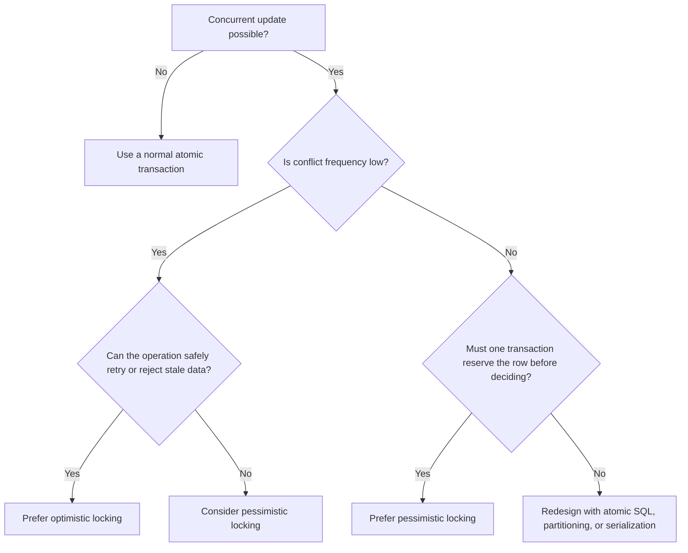
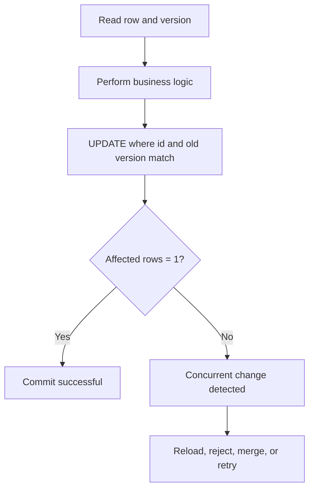
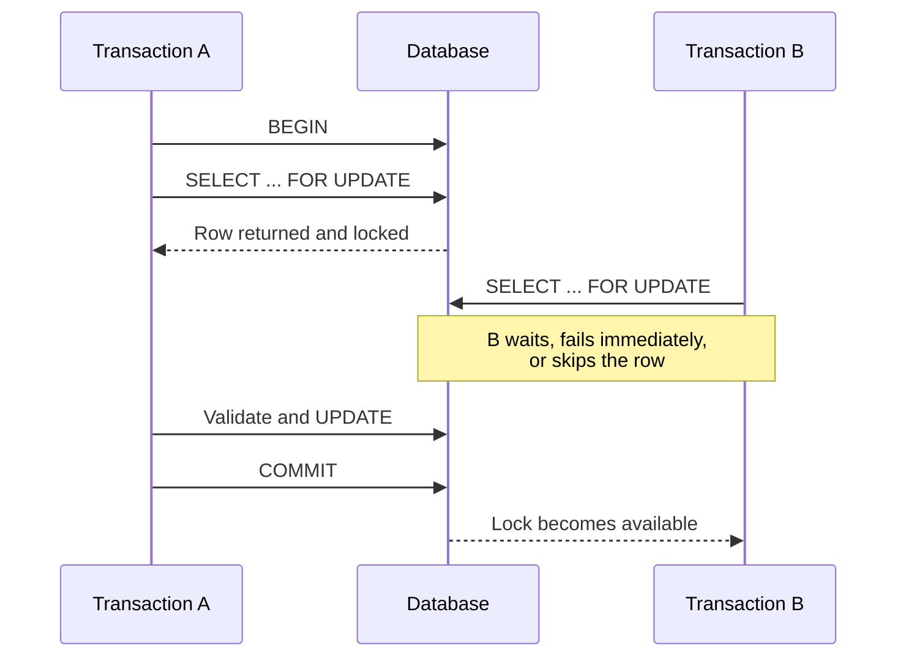

# Locking: Optimistic vs Pessimistic

> Understand how applications protect shared data when multiple transactions try to update it concurrently.

## In short

- Two concurrent read-modify-write sequences overwrite each other; this **lost update** is the problem both strategies exist to prevent.
- **Optimistic locking**: read normally, then `UPDATE ... WHERE id = ? AND version = ?`; zero affected rows means another transaction got there first.
- **Pessimistic locking**: `SELECT ... FOR UPDATE` reserves the row before the business decision, so other transactions wait, fail with `NOWAIT`, or move on with `SKIP LOCKED`.
- Optimistic fits read-heavy edits, long-open forms, and APIs that carry a version; pessimistic fits scarce resources, ledger balances, and job queues.
- One conditional statement — `UPDATE ... SET stock = stock - :quantity WHERE id = :id AND stock >= :quantity` — often replaces both strategies and removes the separate read.
- A pessimistic transaction must stay short: no external API calls, no user think time, no long computation while a row lock is held.
- Version conflicts, deadlocks, lock timeouts, and serialization failures are all retryable — retry the whole transaction, bounded, with idempotency for external side effects.



**Interview answer:** Optimistic locking assumes conflicts are rare, so it reads the row with its version, does the business logic, and commits with `UPDATE ... WHERE id = :id AND version = :expected_version`, treating zero affected rows as a conflict to reject, merge, or retry. Pessimistic locking assumes a conflict is likely or expensive, so it takes the row lock up front with `SELECT ... FOR UPDATE` and other transactions wait behind it. I reach for optimistic on read-heavy, form- or API-driven edits where a transaction cannot stay open across the user interaction, and for pessimistic where the row is a scarce resource — wallet balances, inventory allocation, job-queue claiming — and repeating the work is expensive.

**Gotcha:** Writing the conditional `UPDATE` but never checking the affected-row count — the statement "succeeds" having changed zero rows, and the lost update returns silently.

---

# 1. Why Locking Is Needed

Modern applications serve many requests at the same time. Two API requests, background workers, scheduled jobs, or separate services may read and update the same database row concurrently.

Without concurrency control, an application can produce:

- Lost updates
- Negative inventory
- Duplicate processing
- Incorrect account balances
- Multiple workers processing the same job
- Business rules being validated against stale data

Locking is one way to coordinate these concurrent operations.

There are two common application-level strategies:

```text
Optimistic locking
    Assume conflicts are uncommon.
    Do not reserve the row while reading.
    Detect a conflict when updating.

Pessimistic locking
    Assume a conflict is possible or expensive.
    Lock the row before making the business decision.
    Other conflicting transactions wait, fail, or skip it.
```

Both approaches still use normal database transactions. The difference is **when and how the application handles concurrent access**.

---

# 2. The Lost Update Problem

Consider product `101` with `stock = 5`.

Two customers try to buy four units at nearly the same time.


A simple read-modify-write sequence is unsafe:

```sql
SELECT stock
FROM products
WHERE id = 101;

-- Application calculates: 5 - 4 = 1

UPDATE products
SET stock = 1
WHERE id = 101;
```

The second update overwrites the result of the first update. This is a **lost update**.

A better design must make the validation and update concurrency-safe.

---

# 3. Optimistic Locking

Optimistic locking assumes that concurrent changes are relatively uncommon.

It does not keep an application-level lock from the initial read until the later update. Instead, the application remembers which row version it read and updates the row only if that version is still current.

> Optimistic locking is usually implemented with a conditional `UPDATE`, not with a special SQL `LOCK` statement.

## 3.1 How It Works

A typical optimistic flow is:



The important step is the conditional write:

```sql
UPDATE table_name
SET
    value = :new_value,
    version = version + 1
WHERE
    id = :id
    AND version = :expected_version;
```

The database returns the number of affected rows:

- `1` row affected: the version matched and the update succeeded.
- `0` rows affected: the row was deleted, changed by another transaction, or failed another condition.

The application must treat `0` affected rows as a concurrency conflict unless another condition explains it.

---

## 3.2 Version Column Pattern

### Table design

```sql
CREATE TABLE products (
    id          BIGINT PRIMARY KEY,
    name        VARCHAR(200) NOT NULL,
    stock       INTEGER NOT NULL CHECK (stock >= 0),
    version     BIGINT NOT NULL DEFAULT 1,
    updated_at  TIMESTAMP NOT NULL DEFAULT CURRENT_TIMESTAMP
);
```

The `version` column changes on every relevant update.

### Initial read

```sql
SELECT id, name, stock, version
FROM products
WHERE id = 101;
```

Assume the result is `id = 101`, `stock = 5`, `version = 7`.

### Conditional update

```sql
UPDATE products
SET
    stock = stock - 4,
    version = version + 1,
    updated_at = CURRENT_TIMESTAMP
WHERE
    id = 101
    AND version = 7
    AND stock >= 4;
```

This statement protects three things:

1. `id = 101` identifies the row.
2. `version = 7` verifies that no relevant update occurred after the read.
3. `stock >= 4` enforces the business invariant inside the database operation.

After the update, inspect the affected-row count.

```text
Affected rows = 1
    Purchase succeeded.

Affected rows = 0
    Version changed, stock is insufficient, or the row no longer exists.
    Re-read the row and decide how to respond.
```

### Why increment the version in the same statement?

The comparison and increment must be atomic: `SET version = version + 1` belongs in the same statement as `WHERE version = :expected_version`.

Do not perform a separate version update after changing the business fields. Another transaction could enter between the two statements.

---

## 3.3 Timestamp and Value Comparison

A numeric version column is usually the clearest option, but optimistic concurrency can also use other comparison values.

### Updated timestamp

```sql
UPDATE documents
SET
    content = :new_content,
    updated_at = CURRENT_TIMESTAMP
WHERE
    id = :id
    AND updated_at = :previous_updated_at;
```

This works only when the timestamp has sufficient precision and is consistently generated. Numeric versions are generally easier to reason about.

### Compare original column values

```sql
UPDATE customer_profiles
SET
    phone = :new_phone
WHERE
    id = :id
    AND phone = :original_phone;
```

This is useful when only one field matters, but it becomes difficult when many columns participate in the concurrency check.

### SQL Server `rowversion`

SQL Server provides the `rowversion` data type, which automatically changes when a row containing it is updated.

```sql
CREATE TABLE products (
    id          BIGINT PRIMARY KEY,
    stock       INT NOT NULL,
    rv          ROWVERSION
);
```

The update can include the previously read `rowversion` value:

```sql
UPDATE products
SET stock = @new_stock
WHERE id = @id
  AND rv = @expected_rowversion;
```

Despite its old synonym `timestamp`, SQL Server `rowversion` is a binary version marker, not a date or time.

---

## 3.4 Retry and Conflict Handling

A conflict is an expected outcome in optimistic locking. It should not automatically be treated as an internal server error.

Common responses include:

### Reject the stale update

Useful for forms and administrative screens.

```text
HTTP 409 Conflict

"The record was changed by another user.
Reload the latest version and try again."
```

### Reload and merge

Useful when users edit independent fields.

Example:

```text
User A changes the phone number.
User B changes the display name.

The application may merge both changes after checking that
the same field was not edited concurrently.
```

### Retry automatically

Useful when:

- The operation is idempotent
- The business logic can safely be executed again
- Conflicts are temporary
- The retry count is bounded

```python
MAX_RETRIES = 3

for attempt in range(MAX_RETRIES):
    current = load_record()

    updated = conditional_update(
        record_id=current.id,
        expected_version=current.version,
        new_values=calculate_new_values(current),
    )

    if updated:
        break
else:
    raise ConcurrencyConflict()
```

A production retry strategy should normally include:

- A small maximum retry count
- Exponential backoff
- Random jitter
- Complete transaction restart when required
- Idempotency protection for external side effects

Do not retry forever. High conflict rates usually indicate that the chosen concurrency strategy or data model needs improvement.

---

# 4. Pessimistic Locking

Pessimistic locking assumes that a conflicting operation may occur and that allowing both transactions to proceed would be risky or wasteful.

The transaction locks the target row before making the business decision.



The lock is normally held until the transaction commits or rolls back.

## 4.1 `SELECT ... FOR UPDATE`

### Inventory example

```sql
BEGIN;

SELECT id, stock
FROM products
WHERE id = 101
FOR UPDATE;
```

The application now validates the locked row:

```text
If stock >= requested quantity:
    perform the update
Else:
    reject the purchase
```

```sql
UPDATE products
SET stock = stock - 4
WHERE id = 101;

COMMIT;
```

A second transaction trying to acquire an incompatible lock on the same row normally waits until the first transaction ends.

### Account transfer example

When transferring between two accounts, lock both rows in a consistent order.

```sql
BEGIN;

SELECT id, balance
FROM accounts
WHERE id IN (1001, 2002)
ORDER BY id
FOR UPDATE;

-- Validate the source balance.

UPDATE accounts
SET balance = balance - 100
WHERE id = 1001;

UPDATE accounts
SET balance = balance + 100
WHERE id = 2002;

COMMIT;
```

The `ORDER BY id` represents a consistent lock order. Every code path transferring between accounts should acquire locks in the same order to reduce deadlock risk.

> The transaction should remain short. Do not call slow external APIs, wait for user input, or perform long computations while holding database locks.

---

## 4.2 `NOWAIT` and `SKIP LOCKED`

A normal `FOR UPDATE` statement may wait for a conflicting lock. Some databases provide alternatives.

### `NOWAIT`

Fail immediately when the row is already locked.

```sql
SELECT id, stock
FROM products
WHERE id = 101
FOR UPDATE NOWAIT;
```

Use it when:

- Waiting would harm request latency
- The application can return a “resource is busy” response
- A retry can occur later

### `SKIP LOCKED`

Ignore rows currently locked by other transactions.

```sql
SELECT id
FROM jobs
WHERE status = 'PENDING'
ORDER BY created_at
FOR UPDATE SKIP LOCKED
LIMIT 10;
```

This pattern is useful for concurrent queue workers:

```text
Worker A locks jobs 1-10.
Worker B skips those rows and locks jobs 11-20.
Both workers process different jobs.
```

A typical transaction is:

```sql
BEGIN;

SELECT id
FROM jobs
WHERE status = 'PENDING'
ORDER BY created_at
FOR UPDATE SKIP LOCKED
LIMIT 10;

UPDATE jobs
SET
    status = 'PROCESSING',
    started_at = CURRENT_TIMESTAMP
WHERE id IN (:selected_job_ids);

COMMIT;
```

`SKIP LOCKED` provides an intentionally inconsistent view because locked rows are omitted. It is suitable for queue-like processing, not for general reporting or business queries that require a complete result set.

---

## 4.3 Lock Scope and Indexes

A statement that appears to target one row may lock more data than expected.

The exact behavior depends on:

- Database engine
- Indexes
- Query execution plan
- Transaction isolation level
- Predicate type
- Foreign-key relationships
- Row, range, page, or table lock escalation rules

### Index-friendly lookup

```sql
SELECT *
FROM orders
WHERE id = 5001
FOR UPDATE;
```

With `id` as a primary key, the database can normally locate and lock the target efficiently.

### Broad or unindexed lookup

```sql
SELECT *
FROM orders
WHERE status = 'PENDING'
FOR UPDATE;
```

This may scan and lock many rows. In MySQL InnoDB, locking statements generally lock the index records scanned, so poor indexing can greatly increase contention.

Practical rule:

> The narrower and better indexed the locking query,  
> the smaller and more predictable its lock footprint.

---

# 5. Optimistic vs Pessimistic Comparison

| Area | Optimistic Locking | Pessimistic Locking |
|---|---|---|
| Core assumption | Conflicts are uncommon | Conflicts are likely or costly |
| Initial read | Normal non-locking read | Locking read |
| Conflict discovery | At conditional update or commit | Before or during locked operation |
| Typical SQL | `UPDATE ... WHERE id = ? AND version = ?` | `SELECT ... FOR UPDATE` |
| Waiting | Usually no waiting during the initial read | Other transactions may wait |
| Failure mode | Version mismatch or serialization failure | Lock timeout, deadlock, or immediate lock error |
| Throughput | Often better under low contention | Can decrease under heavy lock contention |
| User experience | User may edit stale data and receive a conflict later | User may wait while another transaction holds the lock |
| Transaction duration | Can be short at write time; version may travel across API requests | Must cover the read, decision, and write |
| Retry need | Normal part of the design | Needed for deadlocks, timeouts, or `NOWAIT` failures |
| Best fit | Read-heavy systems, forms, APIs, distributed services | Financial updates, scarce resources, work queues |
| Main risk | Excessive conflicts and retry storms | Blocking, deadlocks, and long-running transactions |

---

# 6. Choosing the Right Strategy

The decision path at the top of this note narrows the choice quickly. The criteria below make it concrete.

## Prefer optimistic locking when

- The system has many reads and relatively few writes
- Users may keep a form open for several minutes
- Holding a database transaction across the user interaction is impossible
- Conflicts can be clearly reported
- Operations can be retried safely
- The application is distributed across multiple services
- A version value can be included in an API payload

Typical examples:

- Editing a customer profile
- Updating a document
- Changing product metadata
- Administrative configuration
- REST APIs using ETags or version fields

## Prefer pessimistic locking when

- The row represents a scarce resource
- A conflict is common
- The check and update must operate on the latest committed state
- Repeating the business operation is expensive
- Multiple dependent rows must be changed consistently
- Workers must claim tasks exactly once at a time

Typical examples:

- Wallet or ledger balance operations
- Seat or room reservation finalization
- Inventory allocation
- Job queue claiming
- Sequential number allocation
- State-machine transitions with strict ordering

## Consider neither as the first option when one atomic statement is enough

Many concurrency problems can be solved with a single conditional statement:

```sql
UPDATE products
SET stock = stock - :quantity
WHERE id = :id
  AND stock >= :quantity;
```

This avoids a separate read and write.

Check the affected-row count: `1` means the stock was reserved, `0` means insufficient stock or a missing product.

Atomic SQL is often simpler and faster than introducing an explicit application locking strategy.

---

# 7. Practical Use Cases

## 7.1 Editing a Customer Profile — Optimistic

A client retrieves:

```json
{
  "id": 42,
  "display_name": "Asha",
  "phone": "555-0100",
  "version": 8
}
```

The update request includes the version:

```json
{
  "display_name": "Asha Patel",
  "phone": "555-0100",
  "version": 8
}
```

The server executes:

```sql
UPDATE customer_profiles
SET
    display_name = :display_name,
    phone = :phone,
    version = version + 1
WHERE id = :id
  AND version = :version;
```

When the row count is zero, return a conflict and the current representation or ask the client to reload it.

---

## 7.2 Inventory Reservation — Atomic or Pessimistic

### Prefer an atomic update when the rule is simple

```sql
UPDATE inventory
SET available_quantity = available_quantity - :quantity
WHERE product_id = :product_id
  AND available_quantity >= :quantity;
```

### Use pessimistic locking when the decision is complex

For example, allocation depends on:

- Multiple warehouses
- Expiry dates
- Batch priorities
- Reserved quantities
- Shipping region
- Several rows that must be updated together

```sql
BEGIN;

SELECT id, available_quantity, expires_at
FROM inventory_batches
WHERE product_id = :product_id
  AND available_quantity > 0
ORDER BY expires_at, id
FOR UPDATE;

-- Application calculates the allocation across locked batches.

UPDATE inventory_batches
SET available_quantity = available_quantity - :allocated
WHERE id = :batch_id;

COMMIT;
```

---

## 7.3 Background Job Workers — Pessimistic with `SKIP LOCKED`

```sql
BEGIN;

SELECT id, payload
FROM jobs
WHERE status = 'PENDING'
  AND run_after <= CURRENT_TIMESTAMP
ORDER BY priority DESC, created_at
FOR UPDATE SKIP LOCKED
LIMIT 1;

UPDATE jobs
SET
    status = 'PROCESSING',
    worker_id = :worker_id,
    started_at = CURRENT_TIMESTAMP
WHERE id = :job_id;

COMMIT;
```

The transaction only claims the job. The long-running job execution occurs **after commit**, so the row lock is not held during the entire task.

A lease or timeout mechanism can return abandoned jobs to `PENDING`.

---

## 7.4 Account Transfer — Pessimistic

A transfer normally needs the current balances and coordinated updates to multiple rows.

```sql
BEGIN;

SELECT id, balance
FROM accounts
WHERE id IN (:source_id, :destination_id)
ORDER BY id
FOR UPDATE;

-- Validate source account and business limits.

UPDATE accounts
SET balance = balance - :amount
WHERE id = :source_id;

UPDATE accounts
SET balance = balance + :amount
WHERE id = :destination_id;

INSERT INTO transfers (
    source_account_id,
    destination_account_id,
    amount,
    idempotency_key
)
VALUES (
    :source_id,
    :destination_id,
    :amount,
    :idempotency_key
);

COMMIT;
```

Important supporting controls include:

- A database constraint preventing invalid balances where appropriate
- A unique idempotency key
- Consistent lock ordering
- An immutable ledger for auditable financial systems

---

## 7.5 Workflow Transition — Optimistic

Assume an order can move from `PENDING` to `APPROVED` only once.

```sql
UPDATE orders
SET
    status = 'APPROVED',
    approved_at = CURRENT_TIMESTAMP,
    version = version + 1
WHERE id = :order_id
  AND status = 'PENDING'
  AND version = :expected_version;
```

This is optimistic locking plus a state precondition. It prevents a stale request from approving an already cancelled or modified order.

---

# 8. Relationship with MVCC and Isolation Levels

## 8.1 MVCC is not the same as optimistic locking

Databases such as PostgreSQL and MySQL InnoDB use Multi-Version Concurrency Control (MVCC). MVCC allows readers to see a consistent row version while other transactions modify newer versions.

MVCC improves reader-writer concurrency, but it does not automatically make every application read-modify-write sequence safe.

```text
MVCC
    Database mechanism for maintaining multiple row versions.

Optimistic locking
    Application or ORM pattern that checks whether the row changed.

Pessimistic locking
    Transaction pattern that explicitly prevents conflicting row changes.
```

## 8.2 Isolation level is not a complete replacement

Transaction isolation controls which concurrent changes a transaction can observe and which anomalies the database prevents. The levels themselves, and how they differ per engine, are covered in [Transaction Isolation Levels](transaction-isolation-levels.md).

No isolation level removes the need for a concurrency strategy in the application:

- Under Read Committed, the common default, each statement may see a newer committed snapshot, so a separate `SELECT` followed by an `UPDATE` can still require an atomic condition, version check, or explicit row lock.
- Repeatable Read provides a more stable transaction snapshot, but database-specific conflict behavior differs and business invariants still need enforcing.
- Serializable provides the strongest semantics, but the database may abort a transaction when it detects that concurrent execution cannot be serialized. The application must then retry the **entire transaction**, not only the failed SQL statement.

PostgreSQL identifies serialization failures with SQLSTATE `40001` and deadlocks with `40P01`.

## 8.3 Normal writes still take locks

“Optimistic” does not mean “the database takes no locks.”

When a conditional `UPDATE` executes, the database still takes the locks needed to perform that write safely. The optimistic part is that the application does not reserve the row during the earlier read and instead detects stale state at write time.

---

# 9. Django Examples

## 9.1 Pessimistic locking with `select_for_update()`

```python
from django.db import transaction
from django.core.exceptions import ValidationError

@transaction.atomic
def reserve_stock(product_id: int, quantity: int) -> None:
    product = (
        Product.objects
        .select_for_update()
        .get(id=product_id)
    )

    if product.stock < quantity:
        raise ValidationError("Insufficient stock.")

    product.stock -= quantity
    product.save(update_fields=["stock"])
```

`select_for_update()` must be evaluated inside a transaction on database backends that support row locking.

### Fail immediately

```python
product = (
    Product.objects
    .select_for_update(nowait=True)
    .get(id=product_id)
)
```

### Skip rows already claimed by another worker

```python
with transaction.atomic():
    jobs = list(
        Job.objects
        .select_for_update(skip_locked=True)
        .filter(status=Job.Status.PENDING)
        .order_by("created_at")[:10]
    )

    Job.objects.filter(id__in=[job.id for job in jobs]).update(
        status=Job.Status.PROCESSING
    )
```

The actual task processing should usually happen after the claim transaction commits.

---

## 9.2 Optimistic locking with a version field

Django does not automatically apply a version condition merely because a model contains an integer named `version`. Implement the conditional update explicitly or use a carefully selected package.

```python
from django.db import models

class Product(models.Model):
    name = models.CharField(max_length=200)
    stock = models.PositiveIntegerField()
    version = models.PositiveBigIntegerField(default=1)
```

Conditional update:

```python
from django.db.models import F

def update_product_name(
    product_id: int,
    expected_version: int,
    new_name: str,
) -> bool:
    updated_rows = (
        Product.objects
        .filter(
            id=product_id,
            version=expected_version,
        )
        .update(
            name=new_name,
            version=F("version") + 1,
        )
    )

    return updated_rows == 1
```

Usage:

```python
updated = update_product_name(
    product_id=101,
    expected_version=7,
    new_name="Mechanical Keyboard",
)

if not updated:
    raise ConcurrencyConflict(
        "The product was modified by another request."
    )
```

## 9.3 Atomic stock update with Django expressions

When a separate read is unnecessary:

```python
from django.db.models import F

updated_rows = (
    Product.objects
    .filter(
        id=product_id,
        stock__gte=quantity,
    )
    .update(
        stock=F("stock") - quantity,
    )
)

if updated_rows == 0:
    raise InsufficientStock()
```

This lets the database perform the check and decrement atomically.

---

# 10. Database-Specific Notes

| Database | Pessimistic pattern | Optimistic support or pattern | Important note |
|---|---|---|---|
| PostgreSQL | `SELECT ... FOR UPDATE`, `FOR NO KEY UPDATE`, `FOR SHARE`, `FOR KEY SHARE`, with `NOWAIT` or `SKIP LOCKED` | Version column and conditional update; Serializable may raise retryable serialization failures | Row locks normally last until transaction end; deadlocks are detected |
| MySQL InnoDB | `SELECT ... FOR UPDATE` or `FOR SHARE`, with supported `NOWAIT` and `SKIP LOCKED` options | Version column and conditional update | Lock footprint depends heavily on indexes and scanned index records |
| SQL Server | Lock hints such as `UPDLOCK`; locking and row-versioning isolation options | `rowversion`, original-value comparison, or version column | `rowversion` is binary version data, not a timestamp |
| Oracle Database | `SELECT ... FOR UPDATE`, including `NOWAIT`, `WAIT`, and `SKIP LOCKED` | Version column or ORM-managed version check | `SKIP LOCKED` is commonly used for queue-style access |
| SQLite | Coarser locking model; no standard row-level `SELECT ... FOR UPDATE` behavior | Conditional update with version/value comparison | Write concurrency is limited compared with server databases |

SQL syntax and lock behavior are not perfectly portable. Verify the documentation for the exact database version and driver in use.

---

# 11. Production Best Practices

## 11.1 Keep transactions short

A transaction holding row locks should contain only the necessary database work.

Avoid this pattern:

```text
BEGIN
Lock row
Call payment provider
Send email
Wait for another service
Update row
COMMIT
```

Prefer:

```text
BEGIN
Lock and update local state
Write outbox/event record
COMMIT

Perform external work using an idempotent worker
```

## 11.2 Put business invariants in SQL where possible

Use constraints such as `CHECK (stock >= 0)` and conditional updates as the final safety layer.

```sql
UPDATE inventory
SET stock = stock - :quantity
WHERE id = :id
  AND stock >= :quantity;
```

Application validation improves user feedback, but database-level enforcement protects every code path.

## 11.3 Use narrow, indexed lock queries

Lock rows by primary key or another selective indexed predicate whenever possible.

```sql
SELECT *
FROM accounts
WHERE id = :account_id
FOR UPDATE;
```

Broad scans can increase blocking and deadlock probability.

## 11.4 Acquire multiple locks in a consistent order

```sql
SELECT *
FROM accounts
WHERE id IN (:id1, :id2)
ORDER BY id
FOR UPDATE;
```

A consistent order does not eliminate every deadlock, but it removes a common cause.

## 11.5 Configure timeouts

Do not allow requests to wait indefinitely for locks.

Depending on the database, configure:

- Lock timeout
- Statement timeout
- Transaction timeout
- API request timeout

Handle timeout errors separately from unknown system failures.

## 11.6 Treat retries as part of the design

Retryable situations include:

- Optimistic version conflicts
- Serializable transaction failures
- Deadlocks
- Lock timeouts
- `NOWAIT` lock failures

Retry only when the operation is safe to repeat.

Use an idempotency key for operations such as:

- Payment initiation
- Order submission
- Fund transfer
- Message publication
- External API calls

## 11.7 Monitor contention

Useful production metrics include:

- Lock wait duration
- Number of blocked sessions
- Deadlock count
- Transaction duration
- Optimistic conflict rate
- Retry count
- Retry success rate
- Rows scanned by locking queries
- Queue claim latency
- Database connection-pool saturation

A rising optimistic conflict rate may indicate that pessimistic locking, partitioning, or a more atomic data model is needed.

A rising lock-wait time may indicate:

- Transactions are too long
- Queries are missing indexes
- Too many rows are being locked
- Hot rows are concentrating all writes
- External work is occurring inside transactions

## 11.8 Load test the real contention pattern

A single-user test cannot validate locking behavior.

Test with concurrent transactions that target:

- The same row
- Overlapping row ranges
- Multiple rows in opposite orders
- Queue batches
- Slow transactions
- Rollbacks
- Timeouts
- Process crashes

Verify both correctness and acceptable latency.

---

# 12. Official References

- [PostgreSQL — Explicit Locking](https://www.postgresql.org/docs/current/explicit-locking.html)
- [PostgreSQL — Transaction Isolation](https://www.postgresql.org/docs/current/transaction-iso.html)
- [PostgreSQL — Serialization Failure Handling](https://www.postgresql.org/docs/current/mvcc-serialization-failure-handling.html)
- [MySQL 8.4 — InnoDB Locks Set by SQL Statements](https://dev.mysql.com/doc/refman/8.4/en/innodb-locks-set.html)
- [MySQL 8.4 — `SELECT` and Locking Options](https://dev.mysql.com/doc/refman/8.4/en/select.html)
- [SQL Server — Transaction Locking and Row Versioning Guide](https://learn.microsoft.com/en-us/sql/relational-databases/sql-server-transaction-locking-and-row-versioning-guide)
- [SQL Server — `rowversion`](https://learn.microsoft.com/en-us/sql/t-sql/data-types/rowversion-transact-sql)
- [Oracle Database — `SELECT`](https://docs.oracle.com/en/database/oracle/oracle-database/19/sqlrf/SELECT.html)
- [Django — QuerySet `select_for_update()`](https://docs.djangoproject.com/en/6.0/ref/models/querysets/#select-for-update)
- [SQLAlchemy — Configuring a Version Counter](https://docs.sqlalchemy.org/en/latest/orm/versioning.html)
