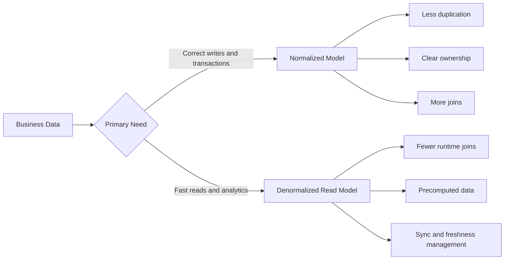
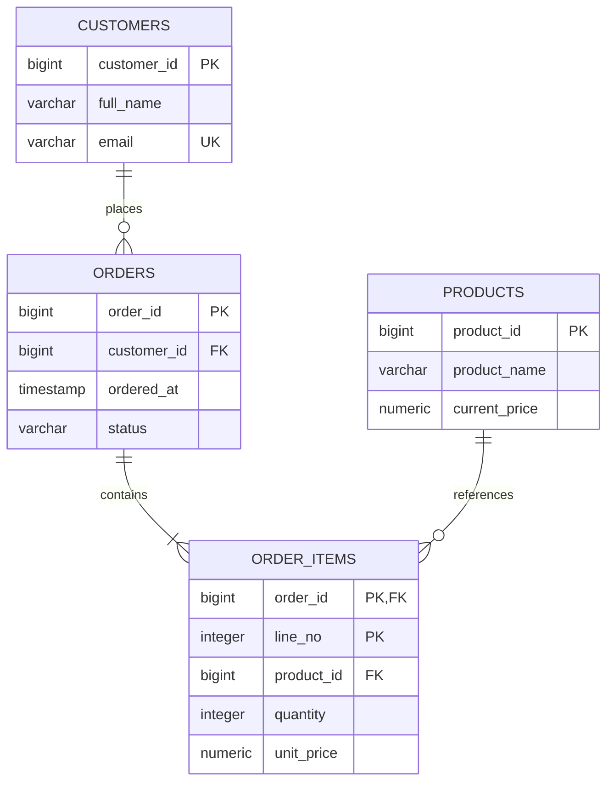
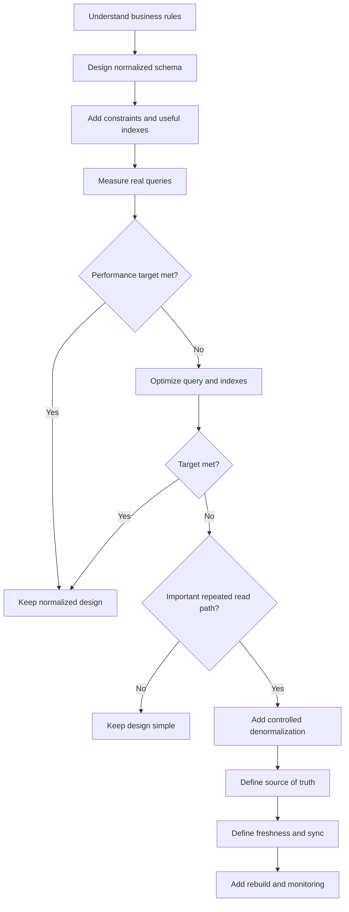

# Normalization vs Denormalization in Databases

> A concise, practical guide for understanding database normalization, denormalization, and when to use each in real systems.

## In Short

- **Normalization** keeps each business fact in the right place and minimizes unnecessary duplication.
- **1NF** removes repeating groups and keeps values in a clear row/column structure.
- **2NF** removes partial dependency on part of a composite key.
- **3NF** removes transitive dependency between non-key attributes.
- **BCNF** is stricter: every determinant should be a superkey.
- **Denormalization** intentionally stores copied or precomputed data to optimize important read paths.
- For most OLTP systems, a **normalized model—commonly around 3NF—is the right starting point**.
- Denormalize only when a real workload justifies the extra consistency and maintenance cost.
- More joins do not automatically mean a bad schema. Check the query plan and indexes first.



---

# 1. Overview

Normalization and denormalization solve different problems.

### Normalization focuses on

- Data correctness
- Clear entity boundaries
- Fewer update anomalies
- Easier maintenance
- Strong transactional design

### Denormalization focuses on

- Faster reads
- Simpler reporting queries
- Precomputed aggregates
- Read-heavy APIs
- Analytics and search workloads

A common production architecture is:

```text
Normalized transactional database
        |
        +--> cache
        +--> materialized view
        +--> summary table
        +--> search index
        +--> analytics warehouse
```

The normalized database remains the source of truth, while other structures optimize specific access patterns.

---

# 2. Why Normalization Is Needed

Consider an order table that mixes customer, order, and product information:

| order_id | customer_name | customer_email | product_name | quantity |
|---:|---|---|---|---:|
| 1001 | Asha Patel | asha@example.com | Keyboard | 1 |
| 1001 | Asha Patel | asha@example.com | Mouse | 2 |
| 1002 | Asha Patel | asha@example.com | Monitor | 1 |

The customer's name and email are repeated in every order line.

This creates three classic problems.

## 2.1 Update Anomaly

If Asha changes her email, every duplicated copy must be updated.

If one row is missed, the database now contains conflicting values.

## 2.2 Insert Anomaly

Suppose product information exists only inside order rows.

A new product cannot be stored until somebody places an order.

## 2.3 Delete Anomaly

If the last order containing a product is deleted, the only stored information about that product may also disappear.

### Core idea

> Store each business fact in the table whose key logically determines that fact.

Examples:

```text
customer_id -> customer_name, customer_email
product_id  -> product_name, current_price
order_id    -> customer_id, ordered_at, status
```

These relationships are called **functional dependencies**.

---

# 3. Normal Forms

For normal application development, the most useful normal forms are:

1. 1NF
2. 2NF
3. 3NF
4. BCNF as an additional refinement

---

## 3.1 First Normal Form — 1NF

A table is practically treated as being in **1NF** when:

- Columns hold a single value for a row
- Repeating groups are removed
- Similar repeated values are represented as rows instead of numbered columns

### Poor design

| order_id | product_1 | product_2 | product_3 |
|---:|---|---|---|
| 1001 | Keyboard | Mouse | NULL |

Problems:

- Number of products is artificially limited
- Adding another product may require a schema change
- Queries must inspect multiple columns

### Better design

`orders`

| order_id | customer_id |
|---:|---:|
| 1001 | 10 |

`order_items`

| order_id | line_no | product_id |
|---:|---:|---:|
| 1001 | 1 | 501 |
| 1001 | 2 | 502 |

Now each product is represented as a row.

### Practical note

1NF does not mean JSON is always wrong.

A JSON column can be useful for optional document-like attributes. It becomes a poor choice when individual values need independent joins, constraints, indexes, or updates.

---

## 3.2 Second Normal Form — 2NF

A table is in **2NF** when:

- It is already in 1NF
- Every non-key attribute depends on the **whole candidate key**
- No non-key attribute depends on only part of a composite key

2NF matters mainly when a table has a composite candidate key.

### Example

Suppose:

```text
PRIMARY KEY (order_id, product_id)
```

and the table contains:

| order_id | product_id | product_name | quantity |
|---:|---:|---|---:|
| 1001 | 501 | Keyboard | 1 |
| 1001 | 502 | Mouse | 2 |

Dependencies:

```text
(order_id, product_id) -> quantity
product_id             -> product_name
```

`product_name` depends only on `product_id`, not on the whole composite key.

So move product details into a separate table:

```text
products(product_id, product_name)

order_items(order_id, product_id, quantity)
```

That removes the partial dependency.

---

## 3.3 Third Normal Form — 3NF

A table is in **3NF** when:

- It is already in 2NF
- Non-key attributes do not depend transitively on the key through another non-key attribute

### Example

Suppose `orders` contains:

| order_id | customer_id | customer_name | customer_email |
|---:|---:|---|---|
| 1001 | 10 | Asha Patel | asha@example.com |

Dependencies:

```text
order_id    -> customer_id
customer_id -> customer_name, customer_email
```

Therefore:

```text
order_id -> customer_id -> customer_name
```

Customer details depend on `customer_id`, so they belong in `customers`, not `orders`.

### Better structure

```text
customers(
    customer_id,
    full_name,
    email
)

orders(
    order_id,
    customer_id,
    ordered_at,
    status
)
```

A useful memory rule is:

> A non-key attribute should depend on the key, the whole key, and nothing but the key.

This is a learning shortcut; real normalization decisions should still follow actual business dependencies.

---

## 3.4 Boyce-Codd Normal Form — BCNF

BCNF is stricter than 3NF.

Its key rule is:

> For every dependency `X -> Y`, `X` should be a superkey.

In normal application schemas, a clean 3NF design often already satisfies BCNF.

BCNF becomes more important when:

- A table has multiple candidate keys
- Candidate keys overlap
- Business rules create unusual functional dependencies

For most day-to-day backend development, strong understanding of **1NF, 2NF, 3NF, and the purpose of BCNF** is enough.

---

# 4. One End-to-End Example

Consider an e-commerce order.

## 4.1 Final normalized model



## 4.2 SQL schema

```sql
CREATE TABLE customers (
    customer_id BIGINT GENERATED ALWAYS AS IDENTITY PRIMARY KEY,
    full_name   VARCHAR(150) NOT NULL,
    email       VARCHAR(320) NOT NULL UNIQUE
);

CREATE TABLE products (
    product_id    BIGINT GENERATED ALWAYS AS IDENTITY PRIMARY KEY,
    product_name  VARCHAR(200) NOT NULL,
    current_price NUMERIC(12, 2) NOT NULL CHECK (current_price >= 0)
);

CREATE TABLE orders (
    order_id    BIGINT GENERATED ALWAYS AS IDENTITY PRIMARY KEY,
    customer_id BIGINT NOT NULL,
    ordered_at  TIMESTAMP NOT NULL DEFAULT CURRENT_TIMESTAMP,
    status      VARCHAR(30) NOT NULL,
    FOREIGN KEY (customer_id) REFERENCES customers(customer_id)
);

CREATE TABLE order_items (
    order_id   BIGINT NOT NULL,
    line_no    INTEGER NOT NULL,
    product_id BIGINT NOT NULL,
    quantity   INTEGER NOT NULL CHECK (quantity > 0),
    unit_price NUMERIC(12, 2) NOT NULL CHECK (unit_price >= 0),

    PRIMARY KEY (order_id, line_no),

    FOREIGN KEY (order_id)
        REFERENCES orders(order_id),

    FOREIGN KEY (product_id)
        REFERENCES products(product_id)
);
```

## 4.3 Why `current_price` and `unit_price` both exist

At first, these columns may look duplicated:

```text
products.current_price
order_items.unit_price
```

But they represent different facts.

- `current_price` = price offered now
- `unit_price` = price actually charged for this order line

If the product price changes tomorrow, historical orders should not change.

So this is not accidental redundancy. It is correct historical modeling.

## 4.4 Reading the normalized model

```sql
SELECT
    o.order_id,
    o.ordered_at,
    c.full_name,
    p.product_name,
    oi.quantity,
    oi.unit_price,
    oi.quantity * oi.unit_price AS line_total
FROM orders AS o
JOIN customers AS c
    ON c.customer_id = o.customer_id
JOIN order_items AS oi
    ON oi.order_id = o.order_id
JOIN products AS p
    ON p.product_id = oi.product_id
WHERE o.order_id = 1001
ORDER BY oi.line_no;
```

This query uses several joins, but each fact has one clear owner.

That is usually a better starting point than duplicating data simply to avoid joins.

---

# 5. Denormalization

Denormalization means intentionally storing copied, combined, or precomputed data to optimize a known workload.

Use it when the benefit is clear and the consistency model is understood.

## 5.1 Common techniques

### Precomputed totals

Instead of recalculating an order total every time:

```sql
SELECT SUM(quantity * unit_price)
FROM order_items
WHERE order_id = 1001;
```

you may store:

```text
orders.total_amount
```

This speeds reads but means writes must keep the stored total correct.

### Materialized views

Useful when an expensive query is read frequently but does not need real-time freshness.

```sql
CREATE MATERIALIZED VIEW product_sales_summary AS
SELECT
    product_id,
    SUM(quantity) AS units_sold,
    SUM(quantity * unit_price) AS revenue
FROM order_items
GROUP BY product_id;
```

The database stores the query result and refreshes it when required.

### Summary tables

Useful for dashboards:

```text
daily_sales_summary(
    sales_date,
    order_count,
    gross_revenue,
    refreshed_at
)
```

Instead of scanning millions of transactions for every dashboard request, the application reads pre-aggregated rows.

### Read models and CQRS

A system may use:

```text
Normalized write model
        |
        | events / change stream
        v
Denormalized read model
```

The write side protects business rules and transactions.

The read side can be shaped specifically for:

- APIs
- search
- filtering
- sorting
- dashboards

This is useful at scale, but it introduces eventual consistency and projection-management complexity.

### Analytics star schema

Analytics systems often use:

```text
fact_sales
    |
    +-- dim_date
    +-- dim_customer
    +-- dim_product
```

This structure is optimized for reporting and aggregation rather than transactional writes.

---

# 6. Normalization vs Denormalization

| Area | Normalization | Denormalization |
|---|---|---|
| Main goal | Correctness and maintainability | Faster or simpler reads |
| Duplication | Minimized | Intentionally introduced |
| Write behavior | Usually localized | May update several representations |
| Read behavior | May need joins | Often fewer joins/calculations |
| Consistency | Easier to enforce | Requires sync rules |
| Storage | Usually lower | Usually higher |
| Best fit | OLTP / source of truth | Analytics / read models / caches |
| Freshness | Usually immediate | May be eventual |
| Operational cost | Lower | Higher |

### Practical rule

```text
OLTP:
Normalize first.

Read-heavy path:
Measure first.

If still too slow:
Denormalize only that path.
```

---

# 7. Performance and Choosing the Right Design

Normalization does not automatically make a system slow.

Joins are normal relational operations and can perform very well when the schema and indexes support the access pattern.

Before denormalizing, check:

1. Query execution plan
2. Missing indexes
3. Join selectivity
4. Unnecessary `SELECT *`
5. Large sorts or aggregations
6. Application-level N+1 queries
7. Repeated reads that could be cached
8. Whether the query is genuinely important and frequent

## 7.1 Useful indexes

Foreign keys define relationships, but your database may still need indexes on the referencing columns used by queries.

```sql
CREATE INDEX orders_customer_id_idx
    ON orders (customer_id);

CREATE INDEX order_items_product_id_idx
    ON order_items (product_id);

CREATE INDEX orders_customer_date_idx
    ON orders (customer_id, ordered_at DESC);
```

## 7.2 Use the execution plan

```sql
EXPLAIN ANALYZE
SELECT
    o.order_id,
    SUM(oi.quantity * oi.unit_price) AS total
FROM orders AS o
JOIN order_items AS oi
    ON oi.order_id = o.order_id
WHERE o.customer_id = 10
GROUP BY o.order_id;
```

The actual bottleneck may be an index, row count, sort, poor filtering, or application behavior—not normalization itself.

## 7.3 Decision flow



---

# 8. Practical Best Practices

## Data modeling

- Model business entities, not individual UI screens.
- Give each table a clear primary key.
- Use foreign keys where appropriate.
- Protect alternate candidate keys with `UNIQUE`.
- Use `NOT NULL`, `CHECK`, and suitable data types.
- Keep current values separate from historical transaction facts.
- Use 3NF as a practical starting point for transactional schemas.

## Performance

- Test with realistic data volume.
- Read execution plans before redesigning tables.
- Index common join, filter, and ordering columns.
- Avoid application-level N+1 queries.
- Select only the columns needed.
- Cache frequently repeated reads when appropriate.

## Denormalization

When a denormalized copy exists, define:

- The authoritative source
- Maximum acceptable staleness
- How updates propagate
- What happens when propagation fails
- How the derived data can be rebuilt
- How drift is detected

A useful principle is:

> One authoritative write model, many rebuildable read representations.

---

# 9. Final Perspective

Normalization and denormalization are not competing rules.

They are tools for different workloads.

```text
Normalization
    -> models the truth clearly
    -> protects writes
    -> reduces anomalies

Denormalization
    -> optimizes proven read paths
    -> reduces repeated work
    -> accepts extra consistency cost
```

For most backend systems:

> **Normalize the source of truth first. Measure real performance. Denormalize only where the workload proves that you need it.**

---

# 10. References

Updated against current official documentation available in August 2026:

1. PostgreSQL 18 Documentation — Materialized Views  
   https://www.postgresql.org/docs/current/rules-materializedviews.html

2. PostgreSQL 18 Documentation — CREATE MATERIALIZED VIEW  
   https://www.postgresql.org/docs/current/sql-creatematerializedview.html

3. Oracle AI Database 26ai — Data Warehousing Logical Design  
   https://docs.oracle.com/en/database/oracle/oracle-database/26/dwhsg/data-warehouse-logical-design.html

4. Oracle AI Database 26ai — Data Warehousing Glossary  
   https://docs.oracle.com/en/database/oracle/oracle-database/26/dwhsg/glossary.html

5. Microsoft Azure Architecture Center — CQRS Pattern  
   https://learn.microsoft.com/en-us/azure/architecture/patterns/cqrs
